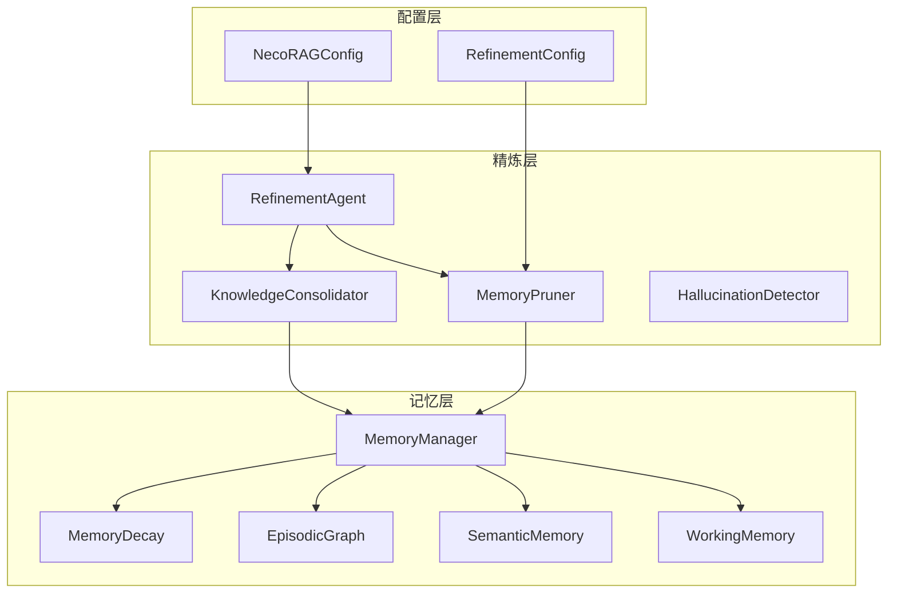
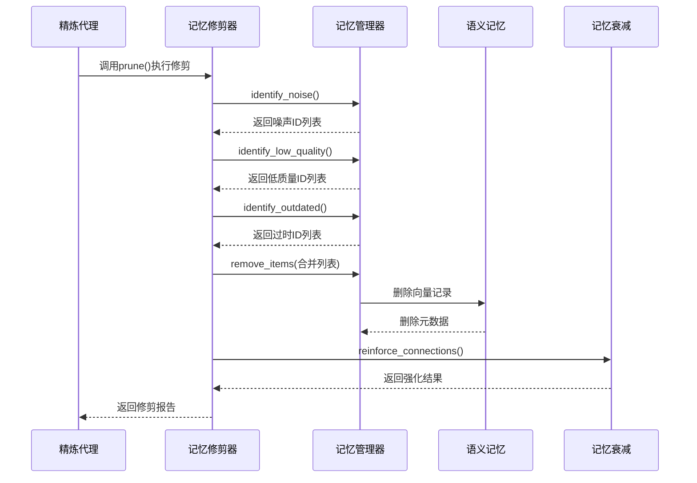
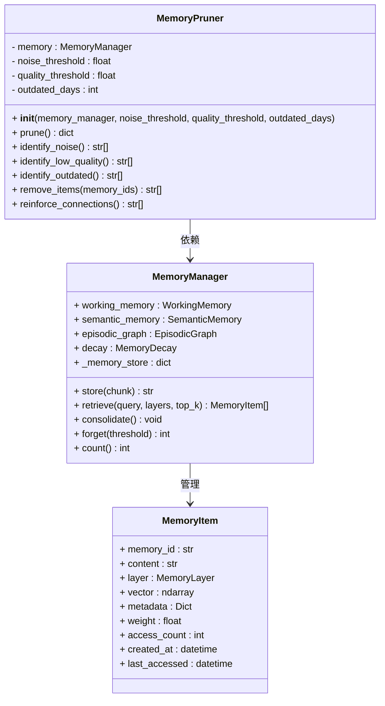
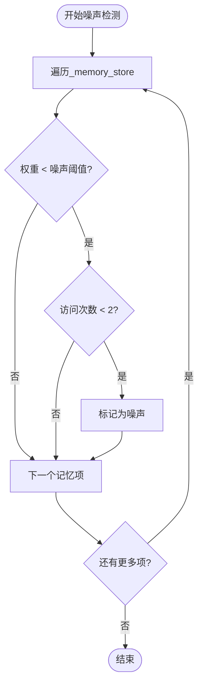
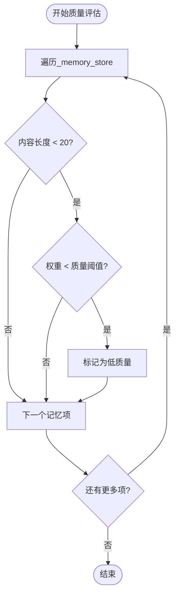
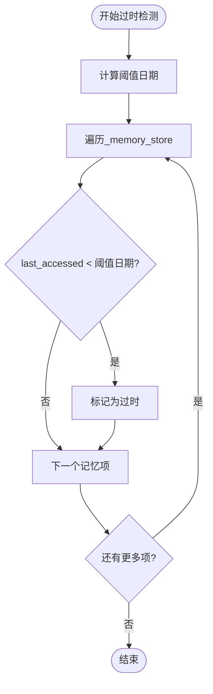
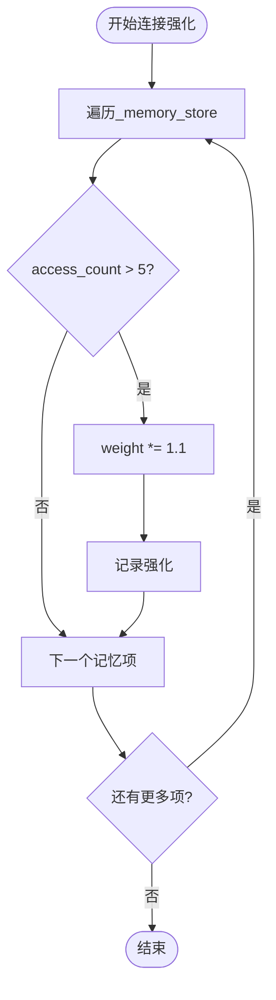
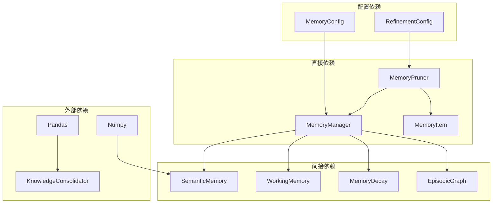

# 记忆修剪器

<cite>
**本文档引用的文件**
- [src/refinement/pruner.py](file://src/refinement/pruner.py)
- [src/refinement/agent.py](file://src/refinement/agent.py)
- [src/memory/manager.py](file://src/memory/manager.py)
- [src/memory/models.py](file://src/memory/models.py)
- [src/memory/semantic_memory.py](file://src/memory/semantic_memory.py)
- [src/core/config.py](file://src/core/config.py)
</cite>

## 目录
1. [简介](#简介)
2. [项目结构](#项目结构)
3. [核心组件](#核心组件)
4. [架构概览](#架构概览)
5. [详细组件分析](#详细组件分析)
6. [依赖分析](#依赖分析)
7. [性能考虑](#性能考虑)
8. [故障排除指南](#故障排除指南)
9. [结论](#结论)
10. [附录](#附录)

## 简介
记忆修剪器(MemoryPruner)是NecoRAG框架中负责维护和优化记忆系统的关键组件。它模拟猫的"舔毛梳理"行为，通过识别和清除噪声数据、低质量知识和过时信息，同时强化重要的连接，来维持记忆系统的高效运行。

该组件专注于长期记忆的清理和优化，确保只有高质量、相关性强且时效性良好的知识得以保留，从而提升整个系统的性能和准确性。

## 项目结构
记忆修剪器位于精炼层(refinement)中，与记忆管理层紧密协作：



**图表来源**
- [src/refinement/agent.py:20-64](file://src/refinement/agent.py#L20-L64)
- [src/refinement/pruner.py:10-39](file://src/refinement/pruner.py#L10-L39)
- [src/memory/manager.py:20-47](file://src/memory/manager.py#L20-L47)

## 核心组件
记忆修剪器包含以下核心功能模块：

### 主要特征
- **噪声识别**：基于权重和访问频率识别无用数据
- **质量评估**：通过内容长度和权重判断知识质量
- **时效性检查**：基于最后访问时间识别过时信息
- **智能删除**：安全地移除低价值记忆项
- **连接强化**：提升高频访问记忆的权重

### 配置参数
- `noise_threshold`：噪声判定阈值，默认0.1
- `quality_threshold`：质量判定阈值，默认0.3  
- `outdated_days`：过时天数判定，默认90天

**章节来源**
- [src/refinement/pruner.py:20-39](file://src/refinement/pruner.py#L20-L39)
- [src/core/config.py:198-204](file://src/core/config.py#L198-L204)

## 架构概览
记忆修剪器在整个NecoRAG系统中的位置和作用：



**图表来源**
- [src/refinement/agent.py:143-163](file://src/refinement/agent.py#L143-L163)
- [src/refinement/pruner.py:41-69](file://src/refinement/pruner.py#L41-L69)

## 详细组件分析

### MemoryPruner类设计
记忆修剪器采用面向对象的设计模式，实现了清晰的职责分离：



**图表来源**
- [src/refinement/pruner.py:10-157](file://src/refinement/pruner.py#L10-L157)
- [src/memory/manager.py:20-212](file://src/memory/manager.py#L20-L212)
- [src/memory/models.py:14-26](file://src/memory/models.py#L14-L26)

### 修剪策略实现
记忆修剪器采用多层评估策略：

#### 噪声检测算法
噪声检测基于双阈值策略，综合考虑权重和访问频率：



**图表来源**
- [src/refinement/pruner.py:71-85](file://src/refinement/pruner.py#L71-L85)

#### 低质量知识评估
低质量检测采用多维度评估机制：



**图表来源**
- [src/refinement/pruner.py:87-101](file://src/refinement/pruner.py#L87-L101)

#### 过时信息识别
过时检测基于时间窗口的判断机制：



**图表来源**
- [src/refinement/pruner.py:103-118](file://src/refinement/pruner.py#L103-L118)

### 数据一致性保证机制
系统通过以下机制确保数据一致性：

1. **原子性操作**：删除操作在语义记忆和统一存储中同时进行
2. **去重处理**：对重复的内存ID进行去重处理
3. **事务性保证**：确保删除操作的完整性

**章节来源**
- [src/refinement/pruner.py:120-137](file://src/refinement/pruner.py#L120-L137)

### 连接强化策略
当前实现采用简单的访问频率强化策略：



**图表来源**
- [src/refinement/pruner.py:139-156](file://src/refinement/pruner.py#L139-L156)

**章节来源**
- [src/refinement/pruner.py:139-156](file://src/refinement/pruner.py#L139-L156)

## 依赖分析
记忆修剪器的依赖关系和耦合度分析：



**图表来源**
- [src/refinement/pruner.py:6-39](file://src/refinement/pruner.py#L6-L39)
- [src/memory/manager.py:8-47](file://src/memory/manager.py#L8-L47)
- [src/core/config.py:136-156](file://src/core/config.py#L136-L156)

### 耦合度评估
- **内聚性**：高 - 专注于记忆修剪功能
- **耦合度**：中等 - 与MemoryManager紧密耦合但保持接口抽象
- **循环依赖**：无 - 依赖方向单一

**章节来源**
- [src/refinement/pruner.py:1-157](file://src/refinement/pruner.py#L1-L157)
- [src/memory/manager.py:1-212](file://src/memory/manager.py#L1-L212)

## 性能考虑
记忆修剪器的性能特性和优化建议：

### 时间复杂度
- **噪声识别**：O(n) - 遍历所有记忆项
- **质量评估**：O(n) - 单次扫描
- **时效性检查**：O(n) - 时间比较
- **整体复杂度**：O(n) - n为记忆项数量

### 空间复杂度
- **内存使用**：O(n) - 存储ID列表和临时数据
- **缓存策略**：无外部缓存，依赖内存存储

### 优化建议
1. **批量操作**：对删除操作进行批处理
2. **索引优化**：为访问时间和权重建立索引
3. **异步处理**：支持异步修剪操作
4. **增量修剪**：实现增量式修剪而非全量扫描

## 故障排除指南
常见问题和解决方案：

### 常见问题
1. **修剪结果为空**：检查记忆管理器中是否有有效的记忆项
2. **性能问题**：大量记忆项导致修剪操作耗时过长
3. **误删风险**：过于严格的阈值可能导致重要信息被删除
4. **连接强化无效**：访问频率阈值设置过高或过低

### 解决方案
1. **调试修剪过程**：通过日志输出检查每个阶段的识别结果
2. **调整阈值参数**：根据实际使用情况进行参数调优
3. **分批处理**：对于大量数据采用分批修剪策略
4. **监控执行状态**：建立修剪操作的监控和报警机制

**章节来源**
- [src/refinement/pruner.py:1-157](file://src/refinement/pruner.py#L1-L157)
- [src/memory/manager.py:1-212](file://src/memory/manager.py#L1-L212)

## 结论
记忆修剪系统通过智能化的算法设计和严格的执行流程，有效维护了NecoRAG框架中记忆库的质量和效率。系统采用多层次的修剪策略，结合噪声检测、质量评估和时效性检查，确保只有高质量的知识得以保留。

通过与记忆管理器的紧密协作，系统实现了数据一致性保证和性能优化。未来可以进一步完善连接强化算法，增加更多的质量评估维度，并优化大规模数据处理的性能表现。

## 附录

### 配置参数参考
| 参数名 | 类型 | 默认值 | 描述 |
|--------|------|--------|------|
| noise_threshold | float | 0.1 | 噪声判定阈值 |
| quality_threshold | float | 0.3 | 质量判定阈值 |
| outdated_days | int | 90 | 过时天数判定 |
| min_query_frequency | int | 5 | 最小查询频率阈值 |
| decay_rate | float | 0.1 | 衰减速率 |
| archive_threshold | float | 0.05 | 归档阈值 |

### 最佳实践指南
1. **定期监控**：建立定期的修剪报告监控机制
2. **阈值调优**：根据实际使用情况调整修剪阈值
3. **备份策略**：在执行大规模修剪前做好数据备份
4. **性能监控**：监控修剪操作的性能影响
5. **错误处理**：实施完善的错误处理和恢复机制

### 使用示例
记忆修剪器通常由精炼代理在后台任务中自动调用：

```python
# 在精炼代理中初始化和使用
pruner = MemoryPruner(memory_manager, noise_threshold=0.1, quality_threshold=0.3, outdated_days=90)
result = pruner.prune()
print(f"修剪完成：删除{result['removed_count']}项，强化{result['reinforced_count']}项")
```

**章节来源**
- [src/refinement/agent.py:143-163](file://src/refinement/agent.py#L143-L163)
- [src/refinement/pruner.py:41-69](file://src/refinement/pruner.py#L41-L69)