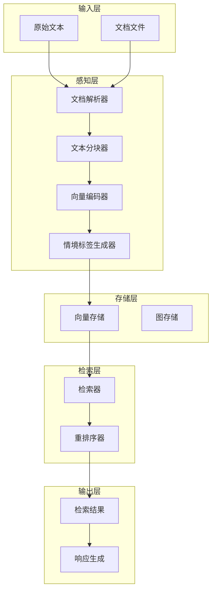
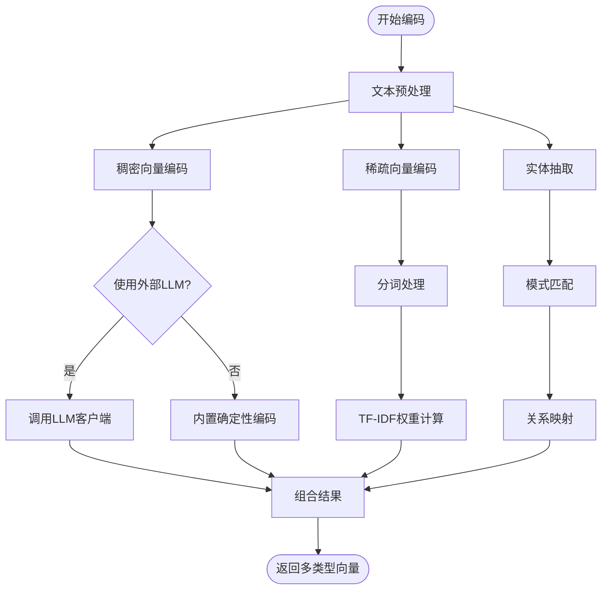
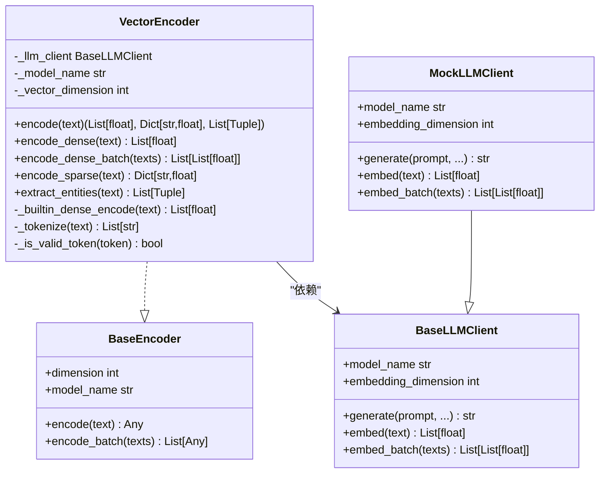
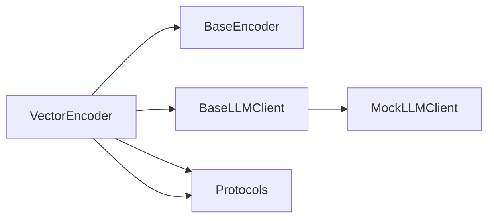

# 向量编码器 (VectorEncoder)

<cite>
**本文引用的文件**
- [src/perception/encoder.py](file://src/perception/encoder.py)
- [src/perception/models.py](file://src/perception/models.py)
- [src/core/base.py](file://src/core/base.py)
- [src/core/llm/base.py](file://src/core/llm/base.py)
- [src/core/llm/mock.py](file://src/core/llm/mock.py)
- [src/core/protocols.py](file://src/core/protocols.py)
- [example/example_usage.py](file://example/example_usage.py)
- [tests/test_core/test_protocols.py](file://tests/test_core/test_protocols.py)
- [wiki/wiki/核心架构设计/五层认知架构/感知层 (L1)/向量编码器.md](file://wiki/wiki/核心架构设计/五层认知架构/感知层 (L1)/向量编码器.md)
</cite>

## 目录
1. [简介](#简介)
2. [项目结构](#项目结构)
3. [核心组件](#核心组件)
4. [架构总览](#架构总览)
5. [详细组件分析](#详细组件分析)
6. [依赖分析](#依赖分析)
7. [性能考量](#性能考量)
8. [故障排查指南](#故障排查指南)
9. [结论](#结论)
10. [附录](#附录)

## 简介
本文件面向NecoRAG感知层的向量编码器(VectorEncoder)，系统性阐述其如何将文本内容转换为多类型向量表示，包括稠密向量(dense vector)与稀疏向量(sparse vector)，以及实体三元组(entity triples)的抽取流程。文档同时说明支持的向量化模型（如BGE-M3）及其特点，并给出在检索系统中的作用、不同编码策略对检索效果的影响、质量评估与调试方法，以及具体的使用示例与性能优化技巧。

## 项目结构
感知层围绕“文档解析-文本分块-向量编码-情境标签-存储-检索-响应”形成闭环。向量编码器位于感知层核心，负责将分块后的文本生成多类型向量与实体信息，供后续存储与检索使用。

图表来源
- [wiki/wiki/核心架构设计/五层认知架构/感知层 (L1)/向量编码器.md](file://wiki/wiki/核心架构设计/五层认知架构/感知层 (L1)/向量编码器.md)

章节来源
- [wiki/wiki/核心架构设计/五层认知架构/感知层 (L1)/向量编码器.md](file://wiki/wiki/核心架构设计/五层认知架构/感知层 (L1)/向量编码器.md)

## 核心组件
- VectorEncoder：负责生成稠密向量、稀疏向量与实体三元组，支持通过LLM客户端注入外部向量化实现，或回退到内置确定性编码。
- BaseEncoder：抽象基类，定义统一的编码接口与批处理约定。
- BaseLLMClient：抽象LLM客户端，提供embed/embed_batch等接口，MockLLMClient为其演示实现。
- Protocols：统一数据协议，定义Embedding、EncodedChunk等跨模块共享的数据结构。

章节来源
- [src/perception/encoder.py](file://src/perception/encoder.py)
- [src/core/base.py](file://src/core/base.py)
- [src/core/llm/base.py](file://src/core/llm/base.py)
- [src/core/llm/mock.py](file://src/core/llm/mock.py)
- [src/core/protocols.py](file://src/core/protocols.py)

## 架构总览
向量编码器在感知层中承担“多类型向量生成”的职责，既可对接外部LLM客户端，也可独立运行。其输出包括：
- 稠密向量：用于向量相似度检索
- 稀疏向量：基于TF-IDF风格的词频权重，便于关键词检索
- 实体三元组：(主体, 关系, 客体)，用于知识图谱构建与关系检索

图表来源
- [src/perception/encoder.py](file://src/perception/encoder.py)

章节来源
- [src/perception/encoder.py](file://src/perception/encoder.py)

## 详细组件分析

### VectorEncoder 类
- 角色定位：感知层的核心编码器，生成稠密向量、稀疏向量与实体三元组。
- 关键能力
  - encode：统一入口，返回(dense, sparse, entities)
  - encode_dense/encode_dense_batch：稠密向量生成，优先外部LLM客户端，否则内置确定性编码
  - encode_sparse：稀疏向量生成，基于分词与词频统计，归一化为权重
  - extract_entities：基于正则模式匹配抽取实体三元组
  - _builtin_dense_encode：内置确定性稠密向量生成（基于文本哈希）
  - _tokenize/_is_valid_token：中英文混合分词与停用词过滤
- 依赖注入：通过构造函数接收BaseLLMClient，若未提供则自动创建MockLLMClient作为回退

图表来源
- [src/perception/encoder.py](file://src/perception/encoder.py)
- [src/core/base.py](file://src/core/base.py)
- [src/core/llm/base.py](file://src/core/llm/base.py)
- [src/core/llm/mock.py](file://src/core/llm/mock.py)

章节来源
- [src/perception/encoder.py](file://src/perception/encoder.py)
- [src/core/base.py](file://src/core/base.py)
- [src/core/llm/base.py](file://src/core/llm/base.py)
- [src/core/llm/mock.py](file://src/core/llm/mock.py)

### 稠密向量(dense vector)生成
- 外部LLM客户端优先：若提供BaseLLMClient，则调用embed/embed_batch生成稠密向量
- 内置回退：若无LLM客户端，使用确定性伪向量生成，保证相同输入产生相同输出
- 维度控制：通过构造函数的vector_dimension参数设定

章节来源
- [src/perception/encoder.py](file://src/perception/encoder.py)
- [src/core/llm/mock.py](file://src/core/llm/mock.py)

### 稀疏向量(sparse vector)生成
- 分词策略：支持中英文混合，中文按字符片段切分，英文按单词切分
- 词频统计：过滤停用词与短词，统计词频并归一化为权重
- 输出格式：字典形式，键为token，值为权重

章节来源
- [src/perception/encoder.py](file://src/perception/encoder.py)

### 实体抽取与三元组生成
- 规则匹配：基于正则表达式匹配“A是B”、“A is B”、“A属于B”、“A包含B”等模式
- 关系映射：将匹配到的关系映射为标准化关系类型（如is_a、belongs_to、contains）
- 输出格式：三元组列表，每个元素为(subject, relation, object)

章节来源
- [src/perception/encoder.py](file://src/perception/encoder.py)

### 数据模型与协议
- Embedding：统一向量类型，包含dense_vector、sparse_vector、dimension、model_name等字段
- EncodedChunk：编码后的分块，包含dense_vector、sparse_vector、entities、context_tags等
- Protocols：统一枚举与数据结构，确保模块间数据一致性

章节来源
- [src/core/protocols.py](file://src/core/protocols.py)
- [src/perception/models.py](file://src/perception/models.py)
- [tests/test_core/test_protocols.py](file://tests/test_core/test_protocols.py)

### 使用示例与最佳实践
- 示例脚本展示了如何通过PerceptionEngine处理文本并获得编码块，其中包含稠密向量、稀疏向量与实体信息
- 建议在生产环境中提供真实LLM客户端以获得高质量稠密向量；在开发/演示阶段可使用MockLLMClient

章节来源
- [example/example_usage.py](file://example/example_usage.py)

## 依赖分析
- 组件耦合
  - VectorEncoder依赖BaseEncoder接口，确保可替换性
  - 通过BaseLLMClient抽象实现对外部向量化服务的解耦
  - 与Protocols协作，统一数据结构
- 可能的循环依赖
  - 当前模块间通过抽象接口耦合，未发现直接循环依赖
- 外部依赖
  - 可选numpy（HAS_NUMPY标志位），若不可用则使用纯Python实现
  - 正则表达式用于分词与实体抽取

图表来源
- [src/perception/encoder.py](file://src/perception/encoder.py)
- [src/core/base.py](file://src/core/base.py)
- [src/core/llm/base.py](file://src/core/llm/base.py)
- [src/core/llm/mock.py](file://src/core/llm/mock.py)
- [src/core/protocols.py](file://src/core/protocols.py)

章节来源
- [src/perception/encoder.py](file://src/perception/encoder.py)
- [src/core/base.py](file://src/core/base.py)
- [src/core/llm/base.py](file://src/core/llm/base.py)
- [src/core/llm/mock.py](file://src/core/llm/mock.py)
- [src/core/protocols.py](file://src/core/protocols.py)

## 性能考量
- 批量处理优化：提供encode_dense_batch，优先使用LLM客户端的批量接口，减少往返开销
- 稠密向量生成：外部LLM客户端通常具备缓存与批处理能力，建议在生产环境启用
- 稀疏向量生成：分词与词频统计为轻量操作，适合在线生成
- 相似度计算：系统使用余弦相似度进行向量相似度计算，注意向量归一化与维度一致性

章节来源
- [wiki/wiki/核心架构设计/五层认知架构/感知层 (L1)/向量编码器.md](file://wiki/wiki/核心架构设计/五层认知架构/感知层 (L1)/向量编码器.md)

## 故障排查指南
- 稠密向量为空或异常
  - 检查是否提供了有效的BaseLLMClient
  - 若使用MockLLMClient，请确认embedding_dim与后续存储/检索期望一致
- 稀疏向量为空
  - 检查输入文本是否包含有效token（过滤停用词与短词）
  - 确认分词逻辑是否正确处理中英文混合
- 实体抽取结果为空
  - 检查输入文本是否符合预期模式（如“是/is/属于/包含”等）
  - 可考虑增强规则或引入LLM客户端进行增强抽取
- 维度不一致
  - 确保VectorEncoder构造时的vector_dimension与存储/检索模块一致
  - 使用Protocols中的Embedding/EncodedChunk确保字段完整性

章节来源
- [src/perception/encoder.py](file://src/perception/encoder.py)
- [src/core/llm/mock.py](file://src/core/llm/mock.py)
- [src/core/protocols.py](file://src/core/protocols.py)

## 结论
VectorEncoder通过统一的抽象接口与灵活的依赖注入，实现了从文本到多类型向量与实体信息的高效转换。在检索系统中，稠密向量用于语义相似度检索，稀疏向量用于关键词检索，实体三元组用于关系建模与图谱检索。结合批量处理与合理的维度配置，可在保证检索质量的同时提升整体性能。

## 附录

### 支持的向量化模型与适用场景
- BGE-M3
  - 特点：多语言、语义理解能力强、适合通用检索
  - 适用场景：多语言文档检索、跨领域知识问答
- text-embedding-ada-002
  - 特点：OpenAI官方嵌入模型，质量稳定
  - 适用场景：高质量语义检索、对齐外部LLM输出

章节来源
- [src/dashboard/static/index.html](file://src/dashboard/static/index.html)

### 编码质量评估与调试方法
- 编码质量评估
  - 稠密向量：通过下游检索任务的召回率、准确率、MRR等指标评估
  - 稀疏向量：通过关键词匹配召回与相关性排序评估
  - 实体抽取：通过三元组召回率、精确率与F1评估
- 调试方法
  - 使用MockLLMClient进行端到端验证，确保流程正确
  - 对比不同模型与维度下的检索效果，选择最优配置
  - 利用调试面板与日志输出，定位分词、实体抽取与向量生成环节的问题

章节来源
- [src/core/llm/mock.py](file://src/core/llm/mock.py)
- [example/example_usage.py](file://example/example_usage.py)