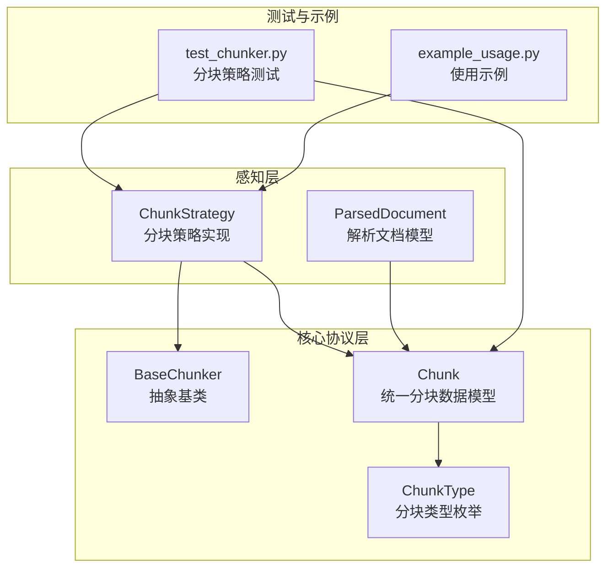
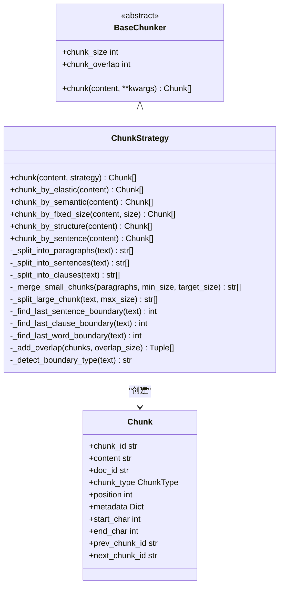
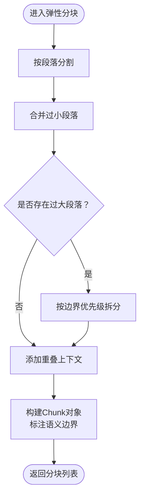
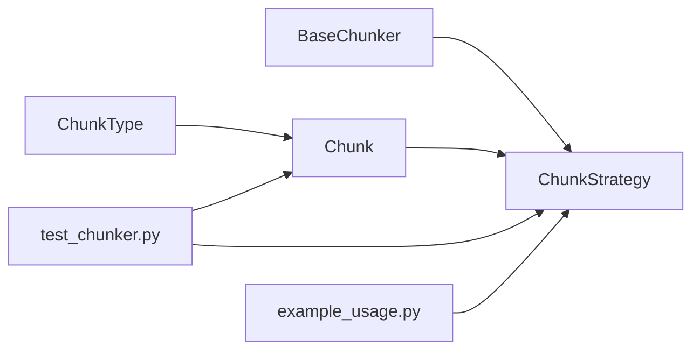

# 弹性分块策略 (ChunkStrategy)

<cite>
**本文档引用的文件**
- [chunker.py](file://src/perception/chunker.py)
- [base.py](file://src/core/base.py)
- [protocols.py](file://src/core/protocols.py)
- [models.py](file://src/perception/models.py)
- [test_chunker.py](file://tests/test_perception/test_chunker.py)
- [example_usage.py](file://example/example_usage.py)
</cite>

## 目录
1. [简介](#简介)
2. [项目结构](#项目结构)
3. [核心组件](#核心组件)
4. [架构总览](#架构总览)
5. [详细组件分析](#详细组件分析)
6. [依赖关系分析](#依赖关系分析)
7. [性能考量](#性能考量)
8. [故障排查指南](#故障排查指南)
9. [结论](#结论)
10. [附录](#附录)

## 简介
本文件面向NecoRAG的弹性分块策略（ChunkStrategy），系统性阐述其多策略分块能力与弹性算法原理。重点包括：
- 多种分块策略：弹性切割、语义切割、固定大小切割、结构化切割、句子级切割
- 弹性切割的智能算法：根据内容复杂度动态调整分块大小，处理段落边界与语义完整性
- 适用场景与性能特点：针对不同文档类型与检索需求给出策略选择建议
- 配置参数详解与最佳实践：涵盖关键参数含义、取值范围与调优建议
- 代码示例路径：通过测试与示例文件定位具体使用方式
- 对检索效果的影响与优化建议：从分块粒度、边界处理、重叠策略等方面提出优化思路

## 项目结构
与分块策略相关的代码主要位于感知层（perception）与核心协议层（core），并通过统一的Chunk数据模型进行跨模块传递。

**图表来源**
- [chunker.py:12-101](file://src/perception/chunker.py#L12-L101)
- [base.py:66-101](file://src/core/base.py#L66-L101)
- [protocols.py:101-117](file://src/core/protocols.py#L101-L117)
- [models.py:53-61](file://src/perception/models.py#L53-L61)
- [test_chunker.py:1-50](file://tests/test_perception/test_chunker.py#L1-L50)
- [example_usage.py:12-47](file://example/example_usage.py#L12-L47)

**章节来源**
- [chunker.py:1-101](file://src/perception/chunker.py#L1-L101)
- [base.py:66-101](file://src/core/base.py#L66-L101)
- [protocols.py:101-117](file://src/core/protocols.py#L101-L117)
- [models.py:53-61](file://src/perception/models.py#L53-L61)
- [test_chunker.py:1-50](file://tests/test_perception/test_chunker.py#L1-L50)
- [example_usage.py:12-47](file://example/example_usage.py#L12-L47)

## 核心组件
- ChunkStrategy：实现多种分块策略的统一入口与具体算法，继承自BaseChunker抽象基类
- BaseChunker：定义分块器的统一接口，提供chunk_size与chunk_overlap属性
- Chunk：统一的分块数据模型，包含content、chunk_type、position、metadata等字段
- ChunkType：分块类型枚举，涵盖FIXED、SEMANTIC、STRUCTURAL、ELASTIC、SENTENCE

关键职责：
- 统一分块入口：根据strategy参数路由到具体分块方法
- 弹性分块：按段落合并小块、按边界拆分大块、添加重叠上下文
- 其他策略：语义分块（段落）、固定大小分块（滑动窗口）、结构化分块（基于语义）、句子级分块

**章节来源**
- [chunker.py:12-101](file://src/perception/chunker.py#L12-L101)
- [base.py:66-101](file://src/core/base.py#L66-L101)
- [protocols.py:27-34](file://src/core/protocols.py#L27-L34)
- [protocols.py:101-117](file://src/core/protocols.py#L101-L117)

## 架构总览
ChunkStrategy在感知层中作为核心分块组件，向上提供统一的chunk接口，向下封装多种分块算法，并通过Chunk数据模型与各模块解耦。

**图表来源**
- [chunker.py:12-101](file://src/perception/chunker.py#L12-L101)
- [chunker.py:269-567](file://src/perception/chunker.py#L269-L567)
- [base.py:66-101](file://src/core/base.py#L66-L101)
- [protocols.py:101-117](file://src/core/protocols.py#L101-L117)

## 详细组件分析

### 统一分块入口与策略路由
- 默认策略：当strategy为None时，若enable_elastic为True则默认使用弹性分块，否则使用固定大小分块
- 策略映射：将字符串策略映射到对应的具体分块方法，支持"elastic"、"semantic"、"fixed"、"structural"、"sentence"
- 错误处理：不支持的策略会抛出ValueError

**章节来源**
- [chunker.py:49-85](file://src/perception/chunker.py#L49-L85)
- [test_chunker.py:131-138](file://tests/test_perception/test_chunker.py#L131-L138)

### 弹性分块（弹性切割）
弹性分块是ChunkStrategy的核心算法，旨在智能调整块大小以平衡检索质量与计算成本。

算法流程：
1. 按段落分割文本
2. 合并过小的段落（< min_chunk_size），避免碎片化
3. 拆分过大的段落（> max_chunk_size），按句子/子句/词边界优先切割
4. 添加重叠上下文，提升检索连贯性
5. 构建Chunk对象并标注语义边界类型

边界优先级：
- 句子边界：。！？.!?（中英文）
- 子句边界：，,；;、（中英文）
- 词边界：英文空格；中文按CJK比例估算
- 强制切割：在max_size附近强制切割

重叠策略：
- 除首块外，每块开头添加上一块末尾的overlap_size字符作为上下文

边界类型检测：
- paragraph：包含段落分隔符
- sentence：包含句子结束标点
- clause：包含子句标点
- forced：其他情况

**图表来源**
- [chunker.py:89-141](file://src/perception/chunker.py#L89-L141)
- [chunker.py:335-379](file://src/perception/chunker.py#L335-L379)
- [chunker.py:381-433](file://src/perception/chunker.py#L381-L433)
- [chunker.py:502-538](file://src/perception/chunker.py#L502-L538)
- [chunker.py:540-567](file://src/perception/chunker.py#L540-L567)

**章节来源**
- [chunker.py:89-141](file://src/perception/chunker.py#L89-L141)
- [chunker.py:335-379](file://src/perception/chunker.py#L335-L379)
- [chunker.py:381-433](file://src/perception/chunker.py#L381-L433)
- [chunker.py:502-538](file://src/perception/chunker.py#L502-L538)
- [chunker.py:540-567](file://src/perception/chunker.py#L540-L567)
- [test_chunker.py:144-183](file://tests/test_perception/test_chunker.py#L144-L183)

### 语义分块（按段落）
- 基于双换行符分割段落，保持语义完整性
- 适用于段落清晰的文档（如纯文本、Markdown）

**章节来源**
- [chunker.py:185-216](file://src/perception/chunker.py#L185-L216)
- [test_chunker.py:95-102](file://tests/test_perception/test_chunker.py#L95-L102)

### 固定大小分块（滑动窗口）
- 使用固定窗口大小与重叠长度进行滑动切割
- 适用于需要严格控制块大小的场景
- 支持自定义size参数覆盖默认chunk_size

**章节来源**
- [chunker.py:218-248](file://src/perception/chunker.py#L218-L248)
- [test_chunker.py:278-295](file://tests/test_perception/test_chunker.py#L278-L295)

### 结构化分块
- 基于语义分块实现，主要用于标识结构化文档（如带标题、段落的文档）
- 通过修改metadata中的chunk_strategy字段标识

**章节来源**
- [chunker.py:250-265](file://src/perception/chunker.py#L250-L265)
- [test_chunker.py:122-129](file://tests/test_perception/test_chunker.py#L122-L129)

### 句子级分块
- 按句子边界分割，每个句子作为独立块
- 支持中英文标点，适合需要精细粒度的检索场景

**章节来源**
- [chunker.py:143-183](file://src/perception/chunker.py#L143-L183)
- [chunker.py:286-314](file://src/perception/chunker.py#L286-L314)
- [test_chunker.py:113-120](file://tests/test_perception/test_chunker.py#L113-L120)

## 依赖关系分析
- 继承关系：ChunkStrategy继承BaseChunker，遵循统一接口
- 数据模型：Chunk统一承载分块内容与元数据，支持跨模块传递
- 测试覆盖：test_chunker.py覆盖初始化、策略路由、弹性分块、边界处理、参数影响等场景
- 示例集成：example_usage.py展示了PerceptionEngine中对分块策略的使用

**图表来源**
- [base.py:66-101](file://src/core/base.py#L66-L101)
- [chunker.py:12-101](file://src/perception/chunker.py#L12-L101)
- [protocols.py:101-117](file://src/core/protocols.py#L101-L117)
- [test_chunker.py:1-50](file://tests/test_perception/test_chunker.py#L1-L50)
- [example_usage.py:12-47](file://example/example_usage.py#L12-L47)

**章节来源**
- [base.py:66-101](file://src/core/base.py#L66-L101)
- [chunker.py:12-101](file://src/perception/chunker.py#L12-L101)
- [protocols.py:101-117](file://src/core/protocols.py#L101-L117)
- [test_chunker.py:1-50](file://tests/test_perception/test_chunker.py#L1-L50)
- [example_usage.py:12-47](file://example/example_usage.py#L12-L47)

## 性能考量
- 时间复杂度
  - 弹性分块：O(n)，其中n为文本长度；涉及多次正则匹配与边界查找，常数因子受边界类型影响
  - 固定大小分块：O(n)，线性扫描与切片操作
  - 句子级分块：O(n)，依赖句子边界正则
- 空间复杂度：O(n)，输出分块列表与中间临时结构
- 重叠策略：增加内存占用，但显著提升检索连贯性
- 参数调优
  - min_chunk_size：过小导致碎片化，过大导致信息丢失
  - target_chunk_size：平衡检索质量与向量库规模
  - max_chunk_size：防止超大块影响编码与检索性能
  - chunk_overlap：建议占target_chunk_size的10%-20%

[本节为通用性能讨论，无需特定文件来源]

## 故障排查指南
- 空文本或空白文本：返回空列表，属于正常行为
- 无效策略：抛出ValueError，检查strategy参数
- 中文/英文混合：算法内置中英文标点处理，若出现边界错位，可调整semantic_boundaries顺序
- 超长文本：弹性分块会强制在边界或max_size附近切割，确保可处理性
- 重叠异常：确认chunk_overlap不超过max_chunk_size，避免过度重叠

**章节来源**
- [chunker.py:107-108](file://src/perception/chunker.py#L107-L108)
- [chunker.py:82-83](file://src/perception/chunker.py#L82-L83)
- [test_chunker.py:366-387](file://tests/test_perception/test_chunker.py#L366-L387)

## 结论
ChunkStrategy通过统一接口与多策略实现，为NecoRAG提供了灵活高效的文本分块能力。弹性分块在保证语义完整性的前提下，动态调整块大小，兼顾检索质量与性能。结合合理的参数配置与边界处理策略，可在不同文档类型与检索场景中取得良好效果。

[本节为总结性内容，无需特定文件来源]

## 附录

### 配置参数详解与最佳实践
- chunk_size：固定大小分块的默认块大小（兼容模式使用）
- chunk_overlap：分块重叠长度，建议占目标块大小的10%-20%
- min_chunk_size：弹性分块最小块大小，避免碎片化
- target_chunk_size：弹性分块目标块大小，理想切割大小
- max_chunk_size：弹性分块最大块大小，超过则强制切割
- enable_elastic：是否启用弹性切割
- semantic_boundaries：语义边界优先级列表，如["paragraph","sentence","clause"]

最佳实践建议：
- 短文本（<1KB）：固定大小分块，chunk_size=512，overlap=50
- 中等文本（1KB-10KB）：弹性分块，min=512，target=1024，max=2048
- 长文本（>10KB）：弹性分块，min=1024，target=2048，max=4096
- 结构化文档：语义分块或结构化分块，保持段落与标题的完整性
- 检索密集型场景：适当增大overlap，提升召回率
- 向量库规模敏感场景：减小target_chunk_size，降低存储与计算开销

**章节来源**
- [chunker.py:19-47](file://src/perception/chunker.py#L19-L47)
- [test_chunker.py:495-531](file://tests/test_perception/test_chunker.py#L495-L531)

### 代码示例路径
- 统一入口调用：参见[chunker.py:49-85](file://src/perception/chunker.py#L49-L85)
- 弹性分块：参见[chunker.py:89-141](file://src/perception/chunker.py#L89-L141)
- 语义分块：参见[chunker.py:185-216](file://src/perception/chunker.py#L185-L216)
- 固定大小分块：参见[chunker.py:218-248](file://src/perception/chunker.py#L218-L248)
- 结构化分块：参见[chunker.py:250-265](file://src/perception/chunker.py#L250-L265)
- 句子级分块：参见[chunker.py:143-183](file://src/perception/chunker.py#L143-L183)
- 使用示例：参见[example_usage.py:12-47](file://example/example_usage.py#L12-L47)

**章节来源**
- [chunker.py:49-85](file://src/perception/chunker.py#L49-L85)
- [chunker.py:89-141](file://src/perception/chunker.py#L89-L141)
- [chunker.py:185-216](file://src/perception/chunker.py#L185-L216)
- [chunker.py:218-248](file://src/perception/chunker.py#L218-L248)
- [chunker.py:250-265](file://src/perception/chunker.py#L250-L265)
- [chunker.py:143-183](file://src/perception/chunker.py#L143-L183)
- [example_usage.py:12-47](file://example/example_usage.py#L12-L47)

### 分块策略对检索效果的影响与优化建议
- 粒度与召回：过细的块可能导致语义割裂，过粗的块可能降低相关性；弹性分块在两者间取得平衡
- 边界处理：优先按句子/段落边界切割，减少语义断裂
- 重叠策略：适度重叠有助于跨块检索连贯性，但需权衡存储与性能
- 向量编码：块大小直接影响向量维度与相似度计算，建议与下游嵌入模型维度匹配
- 后续优化：结合检索器的融合与重排序策略，进一步提升整体检索质量

[本节为通用优化建议，无需特定文件来源]