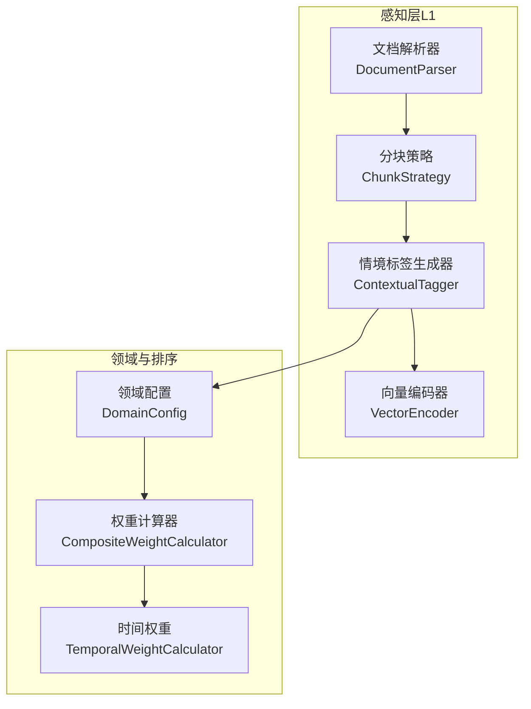
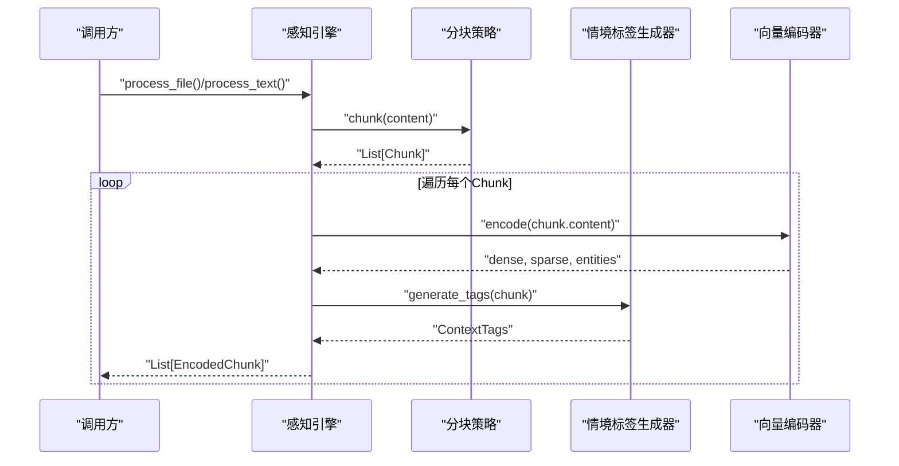
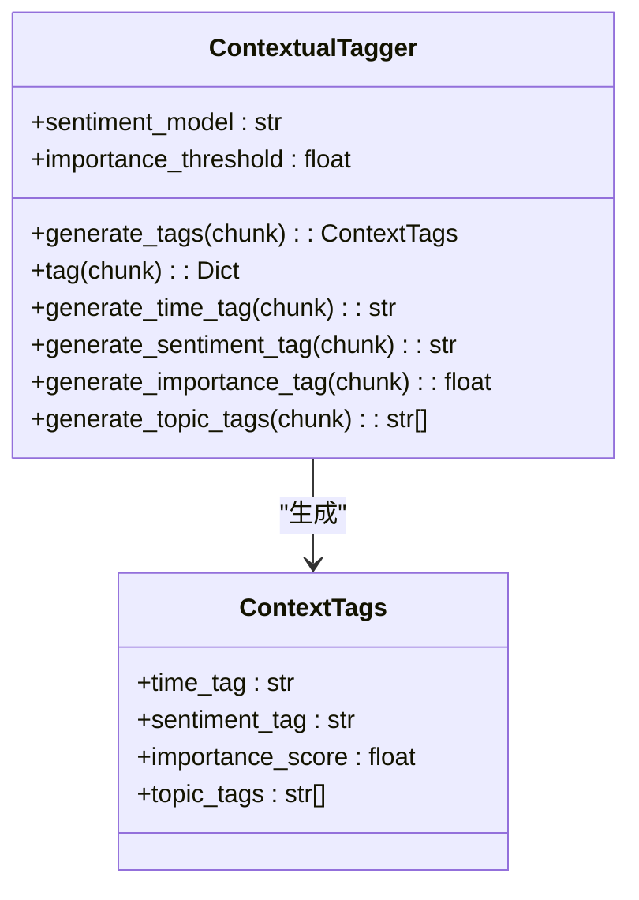
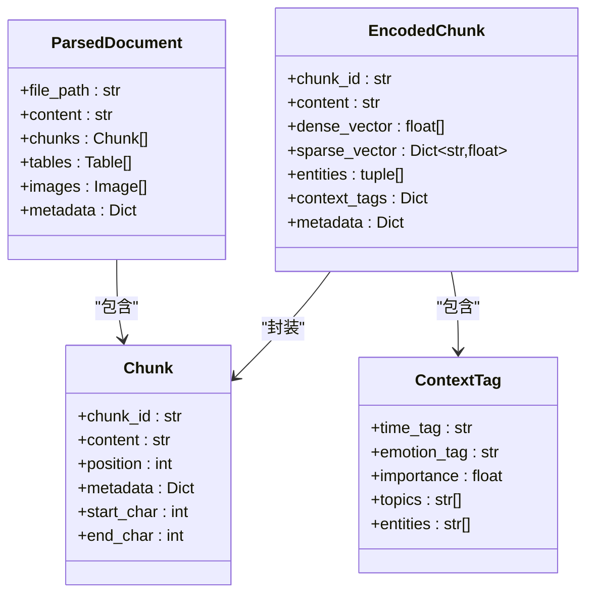
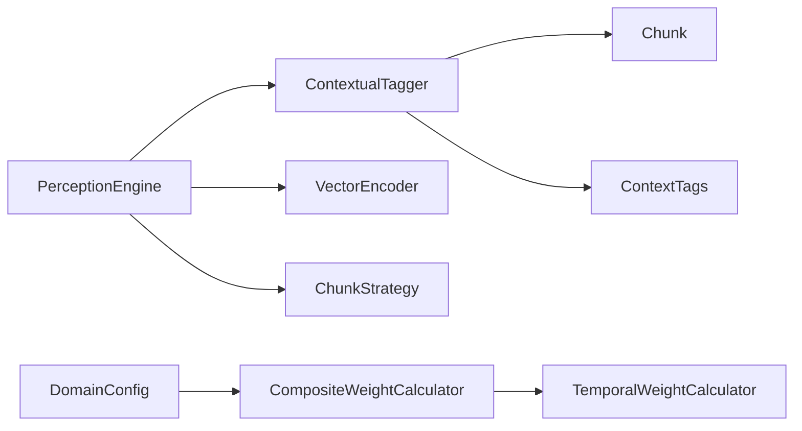

# 情境标签生成器（ContextualTagger）

<cite>
**本文档引用的文件**
- [src/perception/tagger.py](file://src/perception/tagger.py)
- [src/perception/engine.py](file://src/perception/engine.py)
- [src/perception/models.py](file://src/perception/models.py)
- [src/perception/chunker.py](file://src/perception/chunker.py)
- [src/perception/encoder.py](file://src/perception/encoder.py)
- [src/core/base.py](file://src/core/base.py)
- [src/core/protocols.py](file://src/core/protocols.py)
- [src/domain/relevance.py](file://src/domain/relevance.py)
- [src/domain/temporal_weight.py](file://src/domain/temporal_weight.py)
- [src/domain/weight_calculator.py](file://src/domain/weight_calculator.py)
- [src/domain/config.py](file://src/domain/config.py)
- [example/example_usage.py](file://example/example_usage.py)
- [example/domain_weight_example.py](file://example/domain_weight_example.py)
- [tests/test_core/test_protocols.py](file://tests/test_core/test_protocols.py)
</cite>

## 目录
1. [简介](#简介)
2. [项目结构](#项目结构)
3. [核心组件](#核心组件)
4. [架构总览](#架构总览)
5. [详细组件分析](#详细组件分析)
6. [依赖关系分析](#依赖关系分析)
7. [性能考量](#性能考量)
8. [故障排查指南](#故障排查指南)
9. [结论](#结论)
10. [附录](#附录)

## 简介
本文件系统性阐述NecoRAG情境标签生成器（ContextualTagger）的设计与实现，覆盖时间标签、情感标签、重要性评分与主题标签的生成机制；解释基于关键词统计、信息密度与高频词统计的特征工程方法；梳理标签系统在感知层与后续检索排序中的应用价值，并提供可扩展的实现建议与性能优化策略。

## 项目结构
情境标签生成器位于感知层（L1），与文档解析、分块、向量编码、领域权重系统协同工作，形成从原始文档到可检索向量与情境标签的完整流水线。

**图表来源**
- [src/perception/engine.py:20-195](file://src/perception/engine.py#L20-L195)
- [src/perception/tagger.py:11-163](file://src/perception/tagger.py#L11-L163)
- [src/perception/encoder.py:25-255](file://src/perception/encoder.py#L25-L255)
- [src/domain/weight_calculator.py:81-205](file://src/domain/weight_calculator.py#L81-L205)

**章节来源**
- [src/perception/engine.py:20-195](file://src/perception/engine.py#L20-L195)
- [src/perception/tagger.py:11-163](file://src/perception/tagger.py#L11-L163)
- [src/perception/encoder.py:25-255](file://src/perception/encoder.py#L25-L255)

## 核心组件
- 情境标签生成器（ContextualTagger）：为每个文本块生成时间、情感、重要性与主题标签，提供统一接口与模块特有数据结构。
- 数据模型：包含模块特有情境标签（ContextTags）与通用协议（ContextTag），用于跨模块传递。
- 感知引擎：编排解析、分块、打标与编码流程，负责将标签注入编码块。
- 领域权重系统：结合时间权重、关键字权重与领域权重，对检索结果进行综合排序加权。

**章节来源**
- [src/perception/tagger.py:11-163](file://src/perception/tagger.py#L11-L163)
- [src/perception/models.py:14-62](file://src/perception/models.py#L14-L62)
- [src/core/protocols.py:120-127](file://src/core/protocols.py#L120-L127)
- [src/perception/engine.py:20-195](file://src/perception/engine.py#L20-L195)

## 架构总览
情境标签生成器在感知引擎中被实例化并调用，依次完成以下步骤：
1. 文档解析与分块
2. 向量编码（稠密/稀疏/实体）
3. 情境标签生成（时间/情感/重要性/主题）
4. 标签注入编码块，供后续检索与排序使用

**图表来源**
- [src/perception/engine.py:96-154](file://src/perception/engine.py#L96-L154)
- [src/perception/tagger.py:33-48](file://src/perception/tagger.py#L33-L48)
- [src/perception/encoder.py:73-87](file://src/perception/encoder.py#L73-L87)

## 详细组件分析

### 情境标签生成器（ContextualTagger）
- 功能职责
  - 时间标签：从Chunk元数据提取创建时间，若无则标记为“未知”。
  - 情感标签：基于关键词集合进行简单统计，输出积极/消极/中性。
  - 重要性评分：基于文本长度与词汇多样性，归一化得到0-1区间分数。
  - 主题标签：统计高频词（过滤短词），返回前若干个高频词作为主题标签。
- 特征工程要点
  - 情感标签：关键词集合（中英文混合），通过计数比较决定极性。
  - 重要性评分：信息密度（独特词占比）与长度因子的加权平均。
  - 主题标签：基于词频统计，过滤短词以减少噪声。
- 置信度评估
  - 情感标签：基于匹配到的关键词数量与分布，提供置信度说明（可扩展）。
  - 重要性评分：基于密度与长度的稳定性，提供相对置信度。
- 应用场景
  - 检索前筛选：高重要性块优先参与检索。
  - 排序加权：结合领域权重与时间权重，提升相关高价值内容的排名。

**图表来源**
- [src/perception/tagger.py:11-163](file://src/perception/tagger.py#L11-L163)
- [src/perception/models.py:14-21](file://src/perception/models.py#L14-L21)

**章节来源**
- [src/perception/tagger.py:11-163](file://src/perception/tagger.py#L11-L163)
- [src/perception/models.py:14-21](file://src/perception/models.py#L14-L21)

### 数据模型（Models）
- Chunk：文本块，包含内容、索引、字符起止位置与元数据。
- EncodedChunk：编码后的文本块，包含稠密向量、稀疏向量、实体三元组、情境标签与元数据。
- ParsedDocument：解析后的文档，包含文件路径、内容、块列表、表格、图片与元数据。
- Table/Image：表格与图片数据结构（用于扩展）。

**图表来源**
- [src/core/protocols.py:101-127](file://src/core/protocols.py#L101-L127)
- [src/perception/models.py:24-62](file://src/perception/models.py#L24-L62)

**章节来源**
- [src/core/protocols.py:101-127](file://src/core/protocols.py#L101-L127)
- [src/perception/models.py:24-62](file://src/perception/models.py#L24-L62)

### 标签系统层次结构与传播机制
- 层次结构
  - 时间标签：文档元数据驱动，体现时效性。
  - 情感标签：基于关键词统计，反映文本倾向。
  - 重要性评分：基于信息密度与长度，衡量内容价值。
  - 主题标签：基于高频词统计，形成主题指纹。
- 传播机制
  - 通过Chunk边界重叠，相邻块共享上下文，提升主题一致性。
  - 通过实体三元组（编码器提取）建立实体-关系-实体的轻量知识图谱，辅助主题传播。
  - 通过领域权重系统，将高价值主题与高时效内容在排序阶段进一步放大。

**章节来源**
- [src/perception/chunker.py:502-538](file://src/perception/chunker.py#L502-L538)
- [src/perception/encoder.py:149-190](file://src/perception/encoder.py#L149-L190)
- [src/domain/weight_calculator.py:122-146](file://src/domain/weight_calculator.py#L122-L146)

### 标签生成流程与质量评估
- 标签生成流程
  - 输入：Chunk对象（包含内容与元数据）
  - 输出：ContextTags对象（时间、情感、重要性、主题）
- 质量评估
  - 情感标签：基于匹配到的关键词数量与分布，提供置信度说明（可扩展）。
  - 重要性评分：基于密度与长度的稳定性，提供相对置信度。
- 使用示例
  - 在感知引擎中，每处理一个Chunk即生成标签并注入EncodedChunk，供后续检索与排序使用。

**章节来源**
- [src/perception/tagger.py:33-48](file://src/perception/tagger.py#L33-L48)
- [src/perception/engine.py:111-134](file://src/perception/engine.py#L111-L134)
- [example/example_usage.py:12-47](file://example/example_usage.py#L12-L47)

## 依赖关系分析
- 组件耦合
  - ContextualTagger依赖Chunk与ContextTags，遵循统一协议层的Chunk与ContextTag。
  - 感知引擎将标签生成与向量编码串联，形成端到端流水线。
- 外部依赖
  - 领域权重系统（DomainConfig、CompositeWeightCalculator、TemporalWeightCalculator）用于检索排序阶段的加权。
- 潜在循环依赖
  - 当前模块间为单向依赖（解析→分块→打标→编码），未发现循环依赖。

**图表来源**
- [src/perception/tagger.py:7-8](file://src/perception/tagger.py#L7-L8)
- [src/perception/engine.py:11-13](file://src/perception/engine.py#L11-L13)
- [src/domain/weight_calculator.py:81-205](file://src/domain/weight_calculator.py#L81-L205)

**章节来源**
- [src/perception/tagger.py:7-8](file://src/perception/tagger.py#L7-L8)
- [src/perception/engine.py:11-13](file://src/perception/engine.py#L11-L13)
- [src/domain/weight_calculator.py:81-205](file://src/domain/weight_calculator.py#L81-L205)

## 性能考量
- 标签生成复杂度
  - 情感标签：O(n)扫描内容，n为词数。
  - 重要性评分：O(n)词频统计与归一化。
  - 主题标签：O(n log n)词频统计与排序，k为唯一词数。
- 批量处理
  - 可在感知引擎中对Chunk列表进行批处理，减少重复初始化成本。
- 缓存策略
  - 对于静态关键词集合与元数据，可缓存以降低重复计算。
- 优化建议
  - 使用更高效的分词与词频统计库（如基于Trie的统计）。
  - 对长文档采用分段采样策略，避免全量排序带来的开销。
  - 将情感关键词与停用词表预编译为集合，提升查找效率。

[本节为通用性能讨论，无需特定文件分析]

## 故障排查指南
- 常见问题
  - 情感标签始终为中性：检查输入文本是否包含关键词集合，确认大小写与分词处理。
  - 重要性评分为0：检查文本为空或分词失败，确认长度与唯一词数计算。
  - 主题标签为空：检查短词过滤阈值与分词结果，适当降低阈值或改进分词。
- 单元测试参考
  - ContextTag数据类默认值与赋值正确性测试，可用于验证标签字段的初始化与赋值行为。

**章节来源**
- [tests/test_core/test_protocols.py:182-209](file://tests/test_core/test_protocols.py#L182-L209)

## 结论
情境标签生成器通过简单而高效的方法实现了时间、情感、重要性与主题标签的生成，为后续检索与排序提供了关键的上下文信号。结合领域权重系统与向量编码，标签在提升检索相关性与准确性方面具有显著价值。建议在生产环境中引入更丰富的特征与可配置的规则，以适配多样化的业务场景。

[本节为总结性内容，无需特定文件分析]

## 附录

### 标签类型与配置参数
- 标签类型
  - 时间标签：来源于Chunk元数据，若无则标记为“未知”。
  - 情感标签：基于关键词集合（积极/消极）统计，输出积极/消极/中性。
  - 重要性评分：基于信息密度与长度因子的加权平均，范围[0,1]。
  - 主题标签：基于高频词统计，过滤短词后返回前若干个标签。
- 配置参数
  - 情感模型：预留参数，当前实现为关键词统计。
  - 重要性阈值：用于后续筛选或分类（当前实现未直接使用）。

**章节来源**
- [src/perception/tagger.py:18-31](file://src/perception/tagger.py#L18-L31)
- [src/perception/tagger.py:68-162](file://src/perception/tagger.py#L68-L162)

### 与向量编码的关系
- 标签与向量的结合
  - 情境标签作为元信息注入EncodedChunk，与稠密/稀疏向量、实体三元组共同构成编码块。
  - 标签可用于检索前筛选与排序加权，向量用于相似度匹配。
- 标签对检索的影响
  - 重要性评分可作为候选集筛选因子，减少向量计算压力。
  - 主题标签与实体三元组可与向量检索结果进行语义增强与去重。

**章节来源**
- [src/perception/engine.py:111-134](file://src/perception/engine.py#L111-L134)
- [src/perception/encoder.py:73-87](file://src/perception/encoder.py#L73-L87)

### 领域权重与情境标签的协同
- 综合权重计算
  - 关键字权重、时间权重、领域权重与自定义权重相乘，形成最终排序权重。
  - 时间权重支持分层权重与指数衰减，领域权重根据领域等级映射到权重阈值。
- 情境标签的作用
  - 重要性评分与主题标签可作为领域相关性与关键字密度的补充信号，提升排序的鲁棒性。

**章节来源**
- [src/domain/weight_calculator.py:89-129](file://src/domain/weight_calculator.py#L89-L129)
- [src/domain/temporal_weight.py:84-109](file://src/domain/temporal_weight.py#L84-L109)
- [src/domain/relevance.py:180-196](file://src/domain/relevance.py#L180-L196)