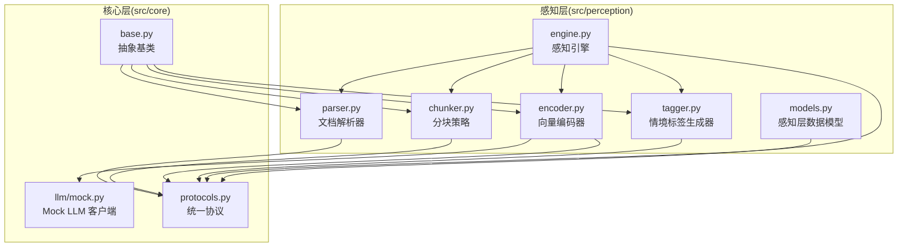
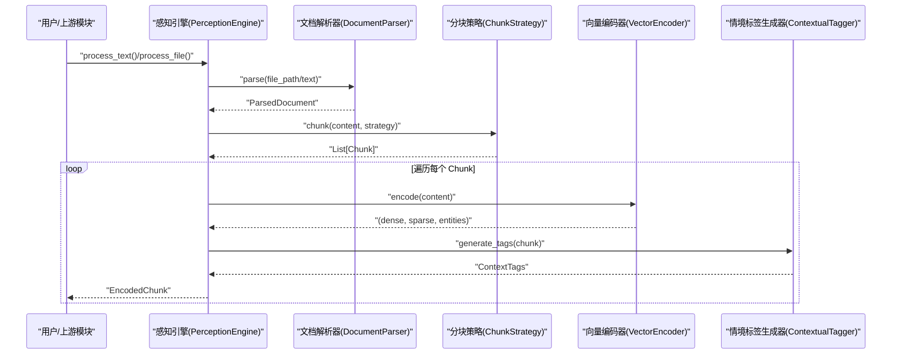
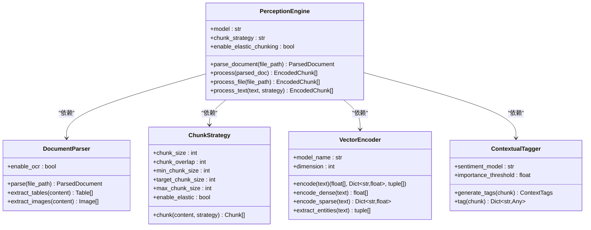
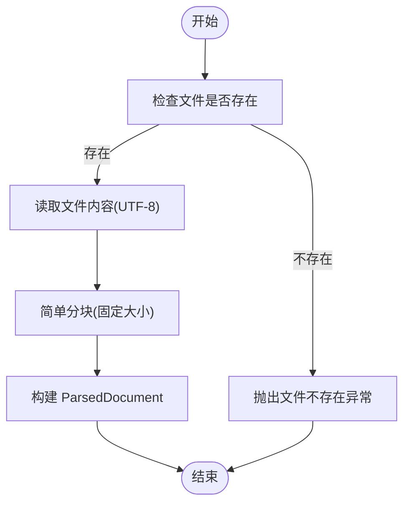
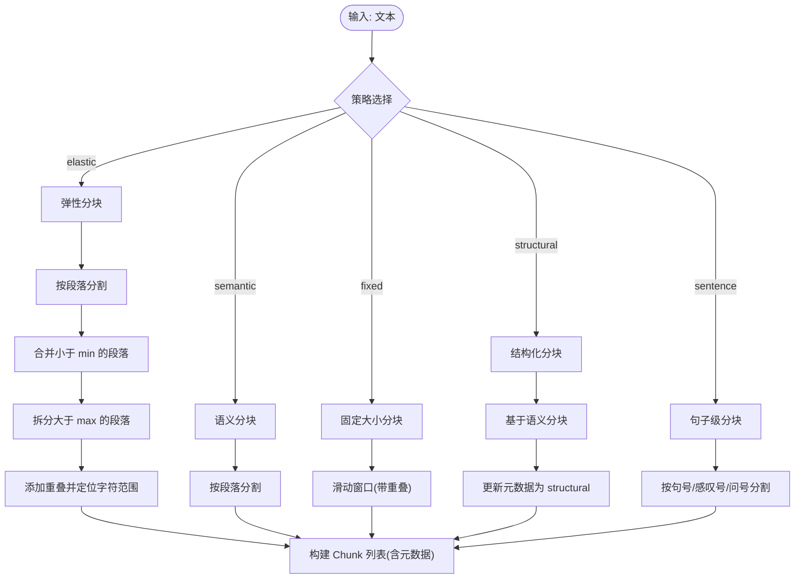
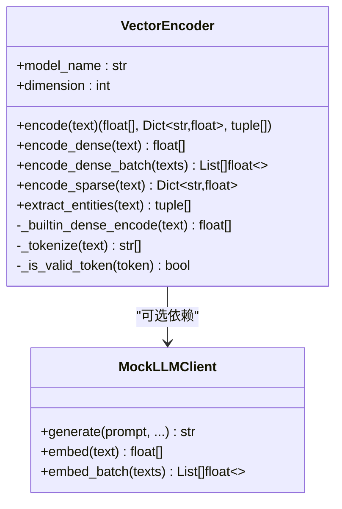
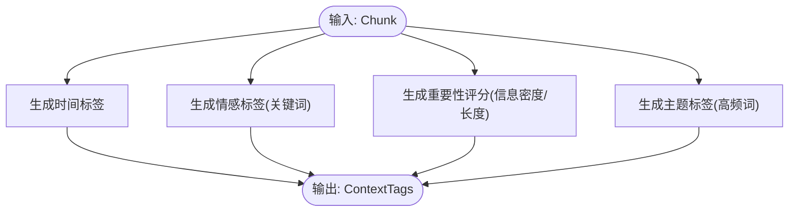
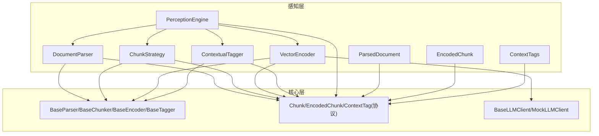

# 感知层 (L1) - 信息接收与预处理

<cite>
**本文引用的文件**
- [src/perception/__init__.py](file://src/perception/__init__.py)
- [src/perception/engine.py](file://src/perception/engine.py)
- [src/perception/parser.py](file://src/perception/parser.py)
- [src/perception/chunker.py](file://src/perception/chunker.py)
- [src/perception/encoder.py](file://src/perception/encoder.py)
- [src/perception/tagger.py](file://src/perception/tagger.py)
- [src/perception/models.py](file://src/perception/models.py)
- [src/core/base.py](file://src/core/base.py)
- [src/core/protocols.py](file://src/core/protocols.py)
- [src/core/llm/mock.py](file://src/core/llm/mock.py)
- [example/example_usage.py](file://example/example_usage.py)
- [tests/test_perception/test_chunker.py](file://tests/test_perception/test_chunker.py)
- [src/perception/README.md](file://src/perception/README.md)
</cite>

## 目录
1. [引言](#引言)
2. [项目结构](#项目结构)
3. [核心组件](#核心组件)
4. [架构总览](#架构总览)
5. [详细组件分析](#详细组件分析)
6. [依赖关系分析](#依赖关系分析)
7. [性能考量](#性能考量)
8. [故障排查指南](#故障排查指南)
9. [结论](#结论)
10. [附录](#附录)

## 引言
感知层（L1）是 NecoRAG 的“信息接收与预处理”中枢，负责将多模态输入转化为可用于后续记忆层、检索层与巩固层的高质量结构化数据。它模拟人类大脑对外界信息的接收与初步处理过程，通过文档解析、弹性分块、向量编码与情境标签生成，形成“内容 + 多维向量 + 上下文标签”的统一编码单元，为整个认知架构提供稳定、可扩展的输入。

## 项目结构
感知层相关代码集中于 src/perception 目录，配合 src/core 的抽象基类与统一协议，确保跨模块一致性与可替换性。主要文件职责如下：
- engine.py：感知引擎主类，编排解析、分块、编码与打标流程
- parser.py：文档解析器，将多格式文档转为统一结构
- chunker.py：分块策略，支持弹性/语义/固定/结构/句子等多种模式
- encoder.py：向量编码器，生成稠密/稀疏向量与实体三元组
- tagger.py：情境标签生成器，为每个块附加时间/情感/重要性/主题标签
- models.py：感知层专用数据模型（本地编码块、表格、图片等）
- __init__.py：统一导出感知层公共接口

图表来源
- [src/perception/engine.py:20-195](file://src/perception/engine.py#L20-L195)
- [src/perception/parser.py:12-113](file://src/perception/parser.py#L12-L113)
- [src/perception/chunker.py:12-567](file://src/perception/chunker.py#L12-L567)
- [src/perception/encoder.py:25-255](file://src/perception/encoder.py#L25-L255)
- [src/perception/tagger.py:11-163](file://src/perception/tagger.py#L11-L163)
- [src/perception/models.py:14-62](file://src/perception/models.py#L14-L62)
- [src/core/base.py:32-160](file://src/core/base.py#L32-L160)
- [src/core/protocols.py:100-156](file://src/core/protocols.py#L100-L156)
- [src/core/llm/mock.py:16-313](file://src/core/llm/mock.py#L16-L313)

章节来源
- [src/perception/__init__.py:1-27](file://src/perception/__init__.py#L1-L27)
- [src/perception/README.md:1-158](file://src/perception/README.md#L1-L158)

## 核心组件
- 感知引擎（PerceptionEngine）：统一编排入口，协调解析、分块、编码与打标，并产出 EncodedChunk 列表
- 文档解析器（DocumentParser）：将多格式文档解析为统一结构化表示，支持 OCR、表格与图片提取（预留）
- 分块策略（ChunkStrategy）：提供弹性/语义/固定/结构/句子分块，兼顾语义完整性与性能
- 向量编码器（VectorEncoder）：生成稠密向量、稀疏向量与实体三元组，支持 LLM 客户端或内置实现
- 情境标签生成器（ContextualTagger）：为每个块生成时间、情感、重要性与主题标签
- 数据模型（ParsedDocument、EncodedChunk、ContextTags 等）：统一数据结构，确保跨模块一致

章节来源
- [src/perception/engine.py:20-195](file://src/perception/engine.py#L20-L195)
- [src/perception/parser.py:12-113](file://src/perception/parser.py#L12-L113)
- [src/perception/chunker.py:12-567](file://src/perception/chunker.py#L12-L567)
- [src/perception/encoder.py:25-255](file://src/perception/encoder.py#L25-L255)
- [src/perception/tagger.py:11-163](file://src/perception/tagger.py#L11-L163)
- [src/perception/models.py:14-62](file://src/perception/models.py#L14-L62)

## 架构总览
感知层在 NecoRAG 五层架构中处于最底层，承担“输入 → 结构化 → 编码 → 打标”的职责，输出的 EncodedChunk 为后续检索与记忆提供高质量特征。

图表来源
- [src/perception/engine.py:77-194](file://src/perception/engine.py#L77-L194)
- [src/perception/parser.py:28-60](file://src/perception/parser.py#L28-L60)
- [src/perception/chunker.py:49-85](file://src/perception/chunker.py#L49-L85)
- [src/perception/encoder.py:73-87](file://src/perception/encoder.py#L73-L87)
- [src/perception/tagger.py:33-48](file://src/perception/tagger.py#L33-L48)

## 详细组件分析

### 感知引擎（PerceptionEngine）
- 职责：统一编排解析、分块、编码与打标；支持文件与纯文本两种输入；提供一站式处理接口
- 关键能力：
  - 解析文档：调用 DocumentParser，返回 ParsedDocument
  - 分块策略：委托 ChunkStrategy，支持弹性/语义/固定/结构/句子
  - 编码：调用 VectorEncoder 生成稠密/稀疏向量与实体三元组
  - 打标：调用 ContextualTagger 生成时间/情感/重要性/主题标签
  - 输出：封装为 EncodedChunk，携带元数据与上下文信息
- 配置项：模型名、分块大小/重叠、弹性分块参数、默认策略、是否启用 OCR 等

图表来源
- [src/perception/engine.py:20-195](file://src/perception/engine.py#L20-L195)
- [src/perception/parser.py:12-113](file://src/perception/parser.py#L12-L113)
- [src/perception/chunker.py:12-567](file://src/perception/chunker.py#L12-L567)
- [src/perception/encoder.py:25-255](file://src/perception/encoder.py#L25-L255)
- [src/perception/tagger.py:11-163](file://src/perception/tagger.py#L11-L163)

章节来源
- [src/perception/engine.py:28-194](file://src/perception/engine.py#L28-L194)

### 文档解析器（DocumentParser）
- 职责：将多格式文档解析为统一结构化表示，支持 OCR、表格与图片提取（预留）
- 当前实现：读取文本文件，简单分块；表格/图片提取为占位实现
- 扩展点：集成 RAGFlow 进行深度解析，启用 OCR，表格结构还原与图片识别

图表来源
- [src/perception/parser.py:28-60](file://src/perception/parser.py#L28-L60)
- [src/perception/parser.py:92-112](file://src/perception/parser.py#L92-L112)

章节来源
- [src/perception/parser.py:12-113](file://src/perception/parser.py#L12-L113)

### 分块策略（ChunkStrategy）
- 职责：提供多种分块模式，兼顾语义完整性与性能
- 支持策略：
  - 弹性分块（elastic）：按段落合并小块、拆分大块、添加重叠，智能控制块大小
  - 语义分块（semantic）：按段落保持语义边界
  - 固定大小分块（fixed）：滑动窗口，支持重叠
  - 结构化分块（structural）：基于段落/标题等结构
  - 句子级分块（sentence）：按中英文句号/感叹号/问号分割
- 辅助方法：段落/句子/子句分割、边界检测、重叠拼接、强制词边界切割

图表来源
- [src/perception/chunker.py:49-85](file://src/perception/chunker.py#L49-L85)
- [src/perception/chunker.py:89-141](file://src/perception/chunker.py#L89-L141)
- [src/perception/chunker.py:185-216](file://src/perception/chunker.py#L185-L216)
- [src/perception/chunker.py:218-248](file://src/perception/chunker.py#L218-L248)
- [src/perception/chunker.py:250-265](file://src/perception/chunker.py#L250-L265)
- [src/perception/chunker.py:143-183](file://src/perception/chunker.py#L143-L183)

章节来源
- [src/perception/chunker.py:12-567](file://src/perception/chunker.py#L12-L567)

### 向量编码器（VectorEncoder）
- 职责：生成多类型向量表示与实体三元组
- 能力：
  - 稠密向量：优先使用 LLM 客户端 embed/embed_batch，回退至内置确定性实现
  - 稀疏向量：TF-IDF 风格的词频归一化权重
  - 实体三元组：基于规则的简单抽取（主体-关系-客体）
- 可替换性：通过注入 BaseLLMClient 或 MockLLMClient 实现

图表来源
- [src/perception/encoder.py:25-255](file://src/perception/encoder.py#L25-L255)
- [src/core/llm/mock.py:16-313](file://src/core/llm/mock.py#L16-L313)

章节来源
- [src/perception/encoder.py:25-255](file://src/perception/encoder.py#L25-L255)

### 情境标签生成器（ContextualTagger）
- 职责：为每个 Chunk 生成情境标签，模拟“环境感知”
- 标签类型：
  - 时间标签：基于元数据（如 created_at）
  - 情感标签：基于关键词检测（正/负/中）
  - 重要性评分：基于信息密度与长度
  - 主题标签：基于高频词提取
- 可扩展：集成情感分析模型、主题分类器与实体识别

图表来源
- [src/perception/tagger.py:33-48](file://src/perception/tagger.py#L33-L48)
- [src/perception/tagger.py:68-83](file://src/perception/tagger.py#L68-L83)
- [src/perception/tagger.py:85-111](file://src/perception/tagger.py#L85-L111)
- [src/perception/tagger.py:113-138](file://src/perception/tagger.py#L113-L138)
- [src/perception/tagger.py:140-162](file://src/perception/tagger.py#L140-L162)

章节来源
- [src/perception/tagger.py:11-163](file://src/perception/tagger.py#L11-L163)

### 数据模型（ParsedDocument、EncodedChunk、ContextTags 等）
- ParsedDocument：解析后的文档，包含内容、分块、表格、图片与元数据
- EncodedChunk：编码后的块，包含内容、向量、实体与情境标签
- ContextTags：情境标签集合（时间、情感、重要性、主题）
- 本地编码块（LocalEncodedChunk）：使用 numpy 数组的本地版本

章节来源
- [src/perception/models.py:14-62](file://src/perception/models.py#L14-L62)
- [src/core/protocols.py:100-156](file://src/core/protocols.py#L100-L156)

## 依赖关系分析
- 抽象基类：感知层组件均继承自 src/core/base.py 中的抽象基类，确保接口一致性与可替换性
- 统一协议：Chunk、EncodedChunk、ContextTag 等类型来自 src/core/protocols.py，保障跨模块数据交换
- LLM 客户端：VectorEncoder 可依赖 BaseLLMClient 或 MockLLMClient，便于测试与演示
- 模块导出：src/perception/__init__.py 统一导出公共接口，便于上层模块按需引入

图表来源
- [src/perception/engine.py:9-13](file://src/perception/engine.py#L9-L13)
- [src/perception/parser.py:8-9](file://src/perception/parser.py#L8-L9)
- [src/perception/chunker.py:8-9](file://src/perception/chunker.py#L8-L9)
- [src/perception/encoder.py:18-19](file://src/perception/encoder.py#L18-L19)
- [src/perception/tagger.py:7-8](file://src/perception/tagger.py#L7-L8)
- [src/core/base.py:32-160](file://src/core/base.py#L32-L160)
- [src/core/protocols.py:100-156](file://src/core/protocols.py#L100-L156)
- [src/core/llm/mock.py:13-13](file://src/core/llm/mock.py#L13-L13)

章节来源
- [src/core/base.py:32-160](file://src/core/base.py#L32-L160)
- [src/core/protocols.py:100-156](file://src/core/protocols.py#L100-L156)
- [src/perception/__init__.py:6-26](file://src/perception/__init__.py#L6-L26)

## 性能考量
- 分块策略选择
  - 弹性分块：在语义边界处智能调整块大小，兼顾召回与效率，适合长文档
  - 固定大小分块：简单高效，适合大规模批处理
  - 句子级分块：细粒度检索，适合问答与精确定位
- 向量编码
  - 优先使用 LLM 客户端 embed/embed_batch，支持批量加速
  - 内置实现仅用于演示与测试，生产环境建议接入真实向量化服务
- 标签生成
  - 情感/重要性/主题标签均为规则或简单统计，开销低；可逐步替换为模型实现
- 日志与可观测性
  - 引擎记录解析、编码与处理耗时，便于性能分析与瓶颈定位

章节来源
- [src/perception/engine.py:106-138](file://src/perception/engine.py#L106-L138)
- [src/perception/encoder.py:106-119](file://src/perception/encoder.py#L106-L119)
- [src/perception/README.md:131-136](file://src/perception/README.md#L131-L136)

## 故障排查指南
- 文件不存在
  - 现象：解析阶段抛出文件不存在异常
  - 处理：确认文件路径正确，权限可读
- 分块策略非法
  - 现象：传入不支持的策略名称
  - 处理：检查策略参数，仅允许 elastic/semantic/fixed/structural/sentence
- 空文本或纯空白
  - 现象：分块返回空列表
  - 处理：确保输入包含有效内容；必要时在上游做清洗
- 向量维度不匹配
  - 现象：下游模块报维度不一致
  - 处理：确认 VectorEncoder 的 model_name 与 embedding_dimension 与下游期望一致
- 标签生成异常
  - 现象：情感/重要性/主题标签为空或不合理
  - 处理：检查内容质量与关键词密度；可替换为模型实现

章节来源
- [src/perception/parser.py:42-43](file://src/perception/parser.py#L42-L43)
- [src/perception/chunker.py:82-83](file://src/perception/chunker.py#L82-L83)
- [src/perception/encoder.py:63-71](file://src/perception/encoder.py#L63-L71)

## 结论
感知层（L1）通过“解析 → 分块 → 编码 → 打标”的流水线，将原始多模态输入转化为结构化、可检索、可理解的编码单元。其模块化设计与统一协议确保了与记忆层、检索层与巩固层的顺畅衔接。在工程实践中，建议结合业务场景选择合适的分块策略与向量化模型，并持续优化标签生成与数据质量，以提升整体认知效果。

## 附录

### 使用示例（路径引用）
- 完整工作流示例（包含感知层）：[example/example_usage.py:12-47](file://example/example_usage.py#L12-L47)
- 分块策略测试（覆盖多种策略与边界情况）：[tests/test_perception/test_chunker.py:76-139](file://tests/test_perception/test_chunker.py#L76-L139)

### 配置与参数参考
- 感知引擎初始化参数（模型、分块大小/重叠、弹性参数、策略、OCR 等）
- 分块策略参数（min/target/max_chunk_size、enable_elastic、semantic_boundaries）
- 向量编码器参数（model_name、vector_dimension）
- 情境标签生成器参数（sentiment_model、importance_threshold）

章节来源
- [src/perception/engine.py:28-75](file://src/perception/engine.py#L28-L75)
- [src/perception/chunker.py:19-47](file://src/perception/chunker.py#L19-L47)
- [src/perception/encoder.py:33-49](file://src/perception/encoder.py#L33-L49)
- [src/perception/tagger.py:18-31](file://src/perception/tagger.py#L18-L31)