# 文档解析器（DocumentParser）

<cite>
**本文档引用的文件**
- [src/perception/parser.py](file://src/perception/parser.py)
- [src/perception/models.py](file://src/perception/models.py)
- [src/core/base.py](file://src/core/base.py)
- [src/core/protocols.py](file://src/core/protocols.py)
- [src/perception/engine.py](file://src/perception/engine.py)
- [src/perception/chunker.py](file://src/perception/chunker.py)
- [src/perception/encoder.py](file://src/perception/encoder.py)
- [src/perception/tagger.py](file://src/perception/tagger.py)
- [src/perception/README.md](file://src/perception/README.md)
- [README.md](file://README.md)
- [requirements.txt](file://requirements.txt)
- [example/example_usage.py](file://example/example_usage.py)
- [tests/test_perception/test_chunker.py](file://tests/test_perception/test_chunker.py)
</cite>

## 目录
1. [简介](#简介)
2. [项目结构](#项目结构)
3. [核心组件](#核心组件)
4. [架构概览](#架构概览)
5. [详细组件分析](#详细组件分析)
6. [依赖分析](#依赖分析)
7. [性能考虑](#性能考虑)
8. [故障排除指南](#故障排除指南)
9. [结论](#结论)
10. [附录](#附录)

## 简介

文档解析器（DocumentParser）是NecoRAG感知层的核心组件，负责将各种格式的文档转换为统一的结构化表示。该解析器支持多种文档格式，包括PDF、Word、Excel、PowerPoint、图片等，并集成了OCR功能以处理扫描版文档。

在NecoRAG的五层认知架构中，感知层（Layer 1）承担着"感知"和"理解"输入数据的重要职责。文档解析器作为感知层的关键组件，为后续的弹性分块、向量化编码和情境标记提供高质量的文本内容。

## 项目结构

NecoRAG项目采用模块化的分层架构设计，文档解析器位于感知层模块中：

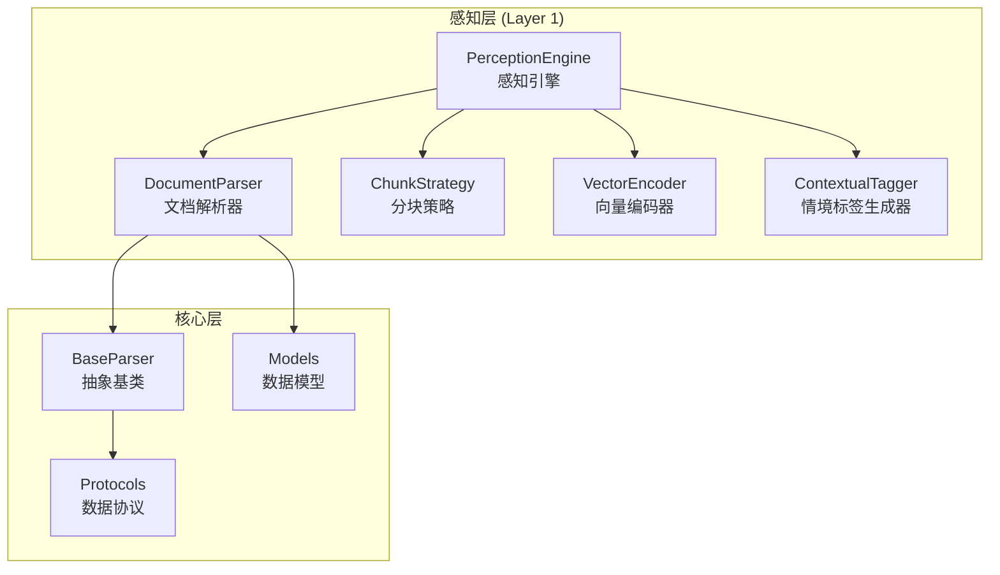

**图表来源**
- [src/perception/parser.py:12-113](file://src/perception/parser.py#L12-L113)
- [src/perception/engine.py:20-195](file://src/perception/engine.py#L20-L195)
- [src/core/base.py:32-64](file://src/core/base.py#L32-L64)

**章节来源**
- [src/perception/README.md:1-158](file://src/perception/README.md#L1-L158)
- [README.md:52-102](file://README.md#L52-L102)

## 核心组件

### DocumentParser类

DocumentParser是感知层的核心解析器，继承自BaseParser抽象基类。该类提供了统一的文档解析接口，支持多种文档格式的处理。

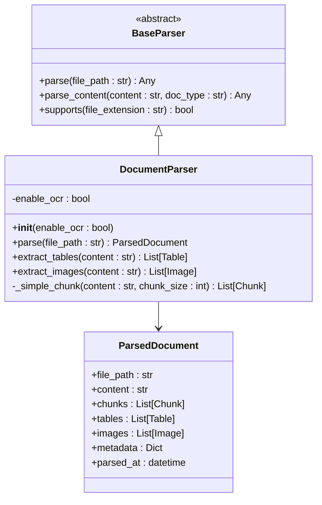

**图表来源**
- [src/perception/parser.py:12-113](file://src/perception/parser.py#L12-L113)
- [src/core/base.py:32-64](file://src/core/base.py#L32-L64)
- [src/perception/models.py:52-62](file://src/perception/models.py#L52-L62)

### 数据模型

文档解析器使用统一的数据模型来表示解析后的文档内容：

| 数据模型 | 字段 | 类型 | 描述 |
|---------|------|------|------|
| ParsedDocument | file_path | str | 原始文件路径 |
| | content | str | 解析后的文本内容 |
| | chunks | List[Chunk] | 文本块列表 |
| | tables | List[Table] | 表格数据列表 |
| | images | List[Image] | 图片数据列表 |
| | metadata | Dict | 元数据信息 |
| | parsed_at | datetime | 解析时间 |

**章节来源**
- [src/perception/models.py:14-62](file://src/perception/models.py#L14-L62)
- [src/core/protocols.py:100-117](file://src/core/protocols.py#L100-L117)

## 架构概览

### 感知引擎工作流程

感知引擎（PerceptionEngine）整合了文档解析器、分块策略、向量编码器和情境标签生成器，形成完整的文档处理流水线：

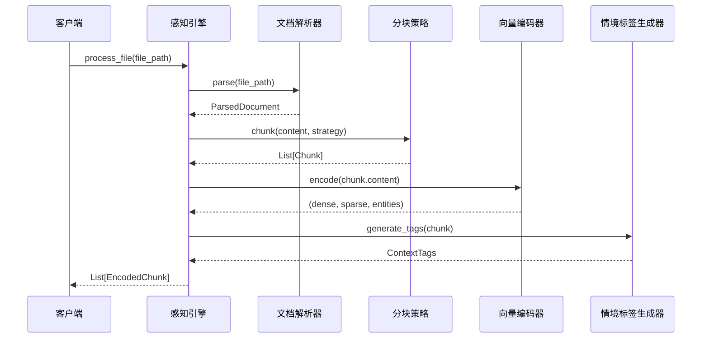

**图表来源**
- [src/perception/engine.py:77-155](file://src/perception/engine.py#L77-L155)
- [src/perception/parser.py:28-60](file://src/perception/parser.py#L28-L60)
- [src/perception/chunker.py:49-86](file://src/perception/chunker.py#L49-L86)

### 分块策略架构

分块策略支持多种分块模式，每种模式都有其特定的应用场景：

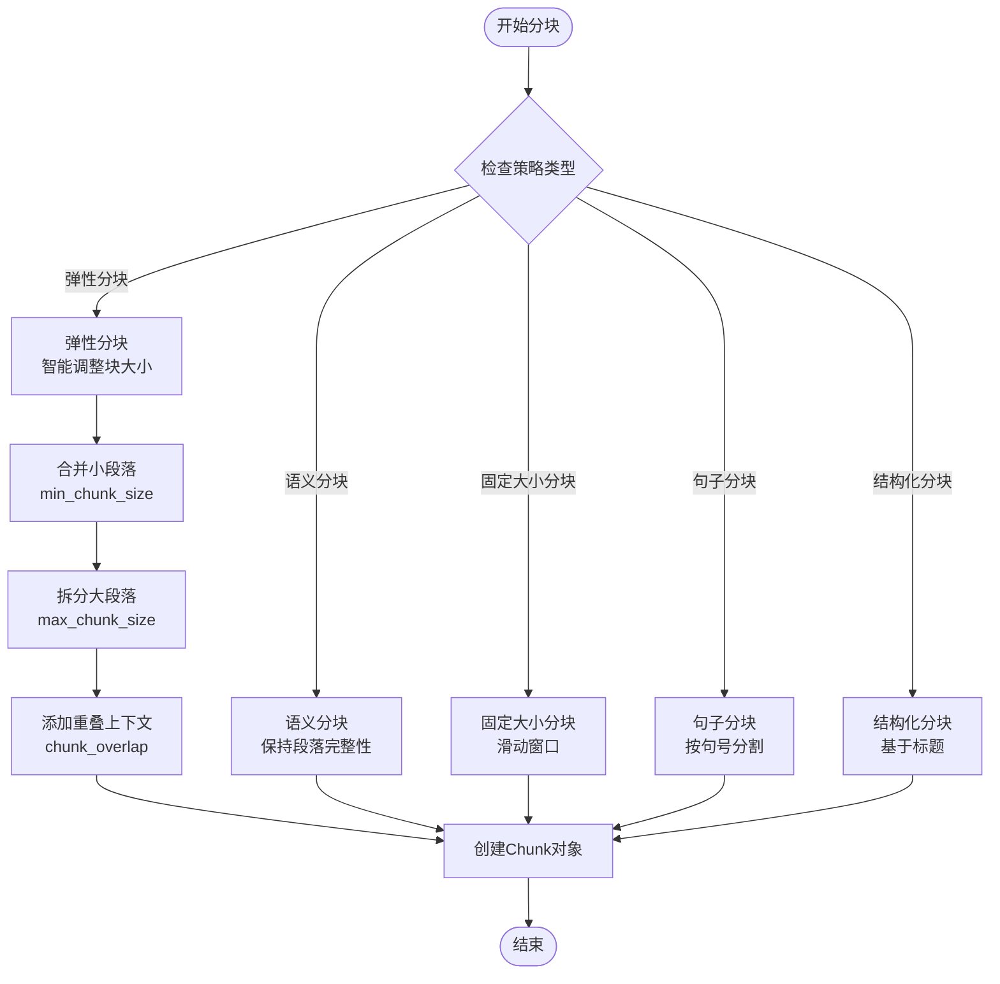

**图表来源**
- [src/perception/chunker.py:89-141](file://src/perception/chunker.py#L89-L141)
- [src/perception/chunker.py:218-248](file://src/perception/chunker.py#L218-L248)

**章节来源**
- [src/perception/engine.py:20-195](file://src/perception/engine.py#L20-L195)
- [src/perception/chunker.py:12-567](file://src/perception/chunker.py#L12-L567)

## 详细组件分析

### 文档解析器实现

#### 基础解析功能

当前版本的DocumentParser提供了基础的文档解析能力，主要针对文本文件进行处理：

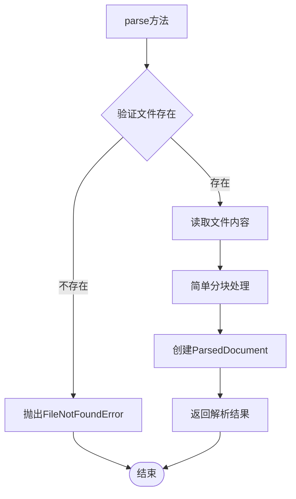

**图表来源**
- [src/perception/parser.py:28-60](file://src/perception/parser.py#L28-L60)

#### OCR功能集成

虽然当前实现中OCR功能标记为TODO，但解析器已经预留了相应的接口和数据结构：

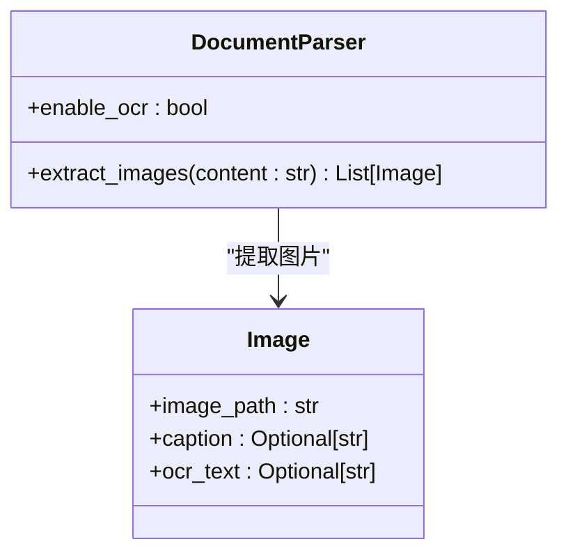

**图表来源**
- [src/perception/parser.py:77-90](file://src/perception/parser.py#L77-L90)
- [src/perception/models.py:44-50](file://src/perception/models.py#L44-L50)

### 分块策略详解

#### 弹性分块算法

弹性分块是分块策略的核心算法，能够智能地调整块大小以保持语义完整性：

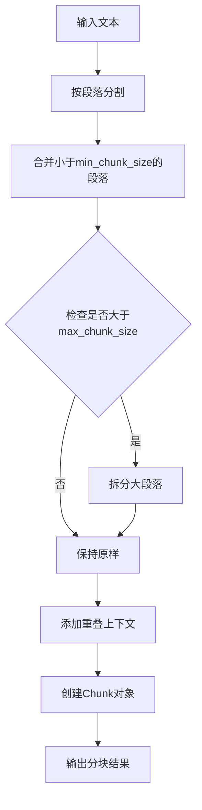

**图表来源**
- [src/perception/chunker.py:89-141](file://src/perception/chunker.py#L89-L141)

#### 句子级分块实现

句子级分块支持中英文混合文本的智能分割：

| 分割类型 | 标点符号 | 支持语言 |
|---------|---------|---------|
| 中文句子 | 。，！？ | 中文 |
| 英文句子 | .!? | 英文 |
| 中文子句 | ，、； | 中文 |
| 英文子句 | ,; | 英文 |

**章节来源**
- [src/perception/chunker.py:143-183](file://src/perception/chunker.py#L143-L183)
- [src/perception/chunker.py:286-314](file://src/perception/chunker.py#L286-L314)

### 向量编码器

向量编码器生成多类型的向量表示，支持稠密向量、稀疏向量和实体三元组：

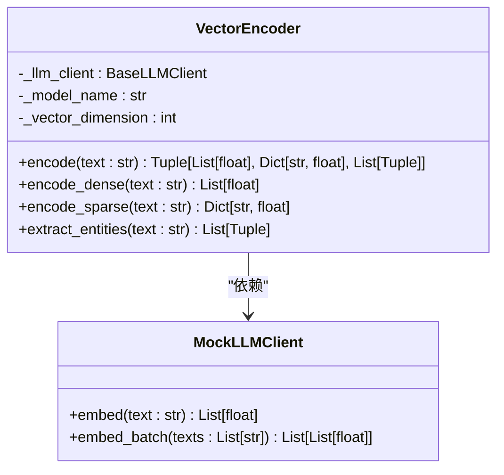

**图表来源**
- [src/perception/encoder.py:25-255](file://src/perception/encoder.py#L25-L255)

### 情境标签生成器

情境标签生成器为每个文本块生成丰富的时间、情感、重要性和主题标签：

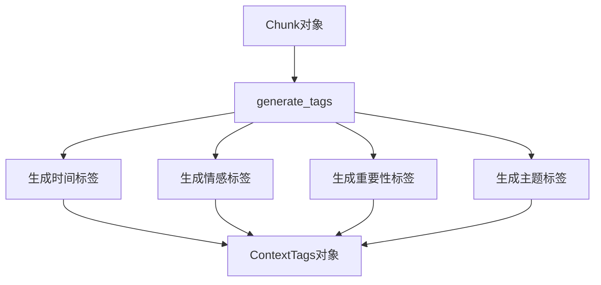

**图表来源**
- [src/perception/tagger.py:33-48](file://src/perception/tagger.py#L33-L48)

**章节来源**
- [src/perception/tagger.py:11-163](file://src/perception/tagger.py#L11-L163)

## 依赖分析

### 外部依赖

NecoRAG项目采用模块化设计，文档解析功能采用可选依赖的方式：

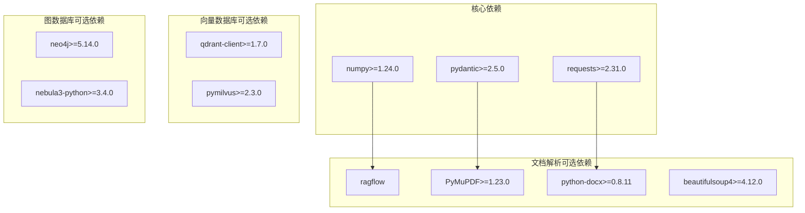

**图表来源**
- [requirements.txt:28-71](file://requirements.txt#L28-L71)

### 内部依赖关系

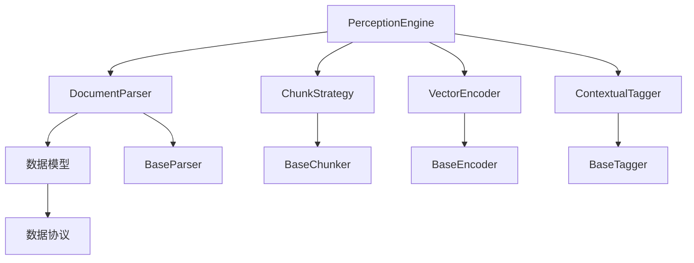

**图表来源**
- [src/perception/parser.py:8-9](file://src/perception/parser.py#L8-L9)
- [src/perception/engine.py:9-14](file://src/perception/engine.py#L9-L14)

**章节来源**
- [requirements.txt:1-161](file://requirements.txt#L1-L161)
- [src/core/base.py:32-160](file://src/core/base.py#L32-L160)

## 性能考虑

### 分块策略性能

不同分块策略的性能特征：

| 分块策略 | 时间复杂度 | 空间复杂度 | 适用场景 |
|---------|-----------|-----------|---------|
| 弹性分块 | O(n log n) | O(n) | 长文档、需要语义完整性 |
| 语义分块 | O(n) | O(n) | 段落清晰的文档 |
| 固定大小分块 | O(n) | O(n) | 简单快速处理 |
| 句子分块 | O(n) | O(n) | 需要精确句子边界 |
| 结构化分块 | O(n) | O(n) | 标题层次清晰的文档 |

### 向量编码性能

向量编码器支持批量处理以提高性能：

- **批量编码**：encode_dense_batch方法支持批量向量化
- **内存优化**：使用numpy数组减少内存占用
- **降级策略**：无LLM客户端时使用内置实现

## 故障排除指南

### 常见错误及解决方案

#### 文件解析错误

**问题**：文件不存在或无法读取
**解决方案**：
1. 检查文件路径是否正确
2. 验证文件权限
3. 确认文件编码格式

#### 分块策略错误

**问题**：分块策略参数配置错误
**解决方案**：
1. 检查min_chunk_size < target_chunk_size < max_chunk_size
2. 验证chunk_overlap参数合理性
3. 确认语义边界优先级设置

#### OCR功能问题

**问题**：OCR功能未生效
**解决方案**：
1. 确认enable_ocr参数设置为True
2. 检查图片格式支持
3. 验证OCR引擎配置

**章节来源**
- [src/perception/parser.py:42-43](file://src/perception/parser.py#L42-L43)
- [src/perception/chunker.py:82-83](file://src/perception/chunker.py#L82-L83)

## 结论

文档解析器作为NecoRAG感知层的核心组件，为整个认知架构提供了高质量的文档处理能力。当前版本虽然处于基础实现阶段，但已经建立了完整的架构框架，为后续的功能扩展奠定了坚实基础。

未来的发展方向包括：
1. **增强文档格式支持**：扩展对PPT、Excel等格式的支持
2. **完善OCR功能**：实现图像文字识别、表格提取等高级功能
3. **优化分块策略**：提升混合内容文档的处理能力
4. **性能优化**：提高大规模文档处理的效率

通过持续的迭代和优化，文档解析器将成为NecoRAG框架中不可或缺的核心组件。

## 附录

### 配置参数说明

| 参数名 | 类型 | 默认值 | 说明 |
|-------|------|--------|------|
| enable_ocr | bool | True | 是否启用OCR功能 |
| chunk_size | int | 512 | 分块大小（字符数） |
| chunk_overlap | int | 50 | 分块重叠长度（字符数） |
| min_chunk_size | int | 1024 | 弹性分块最小块大小 |
| target_chunk_size | int | 2048 | 弹性分块目标块大小 |
| max_chunk_size | int | 5120 | 弹性分块最大块大小 |
| enable_elastic_chunking | bool | True | 是否启用弹性分块 |
| semantic_boundaries | List[str] | ["paragraph","sentence","clause"] | 语义边界优先级 |

### 使用示例

```python
# 基础使用示例
from src.perception.engine import PerceptionEngine

# 初始化感知引擎
engine = PerceptionEngine(
    model="BGE-M3",
    chunk_size=512,
    chunk_overlap=50,
    enable_ocr=True
)

# 处理文本
text = "这是一个示例文本..."
encoded_chunks = engine.process_text(text)

# 处理文件
encoded_chunks = engine.process_file("document.pdf")
```

**章节来源**
- [src/perception/engine.py:28-76](file://src/perception/engine.py#L28-L76)
- [example/example_usage.py:12-47](file://example/example_usage.py#L12-L47)