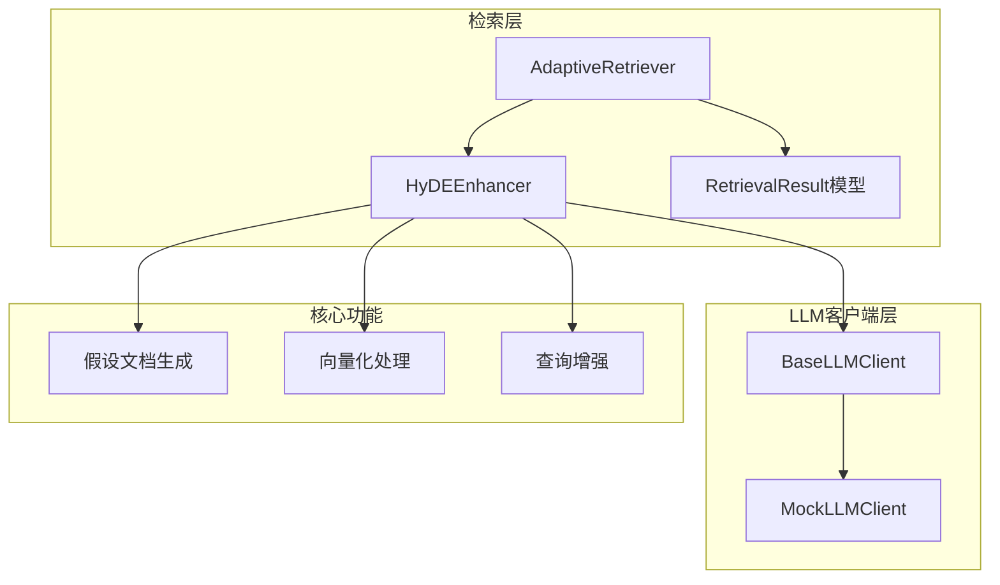
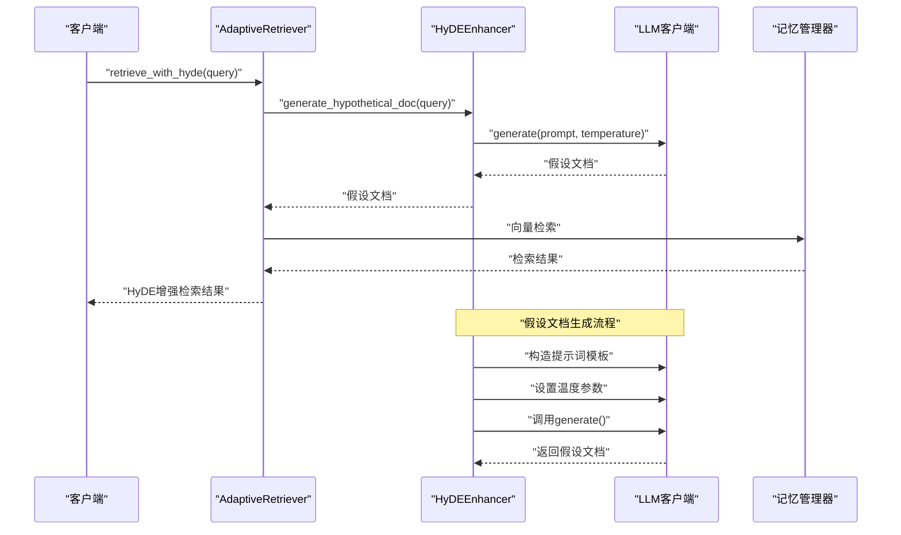
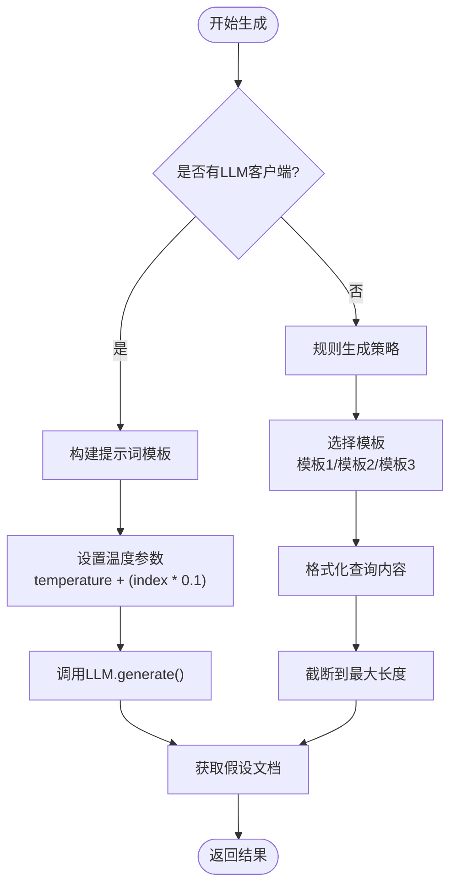
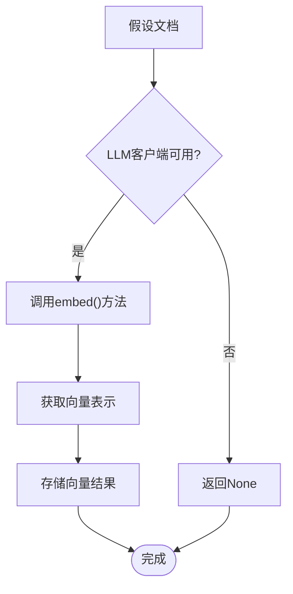
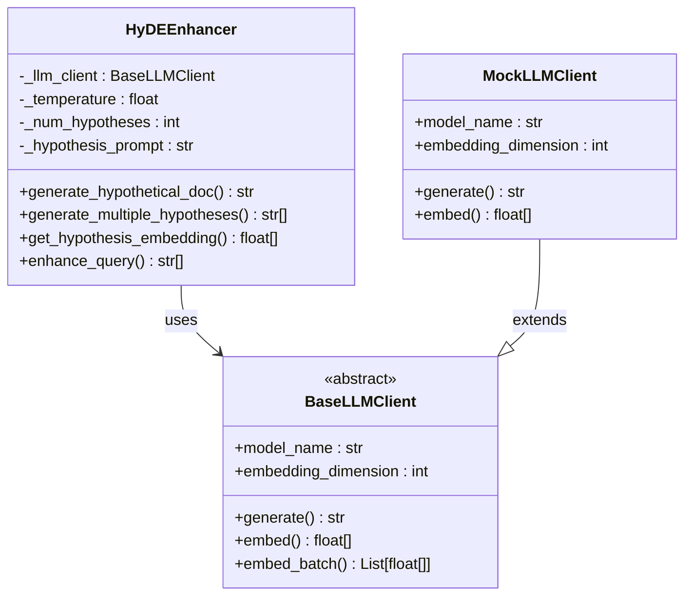
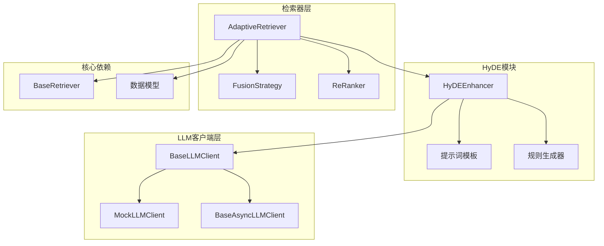

# HyDE增强技术

<cite>
**本文档引用的文件**
- [src/retrieval/hyde.py](file://src/retrieval/hyde.py)
- [src/retrieval/retriever.py](file://src/retrieval/retriever.py)
- [src/retrieval/models.py](file://src/retrieval/models.py)
- [src/core/llm/base.py](file://src/core/llm/base.py)
- [src/core/llm/mock.py](file://src/core/llm/mock.py)
- [tests/test_retrieval/test_retriever.py](file://tests/test_retrieval/test_retriever.py)
- [example/example_usage.py](file://example/example_usage.py)
- [wiki/wiki/检索引擎模块/HyDE增强技术.md](file://wiki/wiki/检索引擎模块/HyDE增强技术.md)
- [wiki/wiki/核心架构设计/五层认知架构/检索层 (L3)/HyDE增强技术.md](file://wiki/wiki/核心架构设计/五层认知架构/检索层 (L3)/HyDE增强技术.md)
</cite>

## 目录
1. [简介](#简介)
2. [项目结构](#项目结构)
3. [核心组件](#核心组件)
4. [架构概览](#架构概览)
5. [详细组件分析](#详细组件分析)
6. [依赖关系分析](#依赖关系分析)
7. [性能考虑](#性能考虑)
8. [故障排除指南](#故障排除指南)
9. [结论](#结论)
10. [附录](#附录)

## 简介

HyDE（Hypothetical Document Embeddings）增强技术是NecoRAG检索系统中的核心技术之一，通过生成假设性文档来改善向量检索效果。该技术的核心思想是：对于抽象或模糊的查询，通过生成模拟真实文档的答案来增强检索效果，从而提高检索的准确性和相关性。

HyDE技术主要解决以下问题：
- 抽象概念检索效果差
- 查询表达不够具体
- 传统向量检索对模糊查询效果不佳
- 缺乏上下文相关的语义表示

## 项目结构

HyDE增强技术在NecoRAG项目中的组织结构如下：



**图表来源**
- [src/retrieval/hyde.py:17-213](file://src/retrieval/hyde.py#L17-L213)
- [src/retrieval/retriever.py:135-182](file://src/retrieval/retriever.py#L135-L182)
- [src/core/llm/base.py:16-50](file://src/core/llm/base.py#L16-L50)

**章节来源**
- [src/retrieval/hyde.py:1-213](file://src/retrieval/hyde.py#L1-L213)
- [src/retrieval/retriever.py:1-200](file://src/retrieval/retriever.py#L1-L200)

## 核心组件

### HyDEEnhancer类

HyDEEnhancer是HyDE技术的核心实现类，负责生成假设性文档并进行向量化处理。

**主要功能**：
1. **假设文档生成**：通过LLM生成与查询相关的假设性答案
2. **多假设生成**：支持生成多个不同变体的假设文档
3. **向量化处理**：将假设文档转换为向量表示
4. **查询增强**：返回原始查询与假设文档组成的查询集合

**关键参数**：
- `temperature`：控制生成多样性的温度参数，默认0.5
- `num_hypotheses`：生成假设文档的数量，默认1
- `llm_client`：LLM客户端实例，可选参数

**章节来源**
- [src/retrieval/hyde.py:17-213](file://src/retrieval/hyde.py#L17-L213)

### AdaptiveRetriever集成

AdaptiveRetriever是检索系统的主控制器，集成了HyDE增强功能：

**集成方式**：
1. **可选启用**：通过`enable_hyde`参数控制是否启用HyDE
2. **检索流程**：在标准检索流程中添加HyDE增强步骤
3. **结果追踪**：记录HyDE增强的检索路径和效果

**章节来源**
- [src/retrieval/retriever.py:135-182](file://src/retrieval/retriever.py#L135-L182)

## 架构概览

HyDE增强技术的整体架构设计如下：



**图表来源**
- [src/retrieval/retriever.py:362-388](file://src/retrieval/retriever.py#L362-L388)
- [src/retrieval/hyde.py:58-142](file://src/retrieval/hyde.py#L58-L142)

## 详细组件分析

### 假设文档生成算法

HyDEEnhancer实现了两种假设文档生成策略：

#### 基于LLM的生成策略



**图表来源**
- [src/retrieval/hyde.py:85-121](file://src/retrieval/hyde.py#L85-L121)
- [src/retrieval/hyde.py:172-213](file://src/retrieval/hyde.py#L172-L213)

#### 规则生成策略

当没有LLM客户端时，HyDEEnhancer使用预定义的模板生成假设文档：

**模板类型**：
1. **详细说明模板**：提供全面的概念解释
2. **多角度分析模板**：从不同维度分析问题
3. **概述模板**：提供主题的总体介绍

**章节来源**
- [src/retrieval/hyde.py:172-213](file://src/retrieval/hyde.py#L172-L213)

### 向量化处理流程

HyDEEnhancer支持将假设文档转换为向量表示：



**图表来源**
- [src/retrieval/hyde.py:123-142](file://src/retrieval/hyde.py#L123-L142)

**章节来源**
- [src/retrieval/hyde.py:123-142](file://src/retrieval/hyde.py#L123-L142)

### 查询增强机制

HyDEEnhancer提供查询增强功能，将原始查询与假设文档组合：

**增强策略**：
1. **原始查询保留**：可选择是否包含原始查询
2. **多假设组合**：生成多个假设文档参与检索
3. **多样化温度**：通过温度参数控制生成多样性

**章节来源**
- [src/retrieval/hyde.py:144-170](file://src/retrieval/hyde.py#L144-L170)

### LLM客户端集成

HyDEEnhancer通过BaseLLMClient抽象层与不同的LLM实现集成：



**图表来源**
- [src/retrieval/hyde.py:17-213](file://src/retrieval/hyde.py#L17-L213)
- [src/core/llm/base.py:16-50](file://src/core/llm/base.py#L16-L50)
- [src/core/llm/mock.py:16-70](file://src/core/llm/mock.py#L16-L70)

**章节来源**
- [src/core/llm/base.py:16-50](file://src/core/llm/base.py#L16-L50)
- [src/core/llm/mock.py:16-70](file://src/core/llm/mock.py#L16-L70)

## 依赖关系分析

### 组件依赖图



**图表来源**
- [src/retrieval/hyde.py:13-14](file://src/retrieval/hyde.py#L13-L14)
- [src/retrieval/retriever.py:13-17](file://src/retrieval/retriever.py#L13-L17)

### 外部依赖分析

HyDE增强技术的主要外部依赖包括：

1. **LLM客户端接口**：通过BaseLLMClient抽象层实现
2. **向量存储**：与记忆管理器的SemanticMemory集成
3. **配置管理**：支持运行时配置和参数调整

**章节来源**
- [src/retrieval/retriever.py:13-17](file://src/retrieval/retriever.py#L13-L17)

## 性能考虑

### 生成效率优化

1. **温度参数调节**：通过逐步增加温度参数生成多样化的假设文档
2. **批量处理**：支持批量生成和向量化处理
3. **缓存策略**：可以考虑实现假设文档的缓存机制

### 成本分析

**假设生成成本**：
- 每次生成假设都会触发一次LLM调用
- 生成多个假设时成本线性增长
- 建议在1-3个假设之间权衡性能与效果

**向量化成本**：
- 假设向量生成需要额外的嵌入调用
- 增加延迟与资源消耗
- 可使用批量嵌入接口降低开销

**性能优化建议**：
- 调整temperature参数，平衡生成质量和速度
- 适当减少num_hypotheses数量
- 实现适当的缓存机制
- 使用早停机制减少无效计算

**章节来源**
- [src/retrieval/hyde.py:85-121](file://src/retrieval/hyde.py#L85-L121)
- [src/core/llm/base.py:24-36](file://src/core/llm/base.py#L24-L36)
- [wiki/wiki/检索引擎模块/HyDE增强技术.md:279-285](file://wiki/wiki/检索引擎模块/HyDE增强技术.md#L279-L285)

## 故障排除指南

### 常见问题及解决方案

#### 1. LLM客户端未正确初始化

**问题症状**：
- HyDE增强器无法生成假设文档
- 返回空结果或错误

**解决方案**：
- 确保正确传入BaseLLMClient实例
- 检查LLM客户端的model_name和embedding_dimension属性
- 验证generate和embed方法的实现

#### 2. 向量维度不匹配

**问题症状**：
- 向量计算时报维度错误
- 检索结果异常

**解决方案**：
- 确保HyDEEnhancer使用的LLM客户端与记忆管理器期望的维度一致
- 检查embedding_dimension配置

#### 3. 性能问题

**问题症状**：
- 假设文档生成速度慢
- 检索响应时间过长

**解决方案**：
- 调整temperature参数，平衡生成质量和速度
- 适当减少num_hypotheses数量
- 实现适当的缓存机制

### 调试和测试

**测试用例分析**：
- 测试HyDE增强检索功能
- 验证禁用HyDE时的回退行为
- 测试边界情况和异常处理

**章节来源**
- [tests/test_retrieval/test_retriever.py:232-249](file://tests/test_retrieval/test_retriever.py#L232-L249)
- [wiki/wiki/核心架构设计/五层认知架构/检索层 (L3)/HyDE增强技术.md:346-383](file://wiki/wiki/核心架构设计/五层认知架构/检索层 (L3)/HyDE增强技术.md#L346-L383)

## 结论

HyDE增强技术通过生成假设性文档来改善向量检索效果，是NecoRAG检索系统的重要组成部分。该技术具有以下优势：

1. **提升检索准确性**：通过生成具体的假设文档，改善抽象概念的检索效果
2. **增强语义理解**：假设文档提供了更丰富的上下文信息
3. **灵活的实现方式**：支持基于LLM的生成和规则生成两种策略
4. **良好的集成性**：与AdaptiveRetriever无缝集成，提供透明的增强效果

**章节来源**
- [src/retrieval/hyde.py:1-213](file://src/retrieval/hyde.py#L1-L213)
- [src/retrieval/retriever.py:362-388](file://src/retrieval/retriever.py#L362-L388)

## 附录

### 使用示例

#### 基础使用方法

```python
# 初始化启用HyDE的检索器
retriever = AdaptiveRetriever(
    memory=memory_manager,
    enable_hyde=True,
    confidence_threshold=0.85
)

# 执行HyDE增强检索
results = retriever.retrieve_with_hyde(
    query="深度学习的应用领域",
    top_k=10
)
```

**章节来源**
- [example/example_usage.py:102-136](file://example/example_usage.py#L102-L136)
- [wiki/wiki/核心架构设计/五层认知架构/检索层 (L3)/HyDE增强技术.md:447-468](file://wiki/wiki/核心架构设计/五层认知架构/检索层 (L3)/HyDE增强技术.md#L447-L468)

### 最佳实践

1. **参数调优**：根据应用场景调整temperature和num_hypotheses参数
2. **性能监控**：监控HyDE增强的性能影响，及时调整配置
3. **缓存策略**：实现假设文档的缓存机制，减少重复生成成本
4. **渐进式部署**：先在小范围内测试HyDE效果，再逐步扩大应用范围

### 相关技术对比

HyDE增强技术与其他检索技术的结合方式：

1. **与传统向量检索结合**：通过假设文档增强向量表示
2. **与关键词检索结合**：HyDE生成的假设文档可用于关键词提取
3. **与图谱检索结合**：假设文档中的实体可用于图谱查询
4. **与重排序系统结合**：HyDE增强的检索结果参与最终排序

**章节来源**
- [wiki/wiki/检索引擎模块/HyDE增强技术.md:154-365](file://wiki/wiki/检索引擎模块/HyDE增强技术.md#L154-L365)