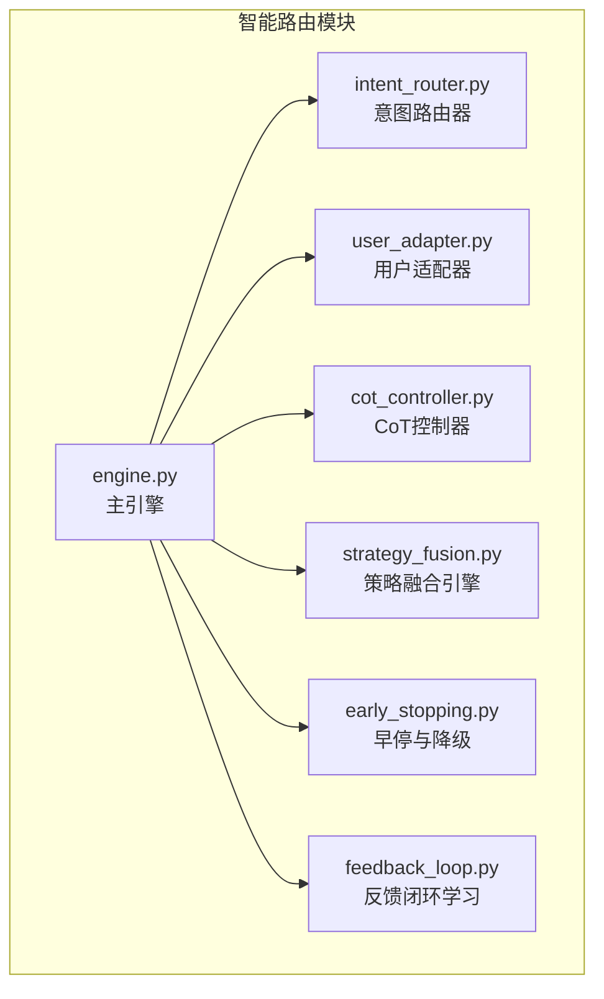
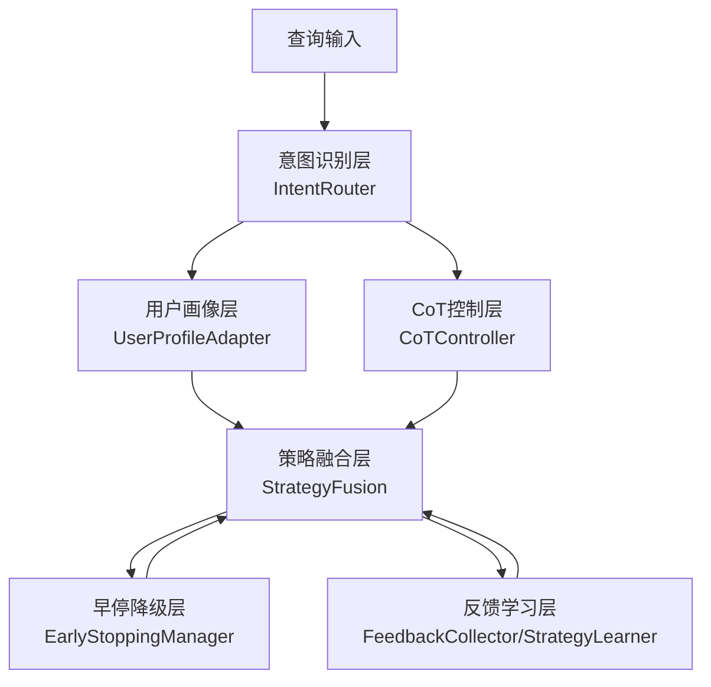
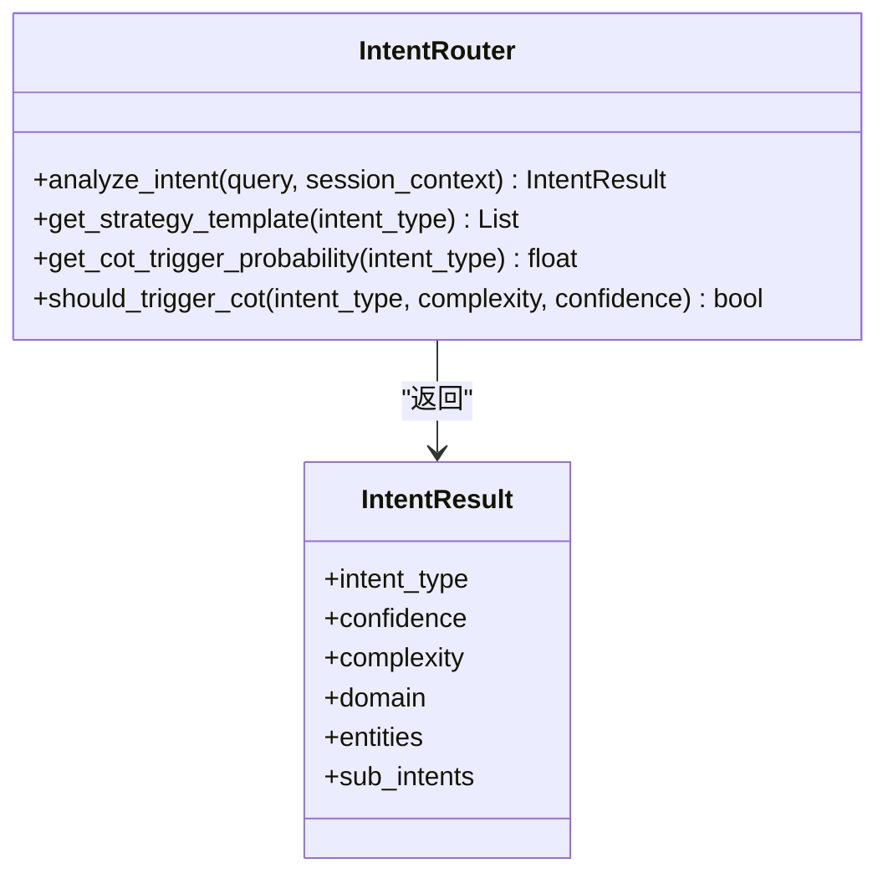
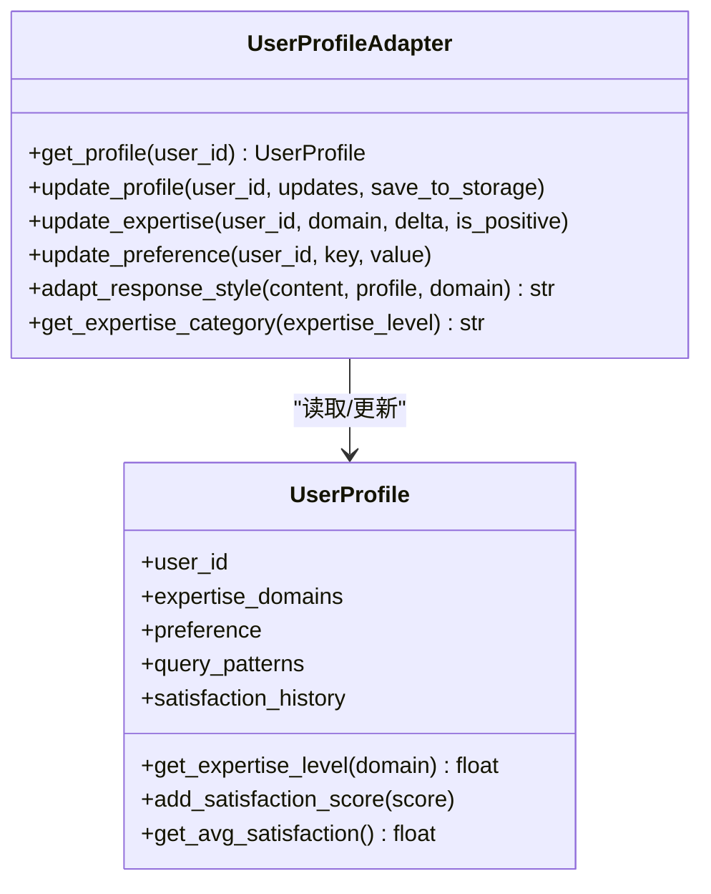
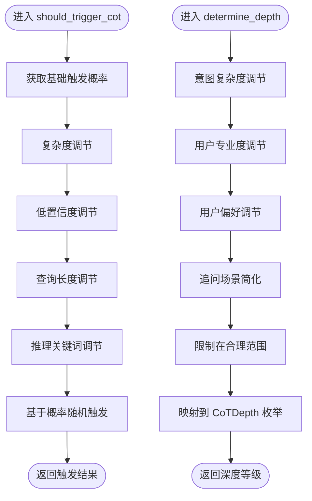
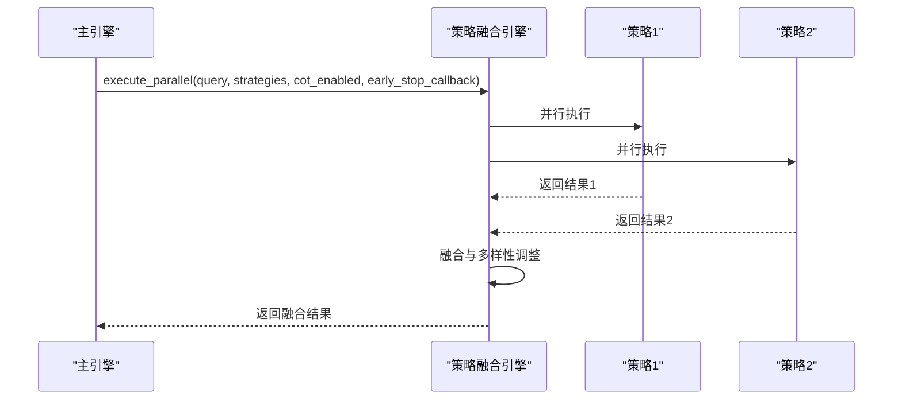
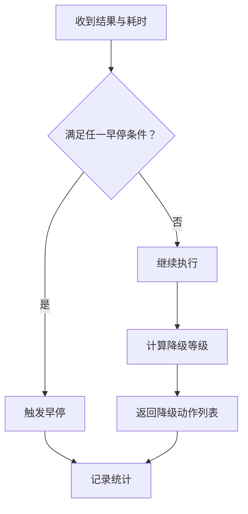
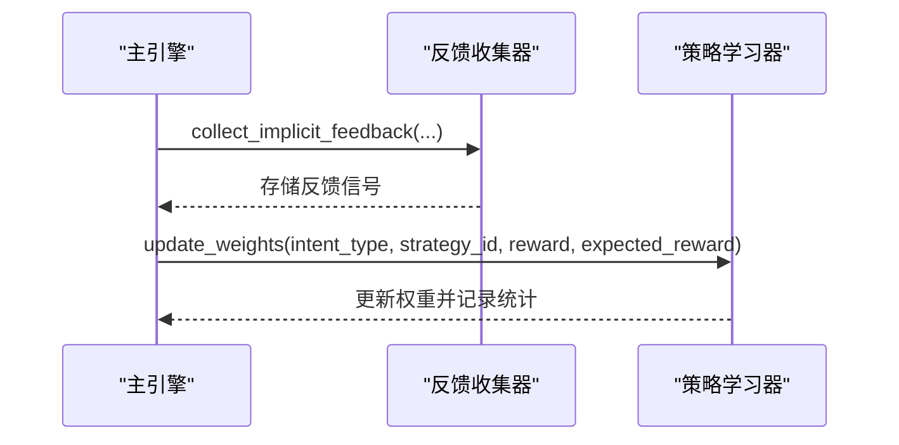
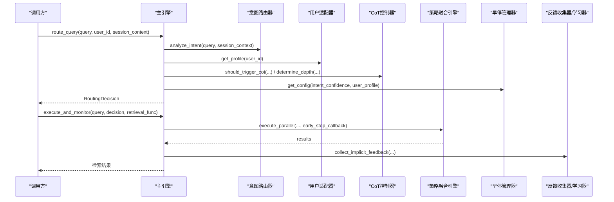

# 智能路由引擎

<cite>
**本文引用的文件**   
- [engine.py](file://src/retrieval/smart_routing/engine.py)
- [intent_router.py](file://src/retrieval/smart_routing/intent_router.py)
- [user_adapter.py](file://src/retrieval/smart_routing/user_adapter.py)
- [cot_controller.py](file://src/retrieval/smart_routing/cot_controller.py)
- [strategy_fusion.py](file://src/retrieval/smart_routing/strategy_fusion.py)
- [early_stopping.py](file://src/retrieval/smart_routing/early_stopping.py)
- [feedback_loop.py](file://src/retrieval/smart_routing/feedback_loop.py)
- [example_usage.py](file://src/retrieval/smart_routing/example_usage.py)
- [README.md](file://src/retrieval/smart_routing/README.md)
- [IMPLEMENTATION_SUMMARY.md](file://src/retrieval/smart_routing/IMPLEMENTATION_SUMMARY.md)
- [test_smart_routing.py](file://tests/test_retrieval/test_smart_routing.py)
</cite>

## 目录
1. [引言](#引言)
2. [项目结构](#项目结构)
3. [核心组件](#核心组件)
4. [架构总览](#架构总览)
5. [详细组件分析](#详细组件分析)
6. [依赖分析](#依赖分析)
7. [性能考量](#性能考量)
8. [故障排查指南](#故障排查指南)
9. [结论](#结论)
10. [附录](#附录)

## 引言
本技术文档围绕智能路由引擎展开，系统阐述其如何依据查询意图与上下文动态选择最优检索策略与路径。引擎采用“三层决策架构”：意图识别层、用户画像层与策略融合层；并结合 CoT 思维链控制器、早停与降级机制、反馈闭环学习系统，形成可解释、可优化、可个性化的智能路由体系。本文面向开发者与产品人员，既提供代码级实现细节，也给出使用示例、参数调优建议与评估方法。

## 项目结构
智能路由模块位于 src/retrieval/smart_routing，包含主引擎、意图路由器、用户适配器、CoT 控制器、策略融合引擎、早停与降级管理器、反馈闭环学习系统，以及示例与测试文件。

图表来源
- [engine.py:1-274](file://src/retrieval/smart_routing/engine.py#L1-L274)
- [intent_router.py:1-278](file://src/retrieval/smart_routing/intent_router.py#L1-L278)
- [user_adapter.py:1-331](file://src/retrieval/smart_routing/user_adapter.py#L1-L331)
- [cot_controller.py:1-202](file://src/retrieval/smart_routing/cot_controller.py#L1-L202)
- [strategy_fusion.py:1-349](file://src/retrieval/smart_routing/strategy_fusion.py#L1-L349)
- [early_stopping.py:1-326](file://src/retrieval/smart_routing/early_stopping.py#L1-L326)
- [feedback_loop.py:1-435](file://src/retrieval/smart_routing/feedback_loop.py#L1-L435)

章节来源
- [README.md:134-196](file://src/retrieval/smart_routing/README.md#L134-L196)

## 核心组件
- 意图路由器(IntentRouter)：识别查询的七类语义意图、评估复杂度、映射默认策略模板、决定 CoT 触发概率。
- 用户适配器(UserProfileAdapter)：获取/更新用户画像，按专业度与偏好调节响应风格与策略权重。
- CoT 控制器(CoTController)：智能判断是否触发 CoT 以及推理深度，支持用户偏好与上下文调节。
- 策略融合引擎(StrategyFusion)：多策略并行执行、结果融合、多样性控制与重排序。
- 早停与降级(EarlyStoppingManager)：基于置信度、边际收益、延迟预算与满意度预测的多维早停与四级降级。
- 反馈闭环(FeedbackCollector/StrategyLearner)：收集显式/隐式反馈，进行在线学习与策略权重更新。
- 主引擎(StrategyFusionEngine)：整合上述模块，提供统一路由决策与执行接口。

章节来源
- [engine.py:34-129](file://src/retrieval/smart_routing/engine.py#L34-L129)
- [intent_router.py:91-155](file://src/retrieval/smart_routing/intent_router.py#L91-L155)
- [user_adapter.py:98-331](file://src/retrieval/smart_routing/user_adapter.py#L98-L331)
- [cot_controller.py:21-172](file://src/retrieval/smart_routing/cot_controller.py#L21-L172)
- [strategy_fusion.py:43-158](file://src/retrieval/smart_routing/strategy_fusion.py#L43-L158)
- [early_stopping.py:39-183](file://src/retrieval/smart_routing/early_stopping.py#L39-L183)
- [feedback_loop.py:30-435](file://src/retrieval/smart_routing/feedback_loop.py#L30-L435)

## 架构总览
引擎采用三层决策架构：意图识别层（语义分类与复杂度评估）、用户画像层（专业度与偏好适配）、策略融合层（多策略并行与融合）。同时引入 CoT 推理与早停降级机制，确保在效果与延迟之间取得平衡，并通过反馈闭环持续优化。

图表来源
- [engine.py:68-129](file://src/retrieval/smart_routing/engine.py#L68-L129)
- [intent_router.py:115-155](file://src/retrieval/smart_routing/intent_router.py#L115-L155)
- [user_adapter.py:133-150](file://src/retrieval/smart_routing/user_adapter.py#L133-L150)
- [cot_controller.py:55-107](file://src/retrieval/smart_routing/cot_controller.py#L55-L107)
- [strategy_fusion.py:78-158](file://src/retrieval/smart_routing/strategy_fusion.py#L78-L158)
- [early_stopping.py:57-109](file://src/retrieval/smart_routing/early_stopping.py#L57-L109)
- [feedback_loop.py:30-149](file://src/retrieval/smart_routing/feedback_loop.py#L30-L149)

## 详细组件分析

### 意图路由器(IntentRouter)：决策逻辑
- 识别七类语义意图（事实查询、比较分析、推理演绎、概念解释、摘要总结、操作指导、探索发散），并输出置信度与复杂度。
- 提供默认策略模板映射与 CoT 触发概率表，支持规则匹配与分类器两种识别方式。
- 复杂度可基于上下文（跨领域、追问场景、技术术语）进行动态调整。

图表来源
- [intent_router.py:91-155](file://src/retrieval/smart_routing/intent_router.py#L91-L155)
- [intent_router.py:24-38](file://src/retrieval/smart_routing/intent_router.py#L24-L38)

章节来源
- [intent_router.py:115-155](file://src/retrieval/smart_routing/intent_router.py#L115-L155)
- [intent_router.py:240-278](file://src/retrieval/smart_routing/intent_router.py#L240-L278)

### 用户适配器(UserProfileAdapter)：个性化调整
- 管理用户画像（专业度、偏好、查询模式、满意度历史），并提供风格偏好适配（详细度、语调、格式、引用风格）。
- 支持按领域专业度分类（专家/中级/新手），并据此调节策略权重与响应风格。
- 提供更新接口与缓存机制，便于实时学习与性能优化。

图表来源
- [user_adapter.py:98-331](file://src/retrieval/smart_routing/user_adapter.py#L98-L331)

章节来源
- [user_adapter.py:133-150](file://src/retrieval/smart_routing/user_adapter.py#L133-L150)
- [user_adapter.py:176-236](file://src/retrieval/smart_routing/user_adapter.py#L176-L236)
- [user_adapter.py:248-324](file://src/retrieval/smart_routing/user_adapter.py#L248-L324)

### CoT 控制器(CoTController)：推理过程
- 智能触发判断：基于意图类型、复杂度、置信度、查询长度与推理关键词，计算触发概率并随机决策。
- 动态深度调节：根据意图复杂度、用户专业度与偏好、上下文（追问）确定推理深度（L1-L4）。
- 提供触发率统计与重置接口，便于运行时监控。

图表来源
- [cot_controller.py:55-107](file://src/retrieval/smart_routing/cot_controller.py#L55-L107)
- [cot_controller.py:109-172](file://src/retrieval/smart_routing/cot_controller.py#L109-L172)

章节来源
- [cot_controller.py:55-107](file://src/retrieval/smart_routing/cot_controller.py#L55-L107)
- [cot_controller.py:109-172](file://src/retrieval/smart_routing/cot_controller.py#L109-L172)

### 策略融合引擎(StrategyFusion)：多策略协调
- 多策略并行执行：按优先级排序，异步并发执行候选策略，支持早停回调。
- 结果融合：对各策略结果进行归一化、新颖性加成与多样性惩罚，计算融合得分并排序。
- 多样性控制：限制同一领域占比、鼓励跨领域、避免单一来源垄断。
- 重排序：预留重排序接口（如 BGE-Reranker），当前示例实现占位。

图表来源
- [strategy_fusion.py:78-158](file://src/retrieval/smart_routing/strategy_fusion.py#L78-L158)
- [strategy_fusion.py:217-271](file://src/retrieval/smart_routing/strategy_fusion.py#L217-L271)

章节来源
- [strategy_fusion.py:78-158](file://src/retrieval/smart_routing/strategy_fusion.py#L78-L158)
- [strategy_fusion.py:217-328](file://src/retrieval/smart_routing/strategy_fusion.py#L217-L328)

### 早停与降级(EarlyStoppingManager)：优化策略
- 多维早停判断：置信度阈值、边际收益递减、延迟预算、满意度预测。
- 四级降级：Level1（减少并行策略）、Level2（跳过 CoT）、Level3（仅向量检索）、Level4（返回缓存）。
- 动态配置：根据意图置信度与用户画像（专家用户对延迟更敏感）调整阈值与预算。

图表来源
- [early_stopping.py:57-109](file://src/retrieval/smart_routing/early_stopping.py#L57-L109)
- [early_stopping.py:157-183](file://src/retrieval/smart_routing/early_stopping.py#L157-L183)
- [early_stopping.py:210-243](file://src/retrieval/smart_routing/early_stopping.py#L210-L243)

章节来源
- [early_stopping.py:57-109](file://src/retrieval/smart_routing/early_stopping.py#L57-L109)
- [early_stopping.py:157-183](file://src/retrieval/smart_routing/early_stopping.py#L157-L183)
- [early_stopping.py:210-243](file://src/retrieval/smart_routing/early_stopping.py#L210-L243)

### 反馈闭环(FeedbackCollector/StrategyLearner)：学习能力
- 显式反馈：评分标准化至[-1,1]，权重可配置。
- 隐式反馈：查询改写、会话放弃、二次检索、停留时长、引用行为等，自动转化为反馈信号。
- 在线学习：基于增量误差更新策略权重，支持最优策略选择与统计输出。

图表来源
- [feedback_loop.py:30-149](file://src/retrieval/smart_routing/feedback_loop.py#L30-L149)
- [feedback_loop.py:297-435](file://src/retrieval/smart_routing/feedback_loop.py#L297-L435)

章节来源
- [feedback_loop.py:30-149](file://src/retrieval/smart_routing/feedback_loop.py#L30-L149)
- [feedback_loop.py:297-435](file://src/retrieval/smart_routing/feedback_loop.py#L297-L435)

### 主引擎(StrategyFusionEngine)：统一接口与执行
- 三层决策：意图识别、用户画像适配、策略选择与 CoT 决策。
- 执行与监控：设置早停回调，执行并行策略，收集隐式反馈，更新统计。
- 学习闭环：从反馈中学习，更新策略权重。

图表来源
- [engine.py:68-129](file://src/retrieval/smart_routing/engine.py#L68-L129)
- [engine.py:205-249](file://src/retrieval/smart_routing/engine.py#L205-L249)

章节来源
- [engine.py:68-129](file://src/retrieval/smart_routing/engine.py#L68-L129)
- [engine.py:205-249](file://src/retrieval/smart_routing/engine.py#L205-L249)

## 依赖分析
- 模块内聚：各子模块职责清晰，耦合度低，通过主引擎统一编排。
- 外部依赖：当前模块为纯 Python 实现，未引入额外第三方库；实际检索器与推理器需在策略执行阶段接入。
- 可扩展性：策略模板、反馈信号、早停条件均可通过配置与注册机制扩展。

章节来源
- [IMPLEMENTATION_SUMMARY.md:236-270](file://src/retrieval/smart_routing/IMPLEMENTATION_SUMMARY.md#L236-L270)

## 性能考量
- 早停与降级：通过置信度阈值、边际收益、延迟预算与满意度预测，显著降低简单问题的延迟与资源消耗。
- 并行策略：多策略并行执行，配合早停可在复杂问题上保持高质量与可控延迟。
- 缓存与统计：用户画像缓存与引擎统计有助于提升吞吐与可观测性。
- 预期指标：在设计文档中给出了满意度、延迟、命中率、资源成本等关键指标的预期改善目标。

章节来源
- [README.md:197-233](file://src/retrieval/smart_routing/README.md#L197-L233)
- [IMPLEMENTATION_SUMMARY.md:273-286](file://src/retrieval/smart_routing/IMPLEMENTATION_SUMMARY.md#L273-L286)

## 故障排查指南
- 意图识别异常：检查规则匹配与分类器配置，确认复杂度与上下文调整逻辑。
- 用户画像缺失：确认记忆管理器可用与缓存配置，必要时重置缓存。
- CoT 触发率异常：调整控制器阈值与权重，关注触发率统计。
- 早停频繁：检查早停阈值与降级配置，结合用户画像进行个性化调整。
- 反馈学习无效：核对反馈信号权重与学习率，确认策略权重更新与最优策略选择逻辑。

章节来源
- [test_smart_routing.py:19-72](file://tests/test_retrieval/test_smart_routing.py#L19-L72)
- [test_smart_routing.py:176-218](file://tests/test_retrieval/test_smart_routing.py#L176-L218)
- [test_smart_routing.py:220-273](file://tests/test_retrieval/test_smart_routing.py#L220-L273)

## 结论
智能路由引擎通过三层决策架构与多模块协同，实现了意图驱动、用户个性化、推理可控与资源优化的统一。在复杂查询场景下，引擎能够动态选择最优策略组合，结合早停与降级机制保障性能，并通过反馈闭环持续优化策略权重。建议在生产环境中结合监控与 A/B 测试，持续调优阈值与权重，以获得最佳用户体验与资源利用率。

## 附录

### 使用示例与配置要点
- 基础使用：初始化各组件并创建主引擎，调用路由接口获取决策，随后执行检索与收集反馈。
- 参数调优：根据业务场景调整 CoT 触发阈值、早停阈值与学习率；结合用户画像与领域专业度进行个性化配置。
- 集成检索器：在策略执行阶段接入实际检索器与推理器，完善融合与重排序逻辑。

章节来源
- [example_usage.py:18-58](file://src/retrieval/smart_routing/example_usage.py#L18-L58)
- [example_usage.py:61-96](file://src/retrieval/smart_routing/example_usage.py#L61-L96)
- [example_usage.py:99-138](file://src/retrieval/smart_routing/example_usage.py#L99-L138)
- [example_usage.py:141-173](file://src/retrieval/smart_routing/example_usage.py#L141-L173)
- [README.md:152-194](file://src/retrieval/smart_routing/README.md#L152-L194)