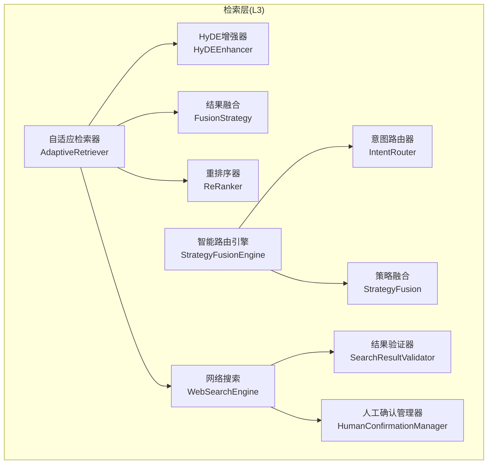
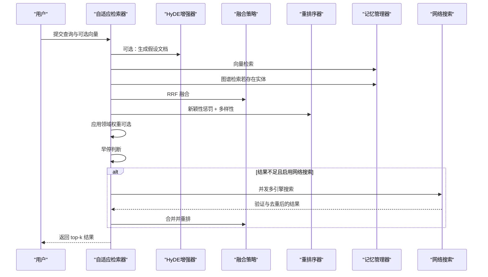
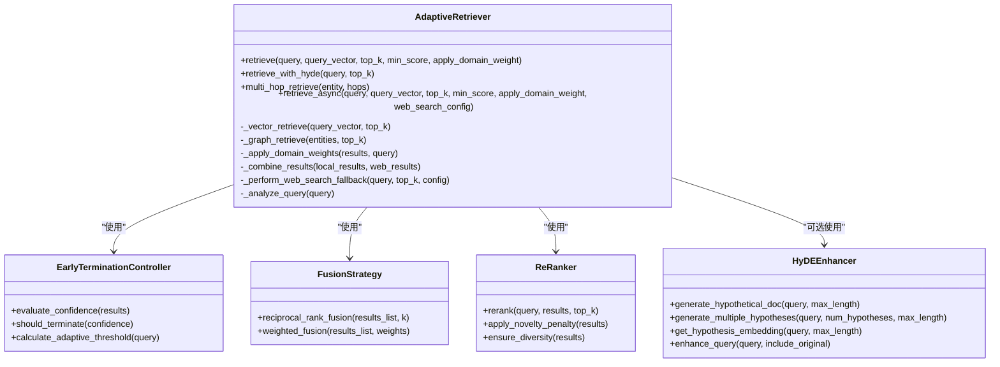
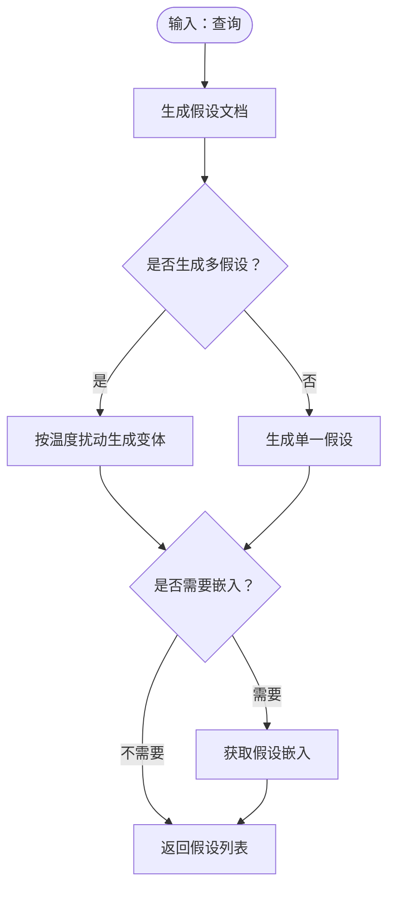
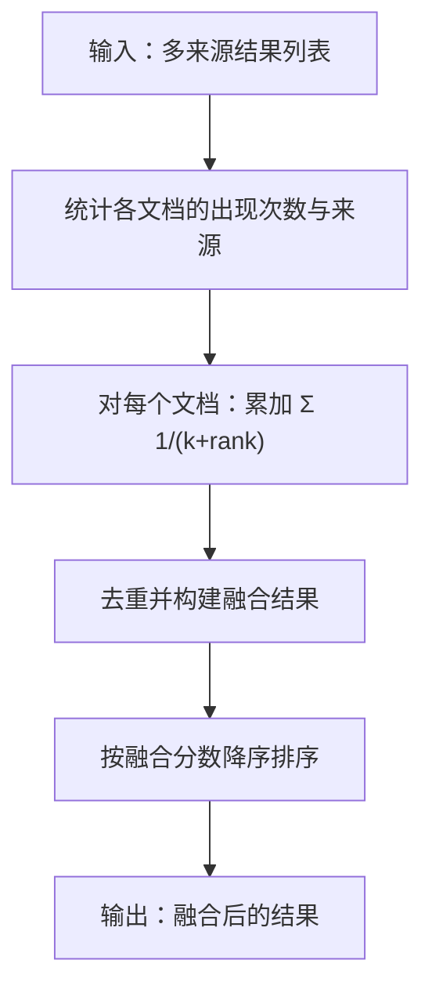
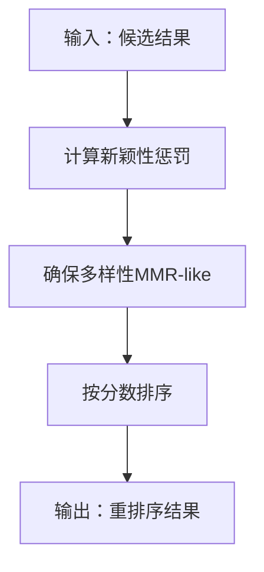
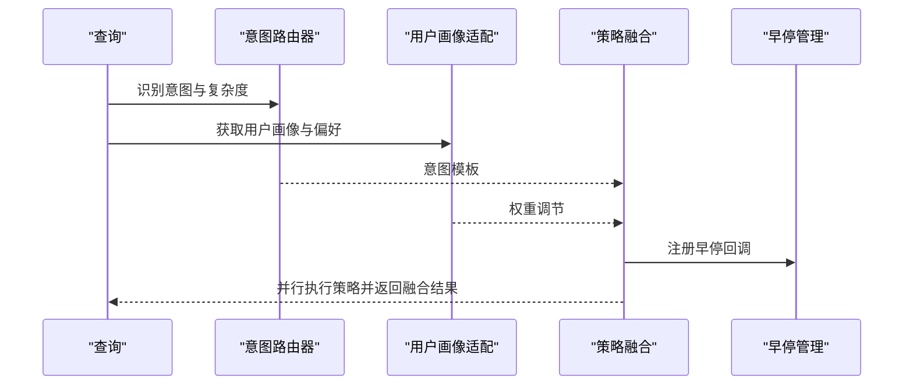
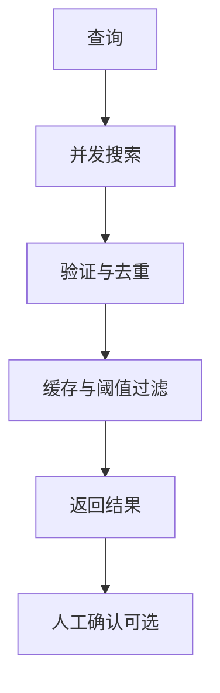
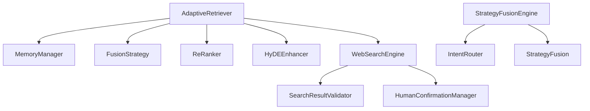

# 检索层 (L3) - 信息检索与匹配

<cite>
**本文引用的文件**   
- [src/retrieval/__init__.py](file://src/retrieval/__init__.py)
- [src/retrieval/retriever.py](file://src/retrieval/retriever.py)
- [src/retrieval/hyde.py](file://src/retrieval/hyde.py)
- [src/retrieval/fusion.py](file://src/retrieval/fusion.py)
- [src/retrieval/reranker.py](file://src/retrieval/reranker.py)
- [src/retrieval/models.py](file://src/retrieval/models.py)
- [src/retrieval/smart_routing/engine.py](file://src/retrieval/smart_routing/engine.py)
- [src/retrieval/smart_routing/intent_router.py](file://src/retrieval/smart_routing/intent_router.py)
- [src/retrieval/smart_routing/strategy_fusion.py](file://src/retrieval/smart_routing/strategy_fusion.py)
- [src/retrieval/web_search/engine.py](file://src/retrieval/web_search/engine.py)
- [src/retrieval/web_search/validator.py](file://src/retrieval/web_search/validator.py)
- [src/retrieval/web_search/confirmation.py](file://src/retrieval/web_search/confirmation.py)
- [src/core/config.py](file://src/core/config.py)
- [src/memory/manager.py](file://src/memory/manager.py)
- [src/domain/knowledge_base.py](file://src/domain/knowledge_base.py)
</cite>

## 目录
1. [简介](#简介)
2. [项目结构](#项目结构)
3. [核心组件](#核心组件)
4. [架构总览](#架构总览)
5. [详细组件分析](#详细组件分析)
6. [依赖分析](#依赖分析)
7. [性能考量](#性能考量)
8. [故障排查指南](#故障排查指南)
9. [结论](#结论)
10. [附录](#附录)

## 简介
本文件面向 NecoRAG 检索层（L3），系统性阐述其智能信息检索与匹配能力，重点覆盖：
- 自适应检索器：依据查询特征动态选择最优检索策略
- HyDE 增强：通过假设嵌入提升检索质量
- 结果融合：多路检索结果的融合与去重
- 重排序系统：新颖性惩罚与多样性保障
- 智能路由引擎：基于查询意图的动态路径选择
- 互联网搜索回退与人工确认流程
- 性能优化与缓存策略
- 检索效果评估与调优指南

## 项目结构
检索层位于 src/retrieval 目录下，围绕“自适应检索器 + HyDE + 融合 + 重排序 + 智能路由 + 网络搜索”的闭环展开。核心模块如下：
- 自适应检索器：统一调度向量检索、图谱检索、HyDE、融合、重排序与早停
- HyDE 增强器：生成假设文档并可选嵌入
- 结果融合策略：RRF 与加权融合
- 重排序器：新颖性惩罚与多样性保障
- 智能路由引擎：意图识别、用户画像适配、策略融合与早停
- 网络搜索：多引擎并发、结果验证与人工确认

**图表来源**
- [src/retrieval/retriever.py:135-644](file://src/retrieval/retriever.py#L135-L644)
- [src/retrieval/hyde.py:17-213](file://src/retrieval/hyde.py#L17-L213)
- [src/retrieval/fusion.py:9-128](file://src/retrieval/fusion.py#L9-L128)
- [src/retrieval/reranker.py:11-186](file://src/retrieval/reranker.py#L11-L186)
- [src/retrieval/smart_routing/engine.py:34-274](file://src/retrieval/smart_routing/engine.py#L34-L274)
- [src/retrieval/smart_routing/intent_router.py:91-278](file://src/retrieval/smart_routing/intent_router.py#L91-L278)
- [src/retrieval/smart_routing/strategy_fusion.py:43-349](file://src/retrieval/smart_routing/strategy_fusion.py#L43-L349)
- [src/retrieval/web_search/engine.py:20-362](file://src/retrieval/web_search/engine.py#L20-L362)
- [src/retrieval/web_search/validator.py:17-352](file://src/retrieval/web_search/validator.py#L17-L352)
- [src/retrieval/web_search/confirmation.py:17-391](file://src/retrieval/web_search/confirmation.py#L17-L391)

**章节来源**
- [src/retrieval/__init__.py:1-33](file://src/retrieval/__init__.py#L1-L33)

## 核心组件
- 自适应检索器（AdaptiveRetriever）
  - 多路检索：向量检索、图谱检索
  - 结果融合：RRF
  - 重排序：新颖性惩罚 + 多样性
  - 领域权重：关键词、时效、领域加权
  - 早停：置信度阈值与边际收益
  - HyDE：假设文档生成与检索
  - 互联网搜索回退与合并
- HyDE 增强器（HyDEEnhancer）
  - 假设文档生成、可选嵌入、多假设变体
- 结果融合策略（FusionStrategy）
  - RRF 与加权融合
- 重排序器（ReRanker）
  - 新颖性惩罚、多样性保障
- 智能路由引擎（StrategyFusionEngine）
  - 意图识别、用户画像、策略权重、CoT 决策、早停
- 网络搜索（WebSearchEngine）
  - 多引擎并发、速率限制、缓存、去重、阈值过滤
  - SearchResultValidator：可信度与相关性评估
  - HumanConfirmationManager：确认请求生命周期管理

**章节来源**
- [src/retrieval/retriever.py:135-644](file://src/retrieval/retriever.py#L135-L644)
- [src/retrieval/hyde.py:17-213](file://src/retrieval/hyde.py#L17-L213)
- [src/retrieval/fusion.py:9-128](file://src/retrieval/fusion.py#L9-L128)
- [src/retrieval/reranker.py:11-186](file://src/retrieval/reranker.py#L11-L186)
- [src/retrieval/smart_routing/engine.py:34-274](file://src/retrieval/smart_routing/engine.py#L34-L274)
- [src/retrieval/web_search/engine.py:20-362](file://src/retrieval/web_search/engine.py#L20-L362)
- [src/retrieval/web_search/validator.py:17-352](file://src/retrieval/web_search/validator.py#L17-L352)
- [src/retrieval/web_search/confirmation.py:17-391](file://src/retrieval/web_search/confirmation.py#L17-L391)

## 架构总览
检索层采用“自适应 + 融合 + 重排序 + 路由 + 网络回退”的流水线式架构，支持多策略并行与早停，兼顾质量与性能。

**图表来源**
- [src/retrieval/retriever.py:224-644](file://src/retrieval/retriever.py#L224-L644)
- [src/retrieval/hyde.py:58-170](file://src/retrieval/hyde.py#L58-L170)
- [src/retrieval/fusion.py:18-70](file://src/retrieval/fusion.py#L18-L70)
- [src/retrieval/reranker.py:42-77](file://src/retrieval/reranker.py#L42-L77)
- [src/retrieval/web_search/engine.py:112-186](file://src/retrieval/web_search/engine.py#L112-L186)

## 详细组件分析

### 自适应检索器（AdaptiveRetriever）
- 多路检索与融合
  - 向量检索：基于语义向量相似度
  - 图谱检索：基于实体关系（当前最小实现为空）
  - 融合：RRF，按倒数排名累加分数
- 重排序与领域权重
  - 重排序：新颖性惩罚与多样性保障
  - 领域权重：关键词、时效、领域加权，支持查询增强
- 早停机制
  - 基于置信度阈值与边际收益递减
  - 自适应阈值随查询长度变化
- HyDE 增强
  - 生成假设文档，支持多假设变体
  - 可选嵌入（需外部 LLM 客户端）
- 互联网搜索回退
  - 当本地结果不足时，触发网络搜索
  - 结果验证、去重、合并与再排序
- 异步检索
  - 支持异步执行与回退合并

**图表来源**
- [src/retrieval/retriever.py:135-644](file://src/retrieval/retriever.py#L135-L644)
- [src/retrieval/fusion.py:9-128](file://src/retrieval/fusion.py#L9-L128)
- [src/retrieval/reranker.py:11-186](file://src/retrieval/reranker.py#L11-L186)
- [src/retrieval/hyde.py:17-213](file://src/retrieval/hyde.py#L17-L213)

**章节来源**
- [src/retrieval/retriever.py:135-644](file://src/retrieval/retriever.py#L135-L644)

### HyDE 增强技术
- 目标：通过生成“假设性答案文档”来增强检索，缓解查询模糊问题
- 能力：
  - 基于 LLM 的假设生成（可回退到规则模板）
  - 多假设变体生成（温度扰动）
  - 可选获取假设嵌入（需 LLM 客户端）
  - 查询增强：返回原始查询与假设列表

**图表来源**
- [src/retrieval/hyde.py:58-170](file://src/retrieval/hyde.py#L58-L170)

**章节来源**
- [src/retrieval/hyde.py:17-213](file://src/retrieval/hyde.py#L17-L213)

### 结果融合策略
- RRF（Reciprocal Rank Fusion）
  - 对每个文档在不同来源中的排名求 1/(k+rank)，累加得到融合分数
  - 去重后按融合分数排序
- 加权融合
  - 对各来源结果按权重累加分数，支持归一化权重

**图表来源**
- [src/retrieval/fusion.py:18-70](file://src/retrieval/fusion.py#L18-L70)

**章节来源**
- [src/retrieval/fusion.py:9-128](file://src/retrieval/fusion.py#L9-L128)

### 重排序系统
- 新颖性惩罚：抑制与已选结果重复的内容
- 多样性保障：基于 MMR-like 策略，平衡相关性与重复度
- 相似度计算：当前采用 Jaccard 相似度（可扩展）

**图表来源**
- [src/retrieval/reranker.py:79-160](file://src/retrieval/reranker.py#L79-L160)

**章节来源**
- [src/retrieval/reranker.py:11-186](file://src/retrieval/reranker.py#L11-L186)

### 智能路由引擎
- 三层决策架构
  - 意图识别层：识别问题类型、复杂度、实体
  - 用户画像层：匹配专业度与偏好，动态调节策略权重
  - 策略融合层：并行执行多策略，融合与多样性控制
- CoT 决策与早停
  - 基于意图与复杂度的概率触发
  - 早停回调：根据置信度与耗时动态终止

**图表来源**
- [src/retrieval/smart_routing/engine.py:68-249](file://src/retrieval/smart_routing/engine.py#L68-L249)
- [src/retrieval/smart_routing/intent_router.py:115-278](file://src/retrieval/smart_routing/intent_router.py#L115-L278)
- [src/retrieval/smart_routing/strategy_fusion.py:78-158](file://src/retrieval/smart_routing/strategy_fusion.py#L78-L158)

**章节来源**
- [src/retrieval/smart_routing/engine.py:34-274](file://src/retrieval/smart_routing/engine.py#L34-L274)
- [src/retrieval/smart_routing/intent_router.py:91-278](file://src/retrieval/smart_routing/intent_router.py#L91-L278)
- [src/retrieval/smart_routing/strategy_fusion.py:43-349](file://src/retrieval/smart_routing/strategy_fusion.py#L43-L349)

### 互联网搜索与人工确认
- WebSearchEngine
  - 多引擎并发：Google、Bing、DuckDuckGo
  - 速率限制、缓存（TTL）、去重、阈值过滤
- SearchResultValidator
  - 可信度与相关性评估、内容过滤、语言一致性
- HumanConfirmationManager
  - 确认请求生命周期、超时处理、回调通知

**图表来源**
- [src/retrieval/web_search/engine.py:112-186](file://src/retrieval/web_search/engine.py#L112-L186)
- [src/retrieval/web_search/validator.py:56-90](file://src/retrieval/web_search/validator.py#L56-L90)
- [src/retrieval/web_search/confirmation.py:58-191](file://src/retrieval/web_search/confirmation.py#L58-L191)

**章节来源**
- [src/retrieval/web_search/engine.py:20-362](file://src/retrieval/web_search/engine.py#L20-L362)
- [src/retrieval/web_search/validator.py:17-352](file://src/retrieval/web_search/validator.py#L17-L352)
- [src/retrieval/web_search/confirmation.py:17-391](file://src/retrieval/web_search/confirmation.py#L17-L391)

### 领域权重与知识库
- 领域权重计算
  - 关键字权重、时效权重、领域权重
  - 可选查询增强（抽取关键词与提升倍数）
- 知识库管理
  - 关键字与 FAQ 管理、语料建议、导入导出
  - 与领域配置集成（可选）

**章节来源**
- [src/retrieval/retriever.py:310-360](file://src/retrieval/retriever.py#L310-L360)
- [src/domain/knowledge_base.py:64-564](file://src/domain/knowledge_base.py#L64-L564)

## 依赖分析
- 组件耦合
  - AdaptiveRetriever 依赖 MemoryManager（向量检索）、FusionStrategy、ReRanker、HyDEEnhancer、WebSearchEngine
  - StrategyFusionEngine 依赖 IntentRouter、UserProfileAdapter、CoTController、StrategyFusion、EarlyStopping、FeedbackCollector、StrategyLearner
  - WebSearchEngine 依赖 SearchResultValidator、HumanConfirmationManager
- 外部依赖
  - LLM 客户端（用于 HyDE 嵌入）
  - 搜索引擎 API（Google、Bing）
  - 向量数据库与图数据库（通过 MemoryManager 抽象）

**图表来源**
- [src/retrieval/retriever.py:14-33](file://src/retrieval/retriever.py#L14-L33)
- [src/retrieval/smart_routing/engine.py:12-17](file://src/retrieval/smart_routing/engine.py#L12-L17)
- [src/retrieval/web_search/engine.py:15-17](file://src/retrieval/web_search/engine.py#L15-L17)

**章节来源**
- [src/retrieval/retriever.py:14-33](file://src/retrieval/retriever.py#L14-L33)
- [src/retrieval/smart_routing/engine.py:34-62](file://src/retrieval/smart_routing/engine.py#L34-L62)
- [src/retrieval/web_search/engine.py:27-45](file://src/retrieval/web_search/engine.py#L27-L45)

## 性能考量
- 早停机制
  - 基于置信度阈值与边际收益递减，显著减少无效计算
  - 自适应阈值随查询长度变化，兼顾长查询的稳定性
- 并行与异步
  - 智能路由策略并行执行，早停回调及时终止
  - 网络搜索并发多引擎，速率限制与缓存降低 API 压力
- 重排序与融合
  - RRF 与新颖性惩罚降低冗余，多样性保障提升用户体验
- 缓存策略
  - WebSearchEngine 内存缓存（TTL），命中即返回
  - 检索路径追踪便于定位瓶颈
- 领域权重与查询增强
  - 关键字与时效加权提升相关性，减少无关结果

**章节来源**
- [src/retrieval/retriever.py:43-133](file://src/retrieval/retriever.py#L43-L133)
- [src/retrieval/web_search/engine.py:102-186](file://src/retrieval/web_search/engine.py#L102-L186)
- [src/retrieval/reranker.py:79-160](file://src/retrieval/reranker.py#L79-L160)
- [src/retrieval/fusion.py:18-70](file://src/retrieval/fusion.py#L18-L70)

## 故障排查指南
- 置信度过低导致提前返回
  - 检查 EarlyTerminationController 阈值与边际收益设置
  - 调整查询以提升置信度（如增加实体、关键词）
- 重排序后结果过少
  - 降低 min_score 或 rerank_top_k
  - 调整新颖性惩罚与多样性权重
- 网络搜索未生效
  - 确认 enable_web_search 与 search_engines 配置
  - 检查 API Key 与速率限制
- 结果重复或相似度过高
  - 提升新颖性惩罚与多样性权重
  - 检查相似度计算逻辑（当前为 Jaccard）
- 领域权重未生效
  - 确认 DomainConfig 可用与 apply_domain_weight 开启
  - 检查查询增强是否正确抽取关键词

**章节来源**
- [src/retrieval/retriever.py:294-308](file://src/retrieval/retriever.py#L294-L308)
- [src/retrieval/reranker.py:79-160](file://src/retrieval/reranker.py#L79-L160)
- [src/retrieval/web_search/engine.py:123-186](file://src/retrieval/web_search/engine.py#L123-L186)
- [src/retrieval/web_search/validator.py:56-90](file://src/retrieval/web_search/validator.py#L56-L90)

## 结论
检索层通过“自适应检索 + HyDE + 融合 + 重排序 + 智能路由 + 网络回退”的协同，实现了高质量、低延迟的信息检索。早停与缓存策略有效控制成本，领域权重与查询增强提升相关性，智能路由引擎使检索路径随意图与用户画像动态优化。配合网络搜索回退与人工确认流程，系统在开放域与受限域之间取得平衡。

## 附录

### 配置与使用示例（路径指引）
- 检索层配置
  - [src/core/config.py:160-193](file://src/core/config.py#L160-L193)：RetrievalConfig
  - [src/retrieval/retriever.py:142-179](file://src/retrieval/retriever.py#L142-L179)：初始化与 set_web_search_config
- HyDE 使用
  - [src/retrieval/hyde.py:58-170](file://src/retrieval/hyde.py#L58-L170)：generate_hypothetical_doc / enhance_query
- 结果融合
  - [src/retrieval/fusion.py:18-70](file://src/retrieval/fusion.py#L18-L70)：reciprocal_rank_fusion
- 重排序
  - [src/retrieval/reranker.py:42-77](file://src/retrieval/reranker.py#L42-L77)：rerank
- 智能路由
  - [src/retrieval/smart_routing/engine.py:68-129](file://src/retrieval/smart_routing/engine.py#L68-L129)：route_query
  - [src/retrieval/smart_routing/intent_router.py:115-155](file://src/retrieval/smart_routing/intent_router.py#L115-L155)：analyze_intent
- 网络搜索
  - [src/retrieval/web_search/engine.py:112-186](file://src/retrieval/web_search/engine.py#L112-L186)：search
  - [src/retrieval/web_search/validator.py:56-90](file://src/retrieval/web_search/validator.py#L56-L90)：validate_and_filter
  - [src/retrieval/web_search/confirmation.py:58-191](file://src/retrieval/web_search/confirmation.py#L58-L191)：create_confirmation_request

### 检索效果评估与调优清单
- 指标
  - 精确率、召回率、NDCG、MRR
  - 早停命中率、平均处理时间、缓存命中率
- 调优要点
  - 早停阈值与边际收益
  - RRF 参数 k、融合权重
  - 重排序新颖性与多样性权重
  - 领域权重因子与查询增强强度
  - 网络搜索阈值与引擎选择
  - 智能路由策略权重与 CoT 触发概率