# 结果融合策略

<cite>
**本文引用的文件**
- [src/retrieval/fusion.py](file://src/retrieval/fusion.py)
- [src/retrieval/reranker.py](file://src/retrieval/reranker.py)
- [src/retrieval/models.py](file://src/retrieval/models.py)
- [src/retrieval/retriever.py](file://src/retrieval/retriever.py)
- [src/retrieval/web_search/engine.py](file://src/retrieval/web_search/engine.py)
- [src/retrieval/web_search/models.py](file://src/retrieval/web_search/models.py)
- [src/domain/weight_calculator.py](file://src/domain/weight_calculator.py)
- [src/domain/config.py](file://src/domain/config.py)
- [src/retrieval/smart_routing/strategy_fusion.py](file://src/retrieval/smart_routing/strategy_fusion.py)
- [wiki/wiki/检索引擎模块/结果融合策略.md](file://wiki/wiki/检索引擎模块/结果融合策略.md)
- [example/domain_weight_example.py](file://example/domain_weight_example.py)
- [example/example_usage.py](file://example/example_usage.py)
</cite>

## 目录
1. [简介](#简介)
2. [项目结构](#项目结构)
3. [核心组件](#核心组件)
4. [架构总览](#架构总览)
5. [详细组件分析](#详细组件分析)
6. [依赖关系分析](#依赖关系分析)
7. [性能考量](#性能考量)
8. [故障排查指南](#故障排查指南)
9. [结论](#结论)
10. [附录](#附录)

## 简介
本文件围绕“结果融合策略”展开，系统阐述多路检索结果的融合算法与实现，重点覆盖倒数排名融合（Reciprocal Rank Fusion, RRF）的工作原理、参数调优与实践建议，并说明融合策略如何整合来自不同检索源（向量检索、图谱检索、网络搜索）的结果，包括权重分配、排序合并与去重处理。同时提供融合策略的配置与使用示例路径、参数优化与性能调优建议，以及融合效果评估与调试方法。

## 项目结构
与结果融合直接相关的核心模块如下：
- 融合策略：src/retrieval/fusion.py
- 重排序器：src/retrieval/reranker.py
- 检索数据模型：src/retrieval/models.py
- 自适应检索器（端到端流程编排）：src/retrieval/retriever.py
- 网络搜索（回退与合并）：src/retrieval/web_search/engine.py、src/retrieval/web_search/models.py
- 领域权重计算器（最终加权排序）：src/domain/weight_calculator.py、src/domain/config.py
- 智能路由与策略融合引擎（多策略并行与融合）：src/retrieval/smart_routing/strategy_fusion.py
- Wiki 文档（融合策略与端到端流程）：wiki/wiki/检索引擎模块/结果融合策略.md
- 示例：领域权重示例与完整工作流示例

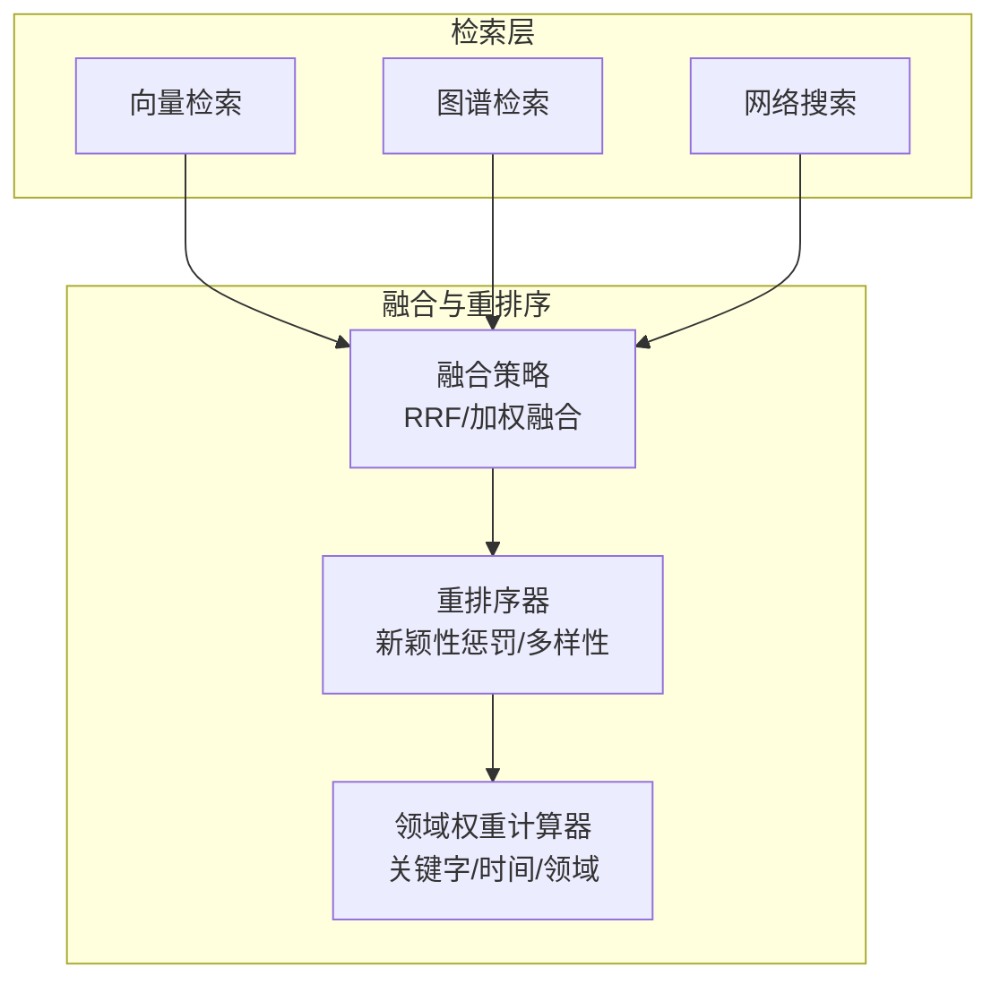

图表来源
- [src/retrieval/retriever.py:261-290](file://src/retrieval/retriever.py#L261-L290)
- [src/retrieval/fusion.py:18-127](file://src/retrieval/fusion.py#L18-L127)
- [src/retrieval/reranker.py:42-77](file://src/retrieval/reranker.py#L42-L77)
- [src/domain/weight_calculator.py:81-146](file://src/domain/weight_calculator.py#L81-L146)

章节来源
- [src/retrieval/retriever.py:261-290](file://src/retrieval/retriever.py#L261-L290)
- [src/retrieval/fusion.py:18-127](file://src/retrieval/fusion.py#L18-L127)
- [src/retrieval/reranker.py:42-77](file://src/retrieval/reranker.py#L42-L77)
- [src/domain/weight_calculator.py:81-146](file://src/domain/weight_calculator.py#L81-L146)

## 核心组件
- 融合策略（FusionStrategy）
  - 支持 RRF（倒数排名融合）与加权融合两种方式
  - 输入为多路检索结果列表，输出为按融合分数降序排列的统一结果
- 重排序器（ReRanker）
  - 基于新颖性惩罚与多样性保证的重排序
  - 提供 BGE-Reranker 模型的集成占位
- 领域权重计算器（CompositeWeightCalculator）
  - 综合关键字权重、时间权重与领域相关性权重，计算最终加权分数
- 自适应检索器（AdaptiveRetriever）
  - 将融合与重排序串联，支持早停与领域权重应用
- 网络搜索（WebSearchEngine）
  - 并发调用多个搜索引擎，合并与去重，作为本地检索的回退补充
- 智能路由与策略融合引擎（StrategyFusion）
  - 多策略并行执行、结果融合与归一化、多样性调整与重排序

章节来源
- [src/retrieval/fusion.py:9-128](file://src/retrieval/fusion.py#L9-L128)
- [src/retrieval/reranker.py:11-186](file://src/retrieval/reranker.py#L11-L186)
- [src/domain/weight_calculator.py:56-223](file://src/domain/weight_calculator.py#L56-L223)
- [src/retrieval/retriever.py:135-361](file://src/retrieval/retriever.py#L135-L361)
- [src/retrieval/web_search/engine.py:20-362](file://src/retrieval/web_search/engine.py#L20-L362)
- [src/retrieval/smart_routing/strategy_fusion.py:43-349](file://src/retrieval/smart_routing/strategy_fusion.py#L43-L349)

## 架构总览
下图展示了“检索-融合-重排序-领域权重”的端到端流程，以及融合策略在其中的位置。

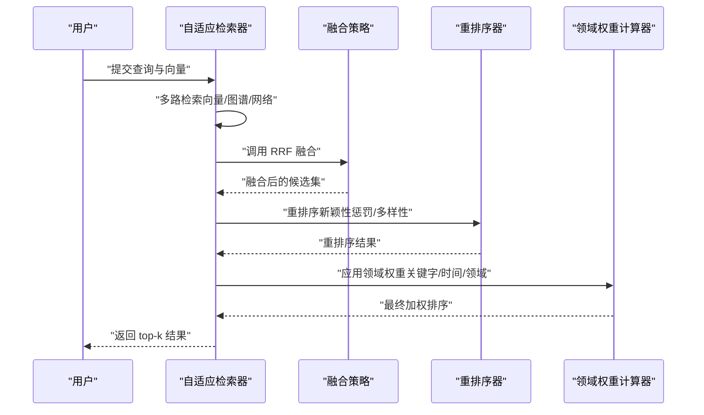

图表来源
- [src/retrieval/retriever.py:261-290](file://src/retrieval/retriever.py#L261-L290)
- [src/retrieval/fusion.py:18-70](file://src/retrieval/fusion.py#L18-L70)
- [src/retrieval/reranker.py:42-77](file://src/retrieval/reranker.py#L42-L77)
- [src/domain/weight_calculator.py:81-146](file://src/domain/weight_calculator.py#L81-L146)

章节来源
- [wiki/wiki/检索引擎模块/结果融合策略.md:108-127](file://wiki/wiki/检索引擎模块/结果融合策略.md#L108-L127)

## 详细组件分析

### 融合策略类（FusionStrategy）
- 支持的方法
  - RRF（倒数秩融合）：对每个结果按其在各路结果中的排名位置计算分数，累加后排序
  - 加权融合：对每路结果按给定权重进行加权累加，再排序
- 关键实现要点
  - RRF：以 k 为平滑参数，rank 从 0 开始，RRF 分数为 1/(k+rank+1)，累加相同 memory_id 的分数
  - 加权融合：先归一化权重，再按结果原始分数乘以对应权重累加
  - 输出统一为按分数降序的检索结果列表

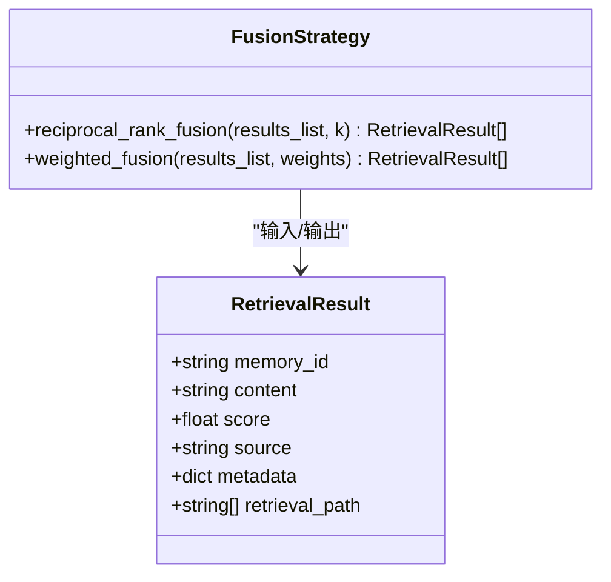

图表来源
- [src/retrieval/fusion.py:9-128](file://src/retrieval/fusion.py#L9-L128)
- [src/retrieval/models.py:9-18](file://src/retrieval/models.py#L9-L18)

章节来源
- [src/retrieval/fusion.py:18-127](file://src/retrieval/fusion.py#L18-L127)
- [src/retrieval/models.py:9-18](file://src/retrieval/models.py#L9-L18)

### RRF 算法工作机制与数学原理
- 数学公式
  - 对于某条记忆项 m，来自第 i 路检索结果的排名为 rank_i，则其 RRF 分数为：RRF(m) = Σ_i 1/(k + rank_i + 1)
  - k 控制“早期排名”的权重衰减速度：k 越大，排名靠后的影响越小
- 算法流程
  - 遍历每一路结果，记录每条结果的 memory_id 与其在该路的 rank
  - 计算每个 memory_id 的 RRF 分数并累加
  - 以分数降序排序，得到融合结果
- 优点
  - 不依赖绝对分数尺度，适合跨模型/跨来源的结果融合
  - 对“谁排得更前”敏感，能有效整合多路互补信息
- 局限
  - 对绝对相似度不敏感，可能弱化高分但晚出的结果
  - k 需要调优；过大可能抑制长尾，过小可能导致噪声放大

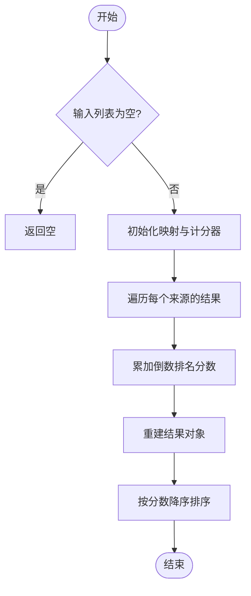

图表来源
- [src/retrieval/fusion.py:18-70](file://src/retrieval/fusion.py#L18-L70)

章节来源
- [wiki/wiki/检索引擎模块/结果融合策略.md:171-185](file://wiki/wiki/检索引擎模块/结果融合策略.md#L171-L185)

### 加权融合（Weighted Fusion）
- 输入：多路检索结果列表与权重列表
- 实现要点
  - 校验权重与结果路数一致
  - 对权重进行归一化
  - 按结果原始分数乘以权重累加
  - 以分数降序排序

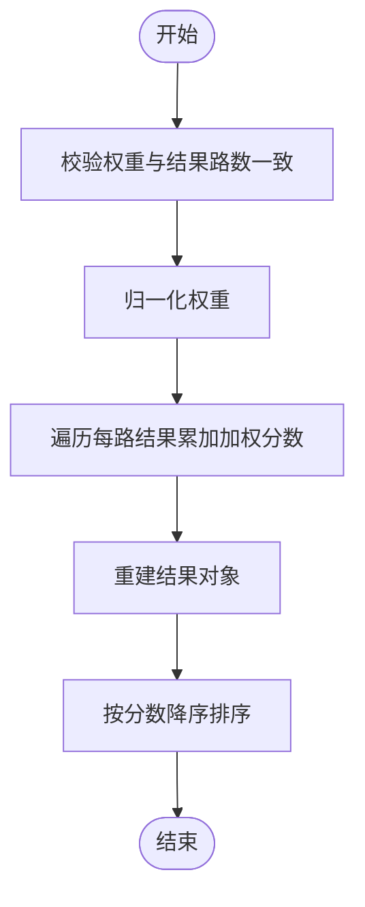

图表来源
- [src/retrieval/fusion.py:72-127](file://src/retrieval/fusion.py#L72-L127)

章节来源
- [src/retrieval/fusion.py:72-127](file://src/retrieval/fusion.py#L72-L127)

### 重排序器（ReRanker）
- 功能
  - 新颖性惩罚：抑制与已选结果重复的内容
  - 多样性保证：基于 MMR-like 策略选择多样化候选
  - 支持 BGE-Reranker 模型的集成占位
- 复杂度
  - 相似度计算与多样性选择在最坏情况下为 O(M^2)，M 为候选数

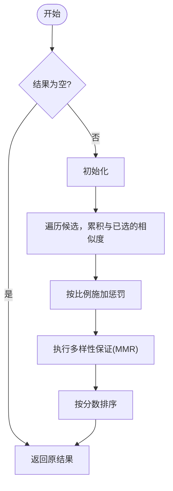

图表来源
- [src/retrieval/reranker.py:42-186](file://src/retrieval/reranker.py#L42-L186)

章节来源
- [src/retrieval/reranker.py:42-186](file://src/retrieval/reranker.py#L42-L186)

### 领域权重计算器（CompositeWeightCalculator）
- 综合权重计算公式
  - final_weight = base_score × (α × keyword_weight) × (β × temporal_weight) × (γ × domain_weight) × custom_weight
- 组成部分
  - 关键字权重：基于查询相关性与关键字等级
  - 时间权重：基于文档发布时间与衰减配置
  - 领域权重：基于领域相关性与权重乘数
- 批量重排序
  - 支持批量计算与 top-k 截断

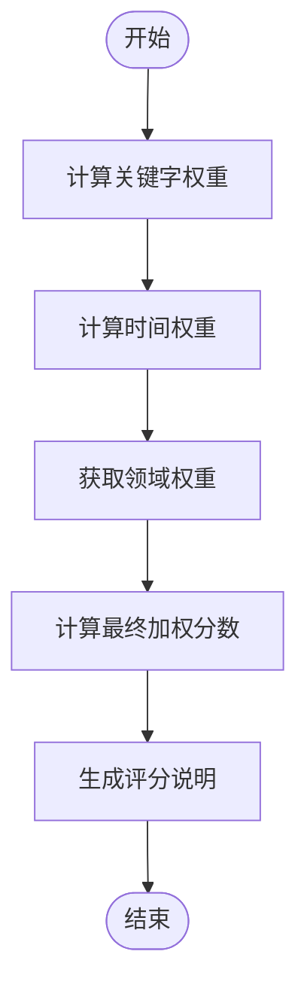

图表来源
- [src/domain/weight_calculator.py:81-146](file://src/domain/weight_calculator.py#L81-L146)

章节来源
- [src/domain/weight_calculator.py:56-223](file://src/domain/weight_calculator.py#L56-L223)
- [src/domain/config.py:53-161](file://src/domain/config.py#L53-L161)

### 自适应检索器（AdaptiveRetriever）中的融合流程
- 多路检索：向量检索、图谱检索
- 融合：调用 RRF 融合策略
- 重排序：应用新颖性惩罚与多样性
- 领域权重：根据关键字、时间与领域相关性进行最终加权
- 早停：基于置信度阈值与边际收益判断是否提前终止

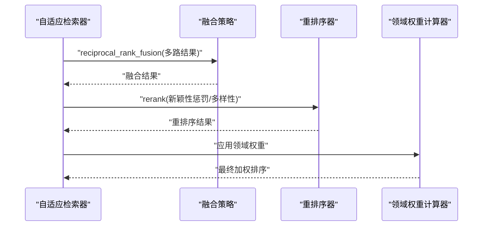

图表来源
- [src/retrieval/retriever.py:261-290](file://src/retrieval/retriever.py#L261-L290)
- [src/retrieval/fusion.py:18-70](file://src/retrieval/fusion.py#L18-L70)
- [src/retrieval/reranker.py:42-77](file://src/retrieval/reranker.py#L42-L77)
- [src/domain/weight_calculator.py:81-146](file://src/domain/weight_calculator.py#L81-L146)

章节来源
- [src/retrieval/retriever.py:261-308](file://src/retrieval/retriever.py#L261-L308)

### 网络搜索与结果合并
- 并发搜索：支持 Google、Bing、DuckDuckGo 等引擎
- 去重：基于 URL 去重，保留高质量摘要
- 合并：与本地检索结果合并，进行去重与分数调整
- 过滤：基于可信度与相关性阈值

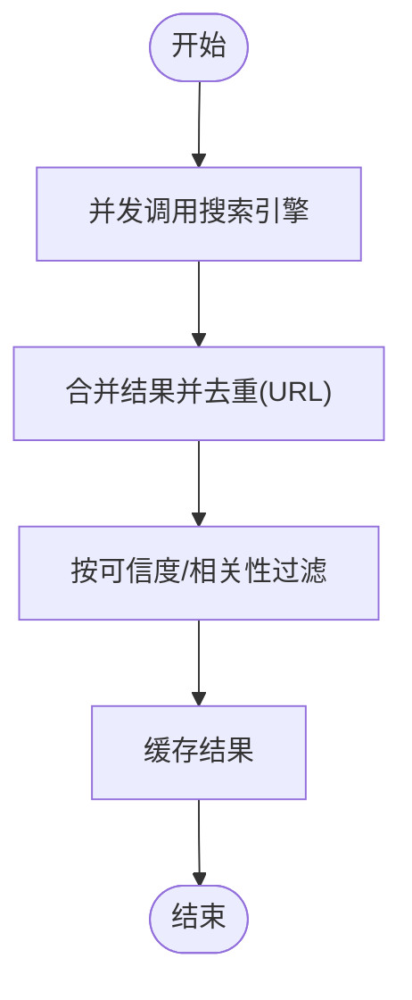

图表来源
- [src/retrieval/web_search/engine.py:112-186](file://src/retrieval/web_search/engine.py#L112-L186)

章节来源
- [src/retrieval/web_search/engine.py:20-362](file://src/retrieval/web_search/engine.py#L20-L362)
- [src/retrieval/web_search/models.py:22-83](file://src/retrieval/web_search/models.py#L22-L83)

### 智能路由与策略融合引擎（StrategyFusion）
- 多策略并行执行与结果融合
- 融合评分公式：融合分数 = Σ(w_s × norm(score_s)) × (1 + novelty) × diversity_penalty
- 多样性调整：避免单一来源垄断，按领域比例进行惩罚
- 重排序：占位为 BGE-Reranker，当前保持原顺序

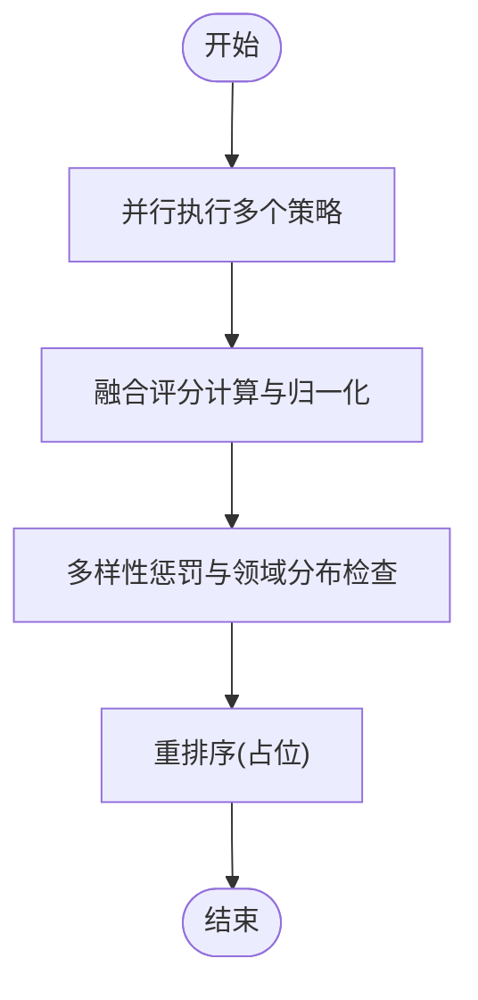

图表来源
- [src/retrieval/smart_routing/strategy_fusion.py:78-158](file://src/retrieval/smart_routing/strategy_fusion.py#L78-L158)
- [src/retrieval/smart_routing/strategy_fusion.py:217-271](file://src/retrieval/smart_routing/strategy_fusion.py#L217-L271)
- [src/retrieval/smart_routing/strategy_fusion.py:298-322](file://src/retrieval/smart_routing/strategy_fusion.py#L298-L322)

章节来源
- [src/retrieval/smart_routing/strategy_fusion.py:43-349](file://src/retrieval/smart_routing/strategy_fusion.py#L43-L349)

## 依赖关系分析
- FusionStrategy 依赖 RetrievalResult 数据模型
- AdaptiveRetriever 依赖 FusionStrategy、ReRanker、WebSearchEngine、CompositeWeightCalculator
- WebSearchEngine 依赖 WebSearchConfig 与 WebSearchResult
- CompositeWeightCalculator 依赖 DomainConfig、TemporalWeightCalculator、DomainRelevanceCalculator

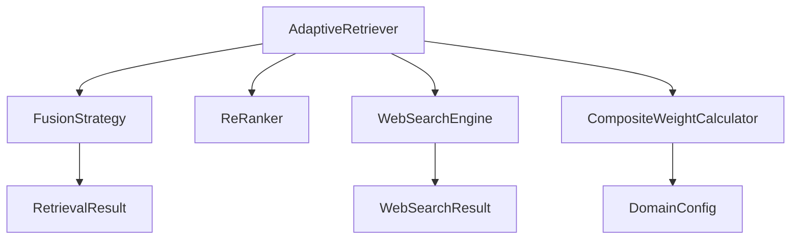

图表来源
- [src/retrieval/fusion.py:5-6](file://src/retrieval/fusion.py#L5-L6)
- [src/retrieval/retriever.py:14-23](file://src/retrieval/retriever.py#L14-L23)
- [src/retrieval/web_search/engine.py:15](file://src/retrieval/web_search/engine.py#L15)
- [src/domain/weight_calculator.py:11](file://src/domain/weight_calculator.py#L11)

章节来源
- [src/retrieval/fusion.py:5-6](file://src/retrieval/fusion.py#L5-L6)
- [src/retrieval/retriever.py:14-23](file://src/retrieval/retriever.py#L14-L23)
- [src/retrieval/web_search/engine.py:15](file://src/retrieval/web_search/engine.py#L15)
- [src/domain/weight_calculator.py:11](file://src/domain/weight_calculator.py#L11)

## 性能考量
- RRF 的时间复杂度约为 O(Σ n_i)，其中 n_i 为第 i 路结果数量；空间复杂度 O(N)，N 为去重后的记忆项数
- 加权融合的时间复杂度与 RRF 类似，但额外有权重归一化开销
- 重排序器的相似度计算与多样性选择在最坏情况下为 O(M^2)，M 为候选数
- 建议
  - 在融合前控制每路 top_k，避免融合阶段处理过多冗余结果
  - 合理设置 k 值，平衡“早期排名”与“长尾覆盖”
  - 对重排序器参数进行缓存与增量更新，减少重复计算

章节来源
- [wiki/wiki/检索引擎模块/结果融合策略.md:300-307](file://wiki/wiki/检索引擎模块/结果融合策略.md#L300-L307)

## 故障排查指南
- 融合后结果为空
  - 检查多路检索是否返回空列表
  - 确认 memory_id 是否一致（融合以 memory_id 去重）
- RRF 分数异常
  - 检查 k 值是否过大导致排名靠后项被抑制
  - 确认 rank 从 0 开始，且未被截断
- 加权融合报错
  - 确认 weights 与结果路数一致，且总和非零
- 重排序效果不佳
  - 调整新颖性惩罚与多样性权重，观察重复抑制与多样性之间的平衡
- 领域权重未生效
  - 确认领域配置已正确加载，且文档元数据包含必要字段
- 网络搜索合并问题
  - 检查 URL 去重逻辑与可信度/相关性阈值设置

章节来源
- [wiki/wiki/检索引擎模块/结果融合策略.md:309-321](file://wiki/wiki/检索引擎模块/结果融合策略.md#L309-L321)
- [src/retrieval/web_search/engine.py:153-178](file://src/retrieval/web_search/engine.py#L153-L178)

## 结论
结果融合策略通过 RRF 与加权融合，有效整合多路检索来源的互补信息；配合重排序器的新颖性惩罚与多样性保证，以及领域权重计算器的关键字、时间与领域加权，形成从“召回-融合-精排-加权”的完整闭环。合理调优融合参数（尤其是 RRF 的 k 值）与重排序权重，可在不同应用场景下取得更佳的检索效果与用户体验。

## 附录
- 领域权重使用示例
  - 示例文件路径：[example/domain_weight_example.py](file://example/domain_weight_example.py)
  - 包含领域配置、时间权重、相关性评分与综合权重计算示例
- 完整工作流程示例
  - 示例文件路径：[example/example_usage.py](file://example/example_usage.py)
  - 展示感知、记忆、检索、精炼与交互的端到端流程
- 智能路由与策略融合引擎使用示例
  - 示例文件路径：[src/retrieval/smart_routing/example_usage.py](file://src/retrieval/smart_routing/example_usage.py)
  - 展示意图路由、用户画像适配、反馈学习与早停机制

章节来源
- [example/domain_weight_example.py:1-267](file://example/domain_weight_example.py#L1-L267)
- [example/example_usage.py:94-136](file://example/example_usage.py#L94-L136)
- [src/retrieval/smart_routing/example_usage.py:18-58](file://src/retrieval/smart_routing/example_usage.py#L18-L58)