# 自适应检索器

<cite>
**本文引用的文件**
- [src/retrieval/retriever.py](file://src/retrieval/retriever.py)
- [src/retrieval/hyde.py](file://src/retrieval/hyde.py)
- [src/retrieval/reranker.py](file://src/retrieval/reranker.py)
- [src/retrieval/fusion.py](file://src/retrieval/fusion.py)
- [src/retrieval/models.py](file://src/retrieval/models.py)
- [src/retrieval/web_search/engine.py](file://src/retrieval/web_search/engine.py)
- [src/domain/weight_calculator.py](file://src/domain/weight_calculator.py)
- [src/domain/config.py](file://src/domain/config.py)
- [src/adaptive/engine.py](file://src/adaptive/engine.py)
- [src/adaptive/config.py](file://src/adaptive/config.py)
- [src/retrieval/smart_routing/engine.py](file://src/retrieval/smart_routing/engine.py)
- [src/retrieval/smart_routing/early_stopping.py](file://src/retrieval/smart_routing/early_stopping.py)
- [example/example_usage.py](file://example/example_usage.py)
</cite>

## 目录
1. [简介](#简介)
2. [项目结构](#项目结构)
3. [核心组件](#核心组件)
4. [架构总览](#架构总览)
5. [详细组件分析](#详细组件分析)
6. [依赖关系分析](#依赖关系分析)
7. [性能考量](#性能考量)
8. [故障排除指南](#故障排除指南)
9. [结论](#结论)
10. [附录](#附录)

## 简介
本文件面向“自适应检索器”，系统性阐述其在 NecoRAG 框架中的定位与实现方式，重点覆盖以下方面：
- 多路检索策略：向量检索、图谱检索、HyDE 增强、重排序与结果融合
- 早停机制：置信度评估与自适应阈值计算
- 查询分析与领域权重计算：关键词增强、时间权重、领域权重
- 异步检索与互联网搜索回退机制
- 与自适应学习引擎的协同：个性化配置与策略优化
- 性能优化建议与故障排除

## 项目结构
自适应检索器位于检索层（L3），与感知层（L1）、记忆层（L2）、巩固层（L4）、交互层（L5）共同构成五层认知架构。其核心文件组织如下：
- 检索器主体：src/retrieval/retriever.py
- HyDE 增强：src/retrieval/hyde.py
- 重排序器：src/retrieval/reranker.py
- 结果融合：src/retrieval/fusion.py
- 数据模型：src/retrieval/models.py
- 互联网搜索：src/retrieval/web_search/engine.py
- 领域权重：src/domain/weight_calculator.py、src/domain/config.py
- 自适应学习：src/adaptive/engine.py、src/adaptive/config.py
- 智能路由与早停：src/retrieval/smart_routing/engine.py、src/retrieval/smart_routing/early_stopping.py
- 使用示例：example/example_usage.py

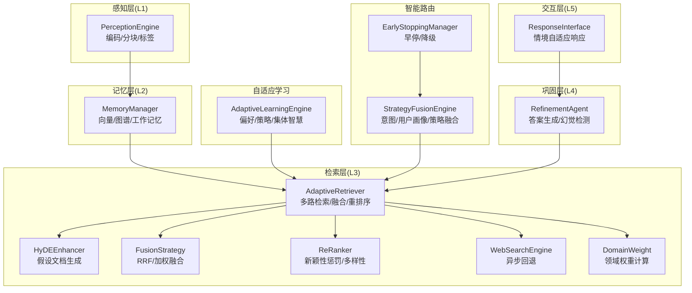

图表来源
- [src/retrieval/retriever.py:135-644](file://src/retrieval/retriever.py#L135-L644)
- [src/retrieval/hyde.py:17-213](file://src/retrieval/hyde.py#L17-L213)
- [src/retrieval/fusion.py:9-128](file://src/retrieval/fusion.py#L9-L128)
- [src/retrieval/reranker.py:11-186](file://src/retrieval/reranker.py#L11-L186)
- [src/retrieval/web_search/engine.py:20-362](file://src/retrieval/web_search/engine.py#L20-L362)
- [src/domain/weight_calculator.py:56-318](file://src/domain/weight_calculator.py#L56-L318)
- [src/adaptive/engine.py:30-598](file://src/adaptive/engine.py#L30-L598)
- [src/retrieval/smart_routing/engine.py:34-274](file://src/retrieval/smart_routing/engine.py#L34-L274)
- [src/retrieval/smart_routing/early_stopping.py:39-326](file://src/retrieval/smart_routing/early_stopping.py#L39-L326)

章节来源
- [src/retrieval/retriever.py:1-644](file://src/retrieval/retriever.py#L1-L644)
- [src/retrieval/hyde.py:1-213](file://src/retrieval/hyde.py#L1-L213)
- [src/retrieval/reranker.py:1-186](file://src/retrieval/reranker.py#L1-L186)
- [src/retrieval/fusion.py:1-128](file://src/retrieval/fusion.py#L1-L128)
- [src/retrieval/web_search/engine.py:1-362](file://src/retrieval/web_search/engine.py#L1-L362)
- [src/domain/weight_calculator.py:1-318](file://src/domain/weight_calculator.py#L1-L318)
- [src/domain/config.py:1-285](file://src/domain/config.py#L1-L285)
- [src/adaptive/engine.py:1-598](file://src/adaptive/engine.py#L1-L598)
- [src/retrieval/smart_routing/engine.py:1-274](file://src/retrieval/smart_routing/engine.py#L1-L274)
- [src/retrieval/smart_routing/early_stopping.py:1-326](file://src/retrieval/smart_routing/early_stopping.py#L1-L326)
- [example/example_usage.py:1-252](file://example/example_usage.py#L1-L252)

## 核心组件
- AdaptiveRetriever：统一的自适应检索器，负责多路检索、融合、重排序、领域权重、早停与异步回退。
- HyDEEnhancer：生成假设文档，增强检索语义覆盖。
- FusionStrategy：倒数排名融合（RRF）与加权融合。
- ReRanker：基于新颖性惩罚与多样性的重排序。
- WebSearchEngine：异步互联网搜索回退，支持多引擎并发与缓存。
- DomainWeight（CompositeWeightCalculator）：整合关键字、时间与领域权重，输出最终加权分数。
- AdaptiveLearningEngine：自适应学习引擎，提供个性化配置与策略优化。
- StrategyFusionEngine 与 EarlyStoppingManager：智能路由与早停控制，实现多维度早停与降级。

章节来源
- [src/retrieval/retriever.py:135-644](file://src/retrieval/retriever.py#L135-L644)
- [src/retrieval/hyde.py:17-213](file://src/retrieval/hyde.py#L17-L213)
- [src/retrieval/fusion.py:9-128](file://src/retrieval/fusion.py#L9-L128)
- [src/retrieval/reranker.py:11-186](file://src/retrieval/reranker.py#L11-L186)
- [src/retrieval/web_search/engine.py:20-362](file://src/retrieval/web_search/engine.py#L20-L362)
- [src/domain/weight_calculator.py:56-318](file://src/domain/weight_calculator.py#L56-L318)
- [src/adaptive/engine.py:30-598](file://src/adaptive/engine.py#L30-L598)
- [src/retrieval/smart_routing/engine.py:34-274](file://src/retrieval/smart_routing/engine.py#L34-L274)
- [src/retrieval/smart_routing/early_stopping.py:39-326](file://src/retrieval/smart_routing/early_stopping.py#L39-L326)

## 架构总览
自适应检索器在一次检索流程中，依次执行：
1) 查询增强与分析（关键词抽取、查询类型判定）
2) 多路检索（向量检索、图谱检索）
3) 结果融合（RRF）
4) 重排序（新颖性惩罚、多样性）
5) 领域权重计算（关键字、时间、领域）
6) 过滤与早停（置信度评估与阈值）
7) 异步回退（不足阈值时触发互联网搜索）
8) 输出 top-k 结果

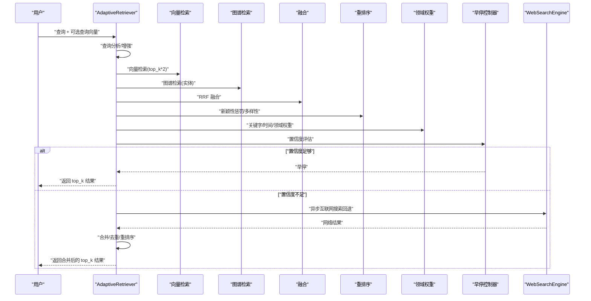

图表来源
- [src/retrieval/retriever.py:224-308](file://src/retrieval/retriever.py#L224-L308)
- [src/retrieval/retriever.py:500-546](file://src/retrieval/retriever.py#L500-L546)
- [src/retrieval/web_search/engine.py:112-186](file://src/retrieval/web_search/engine.py#L112-L186)
- [src/retrieval/smart_routing/early_stopping.py:57-110](file://src/retrieval/smart_routing/early_stopping.py#L57-L110)

## 详细组件分析

### AdaptiveRetriever：多路检索、融合、重排序与早停
- 多路检索：向量检索（基于 MemoryManager 的语义记忆）与图谱检索（实体驱动）。图谱检索当前返回空结果，预留扩展点。
- 结果融合：采用 RRF（Reciprocal Rank Fusion），对不同来源结果进行秩倒数融合，再按分数排序。
- 重排序：应用新颖性惩罚与多样性策略，避免重复与单调。
- 领域权重：当启用领域配置时，对每个候选文档计算关键字权重、时间权重与领域权重，得到最终加权分数并重排。
- 早停：EarlyTerminationController 基于置信度阈值与边际收益递减进行早停判断；支持自适应阈值（基于查询长度）。
- 异步回退：retrieve_async 在本地检索不足时，异步触发 WebSearchEngine 并合并结果，去重后返回。

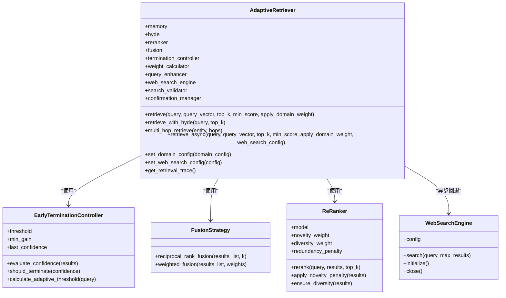

图表来源
- [src/retrieval/retriever.py:43-182](file://src/retrieval/retriever.py#L43-L182)
- [src/retrieval/retriever.py:224-644](file://src/retrieval/retriever.py#L224-L644)
- [src/retrieval/fusion.py:9-128](file://src/retrieval/fusion.py#L9-L128)
- [src/retrieval/reranker.py:11-186](file://src/retrieval/reranker.py#L11-L186)
- [src/retrieval/web_search/engine.py:20-362](file://src/retrieval/web_search/engine.py#L20-L362)

章节来源
- [src/retrieval/retriever.py:135-644](file://src/retrieval/retriever.py#L135-L644)

### HyDE 增强：假设文档生成与检索
- 通过 LLM 生成假设性答案文档，作为检索目标，提升模糊查询的召回效果。
- 支持多假设生成与向量表示获取；若无 LLM 客户端则回退到规则生成。
- 与检索器集成：可调用 retrieve_with_hyde 或在 retrieve 流程中使用（当前实现为占位，需将假设文档向量化后检索）。

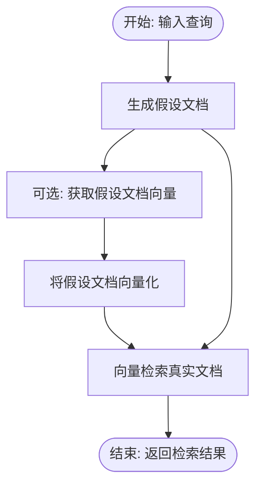

图表来源
- [src/retrieval/hyde.py:58-170](file://src/retrieval/hyde.py#L58-L170)
- [src/retrieval/retriever.py:362-388](file://src/retrieval/retriever.py#L362-L388)

章节来源
- [src/retrieval/hyde.py:17-213](file://src/retrieval/hyde.py#L17-L213)
- [src/retrieval/retriever.py:362-388](file://src/retrieval/retriever.py#L362-L388)

### 重排序器：新颖性惩罚与多样性
- 新颖性惩罚：对与已选结果相似的内容施加惩罚，降低重复。
- 多样性策略：基于 MMR 类似思路，最大化相关性同时最小化与已选结果的最大相似度。
- 可配置权重：新颖性权重、多样性权重与冗余惩罚系数。

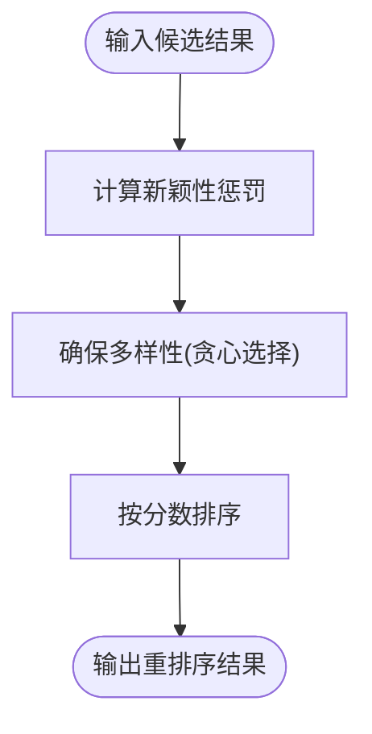

图表来源
- [src/retrieval/reranker.py:42-186](file://src/retrieval/reranker.py#L42-L186)

章节来源
- [src/retrieval/reranker.py:11-186](file://src/retrieval/reranker.py#L11-L186)

### 结果融合：RRF 与加权融合
- RRF：对来自不同来源的候选按秩倒数求和，去重后按分数排序。
- 加权融合：对不同来源结果按权重求和，适合已知来源重要性的情况。

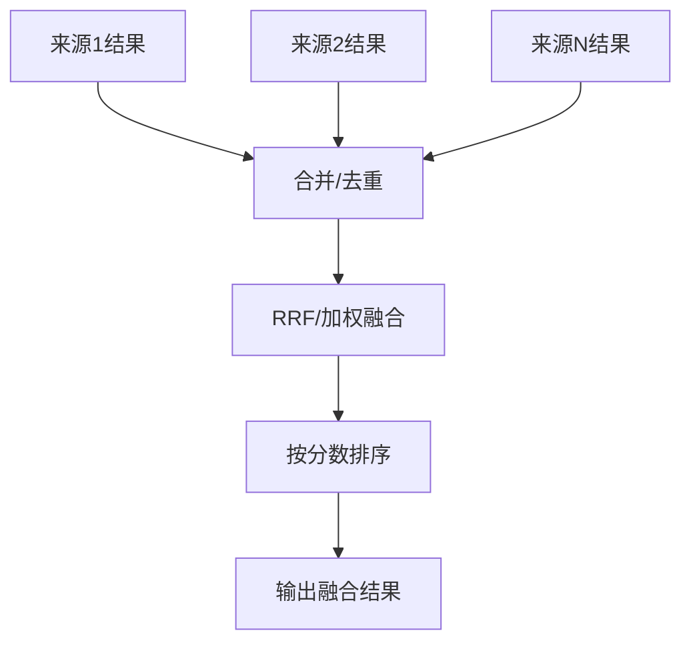

图表来源
- [src/retrieval/fusion.py:18-128](file://src/retrieval/fusion.py#L18-L128)

章节来源
- [src/retrieval/fusion.py:9-128](file://src/retrieval/fusion.py#L9-L128)

### 领域权重计算：关键字、时间与领域
- 关键字权重：基于领域配置中的关键字等级与权重，结合查询相关性计算。
- 时间权重：基于文档创建/更新时间与衰减系数，支持常青内容。
- 领域权重：根据文档来源领域与领域相关性等级，乘以相应权重因子。
- 综合公式：最终分数 = 基础分数 × α×关键字权重 × β×时间权重 × γ×领域权重 × 自定义权重。

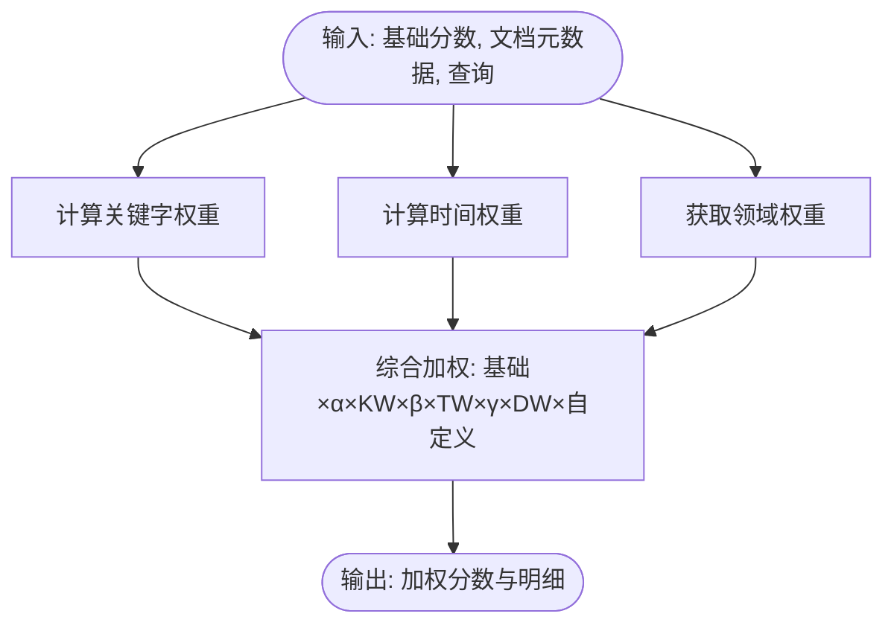

图表来源
- [src/domain/weight_calculator.py:81-146](file://src/domain/weight_calculator.py#L81-L146)
- [src/domain/config.py:54-161](file://src/domain/config.py#L54-L161)

章节来源
- [src/domain/weight_calculator.py:56-318](file://src/domain/weight_calculator.py#L56-L318)
- [src/domain/config.py:1-285](file://src/domain/config.py#L1-L285)

### 早停控制器：置信度评估与自适应阈值
- 置信度评估：基于 top-1 与 top-2 分数差、结果数量等综合计算。
- 早停判断：固定阈值与边际收益递减双策略；记录 last_confidence 用于递减判断。
- 自适应阈值：基于查询长度动态调整阈值，短查询降低阈值以保证召回。

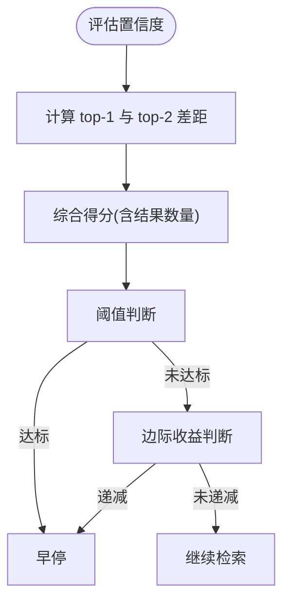

图表来源
- [src/retrieval/retriever.py:68-133](file://src/retrieval/retriever.py#L68-L133)

章节来源
- [src/retrieval/retriever.py:43-133](file://src/retrieval/retriever.py#L43-L133)

### 异步检索与互联网搜索回退
- retrieve_async：先执行本地检索，若结果数量不足，则异步触发 WebSearchEngine。
- 结果合并：本地结果保留原分数，网络结果适度提升分数并去重。
- WebSearchEngine：支持 Google、Bing、DuckDuckGo 多引擎并发搜索，带速率限制与缓存。

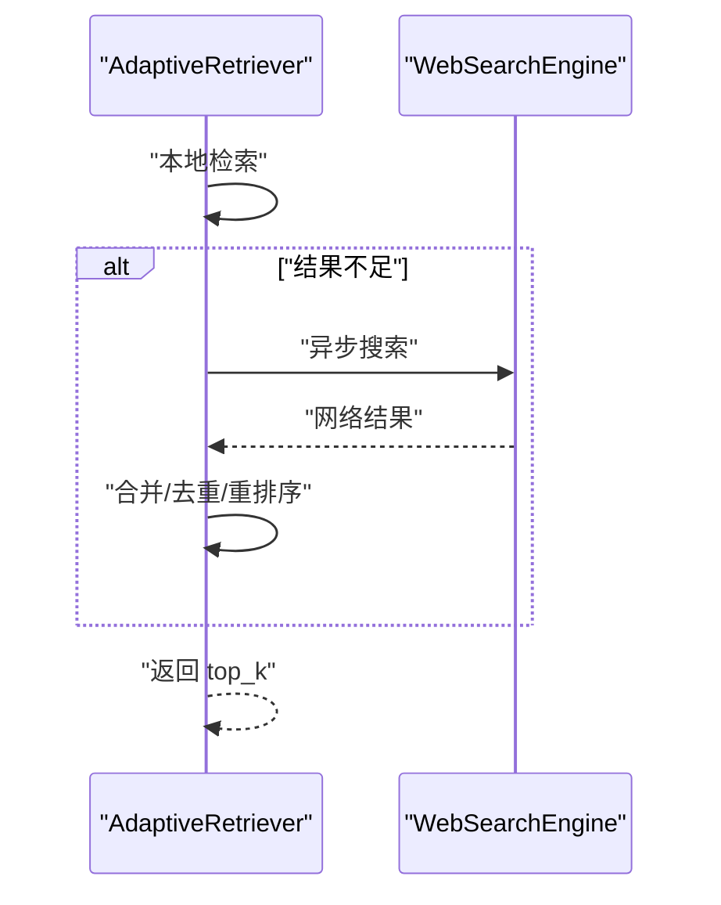

图表来源
- [src/retrieval/retriever.py:500-546](file://src/retrieval/retriever.py#L500-L546)
- [src/retrieval/web_search/engine.py:112-186](file://src/retrieval/web_search/engine.py#L112-L186)

章节来源
- [src/retrieval/retriever.py:500-644](file://src/retrieval/retriever.py#L500-L644)
- [src/retrieval/web_search/engine.py:20-362](file://src/retrieval/web_search/engine.py#L20-L362)

### 自适应学习引擎：个性化配置与策略优化
- 学习闭环：反馈收集、偏好预测、策略优化、集体智慧。
- 个性化配置：结合用户偏好与最优策略，动态调整 top_k、置信度阈值等参数。
- 指标监控：满意度趋势、策略优化收益、个性化准确度、知识覆盖增长。

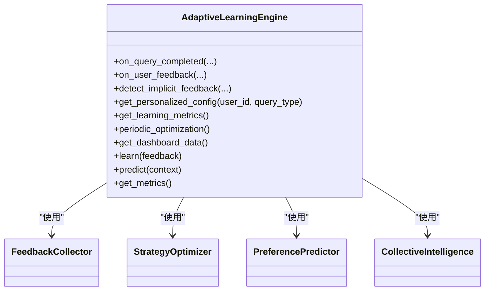

图表来源
- [src/adaptive/engine.py:30-598](file://src/adaptive/engine.py#L30-L598)

章节来源
- [src/adaptive/engine.py:30-598](file://src/adaptive/engine.py#L30-L598)
- [src/adaptive/config.py:15-200](file://src/adaptive/config.py#L15-L200)

### 智能路由与早停：多维度早停与降级
- 多维度早停：置信度阈值、边际收益递减、延迟预算、满意度预测。
- 降级等级：从轻微到较大/显著降级，逐步减少并行策略、跳过推理、仅向量检索、返回缓存等。
- 动态配置：根据意图置信度与用户画像动态调整阈值与延迟预算。

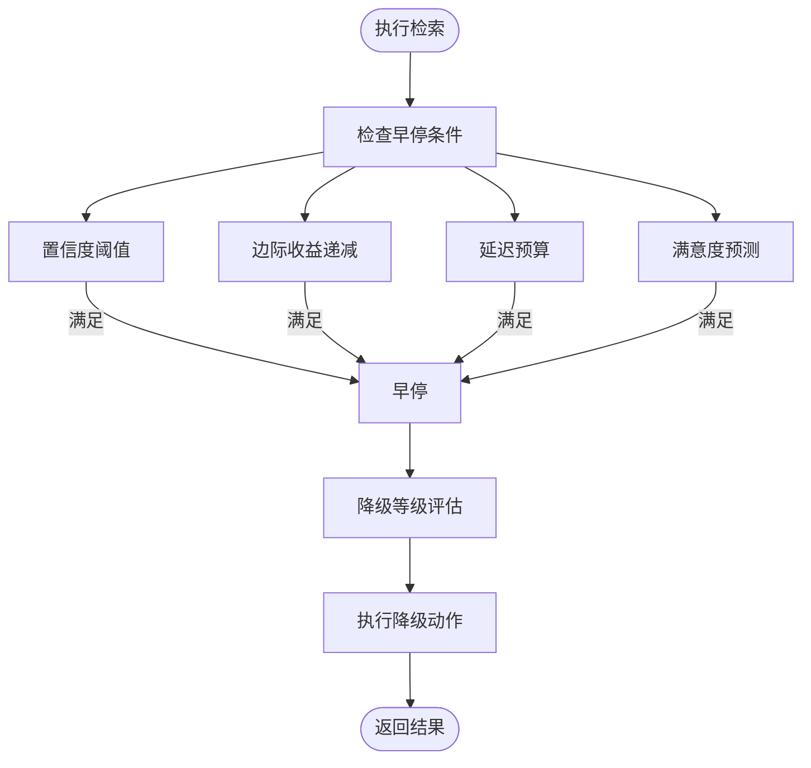

图表来源
- [src/retrieval/smart_routing/early_stopping.py:57-183](file://src/retrieval/smart_routing/early_stopping.py#L57-L183)
- [src/retrieval/smart_routing/engine.py:205-249](file://src/retrieval/smart_routing/engine.py#L205-L249)

章节来源
- [src/retrieval/smart_routing/early_stopping.py:39-326](file://src/retrieval/smart_routing/early_stopping.py#L39-L326)
- [src/retrieval/smart_routing/engine.py:34-274](file://src/retrieval/smart_routing/engine.py#L34-L274)

## 依赖关系分析
- 组件耦合
  - AdaptiveRetriever 依赖 MemoryManager（语义记忆）、ReRanker、FusionStrategy、CompositeWeightCalculator、WebSearchEngine。
  - HyDEEnhancer 依赖 LLM 客户端（可回退）。
  - StrategyFusionEngine 依赖意图识别、用户画像、CoT 控制器、早停管理器与反馈收集器。
- 外部依赖
  - WebSearchEngine 依赖 aiohttp 异步 HTTP 客户端与搜索引擎 API（Google/Bing/DuckDuckGo）。
  - ReRanker 的 BGE-Reranker 集成为 TODO，当前实现为规则化逻辑。
- 循环依赖
  - 未发现循环依赖；各模块职责清晰，接口边界明确。

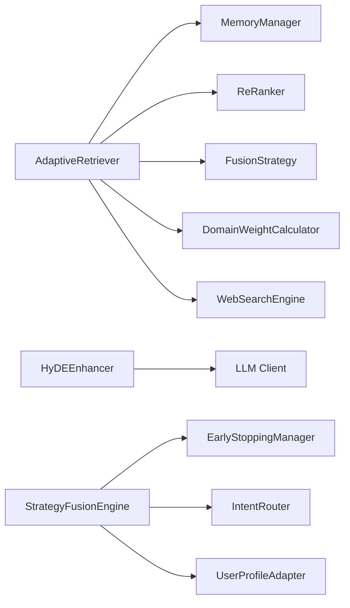

图表来源
- [src/retrieval/retriever.py:142-182](file://src/retrieval/retriever.py#L142-L182)
- [src/retrieval/hyde.py:24-48](file://src/retrieval/hyde.py#L24-L48)
- [src/retrieval/smart_routing/engine.py:44-62](file://src/retrieval/smart_routing/engine.py#L44-L62)

章节来源
- [src/retrieval/retriever.py:1-644](file://src/retrieval/retriever.py#L1-L644)
- [src/retrieval/hyde.py:1-213](file://src/retrieval/hyde.py#L1-L213)
- [src/retrieval/smart_routing/engine.py:1-274](file://src/retrieval/smart_routing/engine.py#L1-L274)

## 性能考量
- 多路检索并行化：向量检索与图谱检索可并行执行，融合后再重排序。
- 早停优化：在置信度足够时提前返回，避免不必要的重排序与领域权重计算。
- 重排序成本控制：新颖性惩罚与多样性策略在 top_k*2 规模内执行，避免 O(n^2) 复杂度。
- 缓存与限流：WebSearchEngine 内置缓存与速率限制，减少重复请求与 API 限流风险。
- 异步回退：仅在本地检索不足时触发，避免阻塞主流程。
- 领域权重批处理：CompositeWeightCalculator 支持批量计算，减少重复开销。

[本节为通用性能指导，不直接分析具体文件]

## 故障排除指南
- 无法连接搜索引擎
  - 检查 WebSearchEngine 的 API 密钥配置与网络访问权限。
  - 查看日志输出，确认搜索引擎返回状态码与错误信息。
- 结果为空或过少
  - 检查 EarlyTerminationController 的阈值设置与查询长度影响。
  - 调整 retrieve_async 的回退阈值与网络搜索配置。
- 重排序异常
  - 确认输入结果列表非空；检查新颖性惩罚与多样性参数设置。
- 领域权重不生效
  - 确认 DomainConfig 已正确加载且权重因子系数合理。
  - 检查文档元数据中的时间戳与是否为常青内容。
- 自适应学习指标异常
  - 检查 AdaptiveLearningEngine 的反馈收集与策略优化开关。
  - 验证配置文件的有效性与数值范围。

章节来源
- [src/retrieval/web_search/engine.py:188-343](file://src/retrieval/web_search/engine.py#L188-L343)
- [src/retrieval/retriever.py:294-308](file://src/retrieval/retriever.py#L294-L308)
- [src/retrieval/reranker.py:79-160](file://src/retrieval/reranker.py#L79-L160)
- [src/domain/weight_calculator.py:81-146](file://src/domain/weight_calculator.py#L81-L146)
- [src/adaptive/engine.py:339-406](file://src/adaptive/engine.py#L339-L406)

## 结论
自适应检索器通过多路检索、融合、重排序与领域权重计算，结合早停与异步回退机制，在保证检索质量的同时显著降低延迟与资源消耗。配合自适应学习引擎与智能路由系统，能够持续优化策略与个性化配置，实现“越用越智能”的用户体验。建议在生产环境中根据业务场景调整阈值、权重与回退策略，并定期评估学习指标与早停效果。

[本节为总结性内容，不直接分析具体文件]

## 附录

### 配置与使用示例（路径指引）
- 初始化与使用示例：参见 example_usage.py 中的 AdaptiveRetriever 使用片段。
- 自适应学习配置：参见 AdaptiveLearningConfig 的默认/积极/保守/最小配置。
- 领域配置：参见 DomainConfig 与 DomainConfigManager 的创建与加载。
- 智能路由与早停：参见 StrategyFusionEngine 与 EarlyStoppingManager 的使用。

章节来源
- [example/example_usage.py:94-136](file://example/example_usage.py#L94-L136)
- [src/adaptive/config.py:86-155](file://src/adaptive/config.py#L86-L155)
- [src/domain/config.py:243-284](file://src/domain/config.py#L243-L284)
- [src/retrieval/smart_routing/engine.py:68-129](file://src/retrieval/smart_routing/engine.py#L68-L129)
- [src/retrieval/smart_routing/early_stopping.py:210-243](file://src/retrieval/smart_routing/early_stopping.py#L210-L243)