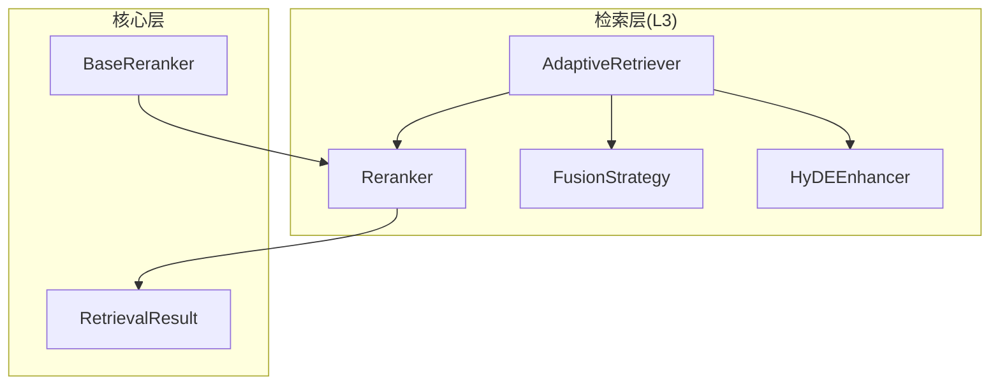
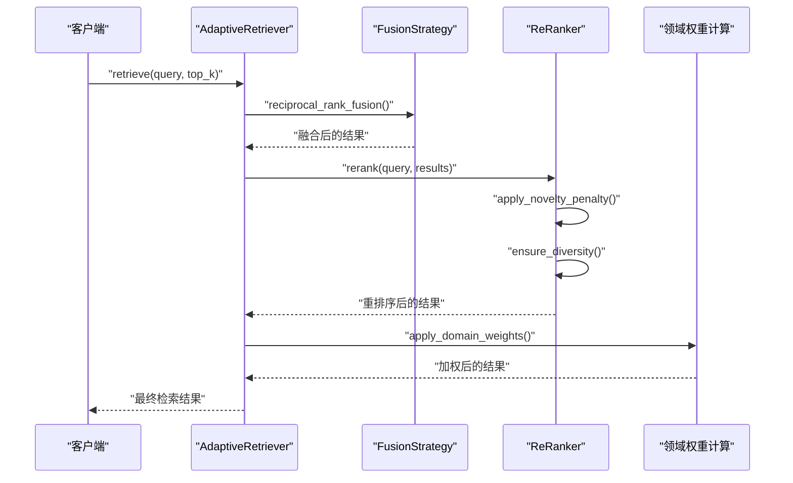
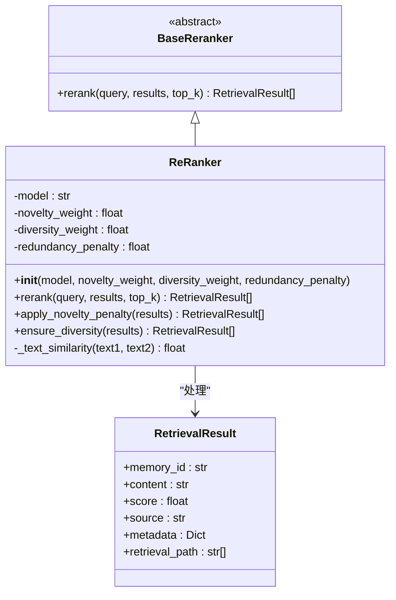
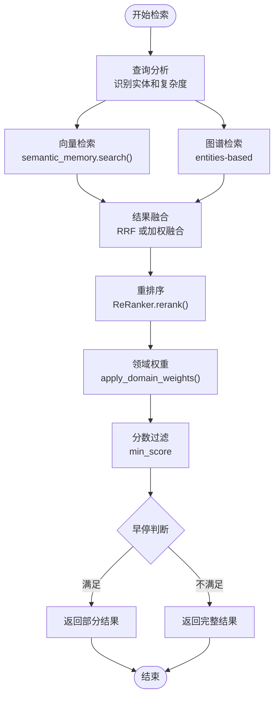
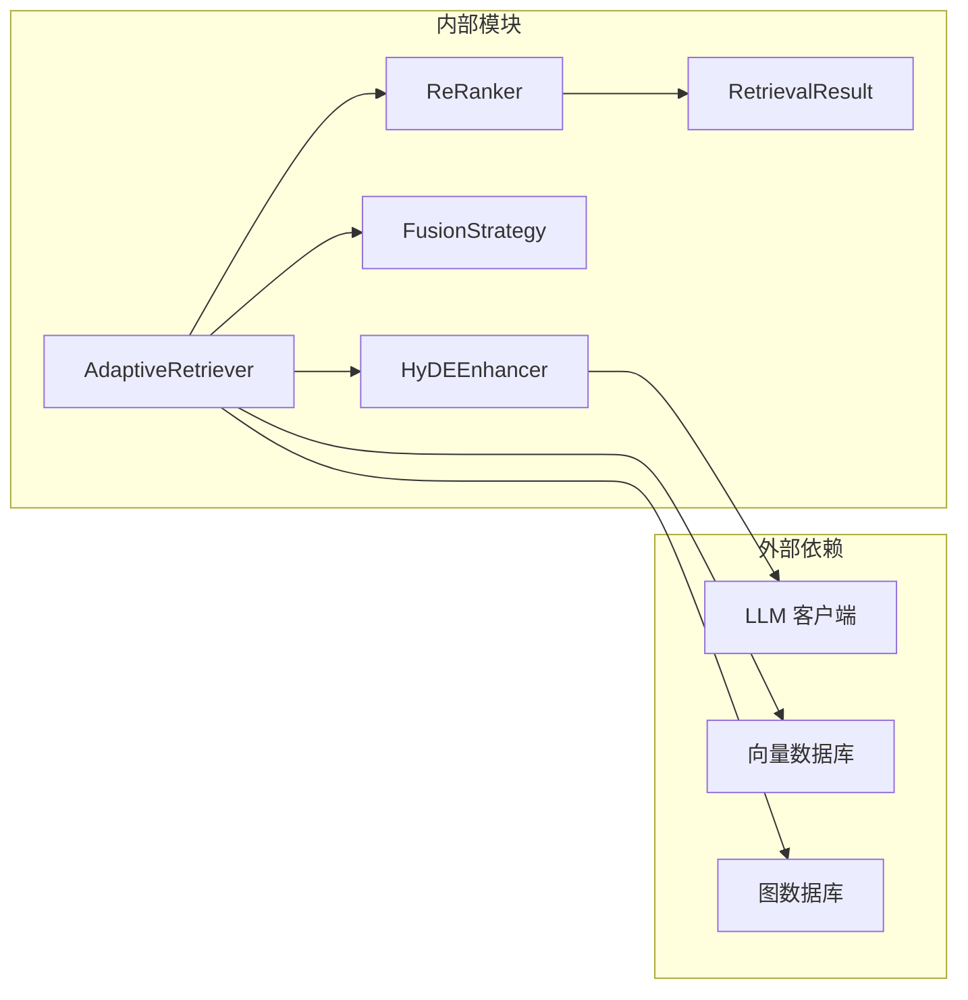

# 重排序系统

<cite>
**本文引用的文件**
- [src/retrieval/reranker.py](file://src/retrieval/reranker.py)
- [src/retrieval/models.py](file://src/retrieval/models.py)
- [src/retrieval/fusion.py](file://src/retrieval/fusion.py)
- [src/retrieval/retriever.py](file://src/retrieval/retriever.py)
- [src/retrieval/hyde.py](file://src/retrieval/hyde.py)
- [example/example_usage.py](file://example/example_usage.py)
- [src/core/base.py](file://src/core/base.py)
- [src/dashboard/models.py](file://src/dashboard/models.py)
- [tests/test_retrieval/test_retriever.py](file://tests/test_retrieval/test_retriever.py)
</cite>

## 目录
1. [简介](#简介)
2. [项目结构](#项目结构)
3. [核心组件](#核心组件)
4. [架构总览](#架构总览)
5. [详细组件分析](#详细组件分析)
6. [依赖分析](#依赖分析)
7. [性能考量](#性能考量)
8. [故障排查指南](#故障排查指南)
9. [结论](#结论)
10. [附录](#附录)

## 简介
本文件围绕重排序系统展开，重点解释 ReRanker 类的实现原理与使用方式，涵盖以下方面：
- 重排序模型的选择与配置（如 BGE-Reranker-v2 的集成现状与参数）
- 相似度计算方法与排序算法（新颖性惩罚、多样性保障、排序策略）
- 不同重排序模型的特点与适用场景（结合现有实现与参数说明）
- 特征工程与分数计算逻辑（基于文本相似度与 MMR-like 策略）
- 参数调优指南（模型选择策略、阈值设置、性能优化技巧）
- 重排序前后结果对比的可视化示例与效果评估方法

## 项目结构
重排序系统位于检索层（L3），作为精排阶段的核心组件，与融合策略、检索器、HyDE 增强器等模块协同工作。

**图表来源**
- [src/retrieval/retriever.py:135-308](file://src/retrieval/retriever.py#L135-L308)
- [src/retrieval/reranker.py:11-77](file://src/retrieval/reranker.py#L11-L77)
- [src/retrieval/fusion.py:9-70](file://src/retrieval/fusion.py#L9-L70)
- [src/retrieval/hyde.py:17-84](file://src/retrieval/hyde.py#L17-L84)

**章节来源**
- [src/retrieval/retriever.py:135-308](file://src/retrieval/retriever.py#L135-L308)
- [src/retrieval/reranker.py:11-77](file://src/retrieval/reranker.py#L11-L77)
- [src/retrieval/fusion.py:9-70](file://src/retrieval/fusion.py#L9-L70)
- [src/retrieval/hyde.py:17-84](file://src/retrieval/hyde.py#L17-L84)

## 核心组件
- ReRanker：重排序器，负责新颖性惩罚、多样性保障和最终排序
- BaseReranker：重排序器抽象基类，定义统一接口
- RetrievalResult：检索结果数据模型，包含内容、分数、来源等字段
- FusionStrategy：结果融合策略，提供 RRF 和加权融合两种方法
- AdaptiveRetriever：自适应检索器，整合多路检索、融合、重排序和领域权重

**章节来源**
- [src/retrieval/reranker.py:11-77](file://src/retrieval/reranker.py#L11-L77)
- [src/core/base.py:422-443](file://src/core/base.py#L422-L443)
- [src/retrieval/models.py:9-17](file://src/retrieval/models.py#L9-L17)
- [src/retrieval/fusion.py:9-70](file://src/retrieval/fusion.py#L9-L70)
- [src/retrieval/retriever.py:135-308](file://src/retrieval/retriever.py#L135-L308)

## 架构总览
重排序系统在检索流程中的位置与交互关系如下：

**图表来源**
- [src/retrieval/retriever.py:224-308](file://src/retrieval/retriever.py#L224-L308)
- [src/retrieval/reranker.py:42-77](file://src/retrieval/reranker.py#L42-L77)
- [src/retrieval/fusion.py:18-70](file://src/retrieval/fusion.py#L18-L70)

## 详细组件分析

### ReRanker 重排序器
ReRanker 是重排序系统的核心实现，提供新颖性惩罚、多样性保障和最终排序功能。

**图表来源**
- [src/core/base.py:422-443](file://src/core/base.py#L422-L443)
- [src/retrieval/reranker.py:11-186](file://src/retrieval/reranker.py#L11-L186)
- [src/retrieval/models.py:9-17](file://src/retrieval/models.py#L9-L17)

#### 新颖性惩罚机制
ReRanker 通过计算候选间的相似度矩阵，对重复内容施加惩罚：
- 计算每个候选与其之前已选候选的相似度
- 基于平均相似度和冗余惩罚系数调整分数
- 惩罚公式：`new_score = old_score × (1 - redundancy_penalty × avg_similarity)`

#### 多样性保障机制
采用 MMR-like 策略确保结果多样性：
- 使用贪心选择策略，每次选择使 MMR 分数最大的候选
- MMR 分数计算：`MMR = diversity_weight × relevance - (1 - diversity_weight) × max_similarity`
- 逐步构建多样化结果序列

#### 相似度计算
当前实现使用 Jaccard 相似度：
- 将文本分词并转换为词集合
- 计算交集大小与并集大小的比值
- 支持扩展为更精确的相似度计算方法

**章节来源**
- [src/retrieval/reranker.py:42-186](file://src/retrieval/reranker.py#L42-L186)

### AdaptiveRetriever 检索器
AdaptiveRetriever 作为重排序系统的协调者，整合多路检索、融合和重排序：

**图表来源**
- [src/retrieval/retriever.py:224-308](file://src/retrieval/retriever.py#L224-L308)

#### 早停机制
- 基于置信度阈值：当最高分与其他分数差距足够大时提前终止
- 基于边际收益：连续评估的改进幅度低于阈值时终止
- 自适应阈值：根据查询长度动态调整终止阈值

**章节来源**
- [src/retrieval/retriever.py:135-308](file://src/retrieval/retriever.py#L135-L308)

### 相关性计算与融合策略
- RRF（Reciprocal Rank Fusion）：对不同来源的结果进行秩倒数融合
- 加权融合：根据权重对各来源结果进行线性组合
- 两者都基于 memory_id 去重，保留最高分数

**章节来源**
- [src/retrieval/fusion.py:18-128](file://src/retrieval/fusion.py#L18-L128)

### HyDE 增强器
HyDE 通过生成假设性文档来改善检索效果：
- 使用 LLM 生成假设性答案文档
- 支持多假设生成和多样化生成
- 提供规则回退方案确保可用性

**章节来源**
- [src/retrieval/hyde.py:17-213](file://src/retrieval/hyde.py#L17-L213)

## 依赖分析
重排序系统的关键依赖关系：

**图表来源**
- [src/retrieval/retriever.py:135-308](file://src/retrieval/retriever.py#L135-L308)
- [src/retrieval/reranker.py:11-77](file://src/retrieval/reranker.py#L11-L77)
- [src/retrieval/hyde.py:17-84](file://src/retrieval/hyde.py#L17-L84)

**章节来源**
- [src/retrieval/retriever.py:135-308](file://src/retrieval/retriever.py#L135-L308)
- [src/retrieval/reranker.py:11-77](file://src/retrieval/reranker.py#L11-L77)
- [src/retrieval/hyde.py:17-84](file://src/retrieval/hyde.py#L17-L84)

## 性能考量
重排序系统在性能优化方面的考虑：

### 时间复杂度分析
- 相似度计算：O(n²)（双重循环计算相似度矩阵）
- 新颖性惩罚：O(n²)（对每个候选计算与之前候选的相似度）
- 多样性保障：O(n³)（贪心选择，每次需要计算与已选集合的最大相似度）
- 整体：O(n³)，其中 n 为候选数量

### 空间复杂度
- 相似度矩阵：O(n²)
- 已选集合：O(n)
- 整体：O(n²)

### 优化建议
1. **相似度计算优化**
   - 使用 MinHash 或 SimHash 近似方法
   - 实现向量化相似度计算（余弦相似度）
   - 缓存常用相似度计算结果

2. **算法优化**
   - 使用二分搜索或快速选择算法优化 MMR
   - 实现并行化处理相似度计算
   - 采用近似最近邻搜索（ANN）

3. **内存优化**
   - 流式处理大型候选集
   - 实现分块计算和增量更新
   - 使用稀疏矩阵存储相似度矩阵

4. **早停机制**
   - 基于置信度阈值的智能早停
   - 边际收益递减检测
   - 自适应阈值调整

**章节来源**
- [src/retrieval/reranker.py:79-160](file://src/retrieval/reranker.py#L79-L160)
- [src/retrieval/retriever.py:43-133](file://src/retrieval/retriever.py#L43-L133)

## 故障排查指南

### 常见问题与解决方案

#### 重排序结果为空
- 检查输入结果列表是否为空
- 验证分数过滤阈值设置
- 确认早停机制是否过早触发

#### 相似度计算异常
- 检查文本预处理（分词、大小写转换）
- 验证空文本处理逻辑
- 确认相似度计算方法的正确性

#### 性能问题
- 监控相似度矩阵计算时间
- 检查内存使用情况
- 实施早停和剪枝策略

#### 参数调优问题
- 新颖性权重过高导致过度惩罚
- 多样性权重过低影响结果多样性
- 冗余惩罚系数设置不当

**章节来源**
- [tests/test_retrieval/test_retriever.py:19-117](file://tests/test_retrieval/test_retriever.py#L19-L117)
- [tests/test_retrieval/test_retriever.py:358-410](file://tests/test_retrieval/test_retriever.py#L358-L410)

### 调试工具和方法
1. **日志记录**
   - 记录检索路径和步骤
   - 输出中间结果和分数变化
   - 监控性能指标

2. **可视化分析**
   - 绘制相似度矩阵热力图
   - 展示重排序前后分数对比
   - 可视化多样性保障效果

3. **单元测试**
   - 测试早停控制器功能
   - 验证相似度计算准确性
   - 检查边界情况处理

**章节来源**
- [tests/test_retrieval/test_retriever.py:19-117](file://tests/test_retrieval/test_retriever.py#L19-L117)

## 结论
重排序系统通过 ReRanker 实现了新颖性惩罚与多样性保障，结合融合策略与可选的领域权重，形成稳健的精排流程。当前实现预留了 BGE-Reranker-v2 等模型的集成空间，同时提供了基于 Jaccard 相似度的文本匹配与向量编码器的多模态能力。通过合理的参数调优与早停机制，可在准确性与效率之间取得良好平衡。

## 附录

### 重排序模型选择与配置
- **BGE-Reranker-v2**：当前默认模型名称，用于后续集成（当前实现为占位）
- **配置要点**：在 AdaptiveRetriever 中预留模型参数与调用入口
- **适用场景**：需要高质量语义匹配的问答与检索任务

### 参数调优指南
- **新颖性权重**：控制重复抑制强度，过高会过度惩罚
- **多样性权重**：平衡相关性与多样性，偏高提升多样性
- **冗余惩罚**：当前未直接使用，保留以扩展新颖性策略
- **置信度阈值**：根据查询复杂度动态调整

### 使用示例
完整的重排序系统使用流程可参考示例代码，展示从感知层到交互层的完整工作流程。

**章节来源**
- [example/example_usage.py:94-136](file://example/example_usage.py#L94-L136)
- [src/dashboard/models.py:95-116](file://src/dashboard/models.py#L95-L116)