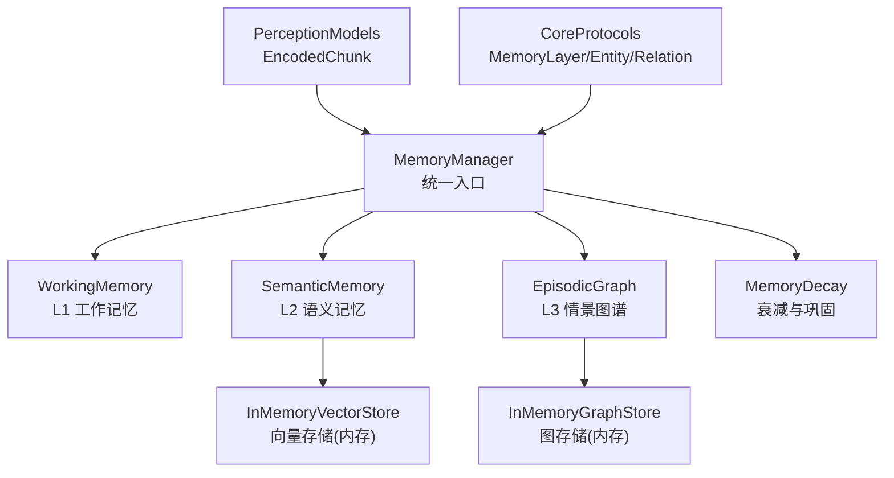
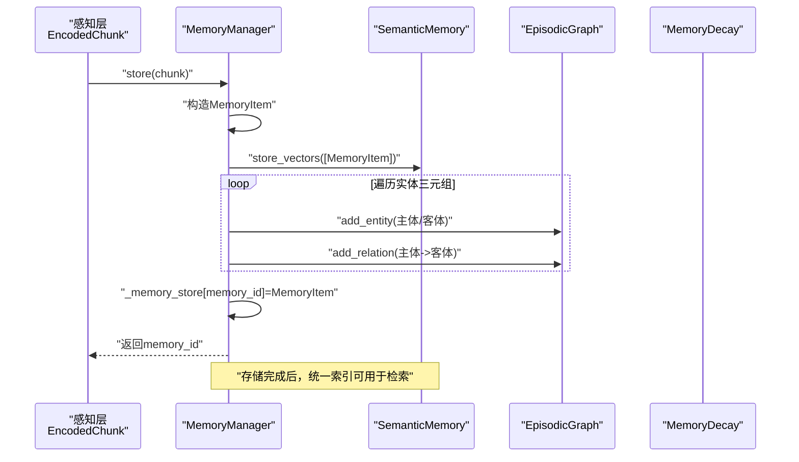
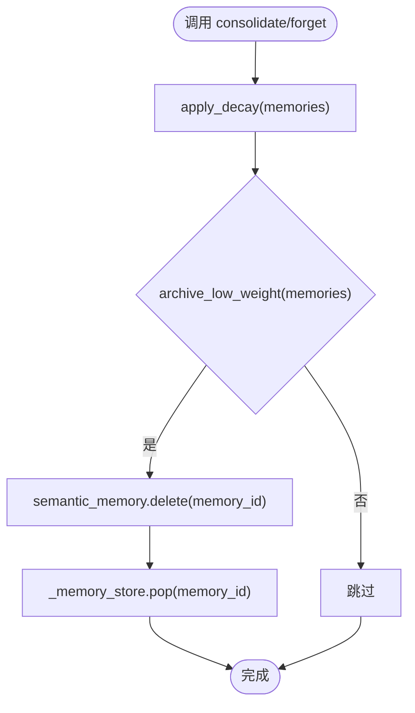
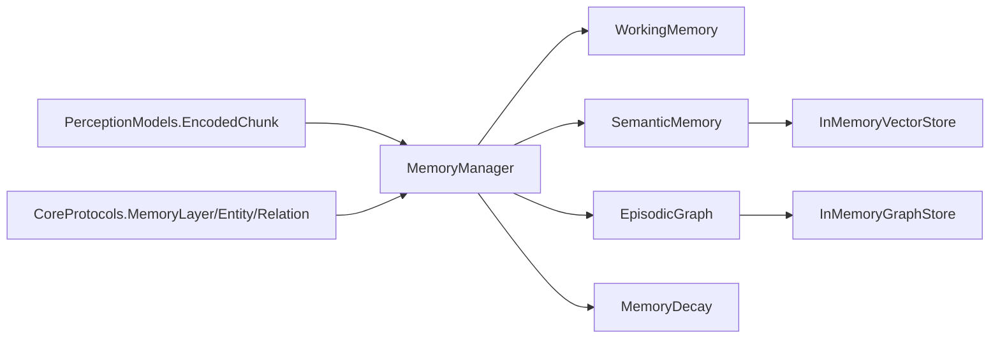

# 记忆管理器核心

<cite>
**本文引用的文件**
- [src/memory/manager.py](file://src/memory/manager.py)
- [src/memory/models.py](file://src/memory/models.py)
- [src/memory/working_memory.py](file://src/memory/working_memory.py)
- [src/memory/semantic_memory.py](file://src/memory/semantic_memory.py)
- [src/memory/episodic_graph.py](file://src/memory/episodic_graph.py)
- [src/memory/decay.py](file://src/memory/decay.py)
- [src/memory/backends/base.py](file://src/memory/backends/base.py)
- [src/memory/backends/memory_store.py](file://src/memory/backends/memory_store.py)
- [src/perception/models.py](file://src/perception/models.py)
- [src/core/protocols.py](file://src/core/protocols.py)
- [example/example_usage.py](file://example/example_usage.py)
- [src/necorag.py](file://src/necorag.py)
</cite>

## 目录
1. [简介](#简介)
2. [项目结构](#项目结构)
3. [核心组件](#核心组件)
4. [架构总览](#架构总览)
5. [详细组件分析](#详细组件分析)
6. [依赖分析](#依赖分析)
7. [性能考虑](#性能考虑)
8. [故障排查指南](#故障排查指南)
9. [结论](#结论)
10. [附录](#附录)

## 简介
本文件面向NecoRAG记忆管理层的核心实现，聚焦MemoryManager类如何作为统一入口协调L1工作记忆、L2语义记忆与L3情景图谱三层记忆系统的协作。文档涵盖：
- 记忆存储流程：从感知层编码的文本块到三层存储的具体步骤
- 记忆检索机制：跨层检索策略与优先级排序
- 记忆巩固与主动遗忘：衰减与归档的实现原理
- 错误处理与日志记录最佳实践
- 代码示例路径：初始化、存储、检索、清理等操作

## 项目结构
记忆管理层位于src/memory目录，围绕MemoryManager组织L1、L2、L3三个子系统，并通过统一的数据模型与协议进行解耦。

图表来源
- [src/memory/manager.py:20-212](file://src/memory/manager.py#L20-L212)
- [src/memory/working_memory.py:11-120](file://src/memory/working_memory.py#L11-L120)
- [src/memory/semantic_memory.py:21-179](file://src/memory/semantic_memory.py#L21-L179)
- [src/memory/episodic_graph.py:10-194](file://src/memory/episodic_graph.py#L10-L194)
- [src/memory/decay.py:11-155](file://src/memory/decay.py#L11-L155)
- [src/memory/backends/memory_store.py:20-381](file://src/memory/backends/memory_store.py#L20-L381)
- [src/perception/models.py:14-62](file://src/perception/models.py#L14-L62)
- [src/core/protocols.py:36-200](file://src/core/protocols.py#L36-L200)

章节来源
- [src/memory/manager.py:1-212](file://src/memory/manager.py#L1-L212)
- [src/memory/__init__.py:1-29](file://src/memory/__init__.py#L1-L29)

## 核心组件
- MemoryManager：统一协调三层记忆，提供存储、检索、巩固、遗忘与计数能力
- WorkingMemory（L1）：会话上下文与意图轨迹的临时存储
- SemanticMemory（L2）：高维向量存储与检索
- EpisodicGraph（L3）：实体关系网络与多跳推理
- MemoryDecay：记忆权重动态衰减与归档
- 数据模型与协议：MemoryItem、Entity、Relation、MemoryLayer等

章节来源
- [src/memory/manager.py:20-212](file://src/memory/manager.py#L20-L212)
- [src/memory/models.py:14-43](file://src/memory/models.py#L14-L43)
- [src/core/protocols.py:36-200](file://src/core/protocols.py#L36-L200)

## 架构总览
MemoryManager作为中枢，接收感知层编码的EncodedChunk，将其转换为MemoryItem并写入L2语义记忆；同时从实体三元组构建L3图谱实体与关系；并通过统一的_memory_store维护跨层可见的索引。检索时优先利用L2向量相似度，结合衰减强化提升相关记忆权重；巩固阶段对低权重记忆执行归档清理。

图表来源
- [src/memory/manager.py:52-123](file://src/memory/manager.py#L52-L123)
- [src/memory/semantic_memory.py:50-78](file://src/memory/semantic_memory.py#L50-L78)
- [src/memory/episodic_graph.py:33-69](file://src/memory/episodic_graph.py#L33-L69)

## 详细组件分析

### MemoryManager：三层记忆统一入口
- 初始化：可配置衰减速率，内部持有WorkingMemory、SemanticMemory、EpisodicGraph与MemoryDecay实例
- 存储流程：创建MemoryItem，写入L2向量存储，解析实体三元组写入L3图谱，最后写入统一索引
- 检索策略：默认对L2语义层进行向量检索，命中后通过统一索引回填MemoryItem并强化权重
- 巩固与遗忘：应用衰减，筛选低权重记忆，删除对应向量并从统一索引移除

图表来源
- [src/memory/manager.py:161-202](file://src/memory/manager.py#L161-L202)
- [src/memory/decay.py:72-118](file://src/memory/decay.py#L72-L118)

章节来源
- [src/memory/manager.py:27-212](file://src/memory/manager.py#L27-L212)

### WorkingMemory（L1）：工作记忆
- 特性：会话上下文、意图轨迹、TTL过期、LRU淘汰（最小实现）
- 能力：添加/获取上下文、跟踪意图、清除会话、检查存在性
- 注意：当前实现为内存字典模拟，TTL与LRU需在生产环境接入Redis

章节来源
- [src/memory/working_memory.py:11-120](file://src/memory/working_memory.py#L11-L120)

### SemanticMemory（L2）：语义记忆
- 特性：高维向量存储、混合检索（最小实现为向量检索）、HNSW索引（预留）
- 能力：存储向量、向量检索、混合检索（预留）、更新元数据、删除记忆
- 存储后端：当前使用内存字典模拟向量数据库，支持集成Qdrant/Milvus

章节来源
- [src/memory/semantic_memory.py:21-179](file://src/memory/semantic_memory.py#L21-L179)
- [src/memory/backends/memory_store.py:20-141](file://src/memory/backends/memory_store.py#L20-L141)

### EpisodicGraph（L3）：情景图谱
- 特性：实体关系存储、多跳推理、因果链条追踪、结构化记忆
- 能力：添加实体/关系、多跳查询、因果链条查找、相关实体检索
- 存储后端：当前使用内存图结构，支持集成Neo4j/NebulaGraph

章节来源
- [src/memory/episodic_graph.py:10-194](file://src/memory/episodic_graph.py#L10-L194)
- [src/memory/backends/memory_store.py:143-381](file://src/memory/backends/memory_store.py#L143-L381)

### MemoryDecay：记忆衰减与巩固
- 公式：权重随时间指数衰减，访问频率提供增强因子
- 能力：计算权重、批量衰减、归档低权重、强化记忆、判断归档

章节来源
- [src/memory/decay.py:11-155](file://src/memory/decay.py#L11-L155)

### 数据模型与协议
- MemoryItem：记忆条目，包含内容、向量、元数据、权重与访问计数
- Entity/Relation：知识图谱实体与关系
- MemoryLayer：L1/L2/L3层级枚举
- EncodedChunk：感知层输出的编码块，包含稠密/稀疏向量、实体三元组、情境标签与元数据

章节来源
- [src/memory/models.py:14-43](file://src/memory/models.py#L14-L43)
- [src/core/protocols.py:36-200](file://src/core/protocols.py#L36-L200)
- [src/perception/models.py:14-62](file://src/perception/models.py#L14-L62)

## 依赖分析
- MemoryManager依赖L1/L2/L3子系统与MemoryDecay，统一通过MemoryItem与协议层进行数据交换
- SemanticMemory与EpisodicGraph通过内存存储实现提供最小可用能力，便于开发与测试
- PerceptionModels提供EncodedChunk输入，CoreProtocols提供统一数据类型

图表来源
- [src/memory/manager.py:8-14](file://src/memory/manager.py#L8-L14)
- [src/memory/backends/base.py:61-314](file://src/memory/backends/base.py#L61-L314)
- [src/memory/backends/memory_store.py:20-381](file://src/memory/backends/memory_store.py#L20-L381)

章节来源
- [src/memory/manager.py:1-212](file://src/memory/manager.py#L1-L212)
- [src/memory/backends/base.py:1-314](file://src/memory/backends/base.py#L1-L314)

## 性能考虑
- 向量检索复杂度：当前实现为全量余弦相似度计算，建议在生产环境集成HNSW索引以降低时间复杂度
- 图遍历复杂度：BFS/DFS多跳查询在大规模图上可能成为瓶颈，建议引入图分区与缓存热点路径
- 内存占用：统一索引_memory_store在高并发场景下需关注内存增长，建议配合定期归档与外部持久化
- 日志与监控：在关键路径增加采样日志与指标埋点，避免高频日志影响吞吐

## 故障排查指南
- 存储失败：检查EncodedChunk向量维度与目标存储后端维度匹配；确认实体三元组格式正确
- 检索无结果：确认查询向量非空且维度一致；检查SemanticMemory是否已写入对应memory_id
- 归档过多：适当提高衰减阈值或访问强化因子；评估业务是否需要更强的长期保留策略
- 日志定位：利用MemoryManager与各子系统的日志级别，结合请求ID追踪问题根因

章节来源
- [src/memory/manager.py:120-123](file://src/memory/manager.py#L120-L123)
- [src/memory/semantic_memory.py:78-118](file://src/memory/semantic_memory.py#L78-L118)
- [src/memory/decay.py:96-118](file://src/memory/decay.py#L96-L118)

## 结论
MemoryManager以统一索引为核心，串联L1工作记忆、L2语义记忆与L3情景图谱，形成从短期到长期、从向量到结构化的完整记忆体系。通过MemoryDecay实现生物启发式的巩固与遗忘，既保证知识的稳定性也避免冗余。建议在生产环境中替换为高性能向量与图数据库后端，并完善TTL/LRU与监控告警体系。

## 附录

### 代码示例路径（初始化、存储、检索、清理）
- 初始化与文档导入
  - [src/necorag.py:131-136](file://src/necorag.py#L131-L136)：NecoRAG内部通过MemoryManager进行初始化
  - [src/necorag.py:288-336](file://src/necorag.py#L288-L336)：文档导入流程，感知层编码后写入记忆层
- MemoryManager使用示例
  - [example/example_usage.py:50-91](file://example/example_usage.py#L50-L91)：存储知识与检索示例
  - [example/example_usage.py:94-136](file://example/example_usage.py#L94-L136)：智能检索与重排序示例
- 存储流程
  - [src/memory/manager.py:52-123](file://src/memory/manager.py#L52-L123)：store(chunk)实现
- 检索流程
  - [src/memory/manager.py:124-159](file://src/memory/manager.py#L124-L159)：retrieve(query, query_vector, layers, top_k)实现
- 巩固与遗忘
  - [src/memory/manager.py:161-202](file://src/memory/manager.py#L161-L202)：consolidate/forget实现
- 数据模型与协议
  - [src/memory/models.py:14-43](file://src/memory/models.py#L14-L43)：MemoryItem/GraphPath/Intent
  - [src/core/protocols.py:36-200](file://src/core/protocols.py#L36-L200)：MemoryLayer/Entity/Relation等