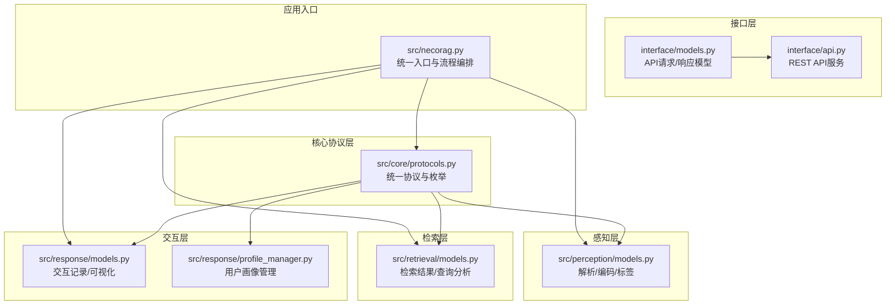
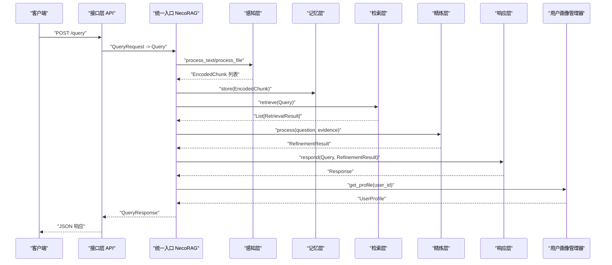
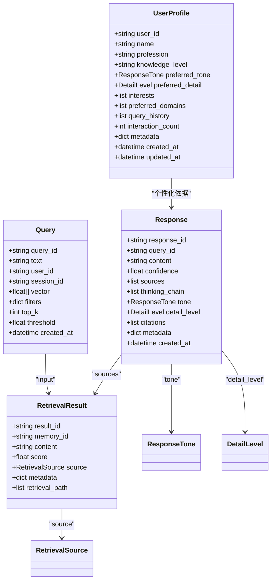
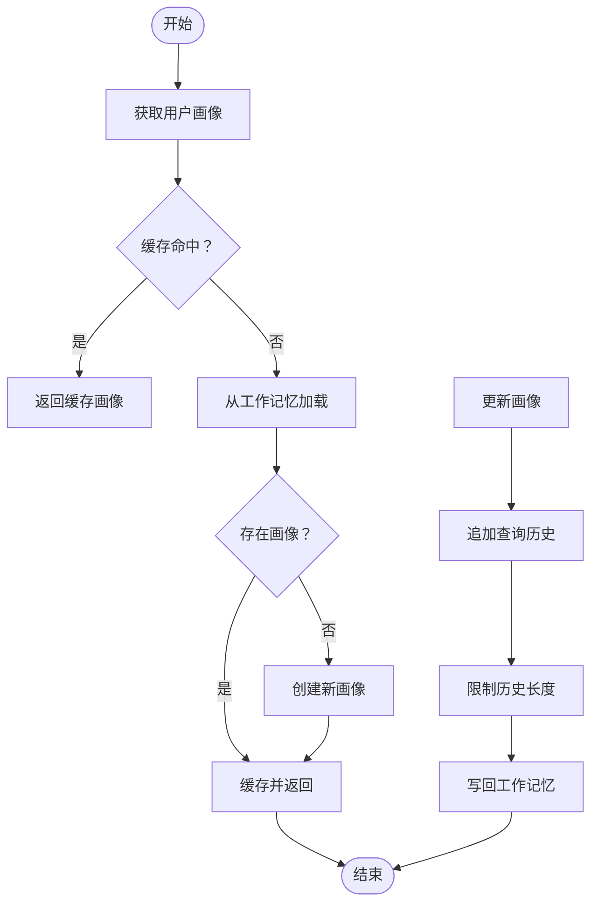
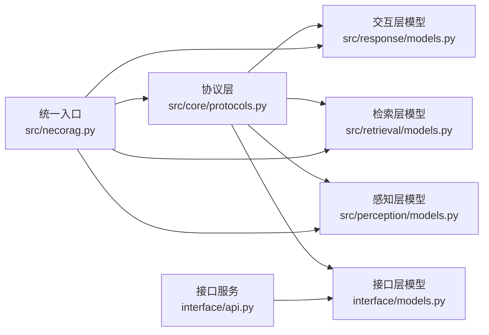

# 协议定义

<cite>
**本文引用的文件**
- [src/core/protocols.py](file://src/core/protocols.py)
- [src/response/models.py](file://src/response/models.py)
- [src/response/profile_manager.py](file://src/response/profile_manager.py)
- [src/retrieval/models.py](file://src/retrieval/models.py)
- [src/perception/models.py](file://src/perception/models.py)
- [interface/models.py](file://interface/models.py)
- [interface/api.py](file://interface/api.py)
- [src/necorag.py](file://src/necorag.py)
- [tests/test_core/test_protocols.py](file://tests/test_core/test_protocols.py)
</cite>

## 目录
1. [简介](#简介)
2. [项目结构](#项目结构)
3. [核心组件](#核心组件)
4. [架构总览](#架构总览)
5. [详细组件分析](#详细组件分析)
6. [依赖分析](#依赖分析)
7. [性能考虑](#性能考虑)
8. [故障排查指南](#故障排查指南)
9. [结论](#结论)
10. [附录](#附录)

## 简介
本文件为 NecoRAG 协议定义的技术文档，聚焦系统内统一的数据协议、接口规范与消息格式。文档围绕 Response、Query、RetrievalResult、UserProfile 等核心协议，系统阐述其数据结构、字段定义、版本管理与兼容性策略、序列化与反序列化、数据验证与扩展机制，并提供使用示例与最佳实践，帮助开发者正确理解与使用系统中的数据交换格式。

## 项目结构
NecoRAG 的协议与数据模型主要分布在以下模块：
- 核心协议层：统一的数据类型与枚举，定义跨模块共享的协议结构
- 交互层模型：与用户画像、响应生成相关的数据模型
- 检索层模型：检索结果与查询分析的数据结构
- 感知层模型：文档解析、分块、上下文标签等感知产物
- 接口层模型：对外 API 的请求/响应模型
- 应用入口：统一入口类在查询流程中组装与转换协议对象

图表来源
- [src/core/protocols.py:1-298](file://src/core/protocols.py#L1-L298)
- [src/response/models.py:1-31](file://src/response/models.py#L1-L31)
- [src/response/profile_manager.py:1-505](file://src/response/profile_manager.py#L1-L505)
- [src/retrieval/models.py:1-29](file://src/retrieval/models.py#L1-L29)
- [src/perception/models.py:1-62](file://src/perception/models.py#L1-L62)
- [interface/models.py:1-85](file://interface/models.py#L1-L85)
- [interface/api.py:1-162](file://interface/api.py#L1-L162)
- [src/necorag.py:1-920](file://src/necorag.py#L1-L920)

章节来源
- [src/core/protocols.py:1-298](file://src/core/protocols.py#L1-L298)
- [src/necorag.py:1-920](file://src/necorag.py#L1-L920)

## 核心组件
本节对核心协议进行逐项说明，包括字段定义、默认值、取值范围与约束、以及在系统中的典型用途。

- Query（查询）
  - 关键字段：query_id、text、user_id、session_id、vector、filters、top_k、threshold、created_at
  - 用途：作为检索层的输入，承载用户问题、用户/会话上下文、检索参数与向量提示
  - 典型流程：由统一入口类构造，可能注入 HyDE 增强的向量表示，随后传递给检索器

- RetrievalResult（检索结果）
  - 关键字段：result_id、memory_id、content、score、source、metadata、retrieval_path
  - 用途：封装一次检索的证据片段，包含相似度分数、来源类型与检索路径，便于溯源与可视化
  - 注意：与交互层模型中的同名类型字段一致，但命名空间不同

- Response（最终响应）
  - 关键字段：response_id、query_id、content、confidence、sources、thinking_chain、tone、detail_level、citations、metadata、created_at
  - 用途：交互层最终输出，包含答案正文、置信度、证据来源、思维链、语气与详细程度等
  - 典型流程：由响应接口生成，随后可被上层调用方消费

- UserProfile（用户画像）
  - 关键字段：user_id、name、profession、knowledge_level、preferred_tone、preferred_detail、interests、preferred_domains、query_history、interaction_count、metadata、created_at、updated_at
  - 用途：个性化响应的基础，支持风格偏好、专业水平、兴趣与领域偏好等
  - 典型流程：通过用户画像管理器维护与更新，支持规则与 LLM 增强两种检测模式

- 枚举类型
  - DocumentType、ChunkType、MemoryLayer、RetrievalSource、ResponseTone、DetailLevel、IntentType
  - 用途：统一取值范围，确保跨模块一致性与可扩展性

章节来源
- [src/core/protocols.py:203-278](file://src/core/protocols.py#L203-L278)
- [src/core/protocols.py:282-298](file://src/core/protocols.py#L282-L298)
- [src/retrieval/models.py:9-18](file://src/retrieval/models.py#L9-L18)
- [src/response/models.py:13-31](file://src/response/models.py#L13-L31)

## 架构总览
下图展示统一协议在系统中的流转与转换关系，重点体现 Query、RetrievalResult、Response、UserProfile 的生成与使用路径。

图表来源
- [src/necorag.py:354-477](file://src/necorag.py#L354-L477)
- [interface/api.py:73-84](file://interface/api.py#L73-L84)
- [src/core/protocols.py:203-278](file://src/core/protocols.py#L203-L278)
- [src/retrieval/models.py:9-18](file://src/retrieval/models.py#L9-L18)
- [src/response/models.py:13-31](file://src/response/models.py#L13-L31)
- [src/response/profile_manager.py:115-141](file://src/response/profile_manager.py#L115-L141)

## 详细组件分析

### 统一协议层（src/core/protocols.py）
- 设计原则
  - 使用 dataclass 定义统一的数据结构，配合枚举限定取值范围
  - 通过 __post_init__ 实现字段默认值与派生字段（如维度推导）
  - 保持字段命名清晰、类型明确，便于序列化与跨模块传递
- 关键数据结构
  - Query、RetrievalResult、Response、UserProfile 等
  - 枚举类型覆盖文档、分块、记忆、检索、响应语气、详细程度、意图等
- 版本与兼容性
  - 采用 dataclass 字段默认值与可选字段，新增字段不影响旧版本消费者
  - 枚举扩展遵循“向后兼容”原则，新增值不影响现有逻辑
- 序列化与反序列化
  - dataclass 本身不提供序列化，需结合外部库（如 JSON、Pydantic）进行序列化
  - 建议在接口层或应用层统一处理序列化策略，避免分散实现

图表来源
- [src/core/protocols.py:203-298](file://src/core/protocols.py#L203-L298)

章节来源
- [src/core/protocols.py:1-298](file://src/core/protocols.py#L1-L298)

### 用户画像管理（src/response/profile_manager.py）
- 功能要点
  - 加载/创建用户画像，支持本地缓存与工作记忆持久化
  - 分析偏好：关键词统计、交互风格、专业水平
  - 支持规则与 LLM 两种检测模式，具备降级能力
- 流程图（画像获取与更新）

图表来源
- [src/response/profile_manager.py:115-173](file://src/response/profile_manager.py#L115-L173)

章节来源
- [src/response/profile_manager.py:1-505](file://src/response/profile_manager.py#L1-L505)

### 检索层模型（src/retrieval/models.py）
- 作用：定义检索结果与查询分析的数据结构，便于可视化与追踪
- 关键点：与统一协议层的 RetrievalResult 字段保持一致，但命名空间不同，避免冲突

章节来源
- [src/retrieval/models.py:1-29](file://src/retrieval/models.py#L1-L29)

### 感知层模型（src/perception/models.py）
- 作用：定义感知阶段的中间产物，如编码分块、上下文标签、表格与图片等
- 关键点：与统一协议层的 Chunk、EncodedChunk、ContextTag 等协同，形成从感知到记忆的桥梁

章节来源
- [src/perception/models.py:1-62](file://src/perception/models.py#L1-L62)

### 接口层模型与 API（interface/models.py、interface/api.py）
- QueryRequest/QueryResponse：对外暴露的 API 请求/响应模型，使用 Pydantic BaseModel
- WebSocketMessage：用于调试面板的 WebSocket 消息格式
- API 服务：提供 /query、/insert、/update、/delete、/health 等端点，返回 Pydantic 模型自动序列化为 JSON

章节来源
- [interface/models.py:1-85](file://interface/models.py#L1-L85)
- [interface/api.py:1-162](file://interface/api.py#L1-L162)

### 应用入口与协议转换（src/necorag.py）
- 统一入口类负责：
  - 构造 Query 对象，注入 HyDE 增强向量
  - 调用检索层获取 RetrievalResult 列表
  - 通过精炼层生成 RefinementResult
  - 生成 Response 对象并返回
- 协议转换：在返回前将内部协议对象转换为对外 API 的响应模型（如 QueryResponse）

章节来源
- [src/necorag.py:354-477](file://src/necorag.py#L354-L477)

## 依赖分析
- 内聚性
  - 协议层高度内聚，统一了数据结构与枚举，降低模块间耦合
- 耦合关系
  - 交互层依赖协议层的 UserProfile、Response、ResponseTone、DetailLevel
  - 检索层依赖协议层的 Query、RetrievalResult、RetrievalSource
  - 感知层依赖协议层的 Chunk、EncodedChunk、ContextTag
  - 接口层依赖协议层的 Response、Query、RetrievalResult
- 循环依赖
  - 未发现循环依赖；模块边界清晰

图表来源
- [src/core/protocols.py:1-298](file://src/core/protocols.py#L1-L298)
- [src/response/models.py:1-31](file://src/response/models.py#L1-L31)
- [src/retrieval/models.py:1-29](file://src/retrieval/models.py#L1-L29)
- [src/perception/models.py:1-62](file://src/perception/models.py#L1-L62)
- [interface/models.py:1-85](file://interface/models.py#L1-L85)
- [interface/api.py:1-162](file://interface/api.py#L1-L162)
- [src/necorag.py:1-920](file://src/necorag.py#L1-L920)

章节来源
- [src/core/protocols.py:1-298](file://src/core/protocols.py#L1-L298)
- [src/necorag.py:1-920](file://src/necorag.py#L1-L920)

## 性能考虑
- 序列化开销
  - dataclass 适合内存传输，对外 API 使用 Pydantic BaseModel 更利于校验与序列化
- 缓存策略
  - 用户画像管理器内置缓存，减少重复读取与计算
- 向量化与检索
  - HyDE 增强与检索参数（top_k、阈值）直接影响性能与质量平衡
- 可观测性
  - 建议在关键节点记录时间戳与指标，便于定位性能瓶颈

## 故障排查指南
- 协议字段缺失或类型不符
  - 检查 dataclass 字段默认值与可选字段，确保序列化/反序列化时字段齐全
- 枚举值异常
  - 确认枚举扩展是否向后兼容，避免因新增值导致解析失败
- 用户画像异常
  - 检查工作记忆读写路径与缓存失效策略
- API 响应异常
  - 使用接口层的 Pydantic 模型进行自动校验，关注字段类型与必填项

章节来源
- [tests/test_core/test_protocols.py:1-494](file://tests/test_core/test_protocols.py#L1-L494)
- [src/response/profile_manager.py:115-173](file://src/response/profile_manager.py#L115-L173)

## 结论
NecoRAG 的协议体系以统一的数据结构与枚举为核心，实现了跨模块的一致性与可扩展性。通过明确的协议转换与序列化策略，系统在保证性能的同时提供了良好的可维护性与可演进性。建议在实际使用中遵循本文档的字段定义、版本管理与扩展机制，确保协议的稳定与可靠。

## 附录

### 协议字段与取值范围速查
- Query
  - text：必填，查询文本
  - user_id/session_id：可选，用户/会话标识
  - top_k/threshold：可选，检索参数
  - vector：可选，向量提示
- RetrievalResult
  - memory_id/content/score/source/metadata/retrieval_path：按检索结果填充
- Response
  - content/confidence/tone/detail_level/citations：按响应生成
  - sources：由多个 RetrievalResult 组成
- UserProfile
  - knowledge_level：beginner/intermediate/expert
  - preferred_tone：professional/friendly/humorous
  - preferred_detail：brief/standard/detailed/comprehensive

章节来源
- [src/core/protocols.py:203-298](file://src/core/protocols.py#L203-L298)

### 使用示例与最佳实践
- 示例路径
  - 统一入口类查询流程：[src/necorag.py:354-477](file://src/necorag.py#L354-L477)
  - 接口层 API 查询端点：[interface/api.py:73-84](file://interface/api.py#L73-L84)
  - 用户画像管理流程：[src/response/profile_manager.py:115-173](file://src/response/profile_manager.py#L115-L173)
- 最佳实践
  - 在接口层统一进行序列化与校验，避免在业务层重复实现
  - 新增字段采用 dataclass 可选字段，确保向后兼容
  - 使用枚举限定取值范围，提升健壮性
  - 对关键流程记录时间戳与指标，便于诊断与优化