# 安全认证系统

<cite>
**本文档引用的文件**
- [src/security/__init__.py](file://src/security/__init__.py)
- [src/security/auth.py](file://src/security/auth.py)
- [src/security/config.py](file://src/security/config.py)
- [src/security/models.py](file://src/security/models.py)
- [src/security/permission.py](file://src/security/permission.py)
- [src/security/protection.py](file://src/security/protection.py)
- [src/security/storage.py](file://src/security/storage.py)
- [src/security/example_usage.py](file://src/security/example_usage.py)
- [src/core/config.py](file://src/core/config.py)
- [interface/api.py](file://interface/api.py)
- [interface/main.py](file://interface/main.py)
- [src/dashboard/server.py](file://src/dashboard/server.py)
</cite>

## 目录
1. [简介](#简介)
2. [项目结构](#项目结构)
3. [核心组件](#核心组件)
4. [架构概览](#架构概览)
5. [详细组件分析](#详细组件分析)
6. [依赖关系分析](#依赖关系分析)
7. [性能考虑](#性能考虑)
8. [故障排除指南](#故障排除指南)
9. [结论](#结论)

## 简介

NecoRAG 安全认证系统是一个完整的安全框架，提供了用户身份验证、权限控制和安全防护功能。该系统采用模块化设计，集成了多种安全机制，包括 JWT Token 认证、OAuth2.0 集成、RBAC 权限控制和综合安全防护。

系统的核心目标是为 NecoRAG 认知型 RAG 框架提供企业级的安全保障，确保数据访问的安全性和完整性，同时保持系统的可扩展性和易用性。

## 项目结构

安全认证系统位于 `src/security/` 目录下，采用清晰的模块化组织：

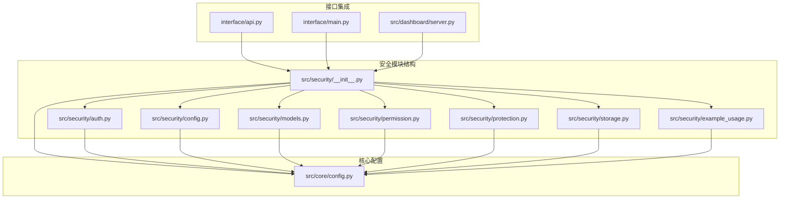

**图表来源**
- [src/security/__init__.py:1-107](file://src/security/__init__.py#L1-L107)
- [src/core/config.py:1-408](file://src/core/config.py#L1-L408)

**章节来源**
- [src/security/__init__.py:1-107](file://src/security/__init__.py#L1-L107)
- [src/security/auth.py:1-210](file://src/security/auth.py#L1-L210)
- [src/security/config.py:1-92](file://src/security/config.py#L1-L92)

## 核心组件

安全认证系统由六个主要组件构成，每个组件都有明确的职责和功能：

### 1. 认证服务 (AuthService)
提供用户身份验证功能，支持密码验证和 JWT Token 生成。

### 2. 权限控制 (PermissionService)
实现基于角色的访问控制 (RBAC)，管理用户权限和角色分配。

### 3. 安全防护 (SecurityMiddleware)
提供多层次的安全防护机制，包括速率限制、CSRF 防护和 XSS 防护。

### 4. 数据模型 (Models)
定义安全相关的数据结构和枚举类型，确保类型安全。

### 5. 存储管理 (Storage)
提供用户数据持久化和会话管理功能。

### 6. 配置管理 (Config)
集中管理安全相关的配置参数和环境变量。

**章节来源**
- [src/security/auth.py:23-210](file://src/security/auth.py#L23-L210)
- [src/security/permission.py:61-187](file://src/security/permission.py#L61-L187)
- [src/security/protection.py:12-196](file://src/security/protection.py#L12-L196)
- [src/security/models.py:10-101](file://src/security/models.py#L10-L101)
- [src/security/storage.py:13-209](file://src/security/storage.py#L13-L209)
- [src/security/config.py:11-92](file://src/security/config.py#L11-L92)

## 架构概览

系统采用分层架构设计，确保各组件之间的松耦合和高内聚：

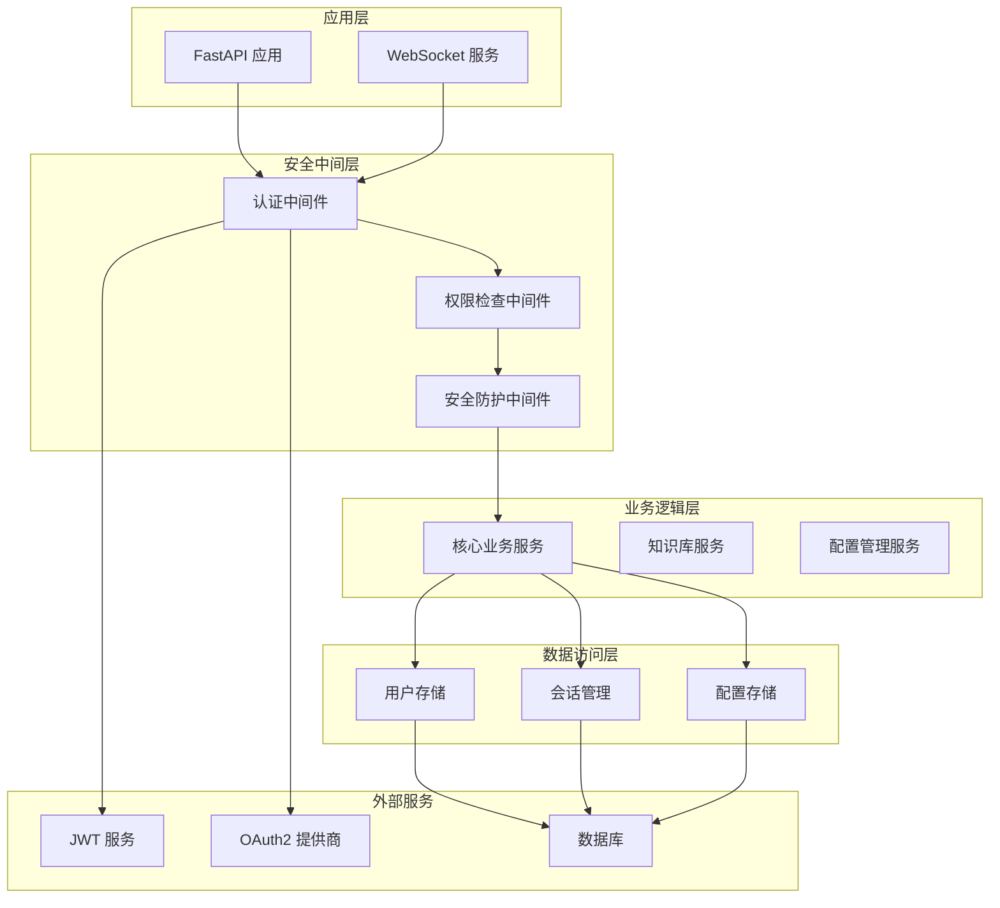

**图表来源**
- [src/security/auth.py:56-133](file://src/security/auth.py#L56-L133)
- [src/security/permission.py:61-126](file://src/security/permission.py#L61-L126)
- [src/security/protection.py:148-196](file://src/security/protection.py#L148-L196)
- [src/security/storage.py:13-209](file://src/security/storage.py#L13-L209)

## 详细组件分析

### 认证服务组件

认证服务是安全系统的核心，提供了多种认证方式：

#### JWT 认证服务
JWTAuthService 继承自 AuthService，专门处理 JWT Token 的创建和验证：

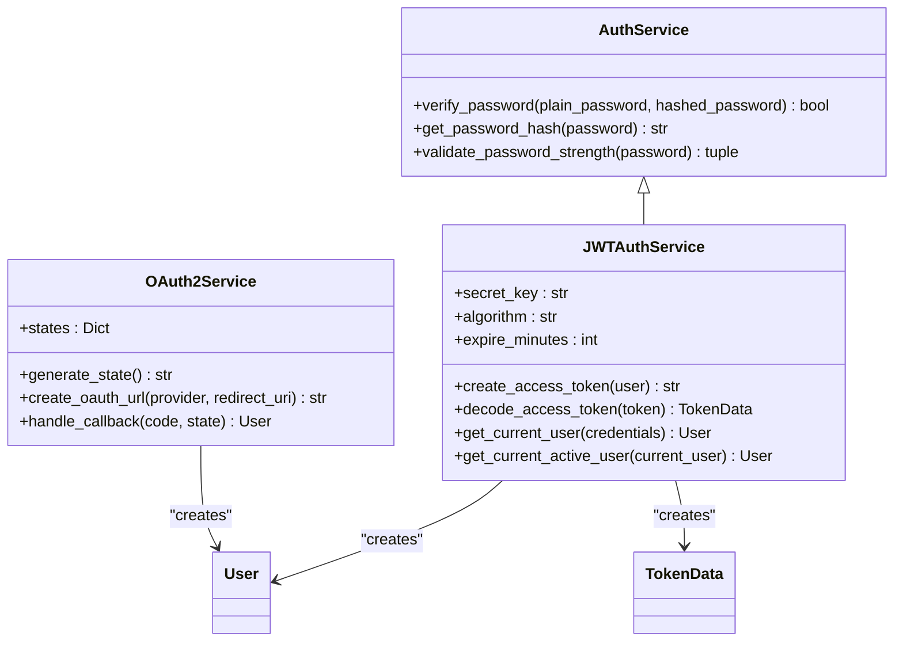

**图表来源**
- [src/security/auth.py:23-210](file://src/security/auth.py#L23-L210)

JWT 认证流程：

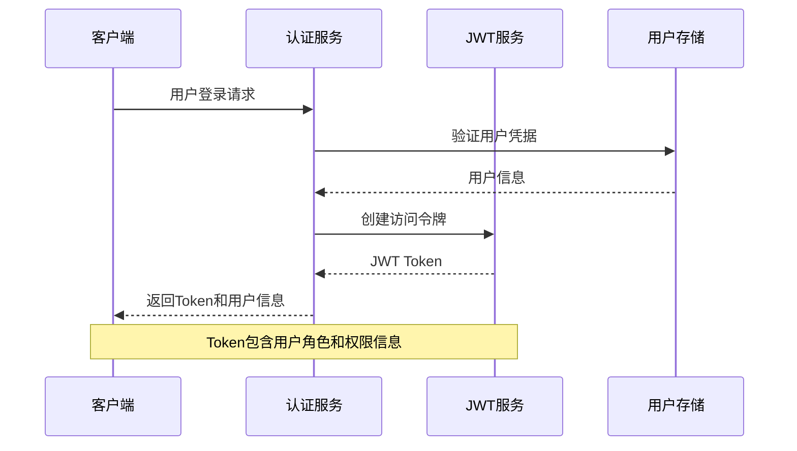

**图表来源**
- [src/security/auth.py:65-132](file://src/security/auth.py#L65-L132)

**章节来源**
- [src/security/auth.py:23-210](file://src/security/auth.py#L23-L210)

### 权限控制系统

权限控制系统实现了基于角色的访问控制 (RBAC)：

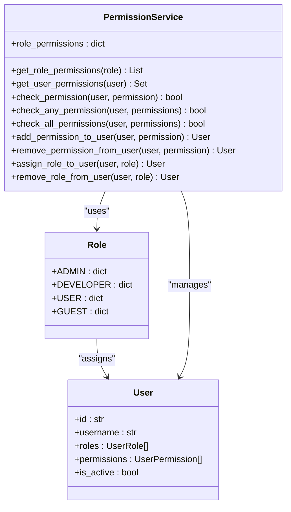

**图表来源**
- [src/security/permission.py:10-126](file://src/security/permission.py#L10-L126)

权限检查装饰器模式：

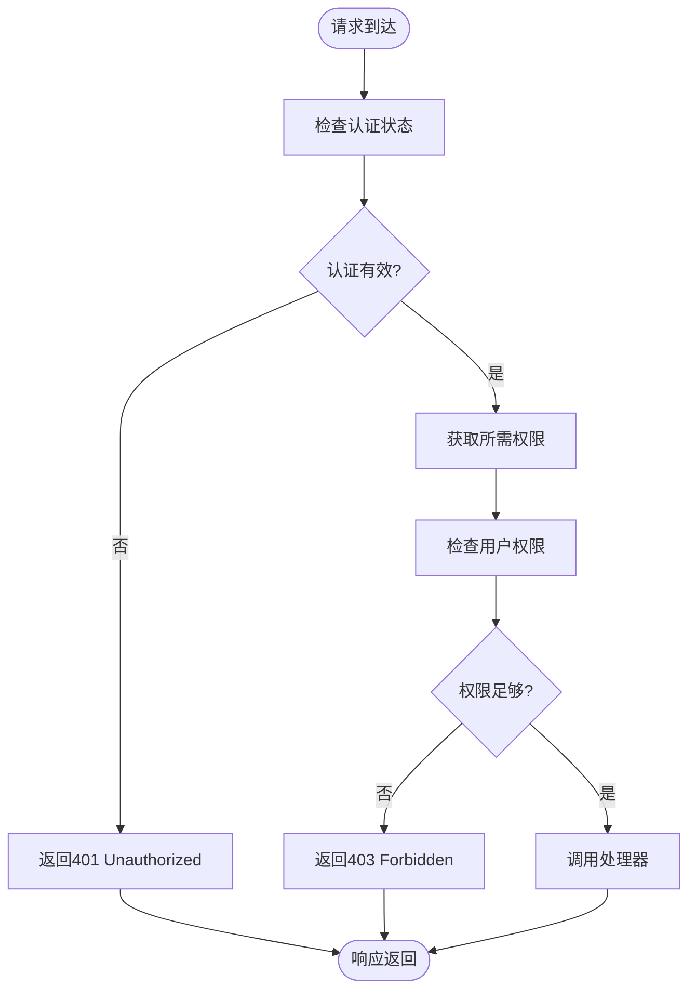

**图表来源**
- [src/security/permission.py:128-174](file://src/security/permission.py#L128-L174)

**章节来源**
- [src/security/permission.py:10-187](file://src/security/permission.py#L10-L187)

### 安全防护机制

安全防护系统提供了多层次的安全保护：

#### 综合安全中间件
ComprehensiveSecurityMiddleware 将多种安全机制组合在一起：

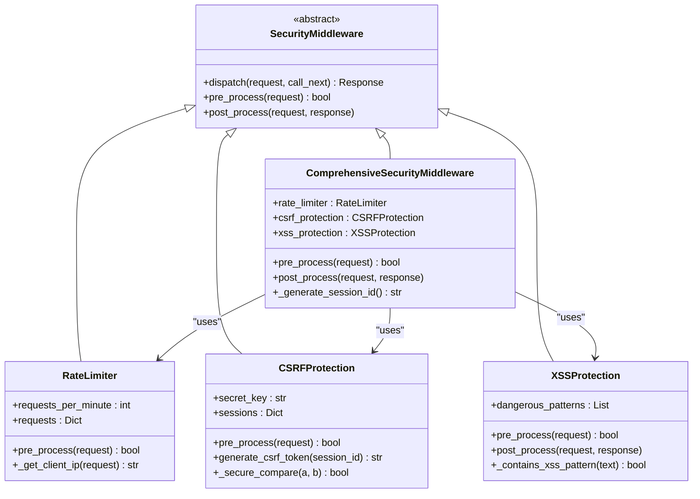

**图表来源**
- [src/security/protection.py:12-196](file://src/security/protection.py#L12-L196)

速率限制算法：

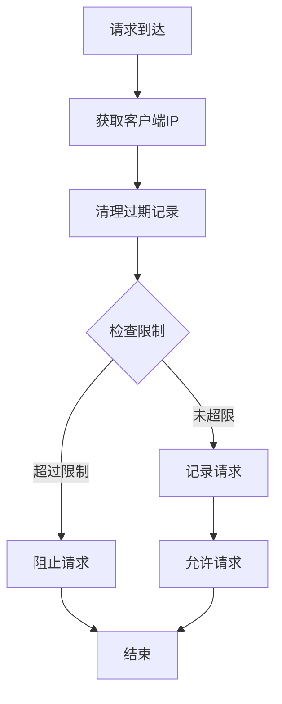

**图表来源**
- [src/security/protection.py:44-60](file://src/security/protection.py#L44-L60)

**章节来源**
- [src/security/protection.py:12-196](file://src/security/protection.py#L12-L196)

### 数据模型设计

安全系统使用 Pydantic 模型确保数据的完整性和类型安全：

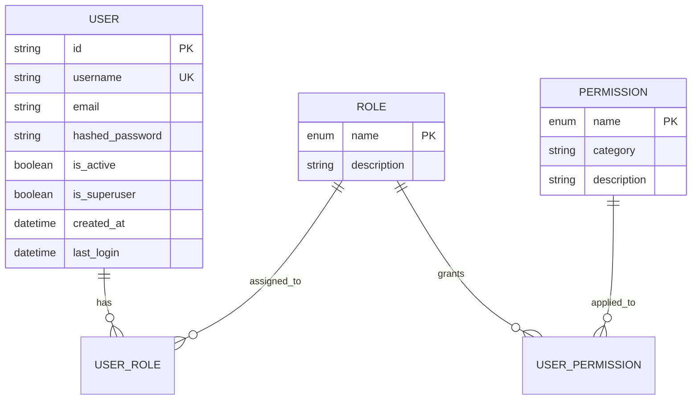

**图表来源**
- [src/security/models.py:38-101](file://src/security/models.py#L38-L101)

**章节来源**
- [src/security/models.py:10-101](file://src/security/models.py#L10-L101)

### 存储管理

用户存储和会话管理提供了数据持久化功能：

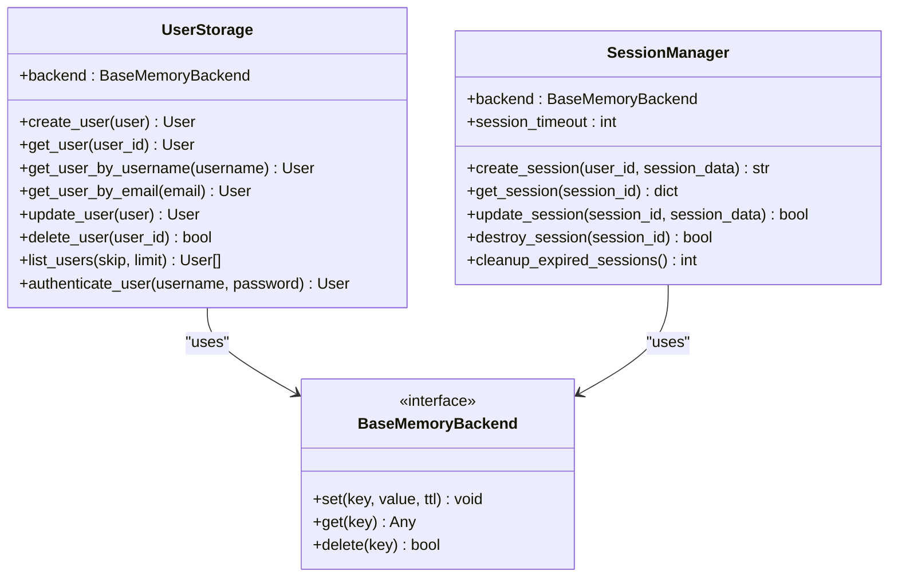

**图表来源**
- [src/security/storage.py:13-209](file://src/security/storage.py#L13-L209)

**章节来源**
- [src/security/storage.py:13-209](file://src/security/storage.py#L13-L209)

## 依赖关系分析

安全系统与其他模块的依赖关系：

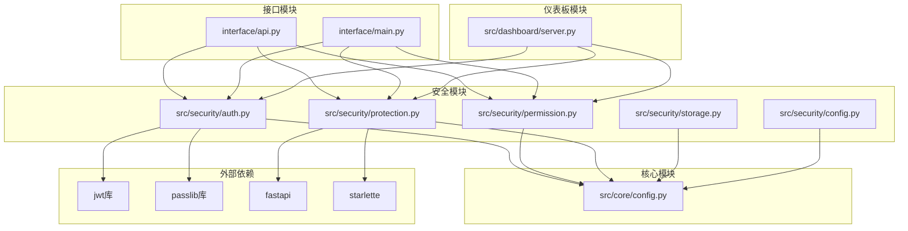

**图表来源**
- [src/security/auth.py:5-15](file://src/security/auth.py#L5-L15)
- [src/security/protection.py:9-10](file://src/security/protection.py#L9-L10)
- [src/core/config.py:7-12](file://src/core/config.py#L7-L12)

**章节来源**
- [src/security/auth.py:1-210](file://src/security/auth.py#L1-L210)
- [src/security/permission.py:1-187](file://src/security/permission.py#L1-L187)
- [src/security/protection.py:1-196](file://src/security/protection.py#L1-L196)
- [src/security/storage.py:1-209](file://src/security/storage.py#L1-L209)
- [src/security/config.py:1-92](file://src/security/config.py#L1-L92)

## 性能考虑

安全系统在设计时充分考虑了性能因素：

### 认证性能优化
- **密码哈希缓存**：使用 passlib 的 bcrypt 算法，支持密码哈希缓存
- **JWT Token 复用**：避免频繁创建新的 Token
- **异步处理**：认证服务支持异步操作

### 权限检查优化
- **权限缓存**：用户权限结果缓存，减少重复计算
- **批量检查**：支持批量权限检查操作
- **索引优化**：使用适当的索引提高查询效率

### 安全防护性能
- **内存存储**：使用内存存储提高访问速度
- **智能限制**：基于 IP 地址的智能速率限制
- **异步处理**：安全检查采用异步方式

## 故障排除指南

### 常见问题及解决方案

#### 认证失败
**问题**：用户无法登录或 Token 无效
**可能原因**：
- JWT 密钥配置错误
- Token 过期
- 用户账户未激活

**解决方案**：
1. 检查 JWT_SECRET_KEY 环境变量
2. 验证 Token 过期时间设置
3. 确认用户状态为激活

#### 权限不足
**问题**：用户访问受限资源时返回 403 错误
**可能原因**：
- 用户权限不足
- 角色配置错误
- 权限检查逻辑问题

**解决方案**：
1. 检查用户角色分配
2. 验证权限配置
3. 使用调试端点检查权限

#### 安全防护拦截
**问题**：正常请求被安全防护机制拦截
**可能原因**：
- 速率限制触发
- CSRF Token 缺失
- XSS 检测误报

**解决方案**：
1. 调整速率限制参数
2. 检查 CSRF Token 设置
3. 验证输入数据安全性

**章节来源**
- [src/security/example_usage.py:216-227](file://src/security/example_usage.py#L216-L227)

## 结论

NecoRAG 安全认证系统提供了一个完整、灵活且高性能的安全框架。系统采用模块化设计，支持多种认证方式、细粒度的权限控制和多层次的安全防护。

### 主要优势

1. **模块化设计**：各组件职责明确，易于维护和扩展
2. **企业级安全**：支持 JWT 认证、OAuth2.0、RBAC 权限控制
3. **性能优化**：异步处理、缓存机制、内存存储
4. **易于集成**：与 FastAPI 生态系统无缝集成
5. **配置灵活**：支持环境变量和配置文件

### 适用场景

- 企业级知识管理平台
- AI 辅助决策系统
- 数据隐私保护应用
- 多租户 SaaS 服务

该安全系统为 NecoRAG 认知型 RAG 框架提供了坚实的安全基础，确保系统在复杂应用场景中的安全性和可靠性。