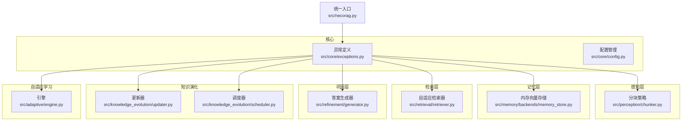
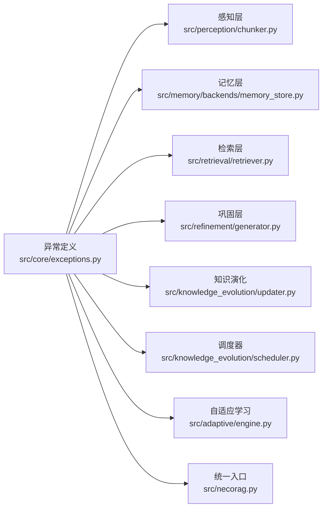
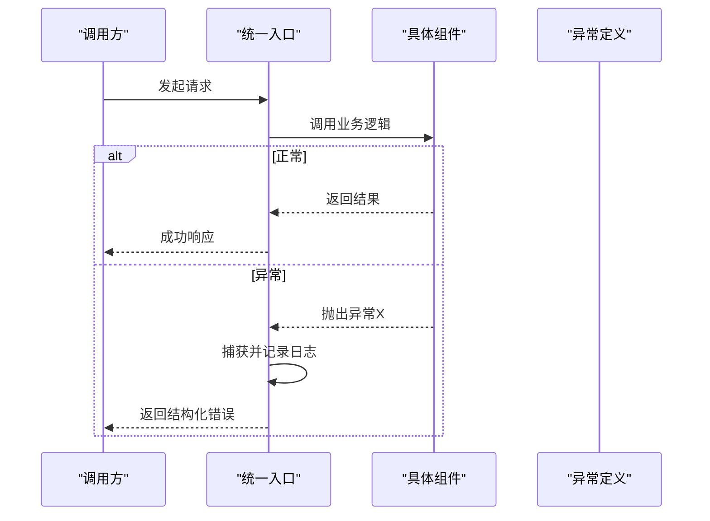

# 异常处理机制

<cite>
**本文引用的文件**
- [src/core/exceptions.py](file://src/core/exceptions.py)
- [src/core/config.py](file://src/core/config.py)
- [src/necorag.py](file://src/necorag.py)
- [src/perception/chunker.py](file://src/perception/chunker.py)
- [src/memory/backends/memory_store.py](file://src/memory/backends/memory_store.py)
- [src/retrieval/retriever.py](file://src/retrieval/retriever.py)
- [src/refinement/generator.py](file://src/refinement/generator.py)
- [src/knowledge_evolution/updater.py](file://src/knowledge_evolution/updater.py)
- [src/knowledge_evolution/scheduler.py](file://src/knowledge_evolution/scheduler.py)
- [src/adaptive/engine.py](file://src/adaptive/engine.py)
</cite>

## 目录
1. [简介](#简介)
2. [项目结构](#项目结构)
3. [核心组件](#核心组件)
4. [架构总览](#架构总览)
5. [详细组件分析](#详细组件分析)
6. [依赖分析](#依赖分析)
7. [性能考虑](#性能考虑)
8. [故障排除指南](#故障排除指南)
9. [结论](#结论)
10. [附录](#附录)

## 简介
本文件系统化梳理 NecoRAG 的异常处理机制，围绕统一异常基类、异常层次结构、错误分类体系、触发条件与处理建议展开；同时给出最佳实践、日志策略、用户友好提示、监控与告警建议以及稳定性保障措施。文档面向开发者与运维人员，兼顾可读性与工程落地。

## 项目结构
NecoRAG 将异常定义集中在核心模块，配合各层组件在关键路径上抛出与捕获异常，形成“统一定义、分层触发、集中处理”的闭环。

图表来源
- [src/core/exceptions.py](file://src/core/exceptions.py)
- [src/perception/chunker.py](file://src/perception/chunker.py)
- [src/memory/backends/memory_store.py](file://src/memory/backends/memory_store.py)
- [src/retrieval/retriever.py](file://src/retrieval/retriever.py)
- [src/refinement/generator.py](file://src/refinement/generator.py)
- [src/knowledge_evolution/updater.py](file://src/knowledge_evolution/updater.py)
- [src/knowledge_evolution/scheduler.py](file://src/knowledge_evolution/scheduler.py)
- [src/adaptive/engine.py](file://src/adaptive/engine.py)
- [src/necorag.py](file://src/necorag.py)

章节来源
- [src/core/exceptions.py](file://src/core/exceptions.py)
- [src/necorag.py](file://src/necorag.py)

## 核心组件
- 统一异常基类：提供标准化的消息、错误码与详情字段，支持字典序列化，便于日志与对外输出。
- 分层异常族：按感知、记忆、检索、巩固、LLM、配置、知识演化、自适应学习等模块划分，便于定位问题域。
- 统一入口集成：在统一入口类中对异常进行捕获与包装，保证对外接口的健壮性与一致性。

章节来源
- [src/core/exceptions.py](file://src/core/exceptions.py)
- [src/necorag.py](file://src/necorag.py)

## 架构总览
异常处理遵循“分层触发、统一上报、分级处理”的设计原则：

```mermaid
classDiagram
class NecoRAGError {
+message : str
+code : str
+details : dict
+__str__() str
+to_dict() dict
}
class ParseError
class ChunkingError
class EncodingError
class MemoryError
class VectorStoreError
class GraphStoreError
class RetrievalError
class RerankError
class GenerationError
class HallucinationError
class RefinementError
class LLMError
class LLMConnectionError
class LLMRateLimitError
class LLMResponseError
class ConfigurationError
class ValidationError
class KnowledgeEvolutionError
class UpdateError
class CandidateError
class MetricsCalculationError
class SchedulerError
class RollbackError
class AdaptiveLearningError
class FeedbackError
class StrategyOptimizationError
class PreferencePredictionError
NecoRAGError <|-- ParseError
NecoRAGError <|-- ChunkingError
NecoRAGError <|-- EncodingError
NecoRAGError <|-- MemoryError
MemoryError <|-- VectorStoreError
MemoryError <|-- GraphStoreError
NecoRAGError <|-- RetrievalError
RetrievalError <|-- RerankError
NecoRAGError <|-- GenerationError
NecoRAGError <|-- HallucinationError
NecoRAGError <|-- RefinementError
NecoRAGError <|-- LLMError
LLMError <|-- LLMConnectionError
LLMError <|-- LLMRateLimitError
LLMError <|-- LLMResponseError
NecoRAGError <|-- ConfigurationError
NecoRAGError <|-- ValidationError
NecoRAGError <|-- KnowledgeEvolutionError
KnowledgeEvolutionError <|-- UpdateError
KnowledgeEvolutionError <|-- CandidateError
KnowledgeEvolutionError <|-- MetricsCalculationError
KnowledgeEvolutionError <|-- SchedulerError
KnowledgeEvolutionError <|-- RollbackError
NecoRAGError <|-- AdaptiveLearningError
AdaptiveLearningError <|-- FeedbackError
AdaptiveLearningError <|-- StrategyOptimizationError
AdaptiveLearningError <|-- PreferencePredictionError
```

图表来源
- [src/core/exceptions.py](file://src/core/exceptions.py)

## 详细组件分析

### 统一异常基类与序列化
- 设计要点
  - 标准化字段：message、code、details，便于统一日志与对外输出。
  - 字典序列化：to_dict() 用于结构化输出，便于监控与告警系统消费。
  - 字符串表示：__str__() 采用“[错误码] 错误消息”格式，提升可观测性。
- 使用建议
  - 所有异常均应设置合理的错误码与细节字段，避免裸露内部实现细节。
  - 对外接口统一捕获并转换为标准错误响应，隐藏内部异常栈。

章节来源
- [src/core/exceptions.py](file://src/core/exceptions.py)

### 感知层异常
- 分类与触发条件
  - ParseError：文档解析失败（如不支持的文件类型、解析器异常）。
  - ChunkingError：文本分块失败（如策略不支持、输入为空）。
  - EncodingError：向量编码失败（如模型不可用、维度不匹配）。
- 处理建议
  - 在分块策略中对非法策略参数抛出 ChunkingError。
  - 在编码器中对维度不一致抛出 EncodingError。
  - 对于解析器不支持的扩展名，抛出 ParseError 并记录 file_path 与 file_type。

章节来源
- [src/core/exceptions.py](file://src/core/exceptions.py)
- [src/perception/chunker.py](file://src/perception/chunker.py)
- [src/memory/backends/memory_store.py](file://src/memory/backends/memory_store.py)

### 记忆层异常
- 分类与触发条件
  - MemoryError：通用记忆存储错误，携带 layer 层级信息。
  - VectorStoreError：向量存储错误（如维度不匹配、查询向量维度不一致）。
  - GraphStoreError：图存储错误（如节点不存在、边连接异常）。
- 处理建议
  - 向量/图存储在 upsert/search/delete 前后校验维度与ID合法性，失败时抛出对应异常。
  - 记录 layer 与具体操作上下文，便于定位问题。

章节来源
- [src/core/exceptions.py](file://src/core/exceptions.py)
- [src/memory/backends/memory_store.py](file://src/memory/backends/memory_store.py)

### 检索层异常
- 分类与触发条件
  - RetrievalError：检索过程异常，携带 query 以便复现。
  - RerankError：重排序阶段异常。
- 处理建议
  - 在检索器早停与融合策略中，对异常进行捕获并记录 query 与当前置信度，便于后续优化。

章节来源
- [src/core/exceptions.py](file://src/core/exceptions.py)
- [src/retrieval/retriever.py](file://src/retrieval/retriever.py)

### 巩固层异常
- 分类与触发条件
  - GenerationError：答案生成阶段异常（如 LLM 客户端不可用、提示词构造失败）。
  - HallucinationError：幻觉检测异常（如检测器实现异常、输入格式不正确）。
  - RefinementError：答案精炼阶段异常。
- 处理建议
  - 生成器在无证据或 LLM 不可用时回退到规则生成，但需记录 GenerationError 与回退原因。

章节来源
- [src/core/exceptions.py](file://src/core/exceptions.py)
- [src/refinement/generator.py](file://src/refinement/generator.py)

### LLM 相关异常
- 分类与触发条件
  - LLMError：通用 LLM 客户端错误，携带 provider 与 model。
  - LLMConnectionError：连接失败。
  - LLMRateLimitError：触发限流，携带 retry_after。
  - LLMResponseError：响应异常（如非预期格式）。
- 处理建议
  - 对限流进行指数退避与重试；对连接失败进行熔断与降级；对响应异常进行日志记录与告警。

章节来源
- [src/core/exceptions.py](file://src/core/exceptions.py)

### 配置与验证异常
- 分类与触发条件
  - ConfigurationError：配置加载/校验失败，携带 config_key。
  - ValidationError：输入参数校验失败，携带 field 与 value。
- 处理建议
  - 在配置加载阶段尽早失败并给出明确的 config_key 与修复建议。
  - 对用户输入进行严格校验，返回 ValidationError 并提示具体字段与期望值。

章节来源
- [src/core/exceptions.py](file://src/core/exceptions.py)
- [src/core/config.py](file://src/core/config.py)

### 知识演化异常
- 分类与触发条件
  - KnowledgeEvolutionError：知识演化基类。
  - UpdateError：实时/批量更新失败，携带 update_mode。
  - CandidateError：候选条目处理异常，携带 candidate_id。
  - MetricsCalculationError：指标计算异常。
  - SchedulerError：调度器异常，携带 task_id。
  - RollbackError：回滚异常，携带 log_id。
- 处理建议
  - 更新器在回滚失败时抛出 RollbackError，并记录日志 ID 与失败原因。
  - 调度器在任务执行失败时记录错误并继续运行其他任务，避免单点故障。

章节来源
- [src/core/exceptions.py](file://src/core/exceptions.py)
- [src/knowledge_evolution/updater.py](file://src/knowledge_evolution/updater.py)
- [src/knowledge_evolution/scheduler.py](file://src/knowledge_evolution/scheduler.py)

### 自适应学习异常
- 分类与触发条件
  - AdaptiveLearningError：自适应学习基类。
  - FeedbackError：反馈处理异常，携带 feedback_id。
  - StrategyOptimizationError：策略优化异常，携带 strategy_name。
  - PreferencePredictionError：偏好预测异常，携带 user_id。
- 处理建议
  - 反馈收集与策略优化失败不影响主流程，记录异常并继续学习其他信号。

章节来源
- [src/core/exceptions.py](file://src/core/exceptions.py)
- [src/adaptive/engine.py](file://src/adaptive/engine.py)

### 统一入口的异常处理
- 设计要点
  - 统一入口类在文档导入与查询过程中捕获异常，记录错误并返回结构化结果。
  - 对于不可恢复的异常（如文件不存在）直接抛出；对于可恢复的异常（如网络波动）进行重试或降级。
- 处理建议
  - 导入流程中对每个文件单独 try-except，汇总失败项与错误信息。
  - 查询流程中对检索、生成、精炼等步骤分别捕获异常，记录 query 与关键上下文。

章节来源
- [src/necorag.py](file://src/necorag.py)

## 依赖分析
异常处理的依赖关系主要体现在“异常定义”与“各层组件”的耦合上，整体呈现“集中定义、分散触发”的特征，有利于统一治理与演进。

图表来源
- [src/core/exceptions.py](file://src/core/exceptions.py)
- [src/perception/chunker.py](file://src/perception/chunker.py)
- [src/memory/backends/memory_store.py](file://src/memory/backends/memory_store.py)
- [src/retrieval/retriever.py](file://src/retrieval/retriever.py)
- [src/refinement/generator.py](file://src/refinement/generator.py)
- [src/knowledge_evolution/updater.py](file://src/knowledge_evolution/updater.py)
- [src/knowledge_evolution/scheduler.py](file://src/knowledge_evolution/scheduler.py)
- [src/adaptive/engine.py](file://src/adaptive/engine.py)
- [src/necorag.py](file://src/necorag.py)

## 性能考虑
- 异常开销控制
  - 避免在热路径频繁抛出异常；将异常作为“非正常流程”处理，正常路径尽量不触发异常。
  - 对可预见的边界条件（如空输入、无效维度）进行前置校验，减少异常传播。
- 日志与监控
  - 对高频异常进行采样与聚合，避免日志风暴。
  - 使用结构化日志（to_dict）便于指标采集与告警。
- 降级与熔断
  - 对外部依赖（如 LLM、存储）异常时，采用快速失败与降级策略，保证系统可用性。

## 故障排除指南
- 常见问题与排查步骤
  - 文档导入失败：检查文件路径、格式支持与解析器实现；查看 ParseError 的 file_path 与 file_type。
  - 分块异常：确认分块策略参数合法；查看 ChunkingError 的策略与输入内容。
  - 向量/图存储异常：核对维度与ID；查看 VectorStoreError/GraphStoreError 的 layer 与操作上下文。
  - 检索异常：记录 query 并复现；查看 RetrievalError/RerankError 的上下文。
  - 生成异常：检查 LLM 客户端可用性与提示词构造；查看 GenerationError 的 model_name。
  - 知识演化异常：核对候选池与变更日志；查看 UpdateError/CandidateError/SchedulerError/RollbackError 的标识。
  - 自适应学习异常：检查反馈与策略优化流程；查看 FeedbackError/StrategyOptimizationError/PreferencePredictionError 的标识。
- 调试技巧
  - 使用 to_dict() 输出结构化错误，结合监控平台快速定位。
  - 在统一入口中增加 try-except，记录 query 与关键上下文，便于复现。
  - 对 LLM 相关异常进行重试与退避，记录 retry_after 与 provider 信息。

章节来源
- [src/core/exceptions.py](file://src/core/exceptions.py)
- [src/necorag.py](file://src/necorag.py)
- [src/knowledge_evolution/updater.py](file://src/knowledge_evolution/updater.py)
- [src/knowledge_evolution/scheduler.py](file://src/knowledge_evolution/scheduler.py)

## 结论
NecoRAG 的异常处理机制以统一基类为核心，按功能域细分异常类型，结合结构化日志与统一入口的捕获包装，实现了可观测、可诊断、可恢复的工程化能力。建议在实际部署中完善监控与告警策略，持续优化异常分类与处理流程，以提升系统稳定性与用户体验。

## 附录

### 异常触发流程示意

图表来源
- [src/necorag.py](file://src/necorag.py)
- [src/core/exceptions.py](file://src/core/exceptions.py)