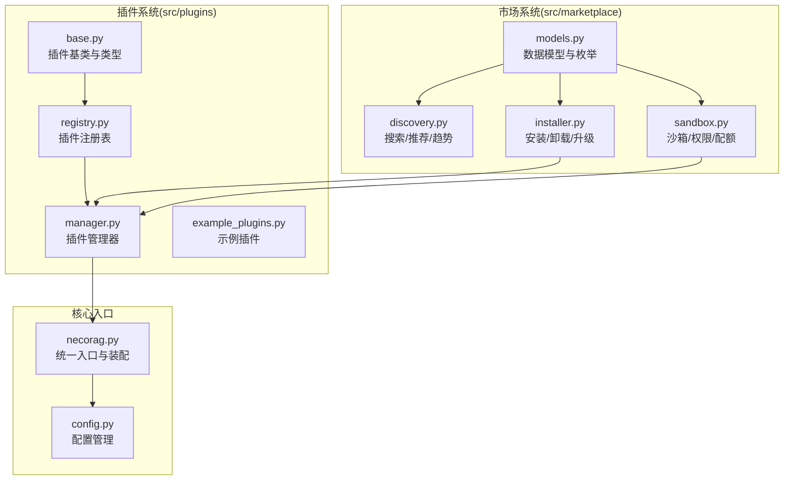
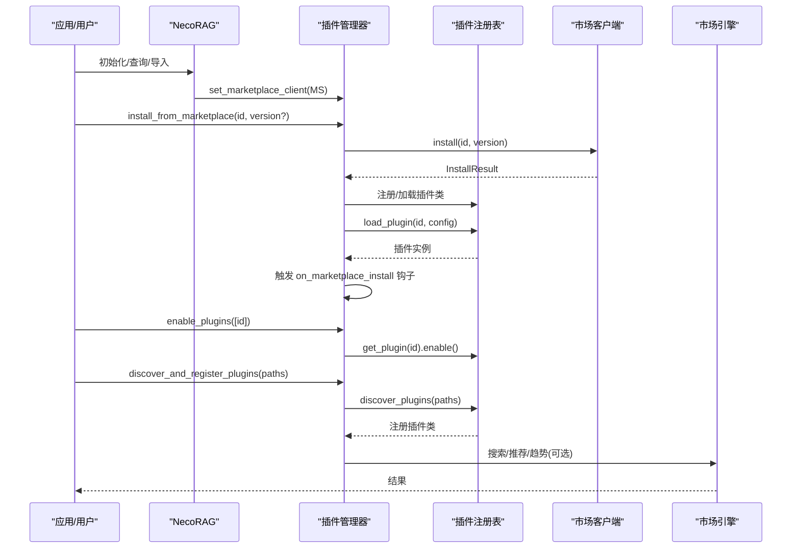
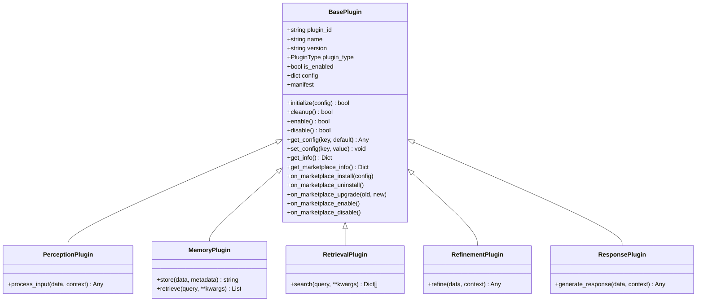
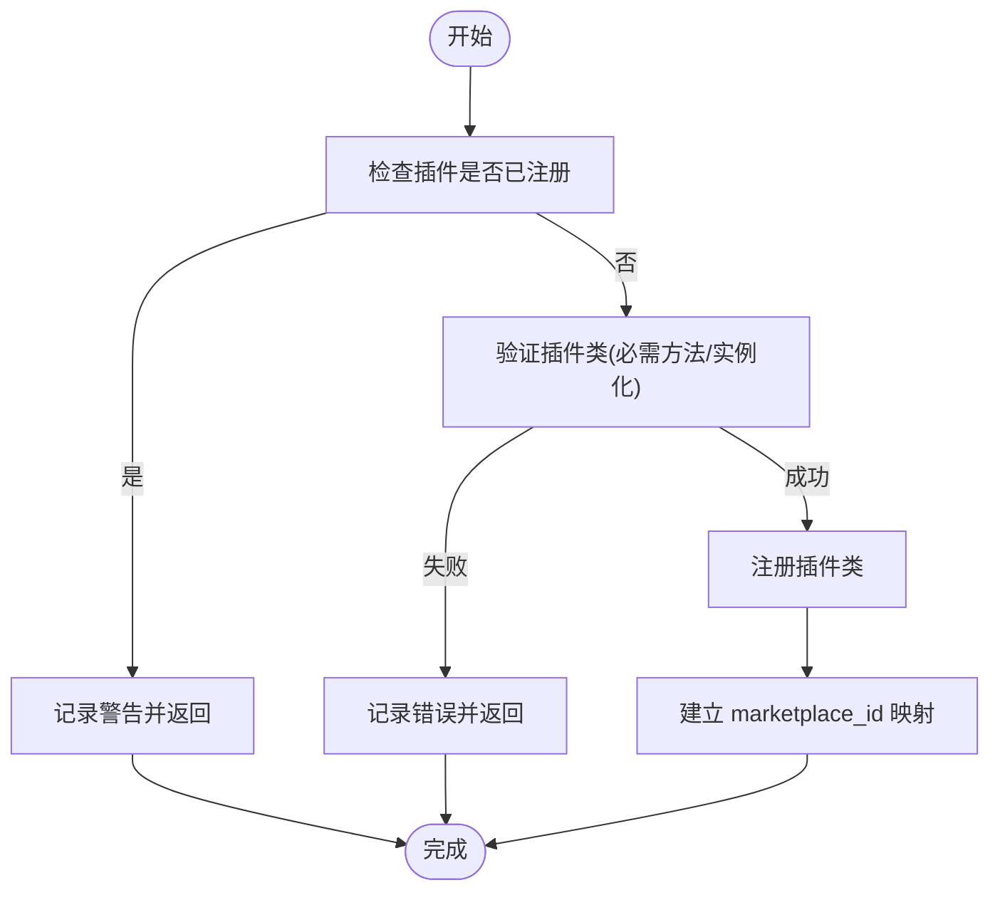
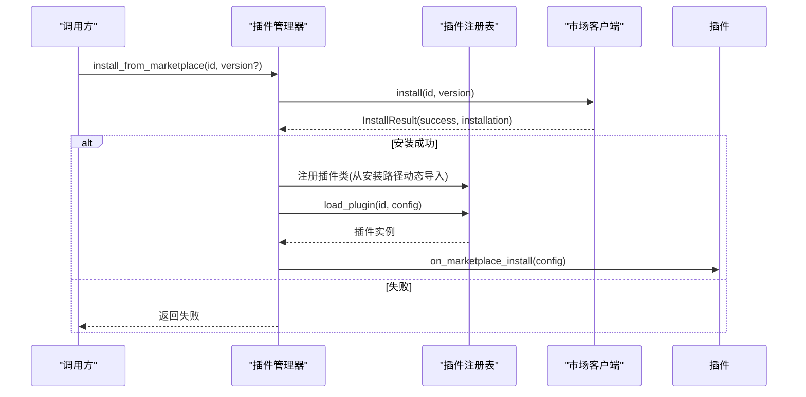
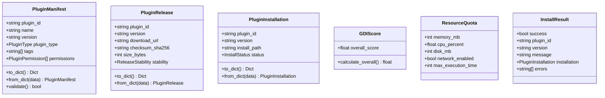
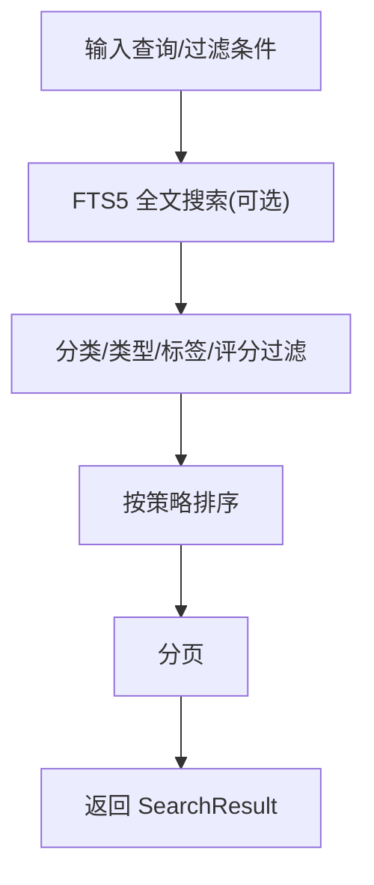
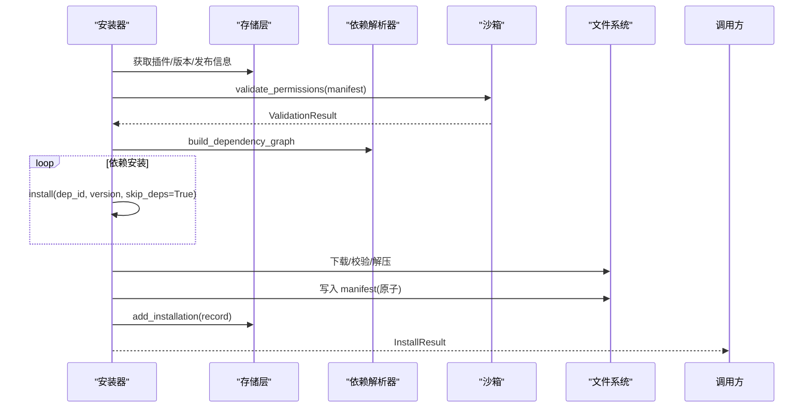
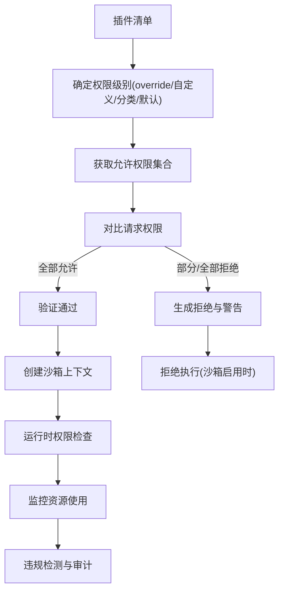
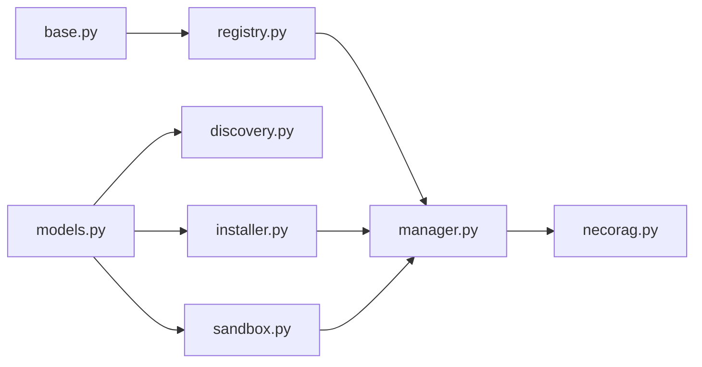

# 扩展点与插件系统

<cite>
**本文档引用的文件**
- [src/plugins/__init__.py](file://src/plugins/__init__.py)
- [src/plugins/base.py](file://src/plugins/base.py)
- [src/plugins/manager.py](file://src/plugins/manager.py)
- [src/plugins/registry.py](file://src/plugins/registry.py)
- [src/plugins/example_plugins.py](file://src/plugins/example_plugins.py)
- [src/marketplace/__init__.py](file://src/marketplace/__init__.py)
- [src/marketplace/models.py](file://src/marketplace/models.py)
- [src/marketplace/discovery.py](file://src/marketplace/discovery.py)
- [src/marketplace/installer.py](file://src/marketplace/installer.py)
- [src/marketplace/sandbox.py](file://src/marketplace/sandbox.py)
- [src/necorag.py](file://src/necorag.py)
- [src/core/config.py](file://src/core/config.py)
</cite>

## 目录
1. [简介](#简介)
2. [项目结构](#项目结构)
3. [核心组件](#核心组件)
4. [架构总览](#架构总览)
5. [详细组件分析](#详细组件分析)
6. [依赖分析](#依赖分析)
7. [性能考虑](#性能考虑)
8. [故障排查指南](#故障排查指南)
9. [结论](#结论)
10. [附录](#附录)

## 简介
本文件面向 NecoRAG 的扩展点与插件系统，系统性阐述模块化设计理念、扩展机制与插件生命周期管理；详细说明插件接口规范、注册与发现流程、市场集成与版本管理；深入解析插件沙箱隔离、权限控制与安全机制；提供插件开发指南、调试与性能优化建议，并解释系统如何支持持续演进与功能扩展。

## 项目结构
插件系统位于 src/plugins 目录，市场系统位于 src/marketplace 目录，二者通过统一的插件基类与管理器协同工作。NecoRAG 主入口在 src/necorag.py 中负责初始化与装配。

**图表来源**
- [src/plugins/base.py:1-385](file://src/plugins/base.py#L1-L385)
- [src/plugins/registry.py:1-383](file://src/plugins/registry.py#L1-L383)
- [src/plugins/manager.py:1-584](file://src/plugins/manager.py#L1-L584)
- [src/plugins/example_plugins.py:1-332](file://src/plugins/example_plugins.py#L1-L332)
- [src/marketplace/models.py:1-756](file://src/marketplace/models.py#L1-L756)
- [src/marketplace/discovery.py:1-776](file://src/marketplace/discovery.py#L1-L776)
- [src/marketplace/installer.py:1-800](file://src/marketplace/installer.py#L1-L800)
- [src/marketplace/sandbox.py:1-800](file://src/marketplace/sandbox.py#L1-L800)
- [src/necorag.py:1-990](file://src/necorag.py#L1-L990)
- [src/core/config.py:1-420](file://src/core/config.py#L1-L420)

**章节来源**
- [src/plugins/__init__.py:1-45](file://src/plugins/__init__.py#L1-L45)
- [src/plugins/base.py:1-385](file://src/plugins/base.py#L1-L385)
- [src/plugins/registry.py:1-383](file://src/plugins/registry.py#L1-L383)
- [src/plugins/manager.py:1-584](file://src/plugins/manager.py#L1-L584)
- [src/plugins/example_plugins.py:1-332](file://src/plugins/example_plugins.py#L1-L332)
- [src/marketplace/__init__.py:1-192](file://src/marketplace/__init__.py#L1-L192)
- [src/marketplace/models.py:1-756](file://src/marketplace/models.py#L1-L756)
- [src/marketplace/discovery.py:1-776](file://src/marketplace/discovery.py#L1-L776)
- [src/marketplace/installer.py:1-800](file://src/marketplace/installer.py#L1-L800)
- [src/marketplace/sandbox.py:1-800](file://src/marketplace/sandbox.py#L1-L800)
- [src/necorag.py:1-990](file://src/necorag.py#L1-L990)
- [src/core/config.py:1-420](file://src/core/config.py#L1-L420)

## 核心组件
- 插件基类与类型：定义标准接口、生命周期方法、配置管理与市场元数据支持。
- 插件注册表：负责插件发现、注册、实例化与版本索引。
- 插件管理器：负责批量加载/卸载、启用/禁用、事件分发、依赖解析与市场集成。
- 市场数据模型：定义插件清单、版本、权限、安装记录等核心数据结构。
- 市场引擎：提供搜索、推荐、趋势、相似度匹配与分类概览。
- 安装器：实现插件安装、卸载、升级、依赖解析与钩子回调。
- 沙箱系统：提供权限验证、运行时权限检查、资源配额与安全审计。
- NecoRAG 统一入口：装配各层组件并可选初始化插件市场客户端。

**章节来源**
- [src/plugins/base.py:15-385](file://src/plugins/base.py#L15-L385)
- [src/plugins/registry.py:15-383](file://src/plugins/registry.py#L15-L383)
- [src/plugins/manager.py:14-584](file://src/plugins/manager.py#L14-L584)
- [src/marketplace/models.py:21-756](file://src/marketplace/models.py#L21-L756)
- [src/marketplace/discovery.py:21-776](file://src/marketplace/discovery.py#L21-L776)
- [src/marketplace/installer.py:152-800](file://src/marketplace/installer.py#L152-L800)
- [src/marketplace/sandbox.py:186-800](file://src/marketplace/sandbox.py#L186-L800)
- [src/necorag.py:51-220](file://src/necorag.py#L51-L220)

## 架构总览
插件系统采用“基类 + 注册表 + 管理器”的分层架构，结合市场系统实现插件的发现、安装、权限与安全控制。NecoRAG 在统一入口中按需初始化市场客户端并与插件管理器集成。

**图表来源**
- [src/plugins/manager.py:287-581](file://src/plugins/manager.py#L287-L581)
- [src/plugins/registry.py:192-248](file://src/plugins/registry.py#L192-L248)
- [src/marketplace/installer.py:217-402](file://src/marketplace/installer.py#L217-L402)
- [src/marketplace/discovery.py:71-161](file://src/marketplace/discovery.py#L71-L161)
- [src/necorag.py:199-220](file://src/necorag.py#L199-L220)

## 详细组件分析

### 插件基类与类型
- 插件类型枚举：感知层、记忆层、检索层、巩固层、响应层、自定义。
- 生命周期：initialize/cleanup，enable/disable（可覆盖）。
- 配置管理：get_config/set_config。
- 市场集成：marketplace_* 元数据属性、manifest 生成、get_marketplace_info、on_marketplace_* 生命周期钩子。
- 层级插件基类：Perception/Memory/Retrieval/Refinement/Response 插件分别定义各自处理接口。

**图表来源**
- [src/plugins/base.py:25-385](file://src/plugins/base.py#L25-L385)

**章节来源**
- [src/plugins/base.py:15-385](file://src/plugins/base.py#L15-L385)

### 插件注册表
- 注册与注销：register_plugin/unregister_plugin。
- 实例化：load_plugin/unload_plugin。
- 发现：discover_plugins，自动扫描并注册插件类。
- 信息查询：list_plugins/get_plugin/get_plugin_class。
- 市场集成：版本索引 register_version/get_version、元数据缓存 set/get、列出有元数据的插件。

**图表来源**
- [src/plugins/registry.py:28-61](file://src/plugins/registry.py#L28-L61)

**章节来源**
- [src/plugins/registry.py:15-383](file://src/plugins/registry.py#L15-L383)

### 插件管理器
- 批量加载/卸载：load_plugins/unload_plugins，按依赖拓扑排序。
- 启用/禁用：enable_plugins/disable_plugins。
- 事件系统：register/unregister/emit，支持处理器注册与事件通知。
- 依赖图：_build_dependency_graph/_resolve_load_order/_resolve_unload_order。
- 市场集成：set_marketplace_client/install_from_marketplace/uninstall_marketplace_plugin/upgrade_marketplace_plugin/get_marketplace_plugins/sync_with_marketplace。

**图表来源**
- [src/plugins/manager.py:287-391](file://src/plugins/manager.py#L287-L391)
- [src/plugins/registry.py:80-132](file://src/plugins/registry.py#L80-L132)

**章节来源**
- [src/plugins/manager.py:14-584](file://src/plugins/manager.py#L14-L584)

### 市场数据模型
- 枚举：插件类型、分类、发布稳定性、安装状态、权限、排序策略、权限等级。
- 核心模型：PluginManifest、PluginRelease、PluginInstallation、GDIScore、ResourceQuota、SearchResult、InstallResult、UpgradePath、DependencyGraph、VersionConflict、CanaryDeployment、SyncResult。
- 校验与序列化：to_dict/from_dict、权限/枚举转换工具。

**图表来源**
- [src/marketplace/models.py:135-756](file://src/marketplace/models.py#L135-L756)

**章节来源**
- [src/marketplace/models.py:21-756](file://src/marketplace/models.py#L21-L756)

### 市场搜索/发现与推荐
- 搜索：全文检索、分类/类型过滤、标签过滤、最低评分过滤、多策略排序。
- 推荐：基于互补性、用户偏好、GDI评分、新鲜度的加权打分。
- 趋势：按时间窗口统计事件数，支持分类过滤。
- 场景推荐：预定义场景映射与自然语言关键词匹配。
- 分类/类型概览：统计各分类/类型的插件数、平均评分、热门标签。
- 相似插件：基于类型、标签、描述关键词的相似度计算。

**图表来源**
- [src/marketplace/discovery.py:71-161](file://src/marketplace/discovery.py#L71-L161)

**章节来源**
- [src/marketplace/discovery.py:21-776](file://src/marketplace/discovery.py#L21-L776)

### 插件安装器
- 安装：检查已安装、解析版本、沙箱权限验证、依赖解析与安装、下载/校验/解压、写入 manifest、记录安装、触发钩子。
- 卸载：前置钩子、反向依赖检查、清理目录、移除记录、记录事件、后置钩子。
- 升级：记录旧版本、调用升级、更新记录、触发钩子。
- 钩子：pre/post install/uninstall/upgrade、on_error。
- 安全：ZIP/TAR 安全解压（防目录穿越）、SHA256 校验、原子写入 manifest。

**图表来源**
- [src/marketplace/installer.py:217-402](file://src/marketplace/installer.py#L217-L402)
- [src/marketplace/installer.py:659-755](file://src/marketplace/installer.py#L659-L755)
- [src/marketplace/installer.py:792-897](file://src/marketplace/installer.py#L792-L897)

**章节来源**
- [src/marketplace/installer.py:152-800](file://src/marketplace/installer.py#L152-L800)

### 沙箱隔离与权限控制
- 权限级别：MINIMAL/STANDARD/ELEVATED/FULL，映射到允许的权限集合。
- 默认权限：按插件分类映射到默认级别。
- 权限验证：对比请求权限与允许权限，标记拒绝并生成警告。
- 运行时检查：在活跃上下文中检查具体权限。
- 资源配额：内存/CPU/磁盘/执行时间限制，监控与违规检测。
- 上下文管理：自动创建/销毁沙箱上下文，确保资源清理。
- 安全审计：活跃上下文、资源使用、违规统计。

**图表来源**
- [src/marketplace/sandbox.py:235-318](file://src/marketplace/sandbox.py#L235-L318)
- [src/marketplace/sandbox.py:580-624](file://src/marketplace/sandbox.py#L580-L624)
- [src/marketplace/sandbox.py:662-704](file://src/marketplace/sandbox.py#L662-L704)
- [src/marketplace/sandbox.py:462-577](file://src/marketplace/sandbox.py#L462-L577)

**章节来源**
- [src/marketplace/sandbox.py:186-800](file://src/marketplace/sandbox.py#L186-L800)

### 示例插件与开发指南
- 示例插件：文本预处理、简单缓存、关键词检索、数据验证、响应格式化。
- 开发步骤：继承对应层级基类、实现抽象方法、声明依赖、设置 marketplace_* 元数据、实现生命周期钩子。
- 配置管理：通过 get_config/set_config 动态读取配置。
- 错误处理：在 initialize/cleanup/enable/disable 中捕获异常并记录日志。

**章节来源**
- [src/plugins/example_plugins.py:13-332](file://src/plugins/example_plugins.py#L13-L332)

### NecoRAG 统一入口与市场集成
- 统一入口：NecoRAG 类负责各层组件初始化与装配。
- 市场集成：可选导入 marketplace 模块，初始化 MarketplaceClient 并注入到插件管理器。
- 配置：通过 NecoRAGConfig 控制各层行为，支持从文件与环境变量加载。

**章节来源**
- [src/necorag.py:51-220](file://src/necorag.py#L51-L220)
- [src/core/config.py:277-420](file://src/core/config.py#L277-L420)

## 依赖分析
- 插件系统内部：base → registry → manager。
- 市场系统内部：models ← discovery/installer/sandbox。
- 插件系统与市场系统：manager 通过 marketplace 客户端集成；installer/sandbox 依赖 models；discovery 依赖 store。
- NecoRAG：装配插件管理器与市场客户端（可选）。

**图表来源**
- [src/plugins/base.py:1-385](file://src/plugins/base.py#L1-L385)
- [src/plugins/registry.py:1-383](file://src/plugins/registry.py#L1-L383)
- [src/plugins/manager.py:1-584](file://src/plugins/manager.py#L1-L584)
- [src/marketplace/models.py:1-756](file://src/marketplace/models.py#L1-L756)
- [src/marketplace/discovery.py:1-776](file://src/marketplace/discovery.py#L1-L776)
- [src/marketplace/installer.py:1-800](file://src/marketplace/installer.py#L1-L800)
- [src/marketplace/sandbox.py:1-800](file://src/marketplace/sandbox.py#L1-L800)
- [src/necorag.py:1-990](file://src/necorag.py#L1-L990)

**章节来源**
- [src/plugins/base.py:1-385](file://src/plugins/base.py#L1-L385)
- [src/plugins/registry.py:1-383](file://src/plugins/registry.py#L1-L383)
- [src/plugins/manager.py:1-584](file://src/plugins/manager.py#L1-L584)
- [src/marketplace/models.py:1-756](file://src/marketplace/models.py#L1-L756)
- [src/marketplace/discovery.py:1-776](file://src/marketplace/discovery.py#L1-L776)
- [src/marketplace/installer.py:1-800](file://src/marketplace/installer.py#L1-L800)
- [src/marketplace/sandbox.py:1-800](file://src/marketplace/sandbox.py#L1-L800)
- [src/necorag.py:1-990](file://src/necorag.py#L1-L990)

## 性能考虑
- 依赖解析：拓扑排序确保加载/卸载顺序正确，避免循环依赖导致的性能退化。
- 插件发现：pkgutil 遍历模块，建议限定搜索路径减少 IO。
- 安装流程：下载/校验/解压为 IO 密集操作，建议使用缓存目录与原子写入降低失败重试成本。
- 沙箱监控：资源监控依赖 psutil 或 resource 模块，缺失时会降级，建议在生产环境安装 psutil。
- 日志与事件：合理使用日志级别，避免高频事件写入造成 I/O 压力。

[本节为通用指导，无需特定文件引用]

## 故障排查指南
- 插件注册失败：检查插件类是否满足必需方法、是否重复注册、是否通过验证。
- 插件加载失败：查看 initialize 返回值与异常日志，确认依赖是否满足。
- 插件卸载失败：检查反向依赖与权限，确认钩子是否抛出异常。
- 市场安装失败：核对权限验证结果、下载链接、校验和、安装路径是否存在。
- 沙箱拒绝：检查插件请求权限与默认/自定义权限级别，关注敏感权限警告。
- 依赖冲突：使用依赖解析器生成的 DependencyGraph 与冲突信息定位问题版本。

**章节来源**
- [src/plugins/registry.py:250-268](file://src/plugins/registry.py#L250-L268)
- [src/plugins/manager.py:48-67](file://src/plugins/manager.py#L48-L67)
- [src/marketplace/installer.py:659-755](file://src/marketplace/installer.py#L659-L755)
- [src/marketplace/sandbox.py:235-318](file://src/marketplace/sandbox.py#L235-L318)

## 结论
NecoRAG 的插件系统通过清晰的基类接口、完善的注册与管理机制、与市场系统的深度集成，实现了模块化扩展与生态化演进。结合沙箱隔离与权限控制，系统在开放性与安全性之间取得平衡。开发者可通过示例插件快速入门，遵循生命周期与配置管理规范，安全高效地扩展系统能力。

[本节为总结，无需特定文件引用]

## 附录

### 插件开发最佳实践
- 明确插件类型与职责边界，避免过度耦合。
- 在 initialize 中完成资源申请与校验，在 cleanup 中释放资源。
- 正确声明 dependencies，使用拓扑排序保障加载顺序。
- 为 marketplace_* 字段提供完整元数据，便于市场展示与版本管理。
- 使用 get_config/set_config 管理可配置项，避免硬编码。
- 在生命周期钩子中处理市场事件，保持与市场的同步。

**章节来源**
- [src/plugins/base.py:65-171](file://src/plugins/base.py#L65-L171)
- [src/plugins/manager.py:184-253](file://src/plugins/manager.py#L184-L253)

### 版本管理与兼容性
- 版本约束：通过 PluginManifest.dependencies 与 VersionManager 协作。
- 升级路径：UpgradePath 描述兼容性与破坏性变更。
- 灰度发布：CanaryDeployment 支持按百分比发布与状态跟踪。
- 同步策略：PluginManager.sync_with_marketplace 保持本地与市场的状态一致。

**章节来源**
- [src/marketplace/models.py:575-718](file://src/marketplace/models.py#L575-L718)
- [src/plugins/manager.py:533-581](file://src/plugins/manager.py#L533-L581)

### 调试与性能优化建议
- 使用日志模块记录关键路径，定位初始化/清理/启用/禁用阶段的问题。
- 在安装器中利用钩子进行自定义校验与补偿动作。
- 在沙箱中监控资源使用，识别潜在的内存/CPU/磁盘瓶颈。
- 对高频操作（如搜索/发现）增加缓存与分页，避免一次性加载过多数据。

**章节来源**
- [src/marketplace/installer.py:57-150](file://src/marketplace/installer.py#L57-L150)
- [src/marketplace/sandbox.py:462-577](file://src/marketplace/sandbox.py#L462-L577)
- [src/marketplace/discovery.py:71-161](file://src/marketplace/discovery.py#L71-L161)