# 抽象基类设计

<cite>
**本文档引用的文件**
- [src/core/base.py](file://src/core/base.py)
- [src/core/protocols.py](file://src/core/protocols.py)
- [src/core/llm/base.py](file://src/core/llm/base.py)
- [src/core/llm/mock.py](file://src/core/llm/mock.py)
- [src/memory/backends/base.py](file://src/memory/backends/base.py)
- [src/plugins/base.py](file://src/plugins/base.py)
- [src/plugins/example_plugins.py](file://src/plugins/example_plugins.py)
- [example/example_usage.py](file://example/example_usage.py)
- [wiki/wiki/核心架构设计/抽象基类设计.md](file://wiki/wiki/核心架构设计/抽象基类设计.md)
</cite>

## 目录
1. [简介](#简介)
2. [项目结构](#项目结构)
3. [核心组件](#核心组件)
4. [架构概览](#架构概览)
5. [详细组件分析](#详细组件分析)
6. [类型安全与抽象层改进](#类型安全与抽象层改进)
7. [依赖分析](#依赖分析)
8. [性能考虑](#性能考虑)
9. [故障排除指南](#故障排除指南)
10. [结论](#结论)

## 简介

NecoRAG 的抽象基类设计是整个系统的核心架构支柱，它通过定义统一的接口规范和数据协议，实现了模块间的松耦合设计和高度的可扩展性。本文档深入分析了抽象基类的设计模式、继承体系和接口规范，详细解释了 Protocol 协议定义的作用、数据模型设计和类型约束机制，并展示了如何通过抽象基类实现模块间的解耦设计以及支持插件化扩展。

**更新** 本次更新反映了核心架构的重大改进：引入了更强大的 TYPE_CHECKING 类型检查机制、增强了属性装饰器的使用、重构了 LLM 客户端基类以消除重复定义，并改进了存储后端的抽象层设计。

## 项目结构

NecoRAG 采用分层架构设计，核心抽象基类位于 `src/core/` 目录下，按照功能层次组织：

```mermaid
graph TB
subgraph "核心层"
Core[core/__init__.py]
Base[base.py<br/>抽象基类定义]
Protocols[protocols.py<br/>数据协议定义]
Config[config.py<br/>配置管理]
Exceptions[exceptions.py<br/>异常定义]
LLMBase[llm/base.py<br/>LLM扩展基类]
End
subgraph "感知层"
Perception[perception/]
Parser[parser.py<br/>文档解析器]
Chunker[chunker.py<br/>文本分块器]
Encoder[encoder.py<br/>向量编码器]
Tagger[tagger.py<br/>情境标签生成器]
end
subgraph "记忆层"
Memory[memory/]
MemoryStore[backends/memory_store.py<br/>内存存储实现]
VectorStore[backends/vector_store.py<br/>向量存储实现]
GraphStore[backends/graph_store.py<br/>图存储实现]
BackendBase[backends/base.py<br/>存储后端基类]
end
subgraph "检索层"
Retrieval[retrieval/]
Retriever[retriever.py<br/>自适应检索器]
Reranker[reranker.py<br/>重排序器]
end
subgraph "巩固层"
Refinement[refinement/]
Generator[generator.py<br/>答案生成器]
Critic[critic.py<br/>批判器]
Refiner[refiner.py<br/>修正器]
Hallucination[hallucination.py<br/>幻觉检测器]
end
subgraph "响应层"
Response[response/]
ResponseAdapter[detail_adapter.py<br/>详细度适配器]
end
subgraph "意图层"
Intent[intent/]
IntentClassifier[classifier.py<br/>意图分类器]
IntentRouter[router.py<br/>意图路由器]
end
subgraph "知识演化层"
KnowledgeEvolution[knowledge_evolution/]
KnowledgeUpdater[updater.py<br/>知识更新器]
Metrics[metrics.py<br/>指标计算器]
end
Core --> Base
Core --> Protocols
Core --> Config
Core --> Exceptions
Core --> LLMBase
Perception --> Parser
Perception --> Chunker
Perception --> Encoder
Perception --> Tagger
Memory --> MemoryStore
Memory --> BackendBase
Retrieval --> Retriever
Retrieval --> Reranker
Refinement --> Generator
Refinement --> Critic
Refinement --> Refiner
Refinement --> Hallucination
Response --> ResponseAdapter
Intent --> IntentClassifier
Intent --> IntentRouter
KnowledgeEvolution --> KnowledgeUpdater
KnowledgeEvolution --> Metrics
```

**图表来源**
- [src/core/__init__.py:1-195](file://src/core/__init__.py#L1-L195)
- [src/necorag.py:1-744](file://src/necorag.py#L1-L744)

## 核心组件

### 抽象基类体系

NecoRAG 的抽象基类设计遵循面向对象设计原则，通过 ABC（Abstract Base Classes）实现严格的接口约束。**更新** 新版本引入了更强大的类型安全机制和属性装饰器支持：


**图表来源**
- [src/core/base.py:22-800](file://src/core/base.py#L22-L800)

### Protocol 协议定义

Protocol 协议定义提供了系统内统一的数据类型和协议，确保模块间数据交换的一致性：

```mermaid
classDiagram
class Document {
+doc_id : str
+content : str
+doc_type : DocumentType
+file_path : str?
+title : str?
+metadata : Dict[str, Any]
+created_at : datetime
}
class Chunk {
+chunk_id : str
+content : str
+doc_id : str?
+chunk_type : ChunkType
+position : int
+metadata : Dict[str, Any]
+start_char : int?
+end_char : int?
+prev_chunk_id : str?
+next_chunk_id : str?
}
class ContextTag {
+time_tag : str?
+emotion_tag : str?
+importance : float
+topics : List[str]
+entities : List[str]
}
class Embedding {
+embedding_id : str
+chunk_id : str
+dense_vector : List[float]
+sparse_vector : Dict[str, float]
+dimension : int
+model_name : str?
}
class EncodedChunk {
+chunk_id : str
+content : str
+dense_vector : List[float]
+sparse_vector : Dict[str, float]
+entities : List[tuple]
+context_tags : Dict[str, Any]
+metadata : Dict[str, Any]
}
class Memory {
+memory_id : str
+content : str
+layer : MemoryLayer
+vector : List[float]
+weight : float
+access_count : int
+created_at : datetime
+last_accessed : datetime
+metadata : Dict[str, Any]
}
class Entity {
+entity_id : str
+name : str
+entity_type : str
+properties : Dict[str, Any]
+created_at : datetime
}
class Relation {
+relation_id : str
+source_id : str
+target_id : str
+relation_type : str
+weight : float
+properties : Dict[str, Any]
+created_at : datetime
}
class Query {
+query_id : str
+text : str
+user_id : str?
+session_id : str?
+vector : List[float]?
+filters : Dict[str, Any]
+top_k : int
+threshold : float
+created_at : datetime
}
class RetrievalResult {
+result_id : str
+memory_id : str
+content : str
+score : float
+source : RetrievalSource
+metadata : Dict[str, Any]
+retrieval_path : List[str]
}
class GeneratedAnswer {
+answer_id : str
+content : str
+confidence : float
+evidence : List[str]
+sources : List[str]
+iteration : int
+is_refined : bool
}
class Response {
+response_id : str
+query_id : str
+content : str
+confidence : float
+sources : List[RetrievalResult]
+thinking_chain : List[Dict[str, Any]]
+tone : ResponseTone
+detail_level : DetailLevel
+citations : List[str]
+metadata : Dict[str, Any]
+created_at : datetime
}
class CritiqueResult {
+critique_id : str
+is_valid : bool
+issues : List[str]
+suggestions : List[str]
+scores : Dict[str, float]
}
class HallucinationReport {
+report_id : str
+has_hallucination : bool
+factual_score : float
+logical_score : float
+evidence_score : float
+issues : List[str]
}
class UserProfile {
+user_id : str
+name : str?
+profession : str?
+knowledge_level : str
+preferred_tone : ResponseTone
+preferred_detail : DetailLevel
+interests : List[str]
+preferred_domains : List[str]
+query_history : List[str]
+interaction_count : int
+metadata : Dict[str, Any]
+created_at : datetime
+updated_at : datetime
}
class DocumentType {
<<enumeration>>
TEXT
PDF
WORD
MARKDOWN
HTML
JSON
UNKNOWN
}
class ChunkType {
<<enumeration>>
FIXED
SEMANTIC
STRUCTURAL
ELASTIC
SENTENCE
}
class MemoryLayer {
<<enumeration>>
L1_WORKING
L2_SEMANTIC
L3_EPISODIC
}
class RetrievalSource {
<<enumeration>>
VECTOR
GRAPH
HYDE
HYBRID
}
class ResponseTone {
<<enumeration>>
PROFESSIONAL
FRIENDLY
HUMOROUS
}
class DetailLevel {
<<enumeration>>
BRIEF
STANDARD
DETAILED
COMPREHENSIVE
}
class IntentType {
<<enumeration>>
FACTUAL
COMPARATIVE
REASONING
EXPLANATION
SUMMARIZATION
PROCEDURAL
EXPLORATORY
}
```

**图表来源**
- [src/core/protocols.py:14-298](file://src/core/protocols.py#L14-L298)

**章节来源**
- [src/core/base.py:1-800](file://src/core/base.py#L1-L800)
- [src/core/protocols.py:1-298](file://src/core/protocols.py#L1-L298)

## 架构概览

NecoRAG 采用分层架构设计，通过抽象基类实现模块间的松耦合。**更新** 新版本通过统一的抽象来源和增强的类型安全机制，进一步提升了系统的可维护性和扩展性：

```mermaid
graph TB
subgraph "统一入口层"
NecoRAG[NecoRAG 主类]
end
subgraph "感知层"
Parser[BaseParser 实现]
Chunker[BaseChunker 实现]
Encoder[BaseEncoder 实现]
Tagger[BaseTagger 实现]
end
subgraph "记忆层"
MemoryStore[BaseMemoryStore 实现]
VectorStore[BaseVectorStore 实现]
GraphStore[BaseGraphStore 实现]
BackendBase[存储后端基类]
End
subgraph "检索层"
Retriever[BaseRetriever 实现]
Reranker[BaseReranker 实现]
end
subgraph "巩固层"
Generator[BaseGenerator 实现]
Critic[BaseCritic 实现]
Refiner[BaseRefiner 实现]
HallucinationDetector[BaseHallucinationDetector 实现]
end
subgraph "响应层"
ResponseAdapter[BaseResponseAdapter 实现]
end
subgraph "意图层"
IntentClassifier[BaseIntentClassifier 实现]
IntentRouter[BaseIntentRouter 实现]
end
subgraph "知识演化层"
KnowledgeUpdater[BaseKnowledgeUpdater 实现]
MetricsCalculator[BaseMetricsCalculator 实现]
end
NecoRAG --> Parser
NecoRAG --> Chunker
NecoRAG --> Encoder
NecoRAG --> Tagger
Parser --> MemoryStore
Chunker --> MemoryStore
Encoder --> MemoryStore
Tagger --> MemoryStore
MemoryStore --> Retriever
VectorStore --> Retriever
GraphStore --> Retriever
Retriever --> Reranker
Reranker --> Generator
Generator --> Critic
Critic --> Refiner
Refiner --> HallucinationDetector
Generator --> ResponseAdapter
Critic --> ResponseAdapter
Refiner --> ResponseAdapter
NecoRAG --> IntentClassifier
IntentClassifier --> IntentRouter
IntentRouter --> Retriever
NecoRAG --> KnowledgeUpdater
KnowledgeUpdater --> MetricsCalculator
```

**图表来源**
- [src/necorag.py:37-744](file://src/necorag.py#L37-L744)
- [src/core/base.py:22-800](file://src/core/base.py#L22-L800)

## 详细组件分析

### 抽象基类实现模式

#### 1. 感知层抽象基类

感知层抽象基类定义了文档处理的标准接口：

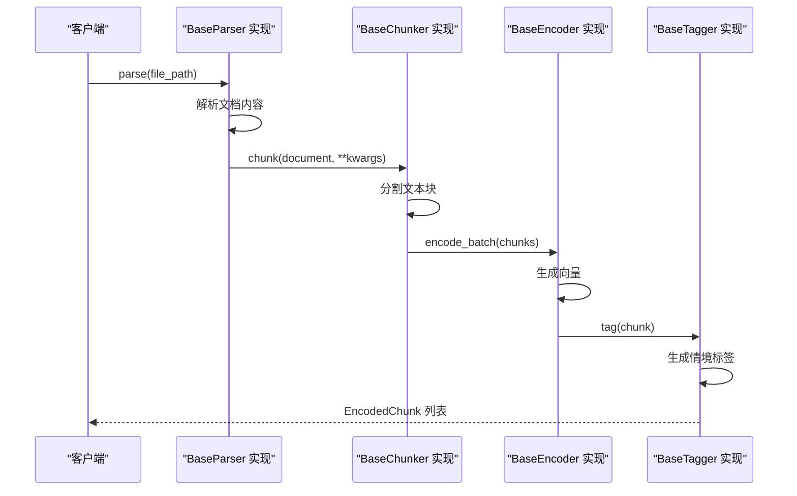

**图表来源**
- [src/core/base.py:32-160](file://src/core/base.py#L32-L160)

#### 2. 记忆层抽象基类

记忆层抽象基类提供了统一的记忆存储接口：

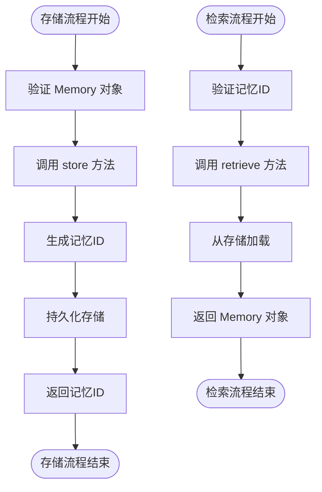

**图表来源**
- [src/core/base.py:164-219](file://src/core/base.py#L164-L219)

#### 3. 检索层抽象基类

检索层抽象基类实现了智能检索机制：

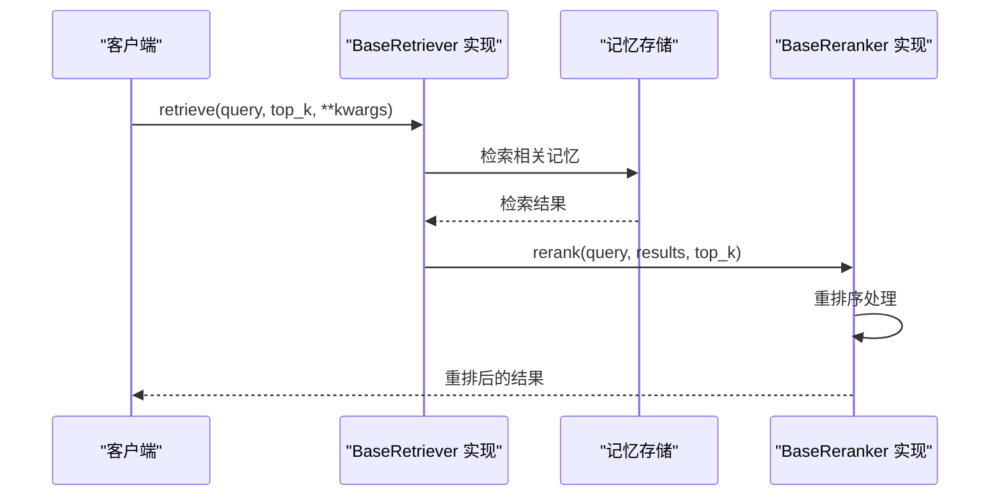

**图表来源**
- [src/core/base.py:398-444](file://src/core/base.py#L398-L444)

#### 4. LLM 抽象基类

**更新** LLM 抽象基类经过重构，消除了重复定义并增强了类型安全性：

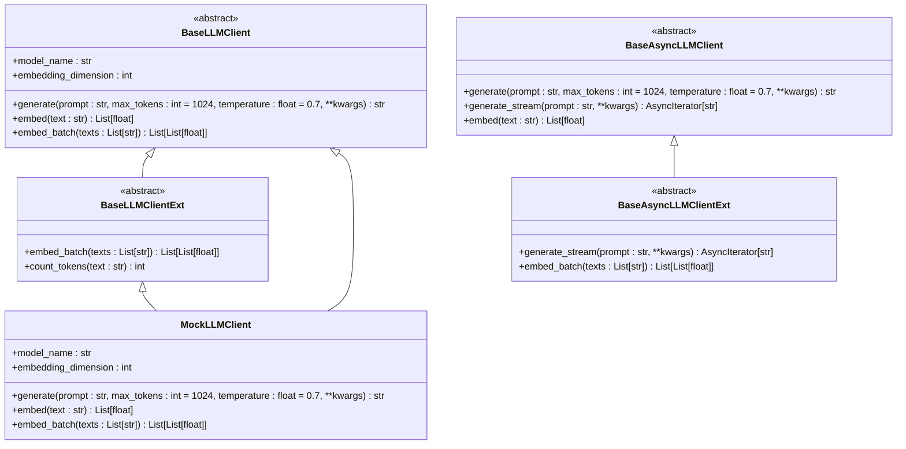

**图表来源**
- [src/core/base.py:542-633](file://src/core/base.py#L542-L633)
- [src/core/llm/base.py:16-78](file://src/core/llm/base.py#L16-L78)
- [src/core/llm/mock.py:16-200](file://src/core/llm/mock.py#L16-L200)

### 具体实现示例

#### 1. MockLLMClient 实现

MockLLMClient 是 BaseLLMClient 的具体实现，展示了抽象基类的最佳实践：

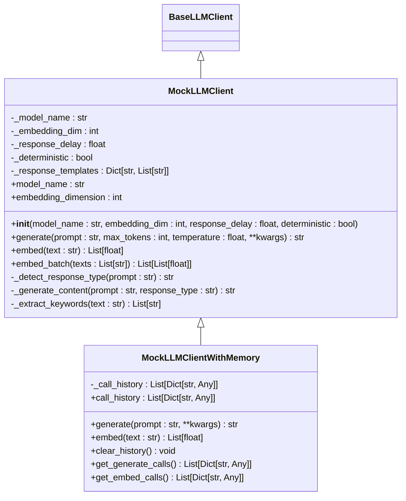

**图表来源**
- [src/core/llm/mock.py:16-313](file://src/core/llm/mock.py#L16-L313)

#### 2. 内存存储实现

**更新** InMemoryVectorStore 和 InMemoryGraphStore 展示了如何实现抽象基类，新增了更丰富的属性装饰器支持：

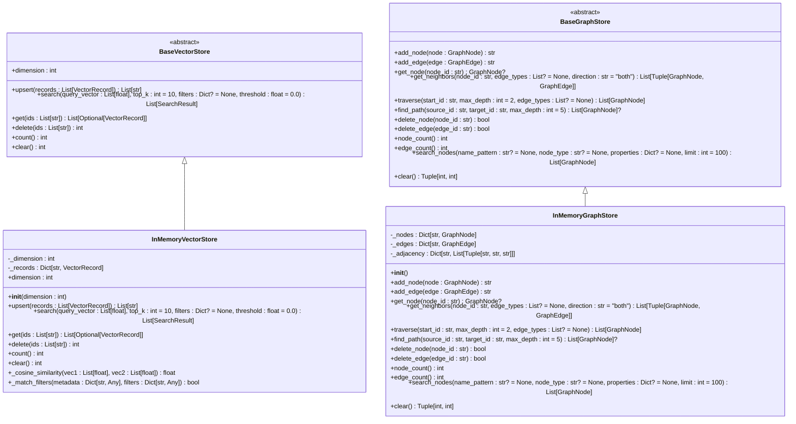

**图表来源**
- [src/memory/backends/memory_store.py:20-381](file://src/memory/backends/memory_store.py#L20-L381)
- [src/memory/backends/base.py:61-314](file://src/memory/backends/base.py#L61-L314)

#### 3. 自适应检索器

AdaptiveRetriever 展示了复杂业务逻辑的实现：


**图表来源**
- [src/retrieval/retriever.py:128-458](file://src/retrieval/retriever.py#L128-L458)

**章节来源**
- [src/core/llm/mock.py:1-313](file://src/core/llm/mock.py#L1-L313)
- [src/memory/backends/memory_store.py:1-381](file://src/memory/backends/memory_store.py#L1-L381)
- [src/retrieval/retriever.py:1-458](file://src/retrieval/retriever.py#L1-L458)

## 类型安全与抽象层改进

### TYPE_CHECKING 机制

新版本引入了更强大的 TYPE_CHECKING 类型检查机制，为实现类提供了更好的类型推断支持：

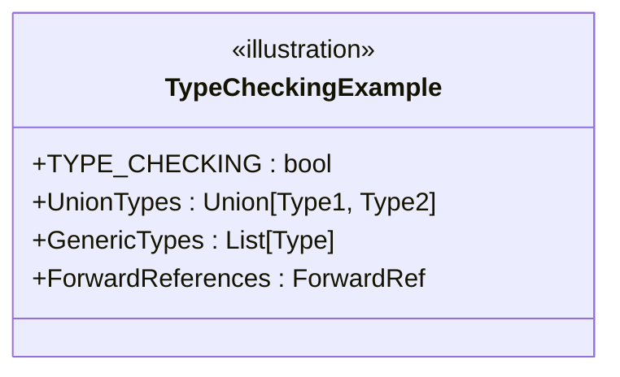

**图表来源**
- [src/core/base.py:19-27](file://src/core/base.py#L19-L27)

### 属性装饰器增强

通过属性装饰器提供了更灵活的方法签名和属性访问控制：

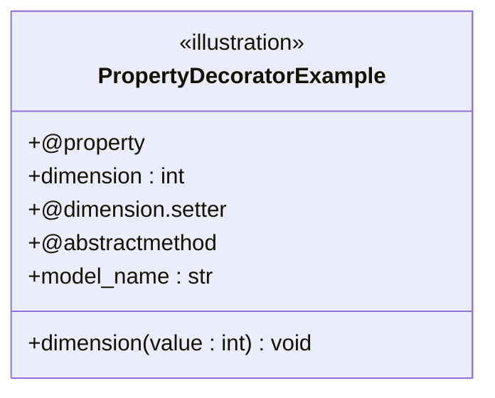

**图表来源**
- [src/core/base.py:132-142](file://src/core/base.py#L132-L142)

### LLM 客户端统一抽象

重构后的 LLM 客户端基类消除了重复定义，统一到 core.base 作为抽象来源：

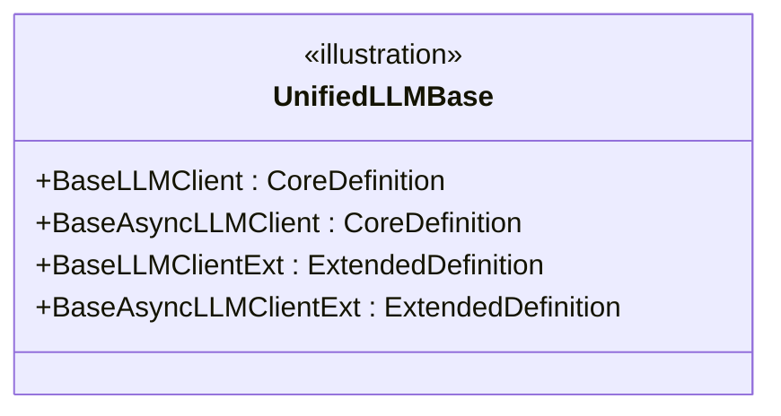

**图表来源**
- [src/core/llm/base.py:9-13](file://src/core/llm/base.py#L9-L13)

**章节来源**
- [src/core/base.py:19-27](file://src/core/base.py#L19-L27)
- [src/core/base.py:132-142](file://src/core/base.py#L132-L142)
- [src/core/llm/base.py:9-13](file://src/core/llm/base.py#L9-L13)

## 依赖分析

### 组件耦合关系

抽象基类设计通过严格的接口约束实现了模块间的松耦合：

```mermaid
graph TB
subgraph "抽象层"
BaseClasses[抽象基类]
ProtocolTypes[协议类型]
End
subgraph "实现层"
ConcreteImpl[具体实现]
MockImpl[Mock 实现]
TestImpl[Test 实现]
End
BaseClasses --> ConcreteImpl
BaseClasses --> MockImpl
BaseClasses --> TestImpl
ProtocolTypes --> BaseClasses
ProtocolTypes --> ConcreteImpl
```

**图表来源**
- [src/core/base.py:1-800](file://src/core/base.py#L1-L800)
- [src/core/protocols.py:1-298](file://src/core/protocols.py#L1-L298)

### 外部依赖管理

系统通过统一的抽象层管理外部依赖，避免了直接的耦合：

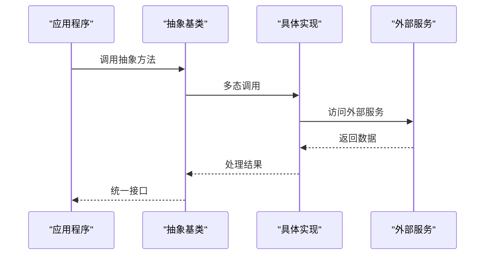

**图表来源**
- [src/core/base.py:542-633](file://src/core/base.py#L542-L633)

**章节来源**
- [src/core/base.py:1-800](file://src/core/base.py#L1-L800)
- [src/core/protocols.py:1-298](file://src/core/protocols.py#L1-L298)

## 性能考虑

### 抽象基类的性能影响

抽象基类设计在提供类型安全和接口一致性的同时，需要考虑性能开销：

1. **方法调用开销**：多态调用相比直接调用有轻微的性能损失
2. **类型检查成本**：TYPE_CHECKING 机制在运行时有额外的类型检查开销
3. **内存占用**：抽象基类增加了少量的内存占用

### 优化策略

1. **批量操作**：优先使用批量处理方法减少调用次数
2. **缓存机制**：在实现类中合理使用缓存减少重复计算
3. **延迟初始化**：按需初始化昂贵的资源
4. **异步处理**：利用异步接口提升并发性能

## 故障排除指南

### 常见问题诊断

#### 1. 抽象方法未实现

**症状**：实例化抽象类时报错
**解决方案**：确保所有抽象方法都已实现

#### 2. 类型不匹配

**症状**：类型检查器报错
**解决方案**：检查返回类型和参数类型注解

#### 3. 接口不兼容

**症状**：实现类无法替代抽象类
**解决方案**：检查方法签名和返回类型

### 调试技巧

1. **使用 isinstance 检查**：验证对象是否符合预期类型
2. **打印类型信息**：使用 type() 和 __class__.__mro__ 查看继承关系
3. **单元测试**：为抽象基类编写测试用例

**章节来源**
- [src/core/base.py:1-800](file://src/core/base.py#L1-L800)
- [src/core/protocols.py:1-298](file://src/core/protocols.py#L1-L298)

## 结论

NecoRAG 的抽象基类设计通过严格的接口约束和统一的数据协议，实现了模块间的松耦合和高度的可扩展性。新版本的改进进一步提升了系统的可维护性、扩展性和开发效率。

### 设计优势

1. **类型安全**：通过 TYPE_CHECKING 和类型注解确保类型一致性
2. **接口稳定**：抽象基类提供了稳定的接口契约
3. **易于扩展**：新的实现类可以无缝集成到现有系统中
4. **测试友好**：抽象基类便于单元测试和模拟对象的创建

### 最佳实践建议

1. **严格遵守接口契约**：实现类必须完全实现所有抽象方法
2. **保持向后兼容**：新版本应保持现有接口的兼容性
3. **提供合理的默认实现**：为可选方法提供合理的默认行为
4. **文档化接口**：为每个抽象方法提供清晰的文档说明
5. **类型注解**：使用完整的类型注解确保类型安全
6. **利用 TYPE_CHECKING**：在实现类中合理使用 TYPE_CHECKING 机制
7. **属性装饰器**：通过属性装饰器提供更好的访问控制

通过这种设计，NecoRAG 为构建复杂的认知科学驱动的智能检索增强生成系统奠定了坚实的技术基础，为未来的功能扩展和性能优化提供了充足的空间。