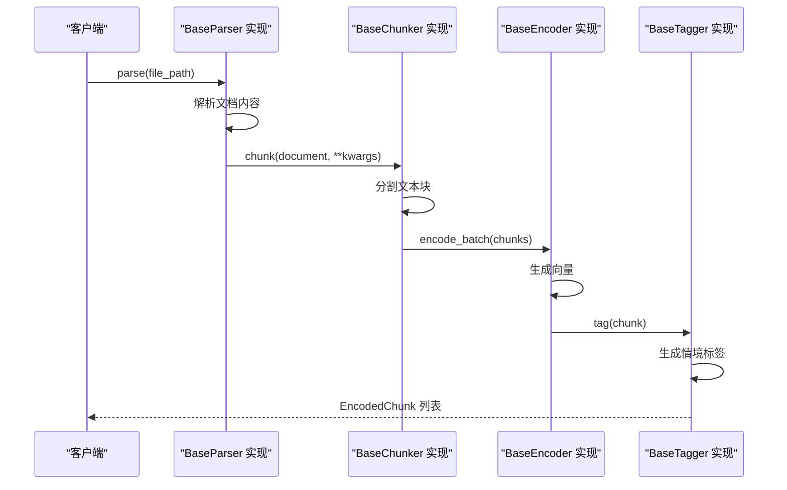
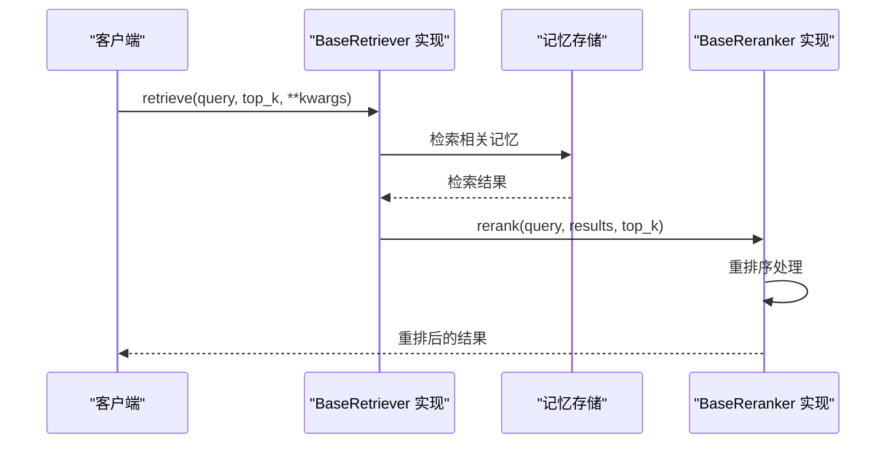
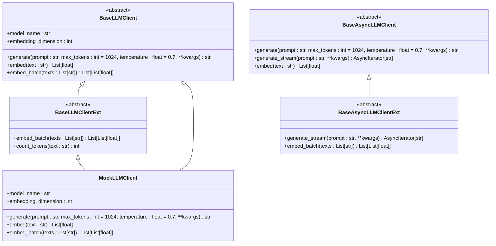
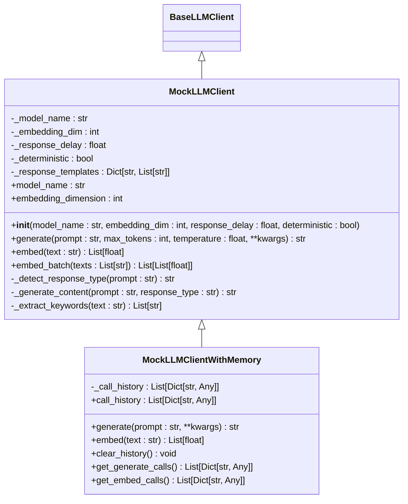
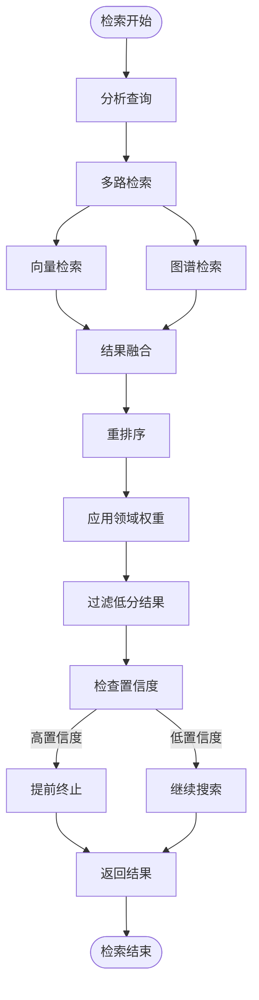
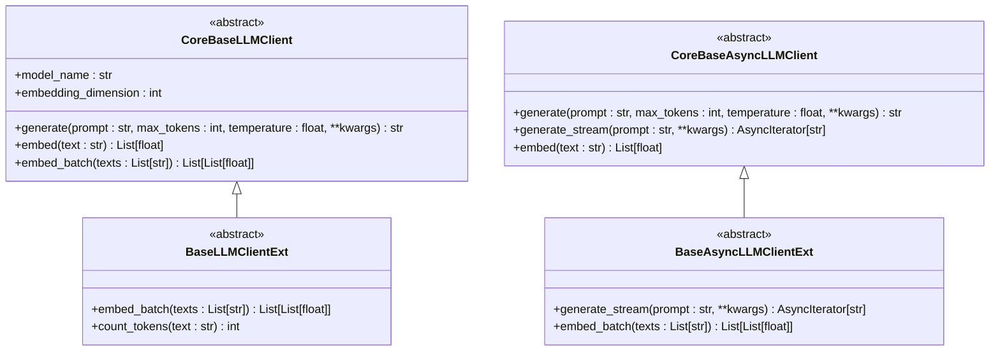
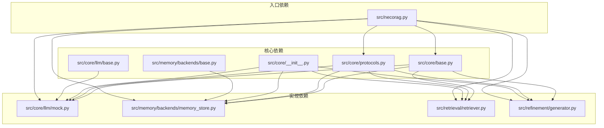

# 抽象基类设计

<cite>
**本文档引用的文件**
- [src/core/base.py](file://src/core/base.py)
- [src/core/protocols.py](file://src/core/protocols.py)
- [src/core/__init__.py](file://src/core/__init__.py)
- [src/core/llm/base.py](file://src/core/llm/base.py)
- [src/memory/backends/base.py](file://src/memory/backends/base.py)
- [src/necorag.py](file://src/necorag.py)
- [src/core/llm/mock.py](file://src/core/llm/mock.py)
- [src/memory/backends/memory_store.py](file://src/memory/backends/memory_store.py)
- [src/retrieval/retriever.py](file://src/retrieval/retriever.py)
- [src/refinement/generator.py](file://src/refinement/generator.py)
- [src/core/config.py](file://src/core/config.py)
</cite>

## 更新摘要
**变更内容**
- 更新了抽象基类的类型安全性设计，引入了更强大的 TYPE_CHECKING 和 Union 类型支持
- 增强了属性装饰器的使用，提供了更灵活的方法签名和属性访问控制
- 重构了 LLM 客户端基类，消除了重复定义，统一到 core.base 作为抽象来源
- 改进了存储后端抽象基类，提供了更具体的存储层接口
- 增强了可扩展性，支持更灵活的实现类设计

## 目录
1. [简介](#简介)
2. [项目结构](#项目结构)
3. [核心组件](#核心组件)
4. [架构概览](#架构概览)
5. [详细组件分析](#详细组件分析)
6. [类型安全与抽象层改进](#类型安全与抽象层改进)
7. [依赖分析](#依赖分析)
8. [性能考虑](#性能考虑)
9. [故障排除指南](#故障排除指南)
10. [结论](#结论)

## 简介

NecoRAG 的抽象基类设计是整个系统的核心架构支柱，它通过定义统一的接口规范和数据协议，实现了模块间的松耦合设计和高度的可扩展性。本文档深入分析了抽象基类的设计模式、继承体系和接口规范，详细解释了 Protocol 协议定义的作用、数据模型设计和类型约束机制，并展示了如何通过抽象基类实现模块间的解耦设计以及支持插件化扩展。

**更新** 本次更新反映了核心架构的重大改进：引入了更强大的 TYPE_CHECKING 类型检查机制、增强了属性装饰器的使用、重构了 LLM 客户端基类以消除重复定义，并改进了存储后端的抽象层设计。

## 项目结构

NecoRAG 采用分层架构设计，核心抽象基类位于 `src/core/` 目录下，按照功能层次组织：

```mermaid
graph TB
subgraph "核心层"
Core[core/__init__.py]
Base[base.py<br/>抽象基类定义]
Protocols[protocols.py<br/>数据协议定义]
Config[config.py<br/>配置管理]
Exceptions[exceptions.py<br/>异常定义]
LLMBase[llm/base.py<br/>LLM扩展基类]
End
subgraph "感知层"
Perception[perception/]
Parser[parser.py<br/>文档解析器]
Chunker[chunker.py<br/>文本分块器]
Encoder[encoder.py<br/>向量编码器]
Tagger[tagger.py<br/>情境标签生成器]
end
subgraph "记忆层"
Memory[memory/]
MemoryStore[backends/memory_store.py<br/>内存存储实现]
VectorStore[backends/vector_store.py<br/>向量存储实现]
GraphStore[backends/graph_store.py<br/>图存储实现]
BackendBase[backends/base.py<br/>存储后端基类]
end
subgraph "检索层"
Retrieval[retrieval/]
Retriever[retriever.py<br/>自适应检索器]
Reranker[reranker.py<br/>重排序器]
end
subgraph "巩固层"
Refinement[refinement/]
Generator[generator.py<br/>答案生成器]
Critic[critic.py<br/>批判器]
Refiner[refiner.py<br/>修正器]
Hallucination[hallucination.py<br/>幻觉检测器]
end
subgraph "响应层"
Response[response/]
ResponseAdapter[detail_adapter.py<br/>详细度适配器]
end
subgraph "意图层"
Intent[intent/]
IntentClassifier[classifier.py<br/>意图分类器]
IntentRouter[router.py<br/>意图路由器]
end
subgraph "知识演化层"
KnowledgeEvolution[knowledge_evolution/]
KnowledgeUpdater[updater.py<br/>知识更新器]
Metrics[metrics.py<br/>指标计算器]
end
Core --> Base
Core --> Protocols
Core --> Config
Core --> Exceptions
Core --> LLMBase
Perception --> Parser
Perception --> Chunker
Perception --> Encoder
Perception --> Tagger
Memory --> MemoryStore
Memory --> BackendBase
Retrieval --> Retriever
Retrieval --> Reranker
Refinement --> Generator
Refinement --> Critic
Refinement --> Refiner
Refinement --> Hallucination
Response --> ResponseAdapter
Intent --> IntentClassifier
Intent --> IntentRouter
KnowledgeEvolution --> KnowledgeUpdater
KnowledgeEvolution --> Metrics
```

**图表来源**
- [src/core/__init__.py:1-195](file://src/core/__init__.py#L1-L195)
- [src/necorag.py:1-744](file://src/necorag.py#L1-L744)

## 核心组件

### 抽象基类体系

NecoRAG 的抽象基类设计遵循面向对象设计原则，通过 ABC（Abstract Base Classes）实现严格的接口约束。**更新** 新版本引入了更强大的类型安全机制和属性装饰器支持：


**图表来源**
- [src/core/base.py:22-800](file://src/core/base.py#L22-L800)

### Protocol 协议定义

Protocol 协议定义提供了系统内统一的数据类型和协议，确保模块间数据交换的一致性：

```mermaid
classDiagram
class Document {
+doc_id : str
+content : str
+doc_type : DocumentType
+file_path : str?
+title : str?
+metadata : Dict[str, Any]
+created_at : datetime
}
class Chunk {
+chunk_id : str
+content : str
+doc_id : str?
+chunk_type : ChunkType
+position : int
+metadata : Dict[str, Any]
+start_char : int?
+end_char : int?
+prev_chunk_id : str?
+next_chunk_id : str?
}
class ContextTag {
+time_tag : str?
+emotion_tag : str?
+importance : float
+topics : List[str]
+entities : List[str]
}
class Embedding {
+embedding_id : str
+chunk_id : str
+dense_vector : List[float]
+sparse_vector : Dict[str, float]
+dimension : int
+model_name : str?
}
class EncodedChunk {
+chunk_id : str
+content : str
+dense_vector : List[float]
+sparse_vector : Dict[str, float]
+entities : List[tuple]
+context_tags : Dict[str, Any]
+metadata : Dict[str, Any]
}
class Memory {
+memory_id : str
+content : str
+layer : MemoryLayer
+vector : List[float]
+weight : float
+access_count : int
+created_at : datetime
+last_accessed : datetime
+metadata : Dict[str, Any]
}
class Entity {
+entity_id : str
+name : str
+entity_type : str
+properties : Dict[str, Any]
+created_at : datetime
}
class Relation {
+relation_id : str
+source_id : str
+target_id : str
+relation_type : str
+weight : float
+properties : Dict[str, Any]
+created_at : datetime
}
class Query {
+query_id : str
+text : str
+user_id : str?
+session_id : str?
+vector : List[float]?
+filters : Dict[str, Any]
+top_k : int
+threshold : float
+created_at : datetime
}
class RetrievalResult {
+result_id : str
+memory_id : str
+content : str
+score : float
+source : RetrievalSource
+metadata : Dict[str, Any]
+retrieval_path : List[str]
}
class GeneratedAnswer {
+answer_id : str
+content : str
+confidence : float
+evidence : List[str]
+sources : List[str]
+iteration : int
+is_refined : bool
}
class Response {
+response_id : str
+query_id : str
+content : str
+confidence : float
+sources : List[RetrievalResult]
+thinking_chain : List[Dict[str, Any]]
+tone : ResponseTone
+detail_level : DetailLevel
+citations : List[str]
+metadata : Dict[str, Any]
+created_at : datetime
}
class CritiqueResult {
+critique_id : str
+is_valid : bool
+issues : List[str]
+suggestions : List[str]
+scores : Dict[str, float]
}
class HallucinationReport {
+report_id : str
+has_hallucination : bool
+factual_score : float
+logical_score : float
+evidence_score : float
+issues : List[str]
}
class UserProfile {
+user_id : str
+name : str?
+profession : str?
+knowledge_level : str
+preferred_tone : ResponseTone
+preferred_detail : DetailLevel
+interests : List[str]
+preferred_domains : List[str]
+query_history : List[str]
+interaction_count : int
+metadata : Dict[str, Any]
+created_at : datetime
+updated_at : datetime
}
class DocumentType {
<<enumeration>>
TEXT
PDF
WORD
MARKDOWN
HTML
JSON
UNKNOWN
}
class ChunkType {
<<enumeration>>
FIXED
SEMANTIC
STRUCTURAL
ELASTIC
SENTENCE
}
class MemoryLayer {
<<enumeration>>
L1_WORKING
L2_SEMANTIC
L3_EPISODIC
}
class RetrievalSource {
<<enumeration>>
VECTOR
GRAPH
HYDE
HYBRID
}
class ResponseTone {
<<enumeration>>
PROFESSIONAL
FRIENDLY
HUMOROUS
}
class DetailLevel {
<<enumeration>>
BRIEF
STANDARD
DETAILED
COMPREHENSIVE
}
class IntentType {
<<enumeration>>
FACTUAL
COMPARATIVE
REASONING
EXPLANATION
SUMMARIZATION
PROCEDURAL
EXPLORATORY
}
```



**图表来源**
- [src/core/protocols.py:14-298](file://src/core/protocols.py#L14-L298)

**章节来源**
- [src/core/base.py:1-800](file://src/core/base.py#L1-L800)
- [src/core/protocols.py:1-298](file://src/core/protocols.py#L1-L298)

## 架构概览

NecoRAG 采用分层架构设计，通过抽象基类实现模块间的松耦合。**更新** 新版本通过统一的抽象来源和增强的类型安全机制，进一步提升了系统的可维护性和扩展性：

```mermaid
graph TB
subgraph "统一入口层"
NecoRAG[NecoRAG 主类]
end
subgraph "感知层"
Parser[BaseParser 实现]
Chunker[BaseChunker 实现]
Encoder[BaseEncoder 实现]
Tagger[BaseTagger 实现]
end
subgraph "记忆层"
MemoryStore[BaseMemoryStore 实现]
VectorStore[BaseVectorStore 实现]
GraphStore[BaseGraphStore 实现]
BackendBase[存储后端基类]
End
subgraph "检索层"
Retriever[BaseRetriever 实现]
Reranker[BaseReranker 实现]
end
subgraph "巩固层"
Generator[BaseGenerator 实现]
Critic[BaseCritic 实现]
Refiner[BaseRefiner 实现]
HallucinationDetector[BaseHallucinationDetector 实现]
end
subgraph "响应层"
ResponseAdapter[BaseResponseAdapter 实现]
end
subgraph "意图层"
IntentClassifier[BaseIntentClassifier 实现]
IntentRouter[BaseIntentRouter 实现]
end
subgraph "知识演化层"
KnowledgeUpdater[BaseKnowledgeUpdater 实现]
MetricsCalculator[BaseMetricsCalculator 实现]
end
NecoRAG --> Parser
NecoRAG --> Chunker
NecoRAG --> Encoder
NecoRAG --> Tagger
Parser --> MemoryStore
Chunker --> MemoryStore
Encoder --> MemoryStore
Tagger --> MemoryStore
MemoryStore --> Retriever
VectorStore --> Retriever
GraphStore --> Retriever
Retriever --> Reranker
Reranker --> Generator
Generator --> Critic
Critic --> Refiner
Refiner --> HallucinationDetector
Generator --> ResponseAdapter
Critic --> ResponseAdapter
Refiner --> ResponseAdapter
NecoRAG --> IntentClassifier
IntentClassifier --> IntentRouter
IntentRouter --> Retriever
NecoRAG --> KnowledgeUpdater
KnowledgeUpdater --> MetricsCalculator
```

**图表来源**
- [src/necorag.py:37-744](file://src/necorag.py#L37-L744)
- [src/core/base.py:22-800](file://src/core/base.py#L22-L800)

## 详细组件分析

### 抽象基类实现模式

#### 1. 感知层抽象基类

感知层抽象基类定义了文档处理的标准接口：



**图表来源**
- [src/core/base.py:32-160](file://src/core/base.py#L32-L160)

#### 2. 记忆层抽象基类

记忆层抽象基类提供了统一的记忆存储接口：


**图表来源**
- [src/core/base.py:164-219](file://src/core/base.py#L164-L219)

#### 3. 检索层抽象基类

检索层抽象基类实现了智能检索机制：



**图表来源**
- [src/core/base.py:398-444](file://src/core/base.py#L398-L444)

#### 4. LLM 抽象基类

**更新** LLM 抽象基类经过重构，消除了重复定义并增强了类型安全性：



**图表来源**
- [src/core/base.py:542-633](file://src/core/base.py#L542-L633)
- [src/core/llm/base.py:16-78](file://src/core/llm/base.py#L16-L78)
- [src/core/llm/mock.py:16-200](file://src/core/llm/mock.py#L16-L200)

### 具体实现示例

#### 1. MockLLMClient 实现

MockLLMClient 是 BaseLLMClient 的具体实现，展示了抽象基类的最佳实践：



**图表来源**
- [src/core/llm/mock.py:16-313](file://src/core/llm/mock.py#L16-L313)

#### 2. 内存存储实现

**更新** InMemoryVectorStore 和 InMemoryGraphStore 展示了如何实现抽象基类，新增了更丰富的属性装饰器支持：


**图表来源**
- [src/memory/backends/memory_store.py:20-381](file://src/memory/backends/memory_store.py#L20-L381)
- [src/memory/backends/base.py:61-314](file://src/memory/backends/base.py#L61-L314)

#### 3. 自适应检索器

AdaptiveRetriever 展示了复杂业务逻辑的实现：



**图表来源**
- [src/retrieval/retriever.py:128-458](file://src/retrieval/retriever.py#L128-L458)

**章节来源**
- [src/core/llm/mock.py:1-313](file://src/core/llm/mock.py#L1-L313)
- [src/memory/backends/memory_store.py:1-381](file://src/memory/backends/memory_store.py#L1-L381)
- [src/retrieval/retriever.py:1-458](file://src/retrieval/retriever.py#L1-L458)

## 类型安全与抽象层改进

### TYPE_CHECKING 类型检查机制

**新增** 新版本引入了强大的 TYPE_CHECKING 机制，支持实现类使用不同的数据类型：

```python
# 仅在类型检查时导入，避免运行时开销
from typing import TYPE_CHECKING, Union
if TYPE_CHECKING:
    from src.refinement.models import (
        GeneratedAnswer as RefinementGeneratedAnswer,
        CritiqueReport,
        HallucinationReport as RefinementHallucinationReport,
    )
    from src.intent.models import IntentResult, IntentRoutingStrategy
```

### 属性装饰器增强

**新增** 抽象基类现在广泛使用属性装饰器，提供更灵活的访问控制：

```python
@property
@abstractmethod
def dimension(self) -> int:
    """返回向量维度"""
    pass

@property
@abstractmethod
def model_name(self) -> str:
    """返回模型名称"""
    pass

@property
def chunk_size(self) -> int:
    """返回分块大小（子类可覆盖）"""
    return getattr(self, '_chunk_size', 512)

@chunk_size.setter
def chunk_size(self, value: int) -> None:
    """设置分块大小"""
    self._chunk_size = value
```

### 更灵活的方法签名

**新增** 抽象基类支持更灵活的方法签名，包括可选参数和默认值：

```python
def search(
    self,
    query_vector: List[float],
    top_k: int = 10,
    filters: Optional[Dict[str, Any]] = None,
    threshold: float = 0.0
) -> List[SearchResult]:
    """
    向量相似度搜索
    
    Args:
        query_vector: 查询向量
        top_k: 返回数量
        filters: 元数据过滤条件
        threshold: 最小相似度阈值
        
    Returns:
        List[SearchResult]: 搜索结果列表（按相似度降序）
    """
    pass
```

### 统一的抽象来源

**新增** LLM 客户端基类重构，消除了重复定义：



**图表来源**
- [src/core/base.py:542-633](file://src/core/base.py#L542-L633)
- [src/core/llm/base.py:16-78](file://src/core/llm/base.py#L16-L78)

**章节来源**
- [src/core/base.py:18-200](file://src/core/base.py#L18-L200)
- [src/core/llm/base.py:1-122](file://src/core/llm/base.py#L1-L122)

## 依赖分析

### 组件耦合关系

**更新** 新版本通过统一的抽象来源减少了组件间的耦合：



**图表来源**
- [src/core/base.py:1-800](file://src/core/base.py#L1-L800)
- [src/core/protocols.py:1-298](file://src/core/protocols.py#L1-L298)
- [src/core/__init__.py:1-195](file://src/core/__init__.py#L1-L195)
- [src/necorag.py:1-744](file://src/necorag.py#L1-L744)

### 设计模式应用

NecoRAG 抽象基类设计体现了多种设计模式：

1. **策略模式**: 通过抽象基类定义不同算法的统一接口
2. **工厂模式**: 通过工厂方法创建不同类型的实现
3. **观察者模式**: 通过回调机制实现组件间通信
4. **模板方法模式**: 通过抽象基类定义算法骨架
5. ****新增** 统一抽象模式**: 通过单一抽象来源消除重复定义

**章节来源**
- [src/core/base.py:1-800](file://src/core/base.py#L1-L800)
- [src/core/__init__.py:1-195](file://src/core/__init__.py#L1-L195)

## 性能考虑

### 抽象基类的性能影响

**更新** 新版本通过 TYPE_CHECKING 机制优化了性能：

1. **延迟导入优化**: TYPE_CHECKING 中的导入仅在类型检查时执行，避免运行时开销
2. **属性装饰器开销**: 属性装饰器相比直接属性访问有轻微开销，但提供了更好的封装性
3. **方法调用开销**: 抽象方法调用比直接方法调用稍慢
4. **类型检查开销**: 运行时类型检查会增加执行时间

### 优化策略

1. **延迟初始化**: NecoRAG 使用延迟初始化减少启动时间
2. **缓存机制**: 实现类可以使用缓存减少重复计算
3. **批处理优化**: 支持批量操作减少网络往返
4. **异步处理**: 提供异步接口支持并发处理
5. ****新增** 类型检查优化**: TYPE_CHECKING 机制避免了不必要的运行时导入

**章节来源**
- [src/necorag.py:102-122](file://src/necorag.py#L102-L122)
- [src/core/base.py:18-28](file://src/core/base.py#L18-L28)

## 故障排除指南

### 常见问题及解决方案

#### 1. 抽象方法未实现错误

当子类未完全实现抽象基类的方法时，会抛出 `TypeError`：

```python
# 错误示例
class MyParser(BaseParser):
    def parse(self, file_path: str) -> Document:
        # 只实现了部分方法
        pass
    # 缺少 parse_content 方法实现

# 正确做法
class MyParser(BaseParser):
    def parse(self, file_path: str) -> Document:
        # 实现所有抽象方法
        pass
    
    def parse_content(self, content: str, doc_type: str = "text") -> Document:
        # 实现所有抽象方法
        pass
```

#### 2. 类型不匹配错误

**更新** 新版本通过 TYPE_CHECKING 提供了更好的类型检查：

```python
# 错误示例
class MyVectorStore(BaseVectorStore):
    def upsert(self, embeddings: List[Embedding]) -> List[str]:
        # 返回类型不正确
        return embeddings  # 应该返回 List[str]

# 正确做法
class MyVectorStore(BaseVectorStore):
    def upsert(self, embeddings: List[Embedding]) -> List[str]:
        # 正确实现
        ids = []
        for embedding in embeddings:
            # 处理嵌入向量
            ids.append(str(uuid.uuid4()))
        return ids
```

#### 3. 配置错误

确保配置类正确继承 BaseConfig：

```python
@dataclass
class MyConfig(BaseConfig):
    my_setting: str = "default_value"
    
    def __post_init__(self):
        # 配置验证逻辑
        if not self.my_setting:
            raise ValueError("my_setting cannot be empty")
```

#### 4. **新增** TYPE_CHECKING 导入错误

**更新** 新版本中 TYPE_CHECKING 的使用需要注意：

```python
# 错误示例
from typing import TYPE_CHECKING
if TYPE_CHECKING:
    from some_module import SomeClass  # 这会在运行时导入

# 正确做法
from typing import TYPE_CHECKING
if TYPE_CHECKING:
    from some_module import SomeClass  # 仅在类型检查时导入
```

**章节来源**
- [src/core/base.py:1-800](file://src/core/base.py#L1-L800)
- [src/core/config.py:45-77](file://src/core/config.py#L45-L77)

## 结论

NecoRAG 的抽象基类设计展现了优秀的软件架构实践，通过精心设计的接口规范和数据协议，实现了模块间的松耦合和高度的可扩展性。**更新** 本次重大改进引入了更强大的 TYPE_CHECKING 类型检查机制、增强了属性装饰器的使用、重构了 LLM 客户端基类以消除重复定义，并改进了存储后端的抽象层设计。

### 设计优势

1. **接口一致性**: 统一的接口定义确保了模块间的互操作性
2. **类型安全**: 严格的类型约束防止了运行时错误，TYPE_CHECKING 机制提供了更好的开发体验
3. **扩展性**: 抽象基类为新功能的添加提供了清晰的路径
4. **测试友好**: 明确的接口定义便于单元测试和集成测试
5. **维护性**: 清晰的职责分离降低了代码维护成本
6. ****新增** 统一抽象**: 通过单一抽象来源消除了重复定义，提高了代码质量
7. ****新增** 灵活类型**: 支持不同实现类使用不同的数据类型，增强了灵活性

### 最佳实践建议

1. **严格遵守接口契约**: 实现类必须完全实现所有抽象方法
2. **保持向后兼容**: 新版本应保持现有接口的兼容性
3. **提供合理的默认实现**: 为可选方法提供合理的默认行为
4. **文档化接口**: 为每个抽象方法提供清晰的文档说明
5. **类型注解**: 使用完整的类型注解确保类型安全
6. ****新增** 利用 TYPE_CHECKING**: 在实现类中合理使用 TYPE_CHECKING 机制
7. ****新增** 属性装饰器**: 通过属性装饰器提供更好的访问控制

通过这种设计，NecoRAG 为构建复杂的认知科学驱动的智能检索增强生成系统奠定了坚实的技术基础，为未来的功能扩展和性能优化提供了充足的空间。新版本的改进进一步提升了系统的可维护性、扩展性和开发效率。