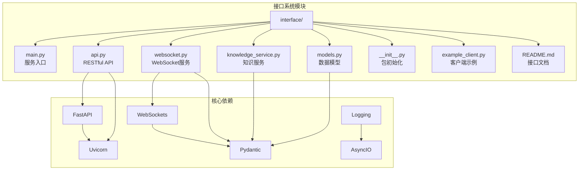
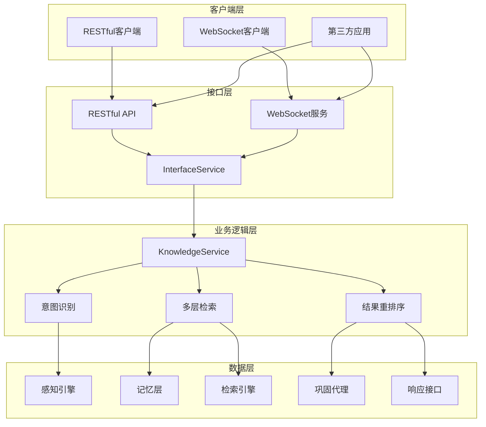
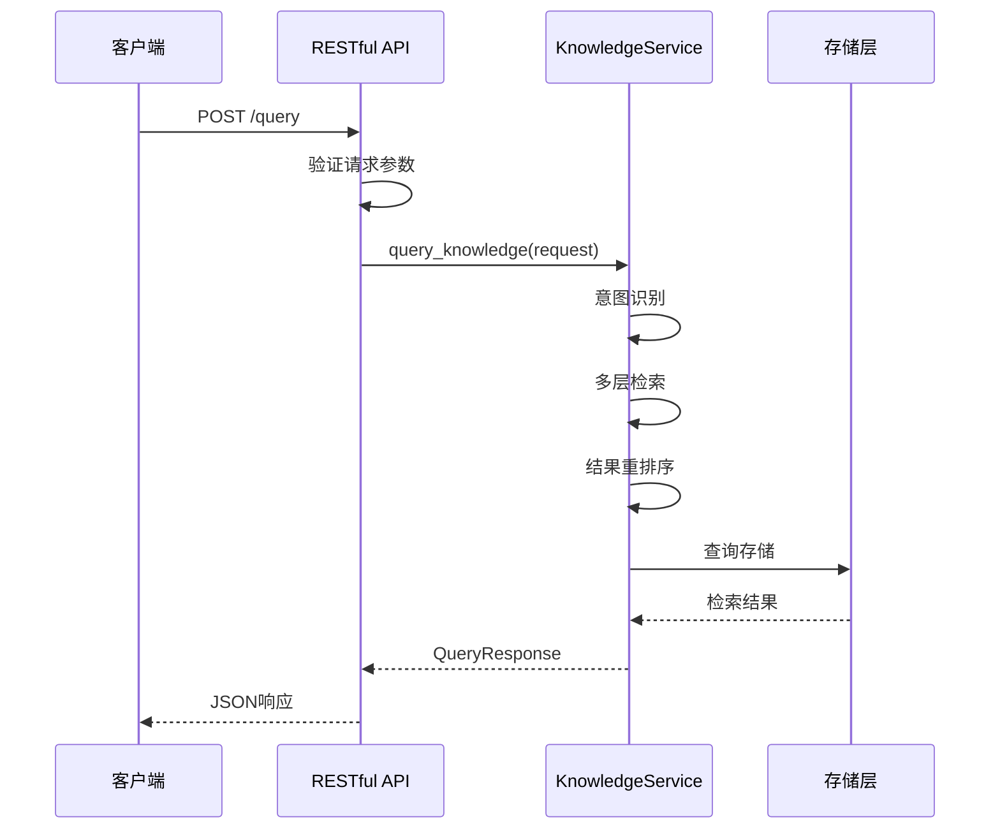
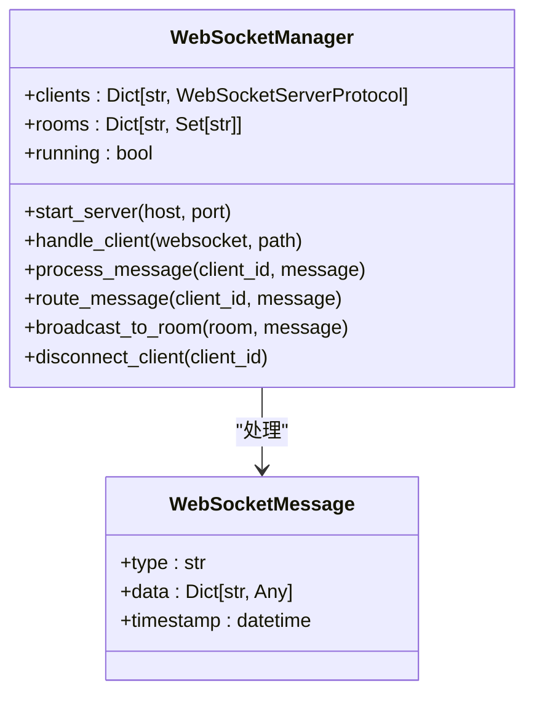
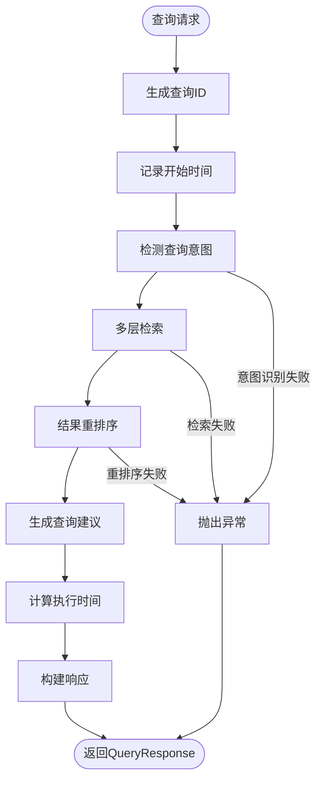
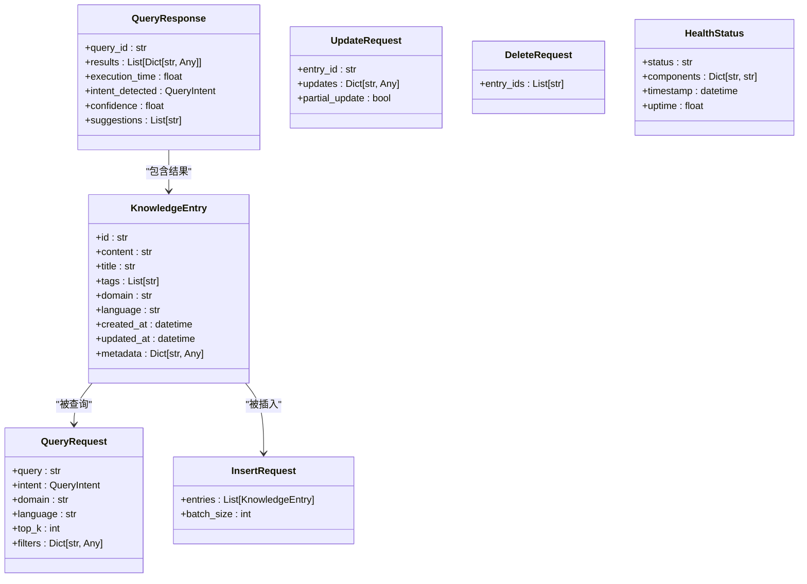
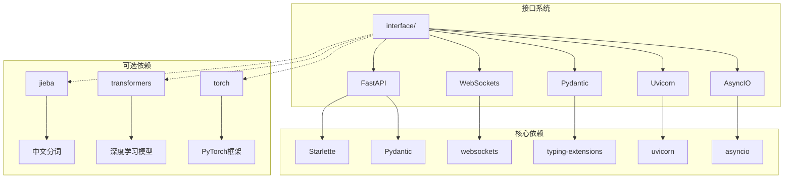

# 接口系统

<cite>
**本文档引用的文件**
- [interface/main.py](file://interface/main.py)
- [interface/api.py](file://interface/api.py)
- [interface/models.py](file://interface/models.py)
- [interface/knowledge_service.py](file://interface/knowledge_service.py)
- [interface/websocket.py](file://interface/websocket.py)
- [interface/example_client.py](file://interface/example_client.py)
- [interface/README.md](file://interface/README.md)
- [requirements.txt](file://requirements.txt)
- [pyproject.toml](file://pyproject.toml)
- [src/necorag.py](file://src/necorag.py)
</cite>

## 目录
1. [简介](#简介)
2. [项目结构](#项目结构)
3. [核心组件](#核心组件)
4. [架构概览](#架构概览)
5. [详细组件分析](#详细组件分析)
6. [依赖关系分析](#依赖关系分析)
7. [性能考虑](#性能考虑)
8. [故障排除指南](#故障排除指南)
9. [结论](#结论)

## 简介

接口系统是NecoRAG知识库的核心对外服务层，提供了完整的RESTful API和WebSocket双通道接口，支持知识库的查询、插入、更新、删除等核心操作。该系统采用模块化设计，将复杂的知识检索和管理功能封装为简洁易用的接口，为上层应用和客户端提供统一的访问入口。

接口系统的主要特点包括：
- **双协议支持**：同时提供RESTful API和WebSocket两种通信协议
- **多层架构**：基于认知科学理论的多层知识处理架构
- **实时响应**：支持实时状态推送和双向通信
- **完整功能**：涵盖知识库的所有核心操作
- **易于集成**：提供标准化的数据模型和接口规范

## 项目结构

接口系统位于`interface`目录下，采用清晰的模块化组织结构：



**图表来源**
- [interface/main.py:1-82](file://interface/main.py#L1-L82)
- [interface/api.py:1-162](file://interface/api.py#L1-L162)
- [interface/websocket.py:1-299](file://interface/websocket.py#L1-L299)

**章节来源**
- [interface/main.py:1-82](file://interface/main.py#L1-L82)
- [interface/README.md:1-392](file://interface/README.md#L1-L392)

## 核心组件

接口系统由五个核心组件构成，每个组件都有明确的职责分工：

### 1. 服务管理器 (InterfaceService)
负责协调和管理整个接口系统的生命周期，包括RESTful API和WebSocket服务的启动、停止和协调。

### 2. RESTful API服务 (FastAPI)
提供标准的HTTP接口，支持JSON格式的数据交换，具备自动API文档生成功能。

### 3. WebSocket服务
提供实时双向通信能力，支持消息推送、订阅机制和状态同步。

### 4. 知识服务 (KnowledgeService)
作为业务逻辑的核心，封装了知识库的所有操作逻辑，包括查询、插入、更新、删除等。

### 5. 数据模型 (Pydantic Models)
定义了所有接口使用的数据结构，确保数据传输的一致性和完整性。

**章节来源**
- [interface/main.py:14-73](file://interface/main.py#L14-L73)
- [interface/api.py:19-152](file://interface/api.py#L19-L152)
- [interface/websocket.py:18-294](file://interface/websocket.py#L18-L294)
- [interface/knowledge_service.py:27-307](file://interface/knowledge_service.py#L27-L307)

## 架构概览

接口系统采用分层架构设计，将复杂的知识处理流程抽象为简洁的接口层：



**图表来源**
- [interface/main.py:30-58](file://interface/main.py#L30-L58)
- [interface/knowledge_service.py:45-72](file://interface/knowledge_service.py#L45-L72)

该架构的优势在于：
- **解耦设计**：各层之间职责明确，便于维护和扩展
- **异步处理**：充分利用Python的异步特性提升并发性能
- **协议独立**：RESTful和WebSocket可以独立演进
- **可扩展性**：新增功能只需在对应层级添加实现

## 详细组件分析

### RESTful API服务

RESTful API服务基于FastAPI框架构建，提供了完整的HTTP接口：

#### 主要接口功能

| 接口 | 方法 | 描述 | 返回类型 |
|------|------|------|----------|
| `/` | GET | 服务信息 | JSON |
| `/health` | GET | 健康检查 | HealthStatus |
| `/query` | POST | 知识查询 | QueryResponse |
| `/insert` | POST | 知识插入 | JSON |
| `/update` | PUT | 知识更新 | JSON |
| `/delete` | DELETE | 知识删除 | JSON |
| `/stats` | GET | 统计信息 | JSON |
| `/suggestions/{query}` | GET | 查询建议 | JSON |

#### API设计特点



**图表来源**
- [interface/api.py:73-84](file://interface/api.py#L73-L84)
- [interface/knowledge_service.py:45-72](file://interface/knowledge_service.py#L45-L72)

**章节来源**
- [interface/api.py:19-152](file://interface/api.py#L19-L152)

### WebSocket服务

WebSocket服务提供了实时双向通信能力，支持多种消息类型：

#### 消息类型定义

| 类型 | 说明 | 数据格式 | 用途 |
|------|------|----------|------|
| `query` | 知识查询 | QueryRequest | 实时查询 |
| `insert` | 知识插入 | InsertRequest | 实时插入 |
| `update` | 知识更新 | UpdateRequest | 实时更新 |
| `delete` | 知识删除 | DeleteRequest | 实时删除 |
| `subscribe` | 订阅房间 | {"room": "name"} | 订阅通知 |
| `unsubscribe` | 取消订阅 | {"room": "name"} | 取消订阅 |
| `ping` | 心跳检测 | 任意数据 | 连接保持 |

#### 连接管理机制



**图表来源**
- [interface/websocket.py:18-294](file://interface/websocket.py#L18-L294)

**章节来源**
- [interface/websocket.py:18-294](file://interface/websocket.py#L18-L294)

### 知识服务核心

知识服务是接口系统的核心业务逻辑层，封装了完整的知识库操作流程：

#### 查询处理流程



**图表来源**
- [interface/knowledge_service.py:45-72](file://interface/knowledge_service.py#L45-L72)

#### 数据操作流程

知识服务支持四种主要的数据操作，每种操作都遵循相似的处理模式：

1. **插入操作**：数据预处理 → 多层存储 → 知识巩固触发
2. **更新操作**：存在性验证 → 数据应用 → 记忆层更新 → 相关性传播
3. **删除操作**：存在性验证 → 记忆层删除 → 关系清理
4. **统计查询**：多源数据聚合 → 统计计算 → 结果返回

**章节来源**
- [interface/knowledge_service.py:78-185](file://interface/knowledge_service.py#L78-L185)

### 数据模型设计

接口系统使用Pydantic定义了完整的数据模型体系：

#### 核心数据模型



**图表来源**
- [interface/models.py:22-85](file://interface/models.py#L22-L85)

**章节来源**
- [interface/models.py:11-85](file://interface/models.py#L11-L85)

## 依赖关系分析

接口系统的依赖关系相对简单，主要依赖于几个核心库：



**图表来源**
- [requirements.txt:1-71](file://requirements.txt#L1-L71)
- [pyproject.toml:27-63](file://pyproject.toml#L27-L63)

### 核心依赖说明

| 依赖包 | 版本要求 | 用途 | 必需性 |
|--------|----------|------|--------|
| FastAPI | >=0.109.0 | Web框架 | 必需 |
| Uvicorn | >=0.27.0 | ASGI服务器 | 必需 |
| Pydantic | >=2.5.0 | 数据验证 | 必需 |
| WebSockets | - | WebSocket支持 | 必需 |
| Requests | >=2.31.0 | HTTP客户端 | 可选 |
| Jieba | >=0.42.1 | 中文分词 | 可选 |

**章节来源**
- [requirements.txt:1-71](file://requirements.txt#L1-L71)
- [pyproject.toml:27-63](file://pyproject.toml#L27-L63)

## 性能考虑

接口系统在设计时充分考虑了性能优化：

### 并发处理
- **异步架构**：全面采用async/await模式提升并发处理能力
- **事件循环**：利用Python的事件循环机制处理大量并发连接
- **非阻塞I/O**：避免阻塞操作影响整体性能

### 缓存策略
- **内存缓存**：对热点数据进行内存缓存
- **连接池**：数据库连接和外部服务连接复用
- **结果缓存**：对频繁查询的结果进行缓存

### 资源管理
- **连接管理**：WebSocket连接的生命周期管理
- **内存控制**：大数据集处理时的内存使用控制
- **超时设置**：合理的超时配置防止资源泄露

## 故障排除指南

### 常见问题及解决方案

#### 1. 服务启动失败
**症状**：接口服务无法正常启动
**可能原因**：
- 端口被占用（8000或8001）
- 依赖包安装不完整
- 配置文件错误

**解决方法**：
```bash
# 检查端口占用
netstat -tulpn | grep :8000
netstat -tulpn | grep :8001

# 重新安装依赖
pip install -r requirements.txt

# 检查Python版本
python --version
```

#### 2. WebSocket连接失败
**症状**：WebSocket客户端无法连接
**可能原因**：
- 服务器未正确启动
- 网络防火墙阻止
- 客户端URL错误

**解决方法**：
```python
# 检查服务状态
curl http://localhost:8000/health

# 测试WebSocket连接
python -c "
import asyncio
import websockets
async def test():
    uri = 'ws://localhost:8001'
    async with websockets.connect(uri) as websocket:
        print('连接成功')
test()
"
```

#### 3. API请求超时
**症状**：RESTful API响应缓慢
**可能原因**：
- 后端处理逻辑复杂
- 外部服务响应慢
- 数据库查询性能问题

**解决方法**：
```python
# 检查健康状态
curl http://localhost:8000/health

# 获取详细统计信息
curl http://localhost:8000/stats

# 调整查询参数
curl -X POST http://localhost:8000/query \
  -H "Content-Type: application/json" \
  -d '{
    "query": "查询内容",
    "top_k": 3,
    "timeout": 5
  }'
```

### 日志分析

接口系统提供了详细的日志记录功能，有助于问题诊断：

#### 日志级别
- **INFO**：服务启动、停止、健康检查
- **ERROR**：异常处理、错误信息
- **DEBUG**：详细的操作流程信息

#### 日志位置
- 控制台输出（默认）
- 文件日志（可配置）

**章节来源**
- [interface/main.py:23-28](file://interface/main.py#L23-L28)
- [interface/api.py:49-71](file://interface/api.py#L49-L71)

## 结论

接口系统作为NecoRAG知识库的统一对外入口，成功实现了以下目标：

### 设计优势
- **模块化设计**：清晰的职责分离和良好的可扩展性
- **双协议支持**：满足不同场景下的通信需求
- **异步架构**：充分利用现代Python的异步特性
- **标准化接口**：提供一致的API体验

### 技术特色
- **认知科学理论**：基于多层次记忆架构的设计理念
- **意图识别**：智能化的查询理解和处理
- **实时通信**：WebSocket提供的双向实时能力
- **完整生态**：从数据模型到业务逻辑的完整实现

### 发展方向
- **性能优化**：进一步提升高并发场景下的处理能力
- **功能扩展**：增加更多高级查询和分析功能
- **集成增强**：更好的第三方系统集成能力
- **监控完善**：更丰富的性能监控和告警机制

接口系统为NecoRAG的整体架构奠定了坚实的基础，通过提供稳定可靠的对外接口，使得整个知识库系统能够更好地服务于各种应用场景。