# 插件扩展框架

<cite>
**本文档引用的文件**
- [src/plugins/__init__.py](file://src/plugins/__init__.py)
- [src/plugins/base.py](file://src/plugins/base.py)
- [src/plugins/manager.py](file://src/plugins/manager.py)
- [src/plugins/registry.py](file://src/plugins/registry.py)
- [src/plugins/example_plugins.py](file://src/plugins/example_plugins.py)
- [src/plugins/README.md](file://src/plugins/README.md)
- [design/architecture_framework.md](file://design/architecture_framework.md)
- [src/necorag.py](file://src/necorag.py)
- [interface/main.py](file://interface/main.py)
</cite>

## 目录
1. [简介](#简介)
2. [项目结构](#项目结构)
3. [核心组件](#核心组件)
4. [架构概览](#架构概览)
5. [详细组件分析](#详细组件分析)
6. [依赖关系分析](#依赖关系分析)
7. [性能考虑](#性能考虑)
8. [故障排除指南](#故障排除指南)
9. [结论](#结论)

## 简介

NecoRAG插件扩展框架是一个高度模块化的架构设计，为神经认知检索增强生成系统提供了强大的可扩展性。该框架支持动态加载和管理各种功能插件，包括感知层、记忆层、检索层、巩固层和响应层插件。

插件系统采用分层架构设计，通过统一的插件基类和接口定义，实现了不同类型插件的功能抽象。每个插件都具有独立的生命周期管理、配置管理和依赖关系处理能力。

## 项目结构

插件扩展框架位于`src/plugins/`目录下，包含以下核心文件：

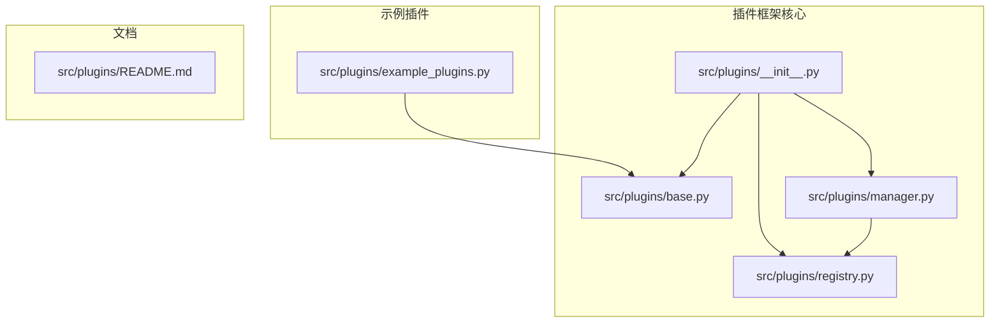

**图表来源**
- [src/plugins/__init__.py:1-18](file://src/plugins/__init__.py#L1-L18)
- [src/plugins/base.py:1-263](file://src/plugins/base.py#L1-L263)
- [src/plugins/registry.py:1-257](file://src/plugins/registry.py#L1-L257)
- [src/plugins/manager.py:1-286](file://src/plugins/manager.py#L1-L286)

**章节来源**
- [src/plugins/__init__.py:1-18](file://src/plugins/__init__.py#L1-L18)
- [src/plugins/README.md:1-239](file://src/plugins/README.md#L1-L239)

## 核心组件

### 插件类型系统

插件系统定义了五种核心插件类型，每种类型对应认知架构的不同层次：

| 插件类型 | 描述 | 对应层次 | 典型功能 |
|---------|------|----------|----------|
| PerceptionPlugin | 感知层插件 | 第一层 | 文本预处理、数据编码、格式转换 |
| MemoryPlugin | 记忆层插件 | 第二层 | 数据存储、缓存管理、记忆持久化 |
| RetrievalPlugin | 检索层插件 | 第三层 | 搜索算法、索引管理、结果排序 |
| RefinementPlugin | 巩固层插件 | 第四层 | 数据验证、质量控制、答案优化 |
| ResponsePlugin | 响应层插件 | 第五层 | 输出格式化、结果呈现、用户体验 |

### 插件生命周期管理

每个插件都遵循统一的生命周期管理流程：

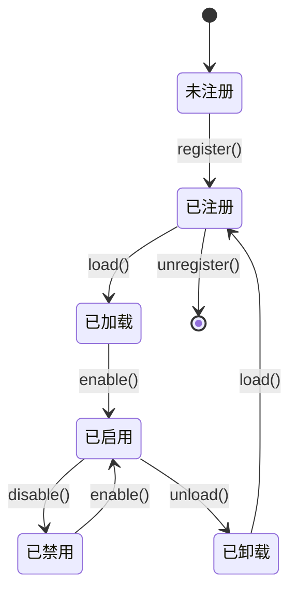

**图表来源**
- [src/plugins/base.py:46-131](file://src/plugins/base.py#L46-L131)
- [src/plugins/registry.py:70-121](file://src/plugins/registry.py#L70-L121)

**章节来源**
- [src/plugins/base.py:12-263](file://src/plugins/base.py#L12-L263)
- [src/plugins/registry.py:15-257](file://src/plugins/registry.py#L15-L257)

## 架构概览

插件扩展框架在整个NecoRAG系统中扮演着关键角色，与五层认知架构紧密集成：

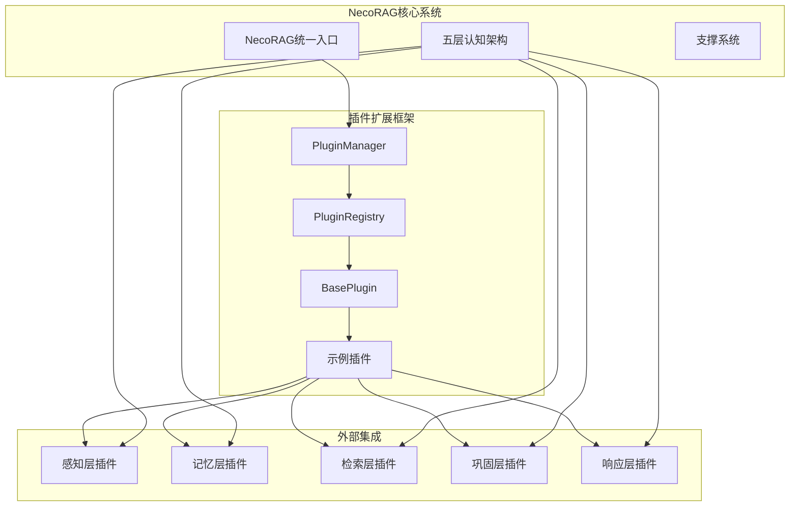

**图表来源**
- [design/architecture_framework.md:26-81](file://design/architecture_framework.md#L26-L81)
- [src/plugins/manager.py:14-286](file://src/plugins/manager.py#L14-L286)
- [src/plugins/registry.py:15-257](file://src/plugins/registry.py#L15-L257)

### 插件发现机制

插件系统支持自动发现和注册机制：

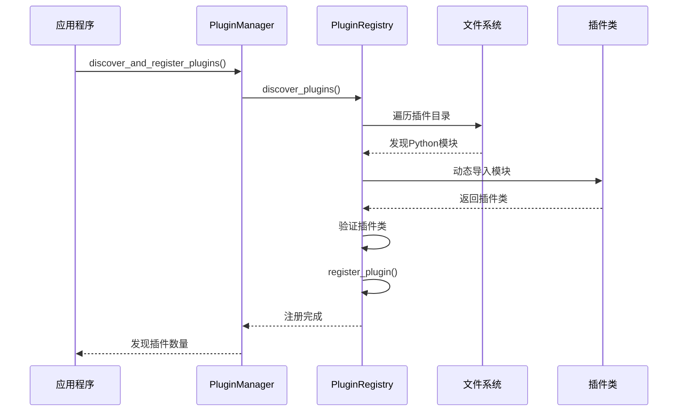

**图表来源**
- [src/plugins/manager.py:165-179](file://src/plugins/manager.py#L165-L179)
- [src/plugins/registry.py:168-224](file://src/plugins/registry.py#L168-L224)

**章节来源**
- [src/plugins/manager.py:165-286](file://src/plugins/manager.py#L165-L286)
- [src/plugins/registry.py:168-257](file://src/plugins/registry.py#L168-L257)

## 详细组件分析

### BasePlugin基类

BasePlugin是所有插件的抽象基类，定义了插件的基本接口和生命周期管理：

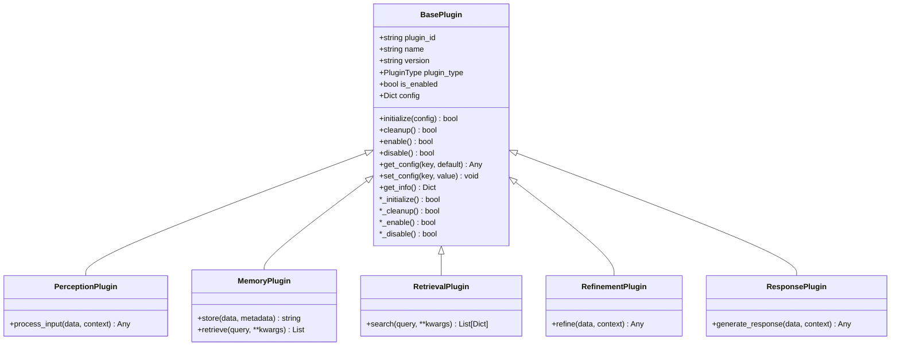

**图表来源**
- [src/plugins/base.py:22-263](file://src/plugins/base.py#L22-L263)

#### 插件配置管理系统

插件系统提供了灵活的配置管理机制：

| 配置类型 | 用途 | 默认值 | 示例 |
|---------|------|--------|------|
| normalize_case | 文本预处理 | True | 控制是否转换为小写 |
| remove_extra_spaces | 文本清理 | True | 移除多余空白字符 |
| required_fields | 数据验证 | [] | 指定必需字段列表 |
| min_quality | 质量阈值 | 0.5 | 设置数据质量最低标准 |
| format | 输出格式 | "text" | "json"、"markdown"、"text" |

**章节来源**
- [src/plugins/base.py:133-151](file://src/plugins/base.py#L133-L151)
- [src/plugins/example_plugins.py:40-57](file://src/plugins/example_plugins.py#L40-L57)

### PluginManager管理器

PluginManager是插件系统的核心协调者，负责插件的生命周期管理和依赖关系处理：

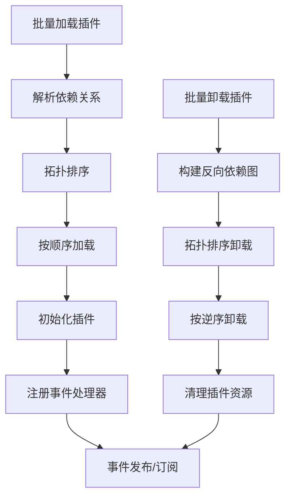

**图表来源**
- [src/plugins/manager.py:181-249](file://src/plugins/manager.py#L181-L249)

#### 依赖关系解析算法

插件管理器实现了高效的依赖关系解析算法：

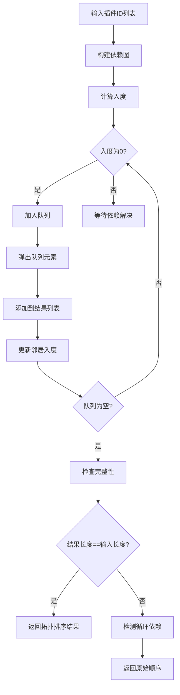

**图表来源**
- [src/plugins/manager.py:181-216](file://src/plugins/manager.py#L181-L216)

**章节来源**
- [src/plugins/manager.py:14-286](file://src/plugins/manager.py#L14-L286)

### PluginRegistry注册表

PluginRegistry负责插件的注册、发现和元数据管理：

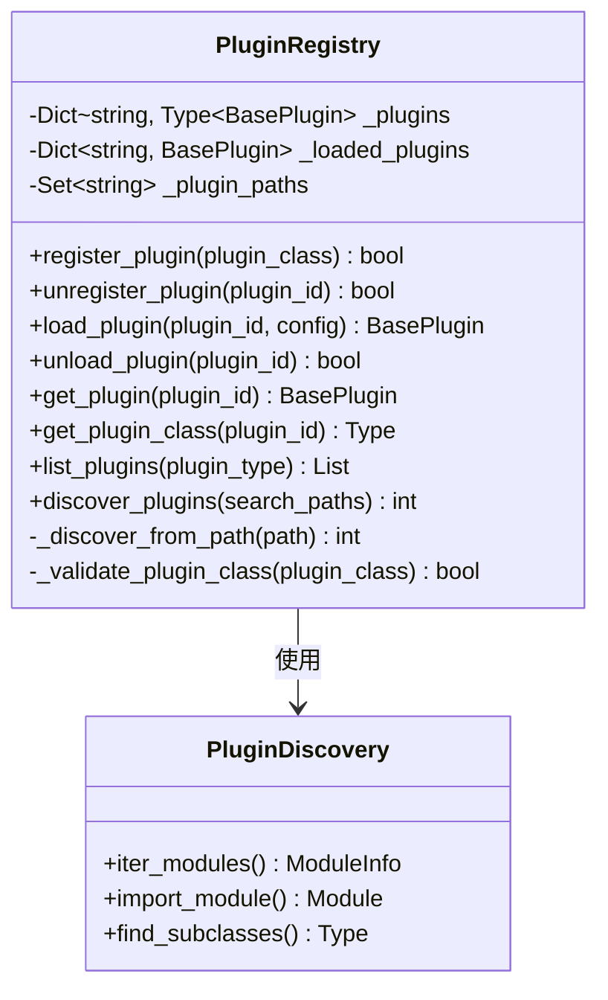

**图表来源**
- [src/plugins/registry.py:15-257](file://src/plugins/registry.py#L15-L257)

#### 插件验证机制

注册表实现了严格的插件验证机制：

| 验证步骤 | 检查内容 | 错误处理 |
|---------|---------|----------|
| 类型检查 | 确保是BasePlugin子类 | 抛出TypeError异常 |
| 方法验证 | 检查必需方法存在 | 记录验证失败日志 |
| 实例化测试 | 验证插件可正常实例化 | 捕获并报告异常 |
| 配置验证 | 检查插件信息完整性 | 返回False并记录错误 |

**章节来源**
- [src/plugins/registry.py:226-243](file://src/plugins/registry.py#L226-L243)

### 示例插件实现

框架提供了五个完整的示例插件，展示了不同类型插件的实现模式：

#### 文本预处理插件

TextPreprocessorPlugin展示了感知层插件的典型实现：

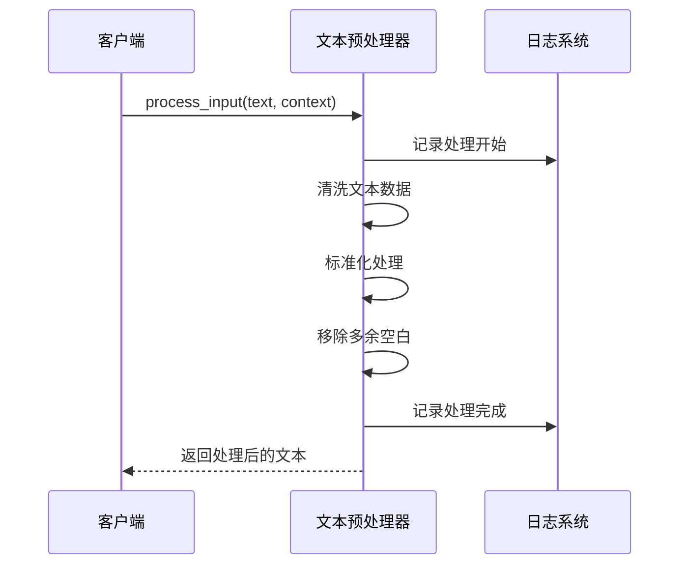

**图表来源**
- [src/plugins/example_plugins.py:40-57](file://src/plugins/example_plugins.py#L40-L57)

#### 缓存插件

SimpleCachePlugin演示了记忆层插件的设计思路：

| 功能特性 | 实现方式 | 性能影响 |
|---------|---------|----------|
| 键值存储 | 字典数据结构 | O(1)平均查找时间 |
| 元数据管理 | 结构化存储 | 增加存储开销 |
| 时间戳记录 | 自动添加时间戳 | 支持过期管理 |
| 批量操作 | 支持查询所有缓存项 | 需要内存管理 |

**章节来源**
- [src/plugins/example_plugins.py:60-109](file://src/plugins/example_plugins.py#L60-L109)

## 依赖关系分析

插件系统内部的依赖关系相对简单，主要通过接口和抽象类实现松耦合：

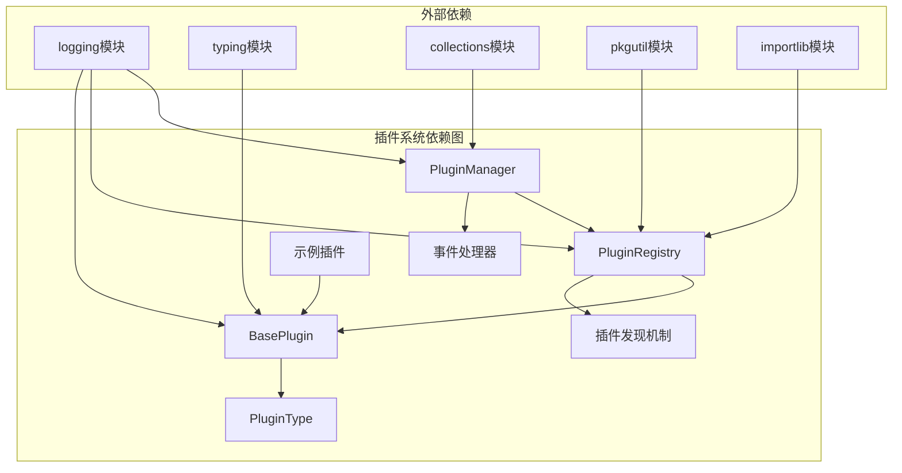

**图表来源**
- [src/plugins/manager.py:10-11](file://src/plugins/manager.py#L10-L11)
- [src/plugins/registry.py:6-12](file://src/plugins/registry.py#L6-L12)

### 循环依赖检测

插件管理器实现了循环依赖检测机制：

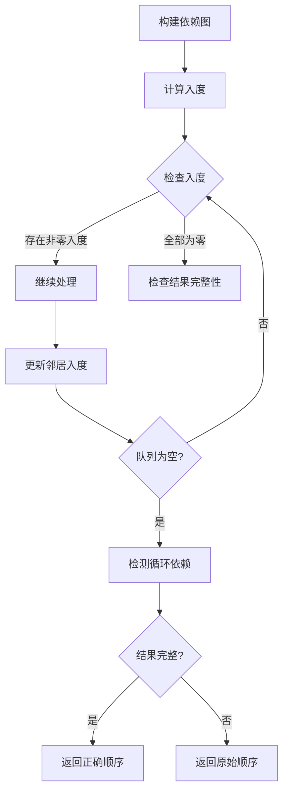

**图表来源**
- [src/plugins/manager.py:210-216](file://src/plugins/manager.py#L210-L216)

**章节来源**
- [src/plugins/manager.py:181-249](file://src/plugins/manager.py#L181-L249)

## 性能考虑

### 插件加载优化

插件系统在性能方面采用了多项优化策略：

| 优化策略 | 实现方式 | 性能收益 |
|---------|---------|----------|
| 懒加载机制 | 按需加载插件实例 | 减少内存占用 |
| 依赖排序 | 拓扑排序确保正确加载顺序 | 避免初始化失败 |
| 缓存机制 | 缓存已注册插件类 | 减少反射开销 |
| 异步处理 | 支持异步事件处理 | 提高响应速度 |

### 内存管理

插件系统提供了完善的内存管理机制：

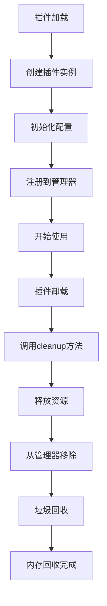

**图表来源**
- [src/plugins/registry.py:103-121](file://src/plugins/registry.py#L103-L121)

### 并发处理

插件系统支持并发处理模式：

| 并发模式 | 适用场景 | 实现方式 |
|---------|---------|----------|
| 同步处理 | 简单插件操作 | 直接调用方法 |
| 异步处理 | I/O密集型操作 | asyncio协程 |
| 多线程 | CPU密集型计算 | concurrent.futures |
| 分布式 | 跨进程处理 | multiprocessing |

## 故障排除指南

### 常见问题诊断

#### 插件加载失败

**症状**：插件无法加载或初始化失败

**可能原因**：
1. 插件类未正确继承BasePlugin基类
2. 缺少必需的抽象方法实现
3. 插件配置参数不正确
4. 依赖的外部库缺失

**解决方案**：
```python
# 检查插件类继承
assert issubclass(MyPlugin, BasePlugin)

# 验证必需方法
required_methods = ['_initialize', '_cleanup', 'description', 'dependencies']
for method in required_methods:
    assert hasattr(MyPlugin, method)

# 检查配置
if not plugin.validate_config(config):
    logger.error("插件配置无效")
```

#### 依赖循环问题

**症状**：插件加载过程中出现循环依赖警告

**诊断方法**：
1. 检查插件的dependencies属性
2. 使用依赖关系图分析工具
3. 重新设计插件架构

**预防措施**：
```python
# 在插件中避免相互依赖
class PluginA(BasePlugin):
    dependencies = []  # 不依赖其他插件

class PluginB(BasePlugin):
    dependencies = []  # 不依赖其他插件
```

#### 性能问题排查

**症状**：插件执行缓慢或内存泄漏

**诊断步骤**：
1. 监控插件执行时间
2. 检查内存使用情况
3. 分析资源释放情况

**优化建议**：
```python
# 实现资源清理
def _cleanup(self):
    # 清理数据库连接
    if hasattr(self, 'db_connection'):
        self.db_connection.close()
    
    # 清理缓存
    if hasattr(self, 'cache'):
        self.cache.clear()
    
    return True
```

**章节来源**
- [src/plugins/README.md:208-239](file://src/plugins/README.md#L208-L239)

## 结论

NecoRAG插件扩展框架是一个设计精良、功能完备的模块化架构系统。通过统一的插件基类、完善的生命周期管理和灵活的依赖关系处理，该框架为NecoRAG系统提供了强大的可扩展性和维护性。

### 主要优势

1. **模块化设计**：清晰的插件类型划分和职责分离
2. **动态扩展**：支持运行时插件发现和加载
3. **依赖管理**：智能的依赖关系解析和循环检测
4. **生命周期管理**：完整的插件生命周期控制
5. **配置灵活**：支持插件级别的配置管理

### 应用场景

该插件框架适用于以下场景：

- **功能扩展**：快速添加新的处理功能
- **算法替换**：支持不同算法的动态切换
- **第三方集成**：方便地集成外部服务和工具
- **A/B测试**：支持新功能的渐进式部署
- **定制化需求**：满足特定业务场景的特殊要求

### 未来发展

插件系统还有以下改进方向：

1. **插件热重载**：支持插件的动态更新而无需重启系统
2. **插件版本管理**：提供更精细的版本控制和兼容性检查
3. **插件市场**：建立插件共享和分发平台
4. **性能监控**：增强插件性能指标收集和分析能力
5. **安全隔离**：提供插件间的沙箱环境和权限控制

通过持续的优化和完善，NecoRAG插件扩展框架将成为构建复杂AI应用的强大基础设施。