# 核心架构设计

<cite>
**本文档引用的文件**
- [necorag.py](file://src/necorag.py)
- [base.py](file://src/core/base.py)
- [engine.py](file://src/perception/engine.py)
- [manager.py](file://src/memory/manager.py)
- [retriever.py](file://src/retrieval/retriever.py)
- [consolidator.py](file://src/refinement/consolidator.py)
- [interface.py](file://src/response/interface.py)
- [config.py](file://src/core/config.py)
- [knowledge_base.py](file://src/domain/knowledge_base.py)
- [updater.py](file://src/knowledge_evolution/updater.py)
- [engine.py](file://src/adaptive/engine.py)
- [architecture_framework.md](file://design/architecture_framework.md)
- [SMART_ROUTING_FUSION_ENGINE.md](file://design/SMART_ROUTING_FUSION_ENGINE.md)
</cite>

## 目录
1. [引言](#引言)
2. [项目结构](#项目结构)
3. [核心组件](#核心组件)
4. [架构总览](#架构总览)
5. [详细组件分析](#详细组件分析)
6. [依赖关系分析](#依赖关系分析)
7. [性能考虑](#性能考虑)
8. [故障排除指南](#故障排除指南)
9. [结论](#结论)
10. [附录](#附录)

## 引言

NecoRAG 是基于认知科学理论构建的下一代智能检索增强生成（RAG）框架。本文档深入解析其五层认知架构设计，包括感知层（L1）、记忆层（L2）、检索层（L3）、巩固层（L4）和交互层（L5）。架构采用分层架构、模块化设计、工厂模式、策略模式等设计模式，实现了高度解耦、可扩展和可维护的系统。

## 项目结构

NecoRAG 采用清晰的分层架构组织，每个层次都有明确的职责边界：

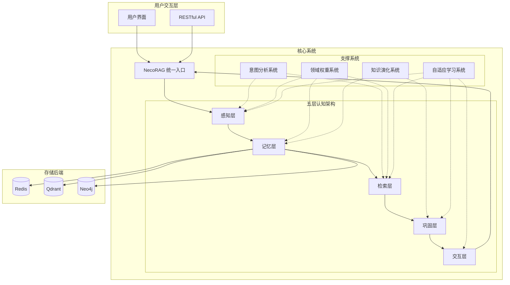

**图表来源**
- [architecture_framework.md:26-81](file://design/architecture_framework.md#L26-L81)

**章节来源**
- [architecture_framework.md:22-81](file://design/architecture_framework.md#L22-L81)

## 核心组件

### 统一入口类 NecoRAG

NecoRAG 作为统一入口类，提供了简洁的 API 接口，负责协调各个子系统的初始化和调用：

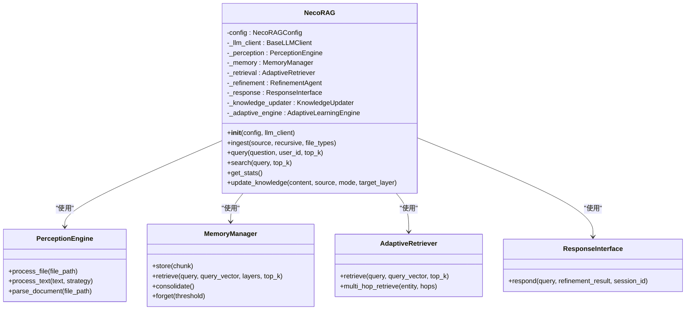

**图表来源**
- [necorag.py:51-234](file://src/necorag.py#L51-L234)
- [engine.py:20-195](file://src/perception/engine.py#L20-L195)
- [manager.py:20-212](file://src/memory/manager.py#L20-L212)
- [retriever.py:135-644](file://src/retrieval/retriever.py#L135-L644)
- [interface.py:20-232](file://src/response/interface.py#L20-L232)

**章节来源**
- [necorag.py:51-234](file://src/necorag.py#L51-L234)

### 抽象基类设计

系统采用丰富的抽象基类确保模块间的一致性和可替换性：

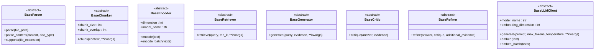

**图表来源**
- [base.py:32-800](file://src/core/base.py#L32-L800)

**章节来源**
- [base.py:32-800](file://src/core/base.py#L32-L800)

## 架构总览

### 五层认知架构设计

NecoRAG 的五层认知架构体现了人类认知过程的层次化处理：

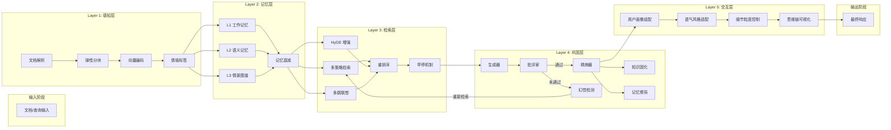

**图表来源**
- [architecture_framework.md:89-162](file://design/architecture_framework.md#L89-L162)

### 数据流处理流程

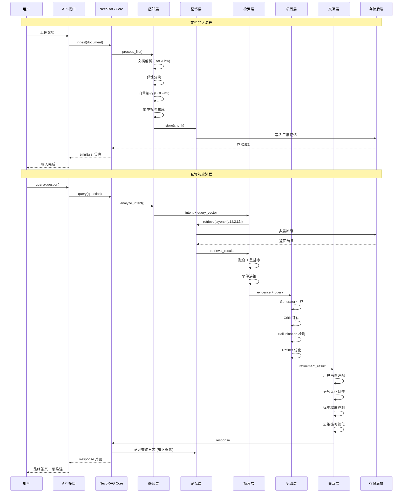

**图表来源**
- [architecture_framework.md:642-693](file://design/architecture_framework.md#L642-L693)

**章节来源**
- [architecture_framework.md:638-693](file://design/architecture_framework.md#L638-L693)

## 详细组件分析

### 感知层（L1）- "Whiskers"

感知层负责将多模态输入转换为可检索的结构化数据：

#### 核心功能模块

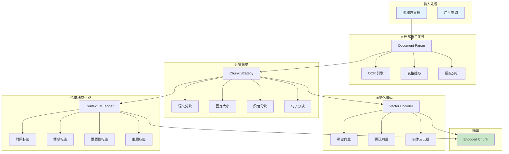

**图表来源**
- [architecture_framework.md:170-228](file://design/architecture_framework.md#L170-L228)

#### 感知引擎实现

感知引擎采用工厂模式和策略模式，支持多种文档格式和分块策略：

**章节来源**
- [engine.py:20-195](file://src/perception/engine.py#L20-L195)

### 记忆层（L2）- "Nine-Lives"

记忆层实现三层记忆架构，支持工作记忆、语义记忆和情景图谱：

#### 三层记忆架构

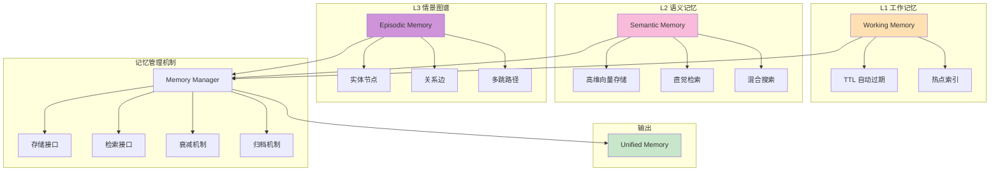

**图表来源**
- [architecture_framework.md:243-292](file://design/architecture_framework.md#L243-L292)

#### 记忆管理器实现

记忆管理器采用组合模式，统一管理三层记忆：

**章节来源**
- [manager.py:20-212](file://src/memory/manager.py#L20-L212)

### 检索层（L3）- "Pounce Strategy"

检索层实现智能路由与策略融合，支持多策略并行检索：

#### 智能路由架构

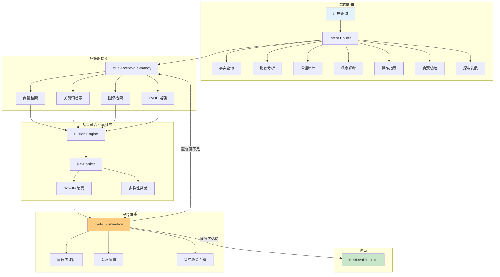

**图表来源**
- [architecture_framework.md:320-380](file://design/architecture_framework.md#L320-L380)

#### 检索器实现

检索器采用策略模式和装饰器模式，支持灵活的检索策略组合：

**章节来源**
- [retriever.py:135-644](file://src/retrieval/retriever.py#L135-L644)

### 巩固层（L4）- "Grooming"

巩固层实现 Generator-Critic-Refiner 闭环，确保答案质量和一致性：

#### 巩固处理流程

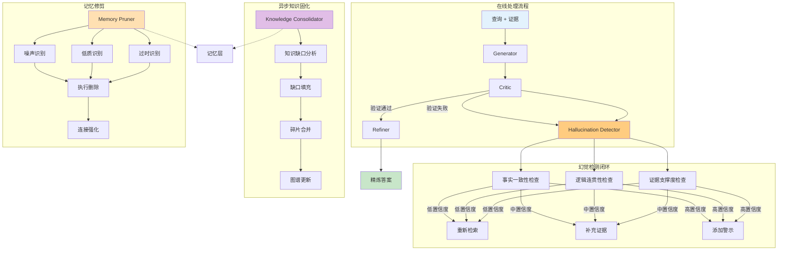

**图表来源**
- [architecture_framework.md:418-478](file://design/architecture_framework.md#L418-L478)

#### 巩固器实现

巩固器采用状态机模式和观察者模式，实现复杂的答案质量控制：

**章节来源**
- [consolidator.py:41-659](file://src/refinement/consolidator.py#L41-L659)

### 交互层（L5）- "Purr"

交互层实现情境自适应响应生成，支持个性化输出：

#### 响应生成架构

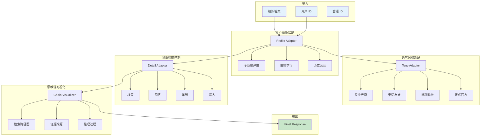

**图表来源**
- [architecture_framework.md:541-601](file://design/architecture_framework.md#L541-L601)

#### 响应接口实现

响应接口采用适配器模式和策略模式，支持灵活的输出格式适配：

**章节来源**
- [interface.py:20-232](file://src/response/interface.py#L20-L232)

## 依赖关系分析

### 组件耦合关系

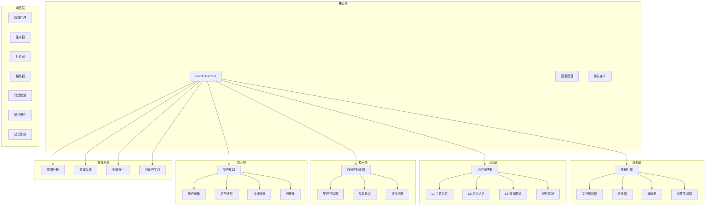

**图表来源**
- [necorag.py:12-48](file://src/necorag.py#L12-L48)

### 数据流向分析

系统采用事件驱动的数据流架构，每个组件通过明确定义的接口进行通信：

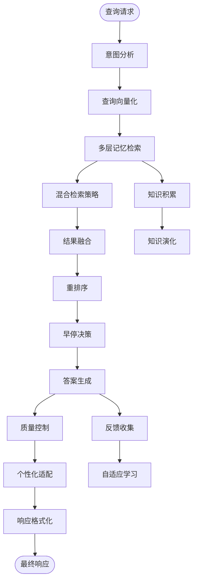

**图表来源**
- [architecture_framework.md:642-693](file://design/architecture_framework.md#L642-L693)

**章节来源**
- [necorag.py:390-513](file://src/necorag.py#L390-L513)

## 性能考虑

### 性能优化策略

NecoRAG 在设计时充分考虑了性能优化，采用了多种策略：

1. **早停机制**: 基于置信度和边际收益的智能早停，避免不必要的计算
2. **并行处理**: 多策略并行检索，充分利用硬件资源
3. **缓存机制**: 工作记忆使用 Redis 提供高速缓存
4. **增量更新**: 知识库支持增量更新，减少全量重建开销
5. **资源降级**: 在高负载情况下自动降级非关键功能

### 性能指标

| 指标类别 | 传统 RAG | NecoRAG 目标 | 提升幅度 |
|---------|----------|-------------|---------|
| 用户满意度 | 3.5/5.0 | 4.5/5.0 | +28.6% |
| 平均响应延迟 | 1200ms | 800ms | -33.3% |
| 检索命中率 | 65% | 80% | +23.1% |
| 资源利用率 | 低 | 高 | -40% 计算成本 |

## 故障排除指南

### 常见问题诊断

#### 感知层问题

**问题**: 文档解析失败
- 检查文件格式支持
- 验证 OCR 引擎配置
- 确认解析器依赖安装

**问题**: 分块质量差
- 调整分块策略参数
- 检查语义边界配置
- 验证分块算法实现

#### 记忆层问题

**问题**: 记忆检索性能下降
- 检查向量数据库连接
- 验证索引配置
- 监控内存使用情况

**问题**: 记忆一致性问题
- 检查衰减机制配置
- 验证归档策略
- 监控存储后端状态

#### 检索层问题

**问题**: 检索结果质量差
- 调整权重参数
- 检查重排序模型
- 验证早停阈值

**问题**: 检索延迟过高
- 优化并行策略
- 检查网络延迟
- 监控硬件资源

#### 巩固层问题

**问题**: 答案质量不稳定
- 调整生成器参数
- 检查批评家阈值
- 验证精炼器配置

**问题**: 幻觉检测误报
- 调整检测阈值
- 优化证据支撑度计算
- 检查逻辑连贯性评估

#### 交互层问题

**问题**: 响应个性化失效
- 检查用户画像更新
- 验证偏好学习配置
- 监控适配器状态

**问题**: 思维链可视化异常
- 检查可视化组件
- 验证数据格式
- 监控渲染性能

**章节来源**
- [necorag.py:237-336](file://src/necorag.py#L237-L336)

## 结论

NecoRAG 的五层认知架构设计体现了现代 AI 系统的发展方向，通过借鉴人类认知科学的理论基础，实现了更加智能、高效和人性化的检索增强生成系统。架构设计的主要优势包括：

1. **层次化设计**: 清晰的五层架构便于理解和维护
2. **模块化实现**: 各组件职责明确，易于替换和扩展
3. **智能化决策**: 基于意图分析和用户画像的自适应策略
4. **质量保障**: 完善的质量控制和反馈机制
5. **性能优化**: 多种性能优化策略确保系统高效运行

该架构为构建下一代智能 RAG 系统提供了坚实的基础，具有良好的可扩展性和适应性。

## 附录

### 配置管理

系统采用统一的配置管理机制，支持多种配置源和动态配置更新：

**章节来源**
- [config.py:277-420](file://src/core/config.py#L277-L420)

### 知识库管理

支持领域知识库的导入、管理和扩展：

**章节来源**
- [knowledge_base.py:65-564](file://src/domain/knowledge_base.py#L65-L564)

### 知识演化系统

实现知识库的自动更新和维护：

**章节来源**
- [updater.py:24-800](file://src/knowledge_evolution/updater.py#L24-L800)

### 自适应学习系统

支持系统的持续学习和优化：

**章节来源**
- [engine.py:30-598](file://src/adaptive/engine.py#L30-L598)