# 核心架构设计

<cite>
**本文引用的文件**
- [necorag.py](file://src/necorag.py)
- [base.py](file://src/core/base.py)
- [protocols.py](file://src/core/protocols.py)
- [config.py](file://src/core/config.py)
- [exceptions.py](file://src/core/exceptions.py)
- [engine.py](file://src/perception/engine.py)
- [manager.py](file://src/memory/manager.py)
- [working_memory.py](file://src/memory/working_memory.py)
- [semantic_memory.py](file://src/memory/semantic_memory.py)
- [retriever.py](file://src/retrieval/retriever.py)
- [agent.py](file://src/refinement/agent.py)
- [interface.py](file://src/response/interface.py)
- [semantic_analyzer.py](file://src/intent/semantic_analyzer.py)
- [design.md](file://design/design.md)
</cite>

## 目录
1. [简介](#简介)
2. [项目结构](#项目结构)
3. [核心组件](#核心组件)
4. [架构总览](#架构总览)
5. [详细组件分析](#详细组件分析)
6. [依赖分析](#依赖分析)
7. [性能考量](#性能考量)
8. [故障排查指南](#故障排查指南)
9. [结论](#结论)
10. [附录](#附录)

## 简介
本文件面向 NecoRAG 的核心架构设计，围绕“五层认知架构”展开，系统阐释感知层、记忆层、检索层、巩固层与交互层的理论基础与实现细节，重点说明抽象基类设计、协议定义、配置管理系统与异常处理机制，并将类脑记忆理论（工作记忆、语义记忆、情景图谱）转化为可落地的系统架构。文档同时提供架构图表、组件关系说明与扩展性设计建议，帮助读者在理解技术背景的同时把握设计决策的权衡与约束。

## 项目结构
NecoRAG 采用模块化分层组织，核心模块包括：
- 核心层：抽象基类、协议定义、配置管理、异常体系
- 感知层：文档解析、分块、编码、情境标签
- 记忆层：工作记忆（L1）、语义记忆（L2）、情景图谱（L3）
- 检索层：自适应检索、HyDE 增强、重排序、早停机制
- 巩固层：生成-批判-修正闭环、幻觉检测、知识固化与修剪
- 交互层：响应适配、用户画像、思维链可视化
- 意图层：语义意图分类与路由
- 知识演化层：实时/定时更新、指标与可视化

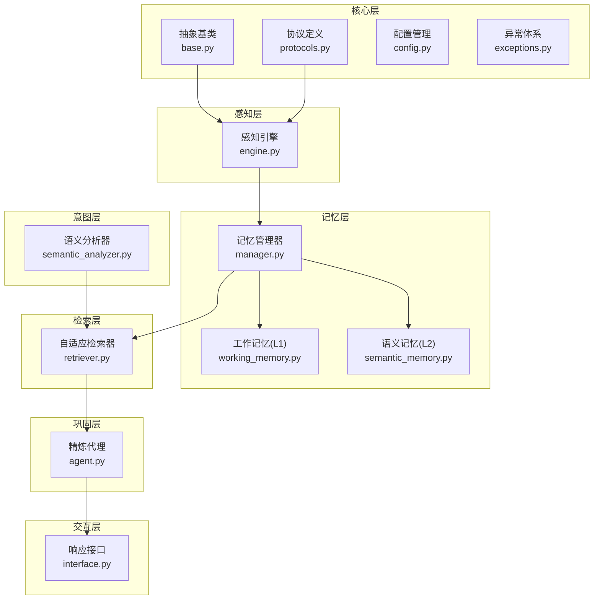

图表来源
- [necorag.py:100-121](file://src/necorag.py#L100-L121)
- [engine.py:15-71](file://src/perception/engine.py#L15-L71)
- [manager.py:16-46](file://src/memory/manager.py#L16-L46)
- [working_memory.py:11-34](file://src/memory/working_memory.py#L11-L34)
- [semantic_memory.py:21-48](file://src/memory/semantic_memory.py#L21-L48)
- [retriever.py:122-164](file://src/retrieval/retriever.py#L122-L164)
- [agent.py:16-60](file://src/refinement/agent.py#L16-L60)
- [interface.py:16-53](file://src/response/interface.py#L16-L53)
- [semantic_analyzer.py:24-67](file://src/intent/semantic_analyzer.py#L24-L67)

章节来源
- [necorag.py:100-121](file://src/necorag.py#L100-L121)
- [engine.py:15-71](file://src/perception/engine.py#L15-L71)
- [manager.py:16-46](file://src/memory/manager.py#L16-L46)
- [working_memory.py:11-34](file://src/memory/working_memory.py#L11-L34)
- [semantic_memory.py:21-48](file://src/memory/semantic_memory.py#L21-L48)
- [retriever.py:122-164](file://src/retrieval/retriever.py#L122-L164)
- [agent.py:16-60](file://src/refinement/agent.py#L16-L60)
- [interface.py:16-53](file://src/response/interface.py#L16-L53)
- [semantic_analyzer.py:24-67](file://src/intent/semantic_analyzer.py#L24-L67)

## 核心组件
本节聚焦抽象基类、协议定义、配置管理与异常体系，它们共同构成系统可替换性、一致性的基石。

- 抽象基类（base.py）
  - 感知层：解析器、分块器、编码器、标签生成器
  - 记忆层：记忆存储、向量存储、图存储
  - 检索层：检索器、重排序器
  - 巩固层：答案生成器、批判器、修正器、幻觉检测器
  - LLM 客户端：同步与异步接口
  - 响应层：响应适配器
  - 意图层：意图分类器、意图路由器
  - 知识演化层：知识更新器、指标计算器

- 协议定义（protocols.py）
  - 枚举：文档类型、分块类型、记忆层级、检索来源、响应语气、详细程度、意图类型
  - 数据类：Document、Chunk、ContextTag、Embedding、EncodedChunk、Memory、Entity、Relation、Query、RetrievalResult、GeneratedAnswer、CritiqueResult、HallucinationReport、Response、UserProfile
  - 统一的数据契约确保模块间解耦与可替换

- 配置管理（config.py）
  - 提供全局配置与各层子配置，支持从文件与环境变量加载
  - 预设配置（开发/生产/最小化）满足不同部署场景
  - 配置加载函数支持环境变量覆盖

- 异常体系（exceptions.py）
  - 统一异常基类与分层异常（感知、记忆、检索、巩固、LLM、配置、知识演化等）
  - 异常携带错误码与详细信息，便于追踪与诊断

章节来源
- [base.py:22-750](file://src/core/base.py#L22-L750)
- [protocols.py:14-290](file://src/core/protocols.py#L14-L290)
- [config.py:45-405](file://src/core/config.py#L45-L405)
- [exceptions.py:10-389](file://src/core/exceptions.py#L10-L389)

## 架构总览
NecoRAG 的“五层认知架构”以类脑记忆机制为理论基础，实现从感知到记忆再到检索、巩固与交互的完整闭环。系统强调：
- 分层存储与检索：L1（工作记忆）短期上下文、L2（语义记忆）向量检索、L3（情景图谱）多跳推理
- 智能路由与早停：基于语义意图的检索策略与置信度早停，提升响应速度与资源利用率
- 自我校正与演化：生成-批判-修正闭环与知识库实时/定时更新，持续优化质量与新鲜度

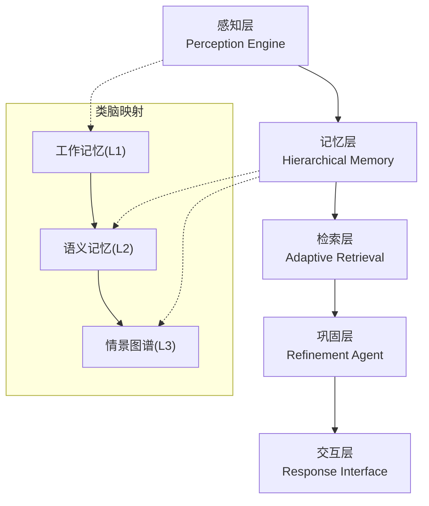

图表来源
- [design.md:489-500](file://design/design.md#L489-L500)
- [necorag.py:37-121](file://src/necorag.py#L37-L121)

章节来源
- [design.md:489-500](file://design/design.md#L489-L500)
- [necorag.py:37-121](file://src/necorag.py#L37-L121)

## 详细组件分析

### 组件A：NecoRAG 统一入口类
- 职责：统一对外 API，协调感知、记忆、检索、巩固、交互与知识演化各层
- 初始化：按需延迟初始化各子组件，支持外部注入 LLM 客户端
- 文档导入：支持文件与文本导入，调用感知层编码后写入记忆层
- 查询流程：意图分析与路由、HyDE 增强、检索、精炼、响应生成、知识积累回调
- 知识演化：提供实时/定时更新、指标计算、健康报告、仪表盘数据与调度器控制

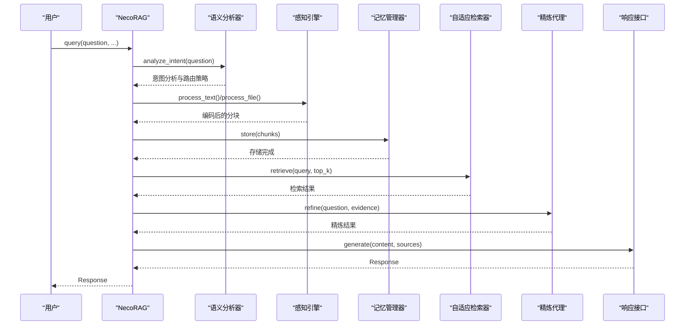

图表来源
- [necorag.py:328-421](file://src/necorag.py#L328-L421)
- [semantic_analyzer.py:69-122](file://src/intent/semantic_analyzer.py#L69-L122)
- [engine.py:122-174](file://src/perception/engine.py#L122-L174)
- [manager.py:48-112](file://src/memory/manager.py#L48-L112)
- [retriever.py:177-253](file://src/retrieval/retriever.py#L177-L253)
- [agent.py:61-128](file://src/refinement/agent.py#L61-L128)
- [interface.py:55-132](file://src/response/interface.py#L55-L132)

章节来源
- [necorag.py:37-744](file://src/necorag.py#L37-L744)

### 组件B：感知引擎（Perception Engine）
- 职责：文档解析、弹性分块、向量编码、情境标签生成
- 设计要点：支持多种分块策略（弹性/语义/固定/结构化/句子），向量化输出稠密+稀疏+实体三元组，情境标签包含时间、情感、重要性等维度

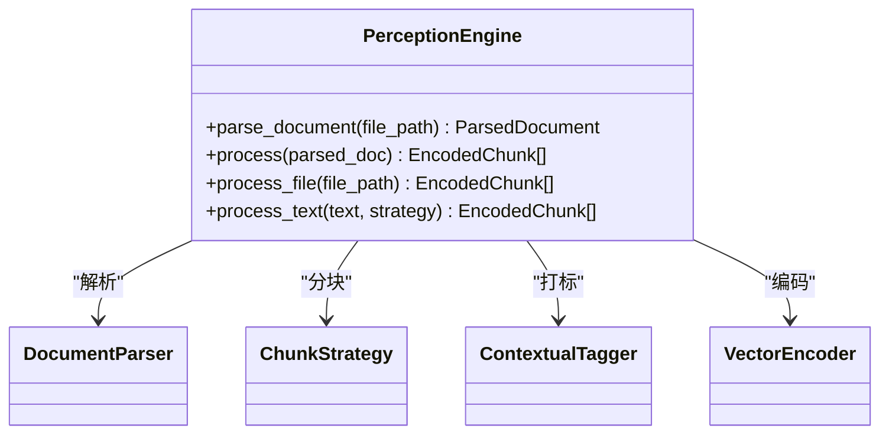

图表来源
- [engine.py:15-174](file://src/perception/engine.py#L15-L174)

章节来源
- [engine.py:15-174](file://src/perception/engine.py#L15-L174)

### 组件C：记忆管理器（MemoryManager）
- 职责：统一管理 L1（工作记忆）、L2（语义记忆）、L3（情景图谱），提供跨层检索与记忆巩固
- 设计要点：存储编码块到 L2 向量库，抽取实体关系写入 L3 图谱，应用衰减与归档策略

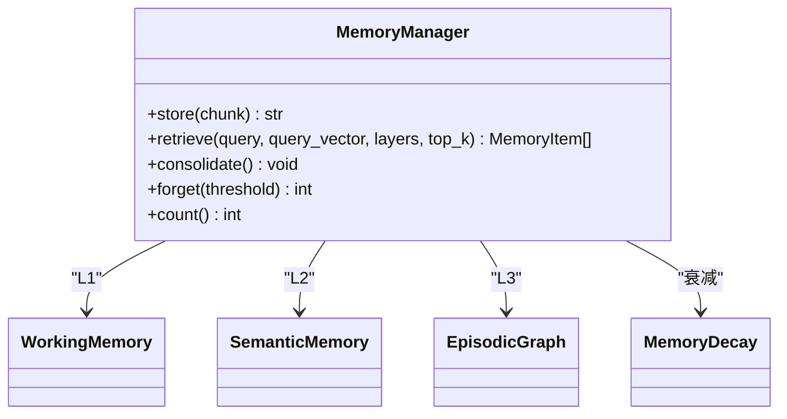

图表来源
- [manager.py:16-195](file://src/memory/manager.py#L16-L195)

章节来源
- [manager.py:16-195](file://src/memory/manager.py#L16-L195)

### 组件D：自适应检索器（AdaptiveRetriever）
- 职责：多路检索（向量/图谱）、结果融合、重排序、领域权重、早停机制
- 设计要点：早停控制器基于置信度阈值与边际收益判断是否提前终止；支持 HyDE 增强与多跳检索；可选应用领域权重

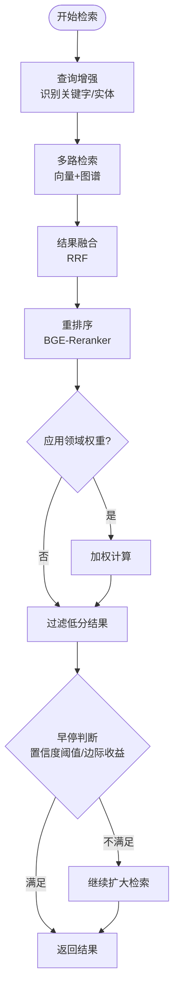

图表来源
- [retriever.py:30-120](file://src/retrieval/retriever.py#L30-L120)
- [retriever.py:177-253](file://src/retrieval/retriever.py#L177-L253)

章节来源
- [retriever.py:122-440](file://src/retrieval/retriever.py#L122-L440)

### 组件E：精炼代理（RefinementAgent）
- 职责：生成-批判-修正闭环、幻觉检测、知识固化与修剪
- 设计要点：多轮迭代，结合置信度阈值与幻觉检测结果决定是否收敛；支持异步知识固化与记忆修剪

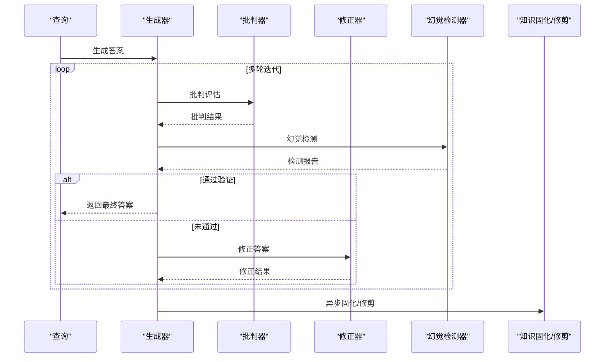

图表来源
- [agent.py:61-128](file://src/refinement/agent.py#L61-L128)

章节来源
- [agent.py:16-151](file://src/refinement/agent.py#L16-L151)

### 组件F：响应接口（ResponseInterface）
- 职责：用户画像适配、语气与详细程度适配、思维链可视化、交互记录
- 设计要点：根据用户画像与查询复杂度动态调整输出风格；生成可解释的思维链文本

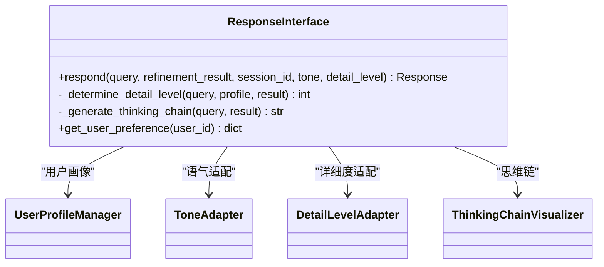

图表来源
- [interface.py:16-224](file://src/response/interface.py#L16-L224)

章节来源
- [interface.py:16-224](file://src/response/interface.py#L16-L224)

### 组件G：语义分析器（SemanticAnalyzer）
- 职责：意图分类、路由策略、权重因子、检索参数推荐
- 设计要点：统一分析接口，支持批量分析与解释输出；可切换分类器后端

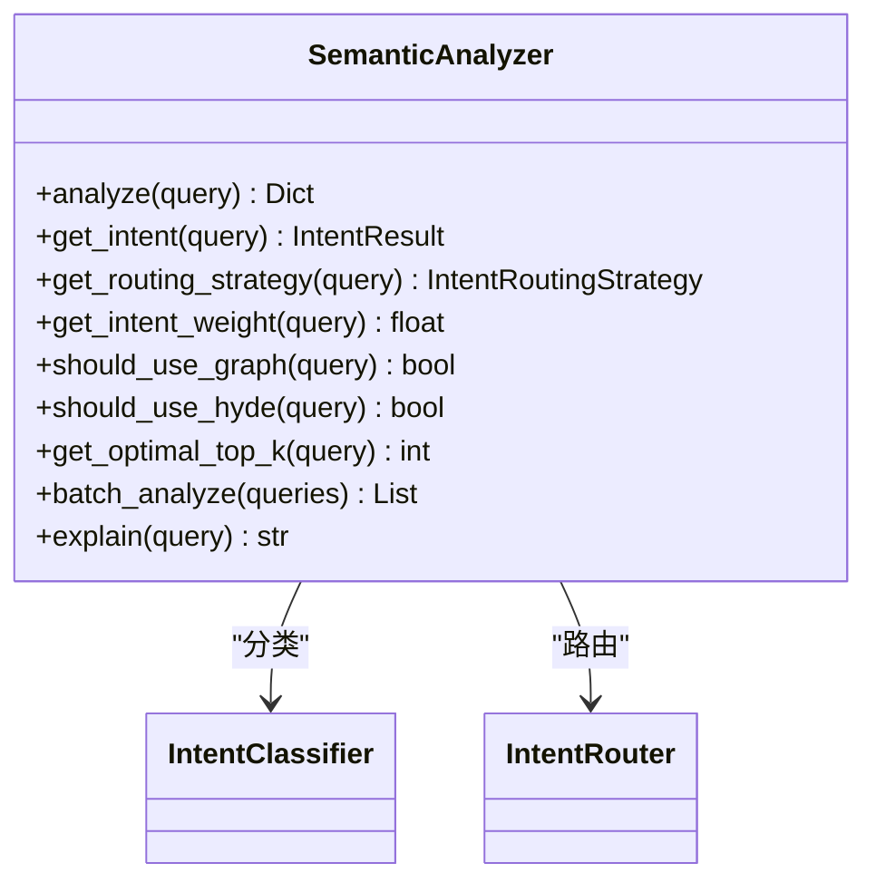

图表来源
- [semantic_analyzer.py:24-352](file://src/intent/semantic_analyzer.py#L24-L352)

章节来源
- [semantic_analyzer.py:24-352](file://src/intent/semantic_analyzer.py#L24-L352)

### 组件H：类脑记忆理论到系统架构的映射
- 工作记忆（L1）：短期上下文、TTL 过期、会话轨迹跟踪
- 语义记忆（L2）：向量检索、HNSW 索引、模糊匹配
- 情景图谱（L3）：实体关系网络、多跳推理、扩散激活
- 遗忘与巩固：时间权重衰减、低频归档、异步固化与修剪

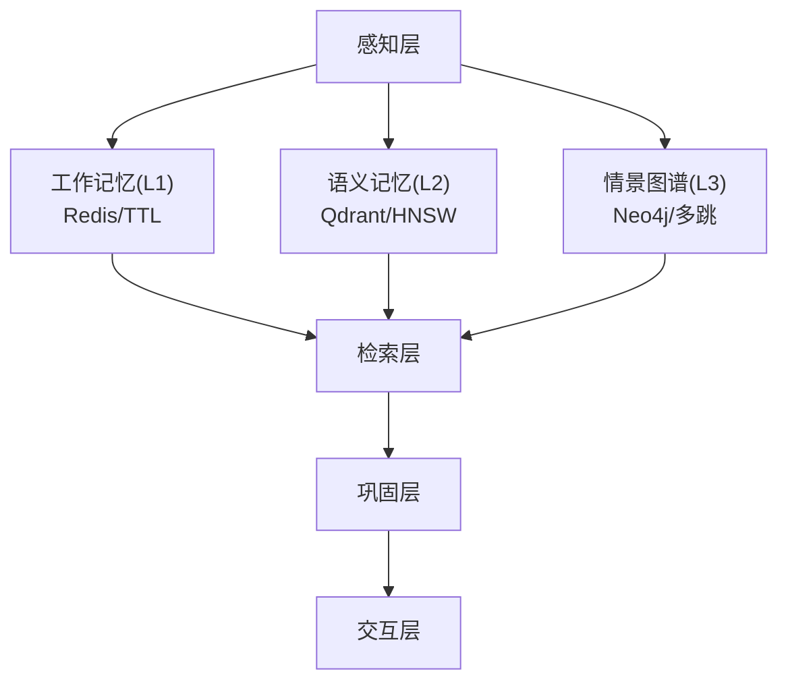

图表来源
- [design.md:180-206](file://design/design.md#L180-L206)
- [working_memory.py:11-34](file://src/memory/working_memory.py#L11-L34)
- [semantic_memory.py:21-48](file://src/memory/semantic_memory.py#L21-L48)

章节来源
- [design.md:32-215](file://design/design.md#L32-L215)
- [working_memory.py:11-120](file://src/memory/working_memory.py#L11-L120)
- [semantic_memory.py:21-179](file://src/memory/semantic_memory.py#L21-L179)

## 依赖分析
- 组件耦合与内聚
  - NecoRAG 作为编排器，依赖感知、记忆、检索、巩固、交互与意图各层接口，通过抽象基类与协议定义实现松耦合
  - 记忆层对向量与图存储的抽象（BaseVectorStore、BaseGraphStore）便于替换实现
- 直接与间接依赖
  - 感知层依赖协议定义的文档/分块/编码数据结构
  - 检索层依赖记忆层提供的向量与图谱接口
  - 巩固层依赖记忆层的存储与修剪能力
- 外部依赖与集成点
  - LLM 客户端抽象支持多种提供商（Mock/OpenAI/Ollama/vLLM/Azure/Claude）
  - 记忆层预留向量数据库（Qdrant/Milvus）与图数据库（Neo4j/Nebula）接入点
- 潜在循环依赖
  - 当前模块划分清晰，未发现循环依赖迹象

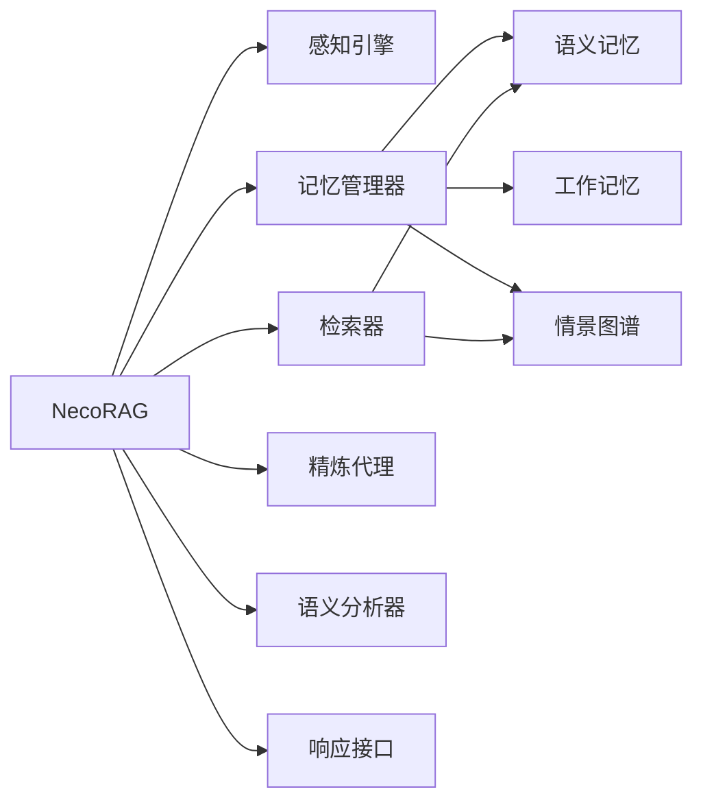

图表来源
- [necorag.py:100-121](file://src/necorag.py#L100-L121)
- [manager.py:16-46](file://src/memory/manager.py#L16-L46)
- [retriever.py:122-164](file://src/retrieval/retriever.py#L122-L164)

章节来源
- [necorag.py:100-121](file://src/necorag.py#L100-L121)
- [manager.py:16-46](file://src/memory/manager.py#L16-L46)
- [retriever.py:122-164](file://src/retrieval/retriever.py#L122-L164)

## 性能考量
- 检索性能
  - 早停机制在高置信度场景显著减少检索开销
  - 多路检索与结果融合（RRF）平衡召回与重排序成本
  - 向量检索采用余弦相似度，建议在实际部署中接入 HNSW 索引与向量数据库
- 记忆与存储
  - L1 使用 TTL 与 LRU 策略，避免无限增长
  - L2 向量去重与索引优化（如 HNSW 参数调优）提升检索效率
  - L3 图谱定期修剪孤立节点与弱关联边，维持连通性
- 生成与精炼
  - 多轮迭代与幻觉检测带来额外开销，可通过阈值与最大迭代次数控制
  - 异步固化与修剪减轻主线程压力
- 配置与环境
  - 通过环境变量覆盖关键配置，便于在不同环境中快速调优

## 故障排查指南
- 配置加载失败
  - 现象：配置文件不存在或字段缺失
  - 处理：检查配置文件路径与字段类型，确认环境变量前缀与键名
- 记忆层异常
  - 现象：向量/图存储错误、内存不足
  - 处理：检查向量维度与存储实现，确认阈值与归档策略
- 检索层异常
  - 现象：检索结果为空或置信度低
  - 处理：调整 top_k、阈值与早停策略，检查领域权重与重排序
- 巩固层异常
  - 现象：生成/批判/修正失败或幻觉检测误报
  - 处理：检查 LLM 客户端配置与模型可用性，调整迭代次数与阈值
- 意图层异常
  - 现象：意图识别置信度低或路由不当
  - 处理：切换分类器后端，调整阈值与路由策略

章节来源
- [config.py:323-362](file://src/core/config.py#L323-L362)
- [exceptions.py:46-389](file://src/core/exceptions.py#L46-L389)

## 结论
NecoRAG 的核心架构以类脑记忆理论为指导，通过五层认知架构实现了从感知到记忆、从检索到巩固再到交互的闭环。抽象基类与协议定义确保了模块的可替换性与一致性；统一配置与异常体系提升了可运维性与可观测性。在实际部署中，建议结合早停机制、领域权重与知识演化策略，持续优化检索质量与系统性能，并通过可视化仪表盘与健康度指标实现知识库的可持续演进。

## 附录
- 设计文档参考：[设计任务书](file://design/design.md)
- 快速开始与示例：参见项目根目录 README 与 example 目录