# 核心架构设计

<cite>
**本文档引用的文件**
- [necorag.py](file://src/necorag.py)
- [base.py](file://src/core/base.py)
- [protocols.py](file://src/core/protocols.py)
- [config.py](file://src/core/config.py)
- [engine.py](file://src/perception/engine.py)
- [manager.py](file://src/memory/manager.py)
- [retriever.py](file://src/retrieval/retriever.py)
- [agent.py](file://src/refinement/agent.py)
- [interface.py](file://src/response/interface.py)
- [architecture_framework.md](file://design/architecture_framework.md)
- [exceptions.py](file://src/core/exceptions.py)
- [engine.py](file://src/adaptive/engine.py)
- [manager.py](file://src/plugins/manager.py)
- [updater.py](file://src/knowledge_evolution/updater.py)
</cite>

## 目录
1. [引言](#引言)
2. [项目结构](#项目结构)
3. [核心组件](#核心组件)
4. [架构总览](#架构总览)
5. [详细组件分析](#详细组件分析)
6. [依赖分析](#依赖分析)
7. [性能考虑](#性能考虑)
8. [故障排除指南](#故障排除指南)
9. [结论](#结论)
10. [附录](#附录)

## 引言
本文件面向NecoRAG核心架构设计，围绕五层认知架构（感知层L1、记忆层L2、检索层L3、巩固层L4、交互层L5）展开，系统阐述统一入口类NecoRAG的设计模式、模块化架构、延迟初始化机制与配置管理。文档同时解析设计模式、抽象基类与协议定义，给出架构决策的技术考量、性能优化策略与扩展性设计，并提供架构图与组件交互示意，帮助开发者快速理解并高效扩展系统。

## 项目结构
NecoRAG采用分层模块化组织，核心位于src目录，包含感知、记忆、检索、巩固、交互五大子系统，以及核心协议、配置、异常、自适应学习与知识演化等支撑模块。统一入口类NecoRAG负责协调各子系统，提供简洁的API对外服务。

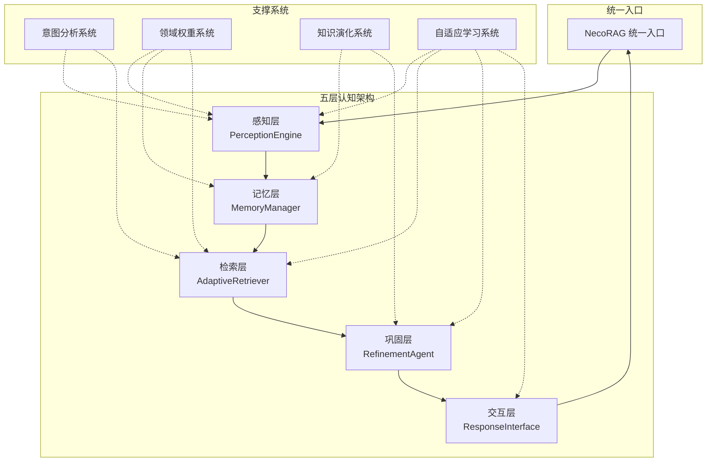

**图表来源**
- [architecture_framework.md:26-81](file://design/architecture_framework.md#L26-L81)

**章节来源**
- [architecture_framework.md:26-81](file://design/architecture_framework.md#L26-L81)

## 核心组件
本节聚焦统一入口类NecoRAG及其核心协议、配置与异常体系，阐明模块化设计与延迟初始化机制。

- 统一入口类NecoRAG
  - 职责：提供文档导入、查询检索、配置管理、知识演化与自适应学习的统一API；内部协调感知、记忆、检索、巩固、交互五大子系统。
  - 设计模式：组合模式 + 延迟初始化；通过私有字段按需创建子系统，减少启动开销。
  - 关键能力：文档导入（文件/文本）、查询处理（意图分析、HyDE增强、检索、精炼、响应）、统计与可观测性、知识演化与自适应学习集成。
  - 参考路径：[necorag.py:43-135](file://src/necorag.py#L43-L135)

- 核心协议与数据模型
  - 协议定义：统一文档、分块、向量、记忆、查询、检索结果、响应、用户画像等数据结构，确保模块间数据交换一致。
  - 参考路径：[protocols.py:14-298](file://src/core/protocols.py#L14-L298)

- 抽象基类与接口契约
  - 定义感知层（解析、分块、编码、标签）、记忆层（存储、向量、图）、检索层（检索、重排序）、巩固层（生成、批判、精炼、幻觉检测）、响应层（适配）等抽象接口，保证实现的一致性与可替换性。
  - 参考路径：[base.py:30-800](file://src/core/base.py#L30-L800)

- 配置管理
  - 全局配置NecoRAGConfig与各层子配置（LLM、感知、记忆、检索、精炼、响应、领域权重、知识演化），支持从文件与环境变量加载，提供预设配置。
  - 参考路径：[config.py:18-420](file://src/core/config.py#L18-L420)

- 异常体系
  - 统一异常基类与各层专用异常，便于错误定位与统一处理。
  - 参考路径：[exceptions.py:10-455](file://src/core/exceptions.py#L10-L455)

**章节来源**
- [necorag.py:43-135](file://src/necorag.py#L43-L135)
- [protocols.py:14-298](file://src/core/protocols.py#L14-L298)
- [base.py:30-800](file://src/core/base.py#L30-L800)
- [config.py:18-420](file://src/core/config.py#L18-L420)
- [exceptions.py:10-455](file://src/core/exceptions.py#L10-L455)

## 架构总览
五层认知架构遵循“输入→处理→输出”的流水线设计，每层职责明确、边界清晰，通过统一协议与抽象基类实现松耦合与高内聚。

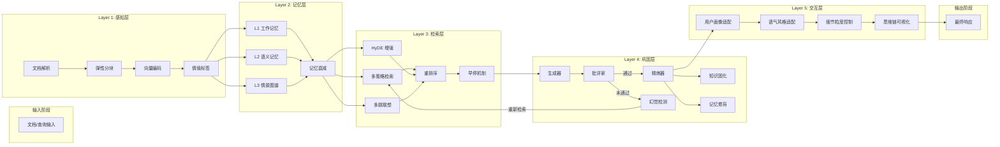

**图表来源**
- [architecture_framework.md:89-162](file://design/architecture_framework.md#L89-L162)

**章节来源**
- [architecture_framework.md:89-162](file://design/architecture_framework.md#L89-L162)

## 详细组件分析

### 统一入口类 NecoRAG（核心协调器）
- 设计模式与职责
  - 组合模式：聚合感知、记忆、检索、巩固、交互等子系统。
  - 延迟初始化：仅在首次使用时创建子系统，降低冷启动成本。
  - 配置驱动：通过NecoRAGConfig与ConfigPresets提供灵活配置。
- 关键流程
  - 文档导入：感知层解析→编码→存储到记忆层。
  - 查询处理：意图分析→HyDE增强→检索→精炼→响应→统计与知识演化回调。
- 参考路径
  - [necorag.py:43-135](file://src/necorag.py#L43-L135)
  - [necorag.py:201-301](file://src/necorag.py#L201-L301)
  - [necorag.py:354-477](file://src/necorag.py#L354-L477)

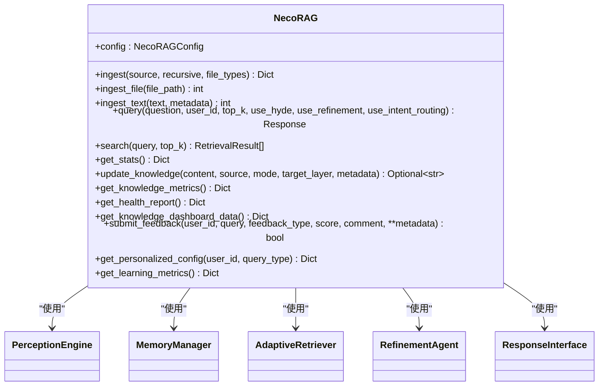

**图表来源**
- [necorag.py:43-135](file://src/necorag.py#L43-L135)

**章节来源**
- [necorag.py:43-135](file://src/necorag.py#L43-L135)
- [necorag.py:201-301](file://src/necorag.py#L201-L301)
- [necorag.py:354-477](file://src/necorag.py#L354-L477)

### 感知层（L1）：PerceptionEngine
- 职责：多模态文档解析、弹性分块、向量编码、情境标签生成。
- 设计要点：模块化子组件（解析器、分块策略、编码器、标签器），统一入口process_file/process_text。
- 参考路径
  - [engine.py:20-195](file://src/perception/engine.py#L20-L195)

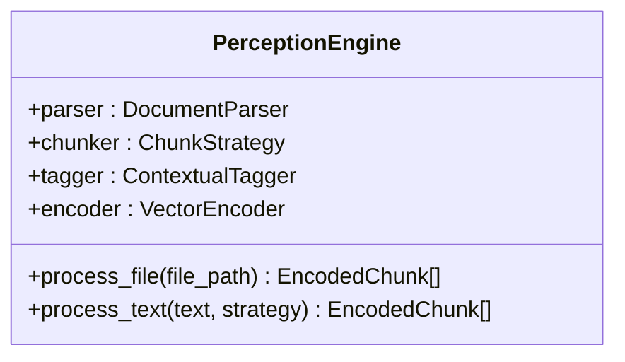

**图表来源**
- [engine.py:20-195](file://src/perception/engine.py#L20-L195)

**章节来源**
- [engine.py:20-195](file://src/perception/engine.py#L20-L195)

### 记忆层（L2）：MemoryManager
- 职责：统一管理L1工作记忆、L2语义记忆、L3情景图谱；提供存储、检索、衰减与修剪。
- 设计要点：三层记忆协同、统一存储视图、衰减与归档机制。
- 参考路径
  - [manager.py:20-212](file://src/memory/manager.py#L20-L212)

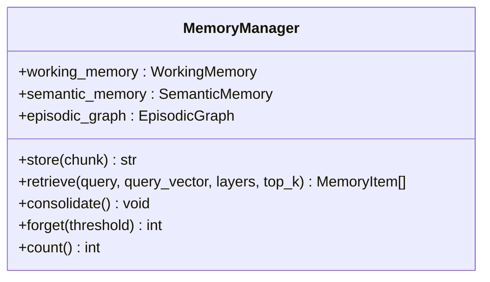

**图表来源**
- [manager.py:20-212](file://src/memory/manager.py#L20-L212)

**章节来源**
- [manager.py:20-212](file://src/memory/manager.py#L20-L212)

### 检索层（L3）：AdaptiveRetriever
- 职责：多策略检索（向量、图谱、HyDE）、结果融合、重排序、早停机制、领域权重。
- 设计要点：早停控制器、领域权重计算、异步回退（网络搜索）。
- 参考路径
  - [retriever.py:135-644](file://src/retrieval/retriever.py#L135-L644)

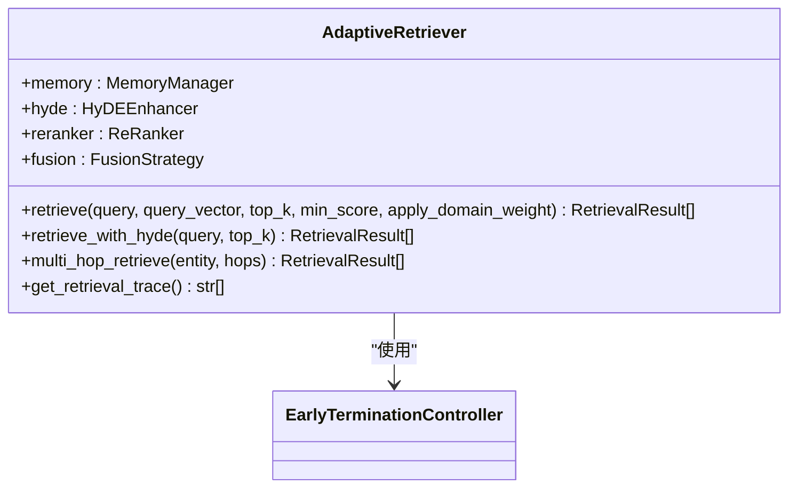

**图表来源**
- [retriever.py:135-644](file://src/retrieval/retriever.py#L135-L644)

**章节来源**
- [retriever.py:135-644](file://src/retrieval/retriever.py#L135-L644)

### 巩固层（L4）：RefinementAgent
- 职责：Generator-Critic-Refiner闭环、幻觉检测、异步知识固化、记忆修剪。
- 设计要点：迭代优化、幻觉检测闭环、与记忆层联动。
- 参考路径
  - [agent.py:20-164](file://src/refinement/agent.py#L20-L164)

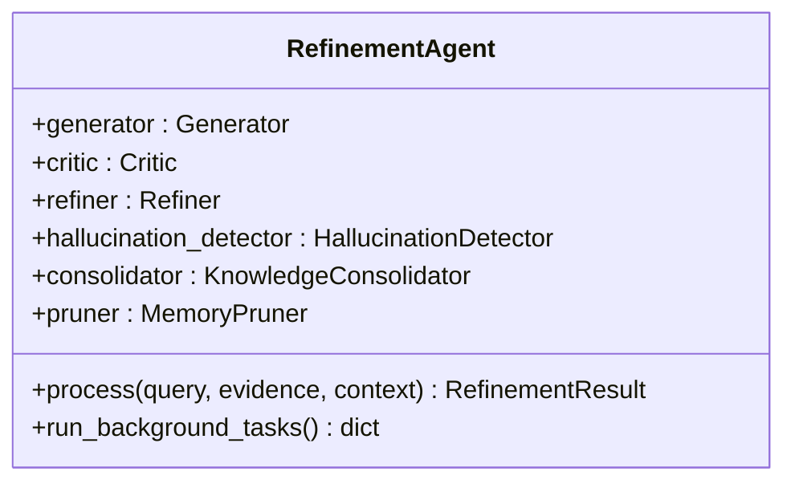

**图表来源**
- [agent.py:20-164](file://src/refinement/agent.py#L20-L164)

**章节来源**
- [agent.py:20-164](file://src/refinement/agent.py#L20-L164)

### 交互层（L5）：ResponseInterface
- 职责：用户画像适配、语气风格、详细程度、思维链可视化。
- 设计要点：情境自适应生成、用户偏好学习、响应可视化。
- 参考路径
  - [interface.py:20-232](file://src/response/interface.py#L20-L232)

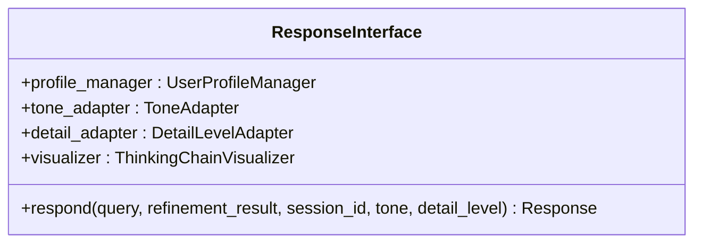

**图表来源**
- [interface.py:20-232](file://src/response/interface.py#L20-L232)

**章节来源**
- [interface.py:20-232](file://src/response/interface.py#L20-L232)

### 知识演化系统（KE）
- 职责：实时/批量更新、候选池管理、变更日志、回滚、知识缺口分析、查询驱动积累。
- 设计要点：质量评估与自动审批、增量更新、回滚保护。
- 参考路径
  - [updater.py:24-800](file://src/knowledge_evolution/updater.py#L24-L800)

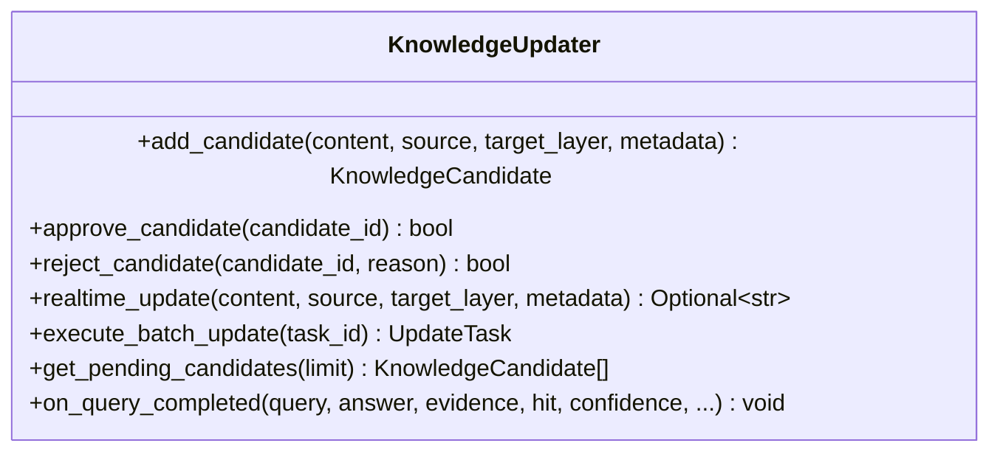

**图表来源**
- [updater.py:24-800](file://src/knowledge_evolution/updater.py#L24-L800)

**章节来源**
- [updater.py:24-800](file://src/knowledge_evolution/updater.py#L24-L800)

### 自适应学习系统（AL）
- 职责：反馈收集、偏好预测、策略优化、集体智慧、个性化配置。
- 设计要点：延迟初始化子系统、周期性优化、仪表盘数据聚合。
- 参考路径
  - [engine.py:30-598](file://src/adaptive/engine.py#L30-L598)

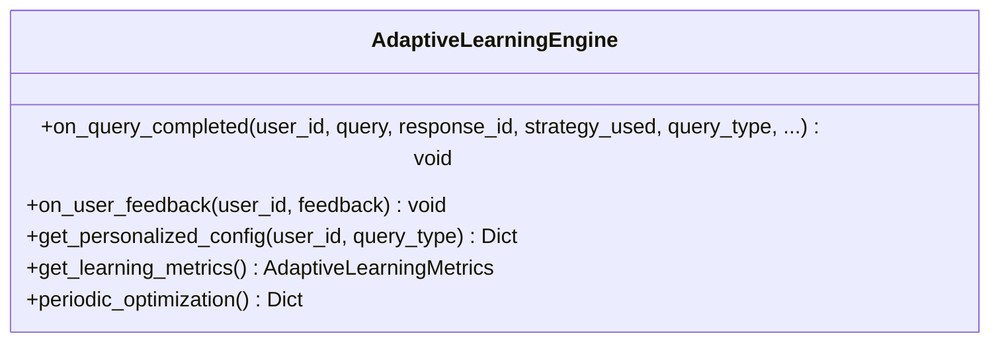

**图表来源**
- [engine.py:30-598](file://src/adaptive/engine.py#L30-L598)

**章节来源**
- [engine.py:30-598](file://src/adaptive/engine.py#L30-L598)

### 插件系统（可扩展性）
- 职责：插件生命周期管理、依赖解析、事件处理。
- 设计要点：拓扑排序加载/卸载、事件广播、依赖关系图构建。
- 参考路径
  - [manager.py:14-286](file://src/plugins/manager.py#L14-L286)

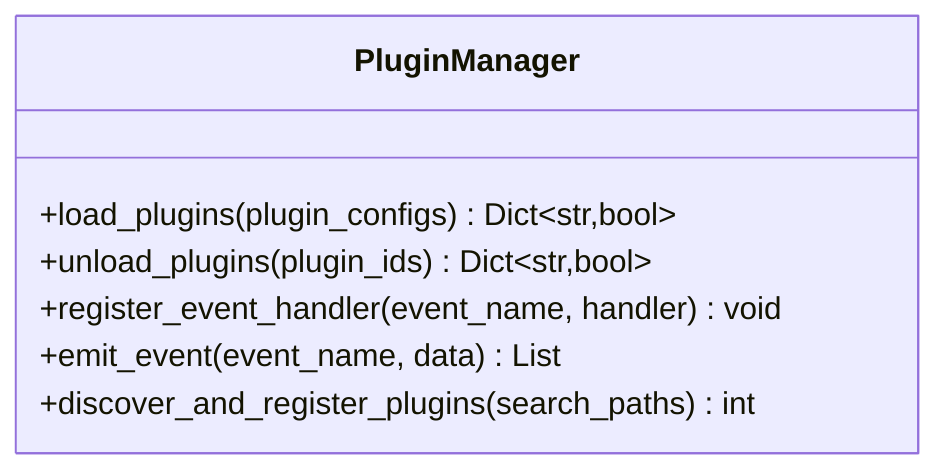

**图表来源**
- [manager.py:14-286](file://src/plugins/manager.py#L14-L286)

**章节来源**
- [manager.py:14-286](file://src/plugins/manager.py#L14-L286)

## 依赖分析
- 组件耦合与内聚
  - NecoRAG作为协调器，通过抽象基类与协议与子系统解耦；子系统内部模块化，职责单一。
  - 记忆层为检索层与巩固层提供统一数据源；交互层依赖记忆层与巩固层输出。
- 外部依赖与集成点
  - LLM客户端（Mock/第三方）通过抽象基类注入；向量/图数据库通过配置切换。
  - 知识演化与自适应学习通过回调与事件与核心流程集成。
- 循环依赖规避
  - 通过延迟导入与运行时装配避免循环依赖；插件系统通过注册表与拓扑排序管理依赖。

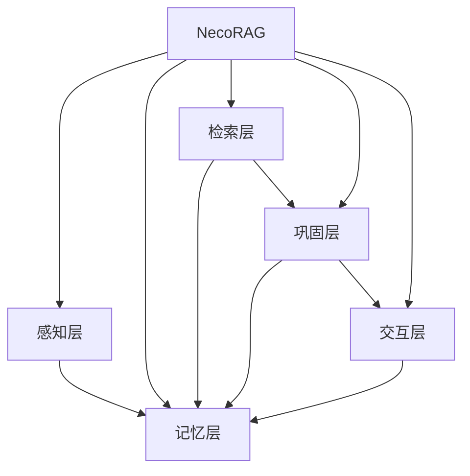

**图表来源**
- [necorag.py:112-135](file://src/necorag.py#L112-L135)

**章节来源**
- [necorag.py:112-135](file://src/necorag.py#L112-L135)

## 性能考虑
- 延迟初始化与按需加载：减少冷启动时间与内存占用。
- 早停机制：基于置信度与边际收益快速终止冗余检索，显著降低延迟。
- 异步回退：网络搜索回退与后台固化任务，提升用户体验与系统吞吐。
- 向量化与重排序：结合领域权重与新颖性惩罚，提升检索质量与稳定性。
- 记忆衰减与修剪：定期归档低价值内容，维持检索效率与存储成本平衡。

## 故障排除指南
- 常见异常类型
  - 感知层：解析/分块/编码错误
  - 记忆层：存储/向量/图存储错误
  - 检索层：检索/重排序错误
  - 巩固层：生成/幻觉/精炼错误
  - LLM相关：连接/限流/响应错误
  - 配置与验证：配置/校验错误
  - 知识演化：更新/候选/指标/调度/回滚错误
  - 自适应学习：反馈/策略优化/偏好预测错误
- 排查建议
  - 查看日志与异常详情字段，定位具体模块与错误码。
  - 检查配置项（LLM提供商、向量/图数据库、阈值等）是否正确。
  - 验证输入数据格式与协议字段完整性。
  - 使用NecoRAG提供的统计接口与仪表盘数据辅助诊断。

**章节来源**
- [exceptions.py:10-455](file://src/core/exceptions.py#L10-L455)

## 结论
NecoRAG以五层认知架构为核心，通过统一入口类实现模块化协调与延迟初始化，结合抽象基类与协议确保可替换性与一致性。配置管理、异常体系、知识演化与自适应学习进一步增强了系统的可运维性、可扩展性与智能化水平。该架构既适合快速原型开发，也具备生产级的性能与可靠性保障。

## 附录
- 架构决策的技术考量
  - 模块化与抽象：提升可测试性与可替换性，便于引入新模型与存储后端。
  - 延迟初始化：降低启动成本，按需加载资源。
  - 早停与重排序：在保证质量前提下最大化性能。
  - 知识演化与自适应学习：持续优化系统表现与用户体验。
- 扩展性设计
  - 插件系统支持第三方能力扩展。
  - 配置驱动与枚举类型便于新增提供商与策略。
  - 统一协议与抽象基类降低集成成本。