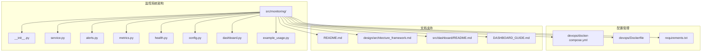
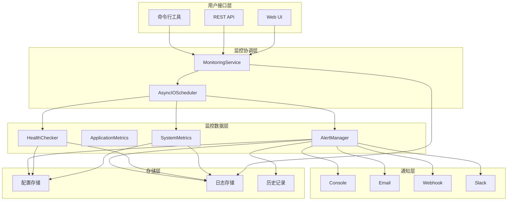
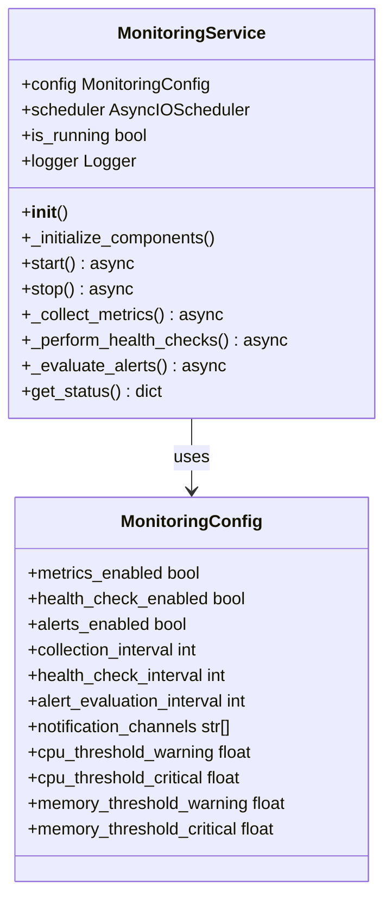
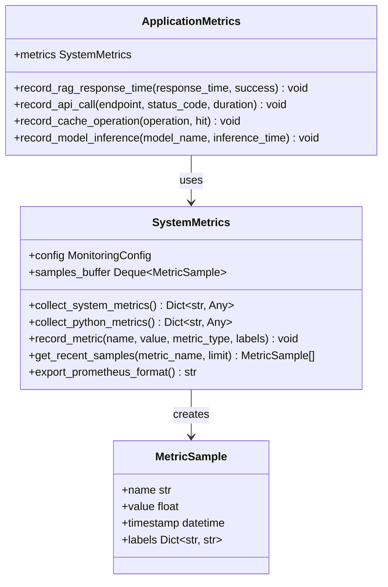
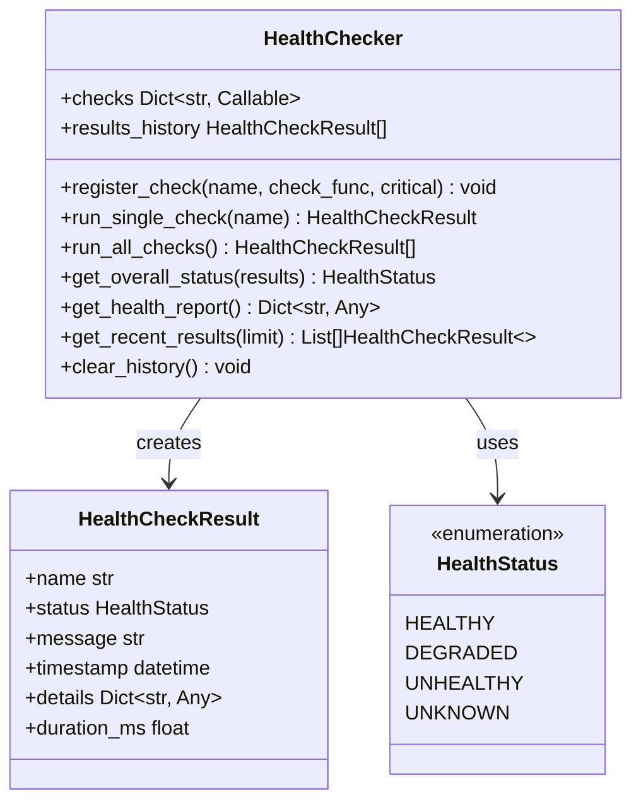
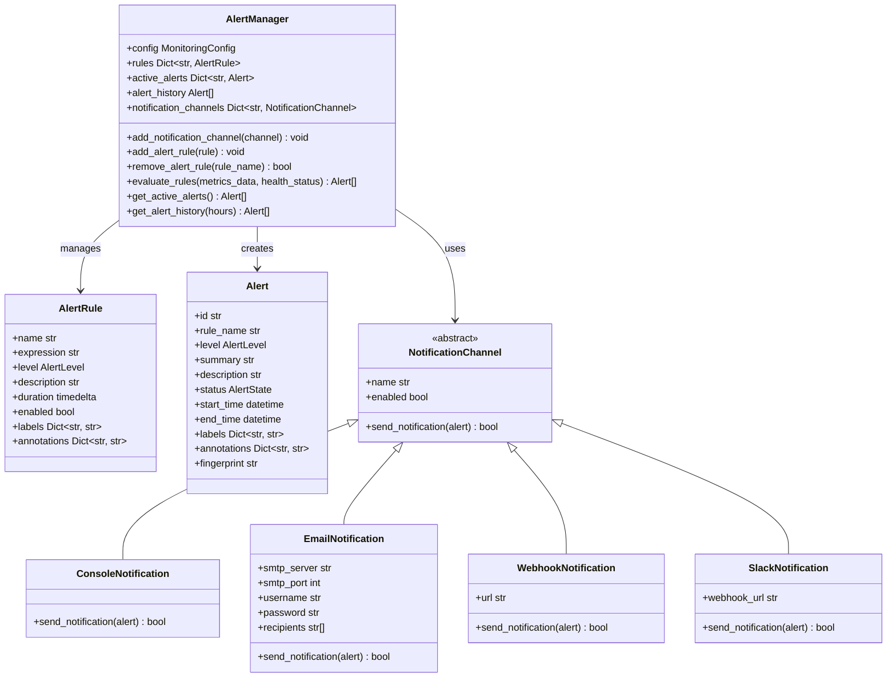
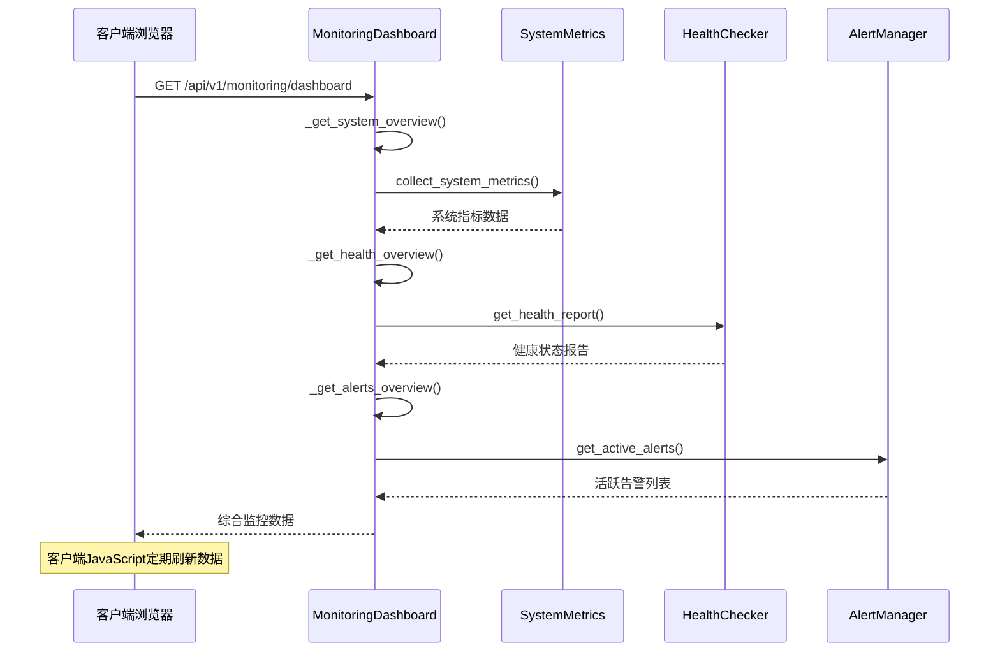
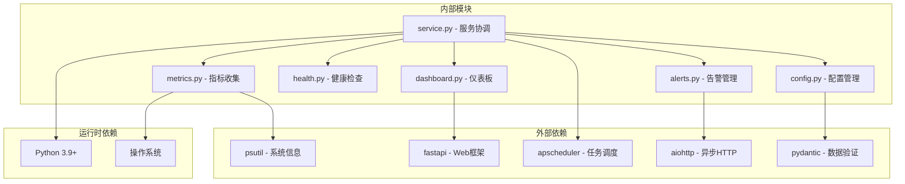

# 监控告警系统

<cite>
**本文档引用的文件**
- [src/monitoring/__init__.py](file://src/monitoring/__init__.py)
- [src/monitoring/service.py](file://src/monitoring/service.py)
- [src/monitoring/alerts.py](file://src/monitoring/alerts.py)
- [src/monitoring/metrics.py](file://src/monitoring/metrics.py)
- [src/monitoring/health.py](file://src/monitoring/health.py)
- [src/monitoring/config.py](file://src/monitoring/config.py)
- [src/monitoring/dashboard.py](file://src/monitoring/dashboard.py)
- [src/monitoring/example_usage.py](file://src/monitoring/example_usage.py)
- [devops/docker-compose.yml](file://devops/docker-compose.yml)
- [devops/Dockerfile](file://devops/Dockerfile)
- [requirements.txt](file://requirements.txt)
- [README.md](file://README.md)
- [design/architecture_framework.md](file://design/architecture_framework.md)
- [src/dashboard/README.md](file://src/dashboard/README.md)
- [DASHBOARD_GUIDE.md](file://DASHBOARD_GUIDE.md)
</cite>

## 目录
1. [简介](#简介)
2. [项目结构](#项目结构)
3. [核心组件](#核心组件)
4. [架构概览](#架构概览)
5. [详细组件分析](#详细组件分析)
6. [依赖关系分析](#依赖关系分析)
7. [性能考虑](#性能考虑)
8. [故障排除指南](#故障排除指南)
9. [结论](#结论)
10. [附录](#附录)

## 简介

NecoRAG 监控告警系统是一个全面的监控解决方案，专为神经认知检索增强生成框架设计。该系统提供了实时性能监控、健康检查、指标收集和告警通知功能，确保整个 NecoRAG 生态系统的稳定运行。

系统采用模块化设计，集成了多种监控组件，包括系统指标收集器、健康检查器、告警管理器和可视化仪表板。通过异步任务调度和多种通知渠道，系统能够及时发现和响应潜在问题。

## 项目结构

监控告警系统位于 `src/monitoring/` 目录下，采用清晰的模块化组织：



**图表来源**
- [src/monitoring/__init__.py:1-35](file://src/monitoring/__init__.py#L1-L35)
- [src/monitoring/service.py:1-214](file://src/monitoring/service.py#L1-L214)
- [devops/docker-compose.yml:1-164](file://devops/docker-compose.yml#L1-L164)

**章节来源**
- [src/monitoring/__init__.py:1-35](file://src/monitoring/__init__.py#L1-L35)
- [src/monitoring/service.py:1-214](file://src/monitoring/service.py#L1-L214)

## 核心组件

监控告警系统由以下核心组件构成：

### 1. 监控服务主控制器
`MonitoringService` 类作为整个监控系统的核心协调器，负责管理所有监控组件的生命周期和调度。

### 2. 指标收集系统
- `SystemMetrics`: 收集系统级指标（CPU、内存、磁盘、网络等）
- `ApplicationMetrics`: 收集应用特定指标（API调用、缓存操作、模型推理等）

### 3. 健康检查系统
`HealthChecker` 类提供全面的系统健康状态检查，包括数据库连接、Redis连接、LLM服务和磁盘空间检查。

### 4. 告警管理系统
`AlertManager` 类负责告警规则评估、告警状态管理和通知发送。

### 5. 可视化仪表板
`MonitoringDashboard` 提供Web界面，展示实时监控数据和系统状态。

**章节来源**
- [src/monitoring/service.py:21-174](file://src/monitoring/service.py#L21-L174)
- [src/monitoring/metrics.py:25-207](file://src/monitoring/metrics.py#L25-L207)
- [src/monitoring/health.py:34-300](file://src/monitoring/health.py#L34-L300)
- [src/monitoring/alerts.py:237-435](file://src/monitoring/alerts.py#L237-L435)
- [src/monitoring/dashboard.py:17-250](file://src/monitoring/dashboard.py#L17-L250)

## 架构概览

监控告警系统采用分层架构设计，确保各组件之间的松耦合和高内聚：



**图表来源**
- [src/monitoring/service.py:21-81](file://src/monitoring/service.py#L21-L81)
- [src/monitoring/alerts.py:237-275](file://src/monitoring/alerts.py#L237-L275)
- [src/monitoring/dashboard.py:17-25](file://src/monitoring/dashboard.py#L17-L25)

系统采用异步编程模型，使用 APScheduler 进行任务调度，确保监控操作不会阻塞主线程。

**章节来源**
- [src/monitoring/service.py:21-81](file://src/monitoring/service.py#L21-L81)
- [src/monitoring/config.py:27-117](file://src/monitoring/config.py#L27-L117)

## 详细组件分析

### 监控服务组件

`MonitoringService` 是监控系统的核心协调器，负责管理所有监控组件的初始化、启动和停止：



**图表来源**
- [src/monitoring/service.py:21-174](file://src/monitoring/service.py#L21-L174)
- [src/monitoring/config.py:27-117](file://src/monitoring/config.py#L27-L117)

### 指标收集组件

系统指标收集器提供全面的系统监控能力：



**图表来源**
- [src/monitoring/metrics.py:25-207](file://src/monitoring/metrics.py#L25-L207)

系统支持多种指标类型，包括CPU使用率、内存使用率、磁盘空间、网络IO、进程数量等系统级指标，以及RAG响应时间、API调用次数、缓存命中率等应用级指标。

**章节来源**
- [src/monitoring/metrics.py:25-207](file://src/monitoring/metrics.py#L25-L207)

### 健康检查组件

健康检查系统提供多维度的系统状态监控：



**图表来源**
- [src/monitoring/health.py:34-300](file://src/monitoring/health.py#L34-L300)

系统内置多个预定义的健康检查函数，包括数据库连接检查、Redis连接检查、LLM服务检查和磁盘空间检查。

**章节来源**
- [src/monitoring/health.py:34-300](file://src/monitoring/health.py#L34-L300)

### 告警管理系统

告警管理系统提供灵活的告警规则定义和通知机制：



**图表来源**
- [src/monitoring/alerts.py:237-435](file://src/monitoring/alerts.py#L237-L435)

系统支持多种通知渠道，包括控制台输出、邮件通知、Webhook回调和Slack消息。

**章节来源**
- [src/monitoring/alerts.py:237-435](file://src/monitoring/alerts.py#L237-L435)

### 仪表板组件

监控仪表板提供直观的可视化界面：



**图表来源**
- [src/monitoring/dashboard.py:82-148](file://src/monitoring/dashboard.py#L82-L148)

**章节来源**
- [src/monitoring/dashboard.py:17-250](file://src/monitoring/dashboard.py#L17-L250)

## 依赖关系分析

监控告警系统具有清晰的依赖层次结构：



**图表来源**
- [requirements.txt:1-71](file://requirements.txt#L1-L71)
- [src/monitoring/service.py:11-18](file://src/monitoring/service.py#L11-L18)

系统主要依赖于以下关键库：
- **psutil**: 系统信息收集和性能监控
- **fastapi**: Web服务框架和API开发
- **apscheduler**: 异步任务调度
- **aiohttp**: 异步HTTP客户端
- **pydantic**: 数据模型验证和序列化

**章节来源**
- [requirements.txt:1-71](file://requirements.txt#L1-L71)
- [src/monitoring/service.py:6-18](file://src/monitoring/service.py#L6-L18)

## 性能考虑

监控告警系统在设计时充分考虑了性能优化：

### 1. 异步编程模型
系统采用异步编程模式，使用 `asyncio` 和 `aiohttp` 确保非阻塞I/O操作，提高并发处理能力。

### 2. 内存管理
- 指标样本缓冲区使用 `deque` 实现，限制最大长度为1000个样本
- 告警历史记录自动清理，保留配置天数内的历史数据
- 健康检查结果历史限制为1000条记录

### 3. 调度优化
- 使用 APScheduler 进行任务调度，支持多种调度策略
- 可配置的收集间隔、健康检查间隔和告警评估间隔
- 异常处理确保单个组件故障不影响整体系统

### 4. 网络优化
- Webhook和Slack通知使用异步HTTP客户端
- 邮件通知使用连接池复用
- 健康检查超时控制防止长时间阻塞

## 故障排除指南

### 常见问题及解决方案

#### 1. 监控服务启动失败
**症状**: 监控服务无法启动，日志显示启动错误
**可能原因**:
- 端口被占用
- 配置文件格式错误
- 依赖库缺失

**解决方案**:
```bash
# 检查端口占用
netstat -tulpn | grep 8000

# 验证配置文件
python -c "from src.monitoring.config import get_monitoring_config; print(get_monitoring_config())"

# 安装缺失依赖
pip install -r requirements.txt
```

#### 2. 指标收集异常
**症状**: 指标数据为空或收集失败
**可能原因**:
- psutil库版本不兼容
- 权限不足访问系统信息
- 系统资源限制

**解决方案**:
```bash
# 检查psutil版本
pip show psutil

# 以管理员权限运行
sudo python -m src.monitoring.example_usage

# 检查系统资源
df -h
free -h
```

#### 3. 告警通知失败
**症状**: 告警规则触发但通知未送达
**可能原因**:
- SMTP服务器配置错误
- Webhook URL无效
- Slack webhook配置问题

**解决方案**:
```python
# 测试邮件通知
from src.monitoring.alerts import EmailNotification
email = EmailNotification(
    smtp_server="smtp.gmail.com",
    smtp_port=587,
    username="your_email@gmail.com",
    password="your_password",
    recipients=["admin@company.com"]
)
# 手动发送测试通知
```

#### 4. 仪表板无法访问
**症状**: 监控仪表板页面加载失败
**可能原因**:
- FastAPI应用未正确启动
- 静态文件路径错误
- CORS配置问题

**解决方案**:
```bash
# 检查服务状态
curl http://localhost:8000/status

# 验证路由配置
curl http://localhost:8000/api/v1/monitoring/dashboard

# 检查静态文件
ls -la src/monitoring/static/
```

### 日志分析

系统使用标准Python logging模块，支持多种日志级别：

```python
import logging

# 配置日志级别
logging.basicConfig(
    level=logging.INFO,
    format='%(asctime)s - %(name)s - %(levelname)s - %(message)s'
)

# 获取监控组件的日志器
logger = logging.getLogger('src.monitoring.service')
logger.info("监控服务启动成功")
```

**章节来源**
- [src/monitoring/service.py:38-98](file://src/monitoring/service.py#L38-L98)
- [src/monitoring/alerts.py:74-84](file://src/monitoring/alerts.py#L74-L84)

## 结论

NecoRAG监控告警系统是一个功能完整、设计合理的监控解决方案。系统采用模块化架构，提供了全面的监控能力，包括：

### 主要优势
1. **模块化设计**: 清晰的组件分离，便于维护和扩展
2. **异步架构**: 高性能的异步编程模型，支持高并发
3. **多维度监控**: 覆盖系统级和应用级指标
4. **灵活的通知**: 支持多种通知渠道
5. **可视化界面**: 直观的Web仪表板
6. **配置管理**: 灵活的配置选项和环境管理

### 技术特点
- 基于Python 3.9+的现代异步编程
- 使用FastAPI构建高性能Web服务
- 集成多种监控和告警机制
- 支持容器化部署
- 提供完整的API接口

### 应用场景
该监控系统适用于：
- 生产环境的持续监控
- 开发环境的调试和测试
- 性能基准测试和优化
- 故障诊断和问题排查

系统为NecoRAG框架提供了坚实的监控基础设施，确保整个神经认知RAG系统的稳定运行和高效性能。

## 附录

### 配置参数参考

| 配置项 | 类型 | 默认值 | 说明 |
|--------|------|--------|------|
| metrics_enabled | bool | True | 是否启用指标收集 |
| health_check_enabled | bool | True | 是否启用健康检查 |
| alerts_enabled | bool | True | 是否启用告警功能 |
| collection_interval | int | 15 | 指标收集间隔（秒） |
| health_check_interval | int | 30 | 健康检查间隔（秒） |
| alert_evaluation_interval | int | 60 | 告警评估间隔（秒） |
| cpu_threshold_warning | float | 80.0 | CPU警告阈值（%） |
| cpu_threshold_critical | float | 95.0 | CPU严重阈值（%） |
| memory_threshold_warning | float | 85.0 | 内存警告阈值（%） |
| memory_threshold_critical | float | 95.0 | 内存严重阈值（%） |

### 部署建议

1. **硬件要求**: 至少4GB RAM，推荐8GB以上
2. **网络配置**: 确保端口8000开放
3. **存储空间**: 至少1GB可用空间
4. **安全配置**: 生产环境建议启用HTTPS和认证

### 扩展指南

系统支持自定义扩展：
- 添加新的指标收集器
- 实现自定义健康检查
- 开发新的通知渠道
- 集成第三方监控平台