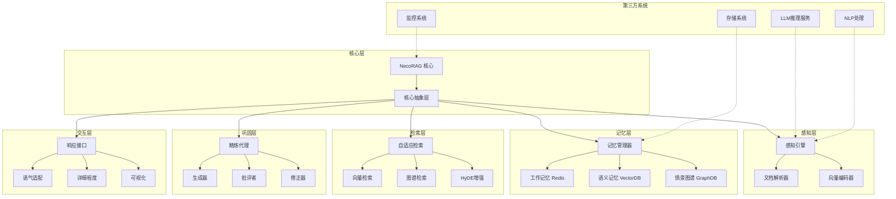
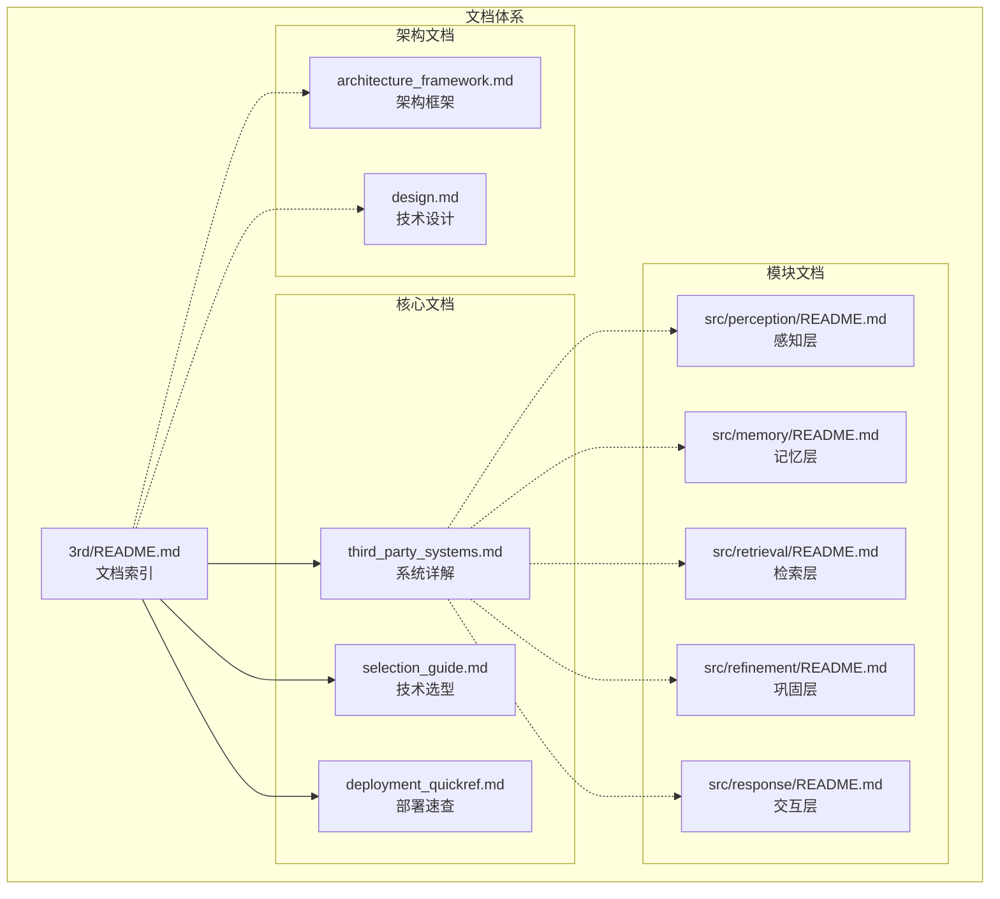
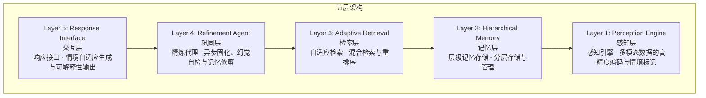
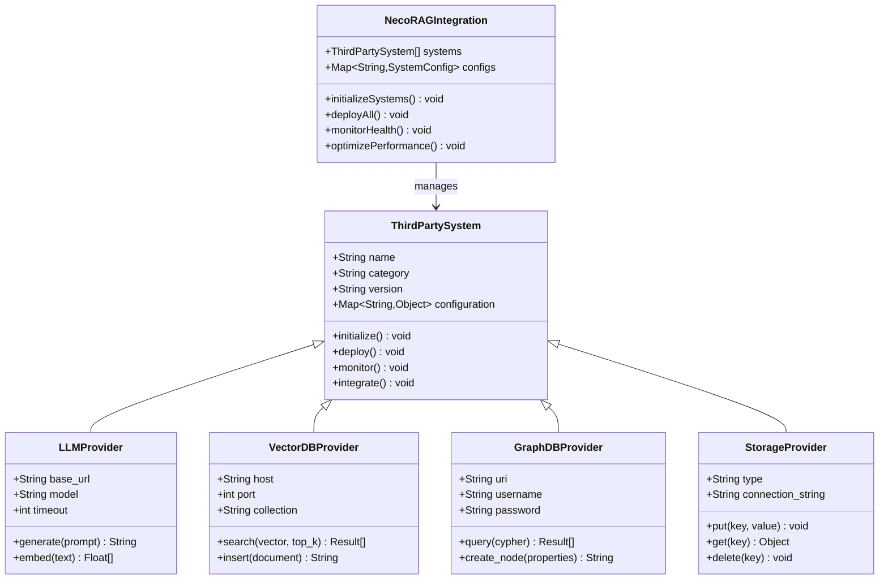
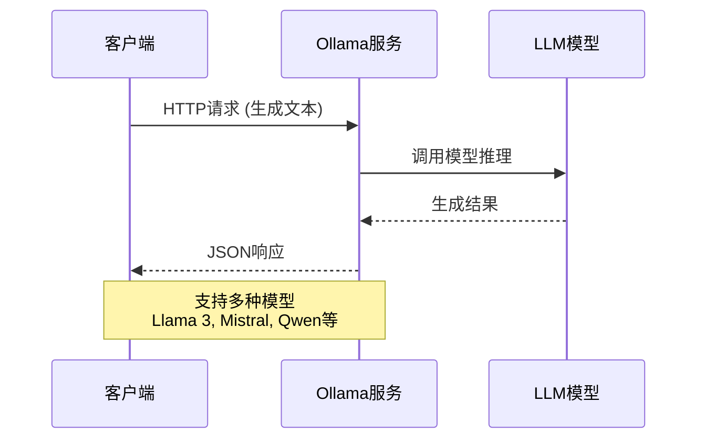
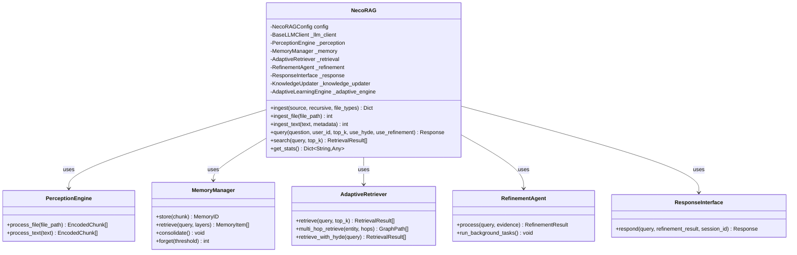
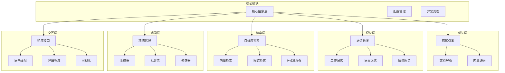
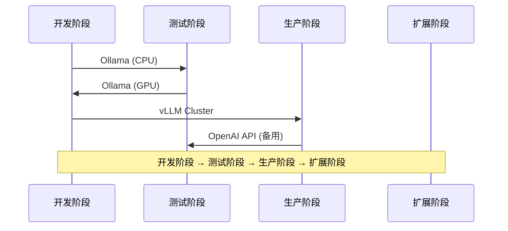

# 第三方系统集成文档体系

<cite>
**本文档引用的文件**
- [README.md](file://README.md)
- [3rd/README.md](file://3rd/README.md)
- [3rd/STRUCTURE.md](file://3rd/STRUCTURE.md)
- [3rd/third_party_systems.md](file://3rd/third_party_systems.md)
- [3rd/selection_guide.md](file://3rd/selection_guide.md)
- [3rd/deployment_quickref.md](file://3rd/deployment_quickref.md)
- [design/architecture_framework.md](file://design/architecture_framework.md)
- [src/necorag.py](file://src/necorag.py)
- [src/__init__.py](file://src/__init__.py)
- [src/perception/README.md](file://src/perception/README.md)
- [src/memory/README.md](file://src/memory/README.md)
- [src/retrieval/README.md](file://src/retrieval/README.md)
- [src/refinement/README.md](file://src/refinement/README.md)
- [src/response/README.md](file://src/response/README.md)
- [opdev/Dockerfile](file://opdev/Dockerfile)
- [requirements.txt](file://requirements.txt)
- [pyproject.toml](file://pyproject.toml)
</cite>

## 更新摘要
**变更内容**
- 新增完整的第三方系统文档体系，包含14+个核心系统详解
- 更新文档结构说明，形成114KB技术文档体系
- 新增部署配置速查表和整体架构框架文档
- 完善技术选型指南和集成开发最佳实践

## 目录
1. [项目概述](#项目概述)
2. [文档体系结构](#文档体系结构)
3. [核心架构与集成模式](#核心架构与集成模式)
4. [第三方系统分类详解](#第三方系统分类详解)
5. [技术选型指南](#技术选型指南)
6. [部署配置速查](#部署配置速查)
7. [模块集成架构](#模块集成架构)
8. [性能与监控](#性能与监控)
9. [故障排查与运维](#故障排查与运维)
10. [最佳实践与迁移策略](#最佳实践与迁移策略)
11. [总结](#总结)

## 项目概述

NecoRAG是一个创新的认知型RAG框架，模拟人脑的双系统记忆理论和神经认知科学原理。该项目采用"五层认知"分层架构，通过可插拔的第三方系统集成模式，实现了从感知到交互的完整认知闭环。

### 核心特性

- **类脑记忆结构**：三层记忆系统（工作记忆 L1 + 语义记忆 L2 + 情景图谱 L3）
- **智能早停机制**：Early Termination 策略精准捕捉关键信息
- **自我反思能力**：Refinement Agent 幻觉自检与知识进化
- **可解释性输出**：思维链可视化，展示推理过程
- **配置管理系统**：Web Dashboard 实时配置和监控

### 技术栈

项目采用模块化设计，支持多种第三方系统的灵活组合：



**图表来源**
- [README.md:35-85](file://README.md#L35-L85)
- [src/necorag.py:43-135](file://src/necorag.py#L43-L135)

**章节来源**
- [README.md:23-85](file://README.md#L23-L85)
- [3rd/README.md:10-50](file://3rd/README.md#L10-L50)

## 文档体系结构

### 文档层次结构



**图表来源**
- [3rd/STRUCTURE.md:9-73](file://3rd/STRUCTURE.md#L9-L73)
- [3rd/README.md:16-22](file://3rd/README.md#L16-L22)

### 文档统计信息

| 文档 | 大小 | 字数 | 章节数 | 代码示例 | 推荐指数 |
|------|------|------|--------|---------|---------|
| **README.md** | 12KB | ~3,000 | 8 | 5 | ⭐⭐⭐⭐⭐ |
| **third_party_systems.md** | 55KB | ~15,000 | 14 | 50+ | ⭐⭐⭐⭐⭐ |
| **selection_guide.md** | 26KB | ~8,000 | 10 | 20+ | ⭐⭐⭐⭐ |
| **deployment_quickref.md** | 21KB | ~6,000 | 8 | 30+ | ⭐⭐⭐⭐⭐ |
| **总计** | **114KB** | **~32,000** | **40** | **105+** | **-** |

**章节来源**
- [3rd/STRUCTURE.md:77-86](file://3rd/STRUCTURE.md#L77-L86)

## 核心架构与集成模式

### 五层认知架构

NecoRAG采用"五层认知"分层架构，每一层对应人脑认知机制的不同阶段：



**图表来源**
- [README.md:39-85](file://README.md#L39-L85)

### 可插拔集成架构

项目采用可插拔架构设计，支持多种第三方系统的灵活组合：



**图表来源**
- [src/necorag.py:12-37](file://src/necorag.py#L12-L37)
- [src/__init__.py:12-50](file://src/__init__.py#L12-L50)

**章节来源**
- [README.md:35-85](file://README.md#L35-L85)
- [3rd/third_party_systems.md:25-61](file://3rd/third_party_systems.md#L25-L61)

## 第三方系统分类详解

### AI/ML 模型服务

#### LLM 推理服务

**Ollama（推荐 - 本地部署）**

Ollama作为本地LLM推理服务，提供多种模型支持：



**图表来源**
- [3rd/third_party_systems.md:78-111](file://3rd/third_party_systems.md#L78-L111)

**vLLM（高性能 - 生产环境）**

vLLM提供高吞吐、低延迟的LLM推理服务：

| 模型 | 显存需求 | 生成速度 | 适用场景 |
|------|---------|---------|---------|
| Llama 3 8B | 6GB | ~40 tokens/s | 通用对话、简单生成 |
| Llama 3 70B | 40GB | ~15 tokens/s | 复杂推理、高质量生成 |
| Mistral 7B | 5GB | ~45 tokens/s | 快速响应、资源受限 |
| Qwen 7B | 5GB | ~40 tokens/s | 中文优化场景 |

**章节来源**
- [3rd/third_party_systems.md:66-171](file://3rd/third_party_systems.md#L66-L171)

#### 向量数据库

**Qdrant（⭐ 强烈推荐）**

Qdrant作为向量数据库，具有以下技术优势：

```rust
// HNSW 索引实现（Rust）
pub struct HNSWIndex {
    m: usize,              // 连接数，默认 16
    ef_construct: usize,   // 构建精度，默认 100
    max_layers: usize,     // 最大层数
}

// 性能特点:
// - 亿级向量检索：< 50ms
// - 百万级向量检索：< 10ms
// - 支持标量量化，减少 4 倍内存
```

**Milvus** 和 **Weaviate** 作为备选方案，各有特色功能。

**章节来源**
- [3rd/third_party_systems.md:123-247](file://3rd/third_party_systems.md#L123-L247)

#### 文档处理系统

**RAGFlow（深度文档解析）**

RAGFlow提供深度文档解析能力：

- 支持 OCR（光学字符识别）
- 表格结构还原
- 文档层级分析
- 支持多种文档格式：PDF、Word、Markdown、HTML 等

**章节来源**
- [3rd/third_party_systems.md:248-350](file://3rd/third_party_systems.md#L248-L350)

### 数据存储系统

#### L1 工作记忆（Redis）

- **存储内容**：当前会话上下文、用户意图轨迹
- **特性**：极低延迟访问，TTL自动过期
- **容量管理**：LRU淘汰策略，防止内存溢出

#### L2 语义记忆（Qdrant/Milvus）

- **存储内容**：高维向量、稠密向量、稀疏向量
- **特性**：支持混合搜索（向量+关键词）
- **索引优化**：HNSW算法，毫秒级检索

#### L3 情景图谱（Neo4j/NebulaGraph）

- **存储内容**：实体、关系、属性、事件
- **特性**：支持Cypher查询，多跳推理
- **图谱类型**：知识图谱、事件图谱、因果图谱

**章节来源**
- [3rd/third_party_systems.md:351-500](file://3rd/third_party_systems.md#L351-L500)

### 任务调度系统

#### APScheduler（定时任务）

APScheduler提供定时任务调度功能：

- 支持多种调度策略
- 支持任务持久化
- 支持任务监控

#### Celery（分布式任务队列）

Celery提供分布式任务队列功能：

- 支持任务分发
- 支持任务重试
- 支持任务监控

**章节来源**
- [3rd/third_party_systems.md:501-600](file://3rd/third_party_systems.md#L501-L600)

### 监控运维系统

#### Prometheus（指标采集）

Prometheus提供指标采集功能：

- 支持多维度指标
- 支持告警规则
- 支持指标存储

#### Grafana（可视化面板）

Grafana提供可视化面板功能：

- 支持多种图表类型
- 支持仪表板定制
- 支持告警通知

**章节来源**
- [3rd/third_party_systems.md:601-700](file://3rd/third_party_systems.md#L601-L700)

## 技术选型指南

### 快速选型决策树

```mermaid
flowchart TD
Start[开始选型] --> Scenario[需求场景？]
Scenario --> DevTest[开发测试]
Scenario --> SmallProd[小规模生产<br/>(< 100 QPS)]
Scenario --> LargeProd[大规模生产<br/>(> 100 QPS)]
DevTest --> Budget1[预算限制？]
SmallProd --> Budget2[预算限制？]
LargeProd --> Budget3[预算限制？]
Budget1 --> ZeroBudget[零预算]
Budget1 --> LimitedBudget[有限预算]
Budget1 --> FullBudget[充足预算]
Budget2 --> ZeroBudget
Budget2 --> LimitedBudget
Budget2 --> FullBudget
Budget3 --> ZeroBudget
Budget3 --> LimitedBudget
Budget3 --> FullBudget
ZeroBudget --> Local[本地部署<br/>Ollama + Qdrant + Neo4j]
LimitedBudget --> Cloud[云服务<br/>混合方案]
FullBudget --> Commercial[商业服务<br/>全链路]
Local --> Team[团队技能？]
Cloud --> Team
Commercial --> Team
Team --> Python[Python为主<br/>Rasa + spaCy + FastAPI]
Team --> Java[Java为主<br/>OpenNLP + Spring Boot]
Team --> Neutral[无特定偏好<br/>推荐技术栈]
```

**图表来源**
- [3rd/selection_guide.md:26-48](file://3rd/selection_guide.md#L26-L48)

### 候选方案对比

#### LLM推理服务选型

| 方案 | 类型 | 优点 | 缺点 | 适用场景 | 成本 |
|------|------|------|------|---------|------|
| **Ollama** | 本地推理 | ✅ 部署简单<br/>✅ 模型丰富<br/>✅ 免费开源<br/>✅ 隐私安全 | ❌ 性能中等<br/>❌ 需自备 GPU | 开发测试<br/>中小规模生产 | 💰💰<br/>(GPU 硬件) |
| **vLLM** | 本地推理 | ✅ 性能极强<br/>✅ 高吞吐<br/>✅ 显存优化<br/>✅ OpenAI 兼容 | ❌ 配置复杂<br/>❌ 多 GPU 需求 | 大规模生产<br/>高并发场景 | 💰💰💰<br/>(多 GPU) |
| **OpenAI API** | 云服务 | ✅ 质量最高<br/>✅ 无需运维<br/>✅ 弹性伸缩<br/>✅ 最新模型 | ❌ 成本高<br/>❌ 数据出境<br/>❌ 网络延迟 | 快速原型<br/>高质量需求<br/>海外业务 | 💰💰💰💰<br/>($0.03/1K tokens) |
| **智谱 AI** | 云服务 | ✅ 中文优化<br/>✅ 国内合规<br/>✅ 价格适中<br/>✅ 响应快速 | ❌ 国际支持弱<br/>❌ 模型选择少 | 国内应用<br/>中文场景 | 💰💰💰<br/>(¥0.05/1K tokens) |

#### 向量数据库选型

| 方案 | 类型 | 优点 | 缺点 | 性能指标 | 成本 |
|------|------|------|------|---------|------|
| **Qdrant** | 开源 | ✅ Rust 编写，性能强<br/>✅ HNSW 索引高效<br/>✅ 过滤查询优秀<br/>✅ 支持分布式 | ❌ 社区相对小<br/>❌ 文档较少 | 检索：< 10ms<br/>写入：~5K/s<br/>内存：中等 | 💰💰<br/>(开源免费) |
| **Milvus** | 开源 | ✅ 功能最全<br/>✅ 社区活跃<br/>✅ 生态完善<br/>✅ 支持多种索引 | ❌ 架构复杂<br/>❌ 运维成本高 | 检索：< 5ms<br/>写入：~10K/s<br/>内存：较高 | 💰💰💰<br/>(企业版收费) |
| **Weaviate** | 开源 | ✅ GraphQL 接口<br/>✅ 内置分类器<br/>✅ 模块化设计<br/>✅ 文档友好 | ❌ 性能一般<br/>❌ Go 语言生态 | 检索：< 20ms<br/>写入：~3K/s<br/>内存：较低 | 💰💰<br/>(开源免费) |
| **Pinecone** | 云服务 | ✅ 完全托管<br/>✅ 自动扩展<br/>✅ 零运维<br/>✅ Serverless | ❌ 价格昂贵<br/>❌ 数据托管<br/>❌ 锁定风险 | 检索：< 50ms<br/>写入：~1K/s<br/>内存：按需 | 💰💰💰💰<br/>($0.04/小时) |

**章节来源**
- [3rd/selection_guide.md:52-247](file://3rd/selection_guide.md#L52-L247)

## 部署配置速查

### 一键启动脚本

#### 开发环境（全部组件）

```bash
#!/bin/bash
# scripts/start-dev.sh

set -e

echo "🚀 Starting NecoRAG Development Environment..."

# 创建必要目录
mkdir -p data/{redis,qdrant,neo4j,ollama,ragflow}
mkdir -p logs/{necorag,ollama,qdrant,neo4j}
mkdir -p models/{bge-m3,reranker,rasa}

# 启动所有服务
docker-compose -f docker-compose.dev.yml up -d

# 等待服务就绪
echo "⏳ Waiting for services to be ready..."
sleep 30

# 检查服务状态
echo "📊 Service Status:"
docker-compose -f docker-compose.dev.yml ps

# 拉取 Ollama 模型
echo "📥 Pulling Ollama model..."
docker exec ollama ollama pull llama3

echo "✅ All services started successfully!"
```

#### 生产环境（优化配置）

```bash
#!/bin/bash
# scripts/start-prod.sh

set -e

echo "🚀 Starting NecoRAG Production Environment..."

# 设置资源限制
export OLLAMA_NUM_GPU=1
export OLLAMA_MAX_VRAM=24GB
export QDRANT_MAX_MEMORY=8GB
export NEO4J_HEAP_MAX=4G

# 启动服务
docker-compose -f docker-compose.prod.yml up -d

# 健康检查
echo "🏥 Running health checks..."
```

**章节来源**
- [3rd/deployment_quickref.md:21-133](file://3rd/deployment_quickref.md#L21-L133)

### 各组件独立部署

#### Ollama（LLM 推理）

**Docker 部署**

```bash
# 基础部署
docker run -d \
  --name ollama \
  -p 11434:11434 \
  -v ollama_data:/root/.ollama \
  ollama/ollama:latest

# GPU 加速（NVIDIA）
docker run -d \
  --gpus all \
  --name ollama \
  -p 11434:11434 \
  -v ollama_data:/root/.ollama \
  -e OLLAMA_KEEP_ALIVE=24h \
  ollama/ollama:latest
```

**Kubernetes 部署**

```yaml
# k8s/ollama-deployment.yaml
apiVersion: apps/v1
kind: Deployment
metadata:
  name: ollama
spec:
  replicas: 1
  selector:
    matchLabels:
      app: ollama
  template:
    metadata:
      labels:
        app: ollama
    spec:
      containers:
      - name: ollama
        image: ollama/ollama:latest
        ports:
        - containerPort: 11434
        resources:
          limits:
            nvidia.com/gpu: 1
            memory: 24Gi
          requests:
            nvidia.com/gpu: 1
            memory: 16Gi
        volumeMounts:
        - name: ollama-data
          mountPath: /root/.ollama
```

**章节来源**
- [3rd/deployment_quickref.md:136-200](file://3rd/deployment_quickref.md#L136-L200)

### 端口速查表

| 服务 | 端口 | 用途 | 说明 |
|------|------|------|------|
| NecoRAG API | 8000 | Web API | Dashboard 和服务接口 |
| Ollama | 11434 | LLM 推理 | 本地模型服务 |
| Qdrant | 6333 | 向量数据库 | 检索服务 |
| Neo4j | 7474 | 图数据库 | Web界面 |
| Neo4j | 7687 | 图数据库 | Bolt协议 |
| Redis | 6379 | 缓存服务 | 工作记忆 |
| Prometheus | 9090 | 监控指标 | 指标采集 |
| Grafana | 3000 | 可视化面板 | 数据展示 |
| RAGFlow | 8000 | 文档解析 | 深度解析服务 |
| Rasa | 5005 | NLP服务 | 意图识别 |

**章节来源**
- [3rd/deployment_quickref.md:8-18](file://3rd/deployment_quickref.md#L8-L18)

## 模块集成架构

### 统一入口类设计

NecoRAG采用统一入口类设计，提供简洁的API：



**图表来源**
- [src/necorag.py:43-135](file://src/necorag.py#L43-L135)

### 模块依赖关系



**图表来源**
- [src/__init__.py:12-121](file://src/__init__.py#L12-L121)

**章节来源**
- [src/necorag.py:12-37](file://src/necorag.py#L12-L37)
- [src/__init__.py:9-213](file://src/__init__.py#L9-L213)

## 性能与监控

### 性能基准测试

#### 检索性能指标

| 指标 | 目标值 | 说明 |
|------|--------|------|
| 简单查询延迟 | < 200ms | 纯向量检索 |
| 复杂查询延迟 | < 800ms | 多跳+重排 |
| Recall@10 | > 85% | 前10结果召回率 |
| NDCG@10 | > 0.8 | 排序质量 |

#### 记忆性能指标

| 层级 | 写入延迟 | 检索延迟 | 容量 |
|------|----------|----------|------|
| L1 | < 5ms | < 2ms | 10万条 |
| L2 | < 50ms | < 100ms | 千万级 |
| L3 | < 100ms | < 500ms | 亿级节点 |

#### 系统性能指标

| 指标 | 目标值 | 说明 |
|------|--------|------|
| 检索准确率 (Recall@K) | +20% | 相比传统 Vector RAG |
| 幻觉率 | < 5% | 通过 Refinement Agent |
| 简单查询延迟 | < 800ms | 首字延迟 |
| 复杂查询延迟 | < 1500ms | 多跳+重排 |
| 上下文压缩率 | -40% | 通过记忆衰减 |

### 监控系统集成

#### Prometheus 指标采集

```yaml
# prometheus.yml
scrape_configs:
  - job_name: 'necorag'
    static_configs:
      - targets: ['localhost:8000']
    metrics_path: '/metrics'
    scrape_interval: 15s
```

#### Grafana 仪表板

Grafana提供可视化面板，展示关键性能指标：

- 系统健康状态
- 查询性能指标
- 存储使用情况
- LLM推理统计

**章节来源**
- [README.md:465-474](file://README.md#L465-L474)
- [3rd/third_party_systems.md:601-700](file://3rd/third_party_systems.md#L601-L700)

## 故障排查与运维

### 常见问题排查

#### LLM 推理服务问题

**Ollama 模型加载失败**

```bash
# 检查模型状态
docker exec ollama ollama list

# 拉取缺失模型
docker exec ollama ollama pull llama3

# 查看模型详情
docker exec ollama ollama show llama3
```

#### 向量数据库问题

**Qdrant 集合创建失败**

```bash
# 检查集合状态
curl http://localhost:6333/collections

# 创建集合
curl -X PUT "http://localhost:6333/collections/necorag" \
  -H "Content-Type: application/json" \
  -d '{
    "vectors": {
      "size": 1024,
      "distance": "Cosine"
    }
  }'
```

#### 图数据库问题

**Neo4j 连接超时**

```bash
# 检查 Neo4j 状态
docker-compose ps neo4j

# 查看日志
docker-compose logs neo4j

# 重启服务
docker-compose restart neo4j
```

#### 缓存服务问题

**Redis 内存不足**

```bash
# 检查内存使用
redis-cli INFO memory

# 查看慢查询日志
redis-cli SLOWLOG GET 10

# 清理过期键
redis-cli DEBUG OBJECT <key>
```

### 健康检查脚本

```bash
#!/bin/bash
# health-check.sh

echo "🏥 Running NecoRAG Health Check..."

# 检查 NecoRAG API
if curl -f -s http://localhost:8000/health >/dev/null; then
    echo "✅ NecoRAG API: OK"
else
    echo "❌ NecoRAG API: FAILED"
fi

# 检查 Ollama
if curl -f -s http://localhost:11434/api/tags >/dev/null; then
    echo "✅ Ollama: OK"
else
    echo "❌ Ollama: FAILED"
fi

# 检查 Qdrant
if curl -f -s http://localhost:6333/ >/dev/null; then
    echo "✅ Qdrant: OK"
else
    echo "❌ Qdrant: FAILED"
fi

# 检查 Neo4j
if curl -f -s http://localhost:7474/ >/dev/null; then
    echo "✅ Neo4j: OK"
else
    echo "❌ Neo4j: FAILED"
fi

echo "✅ Health check completed!"
```

**章节来源**
- [3rd/deployment_quickref.md:1-200](file://3rd/deployment_quickref.md#L1-L200)

## 最佳实践与迁移策略

### 迁移路径



**图表来源**
- [3rd/selection_guide.md:106-119](file://3rd/selection_guide.md#L106-L119)

### 环境配置最佳实践

#### 开发环境配置

```yaml
# .env.development
# LLM 配置
OLLAMA_BASE_URL=http://localhost:11434
OLLAMA_MODEL=llama3

# 存储配置
REDIS_URL=redis://localhost:6379
QDRANT_URL=http://localhost:6333
NEO4J_URI=bolt://localhost:7687

# 日志配置
LOG_LEVEL=DEBUG
LOG_FILE=logs/necorag.log

# 性能配置
MAX_WORKERS=4
BATCH_SIZE=32
```

#### 生产环境配置

```yaml
# .env.production
# LLM 配置
OLLAMA_BASE_URL=http://ollama:11434
OLLAMA_MODEL=llama3:70b

# 存储配置
REDIS_URL=redis://redis:6379
QDRANT_URL=http://qdrant:6333
NEO4J_URI=bolt://neo4j:7687

# 监控配置
PROMETHEUS_EXPORTER=true
GRAFANA_URL=http://grafana:3000

# 安全配置
ENABLE_SSL=true
ENABLE_AUTH=true
```

### 性能优化策略

#### 缓存优化

```python
# 缓存策略配置
CACHE_STRATEGY = {
    'l1_cache': {
        'ttl': 3600,  # 1小时
        'max_size': 10000,
        'eviction_policy': 'lru'
    },
    'l2_cache': {
        'ttl': 86400,  # 24小时
        'max_size': 1000000,
        'eviction_policy': 'lfu'
    }
}
```

#### 并行处理优化

```python
# 并行处理配置
PARALLEL_CONFIG = {
    'max_workers': 8,
    'queue_size': 1000,
    'batch_size': 64,
    'timeout': 30
}
```

**章节来源**
- [3rd/selection_guide.md:104-119](file://3rd/selection_guide.md#L104-L119)
- [3rd/deployment_quickref.md:1-200](file://3rd/deployment_quickref.md#L1-200)

## 总结

NecoRAG的第三方系统集成文档体系提供了全面的技术解决方案，涵盖了从技术选型到部署运维的完整生命周期。通过可插拔的架构设计和详细的集成指南，开发者可以灵活选择最适合的第三方系统组合，构建高性能的认知型RAG应用。

### 核心价值

1. **灵活性**：支持多种第三方系统的灵活组合
2. **可扩展性**：模块化设计便于功能扩展
3. **易用性**：提供详细的配置指南和部署脚本
4. **可靠性**：完善的监控和故障排查机制
5. **性能**：针对不同场景的性能优化建议

### 未来发展方向

1. **Kubernetes 部署专题**：提供更完善的容器化部署方案
2. **性能调优最佳实践**：持续优化系统性能指标
3. **故障排查案例库**：积累更多实际问题的解决方案
4. **多语言支持**：扩展文档的国际化支持

通过遵循本集成文档体系，团队可以快速搭建稳定可靠的NecoRAG应用，充分发挥认知型RAG框架的技术优势。