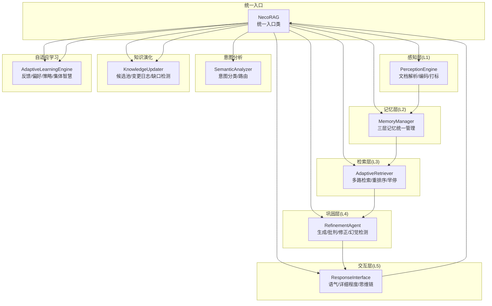
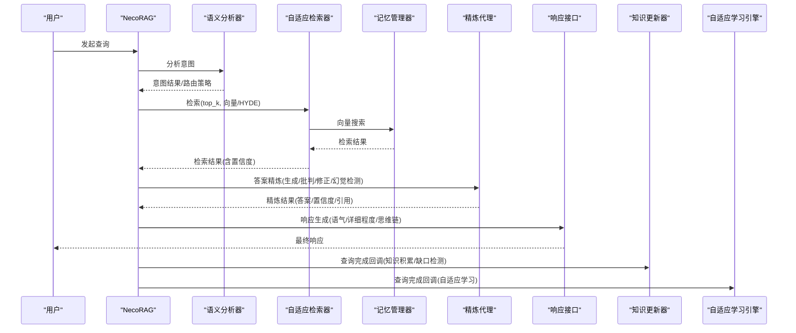
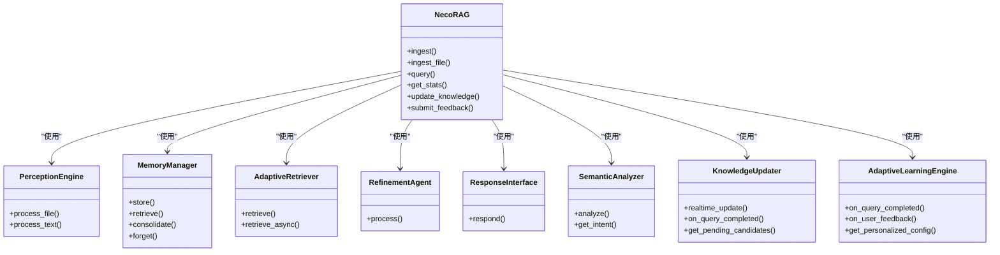

# 组件间关系与数据流

<cite>
**本文档引用的文件**
- [necorag.py](file://src/necorag.py)
- [base.py](file://src/core/base.py)
- [engine.py](file://src/perception/engine.py)
- [manager.py](file://src/memory/manager.py)
- [retriever.py](file://src/retrieval/retriever.py)
- [agent.py](file://src/refinement/agent.py)
- [interface.py](file://src/response/interface.py)
- [semantic_analyzer.py](file://src/intent/semantic_analyzer.py)
- [updater.py](file://src/knowledge_evolution/updater.py)
- [engine.py](file://src/adaptive/engine.py)
- [protocols.py](file://src/core/protocols.py)
- [models.py](file://src/perception/models.py)
- [models.py](file://src/memory/models.py)
</cite>

## 目录
1. [简介](#简介)
2. [项目结构](#项目结构)
3. [核心组件](#核心组件)
4. [架构总览](#架构总览)
5. [详细组件分析](#详细组件分析)
6. [依赖关系分析](#依赖关系分析)
7. [性能考量](#性能考量)
8. [故障排查指南](#故障排查指南)
9. [结论](#结论)

## 简介
本文件面向NecoRAG的组件间关系与数据流，系统性梳理从感知层的文档解析到记忆层的存储，再到检索层的查询处理，以及从意图分析、智能路由、多路检索、答案精炼到最终响应生成的完整数据流。文档同时提供调用栈跟踪、数据结构转换示例、组件解耦设计与接口抽象说明，并附带架构图与时序图帮助理解。

## 项目结构
NecoRAG采用五层认知架构（L1感知、L2记忆、L3检索、L4巩固、L5交互），通过统一入口类协调各层组件，形成“文档导入—检索—精炼—响应”的闭环。

图表来源
- [necorag.py:51-148](file://src/necorag.py#L51-L148)
- [engine.py:20-76](file://src/perception/engine.py#L20-L76)
- [manager.py:20-51](file://src/memory/manager.py#L20-L51)
- [retriever.py:135-182](file://src/retrieval/retriever.py#L135-L182)
- [agent.py:20-64](file://src/refinement/agent.py#L20-L64)
- [interface.py:20-58](file://src/response/interface.py#L20-L58)
- [semantic_analyzer.py:24-67](file://src/intent/semantic_analyzer.py#L24-L67)
- [updater.py:24-78](file://src/knowledge_evolution/updater.py#L24-L78)
- [engine.py:30-82](file://src/adaptive/engine.py#L30-L82)

章节来源
- [necorag.py:51-148](file://src/necorag.py#L51-L148)

## 核心组件
- 统一入口类：负责组件初始化、文档导入、查询处理、知识演化与自适应学习的协调。
- 感知引擎：文档解析、文本分块、向量编码、情境标签生成。
- 记忆管理器：统一管理L1工作记忆、L2语义记忆、L3情景图谱三层记忆。
- 自适应检索器：多路检索、重排序、领域权重、HyDE增强、早停控制。
- 精炼代理：生成、批判、修正、幻觉检测与知识固化/修剪。
- 响应接口：语气/详细程度适配、思维链可视化、用户画像更新。
- 语义分析器：意图分类、路由策略、检索参数建议。
- 知识更新器：候选池管理、变更日志、缺口检测、增量更新。
- 自适应学习引擎：反馈收集、偏好预测、策略优化、集体智慧。

章节来源
- [necorag.py:51-148](file://src/necorag.py#L51-L148)
- [base.py:30-800](file://src/core/base.py#L30-L800)
- [protocols.py:1-298](file://src/core/protocols.py#L1-L298)

## 架构总览
NecoRAG通过统一入口类协调各层组件，形成如下数据流：
- 文档导入：感知层解析/编码 → 记忆层存储（L2语义向量+L3图谱实体/关系）。
- 查询处理：意图分析与路由 → 检索（向量/图谱融合）→ 重排序/领域权重 → 答案精炼 → 响应生成 → 知识演化与自适应学习。

图表来源
- [necorag.py:390-513](file://src/necorag.py#L390-L513)
- [semantic_analyzer.py:69-122](file://src/intent/semantic_analyzer.py#L69-L122)
- [retriever.py:224-308](file://src/retrieval/retriever.py#L224-L308)
- [manager.py:124-159](file://src/memory/manager.py#L124-L159)
- [agent.py:65-141](file://src/refinement/agent.py#L65-L141)
- [interface.py:59-140](file://src/response/interface.py#L59-L140)
- [updater.py:697-756](file://src/knowledge_evolution/updater.py#L697-L756)
- [engine.py:122-196](file://src/adaptive/engine.py#L122-L196)

## 详细组件分析

### 统一入口类（NecoRAG）
- 职责：组件初始化、文档导入、查询处理、知识演化API、自适应学习API。
- 关键流程：
  - 文档导入：感知层处理 → 记忆层存储（L2向量+L3实体/关系）。
  - 查询处理：意图分析/路由 → 检索 → 答案精炼 → 响应生成 → 知识积累/自适应学习。
- 数据结构转换：
  - 文件/文本 → ParsedDocument/EncodedChunk → MemoryItem → RetrievalResult → Response。
- 调用栈示例：
  - ingest_file → _perception.process_file → _memory.store
  - query → _intent_analyzer.analyze/get_intent → _retrieval.retrieve → _refinement.process → _response.respond

章节来源
- [necorag.py:237-336](file://src/necorag.py#L237-L336)
- [necorag.py:390-513](file://src/necorag.py#L390-L513)

### 感知引擎（PerceptionEngine）
- 职责：文档解析、文本分块、向量编码、情境标签生成。
- 关键流程：
  - parse_document → process（编码/打标） → 返回 EncodedChunk 列表。
- 数据结构转换：
  - ParsedDocument → EncodedChunk（含稠密/稀疏向量、实体、情境标签）。
- 调用栈示例：
  - process_file → parse_document → process → encoder.encode/tagger.generate_tags

章节来源
- [engine.py:77-154](file://src/perception/engine.py#L77-L154)
- [models.py:14-62](file://src/perception/models.py#L14-L62)

### 记忆管理器（MemoryManager）
- 职责：统一管理三层记忆；向量检索、实体/关系图谱、记忆巩固与主动遗忘。
- 关键流程：
  - store：创建 MemoryItem（L2向量+元数据）→ 写入语义向量库 → 实体/关系写入图谱 → 统一内存缓存。
  - retrieve：基于查询向量在L2检索 → 强化访问权重 → 返回 MemoryItem 列表。
- 数据结构转换：
  - EncodedChunk → MemoryItem（含向量、实体、标签、元数据）。
- 调用栈示例：
  - store → semantic_memory.store_vectors → episodic_graph.add_entity/add_relation → _memory_store

章节来源
- [manager.py:52-159](file://src/memory/manager.py#L52-L159)
- [models.py:14-43](file://src/memory/models.py#L14-L43)

### 自适应检索器（AdaptiveRetriever）
- 职责：多路检索（向量/图谱）、重排序、领域权重、HyDE增强、早停控制。
- 关键流程：
  - retrieve：查询增强 → 多路检索 → 结果融合 → 重排序 → 领域权重 → 过滤低分 → 早停判断。
  - retrieve_async：本地检索不足时回退至网络搜索并合并结果。
- 数据结构转换：
  - Query → RetrievalResult（含score/source/metadata/retrieval_path）。
- 调用栈示例：
  - retrieve → _vector_retrieve → semantic_memory.search → reranker.rerank → _apply_domain_weights

章节来源
- [retriever.py:224-308](file://src/retrieval/retriever.py#L224-L308)
- [retriever.py:500-644](file://src/retrieval/retriever.py#L500-L644)

### 精炼代理（RefinementAgent）
- 职责：生成初始答案 → 批判评估 → 幻觉检测 → 修正答案 → 知识固化/修剪。
- 关键流程：
  - process：生成 → 批判 → 幻觉检测 → 若未通过则修正 → 达到最大迭代或置信度达标返回。
- 数据结构转换：
  - GeneratedAnswer → CritiqueResult → HallucinationReport → RefinementResult。
- 调用栈示例：
  - process → generator.generate → critic.critique → hallucination_detector.detect → refiner.refine

章节来源
- [agent.py:65-141](file://src/refinement/agent.py#L65-L141)

### 响应接口（ResponseInterface）
- 职责：用户画像适配、语气/详细程度适配、思维链可视化、响应封装。
- 关键流程：
  - respond：获取用户画像 → 语气/详细程度适配 → 内容生成 → 思维链可视化 → 更新用户画像。
- 数据结构转换：
  - RefinementResult → Response（含content/thinking_chain/tone/detail_level/citations/metadata）。
- 调用栈示例：
  - respond → profile_manager.get_profile → tone_adapter/adapt/detail_adapter.adapt → visualizer.visualize

章节来源
- [interface.py:59-140](file://src/response/interface.py#L59-L140)

### 语义分析器（SemanticAnalyzer）
- 职责：意图分类、路由策略、检索参数建议、查询归一化。
- 关键流程：
  - analyze：分类 → 路由 → 权重因子/检索参数 → 归一化查询。
- 数据结构转换：
  - IntentResult → IntentRoutingStrategy → SemanticAnalysisResult。
- 调用栈示例：
  - analyze → _classifier.classify → _router.route → _router.get_weight_factor → _router.get_retrieval_params

章节来源
- [semantic_analyzer.py:69-122](file://src/intent/semantic_analyzer.py#L69-L122)

### 知识更新器（KnowledgeUpdater）
- 职责：候选池管理、变更日志、缺口检测、增量更新、回滚。
- 关键流程：
  - realtime_update：质量评估 → 自动审批/入库存档 → 记录变更日志。
  - on_query_completed：记录查询 → 缺口检测 → 高质量答案候选入库。
- 数据结构转换：
  - KnowledgeCandidate → ChangeLogEntry → UpdateTask。
- 调用栈示例：
  - realtime_update → evaluate_candidate → _commit_candidate → _add_change_log

章节来源
- [updater.py:361-405](file://src/knowledge_evolution/updater.py#L361-L405)
- [updater.py:697-756](file://src/knowledge_evolution/updater.py#L697-L756)

### 自适应学习引擎（AdaptiveLearningEngine）
- 职责：反馈收集、偏好预测、策略优化、集体智慧、个性化配置。
- 关键流程：
  - on_query_completed：记录策略效果/用户画像/会话查询/集体智慧数据。
  - on_user_feedback：收集反馈 → 更新偏好 → 更新策略。
  - get_personalized_config：综合偏好与最优策略，返回个性化参数。
- 数据结构转换：
  - UserFeedback → AdaptiveLearningMetrics → CommunityInsight。
- 调用栈示例：
  - on_query_completed → _strategy_optimizer.record_strategy_result → _preference_predictor.on_interaction → _collective_intelligence.record_query_data

章节来源
- [engine.py:122-196](file://src/adaptive/engine.py#L122-L196)
- [engine.py:278-337](file://src/adaptive/engine.py#L278-L337)

## 依赖关系分析
- 组件耦合与内聚：
  - 统一入口类对各层组件进行组合，内聚度高；通过抽象基类与协议保证松耦合。
  - 记忆管理器对向量存储与图谱存储进行统一抽象，便于替换实现。
  - 检索器对领域权重、重排序、HyDE等模块进行组合，策略可插拔。
- 直接与间接依赖：
  - NecoRAG直接依赖感知、记忆、检索、精炼、响应、意图、知识演化、自适应学习。
  - 检索器依赖记忆管理器与领域权重模块；精炼代理依赖记忆管理器与LLM客户端。
- 外部依赖与集成点：
  - LLM客户端抽象（BaseLLMClient）支持Mock与外部提供商扩展。
  - 插件市场为可选模块，通过延迟初始化避免强制依赖。

图表来源
- [necorag.py:51-148](file://src/necorag.py#L51-L148)
- [engine.py:20-76](file://src/perception/engine.py#L20-L76)
- [manager.py:20-51](file://src/memory/manager.py#L20-L51)
- [retriever.py:135-182](file://src/retrieval/retriever.py#L135-L182)
- [agent.py:20-64](file://src/refinement/agent.py#L20-L64)
- [interface.py:20-58](file://src/response/interface.py#L20-L58)
- [semantic_analyzer.py:24-67](file://src/intent/semantic_analyzer.py#L24-L67)
- [updater.py:24-78](file://src/knowledge_evolution/updater.py#L24-L78)
- [engine.py:30-82](file://src/adaptive/engine.py#L30-L82)

## 性能考量
- 检索阶段：
  - 早停机制（EarlyTerminationController）在置信度达到阈值或边际收益下降时提前终止，减少计算开销。
  - 多路检索融合（Reciprocal Rank Fusion）与重排序（ReRanker）平衡召回与精度。
- 记忆管理：
  - 记忆衰减与主动遗忘（forget）降低低价值记忆占用，提升检索效率。
- 精炼阶段：
  - 最大迭代次数与最低置信度阈值控制生成成本与质量。
- 响应阶段：
  - 语气/详细程度自适应根据用户画像与查询复杂度动态调整，避免过度生成。

## 故障排查指南
- 文档导入失败：
  - 检查文件路径与类型过滤；确认感知层解析与编码是否抛出异常；查看记忆层存储错误日志。
- 检索结果为空或质量差：
  - 检查查询向量生成与HyDE增强；确认领域权重与重排序配置；验证早停阈值是否过高。
- 答案精炼未通过：
  - 检查批判器与幻觉检测结果；确认证据来源与置信度阈值；查看迭代次数上限。
- 响应不符合预期：
  - 检查用户画像与偏好设置；确认语气/详细程度适配逻辑；核对思维链生成。
- 知识演化异常：
  - 检查候选池容量与质量阈值；确认变更日志与回滚窗口；核对增量更新流程。
- 自适应学习无效：
  - 检查反馈收集与策略优化开关；确认个性化配置合并逻辑；查看学习指标。

章节来源
- [necorag.py:272-286](file://src/necorag.py#L272-L286)
- [retriever.py:94-114](file://src/retrieval/retriever.py#L94-L114)
- [manager.py:184-202](file://src/memory/manager.py#L184-L202)
- [agent.py:127-141](file://src/refinement/agent.py#L127-L141)
- [interface.py:175-219](file://src/response/interface.py#L175-L219)
- [updater.py:341-357](file://src/knowledge_evolution/updater.py#L341-L357)
- [engine.py:122-196](file://src/adaptive/engine.py#L122-L196)

## 结论
NecoRAG通过统一入口类将感知、记忆、检索、巩固、交互五大层有机串联，形成从文档导入到查询响应的完整闭环。组件间通过抽象基类与协议实现解耦，支持策略插拔与模块替换。意图分析与智能路由为检索提供方向，多路检索与重排序保障质量，答案精炼与响应适配提升用户体验，知识演化与自适应学习持续优化系统性能。该架构既保证了工程可维护性，也为后续扩展提供了清晰的演进路径。