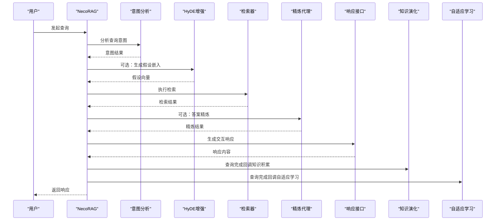
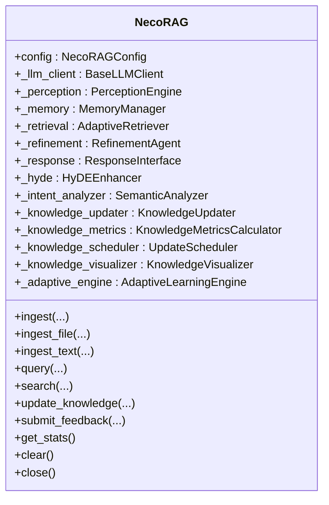
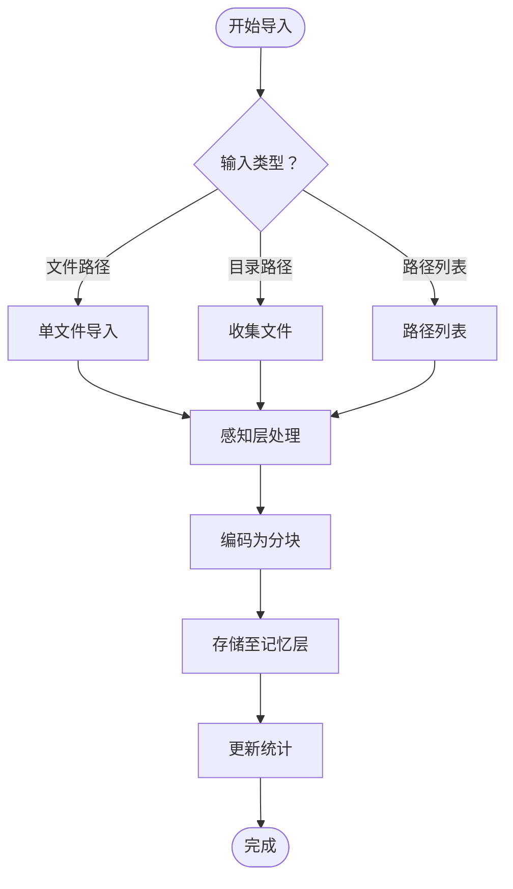
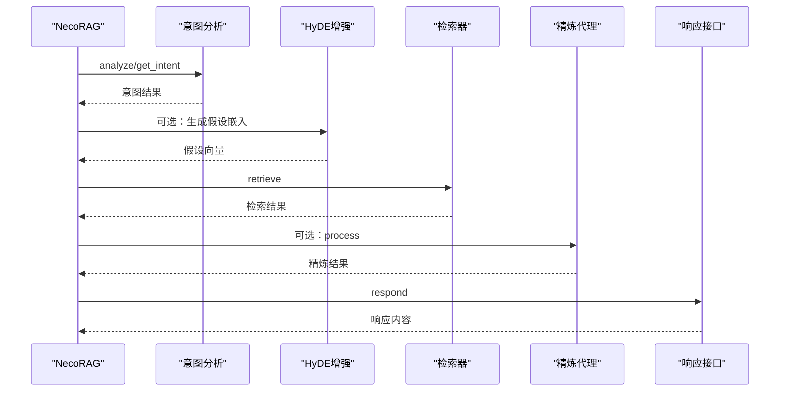
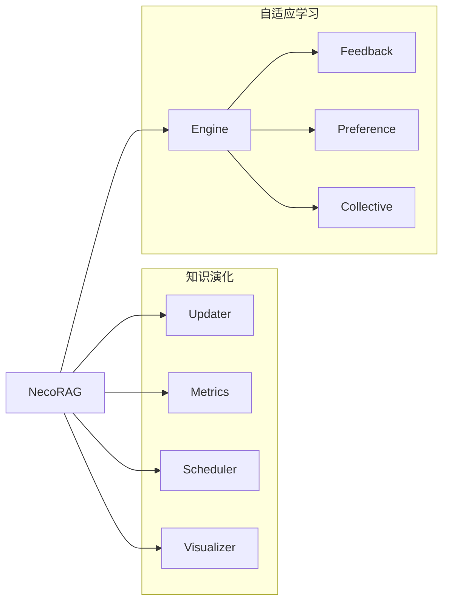
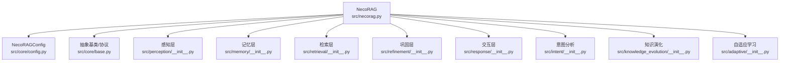

# 统一入口类设计

<cite>
**本文引用的文件**
- [src/necorag.py](file://src/necorag.py)
- [src/__init__.py](file://src/__init__.py)
- [src/core/config.py](file://src/core/config.py)
- [src/core/base.py](file://src/core/base.py)
- [src/perception/__init__.py](file://src/perception/__init__.py)
- [src/memory/__init__.py](file://src/memory/__init__.py)
- [src/retrieval/__init__.py](file://src/retrieval/__init__.py)
- [src/refinement/__init__.py](file://src/refinement/__init__.py)
- [src/response/__init__.py](file://src/response/__init__.py)
- [src/knowledge_evolution/__init__.py](file://src/knowledge_evolution/__init__.py)
- [src/adaptive/__init__.py](file://src/adaptive/__init__.py)
- [example/example_usage.py](file://example/example_usage.py)
</cite>

## 目录
1. [简介](#简介)
2. [项目结构](#项目结构)
3. [核心组件](#核心组件)
4. [架构总览](#架构总览)
5. [详细组件分析](#详细组件分析)
6. [依赖分析](#依赖分析)
7. [性能考量](#性能考量)
8. [故障排查指南](#故障排查指南)
9. [结论](#结论)
10. [附录](#附录)

## 简介
本文件围绕 NecoRAG 统一入口类 NecoRAG 的设计理念与实现细节展开，重点阐述其延迟初始化机制、模块组合模式与生命周期管理；并系统梳理文档导入、查询检索、知识演化与自适应学习等核心功能的实现路径。文档同时总结设计模式优势、性能优化策略与扩展性考虑，并提供使用示例与最佳实践，帮助开发者高效集成与扩展。

## 项目结构
NecoRAG 采用“统一入口 + 分层模块”的组织方式：统一入口类位于 src/necorag.py，负责协调感知层、记忆层、检索层、巩固层、交互层以及知识演化与自适应学习等子系统；核心配置与协议定义位于 src/core；各模块通过 __init__.py 暴露统一接口，便于上层按需导入与使用。

```mermaid
graph TB
subgraph "统一入口"
NR["NecoRAG<br/>src/necorag.py"]
end
subgraph "核心配置与协议"
CFG["NecoRAGConfig<br/>src/core/config.py"]
BASE["抽象基类与协议<br/>src/core/base.py"]
end
subgraph "感知层"
PER["PerceptionEngine<br/>src/perception/__init__.py"]
end
subgraph "记忆层"
MEM["MemoryManager<br/>src/memory/__init__.py"]
end
subgraph "检索层"
RET["AdaptiveRetriever<br/>src/retrieval/__init__.py"]
HYDE["HyDEEnhancer<br/>src/retrieval/__init__.py"]
end
subgraph "巩固层"
REF["RefinementAgent<br/>src/refinement/__init__.py"]
end
subgraph "交互层"
RESP["ResponseInterface<br/>src/response/__init__.py"]
end
subgraph "意图分析"
INT["SemanticAnalyzer<br/>src/intent/__init__.py"]
end
subgraph "知识演化"
KE["KnowledgeUpdater/Metrics/Scheduler/Visualizer<br/>src/knowledge_evolution/__init__.py"]
end
subgraph "自适应学习"
AL["AdaptiveLearningEngine<br/>src/adaptive/__init__.py"]
end
NR --> PER
NR --> MEM
NR --> RET
NR --> HYDE
NR --> REF
NR --> RESP
NR --> INT
NR --> KE
NR --> AL
NR --> CFG
NR --> BASE
```

图表来源
- [src/necorag.py](file://src/necorag.py)
- [src/core/config.py](file://src/core/config.py)
- [src/core/base.py](file://src/core/base.py)
- [src/perception/__init__.py](file://src/perception/__init__.py)
- [src/memory/__init__.py](file://src/memory/__init__.py)
- [src/retrieval/__init__.py](file://src/retrieval/__init__.py)
- [src/refinement/__init__.py](file://src/refinement/__init__.py)
- [src/response/__init__.py](file://src/response/__init__.py)
- [src/knowledge_evolution/__init__.py](file://src/knowledge_evolution/__init__.py)
- [src/adaptive/__init__.py](file://src/adaptive/__init__.py)

章节来源
- [src/necorag.py](file://src/necorag.py)
- [src/core/config.py](file://src/core/config.py)
- [src/core/base.py](file://src/core/base.py)
- [src/perception/__init__.py](file://src/perception/__init__.py)
- [src/memory/__init__.py](file://src/memory/__init__.py)
- [src/retrieval/__init__.py](file://src/retrieval/__init__.py)
- [src/refinement/__init__.py](file://src/refinement/__init__.py)
- [src/response/__init__.py](file://src/response/__init__.py)
- [src/knowledge_evolution/__init__.py](file://src/knowledge_evolution/__init__.py)
- [src/adaptive/__init__.py](file://src/adaptive/__init__.py)

## 核心组件
- 统一入口类 NecoRAG：提供简洁 API，封装文档导入、查询检索、配置管理、知识演化与自适应学习等能力。
- 延迟初始化：通过惰性属性与内部初始化方法，仅在首次使用时创建各子系统实例，降低启动成本。
- 模块组合：将感知、记忆、检索、巩固、交互等模块以组合方式注入统一入口，形成端到端处理流水线。
- 生命周期管理：支持上下文管理与显式 close，提供统计信息与清空能力，便于运维与调试。

章节来源
- [src/necorag.py](file://src/necorag.py)

## 架构总览
NecoRAG 的统一入口承担“编排者”角色：在初始化阶段创建并注入各子系统，在运行期按需调用；查询流程中结合意图分析、HyDE 增强、检索、精炼与响应适配，最终产出可解释、个性化的回答；同时通过知识演化与自适应学习实现系统“越用越智能”。

图表来源
- [src/necorag.py](file://src/necorag.py)
- [src/knowledge_evolution/__init__.py](file://src/knowledge_evolution/__init__.py)
- [src/adaptive/__init__.py](file://src/adaptive/__init__.py)

## 详细组件分析

### NecoRAG 类设计与初始化
- 构造函数参数
  - config: NecoRAGConfig（可选），用于控制各层行为与外部依赖配置
  - llm_client: BaseLLMClient（可选），允许外部注入 LLM 客户端
- 延迟初始化机制
  - 内部维护各子系统惰性属性（如 _perception、_memory、_retrieval 等）
  - 在首次访问或执行具体操作时触发 _initialize，按需创建组件
- 组件依赖关系
  - LLM 客户端：根据配置选择 Mock 或扩展提供商
  - 记忆层：依赖 MemoryManager 与各层存储（内存/向量/图）
  - 检索层：依赖 AdaptiveRetriever 与 HyDEEnhancer
  - 巩固层：依赖 RefinementAgent
  - 交互层：依赖 ResponseInterface
  - 知识演化：依赖 KnowledgeUpdater、Metrics、Scheduler、Visualizer
  - 自适应学习：依赖 AdaptiveLearningEngine

图表来源
- [src/necorag.py](file://src/necorag.py)

章节来源
- [src/necorag.py](file://src/necorag.py)

### 文档导入与索引
- 支持文件与目录批量导入，支持递归与类型过滤
- 单文件导入与文本导入两种入口，均经感知层编码后写入记忆层
- 导入统计与错误收集，便于监控与重试

图表来源
- [src/necorag.py](file://src/necorag.py)
- [src/perception/__init__.py](file://src/perception/__init__.py)
- [src/memory/__init__.py](file://src/memory/__init__.py)

章节来源
- [src/necorag.py](file://src/necorag.py)

### 查询检索与响应生成
- 意图分析与路由：可选启用，依据意图动态调整 top_k 与是否使用 HyDE
- HyDE 增强：可选生成假设嵌入提升检索质量
- 检索与证据抽取：AdaptiveRetriever 返回 Top-K 结果
- 答案精炼：可选使用 RefinementAgent 进行生成-批判-修正循环
- 响应适配：ResponseInterface 生成可解释、个性化、可定制的交互响应
- 查询完成回调：联动知识演化与自适应学习，形成闭环

图表来源
- [src/necorag.py](file://src/necorag.py)
- [src/intent/__init__.py](file://src/intent/__init__.py)
- [src/retrieval/__init__.py](file://src/retrieval/__init__.py)
- [src/refinement/__init__.py](file://src/refinement/__init__.py)
- [src/response/__init__.py](file://src/response/__init__.py)

章节来源
- [src/necorag.py](file://src/necorag.py)

### 知识演化与自适应学习
- 知识演化
  - 实时更新与定时批量更新：根据配置与质量阈值自动决策
  - 候选管理：支持批准/拒绝与变更日志、回滚
  - 指标与健康报告：量化知识库健康度与增长趋势
  - 可视化：提供仪表盘数据接口
- 自适应学习
  - 反馈闭环：收集用户显式/隐式反馈，驱动策略优化
  - 偏好预测：基于交互历史预测用户偏好变化
  - 集体智慧：聚合多用户共性洞察
  - 指标与仪表盘：量化“越用越智能”的效果

图表来源
- [src/necorag.py](file://src/necorag.py)
- [src/knowledge_evolution/__init__.py](file://src/knowledge_evolution/__init__.py)
- [src/adaptive/__init__.py](file://src/adaptive/__init__.py)

章节来源
- [src/necorag.py](file://src/necorag.py)
- [src/knowledge_evolution/__init__.py](file://src/knowledge_evolution/__init__.py)
- [src/adaptive/__init__.py](file://src/adaptive/__init__.py)

## 依赖分析
- 统一入口对各模块的依赖为组合关系，避免紧耦合；通过核心配置与协议层约束接口一致性
- 核心配置与协议层提供统一的数据结构与抽象基类，保证模块间可替换性与可测试性
- 意图分析模块与检索层存在运行时耦合（意图影响检索参数），但通过可选开关与默认值保持解耦

图表来源
- [src/necorag.py](file://src/necorag.py)
- [src/core/config.py](file://src/core/config.py)
- [src/core/base.py](file://src/core/base.py)
- [src/perception/__init__.py](file://src/perception/__init__.py)
- [src/memory/__init__.py](file://src/memory/__init__.py)
- [src/retrieval/__init__.py](file://src/retrieval/__init__.py)
- [src/refinement/__init__.py](file://src/refinement/__init__.py)
- [src/response/__init__.py](file://src/response/__init__.py)
- [src/intent/__init__.py](file://src/intent/__init__.py)
- [src/knowledge_evolution/__init__.py](file://src/knowledge_evolution/__init__.py)
- [src/adaptive/__init__.py](file://src/adaptive/__init__.py)

章节来源
- [src/necorag.py](file://src/necorag.py)
- [src/core/config.py](file://src/core/config.py)
- [src/core/base.py](file://src/core/base.py)
- [src/perception/__init__.py](file://src/perception/__init__.py)
- [src/memory/__init__.py](file://src/memory/__init__.py)
- [src/retrieval/__init__.py](file://src/retrieval/__init__.py)
- [src/refinement/__init__.py](file://src/refinement/__init__.py)
- [src/response/__init__.py](file://src/response/__init__.py)
- [src/intent/__init__.py](file://src/intent/__init__.py)
- [src/knowledge_evolution/__init__.py](file://src/knowledge_evolution/__init__.py)
- [src/adaptive/__init__.py](file://src/adaptive/__init__.py)

## 性能考量
- 延迟初始化：仅在首次使用时创建组件，显著降低冷启动开销
- 可选增强：HyDE、重排序、意图路由等可按需开启，避免不必要的计算
- 批量处理：感知层编码支持批量向量化，减少往返开销
- 指标与可视化：通过知识演化与自适应学习指标指导性能优化与参数调优
- 最佳实践
  - 生产环境建议使用非 Mock 的 LLM 提供商与持久化存储
  - 合理设置 top_k、重排序与 HyDE 参数，平衡召回与质量
  - 启用知识演化调度器，定期批处理更新，降低实时更新压力

[本节为通用性能讨论，无需列出具体文件来源]

## 故障排查指南
- 常见问题
  - LLM 提供商未完全实现：当前仅 Mock 可用，其他提供商需扩展实现
  - 记忆层为空：确认已执行文档导入或手动初始化 MemoryManager
  - 检索结果为空：检查感知层编码质量、向量维度与存储配置
  - 知识演化未生效：确认调度器已启动且配置阈值合理
- 排查步骤
  - 使用 get_stats 查看导入与查询统计
  - 使用 get_knowledge_metrics 与 get_health_report 获取知识库健康度
  - 使用 get_pending_candidates 审核候选条目
  - 使用 get_learning_metrics 与 get_adaptive_dashboard_data 观察自适应学习指标
- 日志与调试
  - 统一入口类内置日志，关注初始化与查询过程的关键节点
  - 可结合 example/example_usage.py 的完整流程示例定位问题

章节来源
- [src/necorag.py](file://src/necorag.py)
- [example/example_usage.py](file://example/example_usage.py)

## 结论
NecoRAG 统一入口类通过延迟初始化、模块组合与清晰的生命周期管理，实现了从文档导入到查询响应的全链路编排；配合知识演化与自适应学习，系统具备持续优化与个性化能力。该设计在保证易用性的同时，兼顾了扩展性与可维护性，适合在复杂场景中进行二次开发与集成。

[本节为总结性内容，无需列出具体文件来源]

## 附录

### 使用示例与最佳实践
- 快速开始
  - 使用默认开发配置或最小配置快速启动
  - 导入文档后直接发起查询
- 配置管理
  - 通过 NecoRAGConfig 控制各层行为；支持从文件与环境变量加载
  - 使用 ConfigPresets 切换开发/生产/最小配置
- 集成建议
  - 将 NecoRAG 作为应用的单一可信入口，对外暴露简洁 API
  - 在生产环境中启用知识演化调度器与自适应学习引擎
  - 结合仪表盘与指标监控系统健康度与性能

章节来源
- [src/necorag.py](file://src/necorag.py)
- [src/core/config.py](file://src/core/config.py)
- [example/example_usage.py](file://example/example_usage.py)