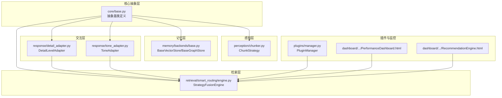
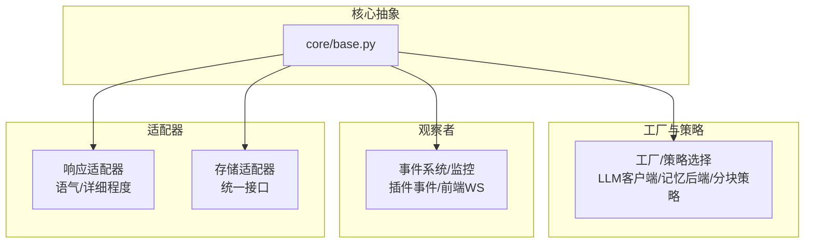
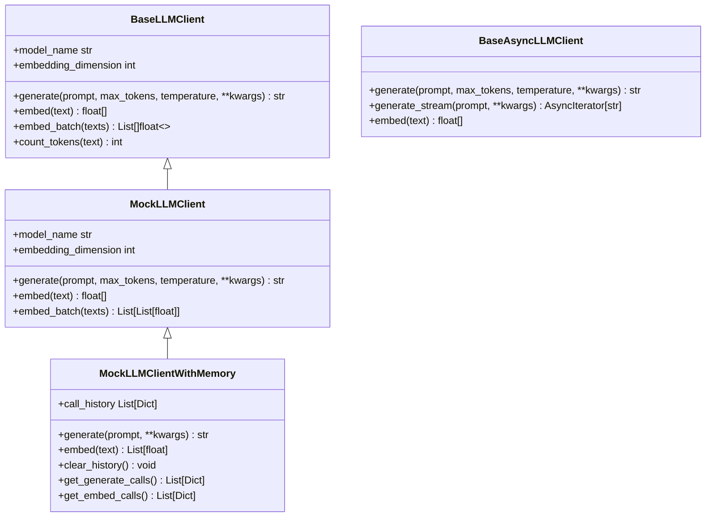
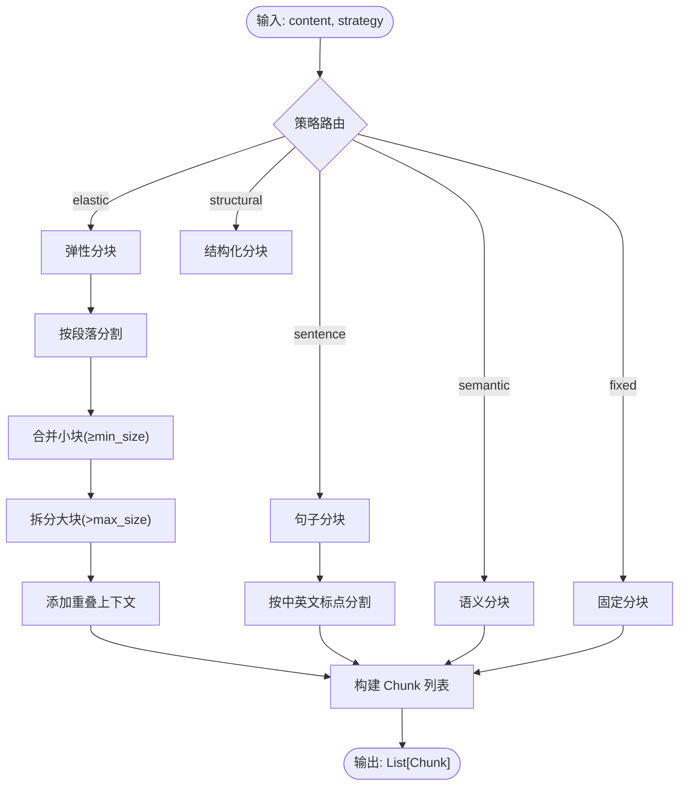
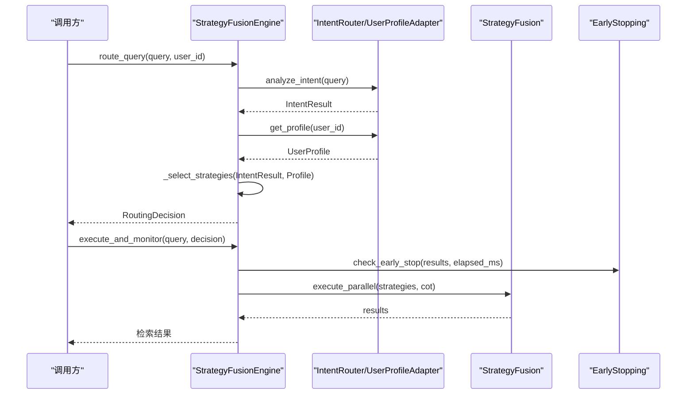
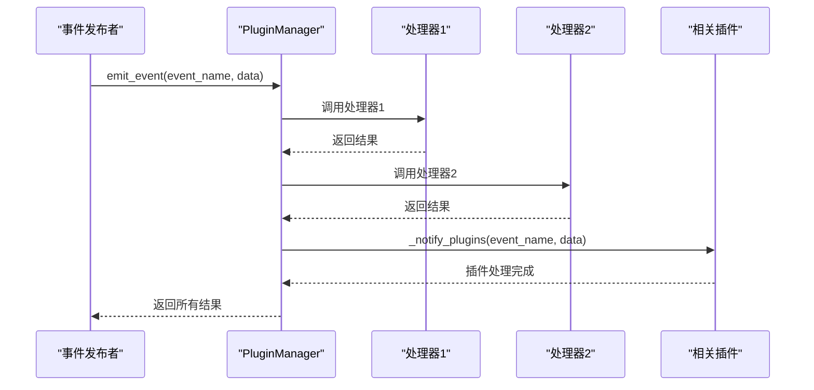
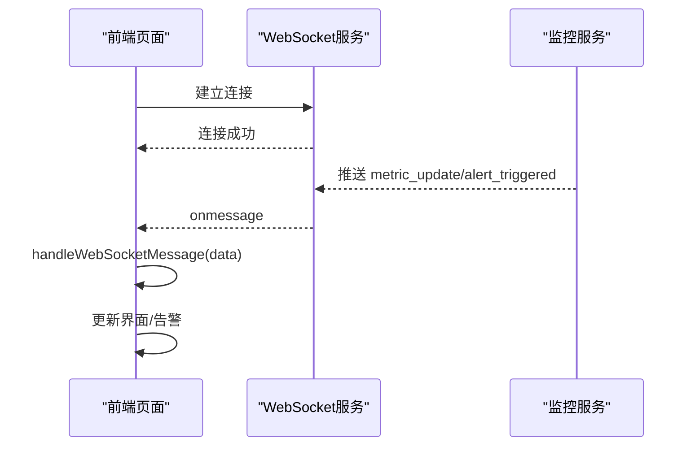
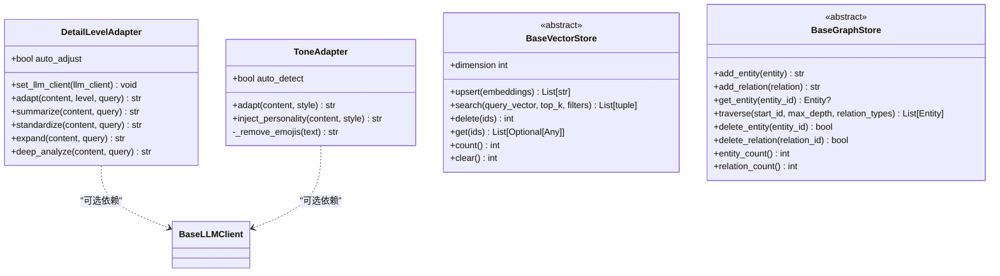
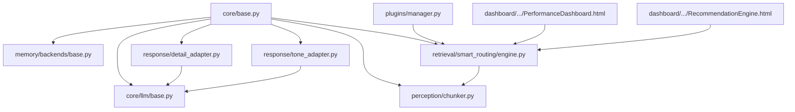

# 设计模式应用

<cite>
**本文引用的文件**
- [src/core/base.py](file://src/core/base.py)
- [src/core/llm/base.py](file://src/core/llm/base.py)
- [src/core/llm/mock.py](file://src/core/llm/mock.py)
- [src/memory/backends/base.py](file://src/memory/backends/base.py)
- [src/perception/chunker.py](file://src/perception/chunker.py)
- [src/retrieval/smart_routing/engine.py](file://src/retrieval/smart_routing/engine.py)
- [src/plugins/manager.py](file://src/plugins/manager.py)
- [src/response/detail_adapter.py](file://src/response/detail_adapter.py)
- [src/response/tone_adapter.py](file://src/response/tone_adapter.py)
- [src/dashboard/components/PerformanceDashboard.html](file://src/dashboard/components/PerformanceDashboard.html)
- [src/dashboard/components/RecommendationEngine.html](file://src/dashboard/components/RecommendationEngine.html)
- [wiki/wiki/核心架构设计/抽象基类设计.md](file://wiki/wiki/核心架构设计/抽象基类设计.md)
- [wiki/wiki/核心架构设计/LLM客户端接口.md](file://wiki/wiki/核心架构设计/LLM客户端接口.md)
- [wiki/wiki/记忆管理层/记忆存储后端.md](file://wiki/wiki/记忆管理层/记忆存储后端.md)
- [wiki/wiki/核心架构设计/五层认知架构/感知层 (L1)/感知层 (L1).md](file://wiki/wiki/核心架构设计/五层认知架构/感知层 (L1)/感知层 (L1).md)
- [wiki/wiki/核心架构设计/五层认知架构/交互层 (L5)/详细程度控制器.md](file://wiki/wiki/核心架构设计/五层认知架构/交互层 (L5)/详细程度控制器.md)
- [wiki/wiki/核心架构设计/五层认知架构/交互层 (L5)/交互层 (L5).md](file://wiki/wiki/核心架构设计/五层认知架构/交互层 (L5)/交互层 (L5).md)
</cite>

## 目录
1. [简介](#简介)
2. [项目结构](#项目结构)
3. [核心组件](#核心组件)
4. [架构总览](#架构总览)
5. [详细组件分析](#详细组件分析)
6. [依赖关系分析](#依赖关系分析)
7. [性能考虑](#性能考虑)
8. [故障排查指南](#故障排查指南)
9. [结论](#结论)
10. [附录](#附录)

## 简介
本文件系统梳理 NecoRAG 在各模块中对设计模式的应用，重点覆盖以下方面：
- 工厂模式：在 LLM 客户端与记忆存储后端的创建与选择机制中的体现
- 策略模式：在检索策略、分块策略中的实现与扩展
- 观察者模式：在插件事件系统与前端监控中的使用
- 适配器模式：在响应层（语气、详细程度）与存储后端抽象中的统一接口设计
- 类型安全与可替换性：通过抽象基类体系保障模块间解耦与可替换性

## 项目结构
NecoRAG 采用“抽象基类 + 具体实现”的分层组织方式，核心抽象位于 core/base.py，各子系统在自身目录下提供具体实现。典型模块包括：
- 感知层：分块策略（perception/chunker.py）
- 检索层：智能路由与策略融合（retrieval/smart_routing/engine.py）
- 记忆层：存储后端抽象（memory/backends/base.py）
- 交互层：响应适配器（response/detail_adapter.py、response/tone_adapter.py）
- 插件与监控：事件系统（plugins/manager.py）、前端仪表盘（dashboard/components/*.html）

**图表来源**
- [src/core/base.py:30-800](file://src/core/base.py#L30-L800)
- [src/perception/chunker.py:12-567](file://src/perception/chunker.py#L12-L567)
- [src/retrieval/smart_routing/engine.py:34-274](file://src/retrieval/smart_routing/engine.py#L34-L274)
- [src/memory/backends/base.py:61-314](file://src/memory/backends/base.py#L61-L314)
- [src/response/detail_adapter.py:18-417](file://src/response/detail_adapter.py#L18-L417)
- [src/response/tone_adapter.py:8-138](file://src/response/tone_adapter.py#L8-L138)
- [src/plugins/manager.py:14-584](file://src/plugins/manager.py#L14-L584)
- [src/dashboard/components/PerformanceDashboard.html:380-412](file://src/dashboard/components/PerformanceDashboard.html#L380-L412)
- [src/dashboard/components/RecommendationEngine.html:694-948](file://src/dashboard/components/RecommendationEngine.html#L694-L948)

**章节来源**
- [src/core/base.py:30-800](file://src/core/base.py#L30-L800)
- [src/perception/chunker.py:12-567](file://src/perception/chunker.py#L12-L567)
- [src/retrieval/smart_routing/engine.py:34-274](file://src/retrieval/smart_routing/engine.py#L34-L274)
- [src/memory/backends/base.py:61-314](file://src/memory/backends/base.py#L61-L314)
- [src/response/detail_adapter.py:18-417](file://src/response/detail_adapter.py#L18-L417)
- [src/response/tone_adapter.py:8-138](file://src/response/tone_adapter.py#L8-L138)
- [src/plugins/manager.py:14-584](file://src/plugins/manager.py#L14-L584)
- [src/dashboard/components/PerformanceDashboard.html:380-412](file://src/dashboard/components/PerformanceDashboard.html#L380-L412)
- [src/dashboard/components/RecommendationEngine.html:694-948](file://src/dashboard/components/RecommendationEngine.html#L694-L948)

## 核心组件
- 抽象基类体系：统一定义各层接口，确保实现的一致性与可替换性（详见 wiki/核心架构设计/抽象基类设计.md）
- LLM 客户端接口：BaseLLMClient/AsyncLLMClient 抽象与默认实现（src/core/llm/base.py、src/core/llm/mock.py）
- 存储后端抽象：BaseVectorStore/BaseGraphStore（src/memory/backends/base.py）
- 分块策略：ChunkStrategy（src/perception/chunker.py）
- 智能路由引擎：StrategyFusionEngine（src/retrieval/smart_routing/engine.py）
- 插件管理器：PluginManager（src/plugins/manager.py）
- 响应适配器：DetailLevelAdapter/ToneAdapter（src/response/detail_adapter.py、src/response/tone_adapter.py）
- 前端监控：PerformanceDashboard/RecommendationEngine（src/dashboard/components/*.html）

**章节来源**
- [wiki/wiki/核心架构设计/抽象基类设计.md:126-249](file://wiki/wiki/核心架构设计/抽象基类设计.md#L126-L249)
- [wiki/wiki/核心架构设计/LLM客户端接口.md:1-99](file://wiki/wiki/核心架构设计/LLM客户端接口.md#L1-L99)
- [src/core/llm/base.py:16-122](file://src/core/llm/base.py#L16-L122)
- [src/core/llm/mock.py:267-312](file://src/core/llm/mock.py#L267-L312)
- [src/memory/backends/base.py:61-314](file://src/memory/backends/base.py#L61-L314)
- [src/perception/chunker.py:12-567](file://src/perception/chunker.py#L12-L567)
- [src/retrieval/smart_routing/engine.py:34-274](file://src/retrieval/smart_routing/engine.py#L34-L274)
- [src/plugins/manager.py:14-584](file://src/plugins/manager.py#L14-L584)
- [src/response/detail_adapter.py:18-417](file://src/response/detail_adapter.py#L18-L417)
- [src/response/tone_adapter.py:8-138](file://src/response/tone_adapter.py#L8-L138)
- [src/dashboard/components/PerformanceDashboard.html:380-412](file://src/dashboard/components/PerformanceDashboard.html#L380-L412)
- [src/dashboard/components/RecommendationEngine.html:694-948](file://src/dashboard/components/RecommendationEngine.html#L694-L948)

## 架构总览
NecoRAG 通过抽象基类定义统一接口，各模块在自身目录下提供具体实现，形成“接口统一、实现多样”的可替换架构。工厂与策略模式体现在组件选择与算法分支，观察者模式体现在插件事件与前端监控，适配器模式体现在响应层与存储后端的统一接口。

[本图为概念性架构示意，不直接映射具体源码文件，故无图表来源]

## 详细组件分析

### 工厂模式：组件创建与选择机制
- LLM 客户端工厂
  - 抽象基类：BaseLLMClient/AsyncLLMClient（src/core/base.py）
  - 默认实现：BaseLLMClient/AsyncLLMClient（src/core/llm/base.py）
  - 示例实现：MockLLMClient/MockLLMClientWithMemory（src/core/llm/mock.py）
  - 选择机制：通过配置与工厂函数（在 necorag.py 或配置模块中）按提供商/模型名选择具体实现
  - 优势：屏蔽提供商差异，统一调用接口，便于替换与扩展

- 记忆存储后端工厂
  - 抽象基类：BaseVectorStore/BaseGraphStore（src/core/base.py）
  - 存储后端抽象：VectorRecord/SearchResult/GraphNode/GraphEdge（src/memory/backends/base.py）
  - 选择机制：通过 MemoryConfig/Provider 枚举在运行时选择 MEMORY/QDRANT/MILVUS/NEO4J 等实现
  - 优势：以统一接口适配不同存储后端，便于迁移与扩展

**图表来源**
- [src/core/llm/base.py:16-122](file://src/core/llm/base.py#L16-L122)
- [src/core/llm/mock.py:267-312](file://src/core/llm/mock.py#L267-L312)
- [wiki/wiki/核心架构设计/LLM客户端接口.md:125-167](file://wiki/wiki/核心架构设计/LLM客户端接口.md#L125-L167)

**章节来源**
- [src/core/llm/base.py:16-122](file://src/core/llm/base.py#L16-L122)
- [src/core/llm/mock.py:267-312](file://src/core/llm/mock.py#L267-L312)
- [wiki/wiki/核心架构设计/LLM客户端接口.md:1-99](file://wiki/wiki/核心架构设计/LLM客户端接口.md#L1-L99)
- [wiki/wiki/记忆管理层/记忆存储后端.md:243-258](file://wiki/wiki/记忆管理层/记忆存储后端.md#L243-L258)

### 策略模式：检索策略与分块策略
- 检索策略（智能路由）
  - 引擎：StrategyFusionEngine（src/retrieval/smart_routing/engine.py）
  - 三层决策：意图识别层、用户画像层、策略融合层
  - 策略选择：根据意图类型与用户画像动态分配权重，支持早停与降级
  - 执行：并行执行多个策略，融合结果并收集反馈

- 分块策略
  - 组件：ChunkStrategy（src/perception/chunker.py）
  - 支持策略：elastic、semantic、fixed、structural、sentence
  - 算法流程：按策略路由到具体实现，包含边界检测、合并/拆分、重叠上下文等

**图表来源**
- [src/perception/chunker.py:49-567](file://src/perception/chunker.py#L49-L567)
- [wiki/wiki/核心架构设计/五层认知架构/感知层 (L1)/感知层 (L1).md:191-209](file://wiki/wiki/核心架构设计/五层认知架构/感知层 (L1)/感知层 (L1).md#L191-L209)

**图表来源**
- [src/retrieval/smart_routing/engine.py:68-274](file://src/retrieval/smart_routing/engine.py#L68-L274)

**章节来源**
- [src/retrieval/smart_routing/engine.py:34-274](file://src/retrieval/smart_routing/engine.py#L34-L274)
- [src/perception/chunker.py:12-567](file://src/perception/chunker.py#L12-L567)
- [wiki/wiki/核心架构设计/五层认知架构/感知层 (L1)/感知层 (L1).md:181-209](file://wiki/wiki/核心架构设计/五层认知架构/感知层 (L1)/感知层 (L1).md#L181-L209)

### 观察者模式：事件系统与监控
- 插件事件系统
  - 组件：PluginManager（src/plugins/manager.py）
  - 机制：注册事件处理器（register_event_handler）、触发事件（emit_event）、通知插件（_notify_plugins）
  - 优势：松耦合事件传播，便于扩展与维护

- 前端监控（观察者）
  - 组件：PerformanceDashboard/RecommendationEngine（src/dashboard/components/*.html）
  - 机制：WebSocket 连接、消息分发（handleWebSocketMessage）、状态更新
  - 优势：实时接收指标与告警，自动刷新界面

**图表来源**
- [src/plugins/manager.py:90-136](file://src/plugins/manager.py#L90-L136)

**图表来源**
- [src/dashboard/components/PerformanceDashboard.html:380-412](file://src/dashboard/components/PerformanceDashboard.html#L380-L412)
- [src/dashboard/components/RecommendationEngine.html:694-948](file://src/dashboard/components/RecommendationEngine.html#L694-L948)

**章节来源**
- [src/plugins/manager.py:14-584](file://src/plugins/manager.py#L14-L584)
- [src/dashboard/components/PerformanceDashboard.html:380-412](file://src/dashboard/components/PerformanceDashboard.html#L380-L412)
- [src/dashboard/components/RecommendationEngine.html:694-948](file://src/dashboard/components/RecommendationEngine.html#L694-L948)

### 适配器模式：统一接口与个性化适配
- 响应适配器
  - DetailLevelAdapter：根据级别（1-4）进行摘要、标准化、扩展、深度分析
  - ToneAdapter：根据风格（formal/friendly/humorous）注入个性化元素
  - 优势：在不改变上层逻辑的前提下，灵活适配不同用户需求与场景

- 存储后端适配器
  - BaseVectorStore/BaseGraphStore：统一向量/图存储接口，屏蔽具体实现差异
  - 优势：以抽象接口适配不同存储后端，便于迁移与扩展

**图表来源**
- [src/response/detail_adapter.py:18-417](file://src/response/detail_adapter.py#L18-L417)
- [src/response/tone_adapter.py:8-138](file://src/response/tone_adapter.py#L8-L138)
- [src/memory/backends/base.py:61-314](file://src/memory/backends/base.py#L61-L314)
- [src/core/base.py:221-394](file://src/core/base.py#L221-L394)

**章节来源**
- [src/response/detail_adapter.py:18-417](file://src/response/detail_adapter.py#L18-L417)
- [src/response/tone_adapter.py:8-138](file://src/response/tone_adapter.py#L8-L138)
- [src/memory/backends/base.py:61-314](file://src/memory/backends/base.py#L61-L314)
- [src/core/base.py:221-394](file://src/core/base.py#L221-L394)
- [wiki/wiki/核心架构设计/五层认知架构/交互层 (L5)/详细程度控制器.md:267-330](file://wiki/wiki/核心架构设计/五层认知架构/交互层 (L5)/详细程度控制器.md#L267-L330)
- [wiki/wiki/核心架构设计/五层认知架构/交互层 (L5)/交互层 (L5).md:145-187](file://wiki/wiki/核心架构设计/五层认知架构/交互层 (L5)/交互层 (L5).md#L145-L187)

## 依赖关系分析
- 抽象基类为核心，向下派生具体实现，确保接口一致性与可替换性
- 智能路由引擎依赖意图识别、用户画像、策略融合、早停与反馈模块
- 响应适配器依赖 LLM 客户端（可选），在无 LLM 时退化为规则处理
- 插件管理器通过事件系统与各模块解耦，便于扩展
- 前端监控通过 WebSocket 与后端服务解耦，实现事件驱动的界面更新

**图表来源**
- [src/core/base.py:30-800](file://src/core/base.py#L30-L800)
- [src/core/llm/base.py:16-122](file://src/core/llm/base.py#L16-L122)
- [src/memory/backends/base.py:61-314](file://src/memory/backends/base.py#L61-L314)
- [src/perception/chunker.py:12-567](file://src/perception/chunker.py#L12-L567)
- [src/retrieval/smart_routing/engine.py:34-274](file://src/retrieval/smart_routing/engine.py#L34-L274)
- [src/response/detail_adapter.py:18-417](file://src/response/detail_adapter.py#L18-L417)
- [src/response/tone_adapter.py:8-138](file://src/response/tone_adapter.py#L8-L138)
- [src/plugins/manager.py:14-584](file://src/plugins/manager.py#L14-L584)
- [src/dashboard/components/PerformanceDashboard.html:380-412](file://src/dashboard/components/PerformanceDashboard.html#L380-L412)
- [src/dashboard/components/RecommendationEngine.html:694-948](file://src/dashboard/components/RecommendationEngine.html#L694-L948)

**章节来源**
- [src/core/base.py:30-800](file://src/core/base.py#L30-L800)
- [src/retrieval/smart_routing/engine.py:34-274](file://src/retrieval/smart_routing/engine.py#L34-L274)
- [src/plugins/manager.py:14-584](file://src/plugins/manager.py#L14-L584)

## 性能考虑
- 智能路由引擎通过早停与降级策略减少不必要的计算开销，提升整体响应速度
- 分块策略在弹性分块中通过边界检测与重叠上下文平衡语义完整性与块大小
- 响应适配器在无 LLM 时退化为规则处理，避免外部依赖导致的性能波动
- 存储后端抽象允许在不同实现间切换，以满足不同性能与容量需求

[本节为通用性能讨论，不直接分析具体文件，故无章节来源]

## 故障排查指南
- LLM 客户端
  - 检查模型名称与嵌入维度是否匹配（BaseLLMClient 属性）
  - 若 embed_batch 默认实现性能不足，可覆盖为并发实现
- 存储后端
  - 确认向量维度与过滤条件是否正确
  - 检查 clear()/count()/get() 等方法是否被具体实现覆盖
- 智能路由
  - 核查意图识别与用户画像权重分配是否合理
  - 检查早停配置与降级策略是否生效
- 插件事件
  - 确认事件处理器注册与触发是否正常
  - 检查插件依赖关系与加载顺序
- 前端监控
  - 检查 WebSocket 连接状态与消息分发逻辑

**章节来源**
- [src/core/llm/base.py:24-78](file://src/core/llm/base.py#L24-L78)
- [src/memory/backends/base.py:134-147](file://src/memory/backends/base.py#L134-L147)
- [src/retrieval/smart_routing/engine.py:131-274](file://src/retrieval/smart_routing/engine.py#L131-L274)
- [src/plugins/manager.py:90-136](file://src/plugins/manager.py#L90-L136)
- [src/dashboard/components/PerformanceDashboard.html:380-412](file://src/dashboard/components/PerformanceDashboard.html#L380-L412)

## 结论
NecoRAG 通过抽象基类体系实现了高度解耦与可替换性，配合工厂、策略、观察者与适配器模式，形成了统一接口、灵活扩展、可观测的架构。这些设计模式提升了系统的可维护性与可扩展性，便于在不同提供商与存储后端之间快速切换，同时支持按需扩展与个性化适配。

[本节为总结性内容，不直接分析具体文件，故无章节来源]

## 附录
- 设计模式应用清单
  - 工厂模式：LLM 客户端与记忆存储后端的创建与选择
  - 策略模式：检索策略与分块策略的动态选择与执行
  - 观察者模式：插件事件系统与前端监控
  - 适配器模式：响应层个性化适配与存储后端统一接口

[本节为汇总性内容，不直接分析具体文件，故无章节来源]