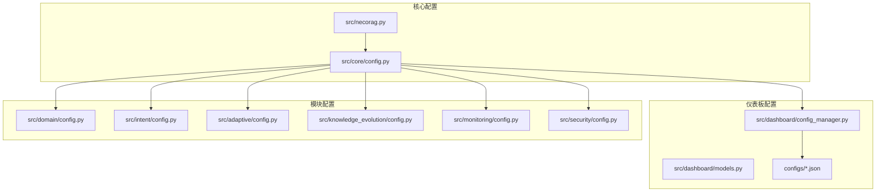
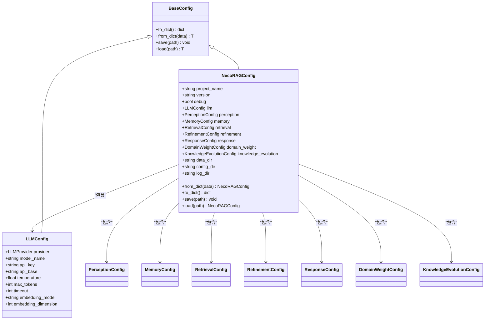
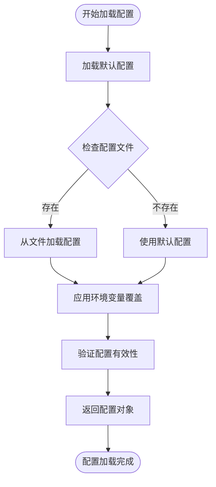
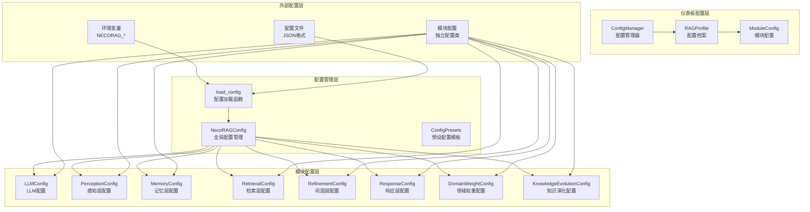
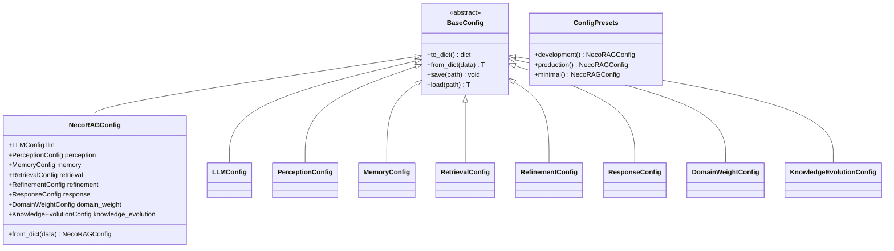
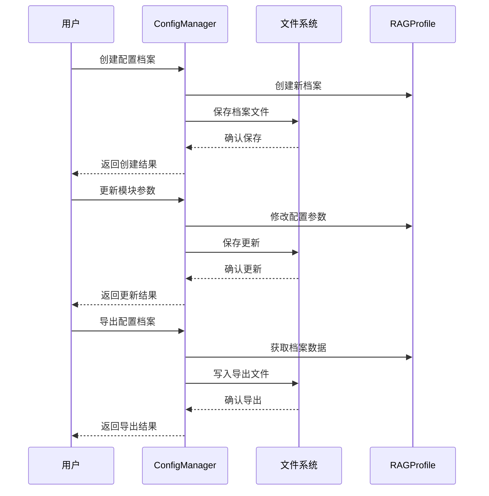
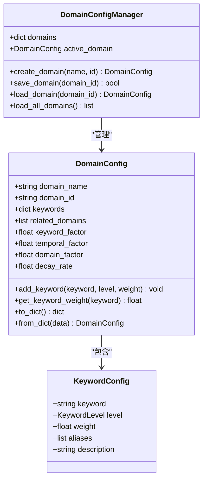
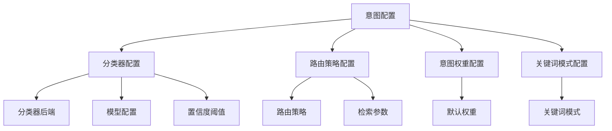
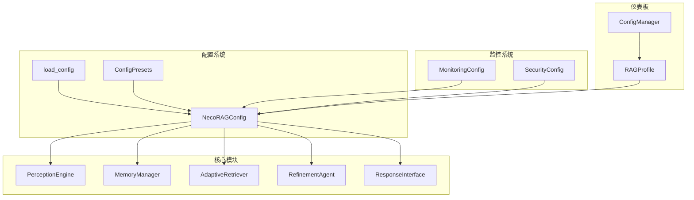

# 配置管理系统

<cite>
**本文档引用的文件**
- [src/core/config.py](file://src/core/config.py)
- [src/dashboard/config_manager.py](file://src/dashboard/config_manager.py)
- [src/dashboard/models.py](file://src/dashboard/models.py)
- [src/domain/config.py](file://src/domain/config.py)
- [src/intent/config.py](file://src/intent/config.py)
- [src/adaptive/config.py](file://src/adaptive/config.py)
- [src/knowledge_evolution/config.py](file://src/knowledge_evolution/config.py)
- [src/monitoring/config.py](file://src/monitoring/config.py)
- [src/security/config.py](file://src/security/config.py)
- [src/necorag.py](file://src/necorag.py)
- [tests/test_core/test_config.py](file://tests/test_core/test_config.py)
- [configs/2acb71bc-e452-4608-b230-cf555add4034.json](file://configs/2acb71bc-e452-4608-b230-cf555add4034.json)
- [configs/3c0c9817-af7a-4ca7-89a1-805c60e9f62d.json](file://configs/3c0c9817-af7a-4ca7-89a1-805c60e9f62d.json)
</cite>

## 目录
1. [简介](#简介)
2. [项目结构](#项目结构)
3. [核心组件](#核心组件)
4. [架构概览](#架构概览)
5. [详细组件分析](#详细组件分析)
6. [依赖关系分析](#依赖关系分析)
7. [性能考虑](#性能考虑)
8. [故障排除指南](#故障排除指南)
9. [结论](#结论)
10. [附录](#附录)

## 简介

NecoRAG配置管理系统是一个模块化的配置管理框架，为整个认知型RAG系统提供了统一的配置管理机制。该系统支持从文件、环境变量加载配置，实现了配置的层次化管理和动态更新。

系统的核心特点包括：
- **统一配置管理**：NecoRAGConfig作为全局配置容器，管理所有子模块配置
- **模块化设计**：每个功能模块都有独立的配置类，支持灵活的组合使用
- **环境变量支持**：通过环境变量实现配置的动态覆盖
- **预设配置**：提供开发、生产、最小化等预设配置模板
- **配置验证**：内置配置验证机制，确保配置的有效性
- **热更新支持**：支持配置的动态加载和应用

## 项目结构

配置管理系统主要分布在以下目录中：



**图表来源**
- [src/core/config.py:1-420](file://src/core/config.py#L1-L420)
- [src/dashboard/config_manager.py:1-315](file://src/dashboard/config_manager.py#L1-L315)
- [src/dashboard/models.py:1-232](file://src/dashboard/models.py#L1-L232)

**章节来源**
- [src/core/config.py:1-420](file://src/core/config.py#L1-L420)
- [src/dashboard/config_manager.py:1-315](file://src/dashboard/config_manager.py#L1-L315)
- [src/dashboard/models.py:1-232](file://src/dashboard/models.py#L1-L232)

## 核心组件

### NecoRAGConfig全局配置类

NecoRAGConfig是整个系统的配置中心，负责管理所有子模块的配置。它采用了数据类（dataclass）的设计模式，提供了统一的配置管理接口。



**图表来源**
- [src/core/config.py:277-334](file://src/core/config.py#L277-L334)
- [src/core/config.py:81-91](file://src/core/config.py#L81-L91)
- [src/core/config.py:45-77](file://src/core/config.py#L45-L77)

### 配置加载机制

系统提供了灵活的配置加载机制，支持多种配置来源的优先级处理：



**图表来源**
- [src/core/config.py:338-377](file://src/core/config.py#L338-L377)

**章节来源**
- [src/core/config.py:277-377](file://src/core/config.py#L277-L377)

## 架构概览

配置管理系统采用分层架构设计，实现了配置的模块化管理和统一管理：



**图表来源**
- [src/core/config.py:390-420](file://src/core/config.py#L390-L420)
- [src/dashboard/config_manager.py:14-41](file://src/dashboard/config_manager.py#L14-L41)
- [src/dashboard/models.py:165-220](file://src/dashboard/models.py#L165-L220)

## 详细组件分析

### 配置继承与覆盖机制

系统实现了多层次的配置继承和覆盖机制，确保配置的灵活性和可维护性：

#### 配置层次结构



**图表来源**
- [src/core/config.py:45-334](file://src/core/config.py#L45-L334)
- [src/core/config.py:390-420](file://src/core/config.py#L390-L420)

#### 环境变量支持

系统通过环境变量实现了配置的动态覆盖，支持以下环境变量前缀：

| 环境变量前缀 | 作用域 | 示例 |
|-------------|--------|------|
| `NECORAG_DEBUG` | 调试模式 | `NECORAG_DEBUG=true` |
| `NECORAG_LLM_PROVIDER` | LLM提供商 | `NECORAG_LLM_PROVIDER=openai` |
| `NECORAG_VECTOR_DB` | 向量数据库 | `NECORAG_VECTOR_DB=qdrant` |
| `NECORAG_GRAPH_DB` | 图数据库 | `NECORAG_GRAPH_DB=neo4j` |

**章节来源**
- [src/core/config.py:361-376](file://src/core/config.py#L361-L376)

### 预设配置管理

ConfigPresets提供了三种预设配置模板，满足不同场景的需求：

#### 开发环境预设

开发环境预设配置了Mock LLM提供商，便于本地开发和测试：

```python
# 开发环境配置示例
config = ConfigPresets.development()
config.debug = True
config.llm.provider = LLMProvider.MOCK
config.memory.vector_db_provider = VectorDBProvider.MEMORY
config.memory.graph_db_provider = GraphDBProvider.MEMORY
```

#### 生产环境预设

生产环境预设优化了检索和巩固层的配置：

```python
# 生产环境配置示例
config = ConfigPresets.production()
config.debug = False
config.refinement.max_iterations = 5
config.retrieval.enable_rerank = True
```

#### 最小化配置预设

最小化配置预设减少了系统资源消耗：

```python
# 最小化配置示例
config = ConfigPresets.minimal()
config.llm.provider = LLMProvider.MOCK
config.retrieval.enable_hyde = False
config.retrieval.enable_rerank = False
config.refinement.max_iterations = 1
config.response.enable_thinking_chain = False
```

**章节来源**
- [src/core/config.py:394-420](file://src/core/config.py#L394-L420)

### 仪表板配置管理

仪表板系统提供了可视化的配置管理界面，支持配置档案的创建、编辑、删除和导入导出：

#### 配置档案管理



**图表来源**
- [src/dashboard/config_manager.py:42-278](file://src/dashboard/config_manager.py#L42-L278)

#### 模块配置结构

仪表板系统为每个模块提供了专门的配置类：

| 模块类型 | 配置类 | 主要参数 |
|---------|--------|----------|
| 感知引擎 | PerceptionConfig | 分块大小、重叠、向量化模型 |
| 记忆层 | MemoryConfig | L1/L2/L3存储配置、衰减参数 |
| 检索层 | RetrievalConfig | 检索参数、HyDE配置、重排序 |
| 巩固层 | RefinementConfig | 精炼参数、幻觉检测阈值 |
| 响应层 | ResponseConfig | 输出格式、思维链配置 |

**章节来源**
- [src/dashboard/config_manager.py:14-315](file://src/dashboard/config_manager.py#L14-L315)
- [src/dashboard/models.py:47-220](file://src/dashboard/models.py#L47-L220)

### 模块化配置管理

系统为各个功能模块提供了独立的配置管理类，支持模块级别的配置定制：

#### 领域配置管理

领域配置系统支持关键字权重管理和领域相关性计算：



**图表来源**
- [src/domain/config.py:54-160](file://src/domain/config.py#L54-L160)

#### 意图分析配置

意图分析系统提供了多级分类和路由策略配置：



**图表来源**
- [src/intent/config.py:18-296](file://src/intent/config.py#L18-L296)

**章节来源**
- [src/domain/config.py:163-285](file://src/domain/config.py#L163-L285)
- [src/intent/config.py:18-333](file://src/intent/config.py#L18-L333)

### 高级配置模块

#### 自适应学习配置

自适应学习引擎提供了个性化的配置优化能力：

| 配置类别 | 关键参数 | 默认值 | 说明 |
|---------|----------|--------|------|
| 反馈收集 | enable_feedback_collection | True | 启用用户反馈收集 |
| 偏好学习 | preference_update_interval | 5 | 偏好更新频率 |
| 策略优化 | strategy_learning_rate | 0.05 | 策略学习速率 |
| 集体学习 | enable_collective_learning | True | 启用群体智能 |
| 指标计算 | metrics_window_days | 30 | 指标计算窗口 |

#### 知识演化配置

知识演化系统支持知识库的动态更新和维护：

| 配置类别 | 关键参数 | 默认值 | 说明 |
|---------|----------|--------|------|
| 实时更新 | enable_realtime_update | True | 启用实时更新 |
| 定时更新 | batch_update_interval | 86400 | 批量更新间隔 |
| 健康监控 | health_warning_threshold | 60.0 | 健康预警阈值 |
| 查询驱动 | enable_query_driven_accumulation | True | 启用查询驱动积累 |

**章节来源**
- [src/adaptive/config.py:15-200](file://src/adaptive/config.py#L15-L200)
- [src/knowledge_evolution/config.py:15-222](file://src/knowledge_evolution/config.py#L15-L222)

## 依赖关系分析

配置管理系统与其他模块的依赖关系如下：



**图表来源**
- [src/necorag.py:43-134](file://src/necorag.py#L43-L134)
- [src/dashboard/config_manager.py:14-41](file://src/dashboard/config_manager.py#L14-L41)

**章节来源**
- [src/necorag.py:43-134](file://src/necorag.py#L43-L134)
- [src/dashboard/config_manager.py:14-41](file://src/dashboard/config_manager.py#L14-L41)

## 性能考虑

配置管理系统在设计时充分考虑了性能优化：

### 配置加载性能

- **延迟初始化**：配置对象采用延迟初始化策略，只有在使用时才创建实际的组件实例
- **缓存机制**：仪表板配置管理器使用内存缓存存储配置档案，减少文件I/O操作
- **增量更新**：支持配置的增量更新，避免全量重新加载

### 内存使用优化

- **数据类设计**：使用Python数据类减少内存开销
- **枚举类型**：使用枚举类型替代字符串，提高内存效率
- **配置验证**：在配置加载时进行验证，避免无效配置占用内存

### 热更新支持

系统支持配置的动态热更新，无需重启服务即可应用新的配置：

```python
# 配置热更新示例
def hot_reload_config():
    """执行配置热更新"""
    global current_config
    # 重新加载配置
    new_config = load_config()
    # 应用配置变更
    apply_config_changes(current_config, new_config)
    # 更新全局配置
    current_config = new_config
```

## 故障排除指南

### 常见配置问题

#### 配置文件加载失败

**问题症状**：
- 配置文件路径错误
- JSON格式不正确
- 权限不足

**解决方案**：
1. 验证配置文件路径是否存在
2. 检查JSON格式的正确性
3. 确认文件读写权限

#### 环境变量覆盖无效

**问题症状**：
- 环境变量设置后配置未生效
- 环境变量格式不正确

**解决方案**：
1. 确认环境变量前缀为`NECORAG_`
2. 验证环境变量命名格式
3. 检查环境变量值的数据类型

#### 配置验证失败

**问题症状**：
- 配置验证抛出异常
- 配置参数超出范围

**解决方案**：
1. 检查配置参数的数据类型
2. 验证数值参数的范围
3. 确认枚举值的有效性

### 调试配置问题

#### 启用调试模式

```python
# 启用调试模式查看配置详情
import os
os.environ['NECORAG_DEBUG'] = 'true'

# 加载配置
config = load_config()
print("配置详情:", config.to_dict())
```

#### 配置文件示例

系统提供了完整的配置文件示例，可以作为配置模板使用：

**章节来源**
- [tests/test_core/test_config.py:361-397](file://tests/test_core/test_config.py#L361-L397)
- [configs/2acb71bc-e452-4608-b230-cf555add4034.json:1-101](file://configs/2acb71bc-e452-4608-b230-cf555add4034.json#L1-L101)

## 结论

NecoRAG配置管理系统通过模块化的设计和灵活的配置管理机制，为整个认知型RAG系统提供了强大的配置支持。系统的主要优势包括：

1. **统一管理**：通过NecoRAGConfig实现全局配置管理
2. **灵活配置**：支持多种配置来源和覆盖机制
3. **模块化设计**：每个功能模块都有独立的配置类
4. **可视化管理**：仪表板提供直观的配置管理界面
5. **热更新支持**：支持配置的动态更新而无需重启

该系统为开发者提供了完整的配置管理解决方案，能够满足从开发环境到生产环境的各种配置需求。

## 附录

### 配置最佳实践

#### 开发环境配置

```python
# 开发环境推荐配置
config = ConfigPresets.development()
config.debug = True
config.llm.provider = LLMProvider.MOCK
config.memory.vector_db_provider = VectorDBProvider.MEMORY
config.memory.graph_db_provider = GraphDBProvider.MEMORY
```

#### 生产环境配置

```python
# 生产环境推荐配置
config = ConfigPresets.production()
config.debug = False
config.refinement.max_iterations = 5
config.retrieval.enable_rerank = True
config.knowledge_evolution.enable_realtime_update = True
```

#### 性能优化配置

```python
# 性能优化配置示例
config.memory.decay_rate = 0.05
config.retrieval.default_top_k = 5
config.response.enable_thinking_chain = False
```

### 配置验证规则

系统提供了完整的配置验证机制，确保配置的有效性：

| 配置项 | 验证规则 | 默认范围 |
|-------|---------|---------|
| 数值参数 | 0 < 值 ≤ 1.0 | 0.1 - 1.0 |
| 整数参数 | 值 ≥ 1 | 1 - ∞ |
| 时间参数 | 值 ≥ 0 | 0 - ∞ |
| 权重参数 | Σ权重 = 1.0 | 0.0 - 1.0 |

**章节来源**
- [src/adaptive/config.py:157-193](file://src/adaptive/config.py#L157-L193)
- [src/knowledge_evolution/config.py:168-214](file://src/knowledge_evolution/config.py#L168-L214)