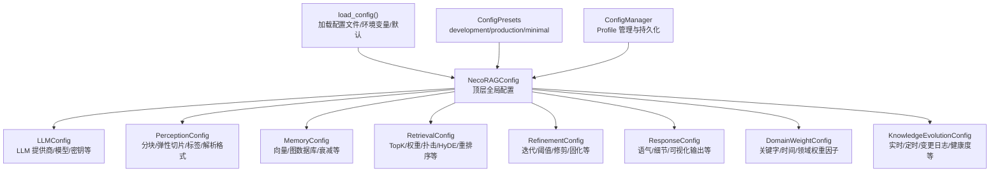
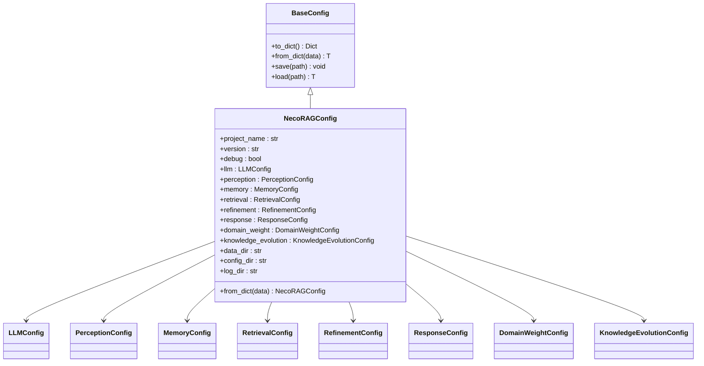
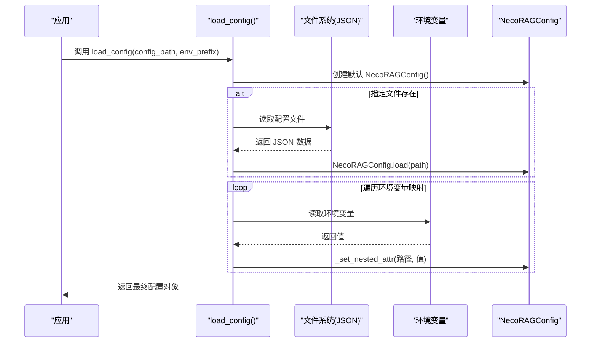
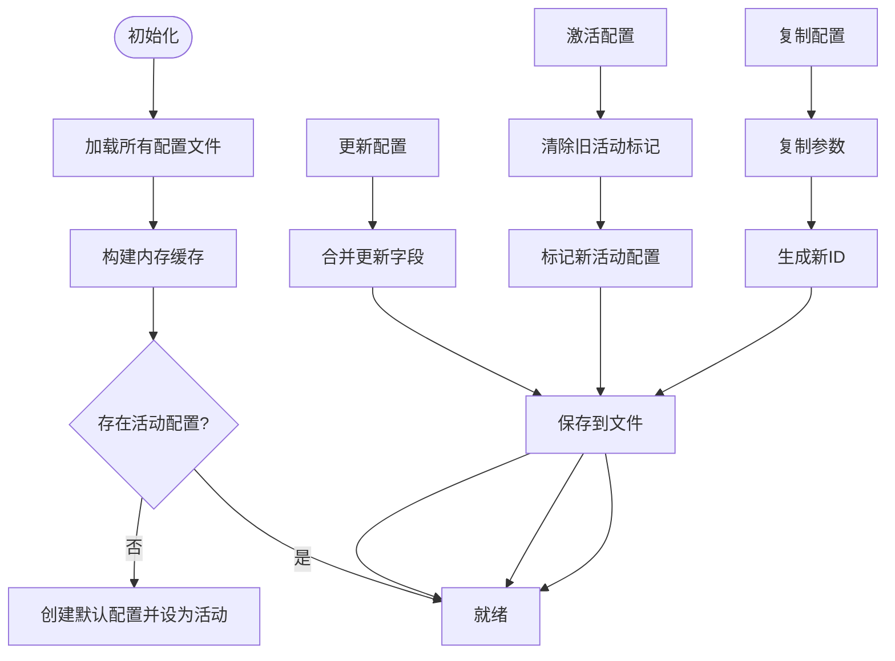
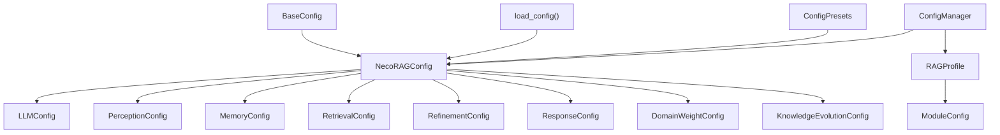

# 配置管理系统

<cite>
**本文引用的文件**
- [src/core/config.py](file://src/core/config.py)
- [src/dashboard/config_manager.py](file://src/dashboard/config_manager.py)
- [src/dashboard/models.py](file://src/dashboard/models.py)
- [src/domain/config.py](file://src/domain/config.py)
- [src/intent/config.py](file://src/intent/config.py)
- [src/knowledge_evolution/config.py](file://src/knowledge_evolution/config.py)
- [src/adaptive/config.py](file://src/adaptive/config.py)
- [tests/conftest.py](file://tests/conftest.py)
- [wiki/wiki/配置管理/全局配置.md](file://wiki/wiki/配置管理/全局配置.md)
- [wiki/wiki/配置管理/感知层配置.md](file://wiki/wiki/配置管理/感知层配置.md)
- [wiki/wiki/配置管理/记忆层配置.md](file://wiki/wiki/配置管理/记忆层配置.md)
- [wiki/wiki/配置管理/检索层配置.md](file://wiki/wiki/配置管理/检索层配置.md)
- [wiki/wiki/配置管理/巩固层配置.md](file://wiki/wiki/配置管理/巩固层配置.md)
</cite>

## 目录
1. [简介](#简介)
2. [项目结构](#项目结构)
3. [核心组件](#核心组件)
4. [架构总览](#架构总览)
5. [详细组件分析](#详细组件分析)
6. [依赖分析](#依赖分析)
7. [性能考虑](#性能考虑)
8. [故障排查指南](#故障排查指南)
9. [结论](#结论)
10. [附录](#附录)

## 简介
本文件系统性阐述 NecoRAG 配置管理系统的架构设计与实现原理，覆盖全局配置、层配置、组件配置的层次结构与优先级规则，解释配置验证机制、默认值设置与动态配置更新流程。文档还提供完整的配置选项参考（感知层、记忆层、检索层、巩固层、交互层等），说明配置文件的加载顺序与合并策略，并给出配置示例、最佳实践、热更新与回滚机制说明，以及故障排除指南。

## 项目结构
NecoRAG 配置系统采用分层聚合设计：顶层全局配置 NecoRAGConfig 聚合各子模块配置（LLM、感知、记忆、检索、巩固、响应、领域权重、知识演化），并通过统一的配置加载函数与预设模板实现灵活部署。仪表盘模块提供可视化的 Profile 管理与持久化能力，支持配置的创建、切换、复制、导入导出与激活。

**图表来源**
- [src/core/config.py:277-333](file://src/core/config.py#L277-L333)
- [src/core/config.py:338-377](file://src/core/config.py#L338-L377)
- [src/core/config.py:390-420](file://src/core/config.py#L390-L420)
- [src/dashboard/config_manager.py:14-41](file://src/dashboard/config_manager.py#L14-L41)

**章节来源**
- [src/core/config.py:277-333](file://src/core/config.py#L277-L333)
- [src/core/config.py:338-377](file://src/core/config.py#L338-L377)
- [src/core/config.py:390-420](file://src/core/config.py#L390-L420)
- [src/dashboard/config_manager.py:14-41](file://src/dashboard/config_manager.py#L14-L41)

## 核心组件
- BaseConfig：提供 to_dict/from_dict/save/load 等通用序列化/反序列化与文件读写能力，支持嵌套子配置对象的递归处理。
- NecoRAGConfig：顶层全局配置，包含项目信息（名称、版本、调试）、各层配置对象、数据目录（数据、配置、日志）等。
- 配置加载函数 load_config：按“环境变量 > 配置文件 > 默认值”的优先级合并配置；提供环境变量映射覆盖关键字段。
- 预设配置 ConfigPresets：提供开发、生产、最小化三套常用配置模板。
- ConfigManager：仪表盘配置管理器，负责 Profile 的创建、切换、复制、导入导出、更新与删除，以及文件持久化。

**章节来源**
- [src/core/config.py:45-77](file://src/core/config.py#L45-L77)
- [src/core/config.py:277-333](file://src/core/config.py#L277-L333)
- [src/core/config.py:338-377](file://src/core/config.py#L338-L377)
- [src/core/config.py:390-420](file://src/core/config.py#L390-L420)
- [src/dashboard/config_manager.py:14-41](file://src/dashboard/config_manager.py#L14-L41)

## 架构总览
NecoRAGConfig 采用 dataclass 设计，继承自 BaseConfig，具备以下特性：
- 顶层聚合：将各子模块配置作为字段，形成清晰的层次化配置树
- 序列化/反序列化：to_dict 将枚举与嵌套对象递归转为字典；from_dict 支持直接构造对象
- 文件读写：save/load 基于 JSON，便于持久化与跨进程共享
- 环境变量覆盖：load_config 提供统一的环境变量映射，支持对关键字段进行动态覆盖
- 预设模板：ConfigPresets 提供开箱即用的典型场景配置

**图表来源**
- [src/core/config.py:45-333](file://src/core/config.py#L45-L333)

## 详细组件分析

### 全局配置与预设
- NecoRAGConfig：聚合各层配置，提供 to_dict/from_dict/save/load；支持从文件加载与环境变量覆盖。
- ConfigPresets：提供 development/production/minimal 三类预设，分别面向开发调试、生产优化与最小化启动。
- 环境变量覆盖：load_config 通过 env_prefix 统一前缀映射，支持 debug、LLM 提供商、向量/图数据库提供商等关键字段。

**章节来源**
- [src/core/config.py:277-333](file://src/core/config.py#L277-L333)
- [src/core/config.py:338-377](file://src/core/config.py#L338-L377)
- [src/core/config.py:390-420](file://src/core/config.py#L390-L420)

### 配置加载与保存机制
- 创建：默认构造 NecoRAGConfig
- 文件加载：若指定配置文件存在，则调用 NecoRAGConfig.load 从 JSON 文件读取
- 环境变量覆盖：遍历预定义的环境变量映射，将值转换为目标字段类型后设置到嵌套路径
- 保存：通过 NecoRAGConfig.save 将当前配置写入 JSON 文件

**图表来源**
- [src/core/config.py:338-377](file://src/core/config.py#L338-L377)

**章节来源**
- [src/core/config.py:338-377](file://src/core/config.py#L338-L377)

### 仪表盘配置管理
- ConfigManager：提供 Profile 的创建、切换、复制、导入导出、更新与删除，以及文件持久化。
- RAGProfile：包含感知、记忆、检索、巩固、响应五个模块的配置参数，支持活动 Profile 标记与时间戳管理。
- 模块参数：每个模块配置包含模块类型、名称、描述、参数字典、启用状态与最后更新时间。

**图表来源**
- [src/dashboard/config_manager.py:25-41](file://src/dashboard/config_manager.py#L25-L41)
- [src/dashboard/config_manager.py:108-133](file://src/dashboard/config_manager.py#L108-L133)
- [src/dashboard/config_manager.py:135-166](file://src/dashboard/config_manager.py#L135-L166)
- [src/dashboard/config_manager.py:230-251](file://src/dashboard/config_manager.py#L230-L251)
- [src/dashboard/config_manager.py:253-277](file://src/dashboard/config_manager.py#L253-L277)

**章节来源**
- [src/dashboard/config_manager.py:14-315](file://src/dashboard/config_manager.py#L14-L315)
- [src/dashboard/models.py:165-220](file://src/dashboard/models.py#L165-L220)

### 感知层配置
- 分块策略：固定大小、语义分块、结构化分块、弹性分块、句子分块
- 弹性切割参数：最小块大小、目标块大小、最大块大小、语义边界优先级
- 标签生成：时间标签、情感标签、重要性标签、主题标签
- 文档格式支持：txt、md、pdf、docx、html 等

**章节来源**
- [src/core/config.py:105-131](file://src/core/config.py#L105-L131)
- [wiki/wiki/配置管理/感知层配置.md:127-180](file://wiki/wiki/配置管理/感知层配置.md#L127-L180)

### 记忆层配置
- L1 工作记忆：TTL、最大项目数
- L2 语义记忆：向量数据库提供商、连接地址、集合名称
- L3 情景图谱：图数据库提供商、连接地址、最大关系深度
- 衰减配置：衰减率、归档阈值

**章节来源**
- [src/core/config.py:136-156](file://src/core/config.py#L136-L156)
- [wiki/wiki/配置管理/记忆层配置.md:117-147](file://wiki/wiki/配置管理/记忆层配置.md#L117-L147)

### 检索层配置
- 基础检索：default_top_k、vector_weight、graph_weight
- 早停机制：enable_early_termination、confidence_threshold、min_results
- HyDE 增强：enable_hyde、hyde_temperature
- 重排序：enable_rerank、rerank_top_k、novelty_penalty

**章节来源**
- [src/core/config.py:160-181](file://src/core/config.py#L160-L181)
- [wiki/wiki/配置管理/检索层配置.md:114-144](file://wiki/wiki/配置管理/检索层配置.md#L114-L144)

### 巩固层配置
- 循环配置：max_iterations、confidence_threshold
- 幻觉检测：factual_threshold、logical_threshold、evidence_threshold
- 知识固化：enable_consolidation、consolidation_interval
- 记忆修剪：enable_pruning、pruning_threshold

**章节来源**
- [src/core/config.py:197-216](file://src/core/config.py#L197-L216)
- [wiki/wiki/配置管理/巩固层配置.md:128-153](file://wiki/wiki/配置管理/巩固层配置.md#L128-L153)

### 交互层配置
- 默认响应风格：default_tone、default_detail_level
- 思维链可视化：enable_thinking_chain、show_retrieval_path、show_evidence_sources
- 输出格式：output_format

**章节来源**
- [src/core/config.py:220-234](file://src/core/config.py#L220-L234)

### 领域配置
- 关键字权重：keyword_factor、temporal_factor、domain_factor
- 时间衰减：decay_rate、evergreen_enabled

**章节来源**
- [src/core/config.py:238-249](file://src/core/config.py#L238-L249)
- [src/domain/config.py:54-76](file://src/domain/config.py#L54-L76)

### 知识演化配置
- 实时更新：enable_realtime_update、realtime_quality_threshold、auto_approve_threshold
- 定时更新：enable_scheduled_update、batch_update_interval、batch_update_time、index_rebuild_interval
- 变更日志：enable_change_log、change_log_max_entries、enable_rollback、rollback_window_hours
- 健康度阈值：health_warning_threshold、health_critical_threshold
- 查询驱动知识积累：enable_query_driven_accumulation

**章节来源**
- [src/core/config.py:252-273](file://src/core/config.py#L252-L273)
- [src/knowledge_evolution/config.py:15-91](file://src/knowledge_evolution/config.py#L15-L91)

### 自适应学习配置
- 反馈收集：enable_feedback_collection、feedback_history_size、implicit_feedback_enabled
- 用户偏好学习：enable_preference_learning、preference_update_interval、expertise_learning_rate、satisfaction_window、max_complexity_history
- 策略优化：enable_strategy_optimization、strategy_learning_rate、min_samples_for_optimization、exploration_rate、default_strategies
- 集体智慧：enable_collective_learning、min_users_for_insight、insight_refresh_interval、max_insights
- 指标配置：metrics_window_days、trend_comparison_ratio
- 交互记录：max_interaction_history、interaction_retention_days

**章节来源**
- [src/adaptive/config.py:15-84](file://src/adaptive/config.py#L15-L84)

### 意图分类配置
- 分类器配置：classifier_backend、model_name、fasttext_model_path
- 分类参数：confidence_threshold、enable_multi_intent、max_intents
- 意图权重与路由策略：基于不同意图类型的默认权重与检索策略
- 关键词模式：用于规则分类的中英文关键词模式

**章节来源**
- [src/intent/config.py:18-68](file://src/intent/config.py#L18-L68)
- [src/intent/config.py:69-153](file://src/intent/config.py#L69-L153)

## 依赖分析
- NecoRAGConfig 依赖于各子配置 dataclass（LLMConfig、PerceptionConfig、MemoryConfig、RetrievalConfig、RefinementConfig、ResponseConfig、DomainWeightConfig、KnowledgeEvolutionConfig）
- BaseConfig 为所有配置类提供统一的序列化/反序列化与文件读写能力
- load_config 依赖于 os、json、pathlib.Path 与枚举类型（LLMProvider、VectorDBProvider、GraphDBProvider）
- ConfigManager 依赖于 RAGProfile 与 ModuleConfig，提供 Profile 的持久化与管理
- 各层模块（感知、记忆、检索、巩固、响应）通过配置类进行参数化控制

**图表来源**
- [src/core/config.py:45-333](file://src/core/config.py#L45-L333)
- [src/dashboard/config_manager.py:14-41](file://src/dashboard/config_manager.py#L14-L41)
- [src/dashboard/models.py:165-220](file://src/dashboard/models.py#L165-L220)

**章节来源**
- [src/core/config.py:45-333](file://src/core/config.py#L45-L333)
- [src/dashboard/config_manager.py:14-41](file://src/dashboard/config_manager.py#L14-L41)
- [src/dashboard/models.py:165-220](file://src/dashboard/models.py#L165-L220)

## 性能考虑
- 配置对象通常较小，JSON 序列化/反序列化的开销可忽略
- 递归处理子配置时，注意避免深层嵌套导致的复杂度上升
- 环境变量覆盖仅影响关键字段，建议在启动阶段一次性完成，避免频繁读取
- 对于大规模部署，建议将配置文件集中管理并通过 CI/CD 注入环境变量，减少磁盘 IO
- 记忆层配置中，向量维度与集合规模决定索引与检索成本，建议在生产环境使用成熟的向量与图数据库
- 检索层配置中，default_top_k 与 rerank_top_k 的增大将显著增加重排序与领域权重计算的成本

## 故障排查指南
- 配置文件加载失败
  - 检查文件路径是否存在与权限
  - 确认 JSON 格式正确，字段名与 dataclass 字段一致
  - 若包含枚举字段，确保字符串值与枚举定义匹配
- 环境变量覆盖无效
  - 确认环境变量前缀与映射一致
  - 检查字符串到枚举的转换是否正确
- 配置验证报错
  - 使用 ConfigurationError/ValidationError 捕获并记录字段名与值
  - 对阈值、范围等进行显式校验
- 日志与数据目录
  - 确保 data_dir、config_dir、log_dir 可写
  - 在调试模式下观察详细日志输出
- Dashboard 操作异常
  - 检查 Profile 文件是否存在与可读写
  - 确认模块参数键名与前端一致
- 知识演化异常
  - 关注健康度阈值与评分权重；检查回滚窗口与变更日志配置
- 测试配置异常
  - 检查 conftest.py 中的 fixtures 定义是否正确
  - 确认测试夹具的依赖关系和导入路径
  - 验证测试配置与实际配置类的一致性

**章节来源**
- [src/core/config.py:338-377](file://src/core/config.py#L338-L377)
- [src/dashboard/config_manager.py:289-315](file://src/dashboard/config_manager.py#L289-L315)
- [tests/conftest.py:48-81](file://tests/conftest.py#L48-L81)

## 结论
NecoRAG 配置管理体系通过"文件 + 环境变量"的双通道加载、统一的序列化与预设策略、Dashboard 的可视化管理，以及完善的测试配置系统，实现了灵活、可维护、可迁移的配置方案。新增的测试配置系统通过 pytest fixtures 提供了强大的测试支持，确保配置的正确性和稳定性。配合严格的验证与完善的异常体系，能够在不同环境中稳定运行并快速定位问题。

## 附录

### 配置优先级与加载顺序
- 优先级：环境变量 > 配置文件 > 默认值
- 加载顺序：创建默认配置 → 从配置文件加载 → 环境变量覆盖 → 保存最终配置

**章节来源**
- [src/core/config.py:338-377](file://src/core/config.py#L338-L377)

### 配置验证与默认值设置
- 配置验证：建议在 from_dict 或构造后增加校验逻辑，确保枚举值合法、数值范围有效、路径存在且可写
- 默认值：各配置类提供合理的默认值，确保最小化启动与开发调试的可用性
- 错误处理：使用统一的异常体系，如 ConfigurationError、ValidationError，便于定位问题与统一处理

**章节来源**
- [src/core/config.py:45-77](file://src/core/config.py#L45-L77)

### 动态配置更新与热更新
- 动态更新：通过 ConfigManager 的 update_profile 方法更新模块参数，支持部分字段的增量更新
- 热更新：仪表盘界面支持实时修改配置参数，但运行时修改后需重新初始化模块以应用新配置
- 回滚机制：知识演化模块提供变更日志与回滚窗口，支持在指定时间窗口内的配置回滚

**章节来源**
- [src/dashboard/config_manager.py:135-166](file://src/dashboard/config_manager.py#L135-L166)
- [src/knowledge_evolution/config.py:15-91](file://src/knowledge_evolution/config.py#L15-L91)

### 配置示例与最佳实践
- 开发环境：使用 ConfigPresets.development()，开启调试模式，使用内存型向量/图数据库
- 生产环境：使用 ConfigPresets.production()，关闭调试，提升巩固迭代次数，启用重排序
- 最小化启动：使用 ConfigPresets.minimal()，降低资源消耗，适合快速验证
- 仪表盘配置：通过 RAGProfile 的模块参数进行参数化配置，支持活动配置的切换与持久化

**章节来源**
- [src/core/config.py:390-420](file://src/core/config.py#L390-L420)
- [src/dashboard/models.py:165-220](file://src/dashboard/models.py#L165-L220)

### 配置选项参考（按层）
- 全局配置：项目名称、版本、调试模式、数据目录、配置目录、日志目录
- LLM 配置：提供商、模型名称、API 密钥、API 基础地址、温度、最大令牌数、超时时间、嵌入模型与维度
- 感知层配置：分块大小、分块重叠、分块策略、弹性分块参数、标签生成开关、支持的文档格式
- 记忆层配置：工作记忆 TTL、最大项目数、向量数据库提供商与连接、图数据库提供商与连接、最大关系深度、衰减率与归档阈值
- 检索层配置：默认返回数量、向量权重、图谱权重、早停机制、HyDE 增强、重排序参数
- 巩固层配置：最大迭代次数、置信度阈值、幻觉检测阈值、知识固化开关与周期、记忆修剪开关与阈值
- 交互层配置：默认语气、默认细节级别、思维链可视化开关、输出格式
- 领域配置：关键字权重因子、时间权重因子、领域权重因子、时间衰减率、常青知识开关
- 知识演化配置：实时更新开关与阈值、定时更新周期与时间、变更日志与回滚、健康度阈值、查询驱动知识积累
- 自适应学习配置：反馈收集、偏好学习、策略优化、集体智慧、指标配置、交互记录
- 意图分类配置：分类器后端、模型名称、置信度阈值、多意图支持、意图权重、路由策略、关键词模式

**章节来源**
- [src/core/config.py:82-234](file://src/core/config.py#L82-L234)
- [src/domain/config.py:54-160](file://src/domain/config.py#L54-L160)
- [src/knowledge_evolution/config.py:15-222](file://src/knowledge_evolution/config.py#L15-L222)
- [src/adaptive/config.py:15-200](file://src/adaptive/config.py#L15-L200)
- [src/intent/config.py:18-333](file://src/intent/config.py#L18-L333)