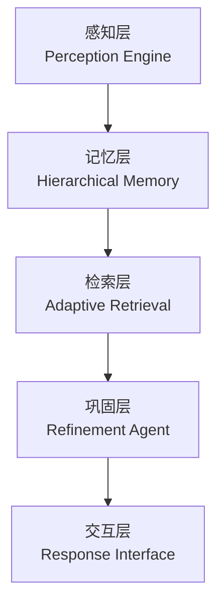
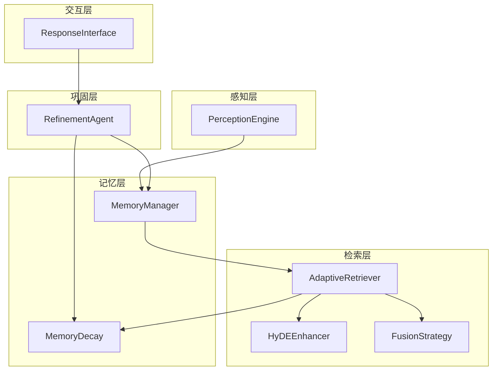
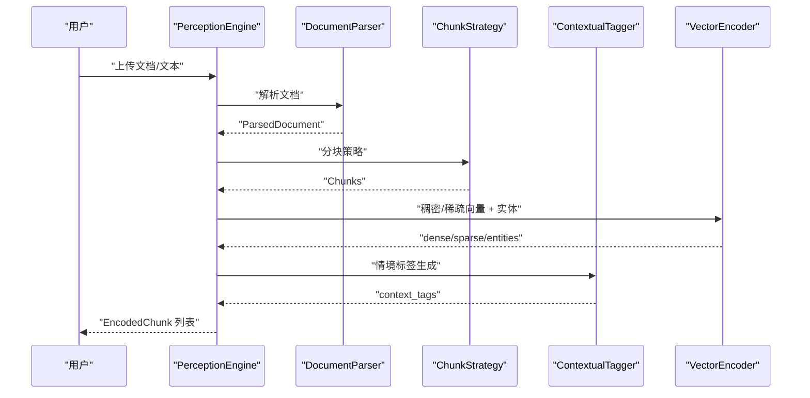
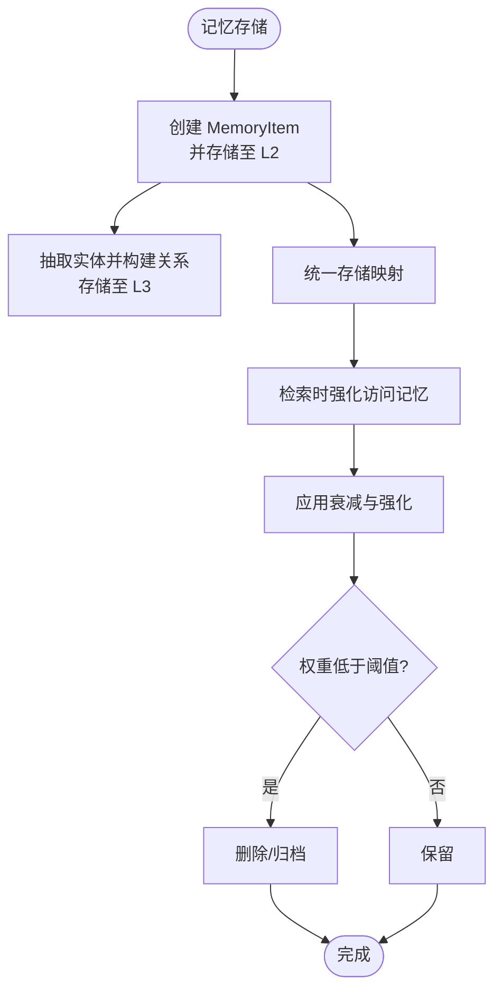
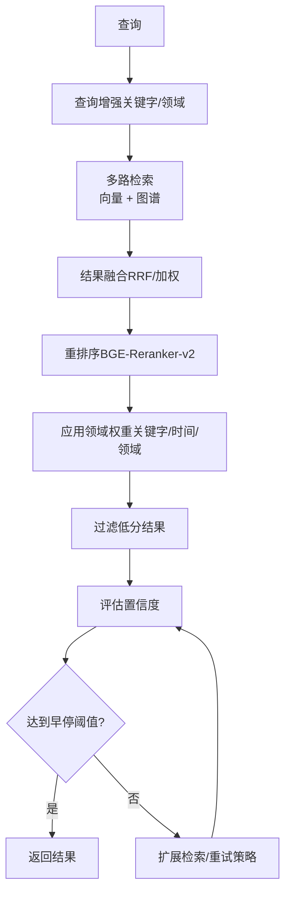
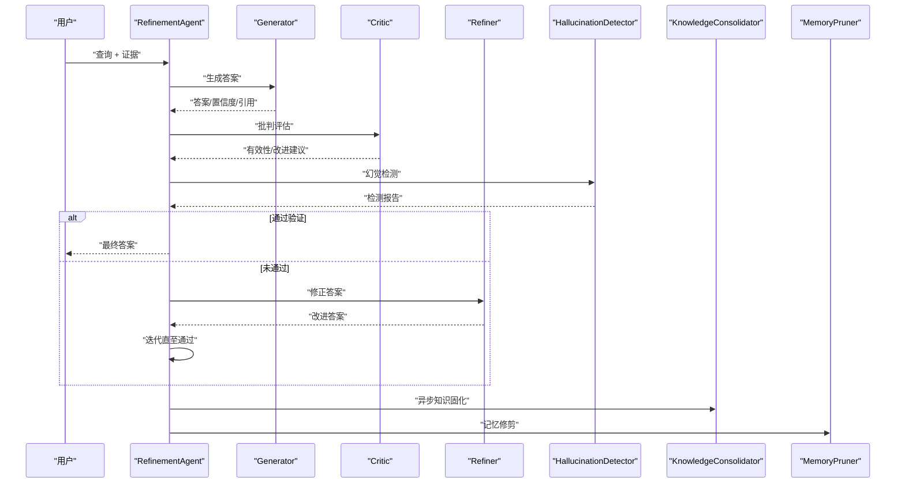
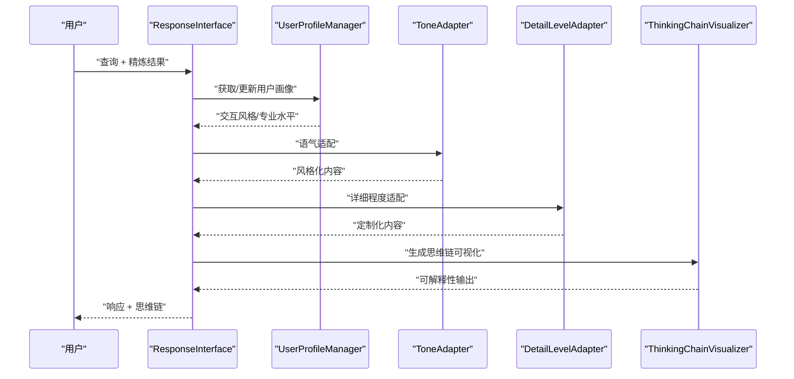
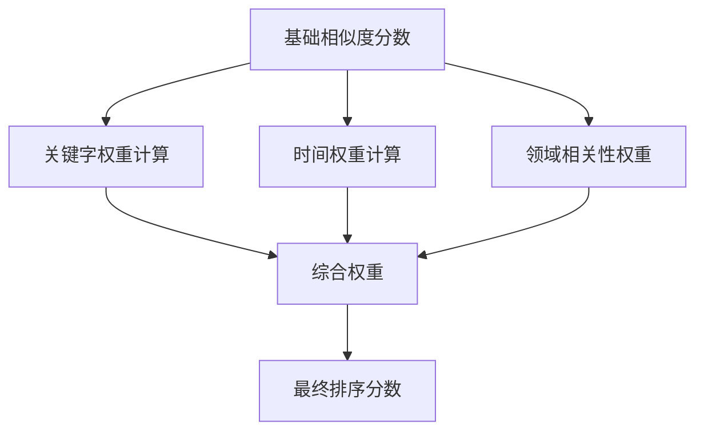
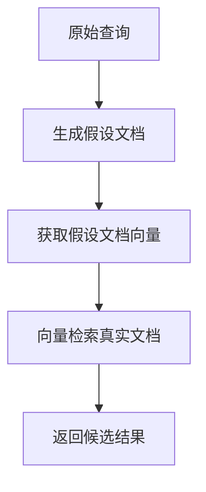
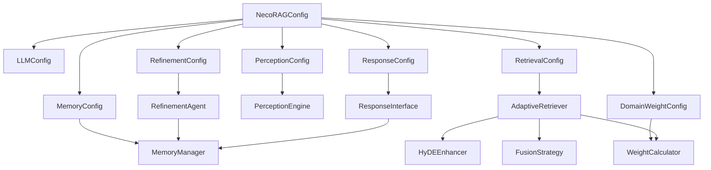

# RAG技术原理

<cite>
**本文引用的文件**
- [README.md](file://README.md)
- [design.md](file://design/design.md)
- [config.py](file://src/core/config.py)
- [manager.py](file://src/memory/manager.py)
- [decay.py](file://src/memory/decay.py)
- [engine.py](file://src/perception/engine.py)
- [retriever.py](file://src/retrieval/retriever.py)
- [hyde.py](file://src/retrieval/hyde.py)
- [fusion.py](file://src/retrieval/fusion.py)
- [weight_calculator.py](file://src/domain/weight_calculator.py)
- [agent.py](file://src/refinement/agent.py)
- [interface.py](file://src/response/interface.py)
- [models.py](file://src/dashboard/models.py)
- [example_usage.py](file://example/example_usage.py)
</cite>

## 目录
1. [引言](#引言)
2. [项目结构](#项目结构)
3. [核心组件](#核心组件)
4. [架构总览](#架构总览)
5. [详细组件分析](#详细组件分析)
6. [依赖分析](#依赖分析)
7. [性能考量](#性能考量)
8. [故障排查指南](#故障排查指南)
9. [结论](#结论)
10. [附录](#附录)

## 引言
本文件面向开发者与技术读者，系统阐述 NecoRAG 的 RAG 技术原理与架构设计。我们将从检索增强生成的基本概念出发，梳理传统 RAG 的局限，进而深入解析 NecoRAG 如何通过“类脑记忆结构”“智能早停机制”“HyDE 增强”“多路检索融合”“主动遗忘与记忆衰减”等技术创新，解决静态知识库、缺乏记忆与反思、被动响应等问题。文档还提供技术演进时间线与与现有框架的对比分析，帮助读者把握 NecoRAG 的技术突破与优势。

## 项目结构
NecoRAG 采用“五层认知”架构，从感知到交互形成完整闭环：
- 感知层（Perception Engine）：多模态数据的高精度编码与情境标记
- 记忆层（Hierarchical Memory）：三层记忆系统（工作记忆 L1 + 语义记忆 L2 + 情景图谱 L3）
- 检索层（Adaptive Retrieval）：混合检索与重排序、HyDE 增强、早停机制
- 巩固层（Refinement Agent）：幻觉自检、知识固化与记忆修剪
- 交互层（Response Interface）：情境自适应生成与思维链可视化

**图示来源**
- [README.md:35-84](file://README.md#L35-L84)
- [design.md:314-321](file://design/design.md#L314-L321)

**章节来源**
- [README.md:35-84](file://README.md#L35-L84)
- [design.md:314-321](file://design/design.md#L314-L321)

## 核心组件
- 统一配置管理：提供全局配置类与模块配置基类，支持从文件与环境变量加载，涵盖 LLM、感知、记忆、检索、巩固、响应与领域权重等模块。
- 感知引擎：集成文档解析、分块、情境标签与向量化编码，输出多模态编码块。
- 记忆管理：统一管理 L1/L2/L3 三层记忆，支持动态权重衰减与主动遗忘。
- 自适应检索：多路检索融合、HyDE 增强、重排序与早停机制。
- 领域权重：关键字、时间与领域相关性加权融合，提升检索精准度。
- 精炼代理：生成-批判-修正闭环，幻觉检测与知识固化。
- 响应接口：情境自适应生成、思维链可视化与用户画像适配。
- Dashboard 数据模型：Profile 管理、模块参数与统计信息。

**章节来源**
- [config.py:232-284](file://src/core/config.py#L232-L284)
- [engine.py:14-41](file://src/perception/engine.py#L14-L41)
- [manager.py:16-47](file://src/memory/manager.py#L16-L47)
- [retriever.py:122-164](file://src/retrieval/retriever.py#L122-L164)
- [weight_calculator.py:56-80](file://src/domain/weight_calculator.py#L56-L80)
- [agent.py:16-60](file://src/refinement/agent.py#L16-L60)
- [interface.py:16-54](file://src/response/interface.py#L16-L54)
- [models.py:164-231](file://src/dashboard/models.py#L164-L231)

## 架构总览
下图展示了 NecoRAG 五层架构的组件交互与数据流：

**图示来源**
- [engine.py:14-41](file://src/perception/engine.py#L14-L41)
- [manager.py:16-47](file://src/memory/manager.py#L16-L47)
- [retriever.py:122-164](file://src/retrieval/retriever.py#L122-L164)
- [hyde.py:17-50](file://src/retrieval/hyde.py#L17-L50)
- [fusion.py:9-17](file://src/retrieval/fusion.py#L9-L17)
- [decay.py:11-22](file://src/memory/decay.py#L11-L22)
- [agent.py:16-60](file://src/refinement/agent.py#L16-L60)
- [interface.py:16-54](file://src/response/interface.py#L16-L54)

## 详细组件分析

### 感知引擎（Perception Engine）
- 职责：多模态数据的高精度编码与情境标记
- 关键能力：
  - 深度文档解析（集成 RAGFlow）
  - 多维度向量化（BGE-M3：稠密向量 + 稀疏向量 + 实体三元组）
  - 情境标签生成（时间、情感、重要性、主题）
- 输出：编码块（包含内容、向量、实体、情境标签与元数据）

**图示来源**
- [engine.py:42-91](file://src/perception/engine.py#L42-L91)

**章节来源**
- [engine.py:14-41](file://src/perception/engine.py#L14-L41)
- [README.md:160-194](file://README.md#L160-L194)

### 记忆层（Hierarchical Memory）
- 三层架构：
  - L1 工作记忆（Redis）：当前会话上下文、用户意图轨迹，TTL 自动过期
  - L2 语义记忆（Qdrant/Milvus）：高维向量存储，模糊匹配与直觉检索
  - L3 情景图谱（Neo4j/NebulaGraph）：实体关系网络，多跳推理
- 创新点：动态权重衰减机制，低频访问知识自动降权或归档，保持记忆库“鲜活”

**图示来源**
- [manager.py:48-113](file://src/memory/manager.py#L48-L113)
- [manager.py:114-147](file://src/memory/manager.py#L114-L147)
- [manager.py:149-167](file://src/memory/manager.py#L149-L167)
- [decay.py:39-71](file://src/memory/decay.py#L39-L71)

**章节来源**
- [manager.py:16-47](file://src/memory/manager.py#L16-L47)
- [manager.py:114-167](file://src/memory/manager.py#L114-L167)
- [decay.py:11-22](file://src/memory/decay.py#L11-L22)
- [README.md:198-243](file://README.md#L198-L243)

### 检索层（Adaptive Retrieval）
- 核心特性：
  - 多跳联想检索（实体 A → B → C）
  - HyDE 增强（解决提问模糊问题）
  - Novelty Re-ranker（抑制重复，优先新颖知识）
  - 早停机制（一旦置信度超过阈值，立即终止检索）
- 关键算法：
  - 早停控制器：基于置信度与边际收益判断是否提前终止
  - 结果融合：RRF（倒数排名融合）与加权融合
  - 领域权重：关键字、时间与领域相关性加权融合

**图示来源**
- [retriever.py:177-254](file://src/retrieval/retriever.py#L177-L254)
- [retriever.py:307-332](file://src/retrieval/retriever.py#L307-L332)
- [retriever.py:333-364](file://src/retrieval/retriever.py#L333-L364)
- [fusion.py:18-71](file://src/retrieval/fusion.py#L18-L71)
- [weight_calculator.py:81-147](file://src/domain/weight_calculator.py#L81-L147)

**章节来源**
- [retriever.py:122-164](file://src/retrieval/retriever.py#L122-L164)
- [retriever.py:177-254](file://src/retrieval/retriever.py#L177-L254)
- [hyde.py:17-50](file://src/retrieval/hyde.py#L17-L50)
- [fusion.py:9-17](file://src/retrieval/fusion.py#L9-L17)
- [weight_calculator.py:56-80](file://src/domain/weight_calculator.py#L56-L80)
- [README.md:247-286](file://README.md#L247-L286)

### 巩固层（Refinement Agent）
- 闭环：Generator → Critic → Refiner
- 能力：
  - 幻觉检测：事实一致性、证据支撑度、逻辑连贯性
  - 异步知识固化：定期分析高频未命中 Query，补充知识缺口
  - 记忆修剪：清理噪声数据，强化重要连接

**图示来源**
- [agent.py:61-129](file://src/refinement/agent.py#L61-L129)
- [agent.py:130-151](file://src/refinement/agent.py#L130-L151)

**章节来源**
- [agent.py:16-60](file://src/refinement/agent.py#L16-L60)
- [agent.py:61-129](file://src/refinement/agent.py#L61-L129)
- [README.md:290-329](file://README.md#L290-L329)

### 交互层（Response Interface）
- 能力：
  - 用户画像适配：根据 L1 层历史交互，动态调整 Tone（专业/幽默）与 Detail Level
  - 思维链可视化：输出检索路径、证据来源与推理过程
  - 多模态合成：自动组合文本、图表甚至生成语音回答

**图示来源**
- [interface.py:55-133](file://src/response/interface.py#L55-L133)
- [interface.py:167-211](file://src/response/interface.py#L167-L211)

**章节来源**
- [interface.py:16-54](file://src/response/interface.py#L16-L54)
- [interface.py:55-133](file://src/response/interface.py#L55-L133)
- [README.md:333-376](file://README.md#L333-L376)

### 领域权重与时间权重（Domain Weight）
- 综合权重公式：最终分数 = 基础相似度 × α×关键字权重 × β×时间权重 × γ×领域权重 × 自定义权重
- 关键模块：
  - 关键字权重：基于领域关键字词典与关键词频率
  - 时间权重：指数衰减模型，区分经典/永久知识
  - 领域相关性权重：基于文本特征与关键字分布

**图示来源**
- [weight_calculator.py:81-147](file://src/domain/weight_calculator.py#L81-L147)

**章节来源**
- [weight_calculator.py:56-80](file://src/domain/weight_calculator.py#L56-L80)
- [weight_calculator.py:81-147](file://src/domain/weight_calculator.py#L81-L147)
- [design.md:241-307](file://design/design.md#L241-L307)

### HyDE 增强（Hypothetical Document Embeddings）
- 思路：先生成假设性答案文档，再用其向量检索真实文档，缓解提问模糊问题
- 实现：提示词模板 + LLM 生成 + 向量嵌入（回退到规则生成）

**图示来源**
- [hyde.py:58-84](file://src/retrieval/hyde.py#L58-L84)
- [hyde.py:123-143](file://src/retrieval/hyde.py#L123-L143)
- [retriever.py:307-332](file://src/retrieval/retriever.py#L307-L332)

**章节来源**
- [hyde.py:17-50](file://src/retrieval/hyde.py#L17-L50)
- [hyde.py:58-122](file://src/retrieval/hyde.py#L58-L122)
- [README.md:252-256](file://README.md#L252-L256)

### 多路检索融合（Fusion Strategy）
- 方法：RRF（倒数排名融合）与加权融合，聚合向量与图谱检索结果
- 优势：提升召回稳定性与多样性

**章节来源**
- [fusion.py:9-17](file://src/retrieval/fusion.py#L9-L17)
- [fusion.py:18-71](file://src/retrieval/fusion.py#L18-L71)
- [fusion.py:72-128](file://src/retrieval/fusion.py#L72-L128)

### 早停机制（Early Termination）
- 策略：基于置信度阈值与边际收益递减，一旦满足条件立即终止冗余检索
- 价值：显著降低延迟与计算开销

**章节来源**
- [retriever.py:30-120](file://src/retrieval/retriever.py#L30-L120)
- [README.md:443-449](file://README.md#L443-L449)

## 依赖分析
- 统一配置管理：提供全局配置与模块配置，支持枚举类型与嵌套属性设置
- 感知引擎：依赖文档解析、分块、情境标签与向量化编码
- 记忆层：依赖工作记忆（Redis）、语义记忆（Qdrant/Milvus）、图谱（Neo4j/NebulaGraph）与衰减机制
- 检索层：依赖 HyDE 增强、重排序模型（BGE-Reranker-v2）、融合策略与领域权重
- 巩固层：依赖精炼代理闭环与后台任务（知识固化/修剪）
- 交互层：依赖用户画像管理、语气与详细程度适配、思维链可视化
- Dashboard：提供 Profile 管理、模块参数与统计信息

**图示来源**
- [config.py:232-284](file://src/core/config.py#L232-L284)
- [engine.py:14-41](file://src/perception/engine.py#L14-L41)
- [manager.py:16-47](file://src/memory/manager.py#L16-L47)
- [retriever.py:122-164](file://src/retrieval/retriever.py#L122-L164)
- [agent.py:16-60](file://src/refinement/agent.py#L16-L60)
- [interface.py:16-54](file://src/response/interface.py#L16-L54)
- [weight_calculator.py:56-80](file://src/domain/weight_calculator.py#L56-L80)

**章节来源**
- [config.py:45-77](file://src/core/config.py#L45-L77)
- [README.md:496-522](file://README.md#L496-L522)

## 性能考量
- 检索准确率（Recall@K）：相比传统向量 RAG 提升 +20%
- 幻觉率：< 5%（通过精炼代理自检）
- 简单查询延迟：< 800ms（首字延迟，早停机制）
- 复杂查询延迟：< 1500ms（多跳 + 重排）
- 上下文压缩率：-40%（通过记忆衰减）

**章节来源**
- [README.md:465-474](file://README.md#L465-L474)

## 故障排查指南
- 配置加载失败：检查环境变量前缀与配置文件路径，确认枚举类型转换
- 检索结果为空：确认查询向量是否正确生成，HyDE 是否启用，融合策略是否生效
- 记忆衰减异常：检查衰减速率与归档阈值，确认访问频率与时间权重计算
- 幻觉检测误报：调整幻觉检测阈值与精炼迭代次数，确保证据支撑度充足
- Dashboard 参数未生效：确认 Profile 是否激活，模块参数是否正确更新

**章节来源**
- [config.py:288-327](file://src/core/config.py#L288-L327)
- [retriever.py:177-254](file://src/retrieval/retriever.py#L177-L254)
- [decay.py:96-119](file://src/memory/decay.py#L96-L119)
- [agent.py:130-151](file://src/refinement/agent.py#L130-L151)
- [models.py:164-231](file://src/dashboard/models.py#L164-L231)

## 结论
NecoRAG 通过“类脑记忆结构”“智能早停”“HyDE 增强”“多路检索融合”“领域权重”“主动遗忘与记忆衰减”等技术创新，系统性解决了传统 RAG 的静态知识库、缺乏记忆与反思、被动响应与情境感知不足等问题。其五层认知架构实现了从感知到交互的完整闭环，既提升了检索准确率与响应速度，又增强了可解释性与可持续演化能力。配合 Dashboard 的配置管理与可视化监控，NecoRAG 为构建下一代认知型 RAG 应用提供了坚实基础。

## 附录

### 技术演进时间线
- 2026 Q2：骨架搭建（MVP）——完成感知与记忆对接、基础向量+图谱混合检索、发布 Core SDK、Dashboard 基础功能
- 2026 Q3：大脑注入（Intelligence）——集成 LangGraph 实现精炼代理、动态重排序与新颖性检测、发布 Server、增强 Dashboard
- 2026 Q4：进化与生态（Evolution）——异步知识固化与自动遗忘、可视化调试面板、插件市场、社区运营

**章节来源**
- [design.md:400-422](file://design/design.md#L400-L422)
- [README.md:475-495](file://README.md#L475-L495)

### 与现有 RAG 框架的对比分析
- 传统框架痛点（来自设计文档）：
  - 记忆扁平化：仅依赖向量相似度，缺乏结构化知识关联，无法处理多跳推理
  - 静态知识库：知识入库后不再进化，缺乏“遗忘”与“巩固”机制
  - 被动检索：仅响应用户查询，缺乏主动联想和自我校正能力，幻觉率较高
  - 缺乏情境感知：无法根据用户历史行为动态调整检索策略和回答风格
- NecoRAG 的突破：
  - 类脑记忆结构：三层记忆系统 + 动态权重衰减 + 主动遗忘
  - 智能早停：基于置信度与边际收益的检索终止策略
  - HyDE 增强：缓解提问模糊，提升检索质量
  - 多路检索融合：向量 + 图谱 + 领域权重 + 重排序
  - 自我反思：幻觉自检与知识固化闭环
  - 可解释性输出：思维链可视化与用户画像适配

**章节来源**
- [design.md:13-21](file://design/design.md#L13-L21)
- [README.md:27-33](file://README.md#L27-L33)
- [README.md:434-464](file://README.md#L434-L464)

### 快速上手与示例
- 完整工作流程示例：感知编码 → 记忆存储 → 智能检索 → 精炼生成 → 响应输出
- Dashboard：Profile 管理、模块参数配置、实时统计与 API 接口

**章节来源**
- [example_usage.py:12-252](file://example/example_usage.py#L12-L252)
- [README.md:103-157](file://README.md#L103-L157)
- [models.py:164-231](file://src/dashboard/models.py#L164-L231)