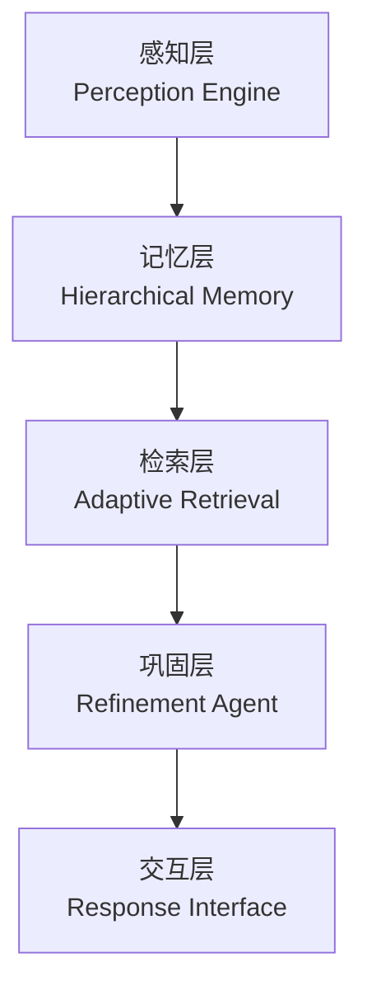
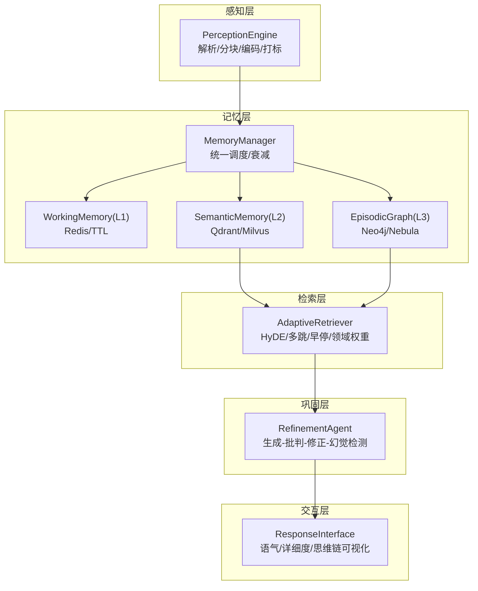
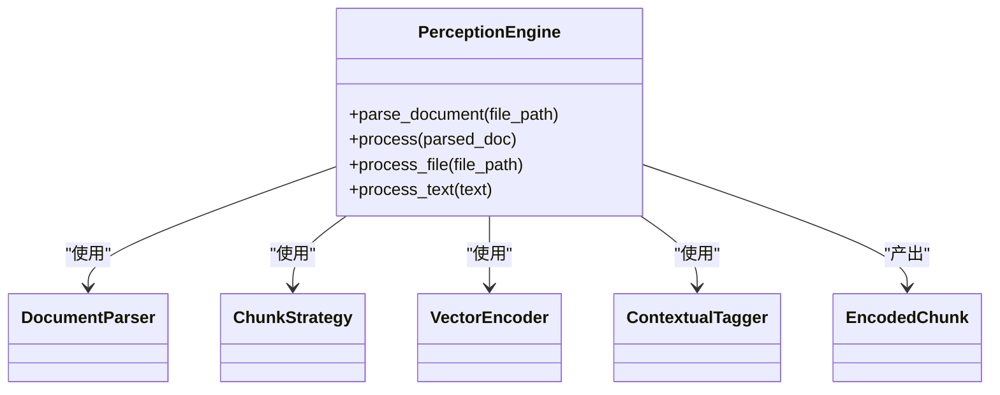
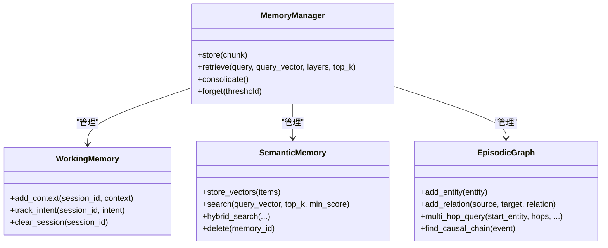
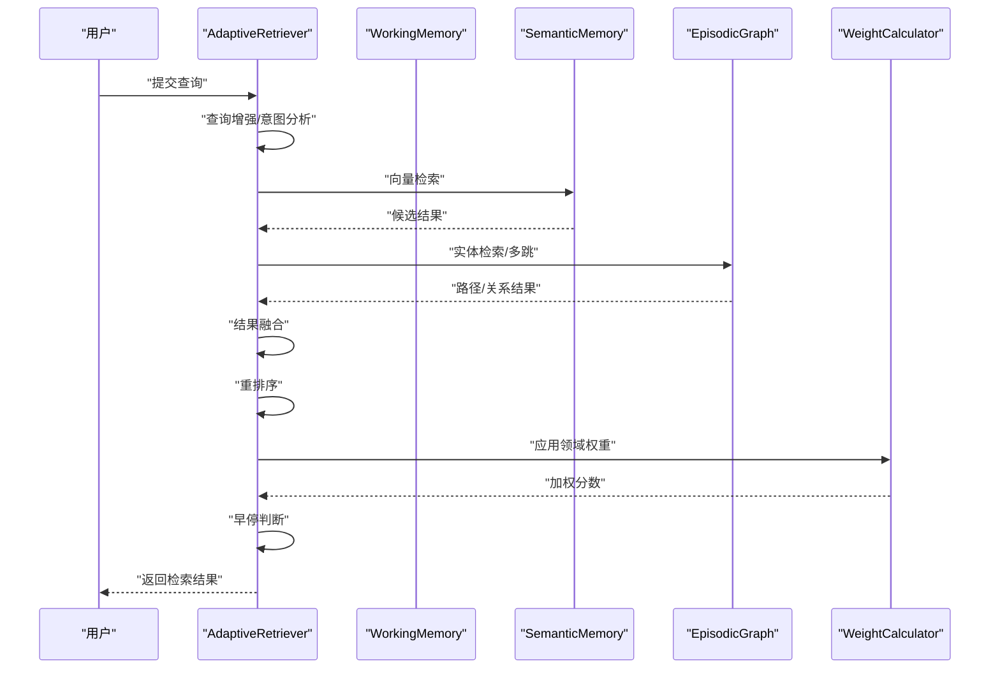
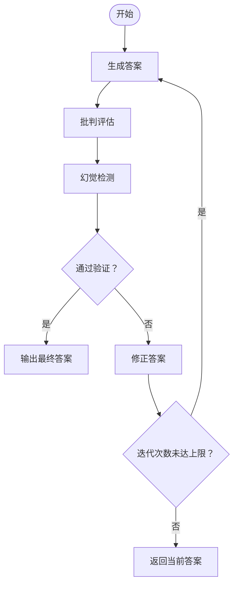
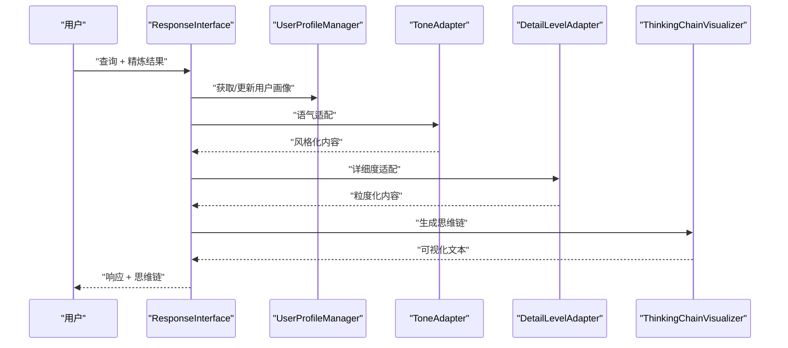
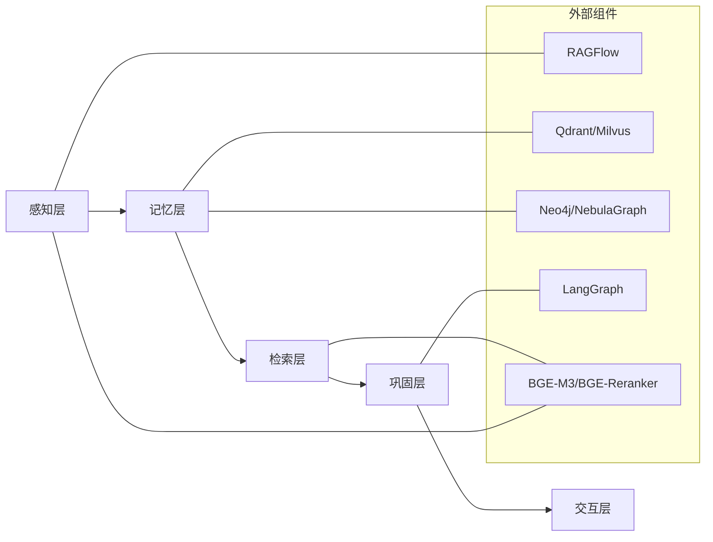

# 五层认知架构设计

<cite>
**本文引用的文件**
- [README.md](file://README.md)
- [design.md](file://design/design.md)
- [base.py](file://src/core/base.py)
- [engine.py](file://src/perception/engine.py)
- [models.py](file://src/perception/models.py)
- [manager.py](file://src/memory/manager.py)
- [models.py](file://src/memory/models.py)
- [working_memory.py](file://src/memory/working_memory.py)
- [semantic_memory.py](file://src/memory/semantic_memory.py)
- [episodic_graph.py](file://src/memory/episodic_graph.py)
- [retriever.py](file://src/retrieval/retriever.py)
- [models.py](file://src/retrieval/models.py)
- [agent.py](file://src/refinement/agent.py)
- [models.py](file://src/refinement/models.py)
- [interface.py](file://src/response/interface.py)
- [models.py](file://src/response/models.py)
- [config.py](file://src/domain/config.py)
- [weight_calculator.py](file://src/domain/weight_calculator.py)
- [models.py](file://src/dashboard/models.py)
</cite>

## 目录
1. [引言](#引言)
2. [项目结构](#项目结构)
3. [核心组件](#核心组件)
4. [架构总览](#架构总览)
5. [详细组件分析](#详细组件分析)
6. [依赖分析](#依赖分析)
7. [性能考量](#性能考量)
8. [故障排查指南](#故障排查指南)
9. [结论](#结论)
10. [附录](#附录)

## 引言
本设计文档围绕 NecoRAG 的五层认知架构展开，系统阐述感知层、记忆层、检索层、巩固层与交互层的职责分工、协作关系与技术实现。文档以神经认知科学为基础，结合类脑记忆机制与扩散激活理论，给出从多模态感知到情境自适应响应的完整闭环。同时，文档提供架构流程图与数据流转示意，明确各层接口定义与通信协议，并总结架构优势、创新点与性能表现。

## 项目结构
NecoRAG 采用“五层认知”分层架构，自下而上分别为：
- 感知层（Perception Engine）：多模态数据的高精度编码与情境标记
- 记忆层（Hierarchical Memory）：三层记忆系统（工作记忆 L1 + 语义记忆 L2 + 情景图谱 L3）
- 检索层（Adaptive Retrieval）：混合检索与重排序、早停机制
- 巩固层（Refinement Agent）：幻觉自检、知识固化与记忆修剪
- 交互层（Response Interface）：情境自适应生成与可解释性输出

**图表来源**
- [design.md:379-385](file://design/design.md#L379-L385)

**章节来源**
- [README.md:35-85](file://README.md#L35-L85)
- [design.md:375-438](file://design/design.md#L375-L438)

## 核心组件
本节概述五层架构中各组件的抽象接口与职责边界，体现模块化与可替换性设计。

- 感知层抽象
  - BaseParser：文档解析器抽象
  - BaseChunker：文本分块器抽象
  - BaseEncoder：向量编码器抽象
  - BaseTagger：情境标签生成器抽象
- 记忆层抽象
  - BaseMemoryStore：记忆存储抽象
  - BaseVectorStore：向量存储抽象
  - BaseGraphStore：图存储抽象
- 检索层抽象
  - BaseRetriever：检索器抽象
  - BaseReranker：重排序器抽象
- 巩固层抽象
  - BaseGenerator：答案生成器抽象
  - BaseCritic：批判器抽象
  - BaseRefiner：修正器抽象
  - BaseHallucinationDetector：幻觉检测器抽象
- 交互层抽象
  - BaseResponseAdapter：响应适配器抽象

上述抽象接口定义于核心基类模块，确保实现的一致性与可替换性。

**章节来源**
- [base.py:19-571](file://src/core/base.py#L19-L571)

## 架构总览
五层架构以“感知-记忆-检索-巩固-交互”的顺序串联，形成闭环：
- 感知层负责多模态输入的编码与情境标注，产出可检索的结构化片段
- 记忆层提供三层存储与动态权重衰减，支撑短期与长期记忆
- 检索层执行混合检索、重排序与早停，提升检索效率与质量
- 巩固层通过生成-批判-修正闭环与幻觉检测，保障答案可信度
- 交互层依据用户画像与上下文，生成情境化响应并可视化思维链

**图表来源**
- [engine.py:14-130](file://src/perception/engine.py#L14-L130)
- [manager.py:16-186](file://src/memory/manager.py#L16-L186)
- [retriever.py:122-440](file://src/retrieval/retriever.py#L122-L440)
- [agent.py:16-151](file://src/refinement/agent.py#L16-L151)
- [interface.py:16-224](file://src/response/interface.py#L16-L224)

## 详细组件分析

### 感知层：多模态编码与情境标记
- 职责
  - 深度文档解析（集成 RAGFlow）
  - 多维度向量化（BGE-M3：稠密向量 + 稀疏向量 + 实体三元组）
  - 情境标签生成（时间、情感、重要性、主题）
- 技术实现
  - 解析器：将文件/文本解析为结构化文档
  - 分块器：固定大小 + 重叠分块
  - 编码器：BGE-M3 生成稠密/稀疏向量与实体三元组
  - 标签器：为每个 Chunk 生成情境标签
  - 输出：EncodedChunk（含向量、实体、情境标签与元数据）

**图表来源**
- [engine.py:14-130](file://src/perception/engine.py#L14-L130)
- [models.py:11-69](file://src/perception/models.py#L11-L69)

**章节来源**
- [README.md:160-195](file://README.md#L160-L195)
- [engine.py:14-130](file://src/perception/engine.py#L14-L130)
- [models.py:11-69](file://src/perception/models.py#L11-L69)

### 记忆层：三层记忆与动态权重衰减
- 职责
  - L1 工作记忆（Redis/TTL）：短期上下文与意图轨迹
  - L2 语义记忆（Qdrant/Milvus）：高维向量检索
  - L3 情景图谱（Neo4j/Nebula）：实体关系网络，支持多跳推理
  - 动态权重衰减：时间与访问频率驱动的记忆巩固/归档
- 技术实现
  - MemoryManager 统一调度三层存储
  - WorkingMemory：会话上下文 + 意图轨迹 + TTL
  - SemanticMemory：向量存储 + 混合检索（最小实现为余弦相似度）
  - EpisodicGraph：实体/关系 + 多跳 BFS
  - MemoryDecay：权重衰减 + 归档阈值

**图表来源**
- [manager.py:16-186](file://src/memory/manager.py#L16-L186)
- [working_memory.py:11-120](file://src/memory/working_memory.py#L11-L120)
- [semantic_memory.py:21-179](file://src/memory/semantic_memory.py#L21-L179)
- [episodic_graph.py:10-194](file://src/memory/episodic_graph.py#L10-L194)
- [models.py:12-67](file://src/memory/models.py#L12-L67)

**章节来源**
- [README.md:198-244](file://README.md#L198-L244)
- [manager.py:16-186](file://src/memory/manager.py#L16-L186)
- [working_memory.py:11-120](file://src/memory/working_memory.py#L11-L120)
- [semantic_memory.py:21-179](file://src/memory/semantic_memory.py#L21-L179)
- [episodic_graph.py:10-194](file://src/memory/episodic_graph.py#L10-L194)
- [models.py:12-67](file://src/memory/models.py#L12-L67)

### 检索层：自适应检索与早停机制
- 职责
  - 多路检索：向量检索 + 图谱检索
  - HyDE 增强：先生成假设文档再检索
  - Novelty Re-ranker：抑制重复，优先新颖知识
  - 早停机制：置信度阈值 + 边际收益递减
  - 领域权重：关键字/时间/领域相关性加权融合
- 技术实现
  - AdaptiveRetriever：检索主控，聚合多路结果
  - EarlyTerminationController：置信度评估与早停判断
  - DomainConfig/CompositeWeightCalculator：领域权重计算
  - FusionStrategy：倒数秩融合

**图表来源**
- [retriever.py:122-440](file://src/retrieval/retriever.py#L122-L440)
- [config.py:54-161](file://src/domain/config.py#L54-L161)
- [weight_calculator.py:56-206](file://src/domain/weight_calculator.py#L56-L206)

**章节来源**
- [README.md:247-287](file://README.md#L247-L287)
- [retriever.py:122-440](file://src/retrieval/retriever.py#L122-L440)
- [models.py:9-29](file://src/retrieval/models.py#L9-L29)
- [config.py:54-161](file://src/domain/config.py#L54-L161)
- [weight_calculator.py:56-206](file://src/domain/weight_calculator.py#L56-L206)

### 巩固层：幻觉自检与知识进化
- 职责
  - 生成-批判-修正闭环：Generator → Critic → Refiner
  - 幻觉检测：事实一致性、证据支撑度、逻辑连贯性
  - 异步知识固化：高频未命中查询的缺口补充
  - 记忆修剪：噪声数据清理与连接强化
- 技术实现
  - RefinementAgent：协调各子组件，控制迭代
  - HallucinationDetector：检测事实/逻辑/支撑问题
  - KnowledgeConsolidator/MemoryPruner：后台任务

**图表来源**
- [agent.py:16-151](file://src/refinement/agent.py#L16-L151)
- [models.py:9-66](file://src/refinement/models.py#L9-L66)

**章节来源**
- [README.md:290-330](file://README.md#L290-L330)
- [agent.py:16-151](file://src/refinement/agent.py#L16-L151)
- [models.py:9-66](file://src/refinement/models.py#L9-L66)

### 交互层：情境自适应与思维链可视化
- 职责
  - 用户画像适配：专业水平、交互风格、偏好领域
  - Tone/Detail Level 自适应：语气与详细程度
  - 思维链可视化：检索路径、证据来源、推理过程
- 技术实现
  - ResponseInterface：统一响应生成与可视化
  - UserProfileManager：用户画像与偏好分析
  - ToneAdapter/DetailLevelAdapter：内容风格与粒度适配
  - ThinkingChainVisualizer：可解释性输出

**图表来源**
- [interface.py:16-224](file://src/response/interface.py#L16-L224)
- [models.py:10-53](file://src/response/models.py#L10-L53)

**章节来源**
- [README.md:333-377](file://README.md#L333-L377)
- [interface.py:16-224](file://src/response/interface.py#L16-L224)
- [models.py:10-53](file://src/response/models.py#L10-L53)

## 依赖分析
- 组件耦合
  - 感知层与记忆层：感知产物作为记忆输入，记忆管理器统一调度
  - 记忆层与检索层：L2/L3 为检索提供向量与图谱支持
  - 检索层与巩固层：检索证据作为生成材料
  - 巩固层与交互层：精炼结果驱动响应生成
- 外部依赖
  - 文档解析：RAGFlow
  - 向量数据库：Qdrant/Milvus
  - 图数据库：Neo4j/NebulaGraph
  - 编排引擎：LangGraph（计划集成）
  - 重排序模型：BGE-Reranker-v2
  - 嵌入模型：BGE-M3
- 接口契约
  - 各层通过抽象基类定义接口，确保实现替换与扩展

**图表来源**
- [README.md:496-510](file://README.md#L496-L510)
- [base.py:19-571](file://src/core/base.py#L19-L571)

**章节来源**
- [README.md:496-523](file://README.md#L496-L523)
- [base.py:19-571](file://src/core/base.py#L19-L571)

## 性能考量
- 检索效率
  - 早停机制：在置信度达标时提前终止，降低计算开销
  - 多路融合与重排序：提升召回质量与相关性
- 记忆优化
  - 动态权重衰减：降低低价值信息对上下文的影响
  - 主动遗忘：定期归档低权重记忆，保持系统“鲜活”
- 生成质量
  - 幻觉自检闭环：事实一致性、证据支撑度与逻辑连贯性三重验证
  - 异步知识固化：后台周期性补充知识缺口
- 可解释性
  - 思维链可视化：展示检索路径、证据来源与推理过程

**章节来源**
- [README.md:434-474](file://README.md#L434-L474)
- [retriever.py:30-120](file://src/retrieval/retriever.py#L30-L120)
- [manager.py:149-186](file://src/memory/manager.py#L149-L186)
- [agent.py:130-151](file://src/refinement/agent.py#L130-L151)
- [interface.py:167-211](file://src/response/interface.py#L167-L211)

## 故障排查指南
- 检索结果质量不佳
  - 检查领域权重配置与时间衰减设置
  - 确认 HyDE 与多跳检索是否启用
  - 核查早停阈值是否过高导致过早终止
- 记忆访问异常
  - 检查 L1 TTL 与 L2/L3 存储连接
  - 确认记忆衰减与归档阈值设置
- 幻觉检测误报
  - 调整幻觉检测阈值与迭代次数
  - 检查证据来源与生成材料质量
- 响应风格不符
  - 校验用户画像与偏好设置
  - 检查语气与详细度适配逻辑

**章节来源**
- [retriever.py:122-440](file://src/retrieval/retriever.py#L122-L440)
- [manager.py:16-186](file://src/memory/manager.py#L16-L186)
- [agent.py:16-151](file://src/refinement/agent.py#L16-L151)
- [interface.py:16-224](file://src/response/interface.py#L16-L224)

## 结论
NecoRAG 的五层认知架构以神经科学理论为指导，结合类脑记忆与扩散激活机制，实现了从感知到交互的完整闭环。通过多模态编码、三层记忆、混合检索、幻觉自检与情境适配，系统在准确性、效率与可解释性方面取得平衡。未来可进一步集成 LangGraph 实现编排闭环，完善图谱构建与因果链条追踪，并通过 Dashboard 提供可视化调试与配置管理。

## 附录
- 配置管理（Dashboard）
  - 支持五大模块参数配置与 Profile 管理
  - 提供统计监控与 RESTful API
- 数据模型
  - 记忆层：MemoryItem、Entity、Relation、GraphPath、Intent
  - 检索层：RetrievalResult、QueryAnalysis
  - 巩固层：HallucinationReport、GeneratedAnswer、CritiqueReport、RefinementResult、KnowledgeGap、QueryPattern
  - 交互层：UserProfile、Interaction、Response、RetrievalVisualization
  - 领域配置：DomainConfig、KeywordConfig、DomainConfigManager、CompositeWeightCalculator

**章节来源**
- [README.md:380-433](file://README.md#L380-L433)
- [models.py:12-231](file://src/dashboard/models.py#L12-L231)
- [models.py:19-67](file://src/memory/models.py#L19-L67)
- [models.py:9-29](file://src/retrieval/models.py#L9-L29)
- [models.py:9-66](file://src/refinement/models.py#L9-L66)
- [models.py:10-53](file://src/response/models.py#L10-L53)
- [config.py:54-161](file://src/domain/config.py#L54-L161)
- [weight_calculator.py:56-206](file://src/domain/weight_calculator.py#L56-L206)