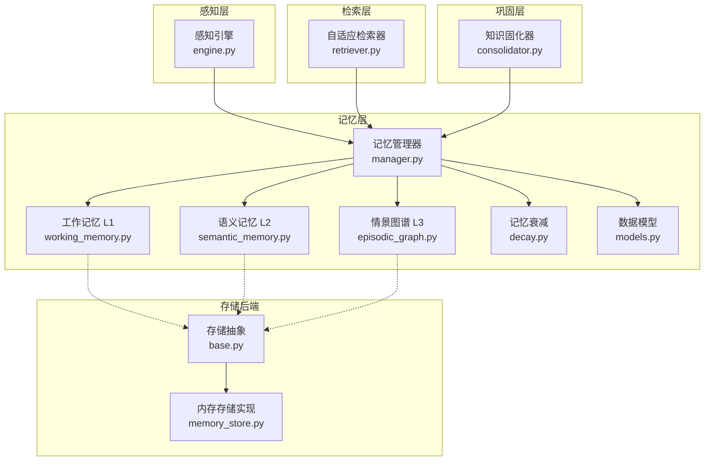
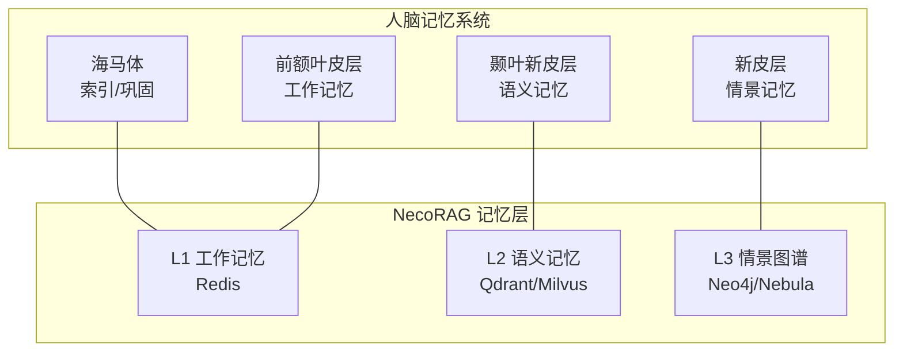
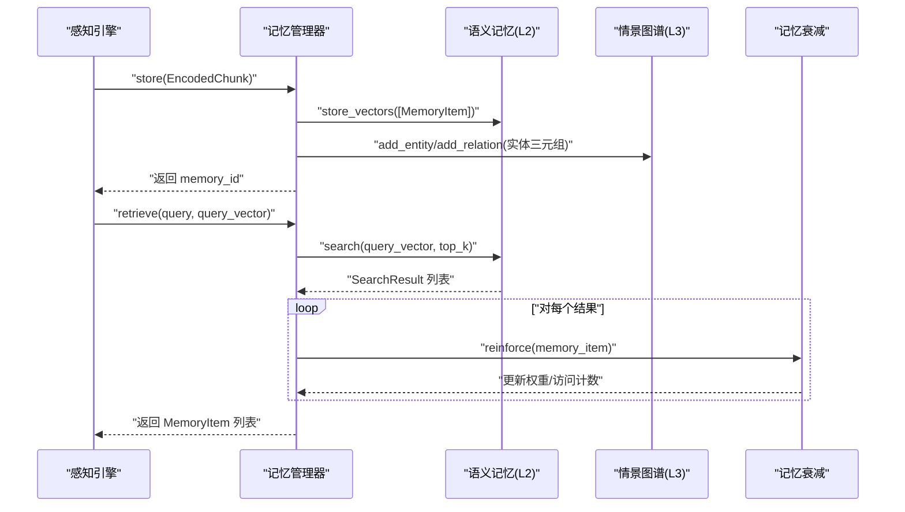
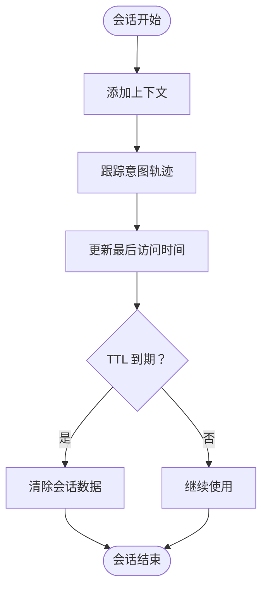
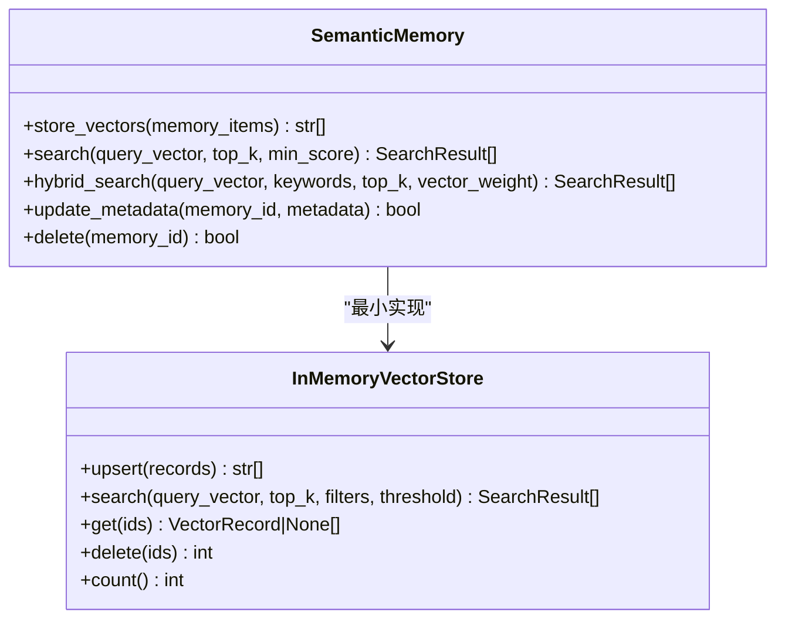
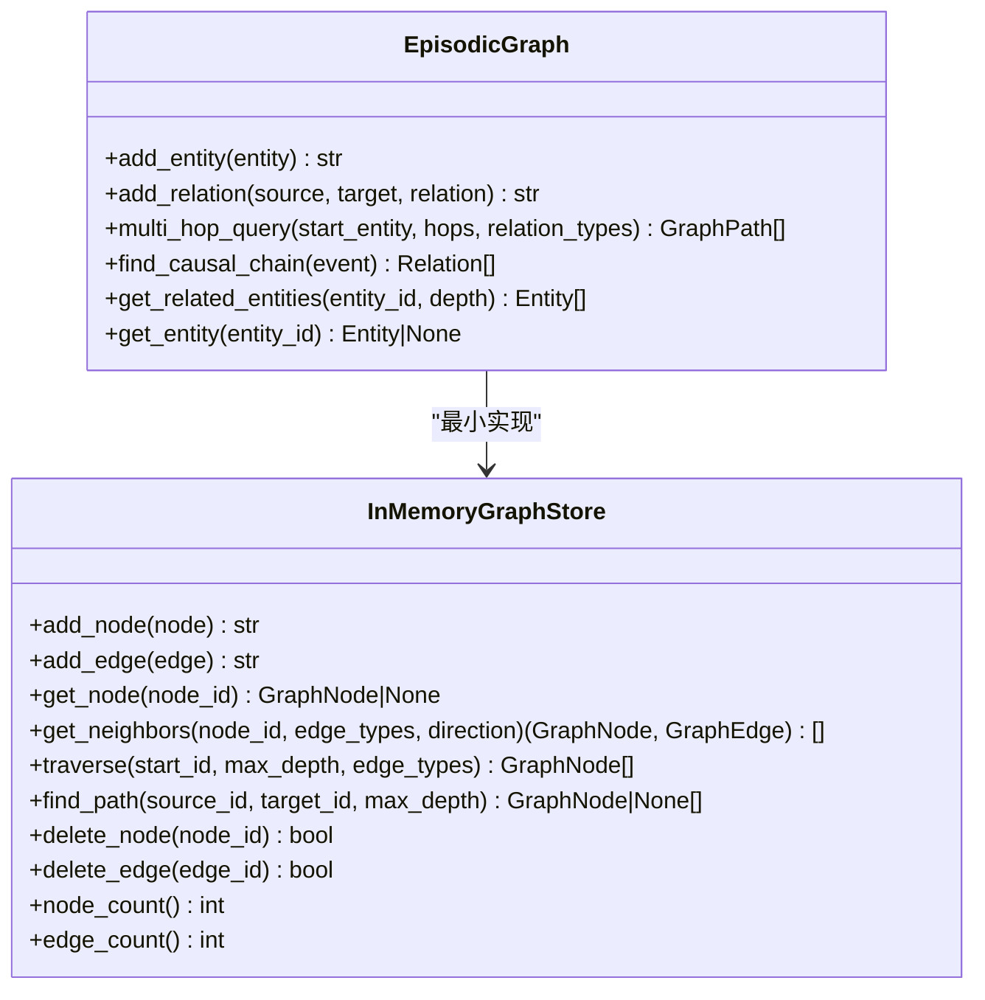
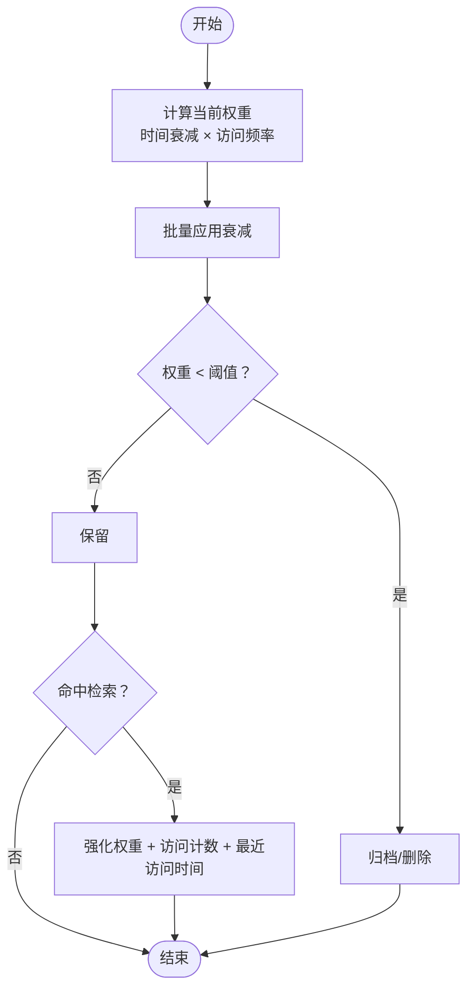
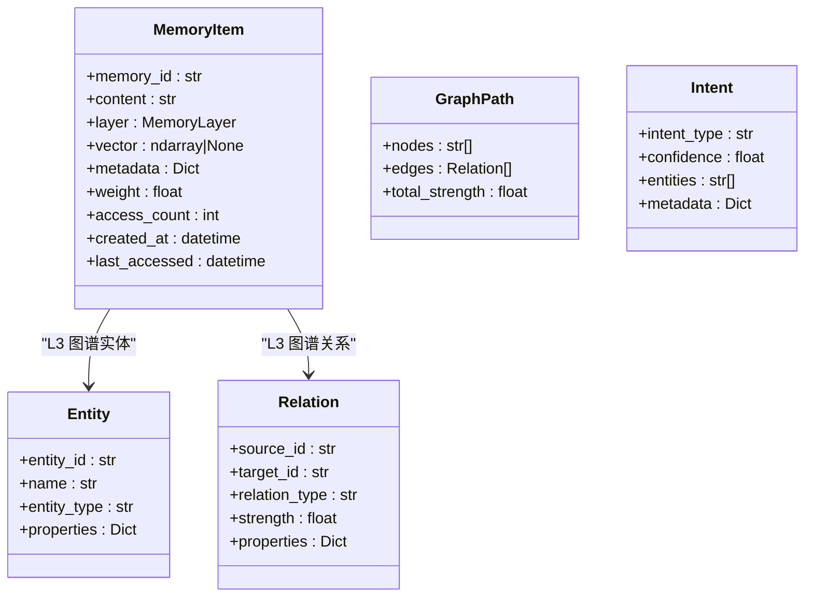
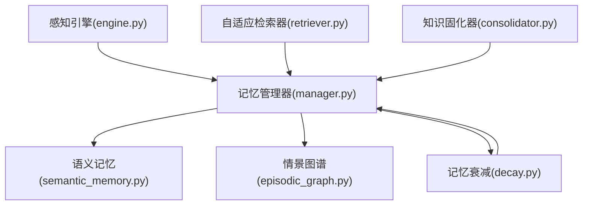

# 多层记忆系统设计

<cite>
**本文引用的文件**
- [design.md](file://design/design.md)
- [README.md](file://src/memory/README.md)
- [manager.py](file://src/memory/manager.py)
- [working_memory.py](file://src/memory/working_memory.py)
- [semantic_memory.py](file://src/memory/semantic_memory.py)
- [episodic_graph.py](file://src/memory/episodic_graph.py)
- [decay.py](file://src/memory/decay.py)
- [models.py](file://src/memory/models.py)
- [memory_store.py](file://src/memory/backends/memory_store.py)
- [base.py](file://src/memory/backends/base.py)
- [engine.py](file://src/perception/engine.py)
- [retriever.py](file://src/retrieval/retriever.py)
- [consolidator.py](file://src/refinement/consolidator.py)
</cite>

## 目录
1. [简介](#简介)
2. [项目结构](#项目结构)
3. [核心组件](#核心组件)
4. [架构总览](#架构总览)
5. [详细组件分析](#详细组件分析)
6. [依赖关系分析](#依赖关系分析)
7. [性能考量](#性能考量)
8. [故障排查指南](#故障排查指南)
9. [结论](#结论)
10. [附录](#附录)

## 简介
本设计文档围绕 NecoRAG 的多层记忆系统展开，系统以人脑记忆机制为理论基础，构建三层记忆（工作记忆 L1、语义记忆 L2、情景图谱 L3），并配套记忆衰减、主动遗忘与巩固机制。文档旨在帮助开发者理解各层的神经科学基础、技术实现、容量与生命周期管理、数据流与同步机制，以及分布式存储下的性能优化策略。

## 项目结构
NecoRAG 的记忆层位于 src/memory 目录，包含记忆管理器、三层记忆实现、衰减机制、数据模型以及内存存储后端抽象与实现。感知层（Perception Engine）负责将原始数据编码为多模态向量与实体三元组，随后由记忆管理器统一调度至三层记忆。

**图表来源**
- [engine.py:14-130](file://src/perception/engine.py#L14-L130)
- [manager.py:16-186](file://src/memory/manager.py#L16-L186)
- [working_memory.py:11-120](file://src/memory/working_memory.py#L11-L120)
- [semantic_memory.py:21-179](file://src/memory/semantic_memory.py#L21-L179)
- [episodic_graph.py:10-194](file://src/memory/episodic_graph.py#L10-L194)
- [decay.py:11-155](file://src/memory/decay.py#L11-L155)
- [models.py:12-67](file://src/memory/models.py#L12-L67)
- [retriever.py:122-440](file://src/retrieval/retriever.py#L122-L440)
- [consolidator.py:9-142](file://src/refinement/consolidator.py#L9-L142)
- [base.py:54-297](file://src/memory/backends/base.py#L54-L297)
- [memory_store.py:20-381](file://src/memory/backends/memory_store.py#L20-L381)

**章节来源**
- [design.md:32-215](file://design/design.md#L32-L215)
- [README.md:1-244](file://src/memory/README.md#L1-L244)

## 核心组件
- 记忆管理器：统一协调 L1/L2/L3 的存储、检索、巩固与遗忘。
- 工作记忆（L1）：会话上下文与意图轨迹，模拟瞬时遗忘与 TTL。
- 语义记忆（L2）：高维向量存储与模糊检索，支持混合搜索。
- 情景图谱（L3）：实体关系网络，支持多跳推理与因果链。
- 记忆衰减：基于时间与访问频率的权重衰减与归档。
- 数据模型：MemoryItem、Entity、Relation 等统一的数据结构。
- 存储后端：BaseVectorStore/BaseGraphStore 抽象与 InMemory 实现。

**章节来源**
- [manager.py:16-186](file://src/memory/manager.py#L16-L186)
- [working_memory.py:11-120](file://src/memory/working_memory.py#L11-L120)
- [semantic_memory.py:21-179](file://src/memory/semantic_memory.py#L21-L179)
- [episodic_graph.py:10-194](file://src/memory/episodic_graph.py#L10-L194)
- [decay.py:11-155](file://src/memory/decay.py#L11-L155)
- [models.py:12-67](file://src/memory/models.py#L12-L67)
- [base.py:54-297](file://src/memory/backends/base.py#L54-L297)
- [memory_store.py:20-381](file://src/memory/backends/memory_store.py#L20-L381)

## 架构总览
三层记忆系统与神经科学基础映射如下：
- L1 工作记忆：前额叶皮层，容量有限、瞬时遗忘，对应 Redis 缓存。
- L2 语义记忆：颞叶新皮层，概念知识、无时间标记，对应 Qdrant/Milvus 向量库。
- L3 情景图谱：海马体 → 新皮层，个人经历与关系网络，对应 Neo4j/NebulaGraph。

**图表来源**
- [design.md:32-215](file://design/design.md#L32-L215)

## 详细组件分析

### 记忆管理器（MemoryManager）
- 职责：统一管理三层记忆、跨层检索、记忆巩固与主动遗忘。
- 存储流程：将感知引擎产出的 EncodedChunk 存入 L2 向量库，并将实体三元组写入 L3 图谱。
- 检索流程：优先 L2 向量检索，结合记忆衰减强化权重后返回。
- 巩固与遗忘：批量应用衰减、识别低权重并归档/删除。

**图表来源**
- [manager.py:48-147](file://src/memory/manager.py#L48-L147)
- [semantic_memory.py:50-118](file://src/memory/semantic_memory.py#L50-L118)
- [decay.py:120-142](file://src/memory/decay.py#L120-L142)

**章节来源**
- [manager.py:16-186](file://src/memory/manager.py#L16-L186)

### 工作记忆（L1，Redis）
- 特性：极低延迟、TTL 自动过期、LRU 淘汰、瞬时遗忘。
- 数据：会话上下文、用户意图轨迹。
- 生命周期：会话结束或过期自动清理。

**图表来源**
- [working_memory.py:36-95](file://src/memory/working_memory.py#L36-L95)

**章节来源**
- [working_memory.py:11-120](file://src/memory/working_memory.py#L11-L120)

### 语义记忆（L2，Qdrant/Milvus）
- 特性：高维向量存储、混合搜索、HNSW 索引、模糊匹配。
- 实现：最小实现为内存向量存储，提供 upsert/search/get/delete/count 等接口。
- 检索：余弦相似度计算，支持阈值过滤与 top_k 返回。

**图表来源**
- [semantic_memory.py:21-179](file://src/memory/semantic_memory.py#L21-L179)
- [memory_store.py:20-141](file://src/memory/backends/memory_store.py#L20-L141)

**章节来源**
- [semantic_memory.py:21-179](file://src/memory/semantic_memory.py#L21-L179)
- [memory_store.py:20-141](file://src/memory/backends/memory_store.py#L20-L141)

### 情景图谱（L3，Neo4j/NebulaGraph）
- 特性：实体关系存储、多跳推理、因果链条追踪、结构化记忆。
- 实现：最小实现为内存图结构，提供 BFS 多跳查询、因果链查找、相关实体检索等。
- 与 L2 协同：从实体三元组构建图谱，支撑检索层的扩散激活与多跳检索。

**图表来源**
- [episodic_graph.py:10-194](file://src/memory/episodic_graph.py#L10-L194)
- [memory_store.py:143-381](file://src/memory/backends/memory_store.py#L143-L381)

**章节来源**
- [episodic_graph.py:10-194](file://src/memory/episodic_graph.py#L10-L194)
- [memory_store.py:143-381](file://src/memory/backends/memory_store.py#L143-L381)

### 记忆衰减与主动遗忘
- 衰减公式：权重随时间指数衰减，同时考虑访问频率增强。
- 主动遗忘：识别低权重记忆并归档/删除，保持知识库“鲜活”。
- 强化机制：检索命中后提升权重与访问计数，限制最大权重。

**图表来源**
- [decay.py:39-142](file://src/memory/decay.py#L39-L142)

**章节来源**
- [decay.py:11-155](file://src/memory/decay.py#L11-L155)

### 数据模型与存储抽象
- 数据模型：MemoryItem、Entity、Relation、GraphPath、Intent 等。
- 存储抽象：BaseVectorStore/BaseGraphStore 定义统一接口，InMemory 实现用于开发测试。

**图表来源**
- [models.py:19-67](file://src/memory/models.py#L19-L67)

**章节来源**
- [models.py:12-67](file://src/memory/models.py#L12-L67)
- [base.py:54-297](file://src/memory/backends/base.py#L54-L297)

## 依赖关系分析
- 记忆管理器依赖感知引擎的 EncodedChunk，将稠密向量、稀疏向量与实体三元组分别写入 L2 与 L3。
- 检索层（AdaptiveRetriever）依赖 MemoryManager 的语义记忆检索与图谱多跳查询。
- 巩固层（KnowledgeConsolidator）依赖 MemoryManager 的查询模式分析与知识缺口填补。

**图表来源**
- [engine.py:14-130](file://src/perception/engine.py#L14-L130)
- [manager.py:16-186](file://src/memory/manager.py#L16-L186)
- [retriever.py:122-440](file://src/retrieval/retriever.py#L122-L440)
- [consolidator.py:9-142](file://src/refinement/consolidator.py#L9-L142)
- [semantic_memory.py:21-179](file://src/memory/semantic_memory.py#L21-L179)
- [episodic_graph.py:10-194](file://src/memory/episodic_graph.py#L10-L194)
- [decay.py:11-155](file://src/memory/decay.py#L11-L155)

**章节来源**
- [engine.py:14-130](file://src/perception/engine.py#L14-L130)
- [manager.py:16-186](file://src/memory/manager.py#L16-L186)
- [retriever.py:122-440](file://src/retrieval/retriever.py#L122-L440)
- [consolidator.py:9-142](file://src/refinement/consolidator.py#L9-L142)

## 性能考量
- 写入延迟与检索延迟（来自设计文档）：
  - L1：写入延迟 < 5ms，检索延迟 < 2ms
  - L2：写入延迟 < 50ms，检索延迟 < 100ms
  - L3：写入延迟 < 100ms，检索延迟 < 500ms
- 容量规模（来自设计文档）：
  - L1：约 10 万条
  - L2：千万级向量
  - L3：亿级节点
- 优化建议：
  - L1：合理设置 TTL 与会话上限，避免内存膨胀；必要时接入真实 Redis。
  - L2：采用 HNSW 索引与混合检索（向量+关键词），并按需裁剪低分结果。
  - L3：图遍历与多跳查询应限制最大深度与边类型，避免爆炸式搜索。
  - 衰减与早停：结合记忆权重与置信度阈值，实现“早停机制”，减少无效计算。
  - 分布式存储：通过 BaseVectorStore/BaseGraphStore 抽象，替换为真实数据库（Qdrant/Milvus/Neo4j/NebulaGraph），并实现冷热数据迁移与副本策略。

[本节为通用性能讨论，无需列出具体文件来源]

## 故障排查指南
- 检索结果为空或质量差
  - 检查 L2 向量维度与查询向量维度是否一致。
  - 检查最小相似度阈值与 top_k 设置是否合理。
  - 确认实体三元组是否正确写入 L3，以便后续多跳检索。
- 记忆过期或频繁遗忘
  - 检查 L1 TTL 设置与会话清理逻辑。
  - 检查记忆衰减阈值与强化策略是否生效。
- 图谱查询异常
  - 检查节点与边是否存在，邻接表是否正确更新。
  - 多跳查询深度与边类型过滤是否过严。
- 存储后端问题
  - 确认 BaseVectorStore/BaseGraphStore 的实现与真实数据库驱动兼容。
  - 检查内存实现的 clear/clear_all 方法是否被误用。

**章节来源**
- [memory_store.py:20-381](file://src/memory/backends/memory_store.py#L20-L381)
- [semantic_memory.py:50-179](file://src/memory/semantic_memory.py#L50-L179)
- [episodic_graph.py:33-194](file://src/memory/episodic_graph.py#L33-L194)
- [working_memory.py:97-120](file://src/memory/working_memory.py#L97-L120)
- [decay.py:96-155](file://src/memory/decay.py#L96-L155)

## 结论
NecoRAG 的多层记忆系统以人脑记忆机制为蓝图，通过 L1（工作记忆）、L2（语义记忆）、L3（情景图谱）的协同，实现了从瞬时上下文到长期结构化知识的完整记忆通路。配合记忆衰减、主动遗忘与巩固机制，系统能够在保证检索质量的同时，维持知识库的“新鲜度”。未来可在真实数据库与分布式存储上进一步扩展，以满足更大规模与更高性能的需求。

[本节为总结性内容，无需列出具体文件来源]

## 附录

### 三层记忆的神经科学基础与技术映射
- 工作记忆（L1）：前额叶皮层，容量有限、瞬时遗忘 → Redis 缓存层
- 语义记忆（L2）：颞叶新皮层，概念知识、无时间标记 → Qdrant/Milvus 向量库
- 情景记忆（L3）：海马体 → 新皮层，个人经历与关系网络 → Neo4j/NebulaGraph 图谱

**章节来源**
- [design.md:32-215](file://design/design.md#L32-L215)

### 记忆系统性能指标与优化策略
- 性能指标（设计文档给出）：L1/L2/L3 的写入/检索延迟与容量规模。
- 优化策略：早停机制、权重衰减、阈值过滤、索引优化、分布式存储与冷热迁移。

**章节来源**
- [README.md:223-244](file://src/memory/README.md#L223-L244)
- [retriever.py:30-120](file://src/retrieval/retriever.py#L30-L120)
- [decay.py:11-155](file://src/memory/decay.py#L11-L155)