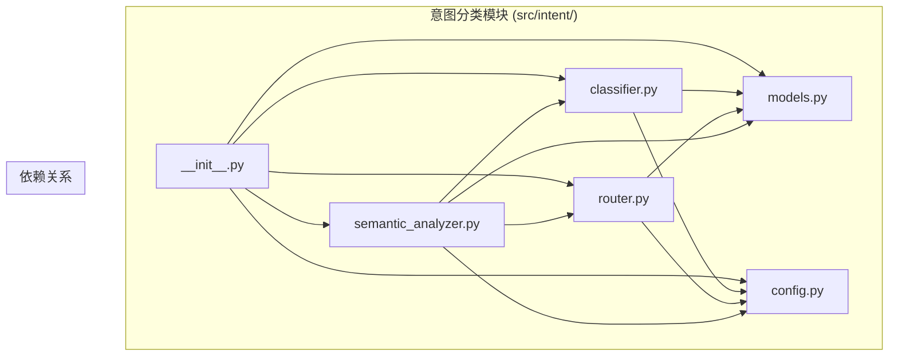
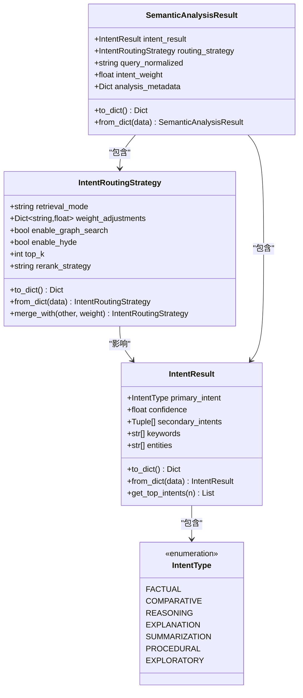
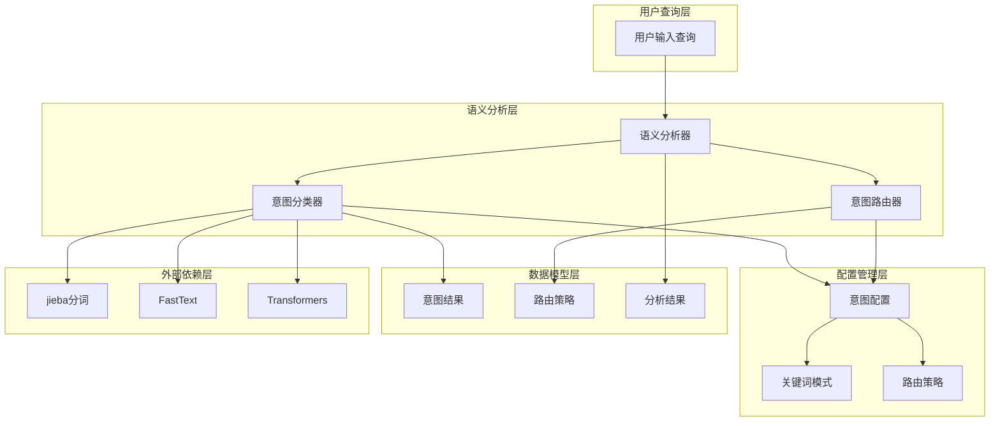
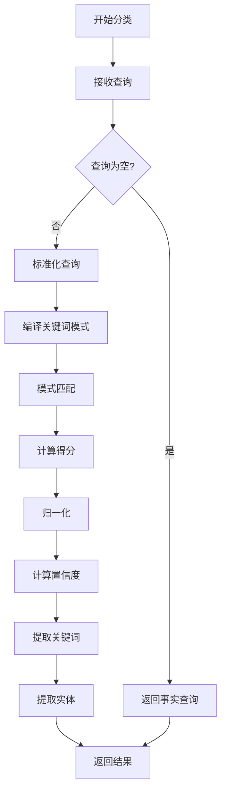
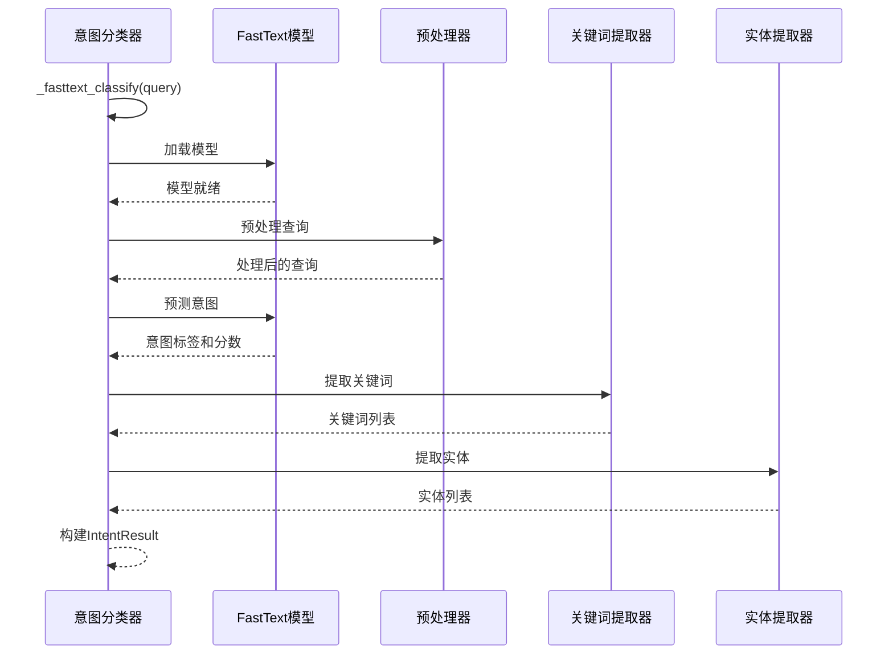
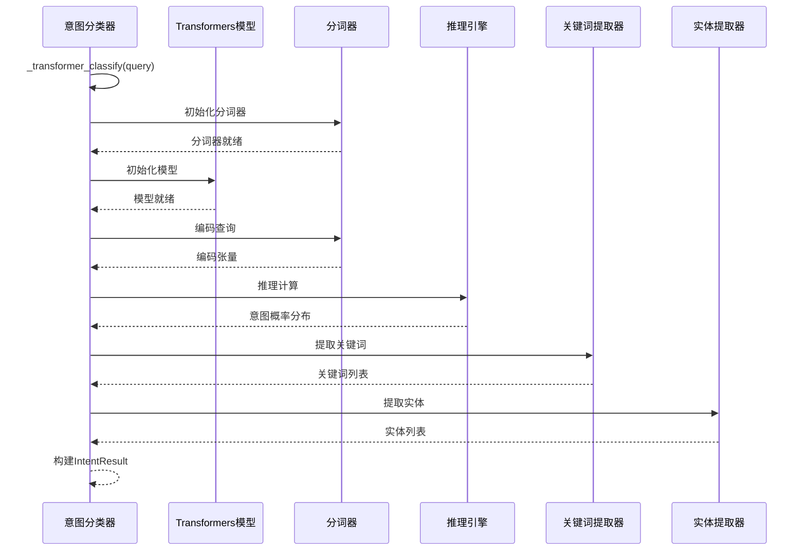
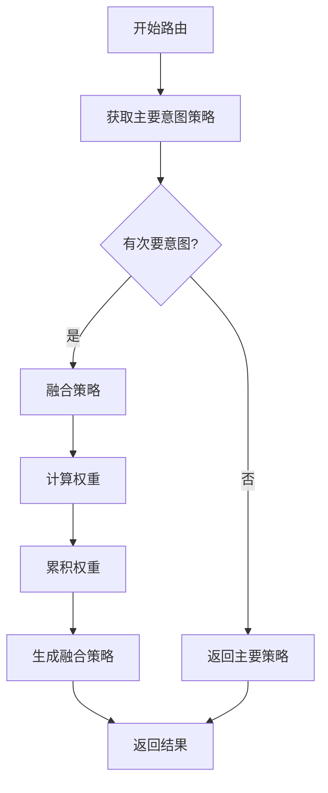
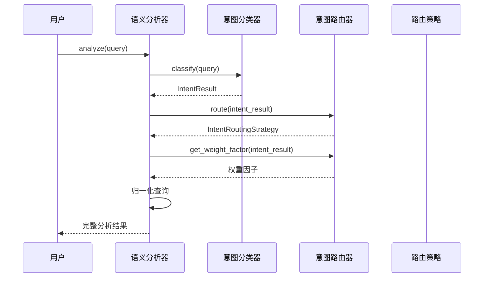
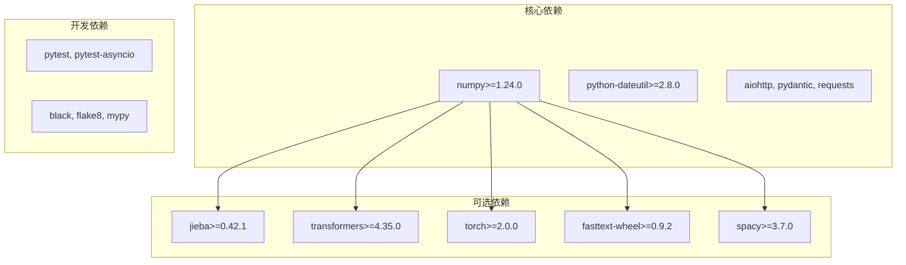
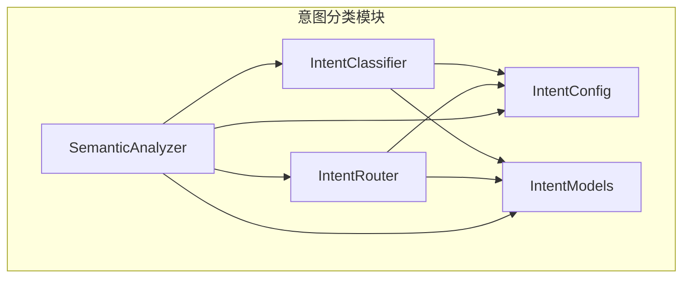

# 意图分类系统

<cite>
**本文档引用的文件**
- [src/intent/classifier.py](file://src/intent/classifier.py)
- [src/intent/router.py](file://src/intent/router.py)
- [src/intent/models.py](file://src/intent/models.py)
- [src/intent/config.py](file://src/intent/config.py)
- [src/intent/semantic_analyzer.py](file://src/intent/semantic_analyzer.py)
- [src/intent/__init__.py](file://src/intent/__init__.py)
- [README.md](file://README.md)
- [requirements.txt](file://requirements.txt)
</cite>

## 目录
1. [简介](#简介)
2. [项目结构](#项目结构)
3. [核心组件](#核心组件)
4. [架构概览](#架构概览)
5. [详细组件分析](#详细组件分析)
6. [依赖关系分析](#依赖关系分析)
7. [性能考虑](#性能考虑)
8. [故障排除指南](#故障排除指南)
9. [结论](#结论)

## 简介

NecoRAG 意图分类系统是一个基于认知科学理论的智能查询理解模块，旨在模拟人脑的双系统记忆机制，为检索增强生成（RAG）框架提供强大的语义理解和路由决策能力。

该系统的核心目标是在用户查询到达检索层之前，对其进行深入的语义分析和意图识别，从而为后续的知识检索和信息生成提供精确的指导。通过五层认知架构设计，NecoRAG 实现了从感知到交互的完整认知闭环。

## 项目结构

NecoRAG 意图分类系统位于 `src/intent/` 目录下，采用模块化设计，包含以下核心文件：

**图表来源**
- [src/intent/__init__.py:1-83](file://src/intent/__init__.py#L1-L83)
- [src/intent/classifier.py:1-50](file://src/intent/classifier.py#L1-L50)
- [src/intent/router.py:1-50](file://src/intent/router.py#L1-L50)
- [src/intent/models.py:1-50](file://src/intent/models.py#L1-L50)
- [src/intent/config.py:1-50](file://src/intent/config.py#L1-L50)
- [src/intent/semantic_analyzer.py:1-50](file://src/intent/semantic_analyzer.py#L1-L50)

**章节来源**
- [src/intent/__init__.py:1-83](file://src/intent/__init__.py#L1-L83)

## 核心组件

### 意图类型枚举

系统定义了七种核心意图类型，每种意图都对应特定的检索策略和处理方式：

| 意图类型 | 描述 | 特征 |
|---------|------|------|
| FACTUAL | 事实查询 | 查找具体事实或数据，需要精确检索 |
| COMPARATIVE | 比较分析 | 对比不同概念或事物，需要多源信息 |
| REASONING | 推理演绎 | 因果关系或逻辑推理，需要上下文理解 |
| EXPLANATION | 概念解释 | 定义或解释某个概念，需要语义理解 |
| SUMMARIZATION | 摘要总结 | 概括或总结内容，需要广泛检索 |
| PROCEDURAL | 操作指导 | 步骤或方法指引，需要精确匹配 |
| EXPLORATORY | 探索发散 | 开放式探索或列举，需要多样性 |

### 数据模型

系统使用结构化数据模型来表示意图分类结果和路由策略：

**图表来源**
- [src/intent/models.py:12-231](file://src/intent/models.py#L12-L231)

**章节来源**
- [src/intent/models.py:12-231](file://src/intent/models.py#L12-L231)

## 架构概览

NecoRAG 意图分类系统采用分层架构设计，实现了从底层算法到高层应用的完整抽象：

**图表来源**
- [src/intent/semantic_analyzer.py:24-68](file://src/intent/semantic_analyzer.py#L24-L68)
- [src/intent/classifier.py:39-58](file://src/intent/classifier.py#L39-L58)
- [src/intent/router.py:44-52](file://src/intent/router.py#L44-L52)
- [src/intent/config.py:18-68](file://src/intent/config.py#L18-L68)

## 详细组件分析

### 意图分类器 (IntentClassifier)

意图分类器是系统的核心组件，支持三种不同的分类后端：

#### 规则分类后端

规则分类是最基础且高效的分类方式，完全依赖预定义的关键词模式：

**图表来源**
- [src/intent/classifier.py:84-205](file://src/intent/classifier.py#L84-L205)

#### FastText 分类后端

FastText 后端提供了机器学习驱动的分类能力：

**图表来源**
- [src/intent/classifier.py:324-382](file://src/intent/classifier.py#L324-L382)

#### Transformer 分类后端

Transformer 后端提供了最先进的深度学习分类能力：

**图表来源**
- [src/intent/classifier.py:384-457](file://src/intent/classifier.py#L384-L457)

**章节来源**
- [src/intent/classifier.py:19-487](file://src/intent/classifier.py#L19-L487)

### 意图路由器 (IntentRouter)

意图路由器负责根据分类结果确定最优的检索策略：

#### 路由策略配置

系统为每种意图类型配置了专门的路由策略：

| 意图类型 | 检索模式 | Top-K | 图谱搜索 | HyDE增强 | 重排序策略 |
|---------|---------|-------|----------|----------|-----------|
| FACTUAL | vector | 5 | 否 | 否 | relevance |
| COMPARATIVE | hybrid | 15 | 是 | 是 | diversity |
| REASONING | hybrid | 12 | 是 | 是 | relevance |
| EXPLANATION | vector | 8 | 否 | 是 | relevance |
| SUMMARIZATION | vector | 15 | 否 | 否 | relevance |
| PROCEDURAL | vector | 10 | 否 | 否 | relevance |
| EXPLORATORY | hybrid | 20 | 是 | 是 | diversity |

#### 多意图融合策略

当检测到多个意图时，系统采用置信度加权的融合策略：

**图表来源**
- [src/intent/router.py:79-120](file://src/intent/router.py#L79-L120)

**章节来源**
- [src/intent/router.py:17-349](file://src/intent/router.py#L17-L349)

### 语义分析器 (SemanticAnalyzer)

语义分析器提供了统一的高层接口，整合了完整的语义分析流程：

**图表来源**
- [src/intent/semantic_analyzer.py:69-122](file://src/intent/semantic_analyzer.py#L69-L122)

**章节来源**
- [src/intent/semantic_analyzer.py:24-352](file://src/intent/semantic_analyzer.py#L24-L352)

## 依赖关系分析

### 外部依赖

系统采用可选依赖设计，确保基本功能的独立性和灵活性：

**图表来源**
- [requirements.txt:1-71](file://requirements.txt#L1-L71)

### 内部依赖关系

**图表来源**
- [src/intent/classifier.py:12-13](file://src/intent/classifier.py#L12-L13)
- [src/intent/router.py:10-11](file://src/intent/router.py#L10-L11)
- [src/intent/semantic_analyzer.py:10-18](file://src/intent/semantic_analyzer.py#L10-L18)

**章节来源**
- [requirements.txt:1-71](file://requirements.txt#L1-L71)

## 性能考虑

### 分类后端性能对比

| 分类后端 | 启动时间 | 推理速度 | 准确性 | 依赖复杂度 |
|---------|---------|---------|--------|-----------|
| 规则分类 | 即时启动 | 极快 | 中等 | 低 |
| FastText | 秒级启动 | 快 | 高 | 中等 |
| Transformer | 数秒启动 | 慢 | 最高 | 高 |

### 关键词提取优化

系统实现了多层次的关键词提取策略：

1. **优先使用 jieba**：提供高质量的中文分词和关键词提取
2. **降级策略**：当 jieba 不可用时使用简单算法
3. **停用词过滤**：减少噪声词汇的影响
4. **词频统计**：基于出现频率选择重要词汇

### 内存管理

- **延迟加载**：深度学习模型按需加载，减少内存占用
- **模型缓存**：已加载的模型保持在内存中供多次使用
- **批量处理**：支持批量分类以提高整体效率

## 故障排除指南

### 常见问题及解决方案

#### 1. 分类准确性问题

**症状**：分类结果不符合预期

**可能原因**：
- 关键词模式配置不当
- 置信度阈值设置不合理
- 缺少特定意图类型的训练数据

**解决方案**：
- 调整关键词模式权重
- 优化置信度阈值
- 扩展训练数据集

#### 2. 性能问题

**症状**：分类响应缓慢

**可能原因**：
- Transformer 模型过大
- 未启用规则分类后端
- 内存不足

**解决方案**：
- 使用规则分类后端
- 启用模型缓存
- 增加系统内存

#### 3. 依赖缺失问题

**症状**：某些功能不可用

**可能原因**：
- 未安装可选依赖包
- 版本不兼容
- 环境配置错误

**解决方案**：
- 安装完整依赖列表
- 检查版本兼容性
- 验证环境配置

**章节来源**
- [src/intent/classifier.py:324-457](file://src/intent/classifier.py#L324-L457)
- [src/intent/router.py:122-163](file://src/intent/router.py#L122-L163)

## 结论

NecoRAG 意图分类系统通过精心设计的架构和多种技术方案，为现代 RAG 框架提供了强大的语义理解能力。系统的主要优势包括：

1. **模块化设计**：清晰的组件分离便于维护和扩展
2. **多后端支持**：灵活的选择机制满足不同场景需求
3. **可配置性**：丰富的配置选项适应各种应用场景
4. **性能优化**：多种优化策略确保高效运行
5. **可扩展性**：良好的架构设计支持未来功能扩展

该系统不仅能够准确识别用户的查询意图，还能为后续的知识检索和信息生成提供精确的指导，是构建智能问答系统的重要基础设施。

通过持续的优化和改进，NecoRAG 意图分类系统有望成为业界领先的语义理解解决方案，为人工智能应用的发展做出重要贡献。