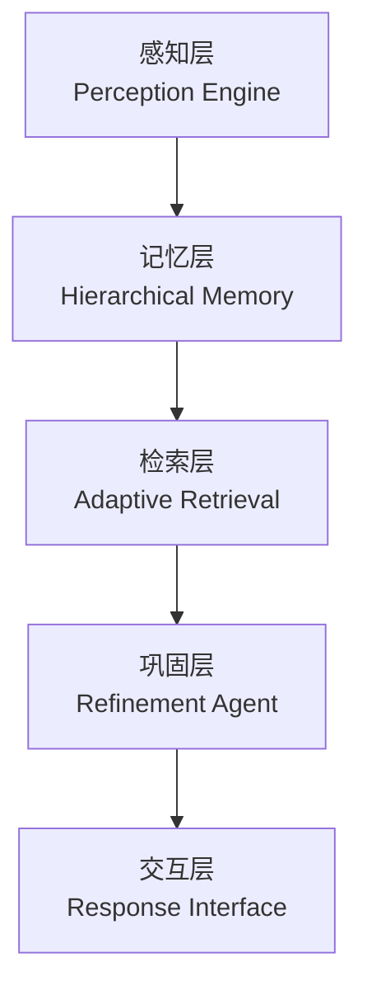
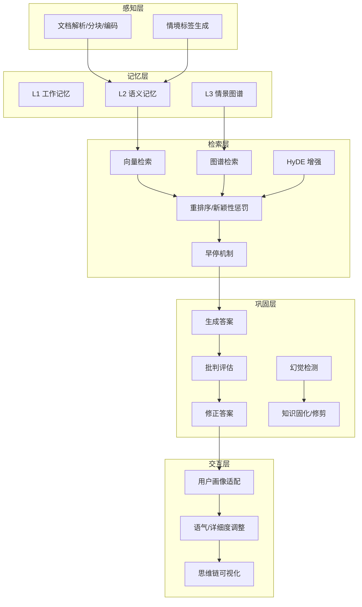
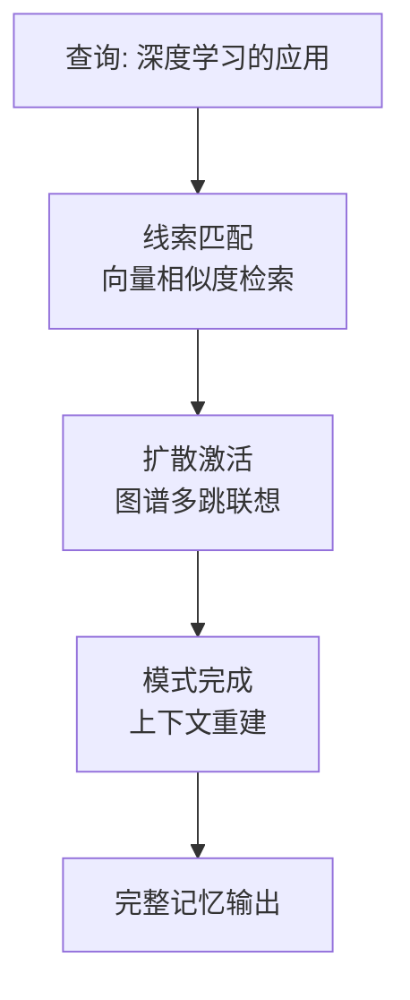
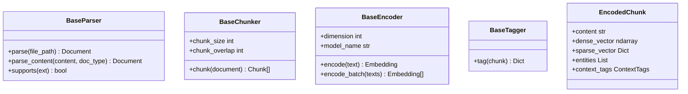
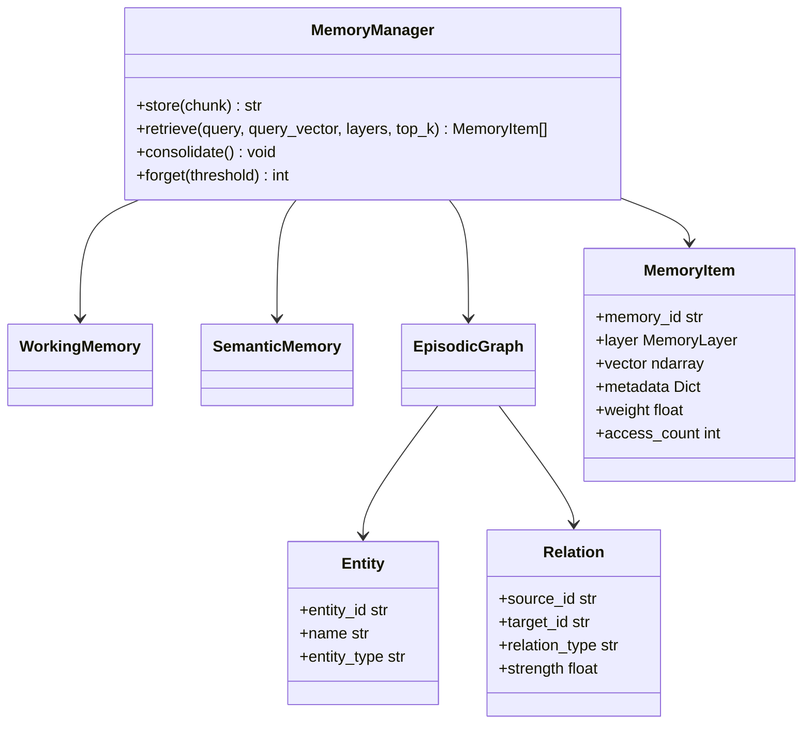
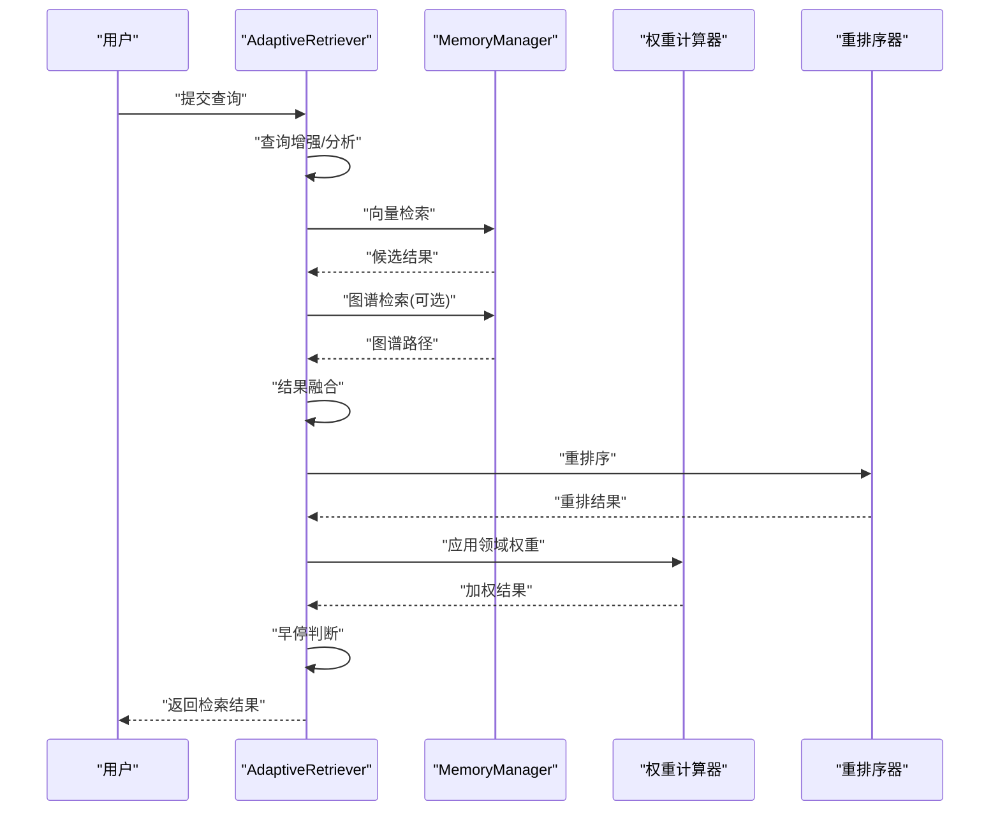
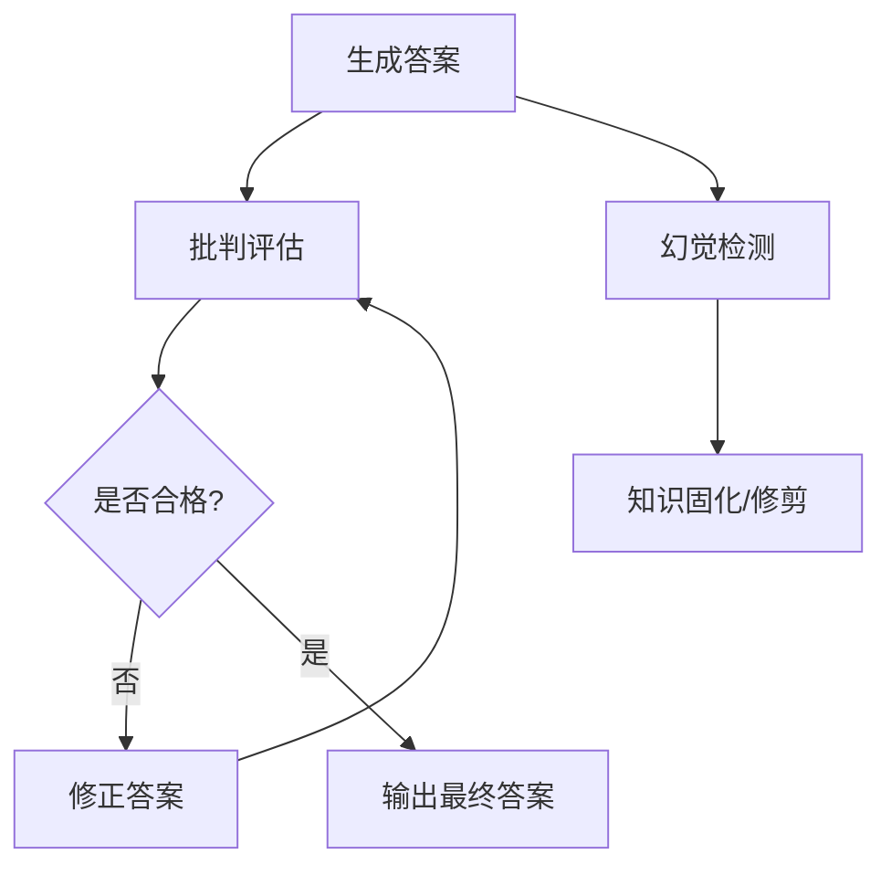
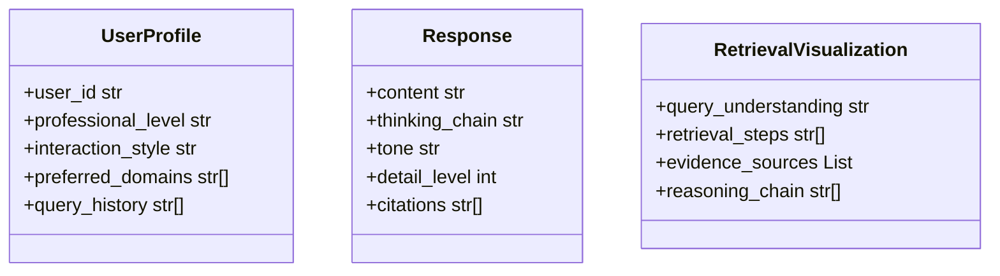
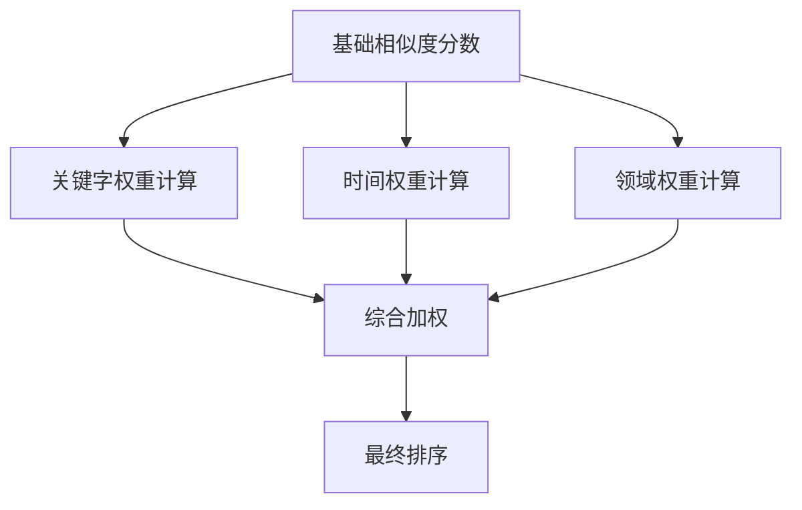
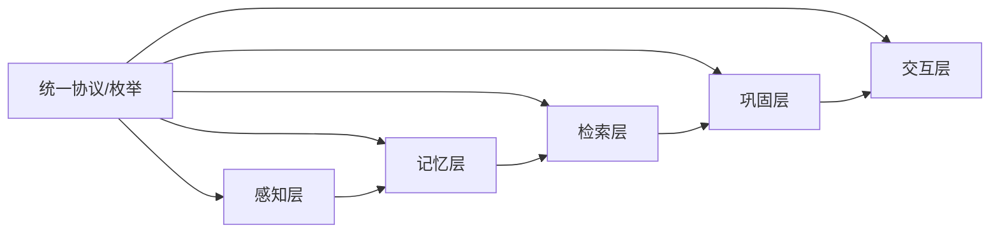

# 核心概念与理论基础

<cite>
**本文引用的文件**
- [README.md](file://README.md)
- [design.md](file://design/design.md)
- [base.py](file://src/core/base.py)
- [protocols.py](file://src/core/protocols.py)
- [models.py](file://src/perception/models.py)
- [models.py](file://src/memory/models.py)
- [models.py](file://src/response/models.py)
- [models.py](file://src/refinement/models.py)
- [manager.py](file://src/memory/manager.py)
- [retriever.py](file://src/retrieval/retriever.py)
- [config.py](file://src/domain/config.py)
- [relevance.py](file://src/domain/relevance.py)
- [temporal_weight.py](file://src/domain/temporal_weight.py)
- [weight_calculator.py](file://src/domain/weight_calculator.py)
- [models.py](file://src/dashboard/models.py)
</cite>

## 目录
1. [引言](#引言)
2. [项目结构](#项目结构)
3. [核心组件](#核心组件)
4. [架构总览](#架构总览)
5. [详细组件分析](#详细组件分析)
6. [依赖分析](#依赖分析)
7. [性能考量](#性能考量)
8. [故障排查指南](#故障排查指南)
9. [结论](#结论)
10. [附录](#附录)

## 引言
本文件面向不同背景的开发者，系统梳理 NecoRAG 的核心概念与理论基础，重点覆盖以下方面：
- 认知科学理论基础：人脑双系统记忆理论、神经认知科学原理、扩散激活理论
- RAG 技术的基本原理与发展脉络
- NecoRAG 五层架构的设计理念、技术实现与层间协作
- 数据在各层间的流转过程与可视化路径
- 面向初学者到高级用户的循序渐进学习路径与实践建议

## 项目结构
NecoRAG 采用“五层认知”架构，自下而上分别为：感知层、记忆层、检索层、巩固层、交互层。项目通过统一的数据协议与抽象基类，确保各模块的可替换性与可扩展性。

**图表来源**
- [design.md:314-321](file://design/design.md#L314-L321)

**章节来源**
- [README.md:35-85](file://README.md#L35-L85)
- [design.md:314-321](file://design/design.md#L314-L321)

## 核心组件
- 统一数据协议与枚举：定义文档、分块、向量、记忆、查询、响应、用户画像等核心数据类型与取值范围，确保模块间一致的数据契约。
- 抽象基类：为感知、记忆、检索、巩固、LLM、响应等模块定义统一接口，便于替换实现与扩展。
- 数据模型：涵盖感知层的 Chunk/EncodedChunk、记忆层的 MemoryItem/Entity/Relation、响应层的 Response/UserProfile 等。

**章节来源**
- [protocols.py:1-273](file://src/core/protocols.py#L1-L273)
- [base.py:1-571](file://src/core/base.py#L1-L571)
- [models.py:1-69](file://src/perception/models.py#L1-L69)
- [models.py:1-67](file://src/memory/models.py#L1-L67)
- [models.py:1-53](file://src/response/models.py#L1-L53)

## 架构总览
五层架构与认知科学映射如下：
- 感知层：多模态数据的高精度编码与情境标记（类脑感觉皮层）
- 记忆层：三层记忆系统（工作记忆、语义记忆、情景图谱）
- 检索层：基于扩散激活理论的混合检索与重排序，含早停机制
- 巩固层：幻觉自检闭环（Generator → Critic → Refiner），异步知识固化与修剪
- 交互层：情境自适应生成与思维链可视化

**图表来源**
- [design.md:322-370](file://design/design.md#L322-L370)
- [README.md:158-377](file://README.md#L158-L377)

**章节来源**
- [README.md:35-85](file://README.md#L35-L85)
- [design.md:310-370](file://design/design.md#L310-L370)

## 详细组件分析

### 认知科学与理论基础
- 人脑记忆的四阶段模型：编码 → 存储 → 巩固 → 检索。NecoRAG 对应映射为感知引擎（编码）、记忆层（存储）、巩固层（巩固）、检索层（检索）。
- 扩散激活与模式完成：检索过程由线索匹配（向量相似）→ 扩散激活（图谱多跳）→ 模式完成（上下文重建）构成。
- 遗忘机制：时间衰减、干扰遗忘、检索抑制、主动遗忘，通过动态权重衰减与归档策略实现。
- 情绪与情境：情境标签中的“重要性”维度对应情绪调节，提升检索准确性与相关性。

**图表来源**
- [design.md:122-144](file://design/design.md#L122-L144)

**章节来源**
- [design.md:32-215](file://design/design.md#L32-L215)

### RAG 技术基础与发展历程
- RAG 的核心思想：将检索与生成结合，使模型在回答时“有据可依”，显著降低幻觉并提升准确性。
- 发展脉络：从早期的稀疏检索（BM25）到稠密向量检索，再到图谱增强与重排序，以及如今的 HyDE、多跳检索与新颖性惩罚等增强策略。
- NecoRAG 的演进：在通用 RAG 基础上，引入类脑记忆结构、扩散激活检索、早停机制、领域权重融合与思维链可视化，形成“认知型 RAG”。

**章节来源**
- [README.md:571-678](file://README.md#L571-L678)
- [design.md:13-30](file://design/design.md#L13-L30)

### 五层架构设计与实现要点

#### 感知层：Perception Engine
- 多模态解析与编码：集成深度文档解析、BGE-M3 多维向量（稠密+稀疏+实体三元组）、情境标签生成。
- 数据模型：Chunk、EncodedChunk、ParsedDocument 等，统一承载内容、向量与标签信息。

**图表来源**
- [base.py:21-142](file://src/core/base.py#L21-L142)
- [models.py:11-41](file://src/perception/models.py#L11-L41)

**章节来源**
- [README.md:160-195](file://README.md#L160-L195)
- [base.py:21-142](file://src/core/base.py#L21-L142)
- [models.py:1-69](file://src/perception/models.py#L1-L69)

#### 记忆层：Hierarchical Memory
- 三层记忆系统：L1（Redis 工作记忆，TTL）、L2（Qdrant/Milvus 语义记忆，向量检索）、L3（Neo4j/Nebula 图谱，实体关系与多跳推理）。
- 动态权重衰减：模拟生物记忆的巩固与遗忘，通过访问频率与时间衰减控制权重。
- 统一管理：MemoryManager 负责跨层存储、检索、巩固与主动遗忘。

**图表来源**
- [manager.py:16-186](file://src/memory/manager.py#L16-L186)
- [models.py:19-67](file://src/memory/models.py#L19-L67)

**章节来源**
- [README.md:198-244](file://README.md#L198-L244)
- [manager.py:1-186](file://src/memory/manager.py#L1-L186)
- [models.py:1-67](file://src/memory/models.py#L1-L67)

#### 检索层：Adaptive Retrieval
- 混合检索：向量检索 + 图谱检索 + HyDE 增强
- 重排序：BGE-Reranker-v2，引入新颖性惩罚与多样性/冗余控制
- 早停机制：基于置信度阈值与边际收益递减，避免无效检索
- 领域权重融合：关键字权重、时间权重、领域权重的复合加权

**图表来源**
- [retriever.py:122-373](file://src/retrieval/retriever.py#L122-L373)
- [weight_calculator.py:56-206](file://src/domain/weight_calculator.py#L56-L206)

**章节来源**
- [README.md:247-287](file://README.md#L247-L287)
- [retriever.py:1-440](file://src/retrieval/retriever.py#L1-L440)
- [weight_calculator.py:1-318](file://src/domain/weight_calculator.py#L1-L318)

#### 巩固层：Refinement Agent
- 闭环流程：Generator → Critic → Refiner，配合 HallucinationDetector 与 KnowledgeConsolidator/Pruner
- 幻觉检测：事实一致性、证据支撑度、逻辑连贯性
- 异步任务：高频未命中查询的自动知识缺口补充与图谱融合

**图表来源**
- [README.md:290-330](file://README.md#L290-L330)
- [models.py:9-66](file://src/refinement/models.py#L9-L66)

**章节来源**
- [README.md:290-330](file://README.md#L290-L330)
- [models.py:1-66](file://src/refinement/models.py#L1-L66)

#### 交互层：Response Interface
- 用户画像适配：专业程度、交互风格、偏好领域
- 响应风格：语气（专业/友好/幽默）、详细度（简洁/标准/详细/全面）
- 可解释性：思维链可视化（检索路径、证据来源、推理过程）

**图表来源**
- [models.py:10-53](file://src/response/models.py#L10-L53)

**章节来源**
- [README.md:333-377](file://README.md#L333-L377)
- [models.py:1-53](file://src/response/models.py#L1-L53)

### 领域权重与时间权重系统
- 关键字权重：基于领域关键字词典，区分核心/重要/普通/边缘关键字，提供加权融合。
- 时间权重：指数衰减与分层权重，支持“常青内容”豁免与混合策略。
- 领域相关性：基于关键字密度与领域等级，提供权重乘数。
- 综合权重：final_score = base_score × α×keyword × β×temporal × γ×domain × custom_weight

**图表来源**
- [weight_calculator.py:81-147](file://src/domain/weight_calculator.py#L81-L147)
- [relevance.py:198-242](file://src/domain/relevance.py#L198-L242)
- [temporal_weight.py:160-196](file://src/domain/temporal_weight.py#L160-L196)

**章节来源**
- [design.md:224-307](file://design/design.md#L224-L307)
- [config.py:54-161](file://src/domain/config.py#L54-L161)
- [relevance.py:1-328](file://src/domain/relevance.py#L1-L328)
- [temporal_weight.py:1-271](file://src/domain/temporal_weight.py#L1-L271)
- [weight_calculator.py:1-318](file://src/domain/weight_calculator.py#L1-L318)

### Dashboard 配置管理（可选）
- Profile 管理：创建/编辑/删除/导入导出
- 模块参数：五大模块完整参数的实时编辑
- 统计监控：实时统计与性能指标

**章节来源**
- [README.md:380-433](file://README.md#L380-L433)
- [models.py:164-231](file://src/dashboard/models.py#L164-L231)

## 依赖分析
- 统一协议与抽象：通过 protocols.py 与 base.py，确保模块间数据类型与接口一致，降低耦合。
- 模块内聚：每层内部职责明确，跨层交互通过统一数据模型与接口进行。
- 外部依赖：向量数据库（Qdrant）、图数据库（Neo4j）、缓存（Redis）、嵌入模型（BGE-M3）、重排序（BGE-Reranker-v2）、编排引擎（LangGraph）等。

**图表来源**
- [protocols.py:1-273](file://src/core/protocols.py#L1-L273)
- [base.py:1-571](file://src/core/base.py#L1-L571)

**章节来源**
- [protocols.py:1-273](file://src/core/protocols.py#L1-L273)
- [base.py:1-571](file://src/core/base.py#L1-L571)

## 性能考量
- 早停机制：在置信度达标时提前终止，显著降低检索开销与延迟。
- 复合权重：通过关键字、时间、领域权重融合，提升检索精度与相关性。
- 记忆衰减：定期归档低价值知识，减少上下文 Token 消耗。
- 多跳与重排序：在保证效果的前提下，通过新颖性惩罚与多样性控制，平衡召回与质量。

**章节来源**
- [README.md:443-474](file://README.md#L443-L474)
- [retriever.py:30-120](file://src/retrieval/retriever.py#L30-L120)
- [weight_calculator.py:182-206](file://src/domain/weight_calculator.py#L182-L206)

## 故障排查指南
- 检索结果为空或质量差
  - 检查领域权重配置与关键字词典是否正确加载
  - 确认时间权重是否启用、衰减系数是否合理
  - 验证重排序模型可用性与参数设置
- 幻觉率偏高
  - 检查幻觉检测阈值与批判器配置
  - 确认证据来源是否充足与相关
- 记忆膨胀或检索变慢
  - 检查记忆衰减与归档阈值
  - 评估 L1 TTL 与 L2 集合命名是否合理
- 交互层输出不符合预期
  - 校验用户画像与响应风格配置
  - 确认思维链可视化开关与输出格式

**章节来源**
- [retriever.py:122-373](file://src/retrieval/retriever.py#L122-L373)
- [weight_calculator.py:56-206](file://src/domain/weight_calculator.py#L56-L206)
- [models.py:10-53](file://src/response/models.py#L10-L53)

## 结论
NecoRAG 将认知科学理论与现代 RAG 技术深度融合，通过五层架构实现从感知、记忆、检索、巩固到交互的完整闭环。其核心创新包括类脑记忆结构、扩散激活检索、早停机制、领域权重融合与思维链可视化。该框架既适合初学者循序渐进学习，也为高级开发者提供了高度模块化与可扩展的工程实现路径。

## 附录
- 快速开始与模块使用示例参见项目根 README 的“基础使用”与各模块“使用示例”章节。
- Dashboard 使用与 API 接口参见 README 的“Dashboard”章节与 DASHBOARD_GUIDE.md。

**章节来源**
- [README.md:103-157](file://README.md#L103-L157)
- [README.md:380-433](file://README.md#L380-L433)