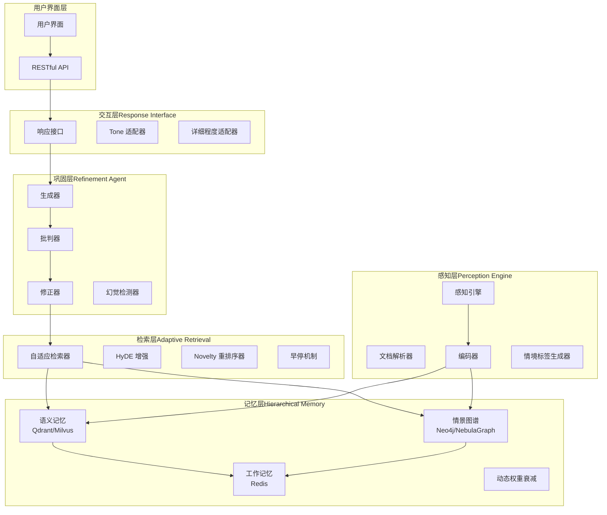
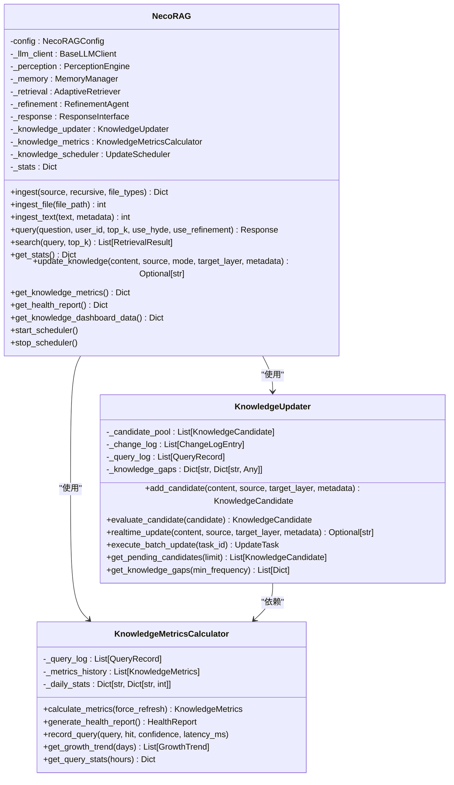
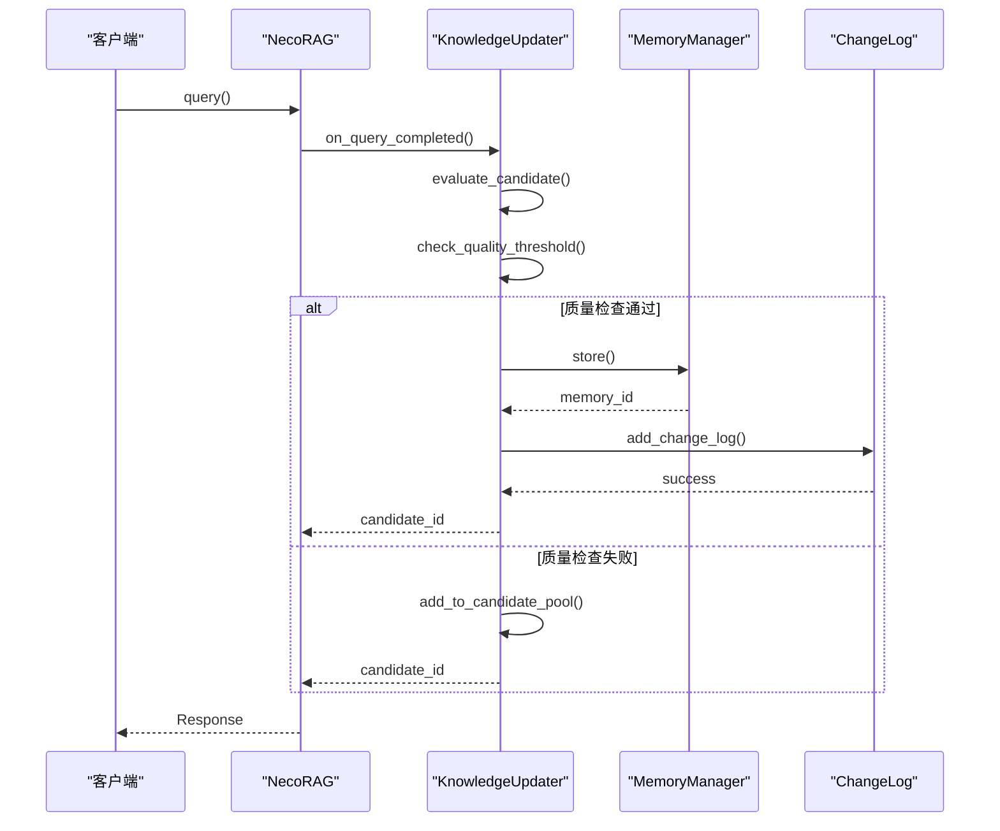
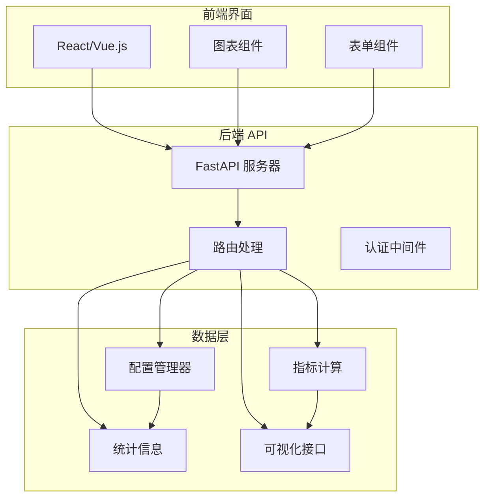
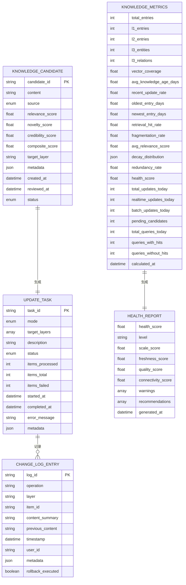
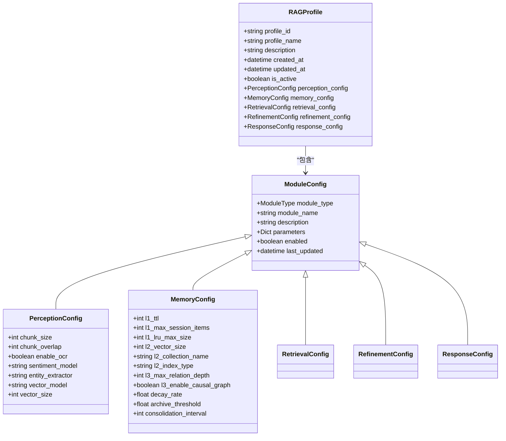
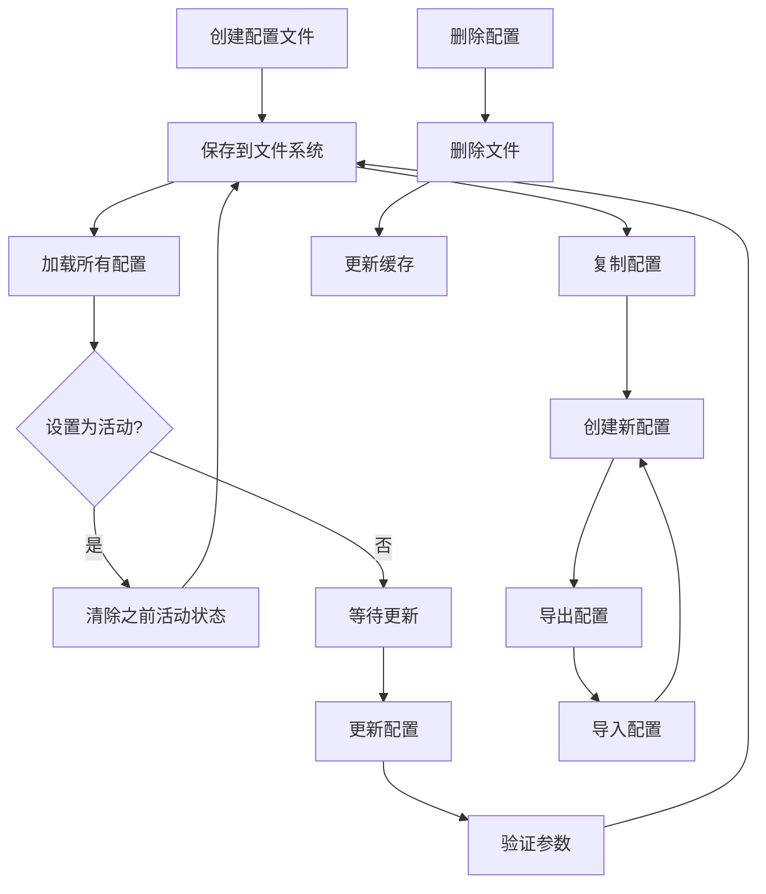

# 知识演化系统

<cite>
**本文档引用的文件**
- [README.md](file://README.md)
- [necorag.py](file://src/necorag.py)
- [base.py](file://src/core/base.py)
- [__init__.py](file://src/knowledge_evolution/__init__.py)
- [models.py](file://src/knowledge_evolution/models.py)
- [updater.py](file://src/knowledge_evolution/updater.py)
- [metrics.py](file://src/knowledge_evolution/metrics.py)
- [scheduler.py](file://src/knowledge_evolution/scheduler.py)
- [visualizer.py](file://src/knowledge_evolution/visualizer.py)
- [server.py](file://src/dashboard/server.py)
- [models.py](file://src/dashboard/models.py)
- [config_manager.py](file://src/dashboard/config_manager.py)
- [requirements.txt](file://requirements.txt)
- [pyproject.toml](file://pyproject.toml)
</cite>

## 目录
1. [项目概述](#项目概述)
2. [系统架构](#系统架构)
3. [核心组件](#核心组件)
4. [知识演化模块](#知识演化模块)
5. [Dashboard 系统](#dashboard-系统)
6. [数据模型](#数据模型)
7. [配置管理](#配置管理)
8. [性能指标](#性能指标)
9. [部署与安装](#部署与安装)
10. [故障排除](#故障排除)
11. [总结](#总结)

## 项目概述

NecoRAG 是一个创新的认知型 RAG（检索增强生成）框架，模拟人脑的双系统记忆理论和神经认知科学原理。该系统采用"五层认知"分层架构，实现了从感知到交互的完整认知闭环。

### 核心特性

- **类脑记忆结构**：三层记忆系统（工作记忆 L1 + 语义记忆 L2 + 情景图谱 L3）
- **智能早停机制**：Early Termination 策略精准捕捉关键信息
- **自我反思能力**：Refinement Agent 幻觉自检与知识进化
- **可解释性输出**：思维链可视化，展示推理过程
- **配置管理系统**：Web Dashboard 实时配置和监控

### 技术栈

- **核心框架**：Python 3.9+，FastAPI，Pydantic
- **数据库集成**：Qdrant（向量数据库），Neo4j（图数据库），Redis（缓存）
- **嵌入模型**：BGE-M3，BGE-Reranker-v2
- **调度系统**：APScheduler（可选），Celery（分布式）

## 系统架构

NecoRAG 采用五层认知架构，每一层对应人脑认知机制的不同阶段：



**架构图来源**
- [README.md:35-85](file://README.md#L35-L85)
- [necorag.py:37-121](file://src/necorag.py#L37-L121)

## 核心组件

### NecoRAG 统一入口类

NecoRAG 类作为系统的统一入口，提供了简洁的 API 用于文档导入、智能问答检索和配置管理。



**类图来源**
- [necorag.py:37-744](file://src/necorag.py#L37-L744)
- [updater.py:23-800](file://src/knowledge_evolution/updater.py#L23-L800)
- [metrics.py:20-724](file://src/knowledge_evolution/metrics.py#L20-L724)

**章节来源**
- [necorag.py:37-121](file://src/necorag.py#L37-L121)
- [necorag.py:175-250](file://src/necorag.py#L175-L250)
- [necorag.py:328-422](file://src/necorag.py#L328-L422)

## 知识演化模块

知识演化模块是 NecoRAG 的核心创新之一，提供了完整的知识库更新、演化和健康度监控功能。

### 知识更新管理器



**序列图来源**
- [updater.py:360-403](file://src/knowledge_evolution/updater.py#L360-L403)
- [updater.py:687-747](file://src/knowledge_evolution/updater.py#L687-L747)

### 知识演化流程

```mermaid
flowchart TD
Start([查询完成]) --> CheckQuality{"质量检查"}
CheckQuality --> |通过| AutoApprove{"自动审批?"}
CheckQuality --> |不通过| AddPool["添加到候选池"]
AddPool --> PoolOverflow{"候选池溢出?"}
PoolOverflow --> |是| Cleanup["清理低分条目"]
PoolOverflow --> |否| WaitReview["等待人工审核"]
Cleanup --> WaitReview
AutoApprove --> |是| Commit["直接入库"]
AutoApprove --> |否| ManualReview["人工审核"]
Commit --> UpdateStats["更新统计信息"]
ManualReview --> Approve{"批准?"}
Approve --> |是| Commit
Approve --> |否| Reject["拒绝候选"]
UpdateStats --> End([完成])
Reject --> End
```



**流程图来源**
- [updater.py:81-131](file://src/knowledge_evolution/updater.py#L81-L131)
- [updater.py:232-284](file://src/knowledge_evolution/updater.py#L232-L284)

**章节来源**
- [updater.py:23-800](file://src/knowledge_evolution/updater.py#L23-L800)
- [metrics.py:20-724](file://src/knowledge_evolution/metrics.py#L20-L724)
- [scheduler.py:124-688](file://src/knowledge_evolution/scheduler.py#L124-L688)

## Dashboard 系统

Dashboard 提供了完整的 Web 界面管理和配置监控功能，支持实时参数调整和可视化展示。

### Dashboard 架构



**架构图来源**
- [server.py:48-484](file://src/dashboard/server.py#L48-L484)
- [config_manager.py:14-315](file://src/dashboard/config_manager.py#L14-L315)

### API 接口设计

Dashboard 提供了丰富的 RESTful API 接口：

| 接口 | 方法 | 描述 | 请求体 | 响应 |
|------|------|------|--------|------|
| `/api/profiles` | GET | 获取所有配置文件 | - | Profile 列表 |
| `/api/profiles` | POST | 创建新配置文件 | CreateProfileRequest | Profile |
| `/api/profiles/{profile_id}` | PUT | 更新配置文件 | UpdateProfileRequest | Profile |
| `/api/profiles/{profile_id}` | DELETE | 删除配置文件 | - | 成功消息 |
| `/api/profiles/{profile_id}/activate` | POST | 激活配置文件 | - | 成功消息 |
| `/api/profiles/{profile_id}/modules/{module}` | GET | 获取模块参数 | - | 参数详情 |
| `/api/profiles/{profile_id}/modules/{module}` | PUT | 更新模块参数 | ModuleParametersUpdate | 成功消息 |
| `/api/stats` | GET | 获取统计信息 | - | DashboardStats |
| `/api/knowledge/metrics` | GET | 获取知识库指标 | - | KnowledgeMetrics |
| `/api/knowledge/health` | GET | 获取健康报告 | - | HealthReport |

**章节来源**
- [server.py:106-344](file://src/dashboard/server.py#L106-L344)
- [models.py:164-232](file://src/dashboard/models.py#L164-L232)

## 数据模型

知识演化模块使用了丰富的数据模型来表示各种状态和配置。

### 核心数据模型



**ER 图来源**
- [models.py:63-367](file://src/knowledge_evolution/models.py#L63-L367)

### 配置数据模型



**类图来源**
- [models.py:164-232](file://src/dashboard/models.py#L164-L232)

**章节来源**
- [models.py:63-367](file://src/knowledge_evolution/models.py#L63-L367)
- [models.py:164-232](file://src/dashboard/models.py#L164-L232)

## 配置管理

配置管理系统提供了完整的配置文件生命周期管理，包括创建、更新、激活、复制和导入导出功能。

### 配置管理流程



**流程图来源**
- [config_manager.py:42-315](file://src/dashboard/config_manager.py#L42-L315)

### 配置参数验证

配置管理系统提供了参数验证功能，确保配置的有效性和完整性：

| 模块 | 关键参数 | 验证规则 | 默认值 |
|------|----------|----------|--------|
| Perception | chunk_size, chunk_overlap | 数值范围验证 | 512, 50 |
| Memory | l1_ttl, decay_rate | 正数值验证 | 3600, 0.1 |
| Retrieval | top_k, confidence_threshold | 范围验证 | 10, 0.85 |
| Refinement | min_confidence, hallucination_threshold | 0-1范围验证 | 0.7, 0.6 |
| Response | default_tone, default_detail_level | 枚举值验证 | friendly, 2 |

**章节来源**
- [config_manager.py:135-166](file://src/dashboard/config_manager.py#L135-L166)
- [models.py:48-161](file://src/dashboard/models.py#L48-L161)

## 性能指标

系统定义了全面的性能指标体系，用于监控和评估知识库的健康状况和性能表现。

### 知识库健康指标

| 指标类别 | 指标名称 | 目标值 | 计算公式 | 说明 |
|----------|----------|--------|----------|------|
| 规模指标 | total_entries | > 1000 | 计数统计 | 知识库总条目数 |
| 规模指标 | l2_coverage | > 80% | l2_entries/total_entries | L2向量覆盖率 |
| 新鲜度指标 | avg_knowledge_age_days | < 180天 | 平均年龄 | 知识平均新鲜度 |
| 新鲜度指标 | recent_update_rate | > 1% | 近7天更新率 | 知识更新活跃度 |
| 质量指标 | retrieval_hit_rate | > 70% | 命中率 | 检索效果评估 |
| 质量指标 | avg_relevance_score | > 0.7 | 平均相关性 | 知识质量评估 |
| 健康度指标 | health_score | > 70分 | 加权平均 | 综合健康评分 |
| 健康度指标 | fragmentation_rate | < 30% | 碎片率 | 图谱连通性 |
| 更新指标 | total_updates_today | > 10 | 日更新量 | 知识库活跃度 |

### 性能基准

系统设定了明确的性能基准目标：

- **检索准确率 (Recall@K)**: 相比传统 Vector RAG 提升 +20%
- **幻觉率**: 通过 Refinement Agent 控制在 < 5%
- **简单查询延迟**: 首字延迟 < 800ms
- **复杂查询延迟**: 多跳+重排 < 1500ms
- **上下文压缩率**: 通过记忆衰减达到 -40%

**章节来源**
- [README.md:465-474](file://README.md#L465-L474)
- [metrics.py:412-506](file://src/knowledge_evolution/metrics.py#L412-L506)

## 部署与安装

### 环境要求

- **Python 版本**: 3.9+
- **操作系统**: Linux, macOS, Windows
- **内存**: 至少 4GB RAM
- **存储**: 至少 10GB 可用空间

### 依赖安装

```bash
# 克隆仓库
git clone https://github.com/NecoRAG/core.git
cd core

# 安装基础依赖
pip install -r requirements.txt

# 或使用 pip 安装（发布后）
pip install necorag

# 安装开发依赖
pip install -e ".[dev]"
```

### 可选依赖

根据需求安装相应的可选依赖：

```bash
# 意图分类（多种后端）
pip install -e ".[intent]"          # jieba 分词
pip install -e ".[intent-ml]"       # transformers + torch
pip install -e ".[intent-fasttext]" # fasttext

# 调度系统
pip install -e ".[scheduler]"           # APScheduler
pip install -e ".[scheduler-distributed]" # Celery + Redis

# 开发工具
pip install -e ".[dev]"  # pytest, black, flake8, mypy
```

### 配置文件

系统支持多种配置方式：

1. **默认配置**: 使用内置的默认配置
2. **配置文件**: 通过 JSON 文件管理配置
3. **运行时配置**: 动态设置配置参数
4. **环境变量**: 通过环境变量覆盖配置

**章节来源**
- [requirements.txt:1-71](file://requirements.txt#L1-L71)
- [pyproject.toml:32-63](file://pyproject.toml#L32-L63)

## 故障排除

### 常见问题及解决方案

#### 1. 依赖安装问题

**问题**: 安装依赖时出现版本冲突
**解决方案**: 
- 使用虚拟环境隔离依赖
- 按模块顺序安装可选依赖
- 检查 Python 版本兼容性

#### 2. 数据库连接问题

**问题**: 无法连接到数据库服务
**解决方案**:
- 检查数据库服务状态
- 验证连接参数配置
- 确认防火墙设置
- 检查网络连通性

#### 3. Dashboard 启动失败

**问题**: Dashboard 无法启动或访问
**解决方案**:
- 检查端口占用情况
- 验证依赖安装完整性
- 查看错误日志信息
- 确认静态文件存在

#### 4. 知识库更新异常

**问题**: 知识更新失败或数据不一致
**解决方案**:
- 检查候选池状态
- 验证质量阈值设置
- 查看变更日志
- 执行回滚操作

### 调试工具

系统提供了多种调试和监控工具：

1. **日志系统**: 结构化的日志记录和分析
2. **健康检查**: 自动化的系统健康状态检查
3. **性能监控**: 实时的性能指标监控
4. **错误追踪**: 完善的错误捕获和报告机制

**章节来源**
- [server.py:470-484](file://src/dashboard/server.py#L470-L484)
- [updater.py:616-684](file://src/knowledge_evolution/updater.py#L616-L684)

## 总结

NecoRAG 知识演化系统是一个功能完整、架构清晰的认知型 RAG 框架。系统的核心创新在于：

1. **类脑记忆架构**: 三层记忆系统模拟人类大脑的记忆机制
2. **智能知识演化**: 自动化的知识更新、质量控制和健康监控
3. **可视化管理**: 完整的 Dashboard 界面和 API 接口
4. **模块化设计**: 高内聚、低耦合的组件架构
5. **可扩展性**: 支持多种数据库和模型的灵活集成

该系统为构建下一代智能问答系统提供了坚实的技术基础，特别适用于需要长期知识管理和智能演化的应用场景。