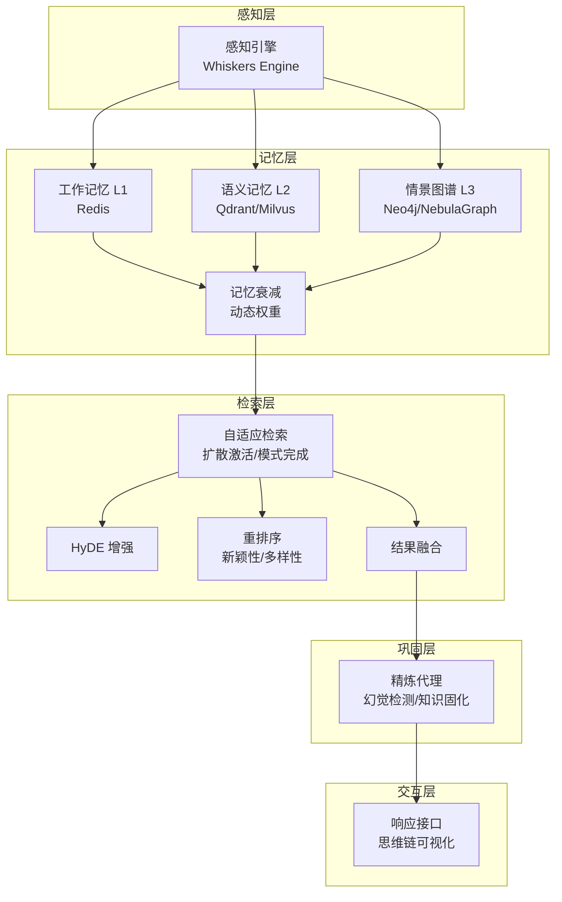
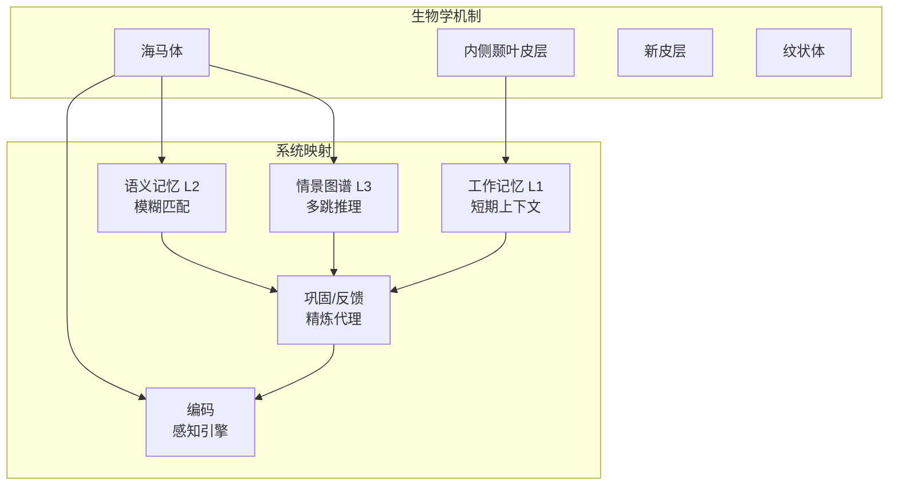
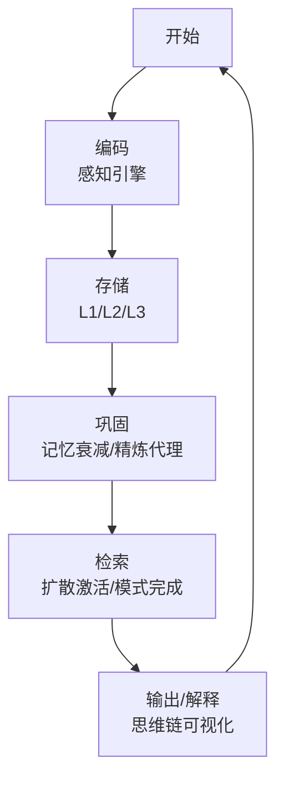
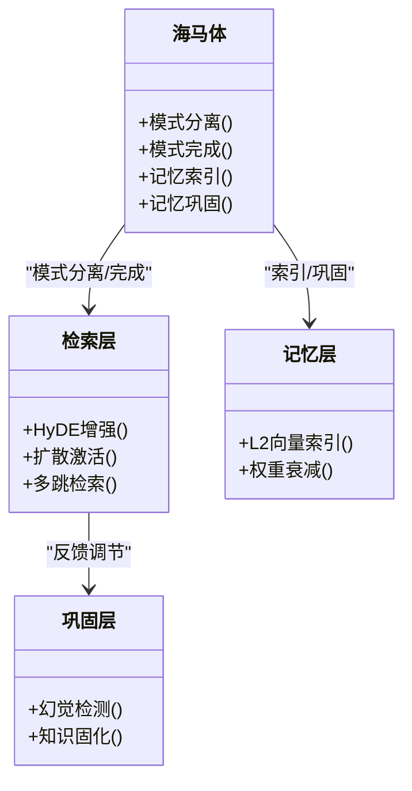
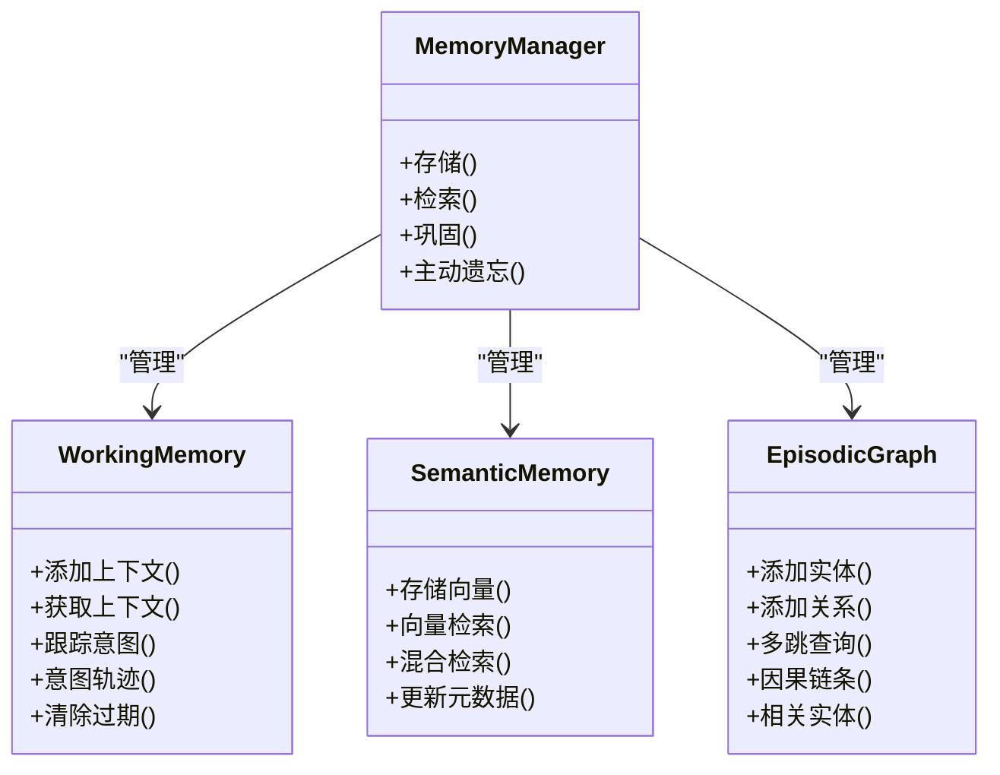
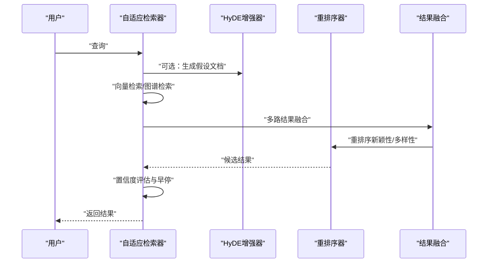
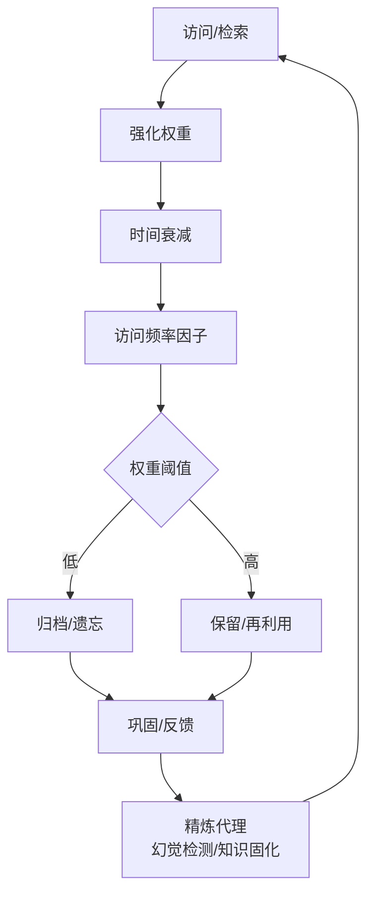
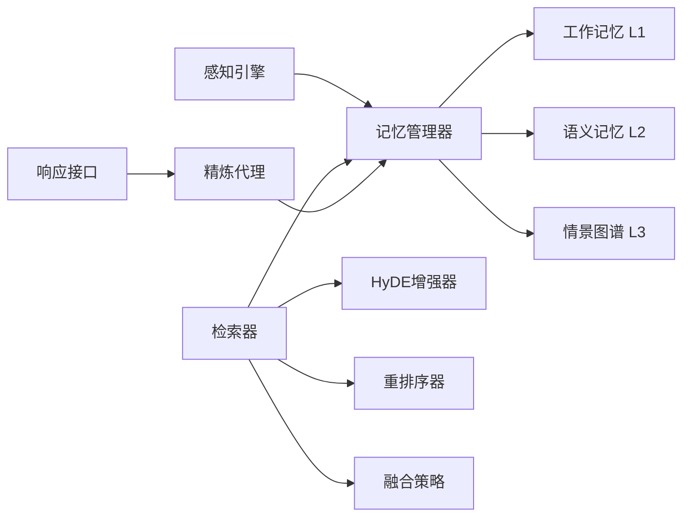

# 认知科学理论基础

<cite>
**本文引用的文件**
- [README.md](file://README.md)
- [src/memory/README.md](file://src/memory/README.md)
- [src/perception/README.md](file://src/perception/README.md)
- [src/retrieval/README.md](file://src/retrieval/README.md)
- [src/memory/models.py](file://src/memory/models.py)
- [src/memory/working_memory.py](file://src/memory/working_memory.py)
- [src/memory/semantic_memory.py](file://src/memory/semantic_memory.py)
- [src/memory/episodic_graph.py](file://src/memory/episodic_graph.py)
- [src/memory/manager.py](file://src/memory/manager.py)
- [src/memory/decay.py](file://src/memory/decay.py)
- [src/retrieval/retriever.py](file://src/retrieval/retriever.py)
- [src/retrieval/fusion.py](file://src/retrieval/fusion.py)
- [src/retrieval/reranker.py](file://src/retrieval/reranker.py)
- [src/refinement/models.py](file://src/refinement/models.py)
</cite>

## 目录
1. [引言](#引言)
2. [项目结构](#项目结构)
3. [核心组件](#核心组件)
4. [架构总览](#架构总览)
5. [详细组件分析](#详细组件分析)
6. [依赖分析](#依赖分析)
7. [性能考量](#性能考量)
8. [故障排查指南](#故障排查指南)
9. [结论](#结论)
10. [附录](#附录)

## 引言
本文件面向NecoRAG框架的认知科学理论基础，系统阐释人脑记忆机制与系统设计的映射关系，包括：
- 海马体核心功能：模式分离、模式完成、记忆索引、记忆巩固
- 记忆四阶段模型：编码→存储→巩固→检索，并给出系统映射
- 工作记忆、情景记忆、语义记忆的神经科学基础与三层记忆架构设计
- 扩散激活理论与模式完成机制在智能检索中的应用
- 神经科学图表与系统架构映射图，帮助开发者从生物学机制到技术实现的理解与落地

## 项目结构
NecoRAG采用“五层认知”架构，从感知到交互形成完整闭环。本节聚焦与认知科学理论直接相关的三层记忆系统（工作记忆L1、语义记忆L2、情景图谱L3），以及检索层对扩散激活与模式完成的实现。

**图表来源**
- [README.md: 35-85:35-85](file://README.md#L35-L85)
- [src/memory/README.md: 11-39:11-39](file://src/memory/README.md#L11-L39)
- [src/retrieval/README.md: 11-41:11-41](file://src/retrieval/README.md#L11-L41)

**章节来源**
- [README.md: 35-85:35-85](file://README.md#L35-L85)
- [src/memory/README.md: 11-39:11-39](file://src/memory/README.md#L11-L39)
- [src/retrieval/README.md: 11-41:11-41](file://src/retrieval/README.md#L11-L41)

## 核心组件
围绕认知科学理论，NecoRAG的关键组件如下：
- 感知引擎：模拟感觉输入与情境标记，对应“编码”
- 记忆层：三层记忆系统（L1/L2/L3），对应“存储/巩固”
- 检索层：基于扩散激活与模式完成的混合检索，对应“检索”
- 巩固层：精炼代理的幻觉检测与知识固化，对应“巩固”的反馈调节
- 交互层：响应接口与思维链可视化，对应“输出/解释”

**章节来源**
- [README.md: 158-377:158-377](file://README.md#L158-L377)
- [src/perception/README.md: 1-158:1-158](file://src/perception/README.md#L1-L158)
- [src/memory/README.md: 1-244:1-244](file://src/memory/README.md#L1-L244)
- [src/retrieval/README.md: 1-352:1-352](file://src/retrieval/README.md#L1-L352)
- [src/refinement/models.py: 1-66:1-66](file://src/refinement/models.py#L1-L66)

## 架构总览
下图展示从生物学机制到技术实现的映射关系，强调海马体功能在系统中的对应位置与职责。

**图表来源**
- [README.md: 25-85:25-85](file://README.md#L25-L85)
- [src/memory/README.md: 41-61:41-61](file://src/memory/README.md#L41-L61)
- [src/retrieval/README.md: 44-58:44-58](file://src/retrieval/README.md#L44-L58)

## 详细组件分析

### 1) 记忆的四阶段模型与系统映射
- 编码（感知与情境标记）：由感知引擎完成，生成多模态向量与情境标签，对应“编码”
- 存储（三层记忆）：工作记忆（L1）短期上下文；语义记忆（L2）高维向量；情景图谱（L3）结构化关系
- 巩固（权重衰减与反馈）：记忆衰减机制模拟巩固与遗忘；精炼代理进行幻觉检测与知识固化
- 检索（扩散激活/模式完成）：检索层基于扩散激活与模式完成进行联想检索与重排序

**图表来源**
- [src/perception/README.md: 9-28:9-28](file://src/perception/README.md#L9-L28)
- [src/memory/README.md: 62-81:62-81](file://src/memory/README.md#L62-L81)
- [src/retrieval/README.md: 44-58:44-58](file://src/retrieval/README.md#L44-L58)
- [src/refinement/models.py: 10-17:10-17](file://src/refinement/models.py#L10-L17)

**章节来源**
- [src/perception/README.md: 9-28:9-28](file://src/perception/README.md#L9-L28)
- [src/memory/README.md: 62-81:62-81](file://src/memory/README.md#L62-L81)
- [src/retrieval/README.md: 44-58:44-58](file://src/retrieval/README.md#L44-L58)
- [src/refinement/models.py: 10-17:10-17](file://src/refinement/models.py#L10-L17)

### 2) 海马体核心功能与系统映射
- 模式分离：在检索层通过HyDE与多源检索（向量/图谱）实现“分离”不同来源的证据，避免混淆
- 模式完成：在检索层通过扩散激活与多跳检索实现“完成”缺失的中间节点
- 记忆索引：在语义记忆（L2）中以向量索引实现快速检索
- 记忆巩固：在记忆层通过权重衰减与精炼代理实现“巩固”与“遗忘”的动态平衡

**图表来源**
- [src/retrieval/README.md: 60-102:60-102](file://src/retrieval/README.md#L60-L102)
- [src/memory/README.md: 62-81:62-81](file://src/memory/README.md#L62-L81)
- [src/refinement/models.py: 10-17:10-17](file://src/refinement/models.py#L10-L17)

**章节来源**
- [src/retrieval/README.md: 60-102:60-102](file://src/retrieval/README.md#L60-L102)
- [src/memory/README.md: 62-81:62-81](file://src/memory/README.md#L62-L81)
- [src/refinement/models.py: 10-17:10-17](file://src/refinement/models.py#L10-L17)

### 3) 三层记忆架构与神经科学基础
- 工作记忆（L1，Redis）：对应海马体与前额叶的短期上下文存储，支持瞬时遗忘与意图轨迹
- 语义记忆（L2，Qdrant/Milvus）：对应大脑新皮层的高维表征，支持模糊匹配与直觉检索
- 情景图谱（L3，Neo4j/NebulaGraph）：对应内侧颞叶与海马复合体的结构化记忆，支持多跳推理与因果链条

**图表来源**
- [src/memory/working_memory.py: 11-120:11-120](file://src/memory/working_memory.py#L11-L120)
- [src/memory/semantic_memory.py: 21-179:21-179](file://src/memory/semantic_memory.py#L21-L179)
- [src/memory/episodic_graph.py: 10-194:10-194](file://src/memory/episodic_graph.py#L10-L194)
- [src/memory/manager.py: 16-186:16-186](file://src/memory/manager.py#L16-L186)

**章节来源**
- [src/memory/working_memory.py: 11-120:11-120](file://src/memory/working_memory.py#L11-L120)
- [src/memory/semantic_memory.py: 21-179:21-179](file://src/memory/semantic_memory.py#L21-L179)
- [src/memory/episodic_graph.py: 10-194:10-194](file://src/memory/episodic_graph.py#L10-L194)
- [src/memory/manager.py: 16-186:16-186](file://src/memory/manager.py#L16-L186)

### 4) 扩散激活与模式完成在检索中的应用
- 扩散激活：通过图谱关系传播激活值，实现多跳联想检索
- 模式完成：通过HyDE与重排序抑制重复、鼓励新颖，提升检索质量
- 早停机制：基于置信度阈值与边际收益递减，避免冗余检索

**图表来源**
- [src/retrieval/retriever.py: 122-254:122-254](file://src/retrieval/retriever.py#L122-L254)
- [src/retrieval/fusion.py: 9-128:9-128](file://src/retrieval/fusion.py#L9-L128)
- [src/retrieval/reranker.py: 10-179:10-179](file://src/retrieval/reranker.py#L10-L179)

**章节来源**
- [src/retrieval/retriever.py: 122-254:122-254](file://src/retrieval/retriever.py#L122-L254)
- [src/retrieval/fusion.py: 9-128:9-128](file://src/retrieval/fusion.py#L9-L128)
- [src/retrieval/reranker.py: 10-179:10-179](file://src/retrieval/reranker.py#L10-L179)

### 5) 记忆权重衰减与巩固机制
- 动态权重衰减：模拟时间与访问频率对记忆权重的影响
- 主动遗忘：根据阈值归档低价值记忆，释放存储空间
- 巩固闭环：通过精炼代理的幻觉检测与知识固化，形成“检索→反思→修正”的闭环

**图表来源**
- [src/memory/decay.py: 11-155:11-155](file://src/memory/decay.py#L11-L155)
- [src/memory/manager.py: 149-186:149-186](file://src/memory/manager.py#L149-L186)
- [src/refinement/models.py: 10-17:10-17](file://src/refinement/models.py#L10-L17)

**章节来源**
- [src/memory/decay.py: 11-155:11-155](file://src/memory/decay.py#L11-L155)
- [src/memory/manager.py: 149-186:149-186](file://src/memory/manager.py#L149-L186)
- [src/refinement/models.py: 10-17:10-17](file://src/refinement/models.py#L10-L17)

## 依赖分析
- 组件耦合与内聚：记忆层内部（L1/L2/L3）通过记忆管理器统一协调；检索层依赖记忆层与外部模型（向量化、重排序）
- 外部依赖：感知层依赖RAGFlow与BGE-M3；检索层依赖BGE-Reranker与向量/图数据库
- 潜在循环依赖：当前实现通过模块化与接口解耦，未见明显循环依赖

**图表来源**
- [src/memory/manager.py: 16-47:16-47](file://src/memory/manager.py#L16-L47)
- [src/retrieval/retriever.py: 122-161:122-161](file://src/retrieval/retriever.py#L122-L161)
- [src/retrieval/fusion.py: 9-128:9-128](file://src/retrieval/fusion.py#L9-L128)
- [src/retrieval/reranker.py: 10-179:10-179](file://src/retrieval/reranker.py#L10-L179)

**章节来源**
- [src/memory/manager.py: 16-47:16-47](file://src/memory/manager.py#L16-L47)
- [src/retrieval/retriever.py: 122-161:122-161](file://src/retrieval/retriever.py#L122-L161)
- [src/retrieval/fusion.py: 9-128:9-128](file://src/retrieval/fusion.py#L9-L128)
- [src/retrieval/reranker.py: 10-179:10-179](file://src/retrieval/reranker.py#L10-L179)

## 性能考量
- 检索延迟：简单查询（纯向量）< 200ms，复杂查询（多跳+重排）< 800ms
- Recall@10 > 85%，NDCG@10 > 0.8
- 记忆层写入/检索延迟：L1 < 5ms/<2ms，L2 < 50ms/<100ms，L3 < 100ms/<500ms
- 上下文压缩：通过记忆衰减实现约-40%的上下文压缩

**章节来源**
- [src/retrieval/README.md: 329-337:329-337](file://src/retrieval/README.md#L329-L337)
- [src/memory/README.md: 223-230:223-230](file://src/memory/README.md#L223-L230)
- [README.md: 465-474:465-474](file://README.md#L465-L474)

## 故障排查指南
- 检索结果为空或质量差
  - 检查查询增强与实体识别是否正确触发
  - 确认HyDE增强是否启用，必要时关闭以定位问题
  - 调整重排序参数（新颖性/多样性/冗余惩罚）
- 置信度过低导致早停
  - 降低早停阈值或提高最小边际收益阈值
  - 检查融合策略与重排序是否合理
- 记忆权重异常
  - 检查衰减参数与访问频率因子
  - 触发主动遗忘以清理低价值记忆
- 图谱检索无结果
  - 检查实体抽取与关系建立是否成功
  - 调整多跳深度与关系类型过滤

**章节来源**
- [src/retrieval/retriever.py: 30-120:30-120](file://src/retrieval/retriever.py#L30-L120)
- [src/retrieval/reranker.py: 10-179:10-179](file://src/retrieval/reranker.py#L10-L179)
- [src/memory/decay.py: 72-155:72-155](file://src/memory/decay.py#L72-L155)
- [src/memory/episodic_graph.py: 71-194:71-194](file://src/memory/episodic_graph.py#L71-L194)

## 结论
NecoRAG通过将海马体的核心功能（模式分离、模式完成、记忆索引、记忆巩固）映射到系统各层，实现了从感知、存储、巩固到检索的完整闭环。三层记忆架构（L1/L2/L3）分别对应工作记忆、语义记忆与情景图谱，结合扩散激活与模式完成机制，显著提升了检索的准确性与效率。动态权重衰减与精炼代理进一步完善了“巩固—遗忘—反馈”的闭环，使系统具备持续学习与自我优化的能力。

## 附录
- 数据模型概览：记忆项、实体、关系、意图等核心数据结构
- 使用示例：感知引擎、记忆管理器、检索器、精炼代理与响应接口的基本用法

**章节来源**
- [src/memory/models.py: 12-67:12-67](file://src/memory/models.py#L12-L67)
- [README.md: 158-377:158-377](file://README.md#L158-L377)