# Grooming Agent - 巩固层

<cite>
**本文引用的文件**
- [src/grooming/__init__.py](file://src/grooming/__init__.py)
- [src/grooming/agent.py](file://src/grooming/agent.py)
- [src/grooming/generator.py](file://src/grooming/generator.py)
- [src/grooming/critic.py](file://src/grooming/critic.py)
- [src/grooming/refiner.py](file://src/grooming/refiner.py)
- [src/grooming/hallucination.py](file://src/grooming/hallucination.py)
- [src/grooming/consolidator.py](file://src/grooming/consolidator.py)
- [src/grooming/pruner.py](file://src/grooming/pruner.py)
- [src/grooming/models.py](file://src/grooming/models.py)
- [src/memory/manager.py](file://src/memory/manager.py)
- [src/memory/models.py](file://src/memory/models.py)
- [src/memory/working_memory.py](file://src/memory/working_memory.py)
- [src/memory/semantic_memory.py](file://src/memory/semantic_memory.py)
- [example/example_usage.py](file://example/example_usage.py)
- [QUICKSTART.md](file://QUICKSTART.md)
</cite>

## 目录
1. [简介](#简介)
2. [项目结构](#项目结构)
3. [核心组件](#核心组件)
4. [架构总览](#架构总览)
5. [详细组件分析](#详细组件分析)
6. [依赖关系分析](#依赖关系分析)
7. [性能考量](#性能考量)
8. [故障排查指南](#故障排查指南)
9. [结论](#结论)
10. [附录](#附录)

## 简介
Grooming Agent（巩固层）负责在答案生成后进行“生成-批判-修正”闭环验证，并结合幻觉检测与知识固化/修剪，确保输出的可靠性与长期稳定性。其主要职责包括：
- 生成候选答案
- 批判评估与质量打分
- 幻觉检测（事实性、逻辑性、来源性）
- 基于批判反馈进行答案修正
- 异步知识固化与记忆修剪

该层与检索层（提供证据）和交互层（生成最终可读响应）紧密协作，形成“检索-巩固-交互”的闭环。

## 项目结构
巩固层位于 src/grooming 目录，包含以下关键模块：
- agent.py：主控制器，协调生成、批判、修正、幻觉检测、知识固化与修剪
- generator.py：答案生成器
- critic.py：批判评估器
- refiner.py：答案修正器
- hallucination.py：幻觉检测器
- consolidator.py：知识固化器
- pruner.py：记忆修剪器
- models.py：数据模型（答案、报告、知识缺口等）

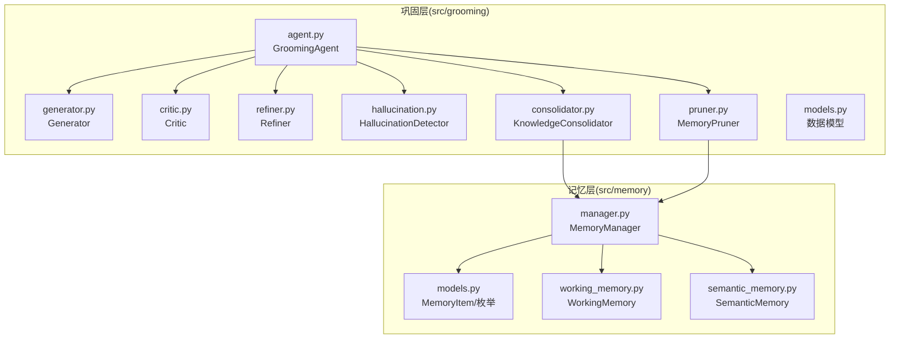

图表来源
- [src/grooming/agent.py:16-151](file://src/grooming/agent.py#L16-L151)
- [src/grooming/generator.py:9-64](file://src/grooming/generator.py#L9-L64)
- [src/grooming/critic.py:9-72](file://src/grooming/critic.py#L9-L72)
- [src/grooming/refiner.py:8-64](file://src/grooming/refiner.py#L8-L64)
- [src/grooming/hallucination.py:9-154](file://src/grooming/hallucination.py#L9-L154)
- [src/grooming/consolidator.py:9-142](file://src/grooming/consolidator.py#L9-L142)
- [src/grooming/pruner.py:10-157](file://src/grooming/pruner.py#L10-L157)
- [src/grooming/models.py:9-66](file://src/grooming/models.py#L9-L66)
- [src/memory/manager.py:16-186](file://src/memory/manager.py#L16-L186)
- [src/memory/models.py:12-67](file://src/memory/models.py#L12-L67)
- [src/memory/working_memory.py:11-120](file://src/memory/working_memory.py#L11-L120)
- [src/memory/semantic_memory.py:21-179](file://src/memory/semantic_memory.py#L21-L179)

章节来源
- [src/grooming/__init__.py:1-26](file://src/grooming/__init__.py#L1-L26)
- [src/grooming/agent.py:16-151](file://src/grooming/agent.py#L16-L151)
- [src/grooming/models.py:9-66](file://src/grooming/models.py#L9-L66)
- [src/memory/manager.py:16-186](file://src/memory/manager.py#L16-L186)

## 核心组件
- GroomingAgent：主控制器，封装生成、批判、修正、幻觉检测、知识固化与修剪的全流程；支持最大迭代次数与最低置信度阈值控制。
- Generator：基于检索证据生成答案，当前为最小实现（拼接证据），预留集成真实LLM的空间。
- Critic：对答案进行质量评估，产出质量分数与改进建议，作为修正依据。
- Refiner：根据批判报告与可选补充证据，调整答案内容与置信度。
- HallucinationDetector：检测事实一致性、逻辑连贯性与证据支撑度，识别幻觉风险。
- KnowledgeConsolidator：分析查询模式、识别知识缺口、补充知识、合并碎片、更新图谱连接（当前为最小实现，留待完善）。
- MemoryPruner：模拟猫“舔毛”行为，清理噪声、强化重要连接、维持知识时效性（当前为最小实现，留待完善）。

章节来源
- [src/grooming/agent.py:16-151](file://src/grooming/agent.py#L16-L151)
- [src/grooming/generator.py:9-64](file://src/grooming/generator.py#L9-L64)
- [src/grooming/critic.py:9-72](file://src/grooming/critic.py#L9-L72)
- [src/grooming/refiner.py:8-64](file://src/grooming/refiner.py#L8-L64)
- [src/grooming/hallucination.py:9-154](file://src/grooming/hallucination.py#L9-L154)
- [src/grooming/consolidator.py:9-142](file://src/grooming/consolidator.py#L9-L142)
- [src/grooming/pruner.py:10-157](file://src/grooming/pruner.py#L10-L157)

## 架构总览
巩固层与记忆层的关系体现在：当初始化时传入 MemoryManager，GroomingAgent 将启用 KnowledgeConsolidator 与 MemoryPruner；否则仅执行在线验证流程。记忆层提供统一存储与检索能力，支持向量检索与图谱实体关系。

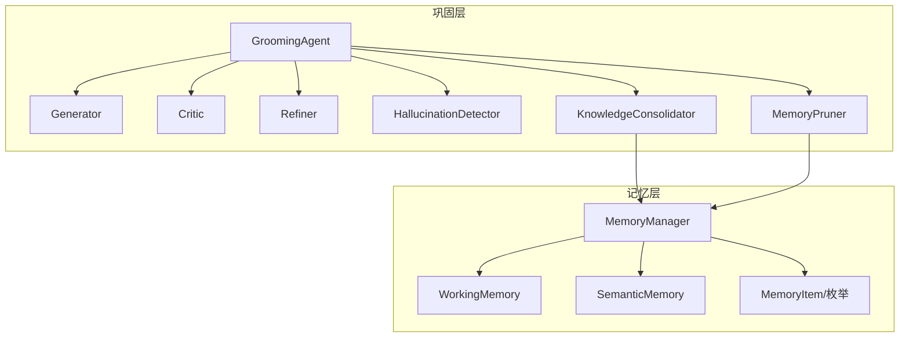

图表来源
- [src/grooming/agent.py:27-60](file://src/grooming/agent.py#L27-L60)
- [src/grooming/consolidator.py:20-34](file://src/grooming/consolidator.py#L20-L34)
- [src/grooming/pruner.py:20-40](file://src/grooming/pruner.py#L20-L40)
- [src/memory/manager.py:16-47](file://src/memory/manager.py#L16-L47)
- [src/memory/models.py:12-31](file://src/memory/models.py#L12-L31)
- [src/memory/working_memory.py:11-35](file://src/memory/working_memory.py#L11-L35)
- [src/memory/semantic_memory.py:21-49](file://src/memory/semantic_memory.py#L21-L49)

## 详细组件分析

### GroomingAgent：生成-批判-修正循环与幻觉检测
- 输入：query、evidence、context
- 流程：
  1) 生成初始答案
  2) 批判评估与幻觉检测
  3) 若通过则返回；否则进入修正或继续迭代
  4) 达到最大迭代次数后，按最低置信度阈值决定是否返回答案
- 关键参数：max_iterations、min_confidence
- 异步任务：run_background_tasks 调用 KnowledgeConsolidator 与 MemoryPruner

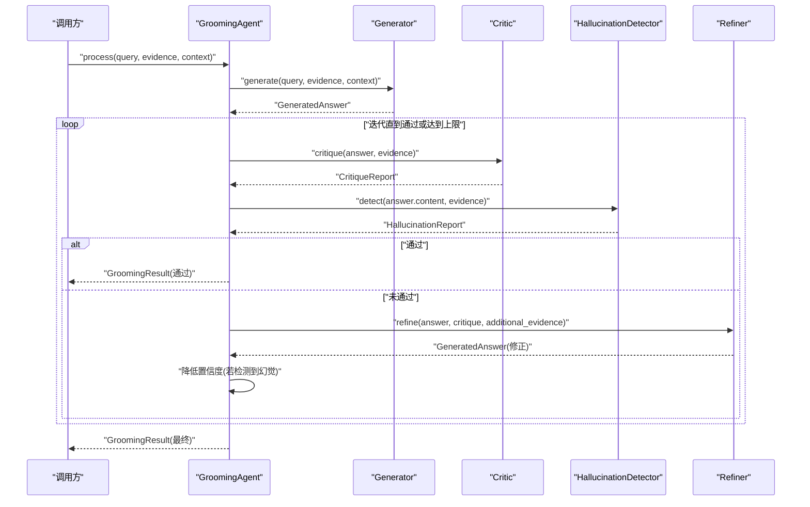

图表来源
- [src/grooming/agent.py:61-128](file://src/grooming/agent.py#L61-L128)
- [src/grooming/generator.py:25-63](file://src/grooming/generator.py#L25-L63)
- [src/grooming/critic.py:25-71](file://src/grooming/critic.py#L25-L71)
- [src/grooming/refiner.py:24-63](file://src/grooming/refiner.py#L24-L63)
- [src/grooming/hallucination.py:34-75](file://src/grooming/hallucination.py#L34-L75)

章节来源
- [src/grooming/agent.py:61-128](file://src/grooming/agent.py#L61-L128)

### Generator：答案生成
- 当前实现：拼接前若干条证据，构造基础答案与引用，设置默认置信度
- 预留：集成真实LLM生成接口，替换最小实现

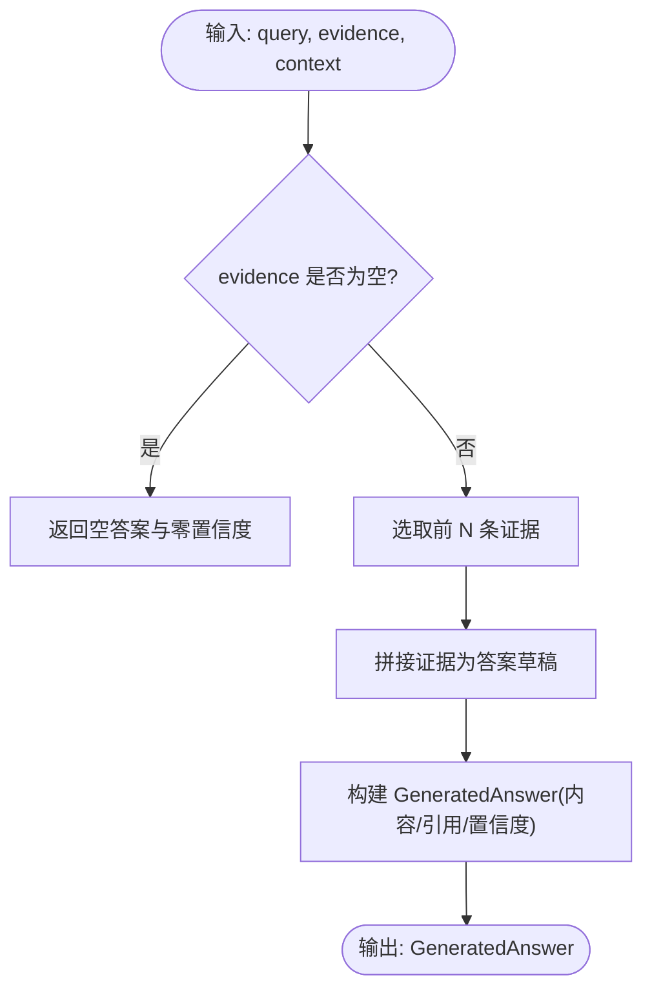

图表来源
- [src/grooming/generator.py:25-63](file://src/grooming/generator.py#L25-L63)

章节来源
- [src/grooming/generator.py:9-64](file://src/grooming/generator.py#L9-L64)

### Critic：质量评估与建议
- 评估维度：证据支撑、置信度、答案完整性
- 输出：是否有效、问题列表、建议、质量分数
- 作用：为 Refiner 提供修正方向与置信度调整依据

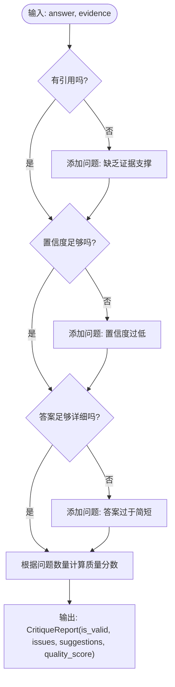

图表来源
- [src/grooming/critic.py:25-71](file://src/grooming/critic.py#L25-L71)

章节来源
- [src/grooming/critic.py:9-72](file://src/grooming/critic.py#L9-L72)

### Refiner：答案修正
- 输入：原始答案、批判报告、可选补充证据
- 处理：追加补充证据、按质量分数微调置信度、记录修正元数据
- 输出：修正后的 GeneratedAnswer

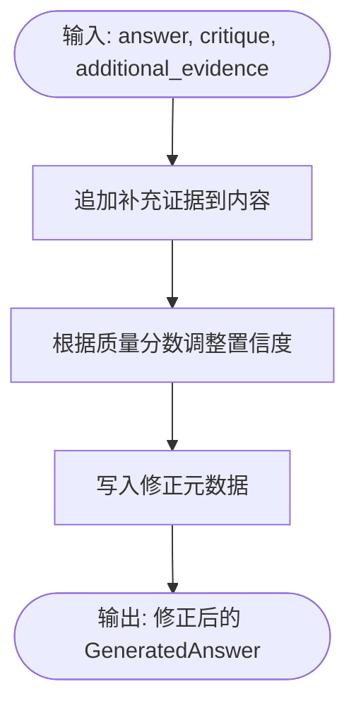

图表来源
- [src/grooming/refiner.py:24-63](file://src/grooming/refiner.py#L24-L63)

章节来源
- [src/grooming/refiner.py:8-64](file://src/grooming/refiner.py#L8-L64)

### HallucinationDetector：幻觉检测
- 检测三项指标：
  - 事实一致性：基于关键词重叠
  - 逻辑连贯性：基于长度与逻辑词
  - 证据支撑度：基于证据数量
- 判定：任一不达标即视为幻觉
- 输出：HallucinationReport（含各项分数与问题列表）

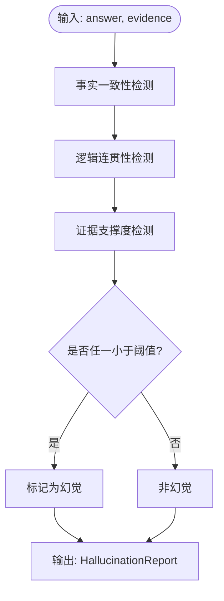

图表来源
- [src/grooming/hallucination.py:34-75](file://src/grooming/hallucination.py#L34-L75)
- [src/grooming/hallucination.py:77-153](file://src/grooming/hallucination.py#L77-L153)

章节来源
- [src/grooming/hallucination.py:9-154](file://src/grooming/hallucination.py#L9-L154)

### KnowledgeConsolidator：知识固化策略
- 功能目标：分析高频未命中查询、识别知识缺口、补充知识、合并碎片、更新图谱连接
- 当前实现：最小骨架（占位），留待后续完善

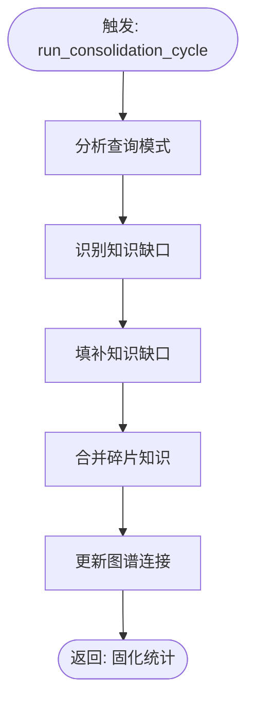

图表来源
- [src/grooming/consolidator.py:35-61](file://src/grooming/consolidator.py#L35-L61)
- [src/grooming/consolidator.py:75-102](file://src/grooming/consolidator.py#L75-L102)
- [src/grooming/consolidator.py:104-117](file://src/grooming/consolidator.py#L104-L117)
- [src/grooming/consolidator.py:119-129](file://src/grooming/consolidator.py#L119-L129)
- [src/grooming/consolidator.py:131-141](file://src/grooming/consolidator.py#L131-L141)

章节来源
- [src/grooming/consolidator.py:9-142](file://src/grooming/consolidator.py#L9-L142)

### MemoryPruner：记忆修剪策略
- 功能目标：清理噪声、识别低质量、修剪过时、强化重要连接
- 当前实现：基于阈值与访问计数的最小实现，留待完善

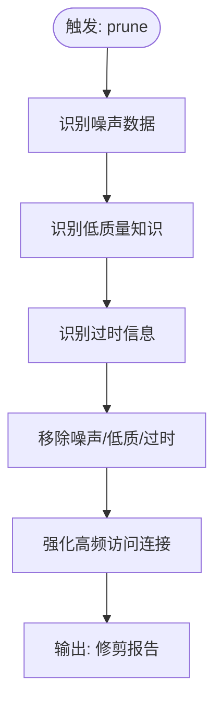

图表来源
- [src/grooming/pruner.py:41-69](file://src/grooming/pruner.py#L41-L69)
- [src/grooming/pruner.py:71-85](file://src/grooming/pruner.py#L71-L85)
- [src/grooming/pruner.py:87-101](file://src/grooming/pruner.py#L87-L101)
- [src/grooming/pruner.py:103-118](file://src/grooming/pruner.py#L103-L118)
- [src/grooming/pruner.py:120-137](file://src/grooming/pruner.py#L120-L137)
- [src/grooming/pruner.py:139-156](file://src/grooming/pruner.py#L139-L156)

章节来源
- [src/grooming/pruner.py:10-157](file://src/grooming/pruner.py#L10-L157)

### 数据模型：答案、报告与知识缺口
- GeneratedAnswer：内容、引用、置信度、元数据
- CritiqueReport：有效性、问题、建议、质量分数
- HallucinationReport：幻觉判定、事实/逻辑/支撑分数、问题列表
- GroomingResult：查询、答案、置信度、引用、幻觉报告、迭代次数、元数据
- KnowledgeGap：缺口ID、主题、描述、频率、元数据
- QueryPattern：模式、计数、命中率、示例

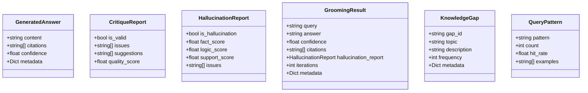

图表来源
- [src/grooming/models.py:9-66](file://src/grooming/models.py#L9-L66)

章节来源
- [src/grooming/models.py:9-66](file://src/grooming/models.py#L9-L66)

## 依赖关系分析
- GroomingAgent 依赖：
  - Generator、Critic、Refiner、HallucinationDetector
  - 可选：KnowledgeConsolidator、MemoryPruner（需 MemoryManager）
- KnowledgeConsolidator 与 MemoryPruner 依赖 MemoryManager
- MemoryManager 统一管理 WorkingMemory、SemanticMemory 与 EpisodicGraph，并维护统一存储

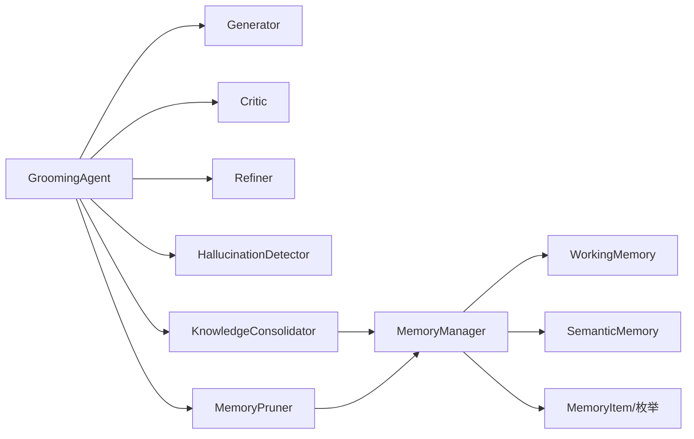

图表来源
- [src/grooming/agent.py:27-60](file://src/grooming/agent.py#L27-L60)
- [src/grooming/consolidator.py:20-34](file://src/grooming/consolidator.py#L20-L34)
- [src/grooming/pruner.py:20-40](file://src/grooming/pruner.py#L20-L40)
- [src/memory/manager.py:16-47](file://src/memory/manager.py#L16-L47)
- [src/memory/models.py:12-31](file://src/memory/models.py#L12-L31)

章节来源
- [src/grooming/agent.py:27-60](file://src/grooming/agent.py#L27-L60)
- [src/memory/manager.py:16-47](file://src/memory/manager.py#L16-L47)

## 性能考量
- 生成阶段：当前为拼接证据，复杂度与证据条数线性相关；建议在真实LLM集成后关注上下文长度与生成耗时。
- 批判与修正：基于规则与简单分数，开销较小；随着规则扩展，注意评估成本。
- 幻觉检测：关键词重叠与逻辑词检测为轻量级；事实一致性可引入更高效近似算法以提升吞吐。
- 记忆修剪：当前基于阈值扫描，复杂度与记忆项数量线性；建议在完善实现时采用索引或缓存加速。
- 异步固化：run_consolidation_cycle 为异步方法，适合在后台周期性执行，避免阻塞主线程。

## 故障排查指南
- 生成答案为空
  - 检查 evidence 是否为空；确认 Generator 的默认返回逻辑
  - 参考：[src/grooming/generator.py:45-50](file://src/grooming/generator.py#L45-L50)
- 答案未通过批判
  - 查看 Critic 的问题列表与建议；针对性补充证据或细化答案
  - 参考：[src/grooming/critic.py:42-58](file://src/grooming/critic.py#L42-L58)
- 幻觉检测触发
  - 检查事实一致性、逻辑连贯性与证据支撑度；增加高质量证据或改进表述
  - 参考：[src/grooming/hallucination.py:54-67](file://src/grooming/hallucination.py#L54-L67)
- 置信度过低
  - 通过 Refiner 基于质量分数微调；必要时补充证据
  - 参考：[src/grooming/refiner.py:52-56](file://src/grooming/refiner.py#L52-L56)
- 记忆修剪未生效
  - 检查阈值设置与记忆项属性；确认 MemoryManager 的删除与更新逻辑
  - 参考：[src/grooming/pruner.py:71-101](file://src/grooming/pruner.py#L71-L101), [src/grooming/pruner.py:120-137](file://src/grooming/pruner.py#L120-L137)
- 异步固化未执行
  - 确认已传入 MemoryManager；检查 run_background_tasks 返回状态
  - 参考：[src/grooming/agent.py:130-150](file://src/grooming/agent.py#L130-L150)

章节来源
- [src/grooming/generator.py:45-50](file://src/grooming/generator.py#L45-L50)
- [src/grooming/critic.py:42-58](file://src/grooming/critic.py#L42-L58)
- [src/grooming/hallucination.py:54-67](file://src/grooming/hallucination.py#L54-L67)
- [src/grooming/refiner.py:52-56](file://src/grooming/refiner.py#L52-L56)
- [src/grooming/pruner.py:71-101](file://src/grooming/pruner.py#L71-L101)
- [src/grooming/pruner.py:120-137](file://src/grooming/pruner.py#L120-L137)
- [src/grooming/agent.py:130-150](file://src/grooming/agent.py#L130-L150)

## 结论
Grooming Agent 通过“生成-批判-修正-幻觉检测”的闭环，显著提升了答案的可靠性与可解释性；同时结合知识固化与记忆修剪，保障长期知识质量与系统稳定性。当前模块以最小实现为主，便于快速集成真实LLM与外部存储系统，建议优先完善以下方面：
- 生成器：接入真实LLM，支持思维链与上下文增强
- 批判器：引入更丰富的质量维度与可解释性
- 幻觉检测：采用更强的事实一致性与逻辑推理模型
- 知识固化与修剪：完善查询模式分析、知识缺口识别与图谱更新算法

## 附录
- 使用示例参考：[example/example_usage.py:139-173](file://example/example_usage.py#L139-L173)
- 快速开始与模块概览：[QUICKSTART.md:69-83](file://QUICKSTART.md#L69-L83), [QUICKSTART.md:175-234](file://QUICKSTART.md#L175-L234)