# 幻觉检测机制

<cite>
**本文档引用的文件**
- [hallucination.py](file://src/grooming/hallucination.py)
- [models.py](file://src/grooming/models.py)
- [agent.py](file://src/grooming/agent.py)
- [critic.py](file://src/grooming/critic.py)
- [generator.py](file://src/grooming/generator.py)
- [refiner.py](file://src/grooming/refiner.py)
- [consolidator.py](file://src/grooming/consolidator.py)
- [pruner.py](file://src/grooming/pruner.py)
- [manager.py](file://src/memory/manager.py)
- [example_usage.py](file://example/example_usage.py)
- [README.md](file://docs/README.md)
- [QUICKSTART.md](file://QUICKSTART.md)
</cite>

## 目录
1. [简介](#简介)
2. [项目结构](#项目结构)
3. [核心组件](#核心组件)
4. [架构概览](#架构概览)
5. [详细组件分析](#详细组件分析)
6. [依赖关系分析](#依赖关系分析)
7. [性能考虑](#性能考虑)
8. [故障排除指南](#故障排除指南)
9. [结论](#结论)

## 简介

NecoRAG 是一个受猫咪大脑启发的多层智能系统，专门设计用于构建可靠的问答系统。本文件专注于巩固层中的幻觉检测机制，这是一个关键的质量保证组件，旨在确保生成的答案既准确又可信。

幻觉检测机制通过三个核心维度来评估答案质量：
- **事实一致性检查**：验证答案与检索证据的一致性程度
- **来源验证**：确认答案有充分的证据支撑
- **逻辑矛盾识别**：检查答案的内部逻辑连贯性

该机制采用 Generator → Critic → Refiner 的闭环架构，形成一个持续改进的质量控制系统。

## 项目结构

NecoRAG 采用五层架构设计，每层都有特定的功能职责：

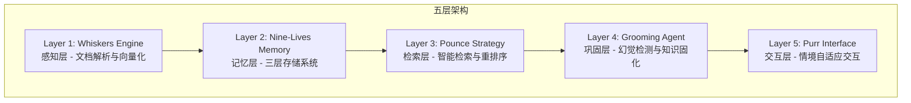

**图表来源**
- [README.md: 40-54:40-54](file://docs/README.md#L40-L54)

**章节来源**
- [README.md: 38-54:38-54](file://docs/README.md#L38-L54)
- [QUICKSTART.md: 71-83:71-83](file://QUICKSTART.md#L71-L83)

## 核心组件

幻觉检测机制由以下核心组件构成：

### HallucinationDetector 类
负责执行具体的幻觉检测任务，包含三个主要检测方法：
- `check_factual_consistency()`: 检查事实一致性
- `check_logical_coherence()`: 检查逻辑连贯性  
- `check_evidence_support()`: 检查证据支撑度

### HallucinationReport 数据模型
封装检测结果，包含：
- `is_hallucination`: 是否检测到幻觉
- `fact_score`: 事实一致性分数 (0-1)
- `logic_score`: 逻辑连贯性分数 (0-1)
- `support_score`: 证据支撑度分数 (0-1)
- `issues`: 发现的问题列表

### GroomingAgent 主控制器
协调整个幻觉检测流程，实现 Generator → Critic → Refiner 的闭环控制。

**章节来源**
- [hallucination.py: 9-75:9-75](file://src/grooming/hallucination.py#L9-L75)
- [models.py: 9-17:9-17](file://src/grooming/models.py#L9-L17)
- [agent.py: 16-60:16-60](file://src/grooming/agent.py#L16-L60)

## 架构概览

幻觉检测机制采用分层架构，每个组件都有明确的职责分工：

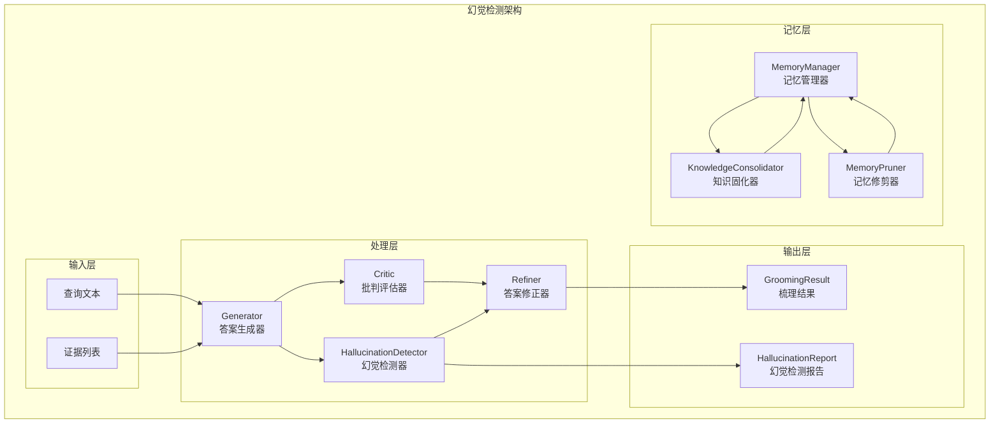

**图表来源**
- [agent.py: 16-128:16-128](file://src/grooming/agent.py#L16-L128)
- [hallucination.py: 9-75:9-75](file://src/grooming/hallucination.py#L9-L75)
- [critic.py: 9-72:9-72](file://src/grooming/critic.py#L9-L72)
- [refiner.py: 8-64:8-64](file://src/grooming/refiner.py#L8-L64)

## 详细组件分析

### HallucinationDetector 组件分析

#### 类结构图

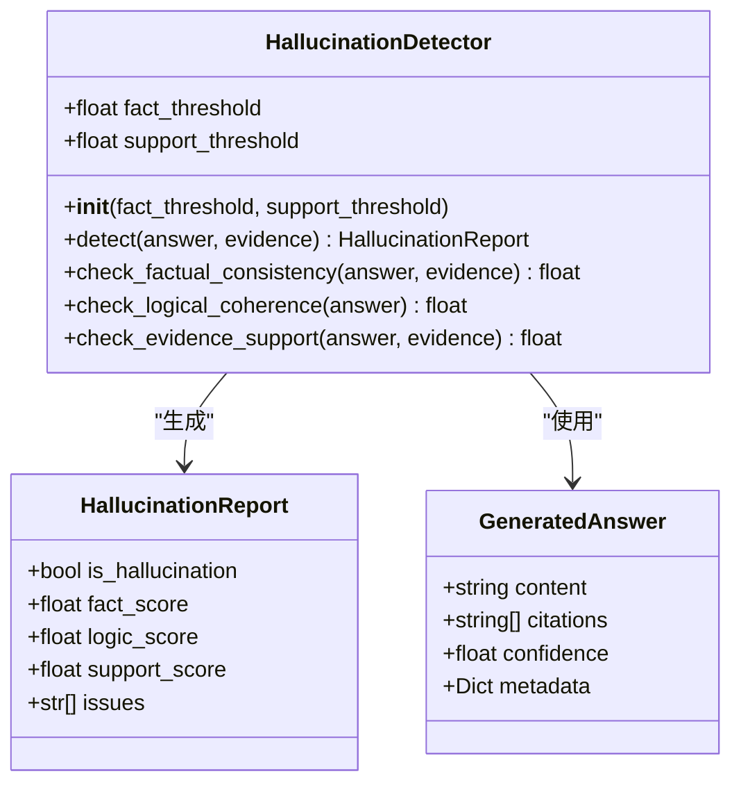

**图表来源**
- [hallucination.py: 9-154:9-154](file://src/grooming/hallucination.py#L9-L154)
- [models.py: 9-26:9-26](file://src/grooming/models.py#L9-L26)

#### 检测流程序列图

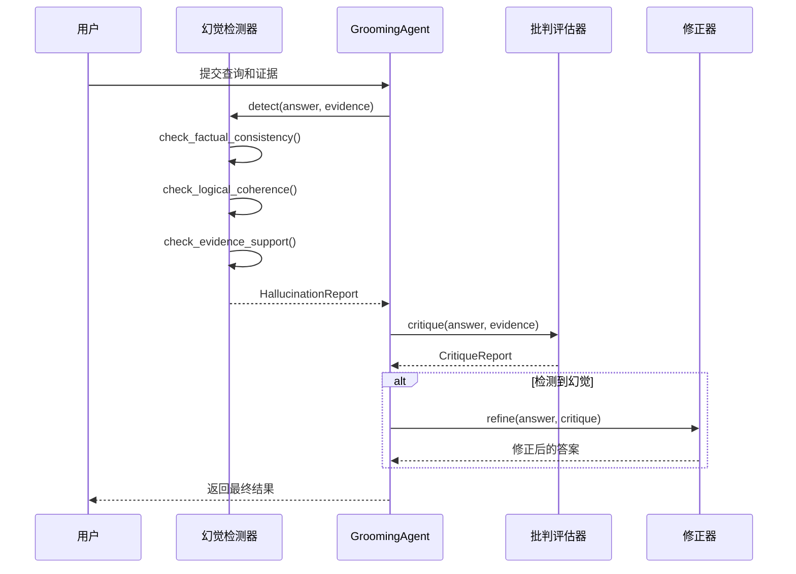

**图表来源**
- [agent.py: 61-128:61-128](file://src/grooming/agent.py#L61-L128)
- [hallucination.py: 34-75:34-75](file://src/grooming/hallucination.py#L34-L75)
- [critic.py: 25-72:25-72](file://src/grooming/critic.py#L25-L72)
- [refiner.py: 24-64:24-64](file://src/grooming/refiner.py#L24-L64)

#### 事实一致性检测算法

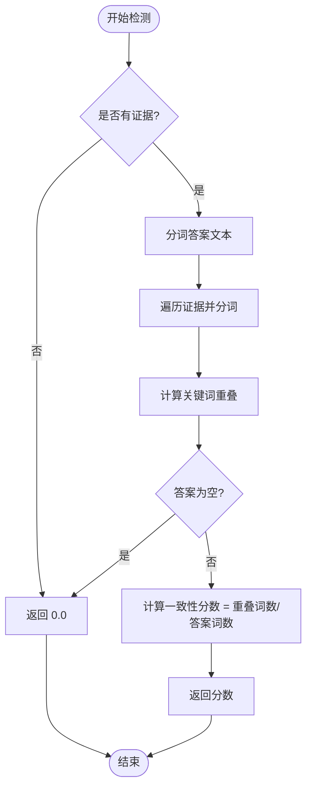

**图表来源**
- [hallucination.py: 77-107:77-107](file://src/grooming/hallucination.py#L77-L107)

#### 证据支撑度检测算法

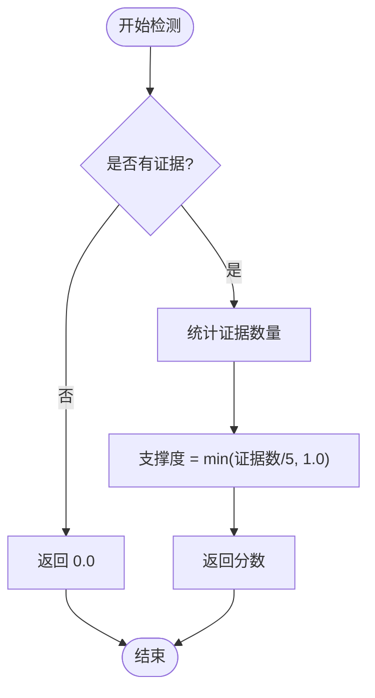

**图表来源**
- [hallucination.py: 131-153:131-153](file://src/grooming/hallucination.py#L131-L153)

### GroomingAgent 协作关系分析

#### 主控制流程

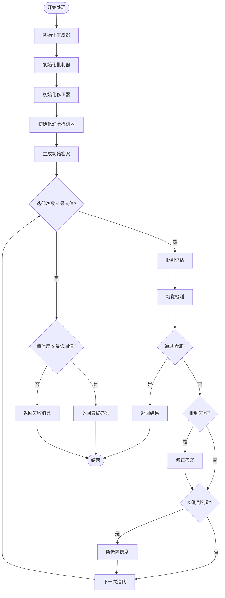

**图表来源**
- [agent.py: 61-128:61-128](file://src/grooming/agent.py#L61-L128)

#### 组件间依赖关系

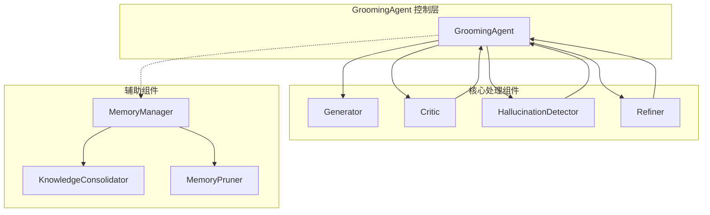

**图表来源**
- [agent.py: 48-59:48-59](file://src/grooming/agent.py#L48-L59)
- [consolidator.py: 9-34:9-34](file://src/grooming/consolidator.py#L9-L34)
- [pruner.py: 10-39:10-39](file://src/grooming/pruner.py#L10-L39)

**章节来源**
- [hallucination.py: 9-154:9-154](file://src/grooming/hallucination.py#L9-L154)
- [agent.py: 16-128:16-128](file://src/grooming/agent.py#L16-L128)
- [critic.py: 9-72:9-72](file://src/grooming/critic.py#L9-L72)
- [refiner.py: 8-64:8-64](file://src/grooming/refiner.py#L8-L64)

### 检测指标与阈值设置

#### 指标计算方法

| 指标类型 | 计算方法 | 阈值范围 | 默认阈值 |
|---------|---------|---------|---------|
| 事实一致性分数 | 关键词重叠率 | 0-1 | 0.7 |
| 逻辑连贯性分数 | 结构复杂度评分 | 0-1 | 0.6 |
| 证据支撑度分数 | 证据数量函数 | 0-1 | 0.5 |

#### 误报控制机制

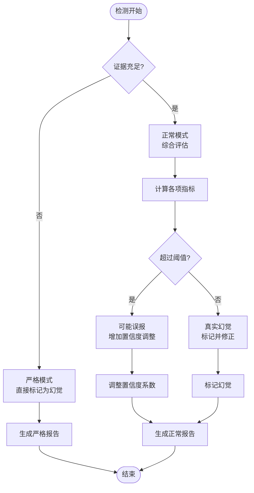

**图表来源**
- [hallucination.py: 54-75:54-75](file://src/grooming/hallucination.py#L54-L75)
- [agent.py: 116-118:116-118](file://src/grooming/agent.py#L116-L118)

**章节来源**
- [hallucination.py: 19-33:19-33](file://src/grooming/hallucination.py#L19-L33)
- [agent.py: 27-46:27-46](file://src/grooming/agent.py#L27-L46)

## 依赖关系分析

### 组件耦合度分析

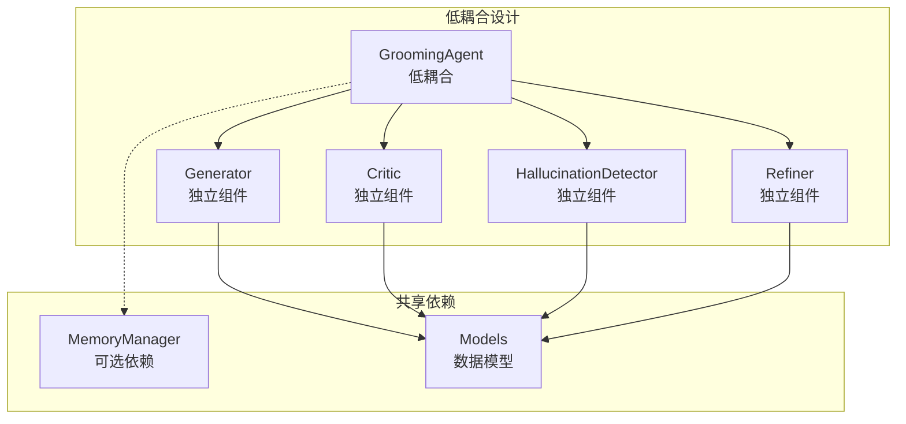

**图表来源**
- [agent.py: 48-59:48-59](file://src/grooming/agent.py#L48-L59)
- [models.py: 5-6:5-6](file://src/grooming/models.py#L5-L6)

### 外部依赖关系

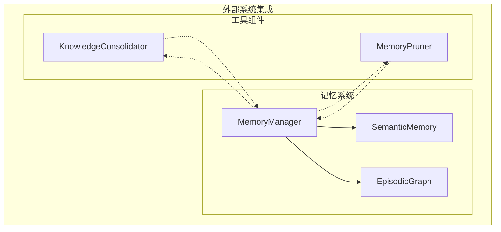

**图表来源**
- [manager.py: 16-46:16-46](file://src/memory/manager.py#L16-L46)
- [consolidator.py: 20-33:20-33](file://src/grooming/consolidator.py#L20-L33)
- [pruner.py: 20-39:20-39](file://src/grooming/pruner.py#L20-L39)

**章节来源**
- [agent.py: 48-59:48-59](file://src/grooming/agent.py#L48-L59)
- [manager.py: 16-46:16-46](file://src/memory/manager.py#L16-L46)

## 性能考虑

### 算法复杂度分析

| 组件 | 时间复杂度 | 空间复杂度 | 优化建议 |
|------|-----------|-----------|---------|
| 事实一致性检测 | O(n+m) | O(n+m) | 使用哈希集合优化查找 |
| 逻辑连贯性检测 | O(k) | O(1) | 缓存常用逻辑词汇 |
| 证据支撑度检测 | O(p) | O(1) | 预计算证据统计 |
| 整体检测流程 | O(i×(n+m+p)) | O(n+m) | 并行化处理多个证据 |

### 性能优化技巧

1. **并行处理优化**
   - 将多个证据的处理改为并行执行
   - 使用缓存机制避免重复计算

2. **内存管理优化**
   - 实施惰性加载策略
   - 及时清理临时数据结构

3. **算法优化策略**
   - 使用更高效的字符串匹配算法
   - 实施早期退出机制

## 故障排除指南

### 常见问题诊断

#### 幻觉检测不准确

**症状**：频繁误报或漏报幻觉

**可能原因**：
1. 阈值设置不合理
2. 证据质量差
3. 答案生成质量低

**解决方案**：
1. 调整阈值参数
2. 改进证据检索质量
3. 优化答案生成算法

#### 性能问题

**症状**：检测速度慢

**可能原因**：
1. 算法复杂度过高
2. 内存使用不当
3. 缺少缓存机制

**解决方案**：
1. 实施算法优化
2. 改进内存管理
3. 添加缓存层

#### 集成问题

**症状**：组件间通信异常

**可能原因**：
1. 接口不兼容
2. 数据格式错误
3. 异常处理不当

**解决方案**：
1. 统一接口规范
2. 实施数据验证
3. 完善异常处理

**章节来源**
- [hallucination.py: 92-93:92-93](file://src/grooming/hallucination.py#L92-L93)
- [hallucination.py: 119-120:119-120](file://src/grooming/hallucination.py#L119-L120)
- [hallucination.py: 146-147:146-147](file://src/grooming/hallucination.py#L146-L147)

## 结论

NecoRAG 的幻觉检测机制通过精心设计的多层架构实现了可靠的问答质量保证。该系统的主要优势包括：

### 核心优势

1. **多层次检测**：同时检查事实一致性、逻辑连贯性和证据支撑度
2. **闭环控制**：通过 Generator → Critic → Refiner 的循环实现持续改进
3. **灵活配置**：支持自定义阈值和检测参数
4. **可扩展性**：模块化设计便于功能扩展

### 技术特点

- **渐进式改进**：通过迭代优化逐步提升答案质量
- **误报控制**：实施多重验证机制减少误报
- **性能优化**：采用多种优化策略确保系统效率
- **易于集成**：清晰的接口设计便于与其他组件集成

### 发展方向

1. **算法升级**：引入更先进的自然语言处理技术
2. **性能优化**：进一步提升检测速度和准确性
3. **智能化增强**：实现自适应阈值调整
4. **可解释性**：增强检测决策的可解释性

该幻觉检测机制为构建可靠的问答系统提供了坚实的技术基础，通过持续的优化和改进，能够有效提升AI系统的可信度和实用性。