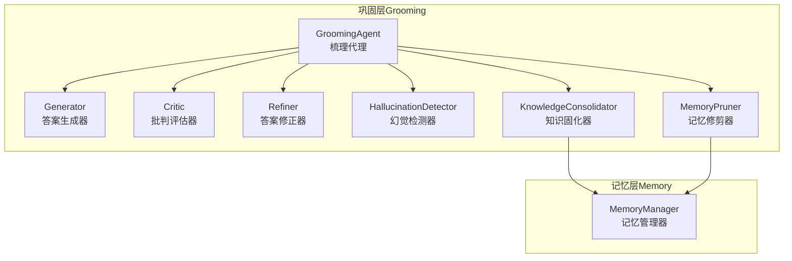
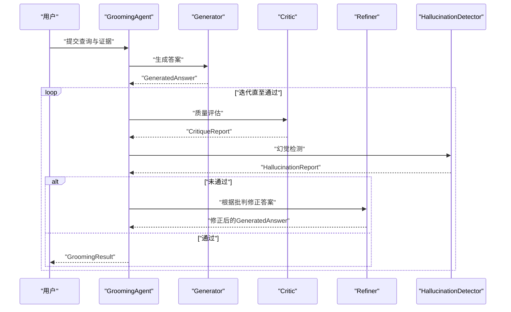
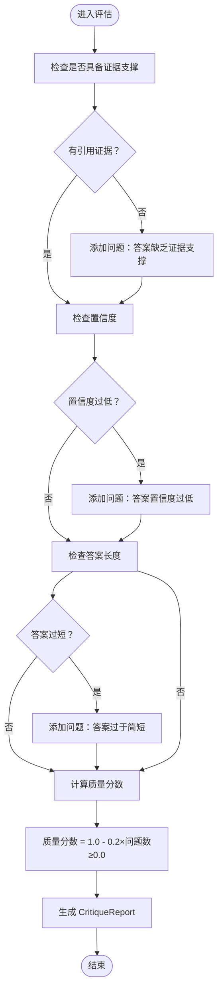
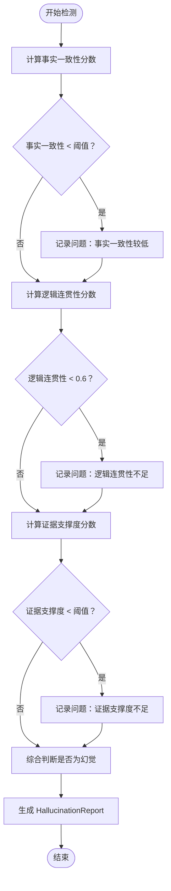
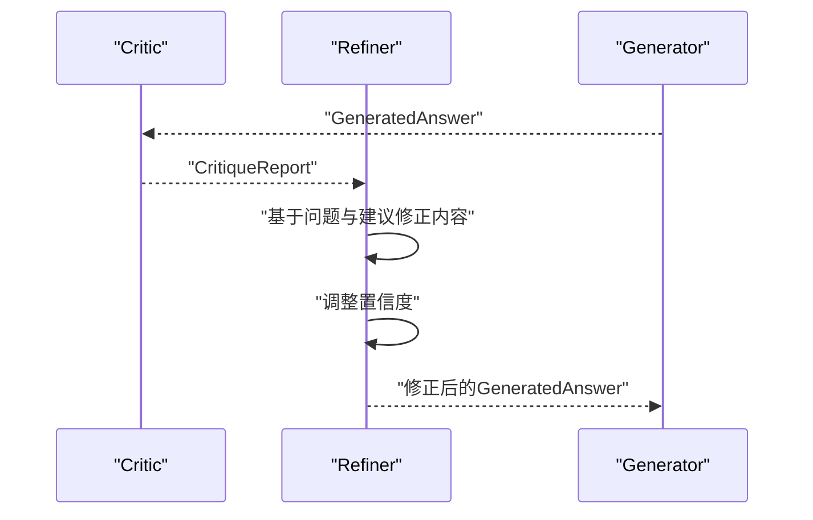
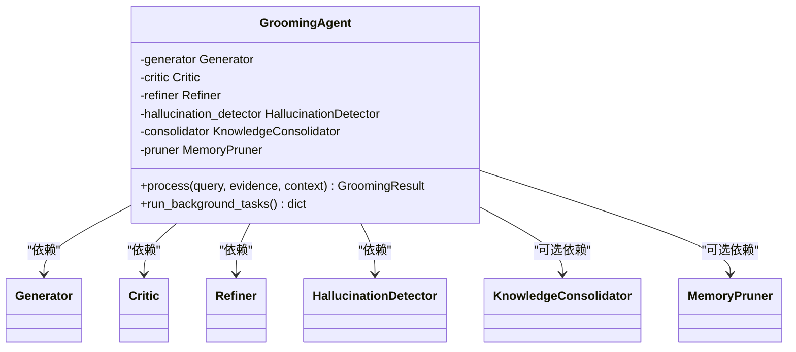
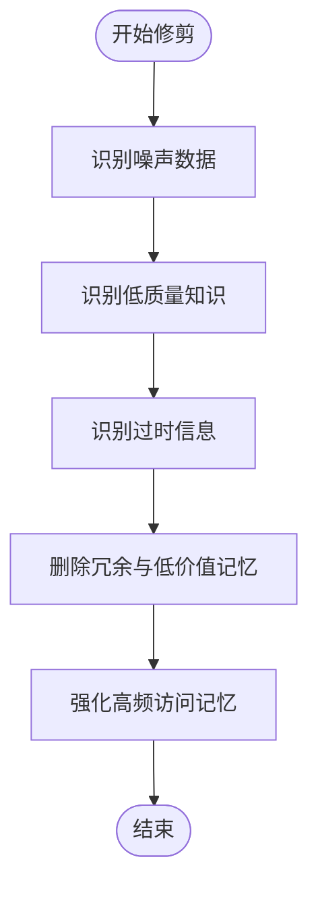
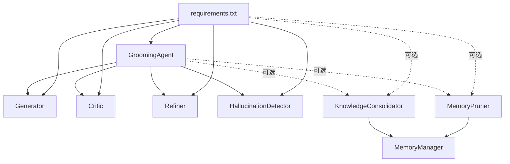

# 批判评估系统

<cite>
**本文引用的文件**
- [src/grooming/critic.py](file://src/grooming/critic.py)
- [src/grooming/models.py](file://src/grooming/models.py)
- [src/grooming/agent.py](file://src/grooming/agent.py)
- [src/grooming/generator.py](file://src/grooming/generator.py)
- [src/grooming/refiner.py](file://src/grooming/refiner.py)
- [src/grooming/hallucination.py](file://src/grooming/hallucination.py)
- [src/grooming/consolidator.py](file://src/grooming/consolidator.py)
- [src/grooming/pruner.py](file://src/grooming/pruner.py)
- [src/memory/manager.py](file://src/memory/manager.py)
- [example/example_usage.py](file://example/example_usage.py)
- [requirements.txt](file://requirements.txt)
- [pyproject.toml](file://pyproject.toml)
</cite>

## 目录
1. [引言](#引言)
2. [项目结构](#项目结构)
3. [核心组件](#核心组件)
4. [架构总览](#架构总览)
5. [详细组件分析](#详细组件分析)
6. [依赖分析](#依赖分析)
7. [性能考虑](#性能考虑)
8. [故障排查指南](#故障排查指南)
9. [结论](#结论)
10. [附录](#附录)

## 引言
本文件面向“批判评估系统”的技术文档，聚焦于巩固层（Grooming）中的“批判器”（Critic）及其与生成器（Generator）、修正器（Refiner）、幻觉检测器（HallucinationDetector）以及记忆修剪（MemoryPruner）等组件的反馈闭环机制。文档从算法与质量判断标准出发，系统阐述评估指标体系、评分机制、反馈生成流程，并给出参数配置、阈值调优与结果解读方法，帮助读者在不直接阅读源码的情况下，也能高效理解与使用该系统。

## 项目结构
本项目采用分层架构，批判评估系统位于第四层“巩固层”。其核心由以下模块组成：
- 生成器：基于检索证据生成答案
- 批判器：评估答案质量与准确性
- 修正器：根据批判意见修正答案
- 幻觉检测器：检测事实一致性、逻辑连贯性与证据支撑度
- 梳理代理：串联上述组件，形成 Generator → Critic → Refiner 的闭环
- 记忆修剪器：维护知识质量，保障输入证据的可靠性

**图表来源**
- [src/grooming/agent.py:16-151](file://src/grooming/agent.py#L16-L151)
- [src/grooming/generator.py:9-64](file://src/grooming/generator.py#L9-L64)
- [src/grooming/critic.py:9-72](file://src/grooming/critic.py#L9-L72)
- [src/grooming/refiner.py:8-64](file://src/grooming/refiner.py#L8-L64)
- [src/grooming/hallucination.py:9-154](file://src/grooming/hallucination.py#L9-L154)
- [src/grooming/consolidator.py:9-142](file://src/grooming/consolidator.py#L9-L142)
- [src/grooming/pruner.py:10-157](file://src/grooming/pruner.py#L10-L157)
- [src/memory/manager.py:16-186](file://src/memory/manager.py#L16-L186)

**章节来源**
- [src/grooming/agent.py:16-151](file://src/grooming/agent.py#L16-L151)
- [src/grooming/__init__.py:1-26](file://src/grooming/__init__.py#L1-L26)

## 核心组件
本节聚焦批判评估系统的关键数据模型与组件职责，为后续算法与流程分析奠定基础。

- 数据模型
  - GeneratedAnswer：包含内容、引用证据 ID、置信度与元数据
  - CritiqueReport：包含是否有效、问题列表、改进建议、质量评分
  - HallucinationReport：包含事实一致性、逻辑连贯性、证据支撑度评分及问题列表
  - GroomingResult：最终输出，包含查询、答案、置信度、引用、幻觉报告、迭代次数与元数据
  - KnowledgeGap、QueryPattern：用于知识固化分析

- 组件职责
  - Generator：基于证据生成答案，提供基础置信度与引用
  - Critic：对答案进行质量评估，产出质量评分与问题清单
  - Refiner：依据批判报告与可选补充证据修正答案，调整置信度
  - HallucinationDetector：检测事实一致性、逻辑连贯性与证据支撑度
  - GroomingAgent：协调生成、评估、修正与检测，形成闭环；支持异步知识固化与记忆修剪

**章节来源**
- [src/grooming/models.py:9-66](file://src/grooming/models.py#L9-L66)
- [src/grooming/generator.py:9-64](file://src/grooming/generator.py#L9-L64)
- [src/grooming/critic.py:9-72](file://src/grooming/critic.py#L9-L72)
- [src/grooming/refiner.py:8-64](file://src/grooming/refiner.py#L8-L64)
- [src/grooming/hallucination.py:9-154](file://src/grooming/hallucination.py#L9-L154)
- [src/grooming/agent.py:16-151](file://src/grooming/agent.py#L16-L151)

## 架构总览
批判评估系统以“生成-评估-修正-检测”的闭环为核心，结合记忆修剪与知识固化，持续提升答案质量与知识可靠性。

**图表来源**
- [src/grooming/agent.py:61-128](file://src/grooming/agent.py#L61-L128)
- [src/grooming/critic.py:25-71](file://src/grooming/critic.py#L25-L71)
- [src/grooming/refiner.py:24-63](file://src/grooming/refiner.py#L24-L63)
- [src/grooming/hallucination.py:34-75](file://src/grooming/hallucination.py#L34-L75)

## 详细组件分析

### 批判器（Critic）算法与质量判断标准
- 评估目标
  - 判断答案是否满足“证据支撑、置信度、完整性”三项基本要求
  - 输出质量评分与问题清单，作为修正与决策依据

- 评估指标与规则
  - 证据支撑：若答案无引用证据，则判定为问题，并给出“建议重新检索相关证据”
  - 置信度：若置信度低于阈值（默认 0.5），则判定为问题，并建议补充证据
  - 完整性：若答案内容长度过短（默认阈值字符数），则判定为问题，并建议提供更详细回答
  - 质量评分：初始满分为 1.0，每发现一个问题扣减固定权重，最低不低于 0.0

- 评分机制
  - 质量分数 = 1.0 − 0.2 × 问题数量（最小为 0.0）
  - is_valid = 是否无问题

- 反馈生成过程
  - 生成问题列表与改进建议
  - 生成质量评分，供修正器与梳理代理决策

**图表来源**
- [src/grooming/critic.py:25-71](file://src/grooming/critic.py#L25-L71)

**章节来源**
- [src/grooming/critic.py:9-72](file://src/grooming/critic.py#L9-L72)
- [src/grooming/models.py:28-35](file://src/grooming/models.py#L28-L35)

### 幻觉检测器（HallucinationDetector）指标体系
- 检测目标
  - 事实一致性：答案与证据在语义层面的一致程度
  - 逻辑连贯性：答案的推理与表达是否连贯
  - 证据支撑度：答案是否得到足够证据支持

- 指标阈值与规则
  - 事实一致性阈值（默认 0.7）与证据支撑度阈值（默认 0.5）
  - 若事实一致性或证据支撑度任一低于阈值，则判定为存在幻觉
  - 逻辑连贯性阈值为 0.6（低于该阈值记录问题）

- 评分机制
  - 事实一致性：基于答案与证据的关键词重叠比例
  - 逻辑连贯性：基于答案长度与是否存在逻辑连接词
  - 证据支撑度：基于证据数量的线性饱和函数

**图表来源**
- [src/grooming/hallucination.py:34-75](file://src/grooming/hallucination.py#L34-L75)
- [src/grooming/hallucination.py:77-153](file://src/grooming/hallucination.py#L77-L153)

**章节来源**
- [src/grooming/hallucination.py:9-154](file://src/grooming/hallucination.py#L9-L154)
- [src/grooming/models.py:9-17](file://src/grooming/models.py#L9-L17)

### 生成器（Generator）与修正器（Refiner）的协作
- 生成器
  - 基于证据生成答案，提供基础内容、引用 ID 与置信度
  - 当无证据时返回兜底内容与零置信度

- 修正器
  - 根据批判报告与可选补充证据修正答案
  - 调整置信度：高质量（评分高于阈值）则小幅提升，低质量则小幅降低
  - 附加引用 ID 与元数据（如是否被修正、问题数量）

**图表来源**
- [src/grooming/generator.py:25-63](file://src/grooming/generator.py#L25-L63)
- [src/grooming/refiner.py:24-63](file://src/grooming/refiner.py#L24-L63)
- [src/grooming/critic.py:25-71](file://src/grooming/critic.py#L25-L71)

**章节来源**
- [src/grooming/generator.py:9-64](file://src/grooming/generator.py#L9-L64)
- [src/grooming/refiner.py:8-64](file://src/grooming/refiner.py#L8-L64)

### 梳理代理（GroomingAgent）的反馈闭环
- 控制流
  - 生成初始答案
  - 批判评估与幻觉检测
  - 若未通过：修正答案并继续迭代
  - 若通过：返回最终结果
  - 迭代上限控制与最低置信度阈值

- 关键参数
  - max_iterations：最大迭代次数
  - min_confidence：最低置信度阈值
  - 与记忆管理器集成时启用知识固化与记忆修剪

**图表来源**
- [src/grooming/agent.py:16-60](file://src/grooming/agent.py#L16-L60)

**章节来源**
- [src/grooming/agent.py:16-151](file://src/grooming/agent.py#L16-L151)

### 记忆修剪器（MemoryPruner）与知识固化器（KnowledgeConsolidator）
- 记忆修剪器
  - 识别噪声数据、低质量知识与过时信息
  - 删除冗余与低价值记忆，强化高频访问记忆
  - 参数：噪声阈值、质量阈值、过时天数

- 知识固化器
  - 分析查询模式，识别知识缺口，补充缺失知识
  - 合并碎片化知识，更新图谱连接
  - 参数：最小查询频率

**图表来源**
- [src/grooming/pruner.py:41-157](file://src/grooming/pruner.py#L41-L157)
- [src/grooming/consolidator.py:35-142](file://src/grooming/consolidator.py#L35-L142)

**章节来源**
- [src/grooming/pruner.py:10-157](file://src/grooming/pruner.py#L10-L157)
- [src/grooming/consolidator.py:9-142](file://src/grooming/consolidator.py#L9-L142)
- [src/memory/manager.py:16-186](file://src/memory/manager.py#L16-L186)

## 依赖分析
- 组件耦合
  - GroomingAgent 对 Generator、Critic、Refiner、HallucinationDetector 具有强依赖
  - 可选依赖 KnowledgeConsolidator 与 MemoryPruner，需 MemoryManager 支持
- 外部依赖
  - 项目核心依赖 numpy、python-dateutil
  - 可选依赖（用于集成真实组件）：langchain、openai、anthropic、FlagEmbedding、sentence-transformers、qdrant-client、neo4j、redis 等

**图表来源**
- [src/grooming/agent.py:16-60](file://src/grooming/agent.py#L16-L60)
- [requirements.txt:1-57](file://requirements.txt#L1-L57)

**章节来源**
- [requirements.txt:1-57](file://requirements.txt#L1-L57)
- [pyproject.toml:27-30](file://pyproject.toml#L27-L30)

## 性能考虑
- 评估复杂度
  - 批判器与幻觉检测器均为常数时间复杂度，主要受输入文本长度影响
  - 修正器的置信度调整与内容拼接为线性复杂度
- 可扩展方向
  - 将关键词重叠改为语义相似度（如嵌入向量余弦相似度）
  - 引入 LLM 进行更精细的逻辑连贯性与事实一致性判断
  - 将证据支撑度与事实一致性评分改为基于交叉编码器的匹配分数
- 迭代控制
  - 通过 max_iterations 限制闭环次数，避免无限循环
  - 通过 min_confidence 保证最终输出的可靠性

## 故障排查指南
- 常见问题与定位
  - 答案频繁未通过：检查证据是否充足与相关；适当提高证据数量或调整检索策略
  - 质量评分偏低：关注问题列表与建议，针对性补充证据或扩展答案细节
  - 幻觉误报/漏报：调整事实一致性与证据支撑度阈值；增加逻辑连接词检测或引入更严格的语义一致性
  - 迭代次数过多：检查 max_iterations 设置；确认修正器是否有效提升置信度
- 参数调优建议
  - 置信度阈值：根据业务场景设定（如 0.6~0.8）
  - 证据支撑度阈值：建议 0.5~0.7
  - 事实一致性阈值：建议 0.6~0.8
  - 迭代上限：根据性能与质量平衡设置（如 2~5 次）
- 结果解读方法
  - is_valid 为真：答案通过质量评估与幻觉检测
  - quality_score：越接近 1 越可靠；越低越需要补充证据或扩展内容
  - hallucination_report：若 is_hallucination 为真，优先补充权威证据或重写答案

**章节来源**
- [src/grooming/critic.py:25-71](file://src/grooming/critic.py#L25-L71)
- [src/grooming/hallucination.py:34-75](file://src/grooming/hallucination.py#L34-L75)
- [src/grooming/agent.py:61-128](file://src/grooming/agent.py#L61-L128)

## 结论
批判评估系统通过“生成-评估-修正-检测”的闭环，结合证据支撑、置信度与完整性等多维质量指标，实现了对答案的自动化质量控制。配合记忆修剪与知识固化，系统能够持续优化输入证据质量与知识结构，从而提升最终输出的准确性与可靠性。建议在实际部署中逐步引入更精细的语义一致性与逻辑连贯性检测，并结合业务场景动态调整阈值与迭代策略。

## 附录
- 使用示例参考
  - 完整工作流示例展示了从感知层到交互层的端到端流程，可作为系统集成与调试的参考

**章节来源**
- [example/example_usage.py:139-173](file://example/example_usage.py#L139-L173)