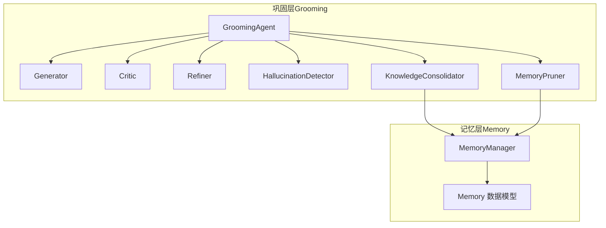
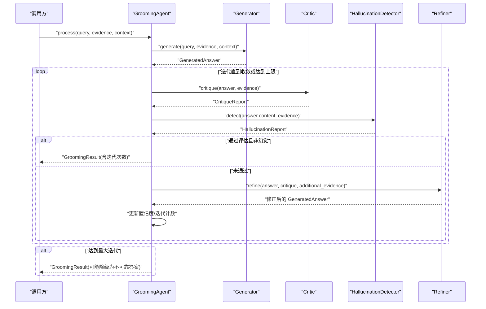
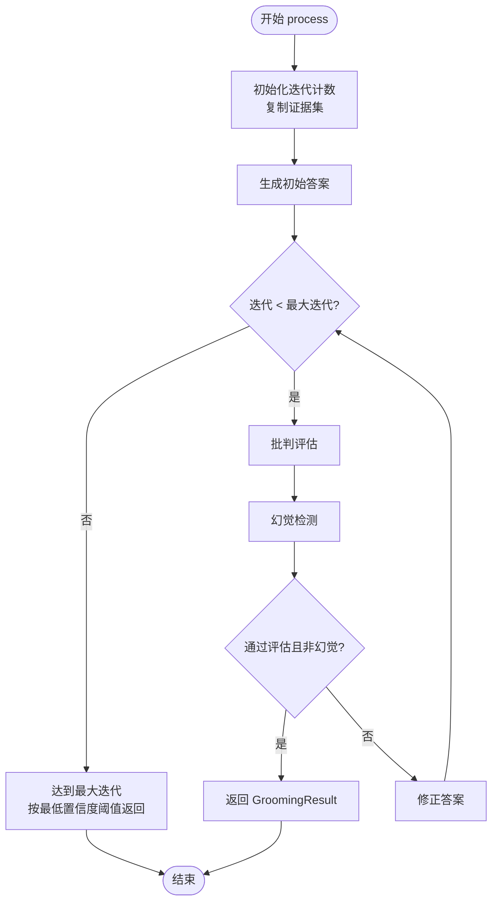
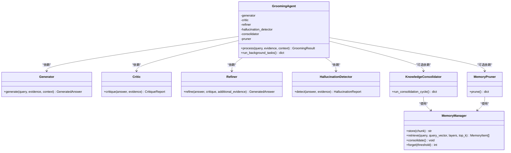

# 生成-批判-修正循环

<cite>
**本文引用的文件**
- [src/grooming/agent.py](file://src/grooming/agent.py)
- [src/grooming/generator.py](file://src/grooming/generator.py)
- [src/grooming/critic.py](file://src/grooming/critic.py)
- [src/grooming/refiner.py](file://src/grooming/refiner.py)
- [src/grooming/hallucination.py](file://src/grooming/hallucination.py)
- [src/grooming/consolidator.py](file://src/grooming/consolidator.py)
- [src/grooming/pruner.py](file://src/grooming/pruner.py)
- [src/grooming/models.py](file://src/grooming/models.py)
- [src/memory/manager.py](file://src/memory/manager.py)
- [src/memory/models.py](file://src/memory/models.py)
- [example/example_usage.py](file://example/example_usage.py)
</cite>

## 目录
1. [简介](#简介)
2. [项目结构](#项目结构)
3. [核心组件](#核心组件)
4. [架构总览](#架构总览)
5. [详细组件分析](#详细组件分析)
6. [依赖关系分析](#依赖关系分析)
7. [性能考量](#性能考量)
8. [故障排查指南](#故障排查指南)
9. [结论](#结论)
10. [附录](#附录)

## 简介
本技术文档围绕“生成-批判-修正循环”系统展开，系统以 GroomingAgent 为核心控制器，串联生成器、批判器、修正器与幻觉检测器，形成一个可迭代的闭环优化流程。该循环通过“生成-评估-修正-再评估”的迭代机制，结合幻觉检测与置信度动态调整，确保输出答案的质量与可靠性；同时，系统还提供异步知识固化与记忆修剪能力，以维持长期知识的有效性与新鲜度。

## 项目结构
本系统位于 src/grooming 目录下，围绕“巩固层”构建，包含以下关键模块：
- 控制器：GroomingAgent
- 生成器：Generator
- 批判器：Critic
- 修正器：Refiner
- 幻觉检测器：HallucinationDetector
- 知识固化器：KnowledgeConsolidator
- 记忆修剪器：MemoryPruner
- 数据模型：GeneratedAnswer、CritiqueReport、HallucinationReport、GroomingResult 等
- 记忆管理：MemoryManager 及其模型

图表来源
- [src/grooming/agent.py:16-60](file://src/grooming/agent.py#L16-L60)
- [src/grooming/generator.py:9-24](file://src/grooming/generator.py#L9-L24)
- [src/grooming/critic.py:9-24](file://src/grooming/critic.py#L9-L24)
- [src/grooming/refiner.py:8-23](file://src/grooming/refiner.py#L8-L23)
- [src/grooming/hallucination.py:9-33](file://src/grooming/hallucination.py#L9-L33)
- [src/grooming/consolidator.py:9-34](file://src/grooming/consolidator.py#L9-L34)
- [src/grooming/pruner.py:10-40](file://src/grooming/pruner.py#L10-L40)
- [src/memory/manager.py:16-47](file://src/memory/manager.py#L16-L47)
- [src/memory/models.py:12-31](file://src/memory/models.py#L12-L31)

章节来源
- [src/grooming/agent.py:16-60](file://src/grooming/agent.py#L16-L60)
- [src/grooming/__init__.py:6-25](file://src/grooming/__init__.py#L6-L25)

## 核心组件
- GroomingAgent：循环控制中枢，负责初始化子组件、驱动迭代流程、聚合结果与触发后台任务。
- Generator：基于检索证据生成初始答案，提供内容、引用与置信度。
- Critic：对答案进行质量评估，产出是否有效、问题列表、建议与质量评分。
- Refiner：依据批判报告修正答案，调整内容与置信度，并记录元数据。
- HallucinationDetector：检测事实一致性、逻辑连贯性与证据支撑度，输出幻觉报告。
- KnowledgeConsolidator：分析查询模式、识别知识缺口并进行补充与整合。
- MemoryPruner：识别噪声、低质量与过时信息，执行修剪与强化连接。

章节来源
- [src/grooming/agent.py:16-60](file://src/grooming/agent.py#L16-L60)
- [src/grooming/generator.py:9-64](file://src/grooming/generator.py#L9-L64)
- [src/grooming/critic.py:9-72](file://src/grooming/critic.py#L9-L72)
- [src/grooming/refiner.py:8-64](file://src/grooming/refiner.py#L8-L64)
- [src/grooming/hallucination.py:9-154](file://src/grooming/hallucination.py#L9-L154)
- [src/grooming/consolidator.py:9-142](file://src/grooming/consolidator.py#L9-L142)
- [src/grooming/pruner.py:10-157](file://src/grooming/pruner.py#L10-L157)
- [src/grooming/models.py:9-66](file://src/grooming/models.py#L9-L66)

## 架构总览
生成-批判-修正循环的整体工作流如下：

图表来源
- [src/grooming/agent.py:61-128](file://src/grooming/agent.py#L61-L128)
- [src/grooming/generator.py:25-63](file://src/grooming/generator.py#L25-L63)
- [src/grooming/critic.py:25-71](file://src/grooming/critic.py#L25-L71)
- [src/grooming/refiner.py:24-63](file://src/grooming/refiner.py#L24-L63)
- [src/grooming/hallucination.py:34-75](file://src/grooming/hallucination.py#L34-L75)

## 详细组件分析

### GroomingAgent：循环控制与状态管理
- 初始化参数
  - llm_model：模型标识（当前为占位）
  - memory：MemoryManager 实例（可选）
  - max_iterations：最大迭代次数
  - min_confidence：最低置信度阈值
- 循环控制逻辑
  - 使用迭代计数控制退出条件
  - 每轮依次执行：生成、批判、幻觉检测、收敛判断、必要时修正
- 状态与收敛
  - 收敛条件：批判有效且非幻觉
  - 未收敛时，进入修正阶段并更新答案与置信度
  - 达到最大迭代后，按最低置信度阈值决定返回可靠答案或兜底文本
- 后台任务
  - 异步运行知识固化与记忆修剪，仅在 memory 初始化时启用

图表来源
- [src/grooming/agent.py:61-128](file://src/grooming/agent.py#L61-L128)

章节来源
- [src/grooming/agent.py:27-60](file://src/grooming/agent.py#L27-L60)
- [src/grooming/agent.py:61-128](file://src/grooming/agent.py#L61-L128)
- [src/grooming/agent.py:130-150](file://src/grooming/agent.py#L130-L150)

### Generator：答案生成
- 输入：query、evidence、context
- 输出：GeneratedAnswer（content、citations、confidence、metadata）
- 当前实现要点
  - 若无证据，返回兜底内容与零置信度
  - 选取前若干条证据拼接，构造基础答案
  - 置信度基于证据存在性与数量进行启发式赋值

章节来源
- [src/grooming/generator.py:25-63](file://src/grooming/generator.py#L25-L63)
- [src/grooming/models.py:19-26](file://src/grooming/models.py#L19-L26)

### Critic：批判评估
- 输入：GeneratedAnswer、evidence
- 输出：CritiqueReport（is_valid、issues、suggestions、quality_score）
- 评估维度
  - 引用完整性（是否提供证据）
  - 置信度阈值
  - 答案长度/完整性
- 质量评分计算：基于问题数量进行扣分，不低于 0

章节来源
- [src/grooming/critic.py:25-71](file://src/grooming/critic.py#L25-L71)
- [src/grooming/models.py:28-35](file://src/grooming/models.py#L28-L35)

### Refiner：答案修正
- 输入：GeneratedAnswer、CritiqueReport、additional_evidence
- 输出：修正后的 GeneratedAnswer
- 修正策略
  - 追加补充证据
  - 基于质量评分微调置信度
  - 记录修正元数据（如是否被修正、问题数量）

章节来源
- [src/grooming/refiner.py:24-63](file://src/grooming/refiner.py#L24-L63)
- [src/grooming/models.py:19-26](file://src/grooming/models.py#L19-L26)

### HallucinationDetector：幻觉检测
- 输入：answer.content、evidence
- 输出：HallucinationReport（is_hallucination、fact_score、logic_score、support_score、issues）
- 检测指标
  - 事实一致性：基于关键词重叠比例
  - 逻辑连贯性：基于长度与逻辑连接词
  - 证据支撑度：基于证据数量
- 判定规则：事实一致性或证据支撑度低于阈值即视为幻觉

章节来源
- [src/grooming/hallucination.py:34-75](file://src/grooming/hallucination.py#L34-L75)
- [src/grooming/hallucination.py:77-107](file://src/grooming/hallucination.py#L77-L107)
- [src/grooming/hallucination.py:109-129](file://src/grooming/hallucination.py#L109-L129)
- [src/grooming/hallucination.py:131-153](file://src/grooming/hallucination.py#L131-L153)
- [src/grooming/models.py:9-17](file://src/grooming/models.py#L9-L17)

### KnowledgeConsolidator：知识固化
- 功能：分析查询模式、识别知识缺口、补充知识、合并碎片、更新图谱连接
- 当前实现：作为占位，返回固定结构的结果字典
- 与 MemoryManager 协作：通过 memory 实例访问语义/图谱层

章节来源
- [src/grooming/consolidator.py:35-61](file://src/grooming/consolidator.py#L35-L61)
- [src/grooming/consolidator.py:75-102](file://src/grooming/consolidator.py#L75-L102)
- [src/grooming/consolidator.py:104-117](file://src/grooming/consolidator.py#L104-L117)
- [src/grooming/consolidator.py:119-129](file://src/grooming/consolidator.py#L119-L129)
- [src/grooming/consolidator.py:131-141](file://src/grooming/consolidator.py#L131-L141)

### MemoryPruner：记忆修剪
- 功能：识别噪声、低质量、过时记忆并删除，强化高频访问记忆
- 识别策略
  - 噪声：权重低且访问次数少
  - 低质量：内容短且权重低
  - 过时：超过设定天数未访问
- 强化策略：对高频访问记忆提升权重

章节来源
- [src/grooming/pruner.py:41-69](file://src/grooming/pruner.py#L41-L69)
- [src/grooming/pruner.py:71-85](file://src/grooming/pruner.py#L71-L85)
- [src/grooming/pruner.py:87-101](file://src/grooming/pruner.py#L87-L101)
- [src/grooming/pruner.py:103-118](file://src/grooming/pruner.py#L103-L118)
- [src/grooming/pruner.py:120-137](file://src/grooming/pruner.py#L120-L137)
- [src/grooming/pruner.py:139-156](file://src/grooming/pruner.py#L139-L156)

### 数据模型：状态与结果载体
- HallucinationReport：幻觉检测结果
- GeneratedAnswer：生成的答案及其元数据
- CritiqueReport：批判评估结果
- GroomingResult：最终输出，包含迭代次数与可选的幻觉报告
- Memory 数据模型：MemoryItem、Entity、Relation 等

章节来源
- [src/grooming/models.py:9-66](file://src/grooming/models.py#L9-L66)
- [src/memory/models.py:12-67](file://src/memory/models.py#L12-L67)

## 依赖关系分析
- GroomingAgent 对子组件的依赖清晰，耦合集中在接口契约（输入输出数据模型）
- 与记忆层的集成通过 MemoryManager 提供统一入口，知识固化与修剪在有 memory 实例时启用
- 数据模型在模块间共享，保证了状态与结果的一致性

图表来源
- [src/grooming/agent.py:48-59](file://src/grooming/agent.py#L48-L59)
- [src/grooming/generator.py:16-23](file://src/grooming/generator.py#L16-L23)
- [src/grooming/critic.py:16-23](file://src/grooming/critic.py#L16-L23)
- [src/grooming/refiner.py:15-22](file://src/grooming/refiner.py#L15-L22)
- [src/grooming/hallucination.py:19-32](file://src/grooming/hallucination.py#L19-L32)
- [src/grooming/consolidator.py:20-33](file://src/grooming/consolidator.py#L20-L33)
- [src/grooming/pruner.py:20-39](file://src/grooming/pruner.py#L20-L39)
- [src/memory/manager.py:23-46](file://src/memory/manager.py#L23-L46)

章节来源
- [src/grooming/agent.py:48-59](file://src/grooming/agent.py#L48-L59)
- [src/memory/manager.py:23-46](file://src/memory/manager.py#L23-L46)

## 性能考量
- 生成阶段
  - 当前实现为启发式拼接证据，复杂度与证据条数线性相关；建议在真实场景中接入 LLM 生成，以提升答案质量与稳定性
- 批判与修正
  - 基于启发式规则，计算开销较小；若接入 LLM 评估与修正，需关注推理成本与并发控制
- 幻觉检测
  - 当前实现为关键词重叠与简单统计，复杂度低；建议引入更精确的事实一致性与逻辑一致性检测模块
- 记忆层配合
  - MemoryManager 的检索与衰减策略对整体性能有直接影响；建议合理设置 top_k 与衰减参数，避免过度检索
- 迭代控制
  - max_iterations 与 min_confidence 是关键的性能-质量平衡参数；建议根据业务场景动态调整

## 故障排查指南
- 生成为空或置信度为零
  - 检查 evidence 是否为空；确认 Generator 的兜底逻辑是否生效
- 批判持续不通过
  - 检查 Critic 的阈值与问题列表；确认 Refiner 是否正确更新答案与置信度
- 幻觉频繁出现
  - 检查 HallucinationDetector 的阈值设置；评估证据质量与数量
- 迭代次数过多或过少
  - 调整 max_iterations 与 min_confidence；观察 GroomingResult.iterations 与最终答案质量
- 后台任务未执行
  - 确认 GroomingAgent 初始化时是否传入 MemoryManager；检查 run_background_tasks 的返回状态

章节来源
- [src/grooming/agent.py:130-150](file://src/grooming/agent.py#L130-L150)
- [src/grooming/models.py:37-47](file://src/grooming/models.py#L37-L47)

## 结论
生成-批判-修正循环通过明确的阶段划分与收敛条件，实现了对答案质量的持续优化。结合幻觉检测与置信度动态调整，系统能够在不同证据条件下稳定输出可靠答案。与记忆层的协同进一步保障了知识的长期有效性。未来可在以下方面深化：接入 LLM 生成/评估/修正、完善幻觉检测算法、优化迭代参数与性能监控。

## 附录

### 循环参数配置与最佳实践
- max_iterations：建议根据任务复杂度与资源约束设置（例如 2–5），避免无限循环
- min_confidence：建议结合业务容忍度设置（例如 0.6–0.8），作为兜底阈值
- hallucination 检测阈值：fact_threshold 与 support_threshold 需与证据质量匹配
- additional_evidence：在未通过时可注入补充证据，提高答案完整性

章节来源
- [src/grooming/agent.py:27-46](file://src/grooming/agent.py#L27-L46)
- [src/grooming/hallucination.py:19-32](file://src/grooming/hallucination.py#L19-L32)

### 与记忆层的协调机制
- GroomingAgent 在有 MemoryManager 实例时启用 KnowledgeConsolidator 与 MemoryPruner
- Consolidation 与 Pruning 为异步后台任务，不影响主流程的实时性
- MemoryManager 的检索与衰减策略为循环提供高质量证据基础

章节来源
- [src/grooming/agent.py:54-59](file://src/grooming/agent.py#L54-L59)
- [src/grooming/agent.py:130-150](file://src/grooming/agent.py#L130-L150)
- [src/grooming/consolidator.py:35-61](file://src/grooming/consolidator.py#L35-L61)
- [src/grooming/pruner.py:41-69](file://src/grooming/pruner.py#L41-L69)
- [src/memory/manager.py:149-185](file://src/memory/manager.py#L149-L185)

### 使用示例参考
- 示例脚本展示了从 Whiskers 编码、Memory 存储与检索，到 Grooming 生成与 Purr 交互的完整流程，便于理解各模块衔接

章节来源
- [example/example_usage.py:139-173](file://example/example_usage.py#L139-L173)