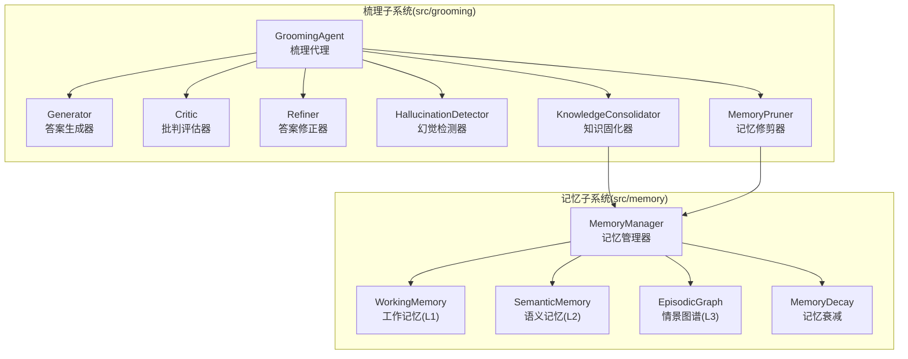
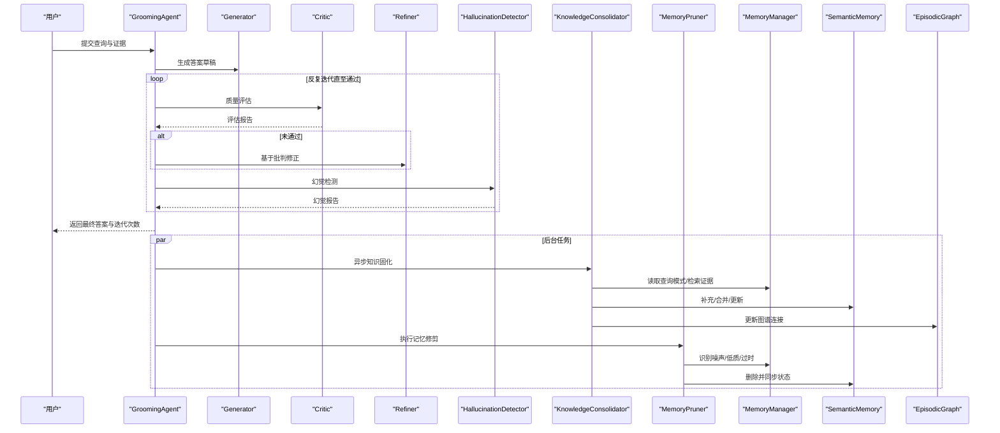
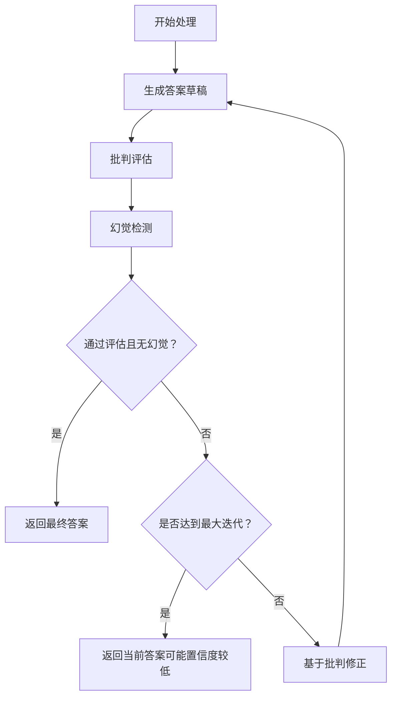
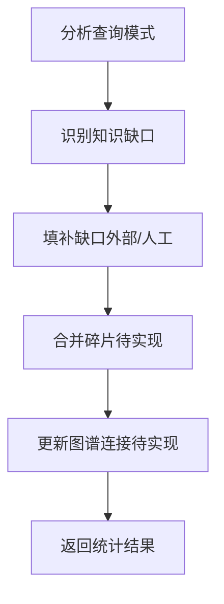
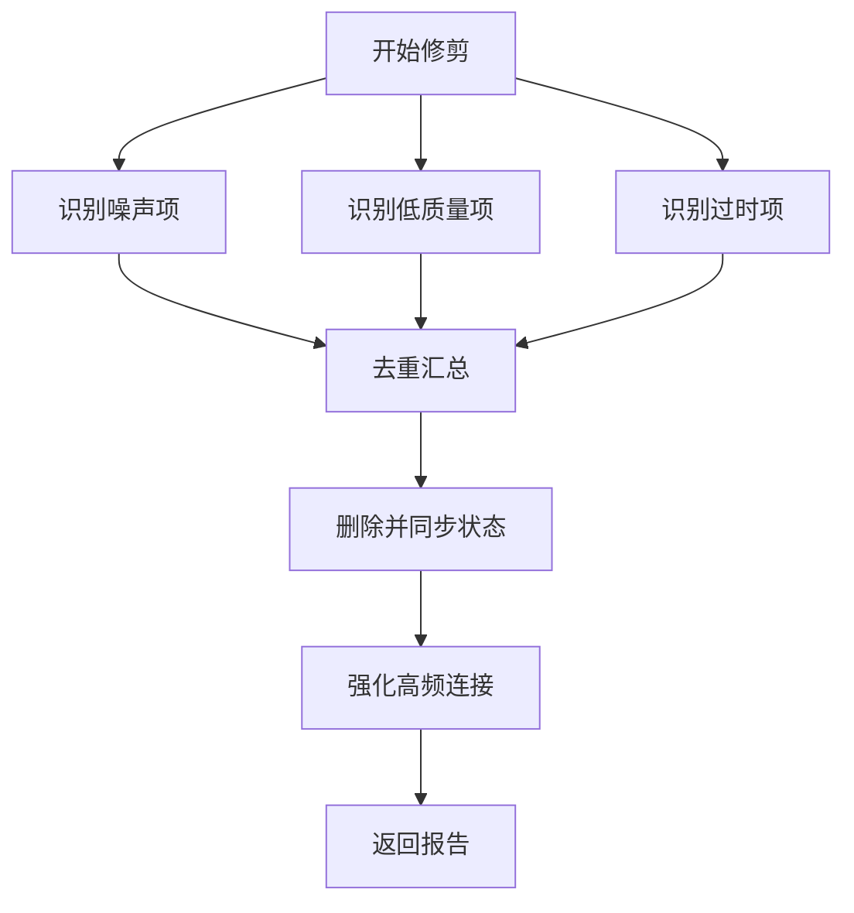
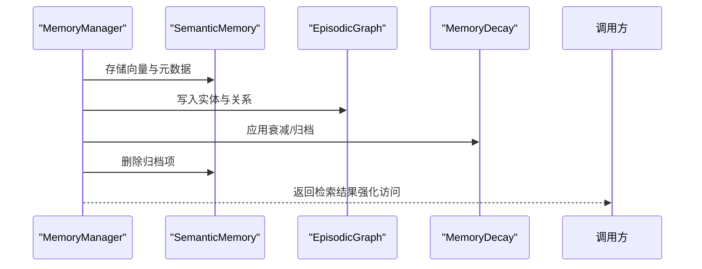
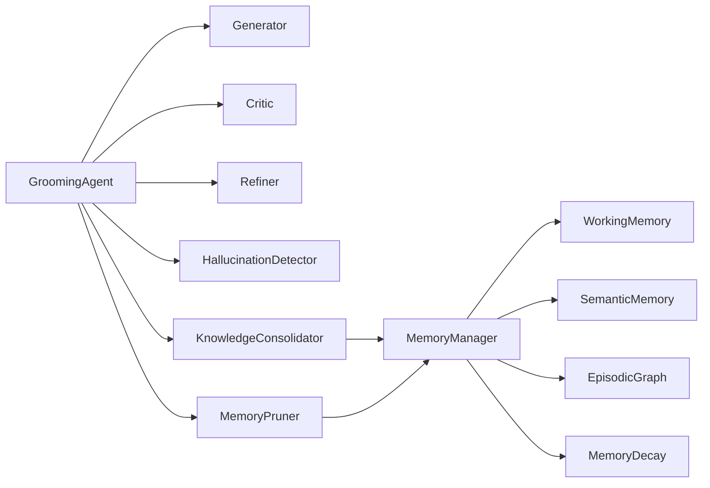

# 知识优化与固化

<cite>
**本文引用的文件**
- [src/grooming/__init__.py](file://src/grooming/__init__.py)
- [src/grooming/agent.py](file://src/grooming/agent.py)
- [src/grooming/generator.py](file://src/grooming/generator.py)
- [src/grooming/critic.py](file://src/grooming/critic.py)
- [src/grooming/refiner.py](file://src/grooming/refiner.py)
- [src/grooming/hallucination.py](file://src/grooming/hallucination.py)
- [src/grooming/consolidator.py](file://src/grooming/consolidator.py)
- [src/grooming/pruner.py](file://src/grooming/pruner.py)
- [src/grooming/models.py](file://src/grooming/models.py)
- [src/memory/manager.py](file://src/memory/manager.py)
- [src/memory/models.py](file://src/memory/models.py)
- [src/memory/semantic_memory.py](file://src/memory/semantic_memory.py)
- [src/memory/episodic_graph.py](file://src/memory/episodic_graph.py)
- [src/memory/working_memory.py](file://src/memory/working_memory.py)
- [src/memory/decay.py](file://src/memory/decay.py)
</cite>

## 目录
1. [简介](#简介)
2. [项目结构](#项目结构)
3. [核心组件](#核心组件)
4. [架构总览](#架构总览)
5. [详细组件分析](#详细组件分析)
6. [依赖关系分析](#依赖关系分析)
7. [性能考虑](#性能考虑)
8. [故障排查指南](#故障排查指南)
9. [结论](#结论)
10. [附录](#附录)

## 简介
本文件面向“知识优化与固化”模块，系统化阐述以下能力：
- 优化器的知识提炼算法：基于查询模式与命中率的缺口识别、知识补充与碎片合并、图谱连接更新。
- 信息压缩策略与冗余去除机制：通过权重衰减、访问强化、过时清理与噪声/低质项剔除，维持知识库的高质量与高时效性。
- 修剪器的记忆管理功能：噪声识别、低质量项识别、过时信息清理、重要连接强化。
- 与记忆层的数据交换与知识固化流程：从工作记忆到语义记忆再到情景图谱的多层协同与衰减驱动的主动遗忘。

## 项目结构
本模块位于 src/grooming 与 src/memory 两大子系统内，前者负责“梳理”闭环（生成-批判-修正-幻觉检测）与“优化”（知识固化、记忆修剪），后者负责三层记忆的统一管理与持久化。

图表来源
- [src/grooming/agent.py:16-151](file://src/grooming/agent.py#L16-L151)
- [src/grooming/consolidator.py:9-142](file://src/grooming/consolidator.py#L9-L142)
- [src/grooming/pruner.py:10-157](file://src/grooming/pruner.py#L10-L157)
- [src/memory/manager.py:16-186](file://src/memory/manager.py#L16-L186)

章节来源
- [src/grooming/__init__.py:1-26](file://src/grooming/__init__.py#L1-L26)
- [src/grooming/agent.py:16-151](file://src/grooming/agent.py#L16-L151)
- [src/memory/manager.py:16-186](file://src/memory/manager.py#L16-L186)

## 核心组件
- 梳理代理（GroomingAgent）：串联生成、批判、修正与幻觉检测，形成闭环；支持异步运行知识固化与记忆修剪。
- 答案生成器（Generator）：基于检索证据生成答案草稿。
- 批判评估器（Critic）：对答案质量进行评分与问题诊断。
- 答案修正器（Refiner）：依据批判意见与可选补充证据修正答案，并调整置信度。
- 幻觉检测器（HallucinationDetector）：从事实一致性、逻辑连贯性、证据支撑度三维度检测幻觉。
- 知识固化器（KnowledgeConsolidator）：分析查询模式，识别知识缺口并补充、合并碎片、更新图谱连接。
- 记忆修剪器（MemoryPruner）：识别噪声、低质量与过时记忆并清理，强化高频访问连接。
- 记忆管理器（MemoryManager）：统一调度 L1/L2/L3 三层记忆，提供存储、检索、巩固与主动遗忘。
- 记忆衰减（MemoryDecay）：基于时间与访问频率的动态权重计算与归档策略。

章节来源
- [src/grooming/agent.py:16-151](file://src/grooming/agent.py#L16-L151)
- [src/grooming/generator.py:9-64](file://src/grooming/generator.py#L9-L64)
- [src/grooming/critic.py:9-72](file://src/grooming/critic.py#L9-L72)
- [src/grooming/refiner.py:8-64](file://src/grooming/refiner.py#L8-L64)
- [src/grooming/hallucination.py:9-154](file://src/grooming/hallucination.py#L9-L154)
- [src/grooming/consolidator.py:9-142](file://src/grooming/consolidator.py#L9-L142)
- [src/grooming/pruner.py:10-157](file://src/grooming/pruner.py#L10-L157)
- [src/memory/manager.py:16-186](file://src/memory/manager.py#L16-L186)
- [src/memory/decay.py:11-155](file://src/memory/decay.py#L11-L155)

## 架构总览
梳理与记忆两大子系统通过 MemoryManager 解耦协作。生成-批判-修正-幻觉检测构成“质量保障闭环”，知识固化与记忆修剪构成“知识健康维护闭环”。记忆层采用三层架构：工作记忆（L1）承载会话上下文与意图轨迹；语义记忆（L2）承载高维向量与检索；情景图谱（L3）承载实体关系与多跳推理。

图表来源
- [src/grooming/agent.py:61-151](file://src/grooming/agent.py#L61-L151)
- [src/grooming/consolidator.py:35-61](file://src/grooming/consolidator.py#L35-L61)
- [src/grooming/pruner.py:41-69](file://src/grooming/pruner.py#L41-L69)
- [src/memory/manager.py:149-186](file://src/memory/manager.py#L149-L186)

## 详细组件分析

### 梳理代理（GroomingAgent）
- 职责：组织生成-批判-修正-幻觉检测的迭代流程；在满足质量与非幻觉条件下输出稳定答案；异步执行知识固化与记忆修剪。
- 关键流程：
  - 生成初始答案
  - 批判评估与幻觉检测
  - 若未通过则修正并降低置信度
  - 达到最大迭代或满足条件后返回
  - 后台任务：先运行知识固化周期，再执行记忆修剪

图表来源
- [src/grooming/agent.py:61-129](file://src/grooming/agent.py#L61-L129)

章节来源
- [src/grooming/agent.py:16-151](file://src/grooming/agent.py#L16-L151)

### 答案生成器（Generator）
- 输入：查询、证据列表、上下文
- 输出：包含内容、引用、置信度的答案草稿
- 策略：当无证据时返回低置信度提示；否则拼接若干证据片段作为基础答案

章节来源
- [src/grooming/generator.py:9-64](file://src/grooming/generator.py#L9-L64)

### 批判评估器（Critic）
- 输入：答案、证据
- 输出：是否有效、问题列表、改进建议、质量评分
- 策略：检查证据支撑、置信度阈值、答案完整性，综合得出质量评分

章节来源
- [src/grooming/critic.py:9-72](file://src/grooming/critic.py#L9-L72)

### 答案修正器（Refiner）
- 输入：原始答案、批判报告、可选补充证据
- 输出：修正后的答案（内容追加、引用扩展、置信度微调）
- 策略：基于批判质量微调置信度，附加证据摘要

章节来源
- [src/grooming/refiner.py:8-64](file://src/grooming/refiner.py#L8-L64)

### 幻觉检测器（HallucinationDetector）
- 输入：答案文本、证据列表
- 输出：幻觉检测报告（事实一致性、逻辑连贯性、证据支撑度、问题列表）
- 策略：事实一致性与证据支撑度低于阈值即判定存在幻觉；逻辑连贯性辅助判断

章节来源
- [src/grooming/hallucination.py:9-154](file://src/grooming/hallucination.py#L9-L154)

### 知识固化器（KnowledgeConsolidator）
- 输入：记忆管理器、最小查询频率阈值
- 输出：固化周期统计（分析的模式数、填补的缺口数等）
- 关键步骤：
  - 分析查询模式（待实现）
  - 识别知识缺口（低命中率且高频率）
  - 填补知识缺口（待实现）
  - 合并碎片（待实现）
  - 更新图谱连接（待实现）

图表来源
- [src/grooming/consolidator.py:35-61](file://src/grooming/consolidator.py#L35-L61)

章节来源
- [src/grooming/consolidator.py:9-142](file://src/grooming/consolidator.py#L9-L142)

### 记忆修剪器（MemoryPruner）
- 输入：记忆管理器、噪声阈值、质量阈值、过时天数
- 输出：修剪报告（移除数量、强化数量、各类别计数）
- 识别策略：
  - 噪声：权重低且访问次数少
  - 低质量：内容过短且权重低
  - 过时：最后访问时间早于阈值日期
- 执行动作：
  - 删除对应记忆并同步内存状态
  - 强化高频访问记忆（权重提升）

图表来源
- [src/grooming/pruner.py:41-69](file://src/grooming/pruner.py#L41-L69)

章节来源
- [src/grooming/pruner.py:10-157](file://src/grooming/pruner.py#L10-L157)

### 记忆管理器（MemoryManager）
- 统一管理三层记忆：工作记忆（L1）、语义记忆（L2）、情景图谱（L3）
- 存储流程：将编码块写入 L2 向量库，同时抽取实体关系写入 L3 图谱，并统一登记到内存存储以供跨层检索
- 检索流程：按层级与向量检索，命中后强化访问并返回记忆项
- 巩固与遗忘：应用衰减、归档低权重记忆；主动遗忘低价值记忆

图表来源
- [src/memory/manager.py:48-147](file://src/memory/manager.py#L48-L147)
- [src/memory/semantic_memory.py:50-118](file://src/memory/semantic_memory.py#L50-L118)
- [src/memory/episodic_graph.py:33-126](file://src/memory/episodic_graph.py#L33-L126)
- [src/memory/decay.py:72-118](file://src/memory/decay.py#L72-L118)

章节来源
- [src/memory/manager.py:16-186](file://src/memory/manager.py#L16-L186)
- [src/memory/models.py:19-67](file://src/memory/models.py#L19-L67)
- [src/memory/semantic_memory.py:21-179](file://src/memory/semantic_memory.py#L21-L179)
- [src/memory/episodic_graph.py:10-194](file://src/memory/episodic_graph.py#L10-L194)
- [src/memory/working_memory.py:11-120](file://src/memory/working_memory.py#L11-L120)
- [src/memory/decay.py:11-155](file://src/memory/decay.py#L11-L155)

### 记忆衰减（MemoryDecay）
- 权重计算：指数衰减 × 访问频率增强，支持批量应用与阈值归档
- 强化：访问时提升权重并更新最近访问时间
- 归档：低于阈值的记忆被标记为归档

章节来源
- [src/memory/decay.py:11-155](file://src/memory/decay.py#L11-L155)

## 依赖关系分析
- 梳理子系统内部：GroomingAgent 依赖 Generator/Critic/Refiner/HallucinationDetector；当传入 MemoryManager 时，自动装配 KnowledgeConsolidator 与 MemoryPruner。
- 记忆子系统内部：MemoryManager 组合 WorkingMemory/SemanticMemory/EpisodicGraph/MemoryDecay；SemanticMemory 与 EpisodicGraph 通过 MemoryManager 的统一存储进行状态同步。
- 数据模型：grooming/models 与 memory/models 定义了通用的数据结构，贯穿梳理与记忆两端。

图表来源
- [src/grooming/agent.py:48-59](file://src/grooming/agent.py#L48-L59)
- [src/grooming/consolidator.py:20-33](file://src/grooming/consolidator.py#L20-L33)
- [src/grooming/pruner.py:20-39](file://src/grooming/pruner.py#L20-L39)
- [src/memory/manager.py:40-46](file://src/memory/manager.py#L40-L46)

章节来源
- [src/grooming/agent.py:48-59](file://src/grooming/agent.py#L48-L59)
- [src/grooming/models.py:9-66](file://src/grooming/models.py#L9-L66)
- [src/memory/models.py:12-67](file://src/memory/models.py#L12-L67)

## 性能考虑
- 检索效率
  - L2 向量检索采用余弦相似度排序，建议在实际部署中集成 HNSW 索引与向量数据库（如 Qdrant/Milvus）以提升 top-k 检索性能。
  - 混合检索（向量+关键词）权重可调，需结合业务场景平衡召回与精度。
- 存储与同步
  - 统一存储（_memory_store）便于跨层检索与状态同步，但需注意在大规模场景下的内存占用与并发一致性。
- 衰减与归档
  - 衰减参数（衰减速率、归档阈值）影响知识留存与系统吞吐；建议按业务活跃度动态调整。
- 修剪策略
  - 噪声/低质/过时阈值需结合真实数据分布校准；过度修剪会丢失潜在有用信息，过少修剪则导致存储膨胀。
- 异步任务
  - 知识固化与记忆修剪建议在后台定时执行，避免阻塞主线程；可设置独立队列与限速策略。

## 故障排查指南
- 答案质量差或频繁迭代
  - 检查证据是否充足与相关；确认批判器阈值与 Refiner 的置信度调整是否合理。
- 幻觉误报或漏报
  - 调整事实一致性与证据支撑度阈值；逐步完善事实一致性与逻辑连贯性检测策略。
- 检索命中率低
  - 分析查询模式与知识缺口，补充缺失主题；优化向量编码与关键词融合策略。
- 存储膨胀或检索变慢
  - 检查归档阈值与修剪参数；确认 SemanticMemory 与 EpisodicGraph 的同步状态；必要时迁移至外部向量/图数据库。
- 主动遗忘效果不明显
  - 校准衰减速率与访问强化因子；确保检索路径中调用了强化逻辑。

章节来源
- [src/grooming/critic.py:25-72](file://src/grooming/critic.py#L25-L72)
- [src/grooming/hallucination.py:34-75](file://src/grooming/hallucination.py#L34-L75)
- [src/grooming/consolidator.py:63-117](file://src/grooming/consolidator.py#L63-L117)
- [src/memory/semantic_memory.py:80-142](file://src/memory/semantic_memory.py#L80-L142)
- [src/memory/decay.py:72-142](file://src/memory/decay.py#L72-L142)

## 结论
本模块通过“生成-批判-修正-幻觉检测”的闭环保障答案质量，借助“知识固化”与“记忆修剪”维持知识库的完整性与高时效性。记忆层以三层架构实现从会话上下文到语义检索再到因果推理的协同。建议在生产环境中结合外部向量/图数据库与动态参数调优，持续评估与迭代优化策略。

## 附录

### 参数配置清单（关键阈值与超参）
- 生成-批判-修正
  - 最大迭代次数、最低置信度
- 幻觉检测
  - 事实一致性阈值、证据支撑度阈值
- 知识固化
  - 最小查询频率阈值
- 记忆修剪
  - 噪声阈值、质量阈值、过时天数
- 记忆衰减
  - 衰减速率、归档阈值、强化因子

章节来源
- [src/grooming/agent.py:27-46](file://src/grooming/agent.py#L27-L46)
- [src/grooming/hallucination.py:19-32](file://src/grooming/hallucination.py#L19-L32)
- [src/grooming/consolidator.py:20-33](file://src/grooming/consolidator.py#L20-L33)
- [src/grooming/pruner.py:20-39](file://src/grooming/pruner.py#L20-L39)
- [src/memory/decay.py:24-37](file://src/memory/decay.py#L24-L37)