# 答案生成器

<cite>
**本文引用的文件**
- [generator.py](file://src/grooming/generator.py)
- [models.py](file://src/grooming/models.py)
- [agent.py](file://src/grooming/agent.py)
- [refiner.py](file://src/grooming/refiner.py)
- [critic.py](file://src/grooming/critic.py)
- [hallucination.py](file://src/grooming/hallucination.py)
- [consolidator.py](file://src/grooming/consolidator.py)
- [pruner.py](file://src/grooming/pruner.py)
- [interface.py](file://src/purr/interface.py)
- [retriever.py](file://src/retrieval/retriever.py)
- [engine.py](file://src/whiskers/engine.py)
- [manager.py](file://src/memory/manager.py)
- [models.py](file://src/memory/models.py)
- [example_usage.py](file://example/example_usage.py)
</cite>

## 目录
1. [简介](#简介)
2. [项目结构](#项目结构)
3. [核心组件](#核心组件)
4. [架构总览](#架构总览)
5. [详细组件分析](#详细组件分析)
6. [依赖关系分析](#依赖关系分析)
7. [性能考虑](#性能考虑)
8. [故障排查指南](#故障排查指南)
9. [结论](#结论)
10. [附录](#附录)

## 简介
本技术文档聚焦“答案生成器”的实现与使用，围绕以下目标展开：
- 深入解释生成器的核心算法实现，包括提示工程策略、上下文整合机制、生成参数配置
- 详细说明思维链生成过程、多轮对话处理、输出格式控制
- 提供生成器初始化配置、参数调优技巧、性能优化建议
- 解释与检索结果的集成方式和数据流转过程

答案生成器位于“梳理”（Grooming）子系统中，负责基于检索证据生成最终答案，并通过批判评估与幻觉检测形成闭环，结合修正器进行迭代优化。同时，交互层（Purr）提供情境自适应输出与思维链可视化，便于用户理解生成过程。

## 项目结构
本项目采用模块化设计，答案生成器位于 grooming 子系统，与检索、记忆、交互等模块协同工作。关键目录与职责如下：
- src/grooming：答案生成、批判评估、幻觉检测、修正、知识固化与修剪等
- src/retrieval：检索与重排序、HyDE 增强、融合策略、扑击控制
- src/memory：三层记忆统一管理（工作记忆、语义记忆、情景图谱）
- src/purr：交互接口，负责语气、详细程度适配与思维链可视化
- src/whiskers：文档解析、分块、向量化与情境标记
- example：完整工作流示例

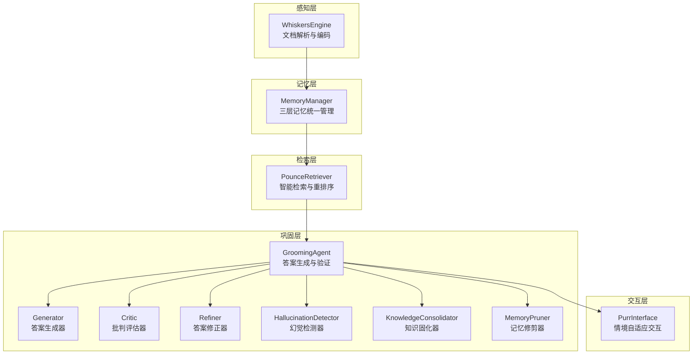

图表来源
- [engine.py:14-130](file://src/whiskers/engine.py#L14-L130)
- [manager.py:16-186](file://src/memory/manager.py#L16-L186)
- [retriever.py:108-336](file://src/retrieval/retriever.py#L108-L336)
- [agent.py:16-151](file://src/grooming/agent.py#L16-L151)
- [generator.py:9-64](file://src/grooming/generator.py#L9-L64)
- [critic.py:9-72](file://src/grooming/critic.py#L9-L72)
- [refiner.py:8-64](file://src/grooming/refiner.py#L8-L64)
- [hallucination.py:9-154](file://src/grooming/hallucination.py#L9-L154)
- [consolidator.py:9-142](file://src/grooming/consolidator.py#L9-L142)
- [pruner.py:10-157](file://src/grooming/pruner.py#L10-L157)
- [interface.py:16-224](file://src/purr/interface.py#L16-L224)

章节来源
- [engine.py:14-130](file://src/whiskers/engine.py#L14-L130)
- [manager.py:16-186](file://src/memory/manager.py#L16-L186)
- [retriever.py:108-336](file://src/retrieval/retriever.py#L108-L336)
- [agent.py:16-151](file://src/grooming/agent.py#L16-L151)

## 核心组件
- 答案生成器（Generator）：基于检索证据生成答案，当前实现为证据拼接与简单置信度设定
- 批判评估器（Critic）：评估答案质量，产出质量评分与改进建议
- 幻觉检测器（HallucinationDetector）：检测事实一致性、逻辑连贯性与证据支撑度
- 答案修正器（Refiner）：根据批判意见修正答案并调整置信度
- 梳理代理（GroomingAgent）：串联生成、评估、修正与检测，形成闭环
- 交互接口（PurrInterface）：情境自适应输出、思维链可视化、用户偏好分析
- 检索器（PounceRetriever）：多路检索、融合、重排序与扑击控制
- 记忆管理器（MemoryManager）：三层记忆统一存储与检索

章节来源
- [generator.py:9-64](file://src/grooming/generator.py#L9-L64)
- [critic.py:9-72](file://src/grooming/critic.py#L9-L72)
- [hallucination.py:9-154](file://src/grooming/hallucination.py#L9-L154)
- [refiner.py:8-64](file://src/grooming/refiner.py#L8-L64)
- [agent.py:16-151](file://src/grooming/agent.py#L16-L151)
- [interface.py:16-224](file://src/purr/interface.py#L16-L224)
- [retriever.py:108-336](file://src/retrieval/retriever.py#L108-L336)
- [manager.py:16-186](file://src/memory/manager.py#L16-L186)

## 架构总览
答案生成器在整体系统中的位置与数据流如下：
- WhiskersEngine 将文档编码为向量与情境标签，MemoryManager 存储至语义记忆
- PounceRetriever 从语义记忆检索并融合重排，得到证据列表
- GroomingAgent 调用 Generator 生成答案，再经 Critic 评估与 HallucinationDetector 检测，必要时由 Refiner 修正
- PurrInterface 对最终答案进行语气与详细程度适配，并生成思维链可视化

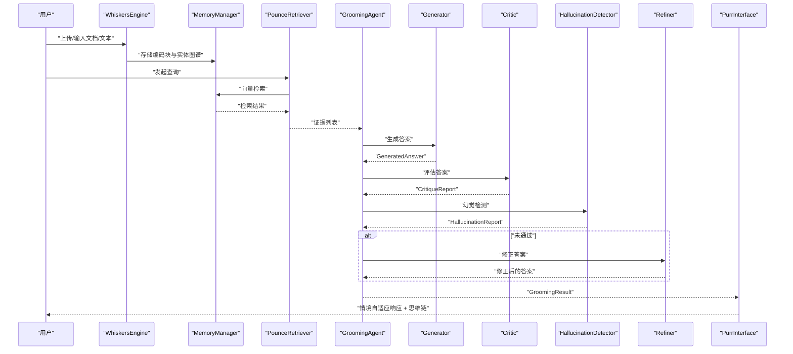

图表来源
- [engine.py:14-130](file://src/whiskers/engine.py#L14-L130)
- [manager.py:16-186](file://src/memory/manager.py#L16-L186)
- [retriever.py:108-336](file://src/retrieval/retriever.py#L108-L336)
- [agent.py:61-128](file://src/grooming/agent.py#L61-L128)
- [generator.py:25-63](file://src/grooming/generator.py#L25-L63)
- [critic.py:25-71](file://src/grooming/critic.py#L25-L71)
- [hallucination.py:34-75](file://src/grooming/hallucination.py#L34-L75)
- [refiner.py:24-63](file://src/grooming/refiner.py#L24-L63)
- [interface.py:55-132](file://src/purr/interface.py#L55-L132)

## 详细组件分析

### 答案生成器（Generator）
- 职责：基于检索证据生成答案，当前实现为证据拼接与简单置信度设定
- 输入：查询文本、证据列表、上下文字典
- 输出：GeneratedAnswer（包含内容、引用、置信度与元数据）
- 关键点：
  - 当证据为空时返回兜底内容与零置信度
  - 最多使用前若干条证据，截取部分内容并编号
  - 置信度与证据数量相关，证据越多置信度越高

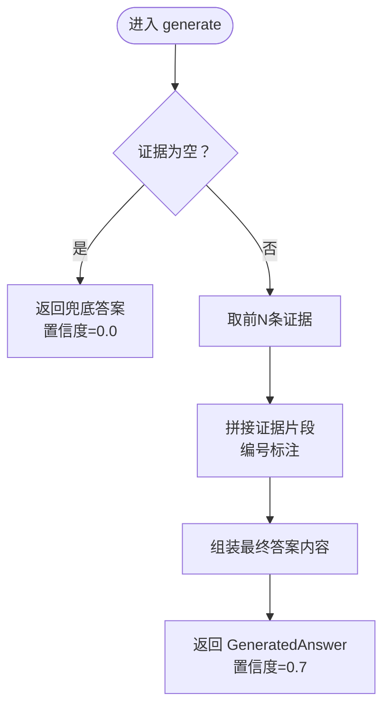

图表来源
- [generator.py:25-63](file://src/grooming/generator.py#L25-L63)

章节来源
- [generator.py:9-64](file://src/grooming/generator.py#L9-L64)

### 批判评估器（Critic）
- 职责：评估答案质量，产出质量评分与改进建议
- 评估维度：
  - 是否有证据支撑（无则扣分）
  - 置信度阈值（过低则扣分）
  - 答案完整性（过短则扣分）
- 输出：CritiqueReport（是否有效、问题列表、建议、质量评分）

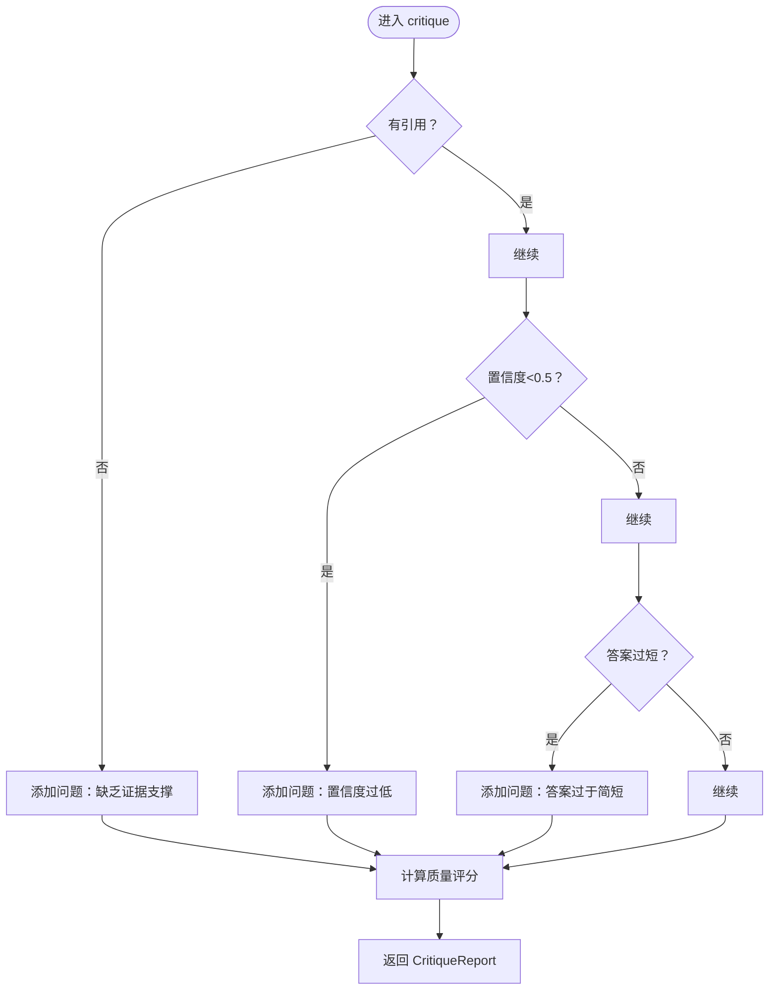

图表来源
- [critic.py:25-71](file://src/grooming/critic.py#L25-L71)

章节来源
- [critic.py:9-72](file://src/grooming/critic.py#L9-L72)

### 幻觉检测器（HallucinationDetector）
- 职责：检测事实一致性、逻辑连贯性与证据支撑度
- 指标阈值：可通过构造函数配置
- 检测方法（当前最小实现）：
  - 事实一致性：基于关键词重叠比例
  - 逻辑连贯性：基于长度与逻辑连接词
  - 证据支撑度：基于证据数量
- 输出：HallucinationReport（是否幻觉、各项分数、问题列表）

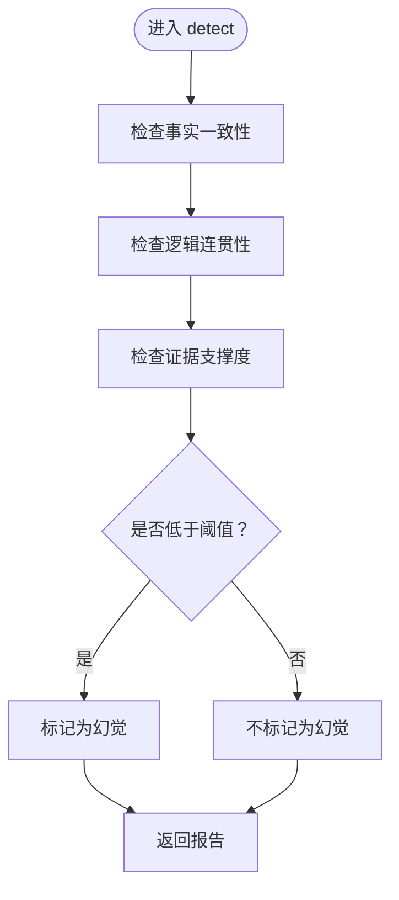

图表来源
- [hallucination.py:34-75](file://src/grooming/hallucination.py#L34-L75)
- [hallucination.py:77-153](file://src/grooming/hallucination.py#L77-L153)

章节来源
- [hallucination.py:9-154](file://src/grooming/hallucination.py#L9-L154)

### 答案修正器（Refiner）
- 职责：根据批判报告修正答案，调整置信度
- 修正策略（当前最小实现）：
  - 追加补充证据
  - 基于质量评分微调置信度（高分提升，低分降低）
  - 标记修正元数据与引用扩展

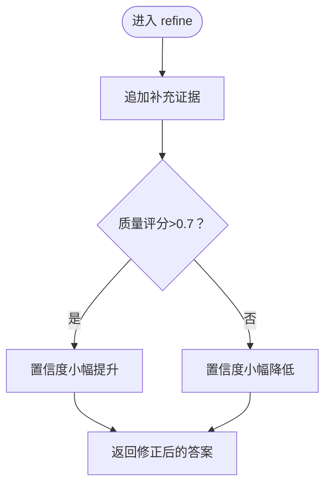

图表来源
- [refiner.py:24-63](file://src/grooming/refiner.py#L24-L63)

章节来源
- [refiner.py:8-64](file://src/grooming/refiner.py#L8-L64)

### 梳理代理（GroomingAgent）
- 职责：串联生成、评估、修正与检测，形成闭环；支持异步知识固化与修剪
- 控制流：
  - 生成初始答案
  - 批判评估与幻觉检测
  - 若未通过，修正答案并循环，直至满足条件或达到最大迭代次数
  - 返回 GroomingResult（包含答案、置信度、引用、迭代次数与幻觉报告）

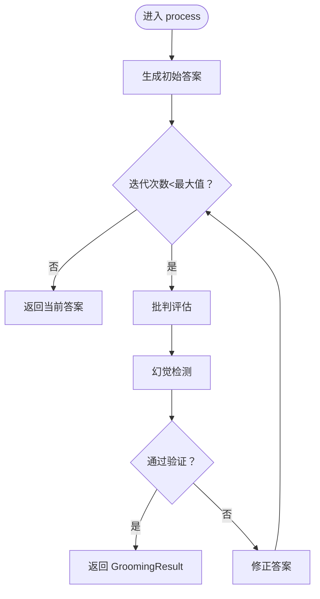

图表来源
- [agent.py:61-128](file://src/grooming/agent.py#L61-L128)

章节来源
- [agent.py:16-151](file://src/grooming/agent.py#L16-L151)

### 交互接口（PurrInterface）
- 职责：情境自适应生成、用户画像适配、思维链可视化、多模态输出
- 关键流程：
  - 获取用户画像，确定语气与详细程度
  - 对答案进行语气与详细程度适配
  - 生成思维链可视化（检索路径、证据来源、推理过程）
  - 更新用户画像

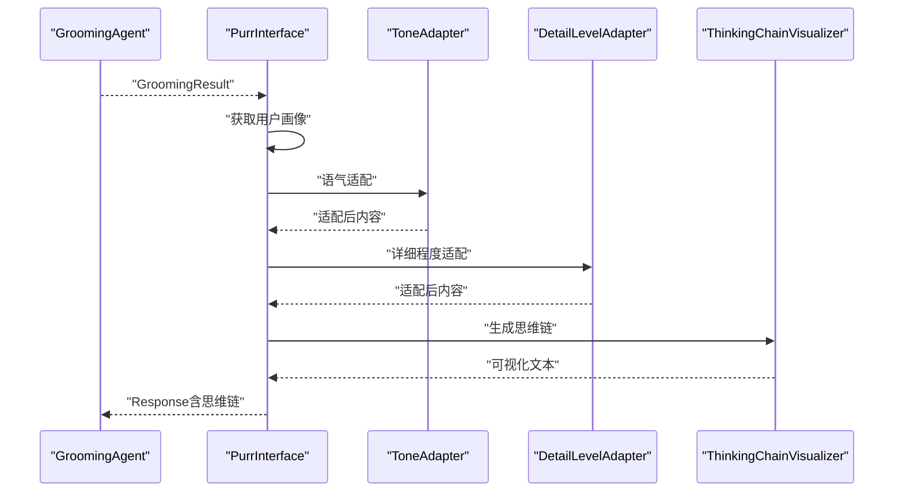

图表来源
- [interface.py:55-132](file://src/purr/interface.py#L55-L132)
- [interface.py:167-211](file://src/purr/interface.py#L167-L211)

章节来源
- [interface.py:16-224](file://src/purr/interface.py#L16-L224)

### 检索器（PounceRetriever）
- 职责：多路检索、融合、重排序与扑击控制
- 关键能力：
  - 向量检索、图谱检索（占位）
  - 结果融合（RRF）、重排序（reranker）
  - 扑击控制：基于置信度阈值与边际收益判断是否提前返回
- 输出：检索结果列表（含内容、分数、来源、检索路径）

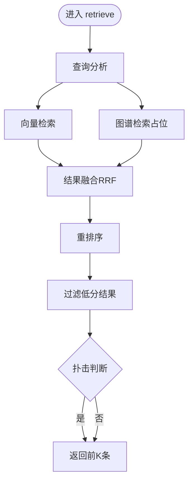

图表来源
- [retriever.py:140-201](file://src/retrieval/retriever.py#L140-L201)
- [retriever.py:270-335](file://src/retrieval/retriever.py#L270-L335)

章节来源
- [retriever.py:108-336](file://src/retrieval/retriever.py#L108-L336)

### 记忆管理器（MemoryManager）
- 职责：统一管理三层记忆（工作记忆、语义记忆、情景图谱），提供存储与检索接口
- 关键流程：
  - 存储：编码块写入语义记忆，实体写入图谱
  - 检索：基于向量在语义层检索，结合衰减强化访问
  - 巩固与主动遗忘：应用衰减、归档低权重记忆

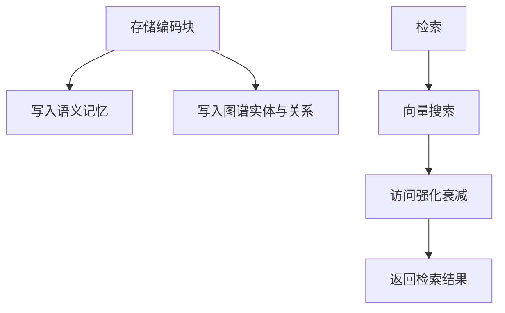

图表来源
- [manager.py:48-112](file://src/memory/manager.py#L48-L112)
- [manager.py:114-147](file://src/memory/manager.py#L114-L147)
- [manager.py:149-185](file://src/memory/manager.py#L149-L185)

章节来源
- [manager.py:16-186](file://src/memory/manager.py#L16-L186)
- [models.py:19-67](file://src/memory/models.py#L19-L67)

## 依赖关系分析
- 组件耦合：
  - GroomingAgent 依赖 Generator、Critic、Refiner、HallucinationDetector、KnowledgeConsolidator、MemoryPruner
  - PurrInterface 依赖 MemoryManager、ToneAdapter、DetailLevelAdapter、ThinkingChainVisualizer
  - PounceRetriever 依赖 MemoryManager、ReRanker、FusionStrategy、HyDEEnhancer
  - WhiskersEngine 依赖 Parser、Chunker、Tagger、VectorEncoder
- 外部依赖：
  - 向量化模型（如 BGE-M3、BGE-Reranker-v2）
  - 存储后端（Redis/Qdrant/Neo4j，当前示例中以内存为主）

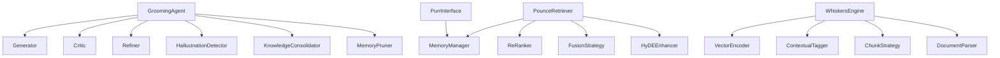

图表来源
- [agent.py:48-59](file://src/grooming/agent.py#L48-L59)
- [interface.py:46-50](file://src/purr/interface.py#L46-L50)
- [retriever.py:115-135](file://src/retrieval/retriever.py#L115-L135)
- [engine.py:21-41](file://src/whiskers/engine.py#L21-L41)

章节来源
- [agent.py:16-151](file://src/grooming/agent.py#L16-L151)
- [interface.py:16-224](file://src/purr/interface.py#L16-L224)
- [retriever.py:108-336](file://src/retrieval/retriever.py#L108-L336)
- [engine.py:14-130](file://src/whiskers/engine.py#L14-L130)

## 性能考虑
- 检索阶段：
  - 合理设置 top_k 与最小分数阈值，避免过多候选导致后续重排序开销增大
  - 使用扑击控制在高置信度时提前返回，减少不必要的重排序与过滤
- 生成阶段：
  - 证据数量与长度直接影响生成成本与置信度，建议限制每轮使用的证据条数与长度
  - 置信度阈值与最大迭代次数需平衡质量与延迟
- 记忆与存储：
  - 利用记忆衰减与主动遗忘降低存储压力，定期执行巩固与修剪
- 交互适配：
  - 语气与详细程度适配应尽量轻量，避免额外的 LLM 推理开销

## 故障排查指南
- 生成答案为空或置信度为 0：
  - 检查检索阶段是否返回了有效证据
  - 确认 MemoryManager 是否正确存储与检索
- 批判评估频繁提出“缺乏证据支撑”：
  - 确保检索结果被正确传递给生成器
  - 检查引用生成逻辑与证据匹配
- 幻觉检测频繁触发：
  - 调整事实一致性与证据支撑度阈值
  - 增加高质量证据来源或引入更严格的证据筛选
- 修正器未生效：
  - 检查批判报告的质量评分与问题列表
  - 确认修正器是否正确读取并应用建议
- 交互层思维链缺失：
  - 确认 GroomingResult 中是否包含 citations 与 hallucination_report
  - 检查可视化组件是否正确接收参数

章节来源
- [generator.py:44-63](file://src/grooming/generator.py#L44-L63)
- [critic.py:42-71](file://src/grooming/critic.py#L42-L71)
- [hallucination.py:34-75](file://src/grooming/hallucination.py#L34-L75)
- [refiner.py:24-63](file://src/grooming/refiner.py#L24-L63)
- [interface.py:167-211](file://src/purr/interface.py#L167-L211)

## 结论
答案生成器作为 NecoRAG 梳理子系统的核心，当前实现了基于证据的最小可行生成与闭环验证。通过与检索、记忆、交互模块的协同，形成了从感知到输出的完整链路。建议在后续版本中：
- 将生成器替换为真正的 LLM 驱动，实现提示工程与上下文整合
- 引入多轮对话状态管理与上下文压缩策略
- 优化思维链生成与可视化，增强可解释性
- 加强幻觉检测与批判评估的智能化程度
- 在生成参数与迭代策略上引入动态调优机制

## 附录
- 初始化配置要点
  - 生成器：llm_model 名称、证据上限与长度截取
  - 批判评估器：置信度阈值、完整性阈值
  - 幻觉检测器：事实一致性、逻辑连贯性、证据支撑度阈值
  - 修正器：质量评分阈值、置信度调整幅度
  - 梳理代理：最大迭代次数、最低置信度
  - 交互接口：默认语气、默认详细程度、用户画像更新策略
- 参数调优建议
  - 证据条数：建议 3~5 条，兼顾质量与性能
  - 置信度阈值：0.7 为常见起点，结合业务场景微调
  - 迭代次数：2~4 次，避免过度迭代导致延迟
  - 投喂策略：在生成提示中明确要求引用编号与来源
- 数据流转参考
  - 示例脚本展示了从 WhiskersEngine 到 PurrInterface 的完整流程，可作为集成参考

章节来源
- [example_usage.py:139-173](file://example/example_usage.py#L139-L173)
- [example_usage.py:176-215](file://example/example_usage.py#L176-L215)