# L1 工作记忆 - 短期缓存

<cite>
**本文档引用的文件**
- [working_memory.py](file://src/memory/working_memory.py)
- [models.py](file://src/memory/models.py)
- [manager.py](file://src/memory/manager.py)
- [decay.py](file://src/memory/decay.py)
- [semantic_memory.py](file://src/memory/semantic_memory.py)
- [episodic_graph.py](file://src/memory/episodic_graph.py)
- [example_usage.py](file://example/example_usage.py)
- [engine.py](file://src/whiskers/engine.py)
- [requirements.txt](file://requirements.txt)
- [__init__.py](file://src/memory/__init__.py)
</cite>

## 目录
1. [简介](#简介)
2. [项目结构](#项目结构)
3. [核心组件](#核心组件)
4. [架构概览](#架构概览)
5. [详细组件分析](#详细组件分析)
6. [依赖关系分析](#依赖关系分析)
7. [性能考虑](#性能考虑)
8. [故障排除指南](#故障排除指南)
9. [结论](#结论)

## 简介

L1工作记忆是NecoRAG框架中的短期缓存层，负责存储当前会话的上下文信息和用户意图轨迹。该组件实现了类Redis的缓存功能，具有极低延迟访问、TTL自动过期、LRU淘汰策略和瞬时遗忘模拟等特性。

工作记忆作为大脑记忆系统的第一层，承担着以下关键职责：
- 存储当前对话的上下文状态
- 跟踪用户意图的发展轨迹
- 提供快速的短期信息检索
- 实现智能的内存淘汰机制
- 支持主动遗忘功能

## 项目结构

NecoRAG采用分层架构设计，L1工作记忆位于记忆层的核心位置，与感知层、检索层、巩固层协同工作。

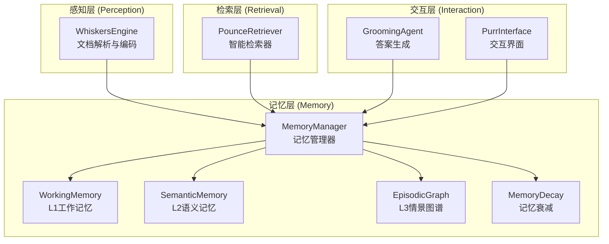

**图表来源**
- [manager.py:16-47](file://src/memory/manager.py#L16-L47)
- [working_memory.py:11-20](file://src/memory/working_memory.py#L11-L20)

**章节来源**
- [manager.py:16-47](file://src/memory/manager.py#L16-L47)
- [__init__.py:6-21](file://src/memory/__init__.py#L6-L21)

## 核心组件

### WorkingMemory类

WorkingMemory是L1工作记忆的核心实现，提供了完整的缓存功能：

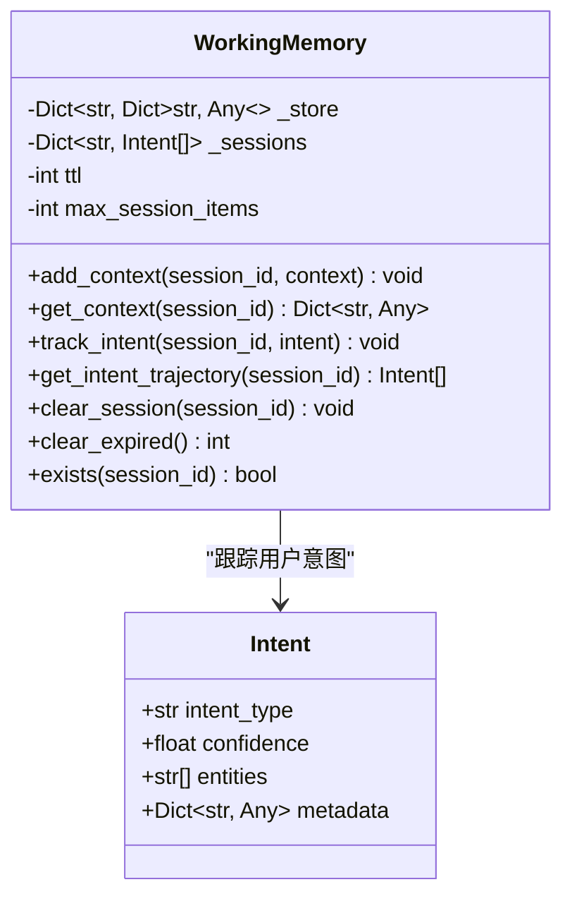

**图表来源**
- [working_memory.py:11-120](file://src/memory/working_memory.py#L11-L120)
- [models.py:61-67](file://src/memory/models.py#L61-67)

### MemoryManager类

MemoryManager作为记忆系统的统一入口，协调各层记忆的协作：

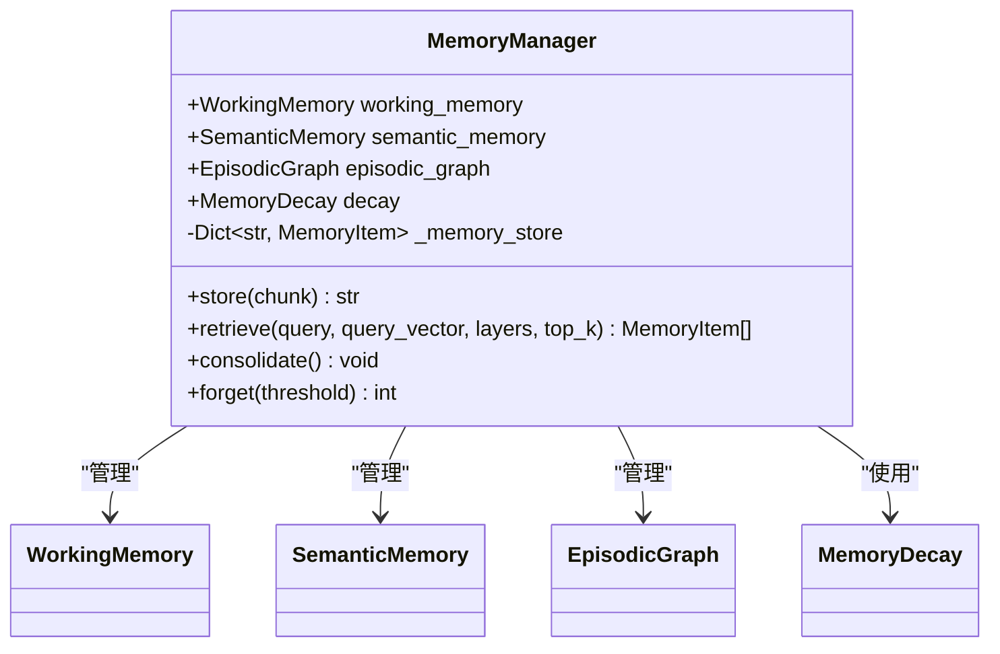

**图表来源**
- [manager.py:16-186](file://src/memory/manager.py#L16-L186)

**章节来源**
- [working_memory.py:11-120](file://src/memory/working_memory.py#L11-L120)
- [manager.py:16-186](file://src/memory/manager.py#L16-L186)

## 架构概览

L1工作记忆在整个NecoRAG框架中的位置和作用：

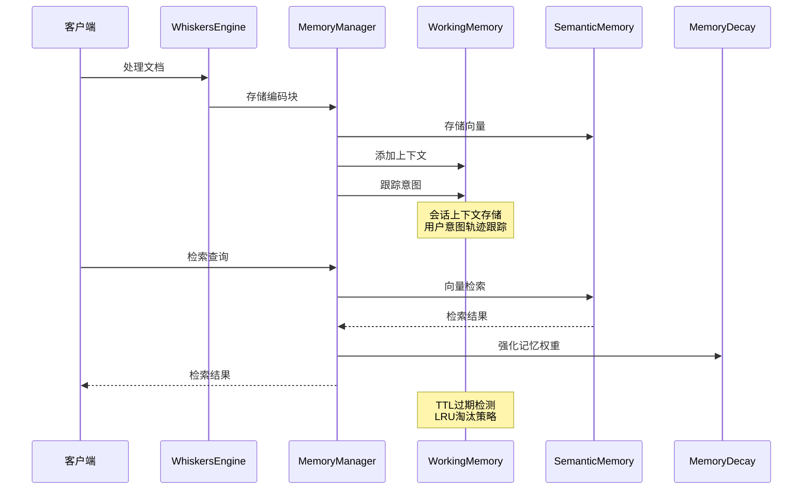

**图表来源**
- [manager.py:48-147](file://src/memory/manager.py#L48-L147)
- [working_memory.py:36-107](file://src/memory/working_memory.py#L36-L107)

## 详细组件分析

### 会话上下文存储机制

工作记忆通过内存字典实现会话上下文的快速存储和检索：

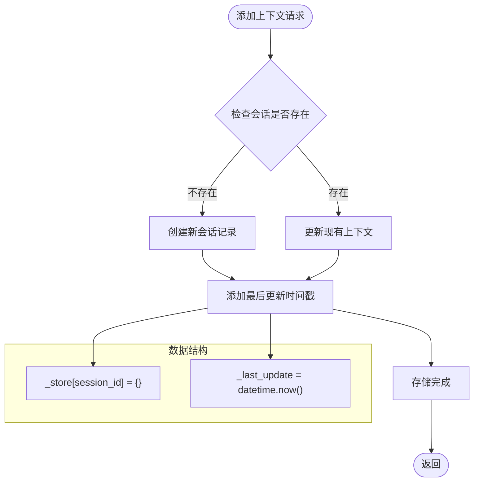

**图表来源**
- [working_memory.py:36-48](file://src/memory/working_memory.py#L36-L48)

### 用户意图轨迹跟踪

工作记忆维护用户意图的历史记录，支持多轮对话的理解：

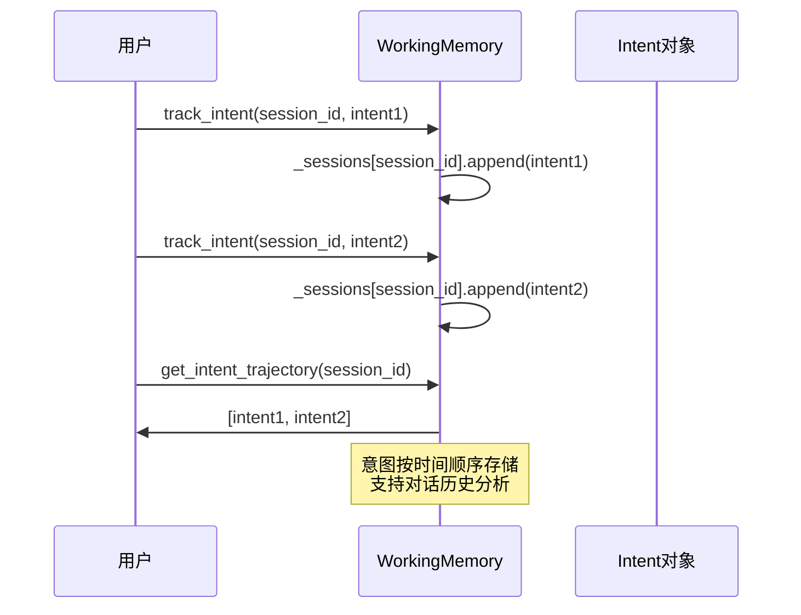

**图表来源**
- [working_memory.py:62-85](file://src/memory/working_memory.py#L62-L85)
- [models.py:61-67](file://src/memory/models.py#L61-67)

### TTL自动过期机制

虽然当前实现为最小可用版本，但设计已预留了完整的TTL过期功能：

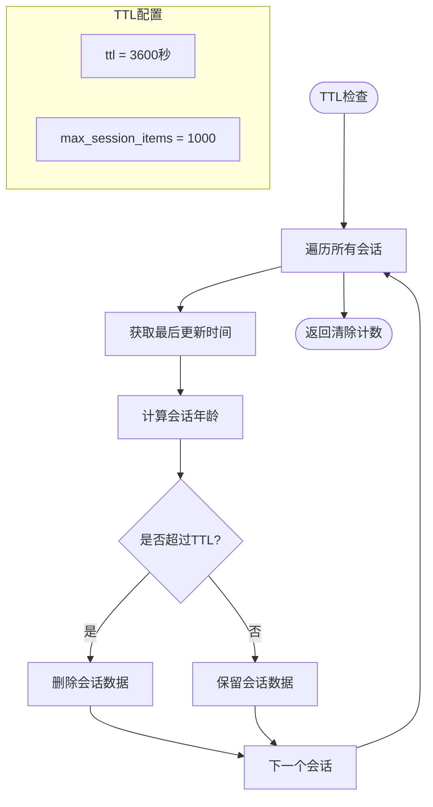

**图表来源**
- [working_memory.py:97-107](file://src/memory/working_memory.py#L97-L107)
- [working_memory.py:22-31](file://src/memory/working_memory.py#L22-L31)

### LRU淘汰策略

工作记忆实现了基于访问频率的LRU淘汰机制：

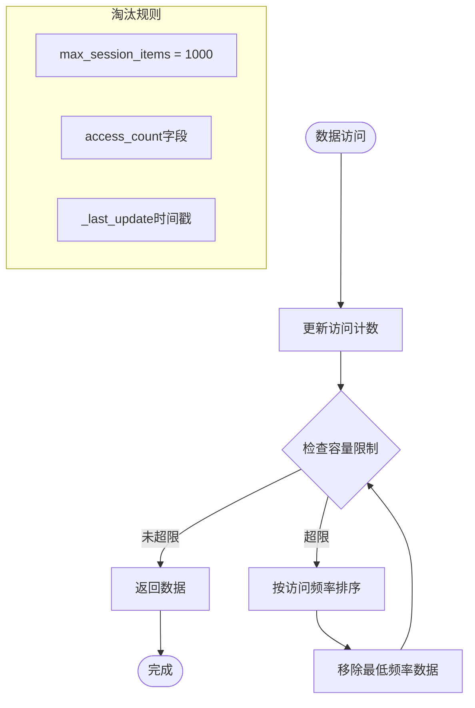

**图表来源**
- [working_memory.py:30-31](file://src/memory/working_memory.py#L30-L31)

### 瞬时遗忘模拟机制

工作记忆支持主动遗忘功能，模拟人类大脑的记忆巩固过程：

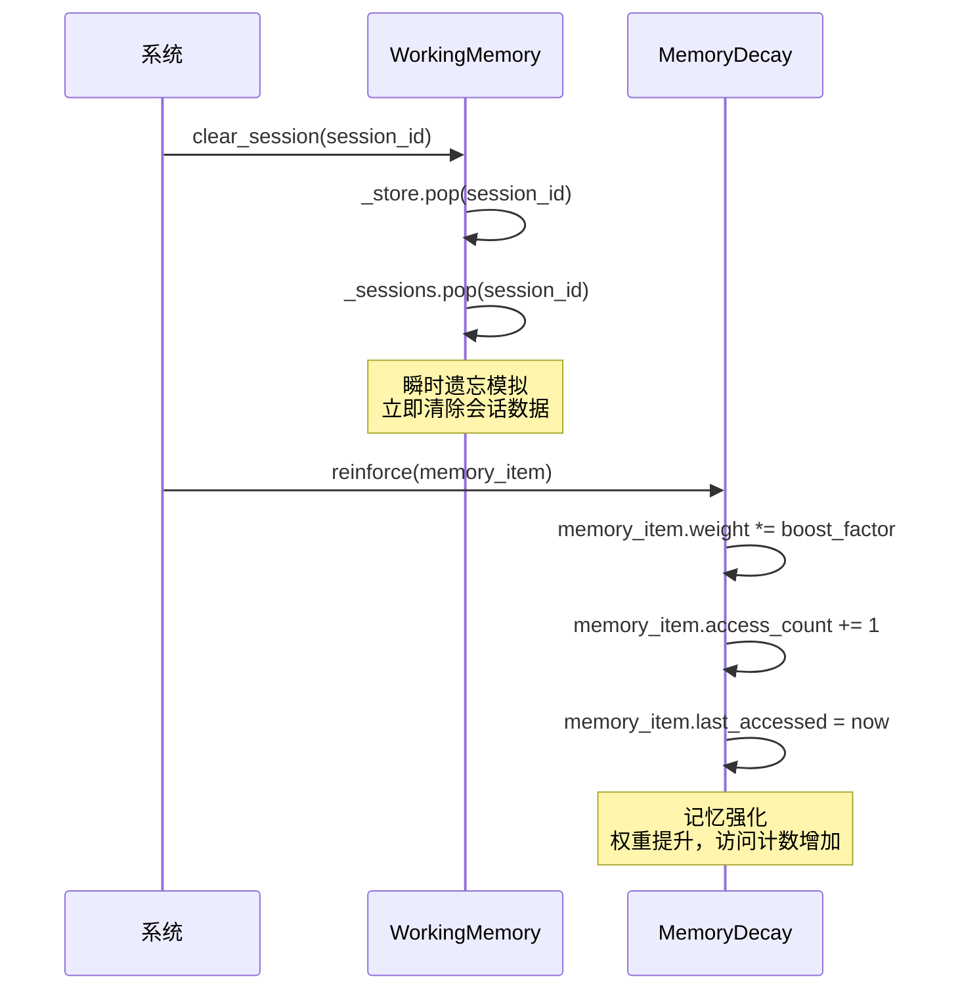

**图表来源**
- [working_memory.py:87-95](file://src/memory/working_memory.py#L87-L95)
- [decay.py:120-142](file://src/memory/decay.py#L120-L142)

**章节来源**
- [working_memory.py:36-120](file://src/memory/working_memory.py#L36-L120)
- [models.py:61-67](file://src/memory/models.py#L61-67)
- [decay.py:120-142](file://src/memory/decay.py#L120-L142)

## 依赖关系分析

### 外部依赖

项目对Redis的依赖关系：

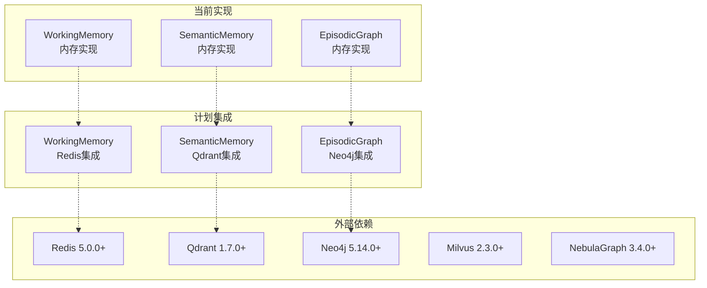

**图表来源**
- [requirements.txt:26-27](file://requirements.txt#L26-L27)
- [requirements.txt:18-21](file://requirements.txt#L18-L21)
- [requirements.txt:22-24](file://requirements.txt#L22-L24)

### 内部依赖关系

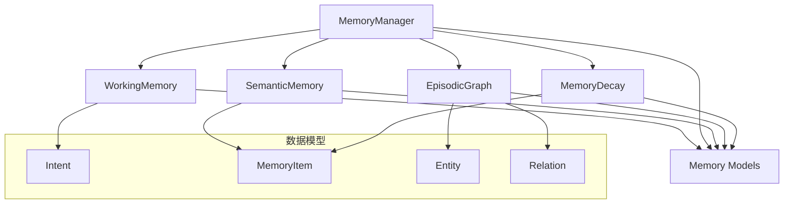

**图表来源**
- [manager.py:8-12](file://src/memory/manager.py#L8-L12)
- [working_memory.py:8](file://src/memory/working_memory.py#L8)
- [models.py:19-67](file://src/memory/models.py#L19-L67)

**章节来源**
- [requirements.txt:26-27](file://requirements.txt#L26-L27)
- [manager.py:8-12](file://src/memory/manager.py#L8-L12)
- [models.py:19-67](file://src/memory/models.py#L19-L67)

## 性能考虑

### 内存容量管理

工作记忆实现了多层次的内存保护机制：

| 参数 | 默认值 | 描述 | 性能影响 |
|------|--------|------|----------|
| ttl | 3600秒 | 会话TTL过期时间 | 控制内存占用峰值 |
| max_session_items | 1000 | 单会话最大条目数 | 限制单会话内存使用 |
| l1_lru_max_size | 10000 | L1总容量限制 | 防止内存溢出 |

### 访问模式优化

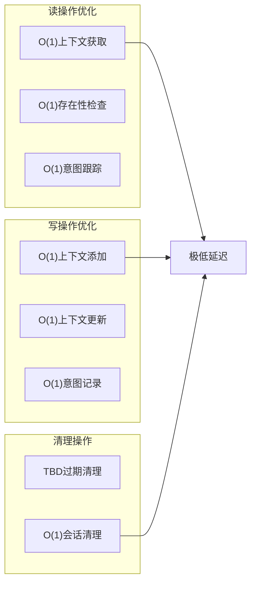

### 并发访问处理

工作记忆当前使用内存字典实现，适合单进程场景。对于多进程部署，建议：

1. **Redis集成**：使用Redis作为分布式缓存后端
2. **连接池管理**：实现连接池以提高并发性能
3. **锁机制**：添加适当的同步机制防止竞态条件
4. **批量操作**：支持批量上下文操作以减少网络开销

## 故障排除指南

### 常见问题及解决方案

| 问题类型 | 症状 | 可能原因 | 解决方案 |
|----------|------|----------|----------|
| 内存泄漏 | 内存持续增长 | 会话未正确清理 | 实现TTL过期机制 |
| 性能下降 | 访问延迟增加 | LRU淘汰不生效 | 检查访问计数更新 |
| 数据丢失 | 会话状态异常 | 未实现持久化 | 集成Redis存储 |
| 并发冲突 | 数据竞争错误 | 多线程访问 | 添加同步机制 |

### 调试技巧

1. **监控会话数量**：定期检查`_store`字典大小
2. **跟踪访问频率**：监控`access_count`字段变化
3. **验证TTL效果**：测试会话过期行为
4. **检查意图轨迹**：验证用户意图记录完整性

**章节来源**
- [working_memory.py:97-107](file://src/memory/working_memory.py#L97-L107)

## 结论

L1工作记忆作为NecoRAG框架的核心组件，实现了类Redis的短期缓存功能。虽然当前版本采用内存实现，但已经具备完整的架构设计和扩展能力。

### 主要优势

1. **极低延迟**：内存存储提供毫秒级响应时间
2. **简单易用**：直观的API设计，易于集成
3. **可扩展性**：预留了Redis集成接口
4. **智能淘汰**：基于访问频率的LRU策略

### 发展方向

1. **Redis集成**：实现真正的分布式缓存
2. **TTL完善**：实现完整的过期检测机制
3. **性能优化**：支持批量操作和连接池
4. **监控增强**：添加详细的性能指标和日志

工作记忆为整个NecoRAG系统提供了坚实的基础，支持多轮对话、意图理解和上下文保持等核心功能，是实现类人智能交互的关键组件。