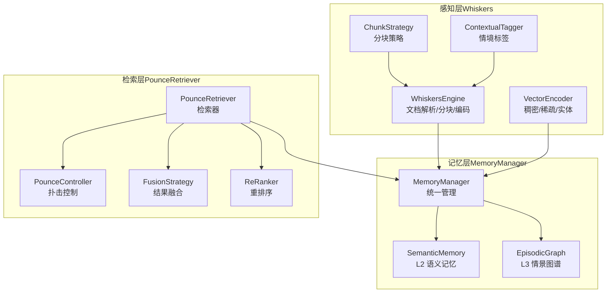
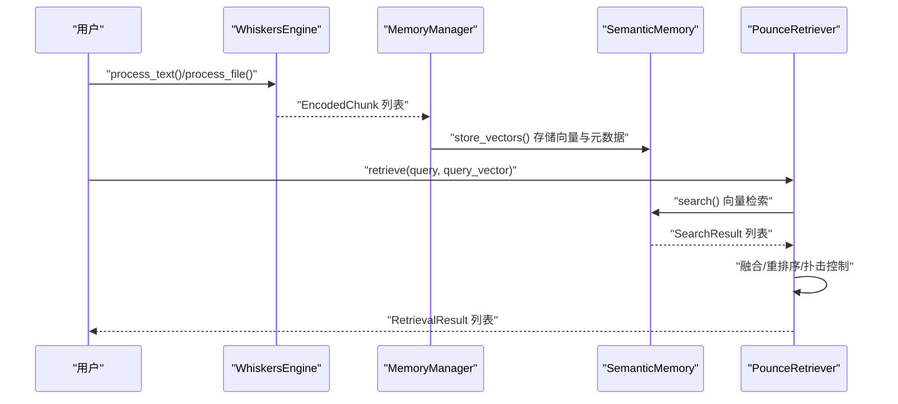
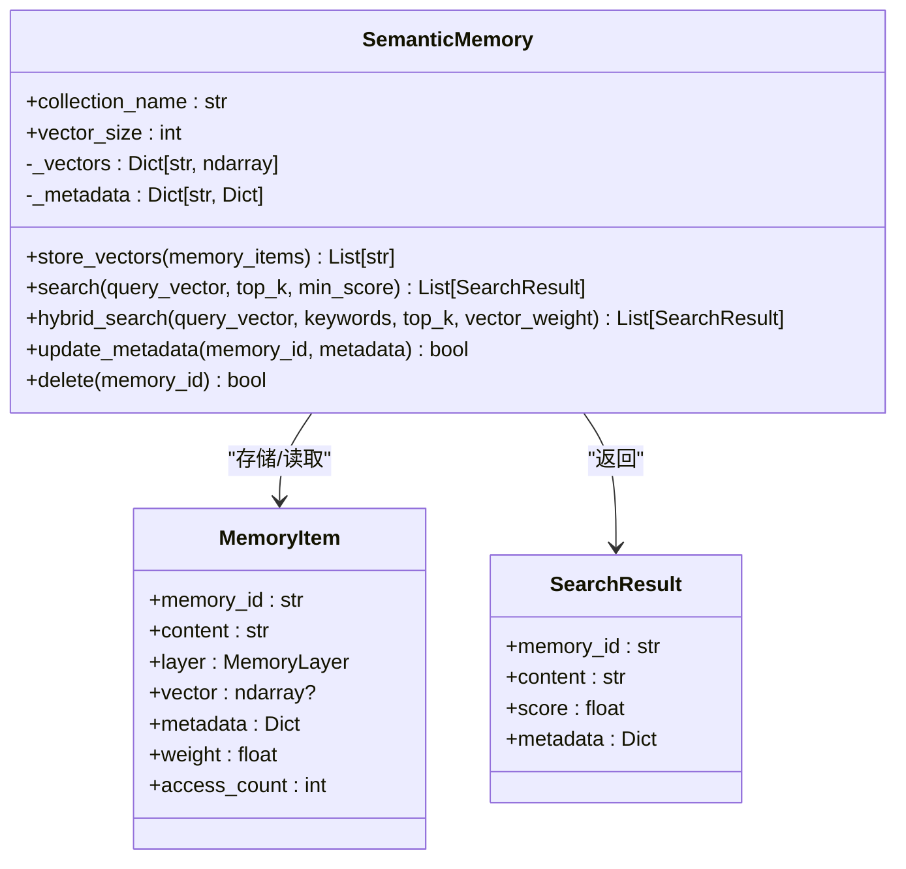
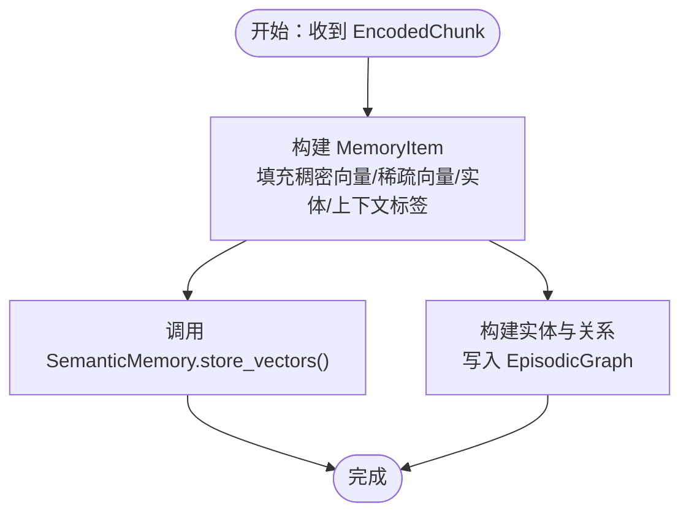
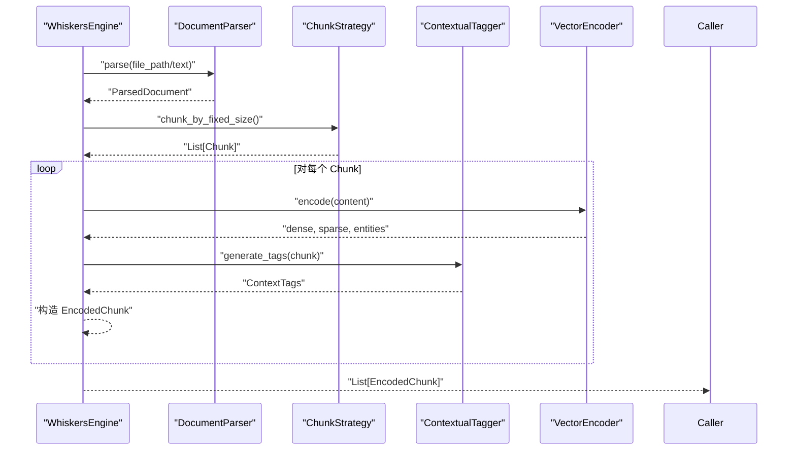
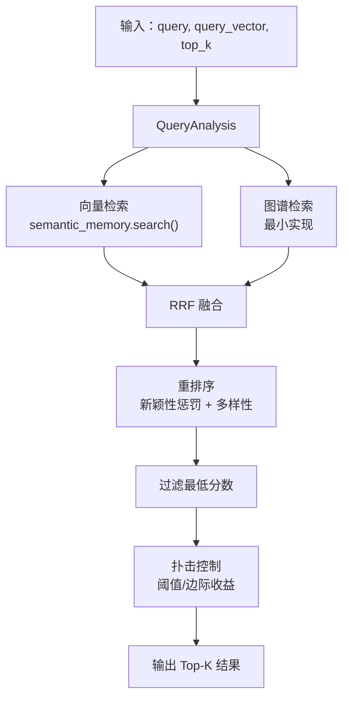
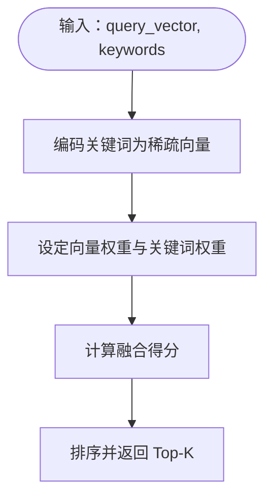
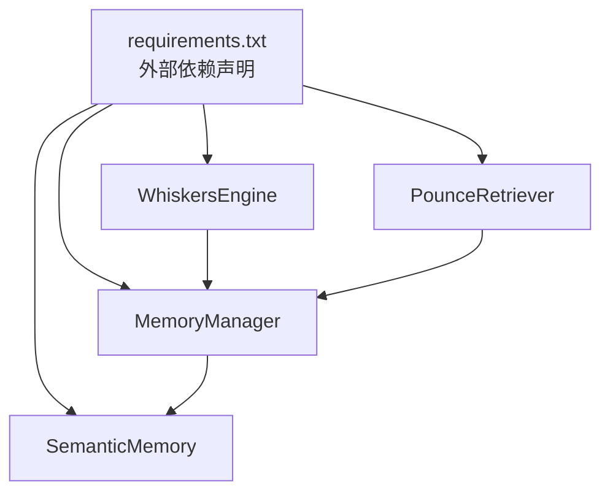

# L2 语义记忆 - 向量存储

<cite>
**本文引用的文件**
- [src/memory/semantic_memory.py](file://src/memory/semantic_memory.py)
- [src/memory/models.py](file://src/memory/models.py)
- [src/memory/manager.py](file://src/memory/manager.py)
- [src/memory/episodic_graph.py](file://src/memory/episodic_graph.py)
- [src/whiskers/engine.py](file://src/whiskers/engine.py)
- [src/whiskers/encoder.py](file://src/whiskers/encoder.py)
- [src/whiskers/chunker.py](file://src/whiskers/chunker.py)
- [src/whiskers/tagger.py](file://src/whiskers/tagger.py)
- [src/whiskers/models.py](file://src/whiskers/models.py)
- [src/retrieval/retriever.py](file://src/retrieval/retriever.py)
- [src/retrieval/fusion.py](file://src/retrieval/fusion.py)
- [src/retrieval/reranker.py](file://src/retrieval/reranker.py)
- [src/retrieval/models.py](file://src/retrieval/models.py)
- [example/example_usage.py](file://example/example_usage.py)
- [requirements.txt](file://requirements.txt)
</cite>

## 目录
1. [简介](#简介)
2. [项目结构](#项目结构)
3. [核心组件](#核心组件)
4. [架构总览](#架构总览)
5. [详细组件分析](#详细组件分析)
6. [依赖分析](#依赖分析)
7. [性能考虑](#性能考虑)
8. [故障排查指南](#故障排查指南)
9. [结论](#结论)
10. [附录](#附录)

## 简介
本文件聚焦 L2 语义记忆（向量存储）的设计与实现，覆盖高维向量存储、HNSW 索引优化、混合搜索（向量 + 关键词）、模糊匹配与直觉检索原理、向量相似度计算，并结合 Whiskers 编码流水线与检索层的端到端使用示例，解释与 Qdrant/Milvus 的集成路径与检索优化策略。

## 项目结构
该仓库采用“感知-记忆-检索-巩固-交互”的分层架构：
- 感知层（Whiskers）：文档解析、分块、情境标签、向量编码（稠密/稀疏/实体）
- 记忆层（MemoryManager + SemanticMemory + EpisodicGraph）：统一存储与检索 L1/L2/L3 三层记忆
- 检索层（PounceRetriever + Fusion + ReRanker）：多路检索、融合、重排序与扑击控制
- 交互层（PurrInterface）：情境自适应响应生成（非本篇重点）

图表来源
- [src/whiskers/engine.py:14-130](file://src/whiskers/engine.py#L14-L130)
- [src/memory/manager.py:16-186](file://src/memory/manager.py#L16-L186)
- [src/memory/semantic_memory.py:21-179](file://src/memory/semantic_memory.py#L21-L179)
- [src/memory/episodic_graph.py:10-194](file://src/memory/episodic_graph.py#L10-L194)
- [src/retrieval/retriever.py:108-336](file://src/retrieval/retriever.py#L108-L336)
- [src/retrieval/fusion.py:9-128](file://src/retrieval/fusion.py#L9-L128)
- [src/retrieval/reranker.py:10-179](file://src/retrieval/reranker.py#L10-L179)

章节来源
- [src/whiskers/engine.py:14-130](file://src/whiskers/engine.py#L14-L130)
- [src/memory/manager.py:16-186](file://src/memory/manager.py#L16-L186)
- [src/memory/semantic_memory.py:21-179](file://src/memory/semantic_memory.py#L21-L179)
- [src/memory/episodic_graph.py:10-194](file://src/memory/episodic_graph.py#L10-L194)
- [src/retrieval/retriever.py:108-336](file://src/retrieval/retriever.py#L108-L336)
- [src/retrieval/fusion.py:9-128](file://src/retrieval/fusion.py#L9-L128)
- [src/retrieval/reranker.py:10-179](file://src/retrieval/reranker.py#L10-L179)

## 核心组件
- L2 语义记忆（SemanticMemory）：提供向量存储、向量检索、混合检索、元数据更新与删除等能力；当前以内存字典模拟向量数据库，预留 Qdrant/Milvus 集成点。
- 记忆管理器（MemoryManager）：统一调度 L1/L2/L3 三层记忆，负责将 Whiskers 编码产物持久化至 L2 并同步构建 L3 图谱。
- Whiskers 编码流水线：文档解析、分块、情境标签、向量编码（稠密/稀疏/实体），为 L2 提供高质量向量表示。
- 检索器（PounceRetriever）：多路检索（向量/图谱）、RRF 融合、重排序、扑击控制，提升检索效率与质量。

章节来源
- [src/memory/semantic_memory.py:21-179](file://src/memory/semantic_memory.py#L21-L179)
- [src/memory/manager.py:16-186](file://src/memory/manager.py#L16-L186)
- [src/whiskers/engine.py:14-130](file://src/whiskers/engine.py#L14-L130)
- [src/retrieval/retriever.py:108-336](file://src/retrieval/retriever.py#L108-L336)

## 架构总览
下图展示从 Whiskers 到 L2 语义记忆再到检索层的端到端流程：

图表来源
- [src/whiskers/engine.py:54-130](file://src/whiskers/engine.py#L54-L130)
- [src/memory/manager.py:48-112](file://src/memory/manager.py#L48-L112)
- [src/memory/semantic_memory.py:50-118](file://src/memory/semantic_memory.py#L50-L118)
- [src/retrieval/retriever.py:140-201](file://src/retrieval/retriever.py#L140-L201)

## 详细组件分析

### L2 语义记忆（SemanticMemory）
- 设计目标
  - 高维向量存储：支持任意维度向量（默认 1024）
  - 混合搜索：向量 + 关键词（预留实现）
  - HNSW 索引：当前为内存字典，后续集成 Qdrant/Milvus
  - 模糊匹配与直觉检索：通过余弦相似度与阈值筛选
- 关键接口
  - 存储：接收 MemoryItem 列表，写入向量与元数据
  - 向量检索：输入查询向量，返回 Top-K 与分数
  - 混合检索：向量 + 关键词权重融合（待实现）
  - 元数据更新与删除：基于 memory_id
- 当前实现要点
  - 向量相似度：余弦相似度
  - 索引：无专用索引，遍历全量向量
  - 集成点：TODO 标注处为 Qdrant/Milvus 集成入口

图表来源
- [src/memory/semantic_memory.py:21-179](file://src/memory/semantic_memory.py#L21-L179)
- [src/memory/models.py:19-31](file://src/memory/models.py#L19-L31)

章节来源
- [src/memory/semantic_memory.py:21-179](file://src/memory/semantic_memory.py#L21-L179)
- [src/memory/models.py:19-31](file://src/memory/models.py#L19-L31)

### 记忆管理器（MemoryManager）
- 职责
  - 将 EncodedChunk 转换为 MemoryItem，写入 L2 语义记忆
  - 将实体三元组写入 L3 情景图谱
  - 提供统一检索接口，支持按层级选择
- 与 SemanticMemory 的协作
  - 通过 store_vectors 完成向量与元数据持久化
  - 在检索时调用 semantic_memory.search 获取候选

图表来源
- [src/memory/manager.py:48-112](file://src/memory/manager.py#L48-L112)
- [src/memory/semantic_memory.py:50-78](file://src/memory/semantic_memory.py#L50-L78)
- [src/memory/episodic_graph.py:33-108](file://src/memory/episodic_graph.py#L33-L108)

章节来源
- [src/memory/manager.py:16-186](file://src/memory/manager.py#L16-L186)

### Whiskers 编码流水线
- WhiskersEngine：一站式处理，包含解析、分块、情境标签、向量编码
- VectorEncoder：生成稠密向量、稀疏向量、实体三元组（当前为最小实现）
- ChunkStrategy：固定大小分块（重叠拼接）
- ContextualTagger：时间、情感、重要性、主题标签

图表来源
- [src/whiskers/engine.py:42-130](file://src/whiskers/engine.py#L42-L130)
- [src/whiskers/encoder.py:28-98](file://src/whiskers/encoder.py#L28-L98)
- [src/whiskers/chunker.py:58-82](file://src/whiskers/chunker.py#L58-L82)
- [src/whiskers/tagger.py:32-144](file://src/whiskers/tagger.py#L32-L144)

章节来源
- [src/whiskers/engine.py:14-130](file://src/whiskers/engine.py#L14-L130)
- [src/whiskers/encoder.py:11-98](file://src/whiskers/encoder.py#L11-L98)
- [src/whiskers/chunker.py:10-98](file://src/whiskers/chunker.py#L10-L98)
- [src/whiskers/tagger.py:10-144](file://src/whiskers/tagger.py#L10-L144)
- [src/whiskers/models.py:11-69](file://src/whiskers/models.py#L11-L69)

### 检索层（PounceRetriever）
- 多路检索：向量检索 + 图谱检索（图谱当前为最小实现）
- 结果融合：RRF（Reciprocal Rank Fusion）
- 重排序：新颖性惩罚 + 多样性（MMR-like）
- 扑击控制：基于置信度阈值与边际收益，提前终止冗余计算

图表来源
- [src/retrieval/retriever.py:140-201](file://src/retrieval/retriever.py#L140-L201)
- [src/retrieval/fusion.py:18-70](file://src/retrieval/fusion.py#L18-L70)
- [src/retrieval/reranker.py:41-70](file://src/retrieval/reranker.py#L41-L70)

章节来源
- [src/retrieval/retriever.py:108-336](file://src/retrieval/retriever.py#L108-L336)
- [src/retrieval/fusion.py:9-128](file://src/retrieval/fusion.py#L9-L128)
- [src/retrieval/reranker.py:10-179](file://src/retrieval/reranker.py#L10-L179)

### 混合搜索（向量 + 关键词）设计
- 当前状态：混合检索接口存在但未实现，当前仅执行向量检索
- 设计思路（概念性说明）
  - 关键词权重：将关键词映射为稀疏向量或 BM25 得分
  - 向量权重：可调节向量与关键词的融合比例
  - 融合策略：加权求和、学习式融合或再排序阶段融合
- 与 Whiskers 的关联
  - 稀疏向量来自 Encoder 的词频统计（当前最小实现）
  - 可扩展为 BM25 或更复杂的稀疏编码

图表来源
- [src/memory/semantic_memory.py:120-142](file://src/memory/semantic_memory.py#L120-L142)
- [src/whiskers/encoder.py:60-82](file://src/whiskers/encoder.py#L60-L82)

章节来源
- [src/memory/semantic_memory.py:120-142](file://src/memory/semantic_memory.py#L120-L142)
- [src/whiskers/encoder.py:60-82](file://src/whiskers/encoder.py#L60-L82)

### HNSW 索引优化（集成路径）
- 当前实现：内存字典，无专用索引
- 集成建议（概念性说明）
  - Qdrant：使用向量字段 + HNSW/PQ/Flat 索引配置；支持元数据过滤与混合检索
  - Milvus：向量字段 + HNSW/SIVF 索引；支持布尔/JSON 元数据过滤
- 优化要点
  - 索引参数：M、efConstruction、ef
  - 向量归一化：余弦相似度场景建议 L2 归一化
  - 分片与副本：生产环境建议分片与副本策略
  - 混合检索：关键词过滤 + 向量检索的组合策略

章节来源
- [src/memory/semantic_memory.py:32-49](file://src/memory/semantic_memory.py#L32-L49)
- [requirements.txt:18-21](file://requirements.txt#L18-L21)

### 模糊匹配与直觉检索原理
- 模糊匹配：通过余弦相似度在高维空间度量语义接近度
- 直觉检索：结合扑击控制与重排序，优先返回高置信度结果，避免无效计算
- 关键词增强：通过稀疏向量或关键词权重提升检索鲁棒性

章节来源
- [src/memory/semantic_memory.py:99-118](file://src/memory/semantic_memory.py#L99-L118)
- [src/retrieval/retriever.py:16-88](file://src/retrieval/retriever.py#L16-L88)
- [src/retrieval/reranker.py:72-154](file://src/retrieval/reranker.py#L72-L154)

### 向量相似度计算
- 当前实现：余弦相似度
- 复杂度：O(N·D)，N 为向量数量，D 为维度
- 优化方向：索引近似最近邻（如 HNSW、IVF+PQ）、向量量化、预归一化

章节来源
- [src/memory/semantic_memory.py:99-118](file://src/memory/semantic_memory.py#L99-L118)

### 语义记忆 API 使用示例
以下示例展示了从 Whiskers 编码到 L2 存储、检索与巩固的完整流程。请参考示例脚本中的具体调用路径。

- Whiskers 编码示例
  - 路径：[example/example_usage.py:12-47](file://example/example_usage.py#L12-L47)
- 记忆存储与检索示例
  - 路径：[example/example_usage.py:50-91](file://example/example_usage.py#L50-L91)
- 智能检索与重排序示例
  - 路径：[example/example_usage.py:94-136](file://example/example_usage.py#L94-L136)
- 完整工作流
  - 路径：[example/example_usage.py:218-247](file://example/example_usage.py#L218-L247)

章节来源
- [example/example_usage.py:12-247](file://example/example_usage.py#L12-L247)

## 依赖分析
- 外部依赖（与 L2 语义记忆直接相关）
  - 向量数据库：qdrant-client、pymilvus（可选）
  - 嵌入模型：FlagEmbedding、sentence-transformers（可选）
  - 数值计算：numpy
- 项目内部耦合
  - Whiskers 输出作为 MemoryManager 输入
  - MemoryManager 调用 SemanticMemory 与 EpisodicGraph
  - PounceRetriever 依赖 MemoryManager 与融合/重排序组件

图表来源
- [requirements.txt:18-31](file://requirements.txt#L18-L31)
- [src/memory/semantic_memory.py:21-179](file://src/memory/semantic_memory.py#L21-L179)
- [src/memory/manager.py:16-186](file://src/memory/manager.py#L16-L186)
- [src/whiskers/engine.py:14-130](file://src/whiskers/engine.py#L14-L130)
- [src/retrieval/retriever.py:108-336](file://src/retrieval/retriever.py#L108-L336)

章节来源
- [requirements.txt:1-57](file://requirements.txt#L1-L57)

## 性能考虑
- 索引与查询
  - 优先引入 HNSW/IVF 等近似检索索引，显著降低查询复杂度
  - 向量预归一化与批量插入可提升吞吐
- 混合检索
  - 关键词过滤与向量检索并行，减少无效向量计算
- 重排序与融合
  - RRF 与新颖性惩罚在召回后进行，避免早期过滤导致信息丢失
- 资源与成本
  - 生产环境建议分片与副本，结合缓存与热点数据治理

## 故障排查指南
- 向量维度不一致
  - 现象：存储时报错或检索异常
  - 排查：确认编码模型输出维度与 SemanticMemory 初始化一致
  - 参考：[src/memory/semantic_memory.py:32-49](file://src/memory/semantic_memory.py#L32-L49)、[src/whiskers/encoder.py:18-26](file://src/whiskers/encoder.py#L18-L26)
- 检索结果为空
  - 现象：search/hybrid_search 返回空列表
  - 排查：检查 query_vector 是否为 None、min_score 设置是否过高、向量是否归一化
  - 参考：[src/memory/semantic_memory.py:80-118](file://src/memory/semantic_memory.py#L80-L118)
- 混合检索未生效
  - 现象：hybrid_search 仅返回向量检索结果
  - 排查：当前实现为最小实现，需按设计思路补充关键词编码与融合逻辑
  - 参考：[src/memory/semantic_memory.py:120-142](file://src/memory/semantic_memory.py#L120-L142)
- 图谱检索未返回结果
  - 现象：图谱检索为空
  - 排查：当前图谱实现为最小实现，需完善实体/关系构建与查询
  - 参考：[src/memory/episodic_graph.py:71-126](file://src/memory/episodic_graph.py#L71-L126)

章节来源
- [src/memory/semantic_memory.py:32-142](file://src/memory/semantic_memory.py#L32-L142)
- [src/whiskers/encoder.py:18-26](file://src/whiskers/encoder.py#L18-L26)
- [src/memory/episodic_graph.py:71-126](file://src/memory/episodic_graph.py#L71-L126)

## 结论
本设计以 Whiskers 为感知前端，MemoryManager 为中枢，SemanticMemory 为 L2 向量存储核心，配合 PounceRetriever 的多路检索、融合与重排序，形成高效、可扩展的语义检索体系。当前实现以内存字典为基础，预留了与 Qdrant/Milvus 的集成点；混合检索、图谱检索与重排序策略亦具备清晰的扩展路径。建议尽快接入 HNSW 索引与嵌入模型，以满足生产级性能与效果要求。

## 附录
- API 调用路径参考
  - 向量存储：[src/memory/semantic_memory.py:50-78](file://src/memory/semantic_memory.py#L50-L78)
  - 向量检索：[src/memory/semantic_memory.py:80-118](file://src/memory/semantic_memory.py#L80-L118)
  - 混合检索：[src/memory/semantic_memory.py:120-142](file://src/memory/semantic_memory.py#L120-L142)
  - 元数据更新/删除：[src/memory/semantic_memory.py:144-179](file://src/memory/semantic_memory.py#L144-L179)
  - 编码流水线：[src/whiskers/engine.py:54-130](file://src/whiskers/engine.py#L54-L130)
  - 记忆管理：[src/memory/manager.py:48-112](file://src/memory/manager.py#L48-L112)
  - 检索器：[src/retrieval/retriever.py:140-201](file://src/retrieval/retriever.py#L140-L201)