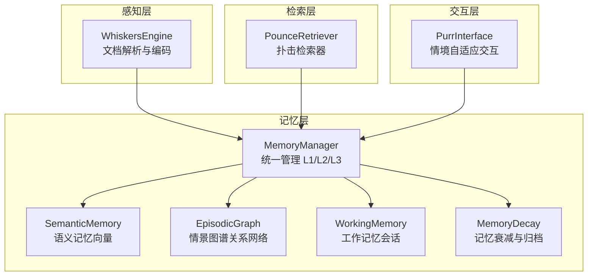
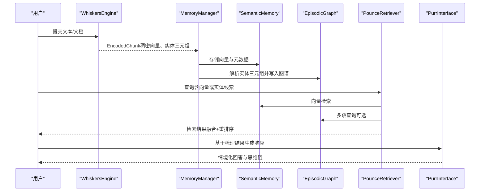
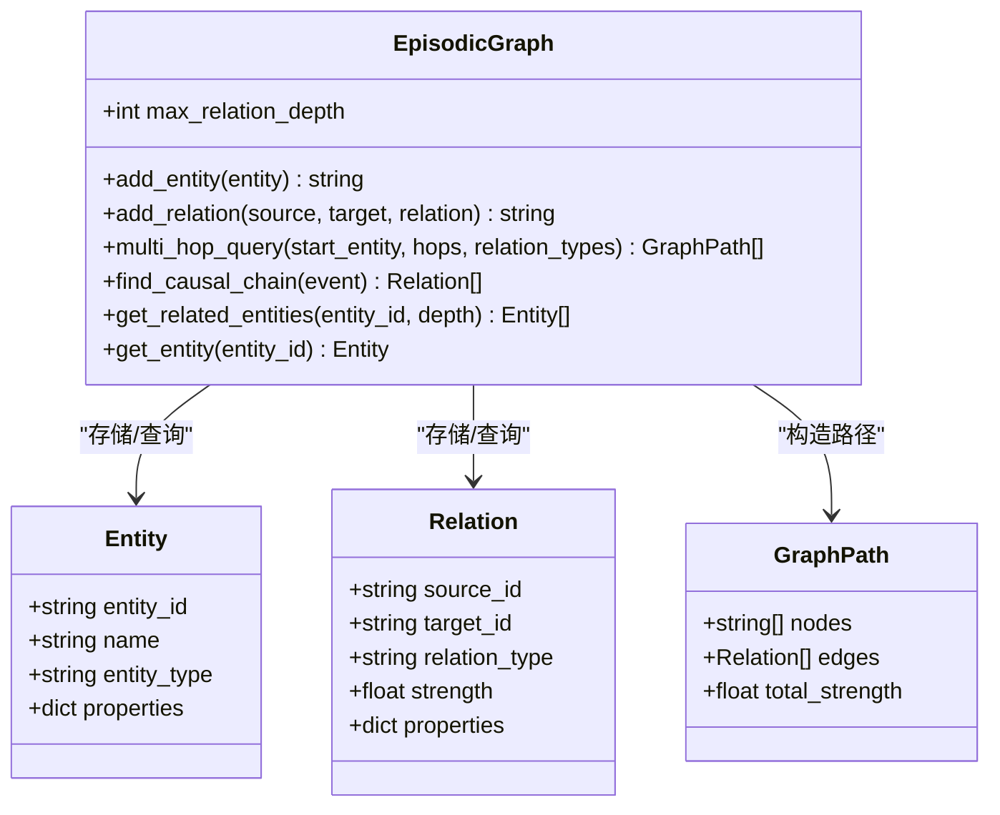
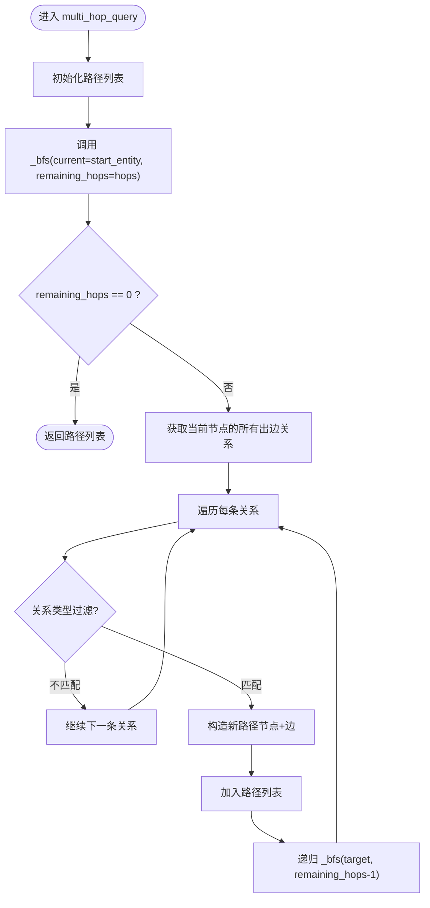
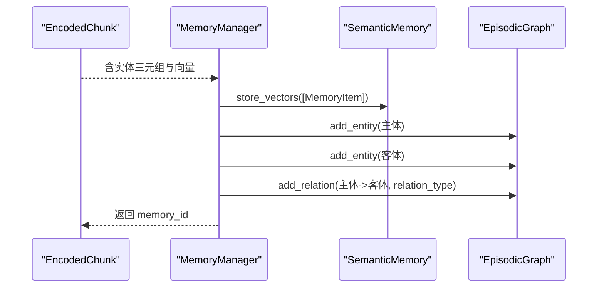
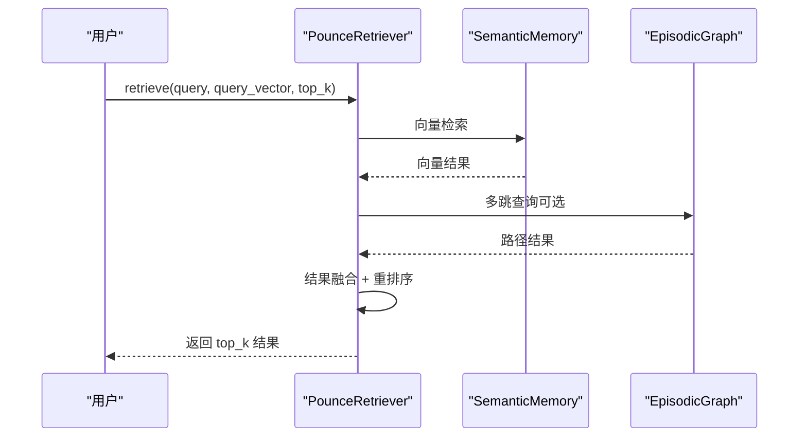
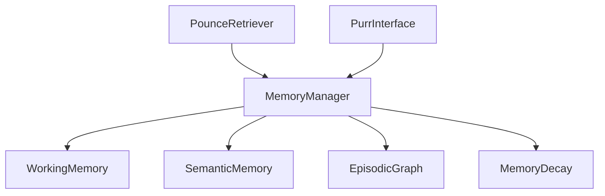

# L3 情景图谱 - 关系网络

<cite>
**本文引用的文件**
- [episodic_graph.py](file://src/memory/episodic_graph.py)
- [models.py](file://src/memory/models.py)
- [manager.py](file://src/memory/manager.py)
- [semantic_memory.py](file://src/memory/semantic_memory.py)
- [working_memory.py](file://src/memory/working_memory.py)
- [decay.py](file://src/memory/decay.py)
- [engine.py](file://src/whiskers/engine.py)
- [models.py](file://src/whiskers/models.py)
- [retriever.py](file://src/retrieval/retriever.py)
- [interface.py](file://src/purr/interface.py)
- [example_usage.py](file://example/example_usage.py)
</cite>

## 目录
1. [简介](#简介)
2. [项目结构](#项目结构)
3. [核心组件](#核心组件)
4. [架构总览](#架构总览)
5. [详细组件分析](#详细组件分析)
6. [依赖分析](#依赖分析)
7. [性能考虑](#性能考虑)
8. [故障排查指南](#故障排查指南)
9. [结论](#结论)
10. [附录](#附录)

## 简介
本技术文档聚焦于 L3 情景图谱（关系网络）的设计与实现，围绕实体关系网络构建、Cypher 查询语言应用、多跳推理机制展开，并结合知识图谱、事件图谱、因果图谱三种图谱类型的实现思路与应用场景，提供图谱 API 的使用示例与与语义记忆的数据转换、图谱优化策略说明。当前仓库中的图谱实现采用内存结构作为最小可用实现，同时预留了与 Neo4j/NebulaGraph 等图数据库集成的扩展点。

## 项目结构
本项目采用按功能域划分的模块化组织方式，L3 情景图谱位于记忆层（Memory Layer），与感知层（Whiskers）、检索层（Retrieval）、交互层（Purr）协同工作，形成“感知-记忆-检索-巩固-交互”的完整闭环。

图表来源
- [engine.py:14-130](file://src/whiskers/engine.py#L14-L130)
- [manager.py:16-186](file://src/memory/manager.py#L16-L186)
- [semantic_memory.py:21-179](file://src/memory/semantic_memory.py#L21-L179)
- [episodic_graph.py:10-194](file://src/memory/episodic_graph.py#L10-L194)
- [working_memory.py:11-120](file://src/memory/working_memory.py#L11-L120)
- [decay.py:11-155](file://src/memory/decay.py#L11-L155)
- [retriever.py:108-336](file://src/retrieval/retriever.py#L108-L336)
- [interface.py:16-224](file://src/purr/interface.py#L16-L224)

章节来源
- [engine.py:14-130](file://src/whiskers/engine.py#L14-L130)
- [manager.py:16-186](file://src/memory/manager.py#L16-L186)

## 核心组件
- 情景图谱（EpisodicGraph）：负责实体与关系的存储、多跳查询、因果链条追踪等。
- 记忆管理器（MemoryManager）：统一调度工作记忆、语义记忆与情景图谱，完成从感知到图谱的落地。
- 语义记忆（SemanticMemory）：高维向量存储与检索，支持混合检索与元数据更新。
- 工作记忆（WorkingMemory）：会话级上下文与意图轨迹的短期存储。
- 记忆衰减（MemoryDecay）：权重动态衰减、强化与自动归档。
- 扑击检索器（PounceRetriever）：多路检索、融合、重排序与“扑击”控制，支持基于图谱的多跳检索。
- 交互接口（PurrInterface）：情境自适应生成、用户画像适配与思维链可视化。

章节来源
- [episodic_graph.py:10-194](file://src/memory/episodic_graph.py#L10-L194)
- [manager.py:16-186](file://src/memory/manager.py#L16-L186)
- [semantic_memory.py:21-179](file://src/memory/semantic_memory.py#L21-L179)
- [working_memory.py:11-120](file://src/memory/working_memory.py#L11-L120)
- [decay.py:11-155](file://src/memory/decay.py#L11-L155)
- [retriever.py:108-336](file://src/retrieval/retriever.py#L108-L336)
- [interface.py:16-224](file://src/purr/interface.py#L16-L224)

## 架构总览
下图展示了从感知到交互的端到端流程，以及图谱在检索阶段的参与方式。

图表来源
- [engine.py:54-130](file://src/whiskers/engine.py#L54-L130)
- [manager.py:48-112](file://src/memory/manager.py#L48-L112)
- [semantic_memory.py:50-78](file://src/memory/semantic_memory.py#L50-L78)
- [episodic_graph.py:33-70](file://src/memory/episodic_graph.py#L33-L70)
- [retriever.py:140-202](file://src/retrieval/retriever.py#L140-L202)
- [interface.py:55-132](file://src/purr/interface.py#L55-L132)

## 详细组件分析

### 情景图谱（EpisodicGraph）设计与实现
- 数据模型
  - 实体（Entity）：包含实体 ID、名称、类型与属性。
  - 关系（Relation）：包含源/目标实体 ID、关系类型、强度与属性。
  - 图路径（GraphPath）：记录节点序列、边序列与总强度。
- 核心能力
  - 实体与关系增删改查：add_entity、add_relation、get_entity、get_related_entities。
  - 多跳查询：multi_hop_query，内部以 BFS 为基础进行递归探索，支持关系类型过滤。
  - 因果链条：find_causal_chain，基于预定义的关系类型集合（如 causes、leads_to、results_in）进行筛选。
  - 关联实体发现：基于邻接遍历在指定深度内收集相关实体。
- 与图数据库的对接
  - 当前为内存实现；TODO 中明确标注了集成 Neo4j/NebulaGraph 的扩展方向，便于后续替换为生产级图数据库。

图表来源
- [episodic_graph.py:10-194](file://src/memory/episodic_graph.py#L10-L194)
- [models.py:33-67](file://src/memory/models.py#L33-L67)

章节来源
- [episodic_graph.py:10-194](file://src/memory/episodic_graph.py#L10-L194)
- [models.py:33-67](file://src/memory/models.py#L33-L67)

### 多跳查询流程（BFS）

图表来源
- [episodic_graph.py:71-125](file://src/memory/episodic_graph.py#L71-L125)

章节来源
- [episodic_graph.py:71-125](file://src/memory/episodic_graph.py#L71-L125)

### 记忆管理器（MemoryManager）与图谱落地
- 存储流程
  - 将 EncodedChunk 的稠密向量与元数据写入语义记忆。
  - 遍历实体三元组，创建实体与关系，写入情景图谱。
  - 统一存储在内存字典中，便于后续检索与衰减。
- 检索流程
  - 基于查询向量在语义记忆中检索，结合记忆衰减对命中结果进行强化。
- 记忆巩固与主动遗忘
  - 应用衰减公式计算权重，归档低权重记忆，维持知识库质量。

图表来源
- [manager.py:48-112](file://src/memory/manager.py#L48-L112)
- [semantic_memory.py:50-78](file://src/memory/semantic_memory.py#L50-L78)
- [episodic_graph.py:33-70](file://src/memory/episodic_graph.py#L33-L70)

章节来源
- [manager.py:48-112](file://src/memory/manager.py#L48-L112)
- [semantic_memory.py:50-78](file://src/memory/semantic_memory.py#L50-L78)
- [episodic_graph.py:33-70](file://src/memory/episodic_graph.py#L33-L70)

### 语义记忆（SemanticMemory）与向量检索
- 存储：将 MemoryItem 的向量与元数据存入内存字典。
- 检索：计算查询向量与存储向量的余弦相似度，按分数排序取 top_k。
- 混合检索：预留接口，当前最小实现仅执行向量检索。
- 元数据更新与删除：支持按 memory_id 更新与删除。

章节来源
- [semantic_memory.py:21-179](file://src/memory/semantic_memory.py#L21-L179)

### 工作记忆（WorkingMemory）与用户意图轨迹
- 会话上下文：按 session_id 存储上下文，支持 TTL 与 LRU（当前为最小实现）。
- 意图轨迹：记录用户意图列表，便于后续交互与个性化。

章节来源
- [working_memory.py:11-120](file://src/memory/working_memory.py#L11-L120)

### 记忆衰减（MemoryDecay）与知识巩固
- 权重计算：综合初始权重、时间衰减与访问频率，形成动态权重。
- 强化：每次检索命中后提升权重与访问计数。
- 归档：低于阈值的记忆被归档，避免无效占用。

章节来源
- [decay.py:11-155](file://src/memory/decay.py#L11-L155)

### 扑击检索器（PounceRetriever）与多跳检索
- 多路检索：向量检索与图谱检索（当前图谱检索最小实现为空）。
- 结果融合：使用倒数秩融合策略整合多路结果。
- 重排序：基于重排序模型对候选结果进行再排序。
- 扑击控制：根据置信度与边际收益判断是否提前返回结果。
- 多跳检索：调用 EpisodicGraph.multi_hop_query，将路径转化为检索结果。

图表来源
- [retriever.py:140-202](file://src/retrieval/retriever.py#L140-L202)
- [episodic_graph.py:71-93](file://src/memory/episodic_graph.py#L71-L93)

章节来源
- [retriever.py:108-336](file://src/retrieval/retriever.py#L108-L336)
- [episodic_graph.py:71-93](file://src/memory/episodic_graph.py#L71-L93)

### 交互接口（PurrInterface）与思维链可视化
- 响应生成：根据梳理结果与用户画像，进行语气与详细程度适配。
- 思维链可视化：将检索路径、证据来源与推理过程转化为可读文本。
- 用户偏好分析：统计交互历史，输出偏好分析结果。

章节来源
- [interface.py:16-224](file://src/purr/interface.py#L16-L224)

### Cypher 查询语言应用与多跳推理机制
- Cypher 应用建议
  - 实体与关系建模：使用节点（实体）与边（关系）表达三元组，设置关系类型与属性字段。
  - 多跳查询：使用 MATCH ...-[:TYPE*1..N]->... 实现可变长度关系遍历，结合 WHERE 过滤关系类型与属性。
  - 因果链分析：针对 causes/leads_to/results_in 等关系类型，使用路径聚合与强度加权，输出因果链条。
- 多跳推理
  - 以起始实体为根，按关系类型进行广度优先搜索，累积路径强度与上下文信息，输出候选路径集合。
  - 结合语义记忆的向量检索结果，进行融合与重排序，提升推理质量。

（本节为概念性说明，不直接分析具体代码文件）

## 依赖分析
- 组件耦合
  - MemoryManager 依赖 WorkingMemory、SemanticMemory、EpisodicGraph、MemoryDecay，承担统一调度职责。
  - PounceRetriever 依赖 MemoryManager 与检索子模块，负责检索策略与控制。
  - PurrInterface 依赖 MemoryManager 与交互适配模块，负责响应生成与可视化。
- 外部依赖
  - 当前实现为内存模拟，预留与 Neo4j/NebulaGraph、Qdrant/Milvus、Redis 的集成接口（TODO 标注处）。

图表来源
- [manager.py:16-47](file://src/memory/manager.py#L16-L47)
- [retriever.py:108-139](file://src/retrieval/retriever.py#L108-L139)
- [interface.py:16-54](file://src/purr/interface.py#L16-L54)

章节来源
- [manager.py:16-47](file://src/memory/manager.py#L16-L47)
- [retriever.py:108-139](file://src/retrieval/retriever.py#L108-L139)
- [interface.py:16-54](file://src/purr/interface.py#L16-L54)

## 性能考虑
- 检索效率
  - 向量检索采用余弦相似度计算，建议在生产环境接入 HNSW 索引以降低时间复杂度。
  - 多跳查询在大规模图上可能产生指数增长的路径，建议引入剪枝策略（如关系类型过滤、路径强度阈值、最大深度限制）。
- 存储与内存
  - 语义记忆与情景图谱均采用内存存储，建议在生产环境中替换为持久化向量数据库与图数据库。
  - 对于高频访问的知识，可通过强化机制提升权重，减少不必要的重排与重检索。
- 控制流优化
  - 扑击控制可根据置信度与边际收益提前终止冗余计算，显著降低延迟。

（本节提供通用指导，不直接分析具体代码文件）

## 故障排查指南
- 检索结果为空
  - 检查 EncodedChunk 是否正确提取实体三元组，确认 MemoryManager 已调用 add_entity/add_relation。
  - 确认 SemanticMemory 的向量维度与模型一致，查询向量非空且已归一化。
- 多跳查询无结果
  - 检查关系类型过滤参数是否过于严格，适当放宽 relation_types。
  - 调整 hops 与 max_relation_depth 参数，避免过浅或过深导致路径缺失。
- 因果链分析异常
  - 确认关系类型集合是否包含 causes/leads_to/results_in，必要时扩展类型列表。
- 记忆衰减与归档
  - 若出现“知识丢失”，检查衰减参数与归档阈值，适当上调权重上限与阈值。
- 交互响应不符合预期
  - 检查用户画像与语气/详细程度适配逻辑，确认 PurrInterface 的默认配置与用户偏好分析结果。

章节来源
- [manager.py:77-112](file://src/memory/manager.py#L77-L112)
- [semantic_memory.py:80-118](file://src/memory/semantic_memory.py#L80-L118)
- [episodic_graph.py:71-147](file://src/memory/episodic_graph.py#L71-L147)
- [decay.py:96-155](file://src/memory/decay.py#L96-L155)
- [interface.py:134-165](file://src/purr/interface.py#L134-L165)

## 结论
本项目以最小可用实现完成了从感知到交互的完整链路，其中 L3 情景图谱承担了实体关系网络与多跳推理的关键角色。当前实现为内存结构，具备良好的扩展性，可无缝对接 Neo4j/NebulaGraph 等图数据库，满足知识图谱、事件图谱、因果图谱等多样化场景需求。通过与语义记忆的协同、记忆衰减的巩固与主动遗忘策略，以及扑击检索器的高效控制，整体系统在准确性与效率之间取得平衡。

## 附录

### 图谱 API 使用示例（基于现有实现）
以下示例展示如何使用当前实现进行实体添加、关系建立、多跳查询与因果链分析。由于当前为内存实现，示例中直接调用 MemoryManager 与 EpisodicGraph 的方法。

- 实体与关系添加
  - 步骤：准备 EncodedChunk（包含实体三元组），调用 MemoryManager.store 完成向量与图谱落地。
  - 参考路径：[manager.py:48-112](file://src/memory/manager.py#L48-L112)
- 多跳查询
  - 步骤：调用 EpisodicGraph.multi_hop_query(start_entity, hops, relation_types)。
  - 参考路径：[episodic_graph.py:71-93](file://src/memory/episodic_graph.py#L71-L93)
- 因果链分析
  - 步骤：调用 EpisodicGraph.find_causal_chain(event)，筛选 causes/leads_to/results_in 类型关系。
  - 参考路径：[episodic_graph.py:127-147](file://src/memory/episodic_graph.py#L127-L147)
- 与语义记忆的数据转换
  - 步骤：将 EncodedChunk.dense_vector 写入 SemanticMemory，元数据与实体三元组写入 EpisodicGraph。
  - 参考路径：[semantic_memory.py:50-78](file://src/memory/semantic_memory.py#L50-L78)、[episodic_graph.py:33-70](file://src/memory/episodic_graph.py#L33-L70)

章节来源
- [manager.py:48-112](file://src/memory/manager.py#L48-L112)
- [episodic_graph.py:33-147](file://src/memory/episodic_graph.py#L33-L147)
- [semantic_memory.py:50-78](file://src/memory/semantic_memory.py#L50-L78)

### 三种图谱类型的实现与应用
- 知识图谱
  - 关注静态事实与概念间的关系，适合问答与推理。
  - 在本实现中体现为实体与关系的稳定存储与多跳查询。
- 事件图谱
  - 关注时序与事件之间的流转关系，适合事件追踪与路径推演。
  - 可在关系类型中引入时间戳与顺序约束，结合多跳查询进行时序路径挖掘。
- 因果图谱
  - 关注原因与结果之间的因果关系，适合因果链分析与干预评估。
  - 在本实现中体现为对 causes/leads_to/results_in 等关系类型的专门筛选与聚合。

（本节为概念性说明，不直接分析具体代码文件）

### 与语义记忆的数据转换与图谱优化策略
- 数据转换
  - 将感知层输出的 EncodedChunk 转换为 MemoryItem 并写入语义记忆；同时解析实体三元组写入情景图谱。
- 图谱优化
  - 关系类型过滤与路径强度累积，减少无关路径。
  - 引入剪枝策略（深度、类型、强度阈值）与缓存热点路径，提升查询效率。
  - 结合记忆衰减与强化，保持图谱中高价值关系的稳定性。

章节来源
- [manager.py:77-112](file://src/memory/manager.py#L77-L112)
- [episodic_graph.py:71-125](file://src/memory/episodic_graph.py#L71-L125)
- [semantic_memory.py:80-118](file://src/memory/semantic_memory.py#L80-L118)
- [decay.py:39-94](file://src/memory/decay.py#L39-L94)