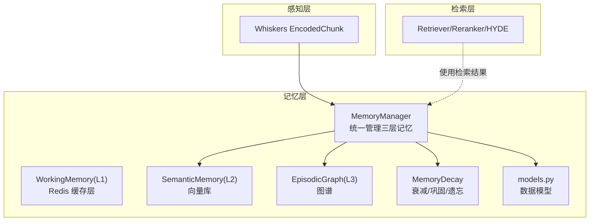
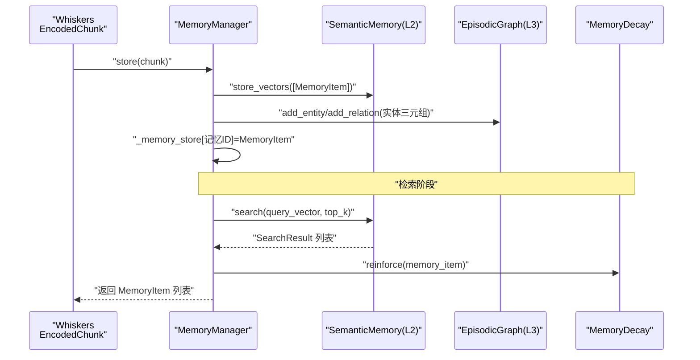
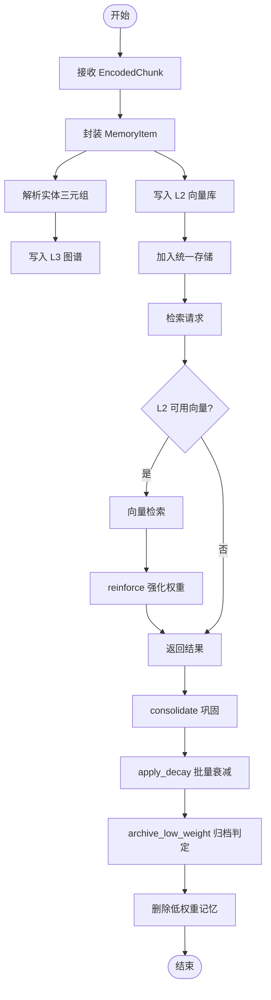
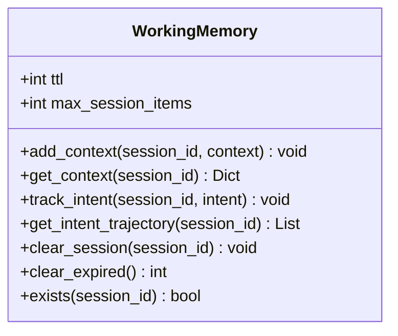
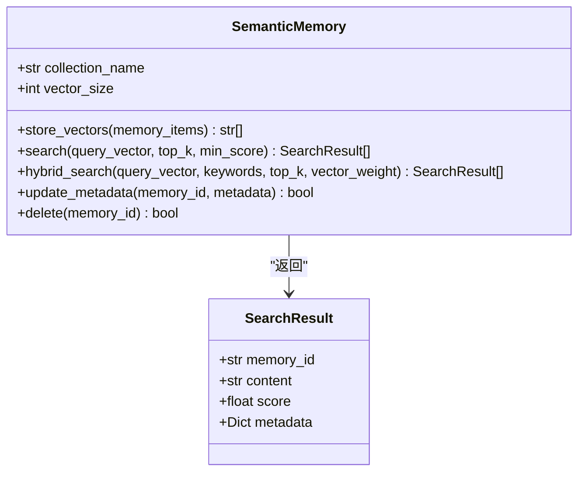
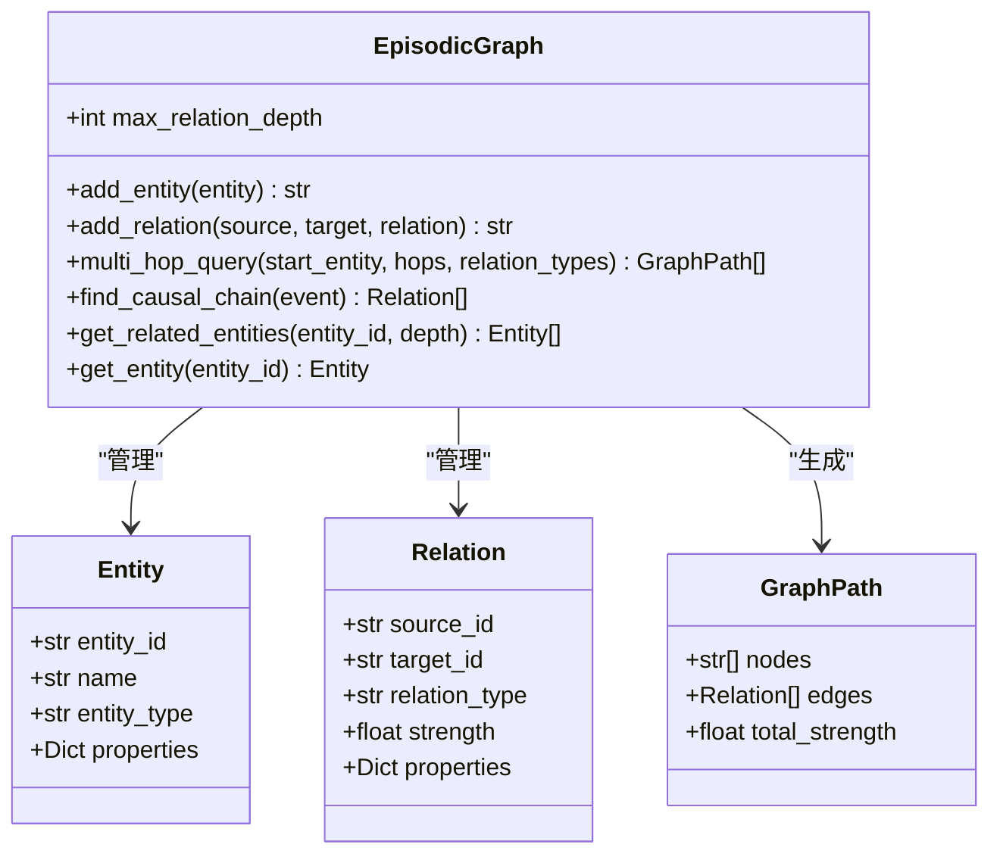
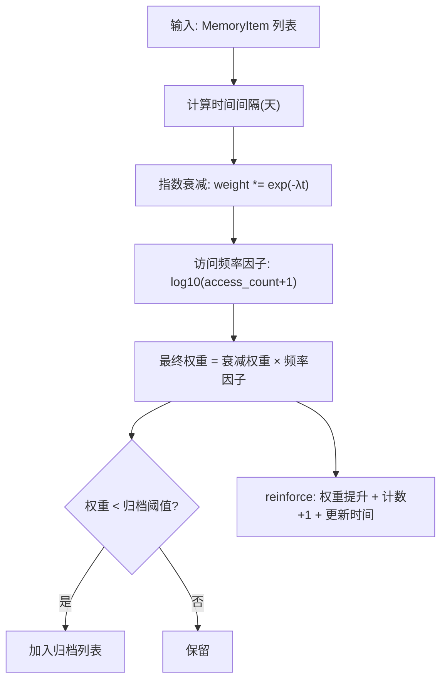
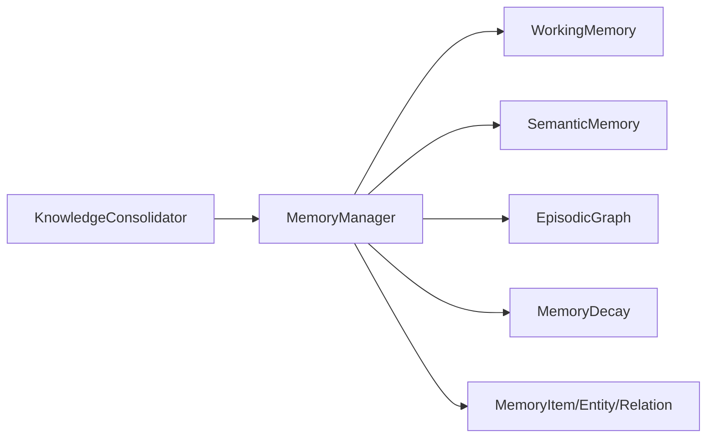

# Nine-Lives Memory - 记忆层

<cite>
**本文引用的文件**
- [src/memory/__init__.py](file://src/memory/__init__.py)
- [src/memory/manager.py](file://src/memory/manager.py)
- [src/memory/models.py](file://src/memory/models.py)
- [src/memory/working_memory.py](file://src/memory/working_memory.py)
- [src/memory/semantic_memory.py](file://src/memory/semantic_memory.py)
- [src/memory/episodic_graph.py](file://src/memory/episodic_graph.py)
- [src/memory/decay.py](file://src/memory/decay.py)
- [src/memory/README.md](file://src/memory/README.md)
- [src/whiskers/models.py](file://src/whiskers/models.py)
- [src/grooming/consolidator.py](file://src/grooming/consolidator.py)
</cite>

## 目录
1. [简介](#简介)
2. [项目结构](#项目结构)
3. [核心组件](#核心组件)
4. [架构总览](#架构总览)
5. [详细组件分析](#详细组件分析)
6. [依赖分析](#依赖分析)
7. [性能考虑](#性能考虑)
8. [故障排查指南](#故障排查指南)
9. [结论](#结论)
10. [附录](#附录)

## 简介
本文件为 Nine-Lives Memory（九命记忆存储）的记忆层技术文档，聚焦于三层记忆架构的设计理念与实现原理：L1 工作记忆（短期）、L2 语义记忆（长期向量存储与模糊检索）、L3 情景图谱（实体关系网络与多跳推理）。文档深入解释记忆衰减模型、巩固过程与遗忘机制，并给出记忆管理 API、数据模型定义与性能优化策略，同时阐明与感知层（Whiskers）和检索层（Retrieval）的数据交互模式。

## 项目结构
记忆层位于 src/memory 目录，包含记忆管理器、三层记忆实现、数据模型与衰减机制；感知层在 src/whiskers 提供编码后的文本块 EncodedChunk；知识固化器在 src/grooming 中负责周期性知识缺口识别与补充。

图表来源
- [src/memory/manager.py:16-186](file://src/memory/manager.py#L16-L186)
- [src/memory/working_memory.py:11-120](file://src/memory/working_memory.py#L11-L120)
- [src/memory/semantic_memory.py:21-179](file://src/memory/semantic_memory.py#L21-L179)
- [src/memory/episodic_graph.py:10-194](file://src/memory/episodic_graph.py#L10-L194)
- [src/memory/decay.py:11-155](file://src/memory/decay.py#L11-L155)
- [src/memory/models.py:12-67](file://src/memory/models.py#L12-L67)
- [src/whiskers/models.py:31-41](file://src/whiskers/models.py#L31-L41)

章节来源
- [src/memory/README.md:1-244](file://src/memory/README.md#L1-L244)
- [src/memory/__init__.py:1-22](file://src/memory/__init__.py#L1-L22)

## 核心组件
- MemoryManager：统一协调 L1/L2/L3 三层记忆，负责存储、检索、巩固与主动遗忘。
- WorkingMemory（L1）：会话上下文与意图轨迹的短期存储，具备 TTL 与最小实现的 LRU。
- SemanticMemory（L2）：高维向量存储与检索，支持混合检索与元数据更新。
- EpisodicGraph（L3）：实体-关系-属性的图谱，支持多跳查询与因果链条追踪。
- MemoryDecay：基于指数衰减与访问频率的动态权重模型，支撑巩固与遗忘。
- 数据模型：MemoryItem、Entity、Relation、GraphPath、Intent 等。

章节来源
- [src/memory/manager.py:16-186](file://src/memory/manager.py#L16-L186)
- [src/memory/working_memory.py:11-120](file://src/memory/working_memory.py#L11-L120)
- [src/memory/semantic_memory.py:21-179](file://src/memory/semantic_memory.py#L21-L179)
- [src/memory/episodic_graph.py:10-194](file://src/memory/episodic_graph.py#L10-L194)
- [src/memory/decay.py:11-155](file://src/memory/decay.py#L11-L155)
- [src/memory/models.py:12-67](file://src/memory/models.py#L12-L67)

## 架构总览
三层记忆协同工作：感知层提供编码后的文本块，记忆管理器将其写入 L2 向量库并解析实体关系写入 L3 图谱；检索阶段优先从 L1 获取上下文，再结合 L2 向量检索与 L3 图谱推理进行融合；周期性通过 MemoryDecay 进行巩固与遗忘，维持知识新鲜度与存储效率。

图表来源
- [src/memory/manager.py:48-147](file://src/memory/manager.py#L48-L147)
- [src/memory/semantic_memory.py:50-118](file://src/memory/semantic_memory.py#L50-L118)
- [src/memory/decay.py:120-142](file://src/memory/decay.py#L120-L142)
- [src/whiskers/models.py:31-41](file://src/whiskers/models.py#L31-L41)

## 详细组件分析

### MemoryManager（记忆管理器）
职责与流程
- 存储：将 EncodedChunk 封装为 MemoryItem 写入 L2；解析实体三元组写入 L3；维护统一存储映射。
- 检索：对指定层级执行检索（默认 L2），命中后调用 MemoryDecay.reinforce 强化权重。
- 巩固：应用衰减、识别低权重记忆并删除，完成归档清理。
- 遗忘：按阈值主动删除低价值记忆。

图表来源
- [src/memory/manager.py:48-186](file://src/memory/manager.py#L48-L186)
- [src/memory/decay.py:72-118](file://src/memory/decay.py#L72-L118)

章节来源
- [src/memory/manager.py:16-186](file://src/memory/manager.py#L16-L186)

### WorkingMemory（L1 工作记忆）
特性与能力
- 会话上下文存储与更新，记录最后更新时间。
- 用户意图轨迹跟踪，支持获取意图序列。
- 会话清理与过期处理（最小实现预留）。
- 存在性检查。

图表来源
- [src/memory/working_memory.py:11-120](file://src/memory/working_memory.py#L11-L120)

章节来源
- [src/memory/working_memory.py:11-120](file://src/memory/working_memory.py#L11-L120)

### SemanticMemory（L2 语义记忆）
特性与能力
- 向量存储与检索：最小实现为余弦相似度排序，预留 HNSW 索引与混合检索。
- 元数据更新与删除。
- 检索结果封装为 SearchResult。

图表来源
- [src/memory/semantic_memory.py:21-179](file://src/memory/semantic_memory.py#L21-L179)

章节来源
- [src/memory/semantic_memory.py:21-179](file://src/memory/semantic_memory.py#L21-L179)

### EpisodicGraph（L3 情景图谱）
特性与能力
- 实体与关系的添加与存储。
- 多跳查询（BFS 简化实现）与因果链条追踪。
- 相关实体发现与实体获取。

图表来源
- [src/memory/episodic_graph.py:10-194](file://src/memory/episodic_graph.py#L10-L194)
- [src/memory/models.py:33-58](file://src/memory/models.py#L33-L58)

章节来源
- [src/memory/episodic_graph.py:10-194](file://src/memory/episodic_graph.py#L10-L194)
- [src/memory/models.py:33-58](file://src/memory/models.py#L33-L58)

### MemoryDecay（记忆衰减）
机制与流程
- 权重计算：指数衰减 × 访问频率因子，时间以天为单位。
- 批量衰减：对记忆集合应用权重更新。
- 归档判定：低于阈值的记忆 ID 列表。
- 强化：提升权重、增加访问计数、更新最近访问时间，上限保护。
- 应用场景：检索命中后强化、周期性巩固与主动遗忘。

图表来源
- [src/memory/decay.py:39-142](file://src/memory/decay.py#L39-L142)

章节来源
- [src/memory/decay.py:11-155](file://src/memory/decay.py#L11-L155)

### 数据模型
- MemoryLayer：L1/L2/L3 三层标识。
- MemoryItem：记忆主体，含向量、元数据、权重、访问统计与时间戳。
- Entity/Relation：图谱实体与关系，支持属性与强度。
- GraphPath：图谱路径，记录节点序列与边集合。
- Intent：用户意图，含类型、置信度与实体列表。

章节来源
- [src/memory/models.py:12-67](file://src/memory/models.py#L12-L67)

### 与感知层和检索层的交互
- 感知层（Whiskers）提供 EncodedChunk，包含稠密/稀疏向量、实体三元组与上下文标签，MemoryManager 将其写入 L2 与 L3。
- 检索层（Retrieval）可直接对接 L2 向量检索，MemoryManager 在检索后对命中记忆进行强化，形成“检索-强化”的反馈闭环。

章节来源
- [src/whiskers/models.py:31-41](file://src/whiskers/models.py#L31-L41)
- [src/memory/manager.py:114-147](file://src/memory/manager.py#L114-L147)

## 依赖分析
- MemoryManager 依赖 WorkingMemory、SemanticMemory、EpisodicGraph、MemoryDecay 与 MemoryItem/Entity/Relation。
- SemanticMemory 与 EpisodicGraph 为纯内存实现，预留与 Redis/Qdrant/Neo4j 的集成接口。
- MemoryDecay 依赖 MemoryItem 的时间与权重字段。
- Consolidator（知识固化器）依赖 MemoryManager 以进行周期性知识缺口识别与补充。

图表来源
- [src/memory/manager.py:6-12](file://src/memory/manager.py#L6-L12)
- [src/grooming/consolidator.py:20-34](file://src/grooming/consolidator.py#L20-L34)

章节来源
- [src/memory/manager.py:6-12](file://src/memory/manager.py#L6-L12)
- [src/grooming/consolidator.py:9-61](file://src/grooming/consolidator.py#L9-L61)

## 性能考虑
- L1（工作记忆）：内存字典模拟，极低延迟；建议在生产中接入 Redis 并启用 TTL 与 LRU。
- L2（语义记忆）：最小实现为全量余弦相似度，检索复杂度 O(N)；建议引入 HNSW 索引与向量近似检索，降低检索延迟。
- L3（情景图谱）：最小实现为邻接表与 BFS，复杂度取决于图规模；建议采用图数据库并启用索引与查询优化。
- 衰减与巩固：批量衰减与归档应周期性执行，避免频繁全量扫描；阈值与频率因子可调参优化。

## 故障排查指南
- 存储失败：确认 EncodedChunk 向量非空，L2 存储返回 ID 列表不为空。
- 检索无结果：检查 query_vector 是否有效；确认 L2 中存在对应向量；必要时调整 top_k 与 min_score。
- 图谱查询异常：检查实体 ID 是否存在；确认关系类型过滤是否合理；适当增大 hops 或 depth。
- 权重异常：核对 created_at 与 access_count；确认 decay_rate 与 archive_threshold 设置是否合理。
- 巩固/遗忘效果差：确认 consolidate/forget 调用频率；检查阈值设置与权重上限保护逻辑。

章节来源
- [src/memory/semantic_memory.py:50-78](file://src/memory/semantic_memory.py#L50-L78)
- [src/memory/semantic_memory.py:80-118](file://src/memory/semantic_memory.py#L80-L118)
- [src/memory/episodic_graph.py:71-93](file://src/memory/episodic_graph.py#L71-L93)
- [src/memory/decay.py:96-118](file://src/memory/decay.py#L96-L118)

## 结论
Nine-Lives Memory 通过 L1/L2/L3 三层架构与 MemoryDecay 的动态权重模型，实现了从短期上下文到长期结构化知识再到因果推理的完整记忆体系。感知层提供高质量编码输入，检索层与记忆层形成闭环反馈。未来可在向量索引、图数据库与知识固化流程上进一步优化，以满足更大规模与更复杂场景的需求。

## 附录

### 记忆管理 API（概要）
- 存储：接收 EncodedChunk，写入 L2 与 L3，返回记忆 ID。
- 检索：支持指定层级（默认 L2），返回 MemoryItem 列表并强化命中记忆。
- 巩固：应用衰减、识别并删除低权重记忆。
- 遗忘：按阈值主动删除低价值记忆。

章节来源
- [src/memory/manager.py:48-186](file://src/memory/manager.py#L48-L186)

### 数据模型定义（概要）
- MemoryLayer：L1/L2/L3 三层枚举。
- MemoryItem：内容、向量、元数据、权重、访问统计与时间戳。
- Entity/Relation：实体与关系，支持属性与强度。
- GraphPath：图谱路径，记录节点与边集合。
- Intent：用户意图，含类型、置信度与实体列表。

章节来源
- [src/memory/models.py:12-67](file://src/memory/models.py#L12-L67)