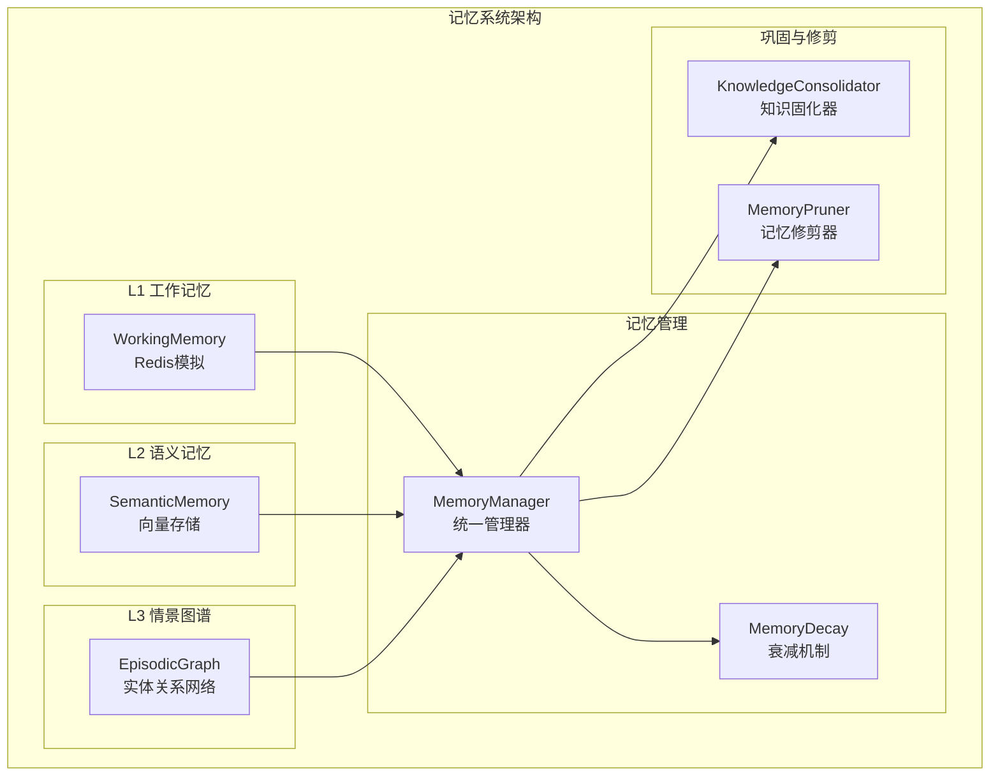
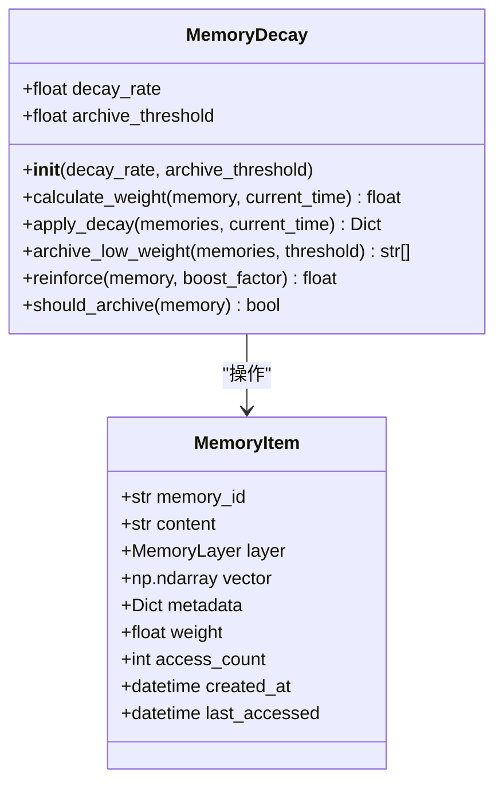
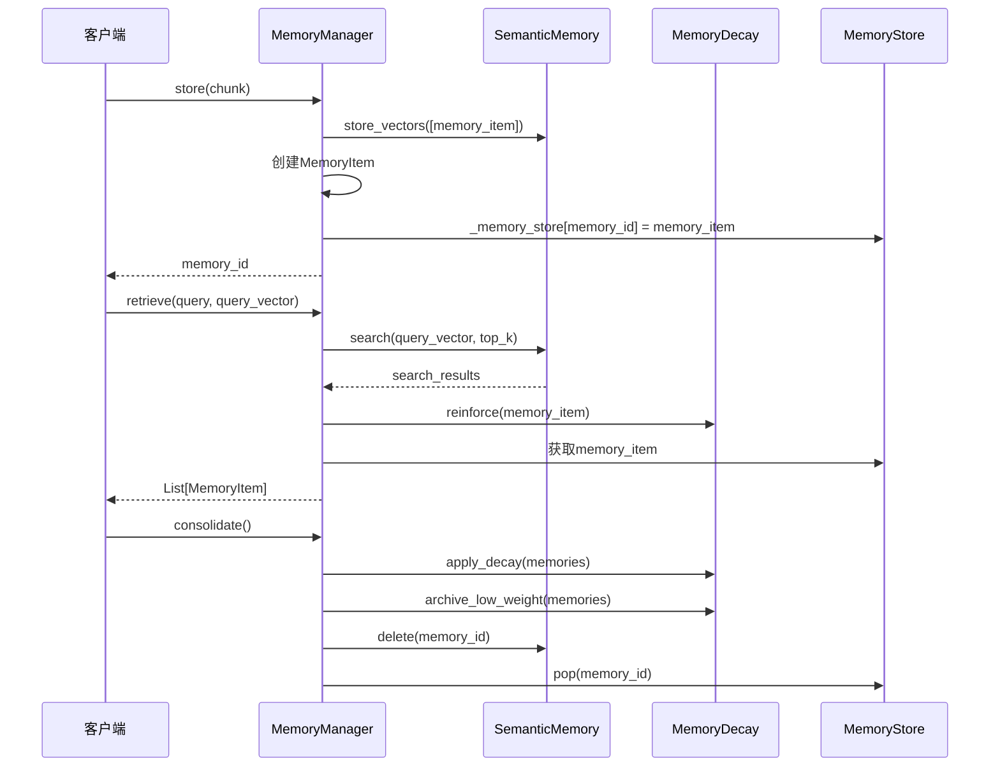
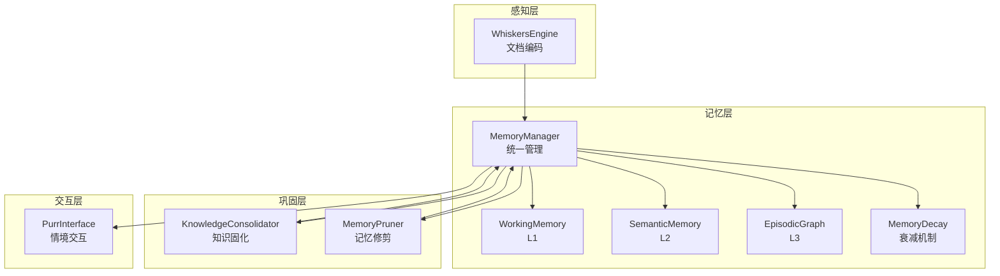
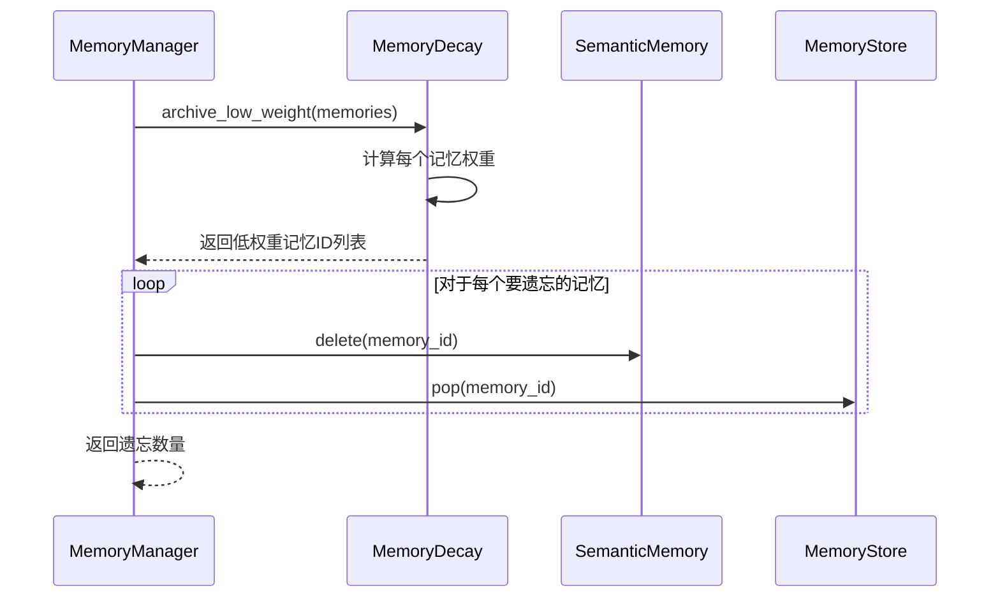
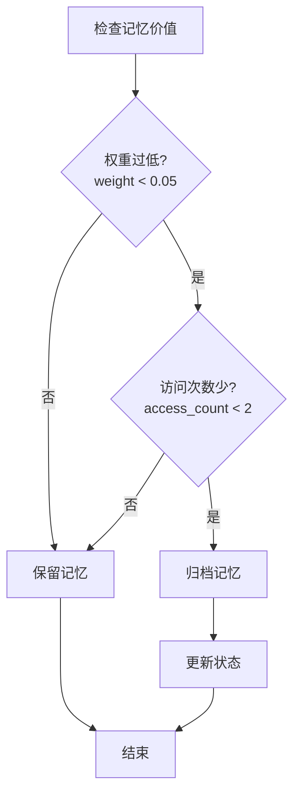
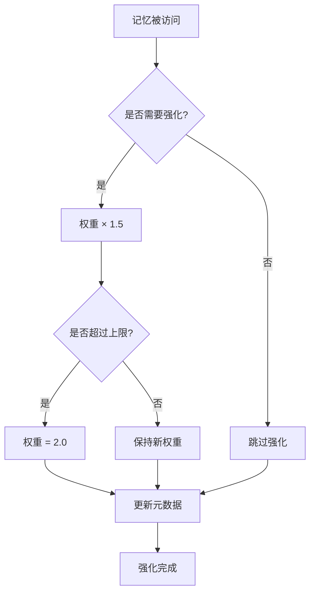
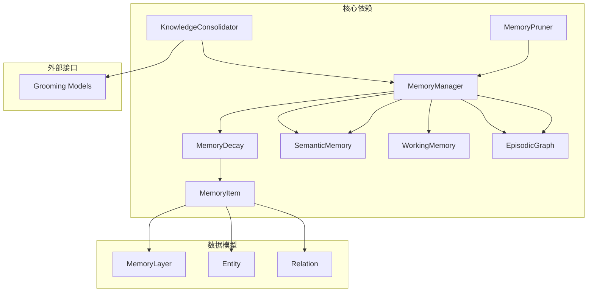
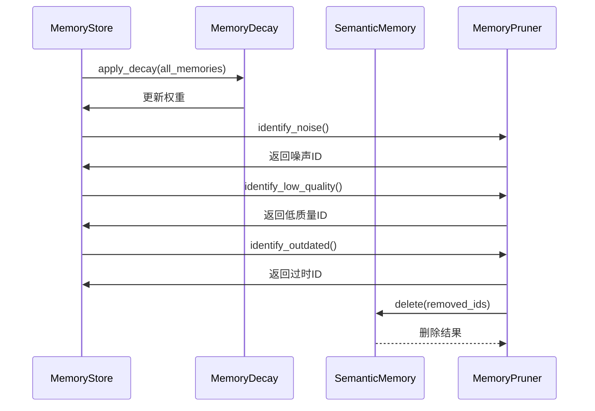

# 记忆衰减与巩固

<cite>
**本文档引用的文件**
- [src/memory/decay.py](file://src/memory/decay.py)
- [src/memory/manager.py](file://src/memory/manager.py)
- [src/memory/models.py](file://src/memory/models.py)
- [src/memory/working_memory.py](file://src/memory/working_memory.py)
- [src/memory/semantic_memory.py](file://src/memory/semantic_memory.py)
- [src/memory/episodic_graph.py](file://src/memory/episodic_graph.py)
- [src/grooming/consolidator.py](file://src/grooming/consolidator.py)
- [src/grooming/pruner.py](file://src/grooming/pruner.py)
- [src/grooming/models.py](file://src/grooming/models.py)
- [example/example_usage.py](file://example/example_usage.py)
</cite>

## 目录
1. [简介](#简介)
2. [项目结构](#项目结构)
3. [核心组件](#核心组件)
4. [架构概览](#架构概览)
5. [详细组件分析](#详细组件分析)
6. [依赖关系分析](#依赖关系分析)
7. [性能考虑](#性能考虑)
8. [故障排除指南](#故障排除指南)
9. [结论](#结论)

## 简介

NecoRAG项目中的记忆衰减与巩固机制是受生物记忆系统启发而设计的智能记忆管理系统。该系统模拟人类大脑的记忆巩固过程，通过创新的指数衰减算法、访问频率因子和动态权重计算，实现了高效的知识管理与优化。

本机制的核心创新在于：
- **指数衰减公式**：模拟生物记忆的自然衰减过程
- **访问频率因子**：通过log10函数量化知识的重要性
- **动态权重计算**：实时调整记忆权重以反映其价值
- **主动遗忘策略**：自动识别并移除低价值记忆
- **低价值记忆归档机制**：将不常用但仍有潜在价值的记忆进行归档

## 项目结构

NecoRAG采用分层架构设计，将记忆系统分为三个层次：



**图表来源**
- [src/memory/working_memory.py:11-120](file://src/memory/working_memory.py#L11-L120)
- [src/memory/semantic_memory.py:21-179](file://src/memory/semantic_memory.py#L21-L179)
- [src/memory/episodic_graph.py:10-194](file://src/memory/episodic_graph.py#L10-L194)
- [src/memory/manager.py:16-186](file://src/memory/manager.py#L16-L186)

**章节来源**
- [src/memory/working_memory.py:1-120](file://src/memory/working_memory.py#L1-L120)
- [src/memory/semantic_memory.py:1-179](file://src/memory/semantic_memory.py#L1-L179)
- [src/memory/episodic_graph.py:1-194](file://src/memory/episodic_graph.py#L1-L194)
- [src/memory/manager.py:1-186](file://src/memory/manager.py#L1-L186)

## 核心组件

### 记忆衰减机制 (MemoryDecay)

MemoryDecay类实现了创新的记忆权重衰减算法，其核心公式为：

**weight(t) = initial_weight × e^(-λt) × access_frequency**

其中：
- **λ (衰减速率)**：控制记忆衰减速度的参数
- **t (时间)**：距离创建时间的天数
- **access_frequency**：基于访问次数的频率因子



**图表来源**
- [src/memory/decay.py:11-155](file://src/memory/decay.py#L11-L155)
- [src/memory/models.py:19-31](file://src/memory/models.py#L19-L31)

### 记忆管理器 (MemoryManager)

MemoryManager作为统一管理器，协调三层记忆系统的工作：



**图表来源**
- [src/memory/manager.py:48-186](file://src/memory/manager.py#L48-L186)
- [src/memory/semantic_memory.py:50-179](file://src/memory/semantic_memory.py#L50-L179)
- [src/memory/decay.py:72-155](file://src/memory/decay.py#L72-L155)

**章节来源**
- [src/memory/decay.py:1-155](file://src/memory/decay.py#L1-L155)
- [src/memory/manager.py:1-186](file://src/memory/manager.py#L1-L186)

## 架构概览

### 三层记忆系统协调机制



**图表来源**
- [src/memory/manager.py:16-47](file://src/memory/manager.py#L16-L47)
- [src/grooming/consolidator.py:9-34](file://src/grooming/consolidator.py#L9-L34)
- [src/grooming/pruner.py:10-40](file://src/grooming/pruner.py#L10-L40)

### 记忆巩固流程

```mermaid
flowchart TD
Start([开始巩固周期]) --> Decay[应用衰减算法]
Decay --> CalcWeight[计算新权重<br/>weight(t) = w₀ × e^(-λt) × log₁₀(access_count+1)]
CalcWeight --> ArchiveCheck{权重 < 阈值?}
ArchiveCheck --> |是| Archive[归档低价值记忆]
ArchiveCheck --> |否| Keep[保留记忆]
Archive --> Remove[从语义记忆删除]
Remove --> UpdateStore[更新统一存储]
Keep --> End([巩固完成])
UpdateStore --> End
```

**图表来源**
- [src/memory/decay.py:39-118](file://src/memory/decay.py#L39-L118)
- [src/memory/manager.py:149-167](file://src/memory/manager.py#L149-L167)

## 详细组件分析

### 记忆衰减算法详解

#### 指数衰减公式实现

指数衰减公式是记忆衰减的核心数学模型：

**公式：weight(t) = initial_weight × e^(-λt)**

其中：
- **initial_weight**：初始权重（通常为1.0）
- **λ (lambda)**：衰减速率参数，控制衰减速度
- **t**：经过的时间（天）

```mermaid
graph LR
subgraph "时间轴"
T0[T0 创建] --> T1[T1] --> T2[T2] --> TN[Tn]
end
subgraph "权重变化"
W0[W0] --> WD[WD = W0 × e^(-λt)] --> WF[WF = WD × log₁₀(access_count+1)]
end
T0 --> W0
T1 --> WD
T2 --> WF
```

**图表来源**
- [src/memory/decay.py:39-70](file://src/memory/decay.py#L39-L70)

#### 访问频率因子

访问频率因子通过以下公式计算：

**frequency_factor = 1 + log₁₀(access_count + 1)**

这个设计有以下特点：
- **log₁₀函数**：对低频访问进行放大，高频访问增长放缓
- **加1偏移**：确保即使从未被访问的记忆也有基础权重
- **线性放大**：1次访问增加1，10次访问增加约1.3，100次访问增加约2

#### 动态权重计算流程

```mermaid
flowchart TD
Input[输入记忆项] --> CalcTime[计算时间间隔<br/>秒 → 天]
CalcTime --> ExpDecay[指数衰减计算<br/>w × e^(-λt)]
ExpDecay --> LogFactor[访问频率因子<br/>1 + log₁₀(count+1)]
LogFactor --> FinalWeight[最终权重<br/>衰减权重 × 频率因子]
FinalWeight --> Output[输出新权重]
```

**图表来源**
- [src/memory/decay.py:39-70](file://src/memory/decay.py#L39-L70)

**章节来源**
- [src/memory/decay.py:11-71](file://src/memory/decay.py#L11-L71)

### 主动遗忘策略

#### 归档阈值机制

系统使用两个关键阈值来控制记忆的存留：

| 参数 | 默认值 | 作用 | 调优建议 |
|------|--------|------|----------|
| decay_rate | 0.1 | 衰减速率 | 0.05-0.2之间调优 |
| archive_threshold | 0.05 | 归档阈值 | 0.01-0.1之间调优 |

#### 遗忘执行流程



**图表来源**
- [src/memory/manager.py:168-185](file://src/memory/manager.py#L168-L185)
- [src/memory/decay.py:96-118](file://src/memory/decay.py#L96-L118)

**章节来源**
- [src/memory/manager.py:168-185](file://src/memory/manager.py#L168-L185)
- [src/grooming/pruner.py:103-137](file://src/grooming/pruner.py#L103-L137)

### 低价值记忆归档机制

#### 归档决策标准

系统采用多维度标准来判断记忆是否应该归档：



#### 归档执行策略

归档机制同时考虑以下因素：
- **权重阈值**：低于0.05的记忆优先归档
- **访问频率**：很少被访问的记忆
- **内容质量**：短文本且低权重的内容
- **时效性**：长时间未被访问的记忆

**章节来源**
- [src/grooming/pruner.py:71-118](file://src/grooming/pruner.py#L71-L118)

### 强化机制

#### 记忆强化算法

当记忆被访问时，系统会对其进行强化：

**强化后权重 = 原权重 × 1.5**
**访问计数 + 1**
**最后访问时间更新为当前时间**

强化机制的设计考虑：
- **boost_factor = 1.5**：适度增强，避免过度强化
- **权重上限限制**：最大权重不超过2.0
- **访问频率奖励**：鼓励频繁使用的知识

#### 强化触发条件



**图表来源**
- [src/memory/decay.py:120-142](file://src/memory/decay.py#L120-L142)

**章节来源**
- [src/memory/decay.py:120-142](file://src/memory/decay.py#L120-L142)

## 依赖关系分析

### 组件间依赖关系



**图表来源**
- [src/memory/decay.py:8](file://src/memory/decay.py#L8)
- [src/memory/manager.py:11](file://src/memory/manager.py#L11)
- [src/grooming/consolidator.py:6](file://src/grooming/consolidator.py#L6)

### 数据流分析



**图表来源**
- [src/memory/manager.py:149-167](file://src/memory/manager.py#L149-L167)
- [src/grooming/pruner.py:41-69](file://src/grooming/pruner.py#L41-L69)

**章节来源**
- [src/memory/manager.py:149-185](file://src/memory/manager.py#L149-L185)
- [src/grooming/pruner.py:1-157](file://src/grooming/pruner.py#L1-L157)

## 性能考虑

### 时间复杂度分析

| 操作 | 时间复杂度 | 空间复杂度 | 说明 |
|------|------------|------------|------|
| 单个记忆权重计算 | O(1) | O(1) | 指数运算和对数运算 |
| 批量衰减应用 | O(n) | O(n) | n为记忆数量 |
| 归档检查 | O(n) | O(k) | k为归档数量 |
| 记忆修剪 | O(n) | O(m) | m为移除数量 |
| 强化操作 | O(1) | O(1) | 常数时间更新 |

### 内存优化策略

1. **惰性加载**：只在需要时加载记忆到内存
2. **批量处理**：支持批量衰减和批量强化
3. **阈值优化**：通过调整阈值平衡存储和性能
4. **缓存机制**：利用访问频率因子减少重复计算

### 并发处理

系统支持并发操作的关键点：
- **无状态设计**：MemoryDecay类无内部状态，支持并发调用
- **原子操作**：强化和权重更新为原子操作
- **线程安全**：依赖Python的GIL保证基本线程安全

## 故障排除指南

### 常见问题及解决方案

#### 记忆权重异常

**问题**：记忆权重异常增大或减小
**可能原因**：
- 衰减速率设置不当
- 访问计数异常
- 时间戳错误

**解决方法**：
1. 检查decay_rate参数范围（0.05-0.2）
2. 验证access_count的正确性
3. 确认created_at和last_accessed时间戳

#### 归档误判

**问题**：重要记忆被错误归档
**可能原因**：
- 归档阈值过低
- 访问频率因子过大
- 内容质量判断标准过于严格

**解决方法**：
1. 提高archive_threshold至0.1-0.2
2. 调整decay_rate至0.05-0.1
3. 增加内容长度阈值

#### 性能问题

**问题**：大量记忆处理时性能下降
**可能原因**：
- 记忆数量过多
- 批处理大小不当
- 阈值设置不合理

**解决方法**：
1. 分批处理记忆（每次处理1000-5000条）
2. 调整归档阈值以减少处理量
3. 使用更高效的存储后端

**章节来源**
- [src/memory/decay.py:24-37](file://src/memory/decay.py#L24-L37)
- [src/grooming/pruner.py:20-39](file://src/grooming/pruner.py#L20-L39)

## 结论

NecoRAG的记忆衰减与巩固机制通过创新的数学模型和智能化策略，实现了接近生物记忆系统的高效知识管理。该系统的主要优势包括：

### 技术创新点

1. **生物学启发的数学模型**：基于指数衰减的自然记忆规律
2. **多因子权重计算**：结合时间、频率和质量的综合评估
3. **主动遗忘策略**：自动识别并移除低价值记忆
4. **分层协调机制**：L1-L3三层记忆的有机配合

### 实际应用价值

- **提高检索质量**：通过主动遗忘提升相关记忆的权重
- **降低存储成本**：自动清理低价值记忆
- **增强系统性能**：减少无效数据对检索的影响
- **模拟人类记忆**：提供更自然的AI交互体验

### 未来发展方向

1. **机器学习集成**：引入ML模型预测记忆价值
2. **自适应阈值**：根据系统负载动态调整参数
3. **分布式处理**：支持大规模记忆系统的扩展
4. **实时监控**：提供记忆系统的实时性能监控

该机制为构建智能AI系统提供了坚实的理论基础和实践指导，是实现真正智能记忆管理的重要里程碑。