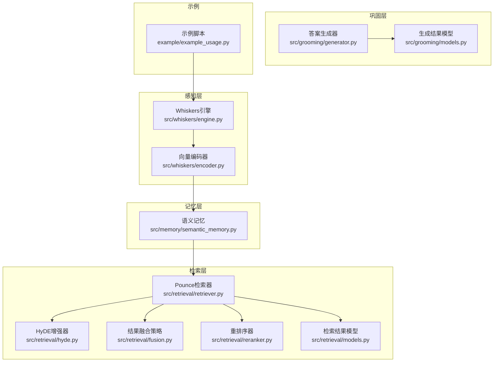
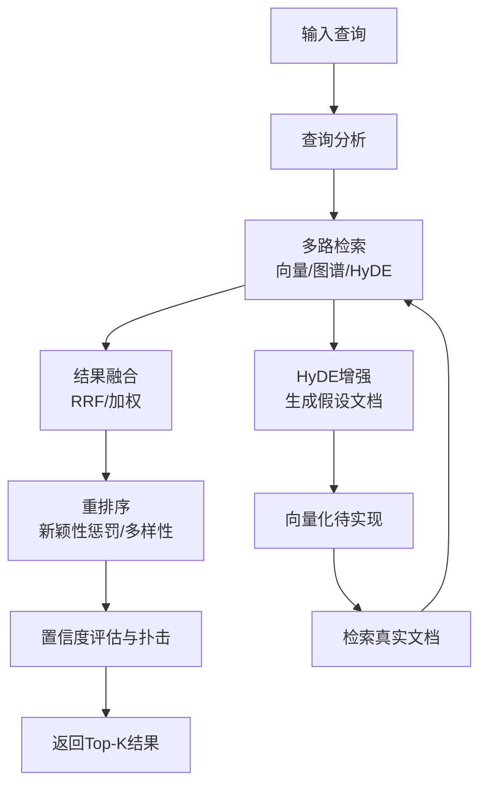
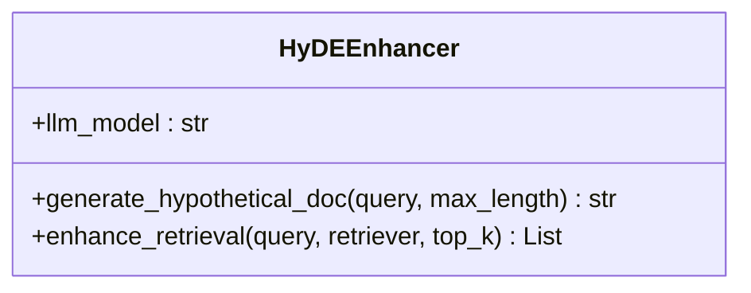
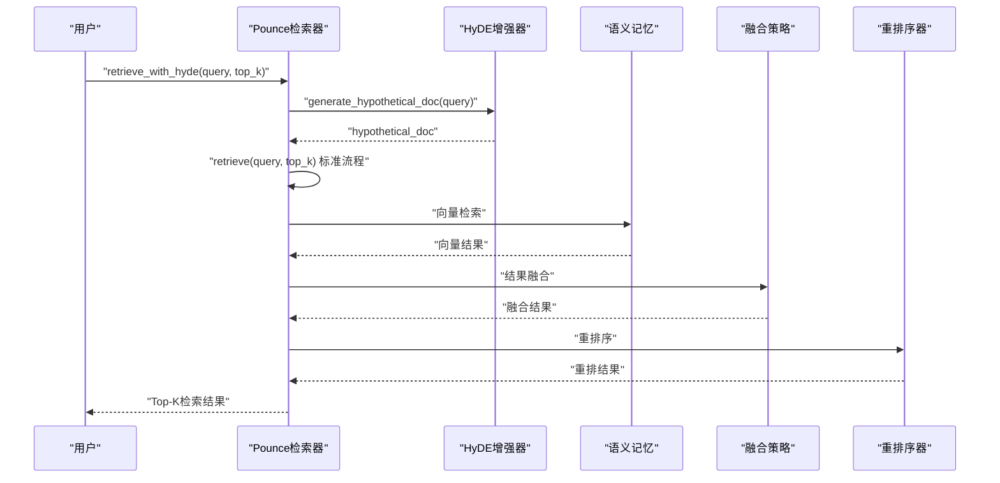
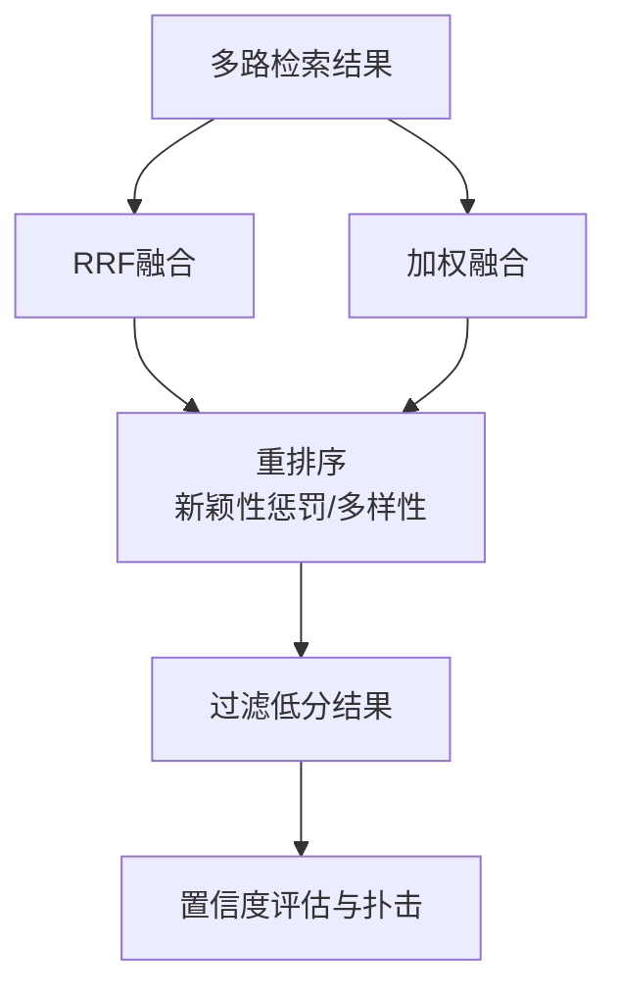
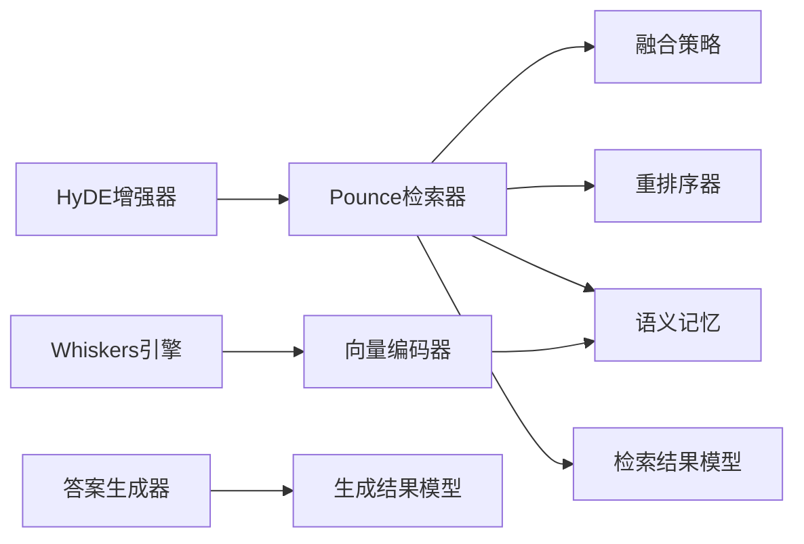

# HyDE增强技术

<cite>
**本文引用的文件**
- [src/retrieval/hyde.py](file://src/retrieval/hyde.py)
- [src/retrieval/retriever.py](file://src/retrieval/retriever.py)
- [src/retrieval/models.py](file://src/retrieval/models.py)
- [src/retrieval/fusion.py](file://src/retrieval/fusion.py)
- [src/retrieval/reranker.py](file://src/retrieval/reranker.py)
- [src/retrieval/README.md](file://src/retrieval/README.md)
- [src/whiskers/engine.py](file://src/whiskers/engine.py)
- [src/whiskers/encoder.py](file://src/whiskers/encoder.py)
- [src/memory/semantic_memory.py](file://src/memory/semantic_memory.py)
- [src/grooming/generator.py](file://src/grooming/generator.py)
- [src/grooming/models.py](file://src/grooming/models.py)
- [example/example_usage.py](file://example/example_usage.py)
</cite>

## 目录
1. [简介](#简介)
2. [项目结构](#项目结构)
3. [核心组件](#核心组件)
4. [架构总览](#架构总览)
5. [详细组件分析](#详细组件分析)
6. [依赖分析](#依赖分析)
7. [性能考虑](#性能考虑)
8. [故障排查指南](#故障排查指南)
9. [结论](#结论)
10. [附录](#附录)

## 简介
本文件围绕HyDE增强技术（假设文档嵌入，Hypothetical Document Embeddings）展开，系统阐述其核心思想、解决的问题、与检索系统的集成方式以及在NecoRAG中的实现现状与扩展路径。HyDE通过让LLM为查询生成“假设答案”，再将该假设文档向量化并用于真实文档检索，从而缓解术语不匹配与模糊查询带来的检索偏差，提升召回质量与相关性。

## 项目结构
HyDE位于检索层（Layer 3），与向量检索、图谱检索、结果融合、重排序等模块协同工作，并通过Pounce控制器实现智能终止与性能优化。整体检索流程包含查询分析、多路检索、结果融合、重排序、置信度评估与扑击决策等阶段。

图表来源
- [src/retrieval/hyde.py:1-81](file://src/retrieval/hyde.py#L1-L81)
- [src/retrieval/retriever.py:108-227](file://src/retrieval/retriever.py#L108-L227)
- [src/retrieval/fusion.py:9-128](file://src/retrieval/fusion.py#L9-L128)
- [src/retrieval/reranker.py:10-179](file://src/retrieval/reranker.py#L10-L179)
- [src/retrieval/models.py:9-29](file://src/retrieval/models.py#L9-L29)
- [src/whiskers/engine.py:14-130](file://src/whiskers/engine.py#L14-L130)
- [src/whiskers/encoder.py:11-98](file://src/whiskers/encoder.py#L11-L98)
- [src/memory/semantic_memory.py:21-179](file://src/memory/semantic_memory.py#L21-L179)
- [src/grooming/generator.py:9-64](file://src/grooming/generator.py#L9-L64)
- [src/grooming/models.py:9-66](file://src/grooming/models.py#L9-L66)
- [example/example_usage.py:12-252](file://example/example_usage.py#L12-L252)

章节来源
- [src/retrieval/README.md:1-352](file://src/retrieval/README.md#L1-L352)
- [example/example_usage.py:94-136](file://example/example_usage.py#L94-L136)

## 核心组件
- HyDE增强器：负责生成假设文档并驱动检索流程（当前为最小实现，后续需接入LLM与向量化）。
- Pounce检索器：整合向量检索、图谱检索、HyDE增强、结果融合与重排序，并通过置信度控制实现智能终止。
- 结果融合策略：支持RRF与加权融合，统一多路检索结果。
- 重排序器：基于新颖性惩罚与多样性保障，提升排序质量。
- 检索结果模型：标准化检索输出，便于后续处理与可视化。

章节来源
- [src/retrieval/hyde.py:9-81](file://src/retrieval/hyde.py#L9-L81)
- [src/retrieval/retriever.py:108-227](file://src/retrieval/retriever.py#L108-L227)
- [src/retrieval/fusion.py:9-128](file://src/retrieval/fusion.py#L9-L128)
- [src/retrieval/reranker.py:10-179](file://src/retrieval/reranker.py#L10-L179)
- [src/retrieval/models.py:9-29](file://src/retrieval/models.py#L9-L29)

## 架构总览
HyDE在检索流程中的位置与作用如下：

图表来源
- [src/retrieval/README.md:60-101](file://src/retrieval/README.md#L60-L101)
- [src/retrieval/retriever.py:140-227](file://src/retrieval/retriever.py#L140-L227)

## 详细组件分析

### HyDE增强器（HyDEEnhancer）
- 职责：生成假设文档，作为检索锚点以缓解术语不匹配与模糊查询问题。
- 当前实现：最小实现版本，直接构造假设文本并限制长度；未接入LLM与向量化。
- 扩展建议：集成真实LLM生成假设答案，并将假设文档向量化后参与检索。

图表来源
- [src/retrieval/hyde.py:9-81](file://src/retrieval/hyde.py#L9-L81)

章节来源
- [src/retrieval/hyde.py:9-81](file://src/retrieval/hyde.py#L9-L81)
- [src/retrieval/README.md:60-79](file://src/retrieval/README.md#L60-L79)

### Pounce检索器与HyDE集成
- HyDE增强检索流程：当启用HyDE时，检索器先生成假设文档，随后执行标准检索流程（向量/图谱融合/重排/过滤/置信度评估）。
- 当前实现：假设文档生成已完成，但缺少向量化与向量检索调用，仍以原始查询参与检索。
- 控制流示意：

图表来源
- [src/retrieval/retriever.py:203-227](file://src/retrieval/retriever.py#L203-L227)
- [src/retrieval/hyde.py:28-52](file://src/retrieval/hyde.py#L28-L52)
- [src/memory/semantic_memory.py:80-118](file://src/memory/semantic_memory.py#L80-L118)
- [src/retrieval/fusion.py:18-70](file://src/retrieval/fusion.py#L18-L70)
- [src/retrieval/reranker.py:41-70](file://src/retrieval/reranker.py#L41-L70)

章节来源
- [src/retrieval/retriever.py:203-227](file://src/retrieval/retriever.py#L203-L227)
- [src/retrieval/hyde.py:28-81](file://src/retrieval/hyde.py#L28-L81)

### 结果融合与重排序
- 融合策略：支持RRF与加权融合，统一多路检索结果并按分数排序。
- 重排序：应用新颖性惩罚与多样性保障，抑制重复并提升多样性。

图表来源
- [src/retrieval/fusion.py:18-128](file://src/retrieval/fusion.py#L18-L128)
- [src/retrieval/reranker.py:41-179](file://src/retrieval/reranker.py#L41-L179)

章节来源
- [src/retrieval/fusion.py:9-128](file://src/retrieval/fusion.py#L9-L128)
- [src/retrieval/reranker.py:10-179](file://src/retrieval/reranker.py#L10-L179)

### 检索结果模型
- 标准化输出字段：memory_id、content、score、source、metadata、retrieval_path。
- 用于不同来源（向量/图谱/融合/HyDE）的结果统一与可视化追踪。

章节来源
- [src/retrieval/models.py:9-29](file://src/retrieval/models.py#L9-L29)

### 与感知层/记忆层的衔接
- Whiskers引擎负责文档解析、分块与向量化，语义记忆提供向量检索能力。
- HyDE增强的假设文档可复用相同编码与检索路径，实现端到端流程。

章节来源
- [src/whiskers/engine.py:14-130](file://src/whiskers/engine.py#L14-L130)
- [src/whiskers/encoder.py:11-98](file://src/whiskers/encoder.py#L11-L98)
- [src/memory/semantic_memory.py:21-179](file://src/memory/semantic_memory.py#L21-L179)

### 使用示例与效果评估
- 示例脚本展示了启用HyDE的检索流程与检索路径追踪。
- 效果评估可参考检索层文档中的指标与配置参数，结合业务场景进行A/B对比与人工评估。

章节来源
- [example/example_usage.py:94-136](file://example/example_usage.py#L94-L136)
- [src/retrieval/README.md:305-337](file://src/retrieval/README.md#L305-L337)

## 依赖分析
- HyDE增强器依赖Pounce检索器与检索结果模型。
- Pounce检索器依赖HyDE增强器、融合策略、重排序器与语义记忆。
- 感知层与记忆层为检索提供向量化与存储能力。
- 巩固层（生成器与模型）依赖检索结果进行答案生成与质量评估。

图表来源
- [src/retrieval/hyde.py:9-81](file://src/retrieval/hyde.py#L9-L81)
- [src/retrieval/retriever.py:108-227](file://src/retrieval/retriever.py#L108-L227)
- [src/retrieval/fusion.py:9-128](file://src/retrieval/fusion.py#L9-L128)
- [src/retrieval/reranker.py:10-179](file://src/retrieval/reranker.py#L10-L179)
- [src/retrieval/models.py:9-29](file://src/retrieval/models.py#L9-L29)
- [src/whiskers/engine.py:14-130](file://src/whiskers/engine.py#L14-L130)
- [src/whiskers/encoder.py:11-98](file://src/whiskers/encoder.py#L11-L98)
- [src/memory/semantic_memory.py:21-179](file://src/memory/semantic_memory.py#L21-L179)
- [src/grooming/generator.py:9-64](file://src/grooming/generator.py#L9-L64)
- [src/grooming/models.py:9-66](file://src/grooming/models.py#L9-L66)

## 性能考虑
- HyDE当前实现未进行向量化，因此不会引入额外的嵌入开销；但检索性能与标准流程一致。
- 启用HyDE可能增加一次假设文档生成与一次检索调用，需权衡延迟与收益。
- 建议在模糊查询、术语不匹配场景下优先启用HyDE；对简单明确查询可关闭以节省资源。
- 通过Pounce控制器的阈值与边际收益策略，可在达到足够置信度时提前终止，减少无效计算。

章节来源
- [src/retrieval/retriever.py:16-88](file://src/retrieval/retriever.py#L16-L88)
- [src/retrieval/README.md:305-327](file://src/retrieval/README.md#L305-L327)

## 故障排查指南
- HyDE未生效：确认Pounce检索器初始化时enable_hyde为True，并调用retrieve_with_hyde而非retrieve。
- 检索结果为空：检查语义记忆是否已存储向量，确认向量维度与编码器一致。
- 重排序异常：核对重排序器参数（新颖性权重、多样性权重、冗余惩罚）是否合理。
- 结果融合异常：确保多路检索均返回非空结果，且memory_id唯一。

章节来源
- [src/retrieval/retriever.py:115-135](file://src/retrieval/retriever.py#L115-L135)
- [src/retrieval/reranker.py:20-39](file://src/retrieval/reranker.py#L20-L39)
- [src/retrieval/fusion.py:33-70](file://src/retrieval/fusion.py#L33-L70)

## 结论
HyDE增强技术通过“假设答案”桥接查询与真实文档，有效缓解术语不匹配与模糊查询问题。在NecoRAG中，HyDE已与多路检索、结果融合与重排序形成闭环，并通过Pounce机制实现智能终止。当前实现为最小可用版本，后续应完善LLM生成与向量化流程，以充分发挥HyDE在召回质量与相关性方面的潜力。

## 附录

### HyDE技术的理论基础与实现要点
- 理论基础：假设文档嵌入（HyDE）通过LLM生成“假设答案”作为查询锚点，使检索更贴近用户意图，减少术语差异导致的漏检。
- 实现要点：生成假设文档 → 向量化（待实现） → 向量检索 → 结果融合与重排序 → 置信度评估与扑击。

章节来源
- [src/retrieval/README.md:60-79](file://src/retrieval/README.md#L60-L79)

### 与其他检索策略的结合方式
- 与向量检索结合：HyDE生成的假设文档向量与查询向量共同参与检索，提升召回质量。
- 与图谱检索结合：HyDE可辅助图谱实体识别与路径推理，提高关联性。
- 与重排序结合：HyDE结果可参与重排序，结合新颖性惩罚与多样性保障，提升最终排序质量。

章节来源
- [src/retrieval/README.md:260-287](file://src/retrieval/README.md#L260-L287)